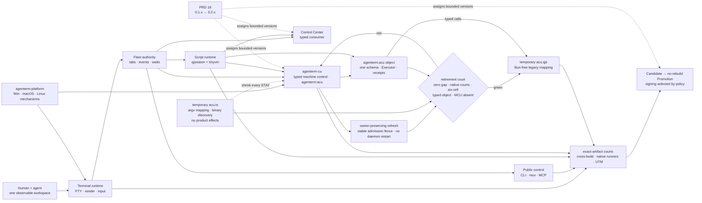

# AgenTerm product tree

Parent: [`~/repos/index.md`](~/repos/index.md) — the cross-repo memory palace.
This file is the product-level palace; `prd/PRD_02_*.md` are the capability-level
ones. Same discipline at three scales: one owner per fact, link rather than copy,
record a retraction instead of rewriting a judgement, and treat `[x]` as an
evidence-backed commitment rather than an opinion.

Status: active development
Platform: v0.1.16 publishes the six `{win,lnx,osx} × {x86_64,aarch64}` cells;
  platform-specific capability depth remains evidence-scoped.
Current default shell: Windows uses the real system `cmd.exe`; Unix GUI uses
`$SHELL` with `/bin/sh` fallback.
Future default-shell candidate: `agenterm-bash.exe`, only after its
clean-machine gate passes; no release version is committed

AgenTerm is a native terminal and local fleet workspace for people and
AI agents across Windows, Linux and macOS. The hosts share product semantics,
protocol, clients and terminal kernel while native adapters own OS mechanisms.
Its window is the bridge, the tab tree organizes the fleet, shells
are crew workspaces, and the local control plane lets people and agents observe
and steer the same state. Scripting reuses that public contract rather than
bypassing it. Human interaction and local CLI automation operate on the same
tabs, PTYs, drafts, settings, and observable state. A process exiting never
silently destroys its tab.

The repository ships the workbench described above. The lightweight terminal
host that used to ship beside it — `agenterm-con`, no server, Fleet, mux, MCP or
script runtime — left on 2026-08-23 for its own repository as
[`partnernetsoftware/minicon`](https://github.com/partnernetsoftware/minicon)
(locally `../minicon`). It still reuses this repo's `agenterm-platform` and
`agenterm-ui-core` through a pinned git revision, so the dependency direction is
minicon → agenterm and never the reverse. Neither product may claim a capability
or a green status from the other's evidence.

The visual language favors industrial confidence over decoration: repeated
integer-grid spacing, solid right-angle connections, strict baseline
alignment, restrained colors, and explicit boundaries should make the fleet
feel precisely assembled and dependable.

AgenTerm competes by keeping the visible product simple and practical while
making the underlying system stable, observable, programmable, and open-ended.
New UI is justified by lower interaction cost, not feature count: advanced
power should prefer discoverable commands and programming interfaces, and
secondary controls should stay contextual or hidden by default when that keeps
the daily workspace quiet.

Terminal durability comes from deterministic two-dimensional state, not from
nostalgia. AgenTerm extends that contract from a character grid to the whole
agent fleet: humans and agents must be able to address, read, wait for, and
control the same tree nodes, focus, input, viewport, process lifecycle, and
rendered evidence precisely.

Legend: `[x]` shipped, `[~]` partial, `[ ]` planned.

## Documentation contract

This file is the canonical product entry point, product constitution, and
second-level tree. Linked `prd/PRD_*.md` modules own third-level requirements,
decisions, status, and acceptance detail. A requirement has exactly one owning
module; other documents link to it instead of copying it.

A module may be a subtree root when one product is large enough to need its own
second-level tree. Two product subtrees exist today: `agenterm-cu` (28, with
29–32) and `agenterm-mobile` (33, children split later). Slots 23–27 held the
lightweight terminal host until it moved to the `minicon` repository, where its
subtree now lives. The root owns the product definition, boundary, invariants and
gates; the children own third-level requirements. A shared kernel consumed by
more than one product keeps its requirement in the owning shared module and is
referenced, not copied, from the subtree.

A subtree may be opened before a product exists, to hook newly accepted scope
into the tree so it cannot accumulate inside an unrelated module. Such a subtree
carries only `[ ]` requirements until its own evidence arrives; opening it is
not a version commitment.

Public version plans live under [`plan/`](plan/). They record sequencing,
dependencies, risks, decisions, and delivery history, but remain execution
projections rather than canonical product truth. Every accepted product scope
or capability-status change also belongs in its owning PRD module.
Living vs archived plan files: [`plan/README.md`](plan/README.md).

Current source layout (layers, bins, hot files, structural bans) lives in
[`plan/ARCHITECTURE.md`](plan/ARCHITECTURE.md). Version plans link to it; they
do not redraw a second living tree.

Stable public technical contracts that are too detailed for an owning PRD
module may live under [`docs/`](docs/). Every such specification links back to
exactly one owning PRD module; it defines interface semantics and conformance,
not independent product scope or shipped status.

Machine-readable shipped capability/evidence alignment lives in
[`prd/alignment-contract.json`](prd/alignment-contract.json).

Later executable names, intelligence approaches, and external-runtime
integrations are gated product or research hypotheses unless a roadmap
milestone explicitly assigns them to a release. Their presence in the product
tree does not promise a version or implementation strategy.

## Product tree

```text
AgenTerm — local agent & process fleet work OS
│
├─ 终端与运行时
│  ├─ 01 Terminal runtime        ConPTY、渲染、输入、选择、滚动、性能
│  ├─ 03 Default shell          agenterm-bash.exe 策略与兼容门
│  └─ 16 tmux/RMUX compatibility  兼容矩阵、显式差异、一致性证据
│
├─ 工作区与权威
│  ├─ 06 Human workspace        Tabs、composer、settings、持久化、状态栏
│  ├─ 02 Executable family      二进制角色、边界、预算、sidecar 归属
│  ├─ 05 Fleet multiplexer      agenterm cli mux（tmux/RMUX 兼容控制）
│  ├─ 08 Observable Fleet       纪元/序列日志、读取、等待、缺口、重启
│  └─ 07 Agent control plane    观察、控制、协议、身份、确定性等待
│
├─ 自动化与智能
│  ├─ 10 Script runtime family  本地无限制运行时；当前 .qjs 由 qjswasm/tinyvm 执行
│  ├─ 11 MCP orchestration      agenterm cli mcp（只读 MCP → 受管工具/流/调度）
│  ├─ 12 Specialized intelligence  agenterm-ai.exe（未指派研究方向的证据门）
│  └─ 13 Local LLM gateway      agenterm-llm-gateway.exe（受管网关假设门）
│
├─ 分发与治理
│  ├─ 04 Optional components    agenterm-softmgr.exe（签名清单/安装/更新/回滚）
│  ├─ 09 Self-hosted dev loop   构建、暂存、更新可见性、安全迭代
│  ├─ 14 Research provenance    源码审查、许可、来源、独立实现
│  ├─ 15 Command line           agenterm cli（公共命令/发现/输出契约）
│  └─ 17 Delivery and quality   构建、测试、产物、发布门、回归预算
│
├─ 平台抽象
│  └─ 20 Native platform        Win/macOS/Linux 原生适配（窗口/输入/IME/DPI/剪贴板/字体）
│
├─ 23–27（已迁出）        轻量终端宿主：源码与 PRD 子树 2026-08-23 迁至独立仓 minicon
│
├─ agenterm-cu（computer-use 子树 · partial；六格 execute-only Candidate court 已接线、待首跑）
│  └─ 28 agenterm-cu            自有 computer-use 底座：定义、边界、不变量、晋升门
│     ├─ transition             `acu.ts` 只做旧 argv 映射、binary 发现与 stdio/exit 转发
│     │                       每个 `STAY` 都是待消除的下架阻塞，不得在 TypeScript 里新增 effect
│     ├─ convergence            qjswasm embedder 提供 `agenterm:acu` 对象（qjs 中为 `acu`）
│     │                       CLI / MCP / qjs 共用 typed schema、Executor、error 与 receipt
│     ├─ Bun-free bridge         `agenterm:acu` 先可用；零 `STAY` + MCU-absent 门绿后，
│     │                       才用 `acu.qjs` 接替过渡薄壳；它只保留旧语法兼容
│     │                       不复制机制、权威、验证，也不把 Rust CU 重写进 JavaScript
│     ├─ retirement             调用者迁到 typed `acu` 对象后，`acu.qjs` 也可归档
│     ├─ active frontier        先补齐 MCU 必需能力与原生证据；ledger 当前 131 叶：
│     │                       native 31 / delegated 31 / platform-limited 53 / gap 12 / retired 4
│     │                       device claim/lease/I/O 已有 macOS + Linux 双 ISA qjswasm court，
│     │                       Windows COM court 待证；network-dns 已从 gap 降为 platform-limited，
│     │                       macOS + Linux 双 ISA + Windows ARM journey 绿；Win x86 court 的
│     │                       interactive agent 在 180s/360s 均无 nonce，属基础设施阻塞、无产品判决
│     │                       rich ps 已由有界过滤/采样/树详情 + qjswasm macOS court 从 gap 晋级 native
│     │                       power status 已绑定安装伪身份 + 原生 boot instance；macOS qjswasm court 绿，
│     │                       Linux/Windows 待原生复跑；audio 状态/计划已由 macOS CoreAudio 原生承接，
│     │                       Linux/Windows typed unsupported，真实声音变更 court 待跑；service 已有
│     │                       macOS/Linux 原生 inventory/status + user plan/apply、防重放与 qjswasm 只读 court，
│     │                       旧 one-call 兼容、system privilege provider 和跨平台 mutation court 未收口，故静态 STAY 仍为 1
│     │                       login-session 已有 macOS 原生有界 inventory、精确会话短时 plan、
│     │                       持久化防重放与锁定回读；只读 qjswasm 绿，显式可见锁屏 court 待跑
│     │                       external term observe + 显式前台 send 在 macOS/Windows ARM64/Linux x86_64
│     │                       原生 court 全绿，term 过渡标记已移除；其余 ISA 归六格交付门
│     │                       未过 typed-object、零 gap/STAY、六格与 MCU-absent 门前保持 partial
│     ├─ 29 Command surface       抽象命令集、洋葱分层、结构化控件树、确定性等待
│     ├─ 30 Targets & transports  current/ssh/rdp/vnc 目标族、transport、平台后端
│     │  ├─ target family        current（首发）/ ssh / rdp / vnc
│     │  └─ platform a11y backends（agenterm-platform）
│     │     ├─ Windows           native API + UIA
│     │     ├─ macOS             AX (NSAccessibility)
│     │     └─ Linux             AT-SPI2
│     ├─ 31 Authorization & audit 高危面授权、审计、拒绝语义、交付门
│     └─ 32 Window placement     命名摆放（Spectacle 目录）→ `agenterm-cu window-place` + `agenterm-cu host`
│
├─ agenterm-mobile（reach · 全部 planned）
│  └─ 33 Mobile reach           第三 host：连桌面 server，不跑手机 PTY
│     ├─ PWA                    https://agenterm.work/app（复用 docs/ 入口）
│     ├─ Store apps             iOS / Android 占位（审核慢，不急开）
│     └─ QR pairing             扫码绑定桌面客户端，先观察后协同
│
├─ 内部原生底座
│  ├─ 34 agenterm-dyn          publish=false 的极小 native door；当前授权范围持续收口
│  │                          ISA folding / wasm export / libagenterm merge 仍未授权
│  ├─ 35 tinyvm                已迁出到独立仓 partnernetsoftware/tinyvm；agenterm 只作下游 embedder
│  └─ 36 agenterm-qjswasm      自研脚本引擎：.qjs 用纯 Rust 编译成 .wasm，核是 tinyvm（无 JIT）
│                              取代 agenterm-qjs（rquickjs 外链）；不链 QuickJS C；JS 覆盖面按需求长，无原理排除
│
└─ 未来面（里程碑 / 灵感）
   ├─ 18 Focused product roadmap  版本归属、里程碑门、未来产品泳道
   ├─ 19 Inspiration backlog      灵感花园、北极星层、晋升路径（非 shipped）
   ├─ 21 Control Center          agenterm-cc（独立次级工作区：Cockpit/workflow/extension/info）
   └─ 22 Decentralized network   agenterm-net（libp2p/IPFS 独立成熟）
```

## Mermaid flowchart memory palace

The tree answers “what belongs where”; this graph answers “what depends on
what”. Detailed version gates live in PRD 18 rather than being duplicated here.



### Module index

| # | 模块 | 一句话 |
|---|------|--------|
| 01 | [Terminal runtime](prd/PRD_02_01_terminal_runtime.md) | ConPTY、渲染、输入、选择、滚动、性能 |
| 02 | [Executable family](prd/PRD_02_02_executable_family.md) | 二进制角色、边界、预算、sidecar 归属 |
| 03 | [Default shell (`agenterm-bash.exe`)](prd/PRD_02_03_default_shell.md) | 真实 Bash 策略与兼容门 |
| 04 | [Optional component lifecycle (`agenterm-softmgr.exe`)](prd/PRD_02_04_optional_components.md) | 签名清单、安装、更新、回滚、供应链安全 |
| 05 | [Fleet multiplexer (`agenterm cli mux`)](prd/PRD_02_05_fleet_multiplexer.md) | tmux/RMUX 兼容控制 |
| 06 | [Human workspace](prd/PRD_02_06_human_workspace.md) | Tabs、composer、settings、持久化、状态栏、交互设计 |
| 07 | [Agent control plane](prd/PRD_02_07_agent_control_plane.md) | 观察、控制、协议、身份、确定性等待 |
| 08 | [Observable Fleet event core](prd/PRD_02_08_observable_fleet.md) | 纪元/序列日志、读取、等待、缺口、重启、消费者 |
| 09 | [Self-hosted development loop](prd/PRD_02_09_self_hosted_development.md) | 构建、暂存、更新可见性、安全迭代 |
| 10 | [Script runtime family and history](prd/PRD_02_10_rhai_scripting.md) | 当前 `.qjs` 由 qjswasm/tinyvm 执行；Rh 已迁出，Lua/SQL 保留各自具名入口 |
| 11 | [MCP and agentic orchestration (`agenterm cli mcp`)](prd/PRD_02_11_mcp_orchestration.md) | 只读 MCP 先行，再受管工具、流、调度 |
| 12 | [Lightweight specialized intelligence (`agenterm-ai.exe`)](prd/PRD_02_12_specialized_intelligence.md) | 未指派可选智能研究方向的证据门 |
| 13 | [Local LLM gateway (`agenterm-llm-gateway.exe`)](prd/PRD_02_13_llm_gateway.md) | 未指派受管网关假设的安全门 |
| 14 | [Research provenance and clean-room boundary](prd/PRD_02_14_research_provenance.md) | 源码审查、许可、来源、独立实现 |
| 15 | [Command line (`agenterm cli`)](prd/PRD_02_15_command_line.md) | 公共命令、发现、输出契约、生命周期 |
| 16 | [tmux/RMUX compatibility](prd/PRD_02_16_tmux_rmux_compatibility.md) | 兼容矩阵、显式差异、一致性证据 |
| 17 | [Delivery and quality](prd/PRD_02_17_delivery_quality.md) | 构建、测试、产物、发布门、回归预算 |
| 18 | [Focused product roadmap](prd/PRD_02_18_roadmap.md) | 版本归属、里程碑门、未来产品泳道 |
| 19 | [Inspiration backlog and future vision](prd/PRD_02_19_inspiration_and_future_vision.md) | 灵感花园、北极星层、晋升路径（非 shipped） |
| 20 | [Native platform abstraction](prd/PRD_02_20_native_platform.md) | Win/macOS/Linux 窗口/输入/IME/DPI/剪贴板/字体契约 |
| 21 | [Control Center (`agenterm-cc`)](prd/PRD_02_21_control_center.md) | 独立次级工作区：Fleet cockpit/workflow/extension/info 投影 |
| 22 | [Decentralized network (`agenterm-net`)](prd/PRD_02_22_decentralized_network.md) | libp2p 身份、IPFS 内容寻址、存储、传输、服务集成契约 |
| 23–27 | 轻量终端宿主 — **已迁出** | 2026-08-23 起源码与五篇 PRD 在独立仓 [`partnernetsoftware/minicon`](https://github.com/partnernetsoftware/minicon)（本地 `../minicon`）。agenterm 只出 `agenterm-platform` / `agenterm-ui-core`，不再持有其写刀 |
| 28 | [Computer-use foundation (`agenterm-cu`)](prd/PRD_02_28_agenterm_cu.md) | 子树根：唯一 executable、CLI/host、首个运行时 `libagenterm` 消费者；实现 partial，正式交付仍在 qualification |
| 29 | [`agenterm-cu` command surface](prd/PRD_02_29_cu_command_surface.md) | 抽象命令集、洋葱分层契约、结构化控件树观察、确定性等待 |
| 30 | [`agenterm-cu` targets and transports](prd/PRD_02_30_cu_targets_transports.md) | `current`/`ssh`/`rdp`/`vnc` 目标族、transport、**platform a11y backends**（Win UIA / macOS AX / Linux AT-SPI2）、会话模型 |
| 31 | [`agenterm-cu` authorization and safety](prd/PRD_02_31_cu_authorization_safety.md) | 高危能力面的授权模型、审计、拒绝语义、交付门 |
| 32 | [`agenterm-cu` window placement](prd/PRD_02_32_cu_window_placement.md) | 命名窗口摆放与几何合同（Spectacle 收录）；macOS host 已落地，Windows desktop-host ABI 1.7 已通过本机 self-test，正式交付仍在 qualification |
| 33 | [Mobile reach (`agenterm-mobile`)](prd/PRD_02_33_mobile_reach.md) | 手机接入端：PWA 先行（`https://agenterm.work/app`）、商店 App 占位、扫码绑定桌面；无版本承诺 |
| 34 | [`agenterm-dyn` internal native door](prd/PRD_02_34_agenterm_dyn.md) | `publish = false` 的极小 S-expr / intern / bounded `dlcall` crate；当前授权范围持续收口，host-ISA folding、wasm export 与 libagenterm merge 仍未授权 |
| 35 | `tinyvm` standard WebAssembly VM — **已迁出** | 2026-08-22 起源码与 PRD 在独立仓 [`partnernetsoftware/tinyvm`](https://github.com/partnernetsoftware/tinyvm)（本地 `../tinyvm`）。iOS 边界下自有、跨平台、可预算的 WASM VM，核 <100KiB。agenterm 不再持有其写刀 |
| 36 | [`agenterm-qjswasm` 自研脚本引擎](prd/PRD_02_36_agenterm_qjswasm.md) | `.qjs` 用**纯 Rust** 编译成 `.wasm`，`.wasm` 直接跑，核是 tinyvm（无 JIT、装载期校验、上限在核）。不链 QuickJS C、不用 rquickjs，**取代 `agenterm-qjs`**（归档门见该文档）。「AOT」只指到 wasm 码不到机器码。JS 覆盖面是**排期不是天花板**（运行时自带、一起编进 wasm），**无原理排除**——`eval` 走宿主重编 + 跨实例链接，tinyvm 已支持。执行核不生成机器码是 tinyvm 产品定义。M0–M2 已落地（编译器在上游 `tinyvm-qjs`，本 crate 是业务层）。**取代 `agenterm-qjs` 与 `agenterm-wasmcore`**：前者 **2026-08-28 已归档**（三门全绿，crate 摘除，`rquickjs` 出依赖树）；后者 **2026-08-28 一并归档**（政委重申：两个 crate 都归档，产品线收到 qjswasm）。桌面端的 JIT/AOT 方向**不放弃，但改从自研线长**——见 tinyvm PRD「原生降级」（候选未立项）。实测留档：计算密集载荷 wasmtime 曾快 **535×**，交叉点约 1500 轮 |

## Non-negotiable invariants

- Exiting a child process does not remove its tab.
- Normal application restart preserves workspace structure and metadata while
  honestly restarting each PTY process.
- A live tab is not destroyed without an explicit close and confirmation.
- Tab IDs remain stable for the lifetime of the tab; indexes may change.
- Agent-facing state is machine-readable and actions can be verified without
  arbitrary sleeps.
- The Script Runtime is unrestricted local execution with the invoking user's
  operating-system authority. Engine capability metadata is not permission;
  Agent policy belongs to the separate Agent/harness layer. Rh has moved to its
  own repository; current `.qjs` execution is qjswasm/tinyvm.
- tmux/RMUX names are used only where behavior is compatible. Unsupported
  behavior returns an error rather than pretending to succeed.
- AgenTerm does not silently download or bundle fonts. `Sarasa Fixed SC`
  (SIL OFL 1.1) is the recommended optional CJK monospace font.

## Current acceptance gate

Run `.\lint.cmd` for fast local feedback and `.\check.cmd` for ordinary
changes. A change is ready only when repository static lint, formatting,
Clippy with warnings denied, production QJS checks, unit tests, `dist/`
artifact generation, CLI smoke, and semantic UX smoke all pass. Rendering
changes additionally require
`screenshot` or `screenshot-pane` inspection.

The lightweight terminal host's gate left with it: its custom-std
`release-fast` Clippy, unit, public GUI black-box, panic-containment and
artifact build path, plus its six compile cells, are now owned by the `minicon`
repository. Candidate preflight no longer waits on
`.github/workflows/ci-agenterm-con.yml`; one product's green status never
substitutes for the other's, and that now holds across repositories.

An unpublished release candidate uses
`.\check.cmd --release --include-stress` on a clean commit and must emit one
complete qualification receipt bound to the exact candidate bytes. The
independent `agenterm cli script task run package-qualified` step may only copy
those byte-identical qualified artifacts; it does not rebuild. A non-publishing
release rehearsal must validate the candidate, receipt, package manifest, and
remote workflow contract before publication is considered. Creating or
pushing a release tag, or creating a public GitHub Release, still requires the
user's explicit approval. The deleted v0.1.9 GitHub Release and its retained
immutable tag must not be overwritten; the historical server-loss hotfix uses SemVer
`0.1.9+hotfix.1` and tag `v0.1.9+hotfix.1`, with public release title
“AgenTerm v0.1.9.1 Hotfix”. Versions 0.1.7 and 0.1.8 remain historical
baselines; v0.1.7 is internal-only and must never produce a tag or public
GitHub Release. Versions 0.1.12, 0.1.13 and 0.1.15 were planned but never
publicly released; their candidates were abandoned or superseded. The public
sequence runs v0.1.11 → v0.1.14 → v0.1.16. Historical plans explain what was
attempted but are not shippable evidence.
