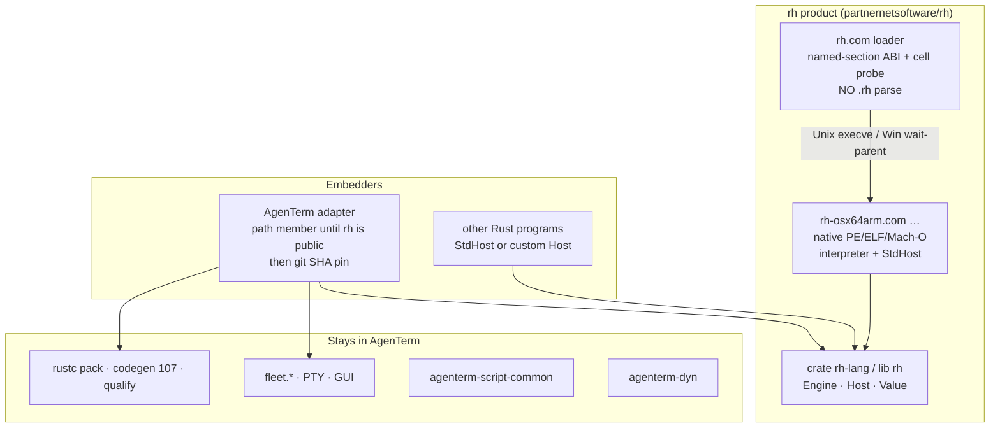
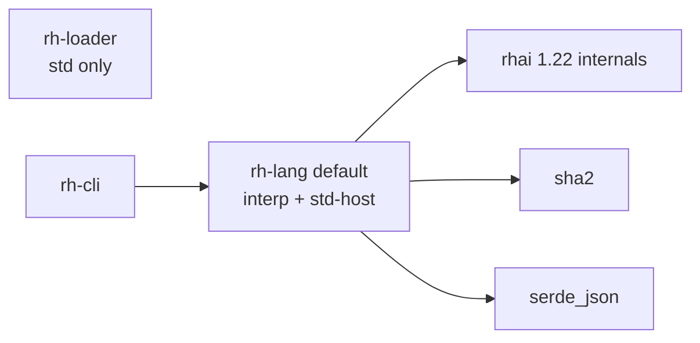
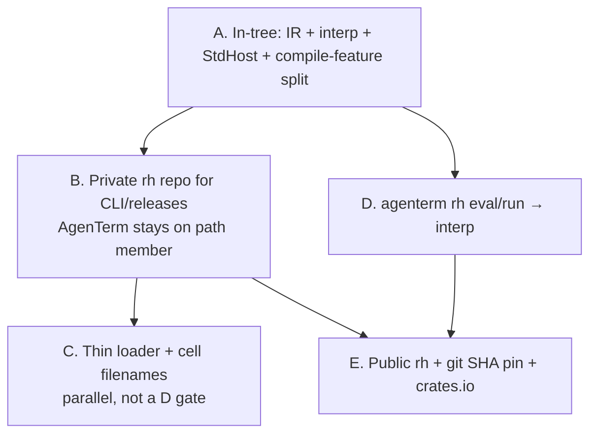

# rh: standalone dynamic language product

> ⚠️ Archive: Rh left this repository; this design is historical evidence.

| Field | Value |
|-------|-------|
| **Document** | Product / architecture design for `partnernetsoftware/rh` |
| **Author** | AgenTerm systems architecture (draft for owner review) |
| **Date** | 2026-08-21 |
| **Status** | Living SSOT. One-page now-state: `design-rh-standalone-product-summary.md`. Locks: Key Decisions. |
| **Audience** | Senior engineers who know `crates/agenterm-rh`, the root host, and Chassis-L1 |
| **Related** | `prd/PRD_02_10_rhai_scripting.md`, `plan/design-rh-aot.md`, `plan/ARCHITECTURE.md`, `plan/reference-cross-target-execution.md` §5 / §6.2 / §6.3, `plan/plan-v0.1.18.md` (APE parked for *workbench*), `plan/plan-ape-thin-shell-dynamic-packages.md` (name collision) |

---

## Overview

**rh** is a shebang-able, embeddable dynamic language. Default execution is a tree-walk of Language 1. The product is that interpreter (host, honest errors, a checker that does not lie). JIT/AOT are not the goal; if they exist later they are a desktop optimisation of this same language.

Live code: private `partnernetsoftware/rh` (`rh-lang` / `rh-cli` / `rh-loader`). AgenTerm still path-depends the in-tree crate and must not git-pin while the rh repo is private. `agenterm rh eval`/`run` use the interpreter; `pack`/`qualify`/`task` keep AOT.

`rh.com` is a loader only. Six native slices (`rh-{osx|lnx|win}{64}{arm|x86}.com`). iOS embeds `rh-lang` in a signed app — no seventh cell, no runtime machine code.

The rest of this document is the freeze (Language 1, Host, decisions). A morning-of-extract snapshot of AgenTerm-before-interp is under **Background**; do not treat it as current runtime.

---

## Background & Motivation

Historical snapshot of AgenTerm **before** the sibling `rh` interpreter shipped. Kept so the decisions have evidence. For what runs today, see Overview and `design-rh-standalone-product-summary.md`.

### Current state (verified, morning of extract)

| Fact | Evidence |
|------|----------|
| Library only, `autobins = false`, `publish = false` | `crates/agenterm-rh/Cargo.toml` |
| Does **not** depend on the `agenterm` root package or `agenterm-platform` | deps: `agenterm-script-common`, `rhai` 1.22 (`std`+`internals`), `sha2` 0.11, `serde`/`serde_json`, `tempfile`, `libloading`. Extractability is blocked by **missing StdHost**, not by a root-package edge. |
| Pipeline: parse → subset → transpile → `cargo build` → `.so/.dll/.dylib` → `libloading` | `check.rs`, `subset.rs`, `transpile.rs`, `compile.rs`, `load.rs` |
| Host ABI v13, codegen revision 107 | `crates/agenterm-rh/src/host_api.rs`: `RH_HOST_API_VERSION = 13`, `RH_CODEGEN_REVISION = 107`. **Root-package** pins: `tests/rh_regression.rs` (`== 13`), `tests/rh_codegen_fixtures.rs` (`== 107`). Crate tests: `crates/agenterm-rh/tests/public_contract.rs`, `codegen_native_pack_fixtures.rs`. |
| C entry: `rh_entry(): i64` plus `rh_register_host_v11` | `load.rs` `RhNativeModule`; generated prelude in `emit_host_runtime` |
| Real host is root-package | `src/script_rh_host.rs`. Crate only has `register_stub_host` (dummies return `-4`) |
| Standalone `agenterm-rh` **bin target does not exist** | Root `Cargo.toml` `[[bin]]`s are `agenterm`, `agenterm-com`, `agenterm-cc` only. `prd/PRD_02_10_rhai_scripting.md` retired the standalone PE. Entry is `agenterm rh` via `src/bin/agenterm.rs` `ENGINE_SUBCOMMANDS` → `script_rh_cli_main::run_main`. (`src/script_engine.rs` module docs still mention a retired `[[bin]] name = "agenterm-rh"` path; that comment is stale.) |
| Rhai interpreter cancelled as forward engine | PRD_02_10. Parser still uses `rhai`. `check.rs` builds a `rhai::Engine` **only to compile AST**, `OptimizationLevel::None`, `RH_MAX_EXPR_DEPTH = 512`. `rhai::AST` auto-traits are `!Send + !Sync` (1.22 / 1.25). |
| `agenterm_rh::check` is **not** the rh-3 subset | `check.rs`: on `validate_ast` failure it calls `compat_validate`, which only rejects `eval` (`subset.rs`). Closures / `do` / `switch` / interpolation therefore `check` ok if they parse. Native transpile still refuses them. |
| `agenterm rh eval` is AOT | `script_rh_cli_main.rs`: `check` → `qualify_pack_dir` → `call_pack_entry_capturing_output` |
| Shared scaffolding must stay | `agenterm-script-common` is used by lua/qjs/sql. **In-tree `agenterm-rh` does depend on it** (`check_many.rs`). lua/qjs must not git-pin rh. |
| Six cells | `crates/agenterm-chassis/src/lib.rs` `CELLS` / `native_cell()`: `win-x86_64`, `win-aarch64`, `lnx-x86_64`, `lnx-aarch64`, `osx-x86_64`, `osx-aarch64`. `"unknown"` is the `_` arm. |
| Chassis loader fail-closed | `agenterm-chassis-loader` `check_native_cell`: unknown **or** mismatch rejects |
| APE research | `plan/reference-cross-target-execution.md` §5 (fat / N native copies is the ISA answer), §6.2 (APE is packaging not interface; steal polyglot header, OS probe, apelink layout; do **not** Cosmopolitan-libc), §6.3 (only one format owns offset 0 without rewrite; polyglot is a hostile launcher surface) |
| Workbench APE parked | `plan/plan-v0.1.18.md`: multi-arch loader/APE is a v0.2.x *workbench* research gate |
| Name collision | `plan/plan-ape-thin-shell-dynamic-packages.md` **"ape" = Agenterm Platform Engine**. Cosmopolitan **APE = Actually Portable Executable**. rh loader is the latter *format idea*, never the former crate |
| Git-pin precedent | sibling repo `wbox` `Cargo.toml` (not an AgenTerm workspace member): `agenterm-platform = { git = "https://github.com/mgttt/agenterm.git", rev = "c8ace42", default-features = false }` — **public** repo `mgttt/agenterm` (not `partnernetsoftware/agenterm`), full SHA, feature-gated |
| `crates.io` name `rh` is taken | crate `rh` 0.1.14 (2022), twigly HTTP CLI, ~7918 downloads. `rh-lang`, `rhlang`, `rh-engine` do **not** exist (verified 2026-08-21) |
| GitHub repo is a **private placeholder** | `https://github.com/partnernetsoftware/rh` was created **private, README/LICENSE only** (2026-08-21). It holds **no language code**: the live source of truth is `crates/agenterm-rh` in this tree. Creating the placeholder does **not** advance the D1 gate. |
| Fleet catalog drift | `shipped_surfaces.rs` has **76** `fleet.*` paths. `src/operations.rs` has **43** `script_surface: "fleet…"` rows. Gap = **33**. `tests/script_fleet_facade_parity.rs` `rh_surfaces_missing_from_host_catalog()` pins that set (comment still says “32 entries”; the array is 33). PRD_02_10’s “32” is stale. |
| Process exit mapping | `script_rh_cli_main.rs` `script_exit_code(code: i32)`: `u8::try_from(code).unwrap_or(ExitCode::FAILURE)` (`FAILURE` = 1). `eval` itself returns `Ok(())` → exit 0 and prints a receipt; `run` / `task` use `script_exit_code`. |
| Dual expression-depth constants | Parse: `RH_MAX_EXPR_DEPTH = 512` (`check.rs`). Runtime worker default: `ScriptBudgets.expression_depth = 64` (`src/script_protocol.rs`). |

### Pain points

1. **No product loop.** `#!/usr/bin/env rh` cannot work. `eval` pays a rustc cold start (shared target dir `agenterm-rh-pack-target-cg107` amortizes deps, still requires a toolchain).
2. **Embedders cannot depend on rh.** There is no `Engine`/`eval` API. Sibling `agenterm-lua` already has `LuaEngine::eval` / `LuaHostFunctions`; rh has C function pointers and thread-locals (`FLEET_BRIDGE` in `script_rh_host.rs`, `RhRunContext` in `script_rh_run.rs`).
3. **Host lives in the wrong crate.** Extracting today would ship a compiler that cannot `print`. `qualify_pack_dir` must `register_stub_host` so hostless packs do not fabricate `args.len == -4`. `cargo tree -p agenterm-rh` already omits the `agenterm` package; that is **not** the extractability proof.
4. **AOT-first made the language a compile pipeline.** The strict subset is `validate_ast` (rh-3). `check()`’s `compat_validate` bypass is a workbench compatibility hole, not the language.
5. **Fleet is welded to the language crate.** `subset.rs` `use crate::fleet::{expr_uses_fleet, parse_fleet_call, validate_fleet_call}` and emits `RH_SUBSET_FLEET_SHAPE`. `expr_print.rs` `uses_host_surface` treats identifiers `std \| rh \| rhai \| fleet` as host. `api_validate.rs` walks `SHIPPED_SURFACE_PATHS` including 76 `fleet.*` entries. Moving those files as-is copies Fleet into the product.

---

## Goals & Non-Goals

### Goals

1. A standalone **language runtime** users shebang and run: `rh.com script.rh`, `rh.com -e`, `rh.com check`.
2. **Embeddable crate** other Rust programs depend on, equal to CLI — `Engine` + `Host` + `Value`.
3. **Default execution is an interpreter** of **Language 1** (closed spec below): strict `validate_ast` **without** `compat_validate`, plus the Language-1 name allowlist. Not “whatever `check()` accepts today.”
4. **`rh.com` is a loader only.** Per-cell slices are real rustc-native PE/ELF/Mach-O. `.com` on slices is a **filename brand**. v1 delivery is **thin same-dir** (per-cell loader + sibling slice). Unified polyglot `rh.com` is **not** v1.
5. Default host is **`std` only**. No `agenterm-platform` on the default `rh.com` / embedder path.
6. One language. Default execution is the interpreter. Optional AOT stays **in AgenTerm** for pack/qualify. No second Rhai semantics.
7. Reserved **public** seam for a future desktop JIT/AOT under the same language: `Engine::compile` → `Error::Unsupported { feature: "compile" }` on default builds. The `Backend` trait is **crate-private**. **Do not** treat shipping Cranelift/rustc as a product goal (D39).
8. AgenTerm becomes an **embedder** that injects Fleet/PTY/GUI via `Host::call`. `agenterm rh eval`/`run` switch to interp after extractability. Task qualification gates and codegen 107 stay AgenTerm's *compile* path until a later opt-in.
9. Private GitHub repo first for **product CLI/releases**. `publish = false` until public. **Public AgenTerm does not git-pin a private rh repo.**

### Non-Goals

- Git-splitting the crate **before** a `.rh` file runs without the root package **and** without default `libloading`/`tempfile`.
- Replacing AgenTerm Host ABI, PE layout, macOS signing, or Chassis-L1/L2/L3.
- Cosmopolitan Libc as the rh runtime.
- Moving `agenterm-script-common` into rh; lua/qjs/sql must not depend on rh.
- Copying `check_many.rs` / `corpus.rs` / `fleet.rs` into the product crate.
- Merging `agenterm-dyn` (`dlcall` / S-expr) into the rh kernel.
- Making qjs the user-facing rh language.
- Shipping AOT/JIT/Cranelift as a **product goal** (D39). v1 does not ship them. Desktop may grow them later under the same language; that work is not “making rh powerful.”
- `no_std`.
- Default FFI / `dlcall` / arbitrary `dlopen` of user code.
- Fleet, PTY, GUI, clipboard, image, HTTP, TCP, `rh::task`, `--worker` / `--framed-worker` in Language 1.
- A second language (Rhai-complete interp alongside rh-3).
- Exposing or `Send`ing `rhai::AST`. Walking rhai nodes is an implementation tactic for lowering, not a freeze surface.
- Prometheus / metrics crates in `rh.com`.
- Thompson-shell/MZ polyglot `rh.com` as a v1 gate (hostile launcher surface, §6.3).
- Claiming the workbench multi-arch loader problem is solved.

---

## Key Decisions

| # | Decision | Rationale |
|---|----------|-----------|
| D1 | `partnernetsoftware/rh` is the **end-state product repo**. Private first, public later. The empty private placeholder already exists; **do not populate it with language code until** the in-tree crate runs a `.rh` file without the root package **and** default features do not include `libloading`/`tempfile`. | Locked product intent. Splitting a compiler-only crate would freeze the wrong shape. An empty placeholder freezes nothing; a populated one does. |
| D2 | **In-tree extractability first**, then private repo for CLI/releases. **AgenTerm keeps a path workspace member until rh is public.** Git-pin (`git` + full SHA + `default-features = false`) only after the rh repo is world-readable. wbox pins **public** `https://github.com/mgttt/agenterm.git` rev `c8ace42` — that is not a license to pin a private URL from public AgenTerm. | A public `cargo build` of AgenTerm must not require GitHub credentials for `partnernetsoftware/rh`. |
| D3 | `rh.com` = **loader only**. Cell packages = real rustc-native runtimes. `.com` on slices is a **filename brand**. | ISA answer remains N native copies (`reference-cross-target-execution.md` §5). |
| D4 | Distribution filename ↔ cell id **bijection** (table below). Loader fail-closes on unknown / mismatched cell. **No `native_cell: null` escape** (chassis `check_native_cell` has one for portable images; rh does not). Duplicate the six-row table in rh-loader (~20 lines); do not depend on `agenterm-chassis`. | rh.com always selects a real native slice. Chassis null is for unsigned portable compose, a different job. |
| D5 | **Thin layout is v1 delivery**: per-cell `rh.com` + sibling `rh-osx64arm.com` (etc.) in the same directory. Fat zip-overlay and polyglot header are **later**, not a gate for AgenTerm interp migration. Optional network fetch is **not** v1. | Unblocks shebang without solving §6.3 hostile launchers. |
| D6 | Default host uses **`std` only**. `agenterm-platform` is never required for `rh.com` / default embedder. | rh is a language, not a platform crate. |
| D7 | Language 1 = **strict `validate_ast` (no `compat_validate`) + Language-1 allowlist**. Parser may keep the `rhai` crate internally. At `check` time, lower to a crate-owned **`Send` IR**. **Public API does not name `rhai::*`.** | `rhai::AST` is `!Send`. Replacing the parser later must not break embedders. `agenterm_rh::check`’s compat bypass stays **AgenTerm-only**. |
| D8 | Default engine = **tree-walk of that IR**. Today's rustc-pack pipeline stays in the **AgenTerm adapter**, not in `rh-lang` default (no `feature = "compile"` rustc backend in the product crate for v1). | The product is the interpreter (D39). AOT stays available to AgenTerm task gates as a compile path, not as rh's identity. |
| D9 | Embed API is a **first-class product surface**: `Engine`, `Scope`, `Value`, `Host` trait, `CancelHandle`, fuel/timeout. Equal to CLI. | Without this, the split only moves a compiler. |
| D10 | **Public freeze:** Language 1 (syntax + value model + name allowlist), `Host` trait as specified, `Engine::{new, new_with_host, check, eval, eval_with_scope, eval_file, compile, set_fuel, set_timeout, cancel_handle}`, `Compiled` opaque, slice header `rh-slice-abi/1` fields **abi_version + cell** and **named-section placement**. **Do not freeze:** crate-private IR shape, `Backend` trait, codegen IR, Cranelift, rustc pack format, `rh_entry(): i64`, `RH_CODEGEN_REVISION`, `libloading`, machine code, product semver in the slice header. | Embedders must not depend on rustc/Cranelift/dlopen. `Backend` is crate-private so Cranelift can land in-tree without an embedder break. |
| D11 | crates.io **package name `rh-lang`**, **lib name `rh`**. Binary *file* is `rh.com` (loader) / `rh-*.com` (slices). Cargo bin target name is `rh`. Unix PATH install name is `rh`. | `rh` on crates.io is taken. |
| D12 | Workspace crates: `rh-lang` (lib), `rh-cli` (runtime CLI = cell slice), `rh-loader` (tiny, **no** `rhai`, **does not parse `.rh`**). | Loader TCB stays small. |
| D13 | **No default FFI.** Every `Host` method has a default `Err(Error::unsupported(…))`. Sandbox embedders implement nothing extra. `StdHost` fills Language 1. Process spawn and FS are in `StdHost` (Node-like). | Matches PRD_02_10 unrestricted local runtime. Rust cannot “omit” required methods; defaults are the omit story (Lua’s `Option<Arc<dyn Fn>>` precedent). |
| D14 | Loader **must not self-modify**. Slice ABI lives in a **named section inside the image**, then the image is signed. No EOF trailer (fights Mach-O `LC_CODE_SIGNATURE` and PE Authenticode). | D14 + codesign are one constraint. |
| D15 | AgenTerm **keeps** `RH_HOST_API_VERSION=13` / `RH_CODEGEN_REVISION=107`, `qualify_pack_dir`, task native-pack gates, `--worker` in the **adapter crate**. `agenterm rh eval`/`run` switch to the interpreter once extractable. Do **not** resurrect an `agenterm-rh` bin target (it is already gone). | Avoids rewriting the task corpus in the same change as the product split. |
| D16 | REPL is a **reserved argv token**, not v1. | Shebang + `-e` + check are the product loop. |
| D17 | Default `Engine` is `Send` and **not** `Sync`. That is possible because the stored program is the **owned IR**, not `rhai::AST`. Host is `Box<dyn Host>` (`Send`). Cancellation is `CancelHandle(Arc<AtomicBool>)` (`Send + Sync`). **No thread-local host.** | Today’s TLS is why rh cannot be a library. |
| D18 | License **MIT OR Apache-2.0**. | Matches `crates/agenterm-rh/Cargo.toml`. |
| D19 | Language-1 default host: builtins + `std::env` / `std::fs` / `std::path` / `std::process` / `std::time` + `rh::fail` / `rh::bytes` / `rh::crypto::sha256{,_file}` / `rh::hash::fnv1a64` / `rh::json` / `rh::runtime::{temp_dir,atomic_write,atomic_write_bytes}`. **Out:** HTTP, clipboard, image, GUI, TCP, `rh::task`, Fleet, `rh::crypto::tree_metadata_digest`, `rh::runtime::append_sync*`. | Keeps v1 `std`-only. SHA-256 uses already-present `sha2`. |
| D20 | Core `Value`: **Unit / Bool / Int(i64) / String / Array / Map / Bytes / HostObject**. Mapping from transpile `ValueKind` is specified in Language 1 (below). No `f64`. No `Json`/`Char`/`Set` variants. Window/Task/TCP/HTTP/Fleet types are **not** Language 1. | Prevents AgenTerm GUI types from leaking into the frozen value model. |
| D21 | **CLI files and `Engine::eval_file` require `fn entry()`.** `Engine::eval` / `-e` use `entry()` if present, else the last expression. Process exit uses `exit_from_int` (same shape as `script_exit_code`). | One rule, no Open Question. |
| D22 | **Shebang/CLI: fuel off, wall-time off** (user shell tool). Flags `--fuel N` / `--timeout-ms N`. **Embedder `Engine::new()`: fuel 1_000_000, wall-time 2s** (`ScriptBudgets::default()`). Parse depth 512; embedder runtime expression depth 64 unless raised. | Worker budgets are not a Unix-tool default. |
| D23 | Windows loader is a **parent**: `CreateProcessW`, wait, forward exit code. Unix `execve`. | `CreateProcess` is not `execve`. |
| D24 | crates.io first public number is **0.1.0**. Populate private repo by **squash/copy** of language files + fixtures + licenses (not `check_many` / `fleet` / AOT); `NOTICE` records the AgenTerm source SHA. **No `git filter-repo` of AgenTerm history.** Collaborators = **org members only**; no extra personal-account invites. | Owner lock 2026-08-21 (grok-mcu). 0.1.0 is honest until Language 1 has six-cell CI. Squash keeps rh's git log about rh. Org ACL already covers the private placeholder. |
| D25 | Language-1 `rh::fail(msg)` **raises** (`Error::Host`). It does **not** evaluate to the AOT utility sentinel `-5`. Native packs may still return `-5` from `RH_HOST_UTILITY_FAIL` as an **i64 ABI encoding** after `record_host_error`; that encoding is not the language value. | Owner lock 2026-08-21 after A2. Sentinel integers are AOT ABI, not Rust-alike semantics. |
| D26 | After A3: (1) `Child.stdout` / `Child.stderr` **read to EOF and return `Bytes`**. Do **not** add `Stream` to Language 1. (2) `std::process::list` stays on the name allowlist but **StdHost returns `unsupported`**; AgenTerm `Host` may implement later — no `agenterm-platform` in the default crate. (3) `Engine::new()` installs `StdHost`; `Engine::sandboxed()` installs a no-op `Host`. (4) Dotted host calls (`fleet.tabs.list`) already go through `Host::call`; leave the interpreter alone for PR-D1. `read_dir` is sorted by file name. | Owner lock 2026-08-21 after A3. Bytes-at-EOF is Rust `Output.stdout`, not a PHP/Node stream. |
| D27 | rh **must expose an assembly / live-native door**, but it is **not Language 1 default**. Default `Engine::new()` / `sandboxed()` stay free of emit/enter/`dlcall`. Native is an explicit, `unsafe`-shaped capability (feature `native` and/or `Engine::with_native`): stage ISA bytes (safe), flip to executable, enter a declared C ABI (unsafe). Discipline copies `agenterm-dyn` `CodeBuffer`: **W^X, never RWX**. iOS/App Store: the **API exists**; runtime returns typed `Error::unsupported("native: wx")` on the App Store third-party path (D38). `MAP_JIT` / `pthread_jit_write_protect_np` only where the process actually has the entitlement — do not document that as “iOS can JIT”. No silent RWX, no pretending iOS is Linux. Do **not** merge dyn's S-expr language into rh. Assembler can follow; v1 of this door may be raw bytes + `enter_i64`. | Owner opinion 2026-08-21: rust-alike needs a metal path without becoming Perl/PHP; iOS is restricted, not omitted. |
| D28 | Treat `partnernetsoftware/rh` as **already public in tone**. Comments, README, CI, commit messages, and tests in that repo must make sense to a stranger who only knows rh, not the AgenTerm workbench. Allowed: short provenance in `NOTICE` (AgenTerm path + source SHA) because that repo is public and license-traceable. **Not allowed:** mux/agent nicknames, local homedirs, owner titles, PR-A1…PR-D1 issue IDs, `codegen 107`, internal plan paths, “董事长/政委”, secrets. Describe embedder hooks as `Host::call` names, not “AgenTerm will inject Fleet in PR-D1”. | Owner 2026-08-21: private now, public later like bun/node/python. |
| D29 | Language 1 adds bounded **stdin**: `std::io::read_to_string()` and `std::io::read()` (UTF-8 string / `Bytes`), same size cap as file reads. Pipes must work. Do **not** add `f64`. Do **not** attach source locations to `Error::Host` / `Error::Unsupported` payloads this beat (keep `Error::Runtime` diagnostics with statement line only). Windows slices stay compile-checked, link-fail typed; no fake run CI; no installing mingw just to claim a PE exists. | Owner 2026-08-21 after Windows honesty + missing-line-number fix. Shell tools must read pipes; value model stays i64. |
| D30 | `Options` does not host I/O caps: `fs_read_cap` / `output_bytes` live on `StdHost` (0.1.0, never published — field removal stays). HostObject **type_id mapping is unchanged** (PathBuf / Metadata / SystemTime stay HostObject, not Map/i64). The table leak is an implementation bug: **refcount slots** on clone/drop of `Value`; the cap remains a backstop. Do not unbox “value-like” handles this beat. | Owner 2026-08-21. Dummy security knobs are worse than none. Unboxing would change `type_of` and freeze. |
| D31 | Integer overflow **traps** (does not wrap). Array `[]` out of range **traps** in both directions; `.get` stays the asking form. Map missing key stays empty/absent, not an error. String `<`/`>` are lexicographic. These are language honesty, not AOT i64 wrapping. | Owner 2026-08-21 after silent-wrong-value sweep. Wrapping would hide bugs the way PHP/Perl would. |
| D32 | `Engine::check` must resolve every `std::` / `rh::` name, including in unexecuted branches. Unknown names fail the same way as at runtime (`Unsupported`), so matchers do not fork. `Host::knows` defaults to allowing (embedders that own a whole namespace are not locked out); `StdHost` overrides. `std::process::list` may check and still `unsupported` at the call. `try/catch` catches host and runtime failures (message string) and `throw` values; **fuel, timeout, and cancel always pierce catch**. `try` is a statement, not an expression. | Owner 2026-08-21. A checker that blesses dead names is lying. Scripts must not swallow their own budgets. |
| D33 | Language 1 string building: **`Array.join(sep)` → String** (linear; empty array → `""`; non-string elements stringify like `+`). **`String.push_str(s)`** mutates in place only when the receiver is a variable (same rule as `Array.push`); a non-variable receiver is an error, not a silent no-op. `s = s + x` may stay quadratic. No rope type. README may recommend `join` / `push_str`. | Owner 2026-08-21. Driving text cannot be O(n²) with no escape. |
| D34 | Maps stay insertion-ordered for iteration. Lookup and insert by key must not be O(n) scans: use an index (`HashMap` + order vec, **no new crate**). `Value::Map` layout may change at 0.1.0 unpublished — do not keep a public `Vec<(String, Value)>` if that blocks the index. Do not document “maps are only for small tables” as the product answer. In-place `a[i] = v` stays. Reading a variable must not clone an entire array/map to index it: bind and copy only the element. | Owner 2026-08-21. “Accumulate a table by id” is normal. Python/JS dicts are ordered and not quadratic. |
| D35 | Map `==` is **by keys and values**, not insertion order (`#{a:1, b:2} == #{b:2, a:1}`). Arrays stay order-sensitive. Iteration order is still insertion order. | Owner 2026-08-21. Ordered dicts iterate stably; equality is content, like Python. |
| D36 | Nested arrays/maps have a **construction depth cap** (default **32**, embedder-tunable). Inserting a container that would exceed it is a runtime error, not a bomb. Cache depth on each container so the check is O(1), not a walk. Independently, `Drop` (and recursive `Clone` / `==` / display) of `Array`/`Map` must be **iterative**: `Engine::sandboxed()` must not `abort` the embedder process. Do not document “don't nest unbounded structures.” Fuel/timeout still do not catch stack loss. Default 32 is for debug threads (~2 MiB stack); 64 sat on the abort cliff. | Owner 2026-08-21. A sandboxed pure-value program must not SIGABRT the host. |
| D37 | Collection methods (interpreter builtins, variable receiver for mutating ones): **`Array.sort()`** in-place; strings lexicographic, ints numeric; mixed incomparable types **error**, do not coerce. **`Array.pop()`** errors if empty. **`Array.remove(i)`** errors on OOB (same as `[]`). **`Map.remove(k)`** updates both the hash index and the insertion-order list; missing key is a no-op (ask, like `.get`). Skip `String.lines` / `trim_start` / `trim_end` / `Array.index_of` / `Array.reverse` this beat. Do not buffer `print`. | Owner 2026-08-21 after real-script use. Sort is the one everyone would rewrite badly. |
| D38 | **App Store iOS runs rh the way it runs CPython in Pyto / Pythonista: a signed interpreter in the app, user programs as data.** `.rh` (and any future “pip” of pure Language-1 libraries) is files. Native extensions, `libtcc`, generated `.dylib`, and `enter_i64` are the same wall: the kernel will not execute unsigned pages, and third-party App Store apps do not get `dynamic-codesigning`. Existence proof: Pyto’s pip is complete **except C extensions**; those packages work only when **precompiled into signed Frameworks**. Pyto’s “C compiler” is Clang → LLVM bitcode → **interpret bitcode**, not `mprotect(RX)`. rh does **not** take a bitcode-interpreter backend in v1. **No iOS cell** in the D4 six-row table; iOS is `rh-lang` embedded and signed with the host app, not `rh.com` + sibling slice staging ISA bytes. | Owner 2026-08-21 after Pyto/libtcc discussion: iOS is not “no dynamic language”; it is “no runtime native codegen”. |
| D39 | **The product is a powerful interpreter, not a JIT/AOT story.** “Powerful” means Language 1 can do real work: `Host` (fs/process/env/json), honest errors, `check` that does not lie, sandbox that cannot abort the embedder, in-place containers, TDD corpus. It does **not** mean beating V8/bun on throughput, shipping Cranelift, or making rustc the shebang path again. JIT/AOT, if they ever land, are a **desktop under-the-hood** optimisation of this same language (`Engine::compile` stays the reserved seam; `Backend` stays crate-private). Desktop may use them; iOS (D38) does not. Do not spend the next miles on codegen. Spend them on scripts that the interpreter cannot yet say yes to. | Owner 2026-08-21: not attached to JIT/AOT; those are later bottom-layer opts on desktop. |

### Distribution filename bijection (D4)

| Chassis cell id (`native_cell()`) | Slice filename |
|-----------------------------------|----------------|
| `osx-aarch64` | `rh-osx64arm.com` |
| `osx-x86_64` | `rh-osx64x86.com` |
| `lnx-aarch64` | `rh-lnx64arm.com` |
| `lnx-x86_64` | `rh-lnx64x86.com` |
| `win-aarch64` | `rh-win64arm.com` |
| `win-x86_64` | `rh-win64x86.com` |

Unknown `native_cell` (`"unknown"`) → loader prints supported cells and exits 2. No fallback, no emulator.

---

## Language 1 (closed spec)

Language 1 is the **only** definition of “the subset the interpreter runs.” It is **not** `agenterm_rh::check()`, and **not** “whatever native transpile `ValueKind` can emit.”

### 1. Syntax

`Engine::check` = parse with `rhai` (`OptimizationLevel::None`, `RH_MAX_EXPR_DEPTH = 512`) → **`validate_ast` without `compat_validate`** → **Language-1 allowlist** → lower to `Send` IR → drop the `rhai::AST`.

`validate_ast` rejects (codes already in `subset.rs`):

| Code | Rejects |
|------|---------|
| `RH_SUBSET_NO_LOOP` | `do` / `switch` |
| `RH_SUBSET_NO_CLOSURE` | closure capture / `capture_parent_scope` |
| `RH_SUBSET_NO_INTERPOLATION` | string interpolation |
| `RH_SUBSET_NO_EVAL` | `eval(...)` |
| `RH_SUBSET_ASSIGN_*` | assignment LHS/RHS restrictions as in `subset.rs` today (minus fleet-only paths) |
| `RH_SUBSET_WHILE_COND` | `while` condition not a pure int expr |
| `RH_SUBSET_TRY_RETURN` / `RH_SUBSET_TRY_BREAK` | `try`/`catch` restrictions |
| `RH_SUBSET_BREAK_VALUE` | valued `break` |
| `RH_SUBSET_THROW_ARGS` | illegal `throw` shape |

**Product `Engine::check` does not run** `RH_SUBSET_FLEET_SHAPE` / `parse_fleet_call`. A `fleet.*` name is an unknown API (`script_api_unknown`), not a fleet-shape error.

**AgenTerm-only:** `compat_validate` bypass in `agenterm_rh::check`; fleet-shape validation; `check_with_project_validation` / `require` / project imports (`project_import.rs` stays in AgenTerm).

Allowed control flow: `fn`, `let`, `if`, `while` (int cond), `for`, simple-var assignment / compound assign, `try`/`catch` (as `validate_ast` allows), `return`, `break`/`continue` without values.

### 2. Value model

Public `Value`:

```text
Unit | Bool | Int(i64) | String | Array(Vec<Value>) | Map(Vec<(String, Value)>) | Bytes(Vec<u8>) | HostObject { type_id, handle }
```

`Map` is insertion-ordered. `HostObject.type_id` is a `'static str` from the table below. `handle` is crate-private (integer id into the host’s table).

Transpile `ValueKind` (`transpile.rs`) → Language 1:

| `ValueKind` | Language 1 |
|-------------|------------|
| `Int` / `Bool` / `String` / `Bytes` | same |
| (unit / `()`) | `Unit` |
| `Char` | `String` of one Unicode scalar |
| `Json` | `Unit` / `Bool` / `Int` / `String` / `Array` / `Map` (JSON **is** the array/map model; no `Json` variant) |
| `Set` | **not Language 1** — `Engine::check` rejects set constructors (`script_api_unknown` / subset error). AgenTerm AOT may keep them. |
| `StringList` | `Array` of `String` |
| `Path` | `HostObject` `type_id = "std.path.PathBuf"` |
| `Metadata` | `HostObject` `"std.fs.Metadata"` |
| `SystemTime` | `HostObject` `"std.time.SystemTime"` |
| *(no `ValueKind` variant)* `Duration` values produced by `std::time::Duration::*` | `HostObject` `"std.time.Duration"`. **Argument-only**: no script-callable methods; it is only passed to `Command.timeout`. |
| `DirEntry` | `HostObject` `"std.fs.DirEntry"` |
| `Command` | `HostObject` `"std.process.Command"` |
| `Output` | `HostObject` `"std.process.Output"` |
| `Child` | `HostObject` `"std.process.Child"` |
| `FileLock` | `HostObject` `"std.fs.FileLock"`. **No methods**: the binding owns the lock for its scope (`transpile.rs` `ValueKind::FileLock`); it is tested for truthiness and released on drop. |
| `ChildList` | `Array` of `HostObject` `"std.process.Child"` |
| `WindowControl` / `WindowRect` / `Stream` / `Task` / TCP / HTTP | **not Language 1** — AgenTerm `Host::call` only |

No `f64`. A float literal is a parse/subset error for Language 1 (native emit of `"scale:" + 1.0` in transpile tests is AgenTerm AOT, not product).

### 3. Name allowlist (Host::call `name` = script spelling)

Freeze these strings. Unknown name → `Error::unsupported(name)` / `script_api_unknown` at check time.

**Builtins** (not `std::`): `print`, `debug`, `type_of`, `to_string`, `to_debug`, `rh::fail`.

**Core-type methods (not `Host::call` — the interpreter implements these directly).** These are part of Language 1 and are **not** routed through `Host`; a `Host` that implements nothing still gets them.

| Receiver | Frozen surface | Live source |
|----------|----------------|-------------|
| `String` | `contains`, `starts_with`, `ends_with`, `trim`, `replace`, `to_lower`, `to_string`, `split`, `sub_string`, `len` | `transpile.rs` `is_stringish_method_name`; `String.split` in `shipped_surfaces.rs` |
| `Array` / `Map` | `push`, `insert`, `get`, `keys`, `len` | `transpile.rs` `is_json_method_name` + the `keys` method call + the `len` property |
| `Bytes` | `get`, `slice`, `append`, `len`, `to_text` | `shipped_surfaces.rs` `Bytes.*` |

`len` is reachable both as a property (`x.len`) and as a method (`x.len()`), as today.

**HostObject methods (via `Host::call` with the `Type.method` spelling).** Producing a HostObject without freezing its methods would make the type unusable, so these are frozen with their constructors:

| `type_id` | Frozen methods | Live source |
|-----------|----------------|-------------|
| `std.fs.Metadata` | `is_file`, `is_dir`, `is_symlink`, `is_reparse_point`, `len`, `modified` | `shipped_surfaces.rs` `Metadata.*` |
| `std.fs.DirEntry` | `file_name`, `path`, `metadata`, `is_file`, `is_dir`, `is_symlink` | `shipped_surfaces.rs` `DirEntry.*`; fixtures `direntry-file-name-probe.rh`, `direntry-is-file-probe.rh`, `direntry-metadata-probe.rh` |
| `std.process.Output` | `success`, `exit_code`, `stdout`, `stderr`, `stdout_text`, `stderr_text`, `combined_text`, `complete`, `truncated`, `error`, `require_success` | `shipped_surfaces.rs` `Output.*` |
| `std.fs.FileLock` | none (scope-held; truthiness only) | `transpile.rs` `ValueKind::FileLock` |
| `std.time.Duration` | none (argument-only) | constructor-only in `transpile.rs` |

`std.path.PathBuf`, `std.process.Command`, `std.process.Child`, and `std.time.SystemTime` methods are frozen in their own paragraphs below.

**Args object:** `args` is a host-provided array-like: `args.len` (via `Host::args_len`) and `args[i]` (via `Host::arg`). Not `std::env::args`.

**`std::env`:** `std::env::current_dir`, `std::env::get`, `std::env::has`, `std::env::names`.

**`std::fs`:** `std::fs::copy`, `create_dir`, `create_dir_all`, `exists`, `exists_case_exact`, `metadata`, `read`, `read_dir`, `read_to_string`, `remove_dir`, `remove_dir_all`, `remove_file`, `rename`, `symlink_metadata`, `try_lock_exclusive`, `write`, `write_bytes`, plus the `api_validate.rs` extras `std::fs::try_remove_file`, `try_remove_dir_all`, `try_copy`, `try_create_dir_all`, `try_rename`.

**`std::path`:** `std::path::PathBuf::from`, `std::path::absolute`, `std::path::join`, `std::path::parent`. Methods on PathBuf HostObject: `display`, `extension`, `file_name`, `is_absolute`, `join` (script spelling `PathBuf.*` as today).

**`std::process`:** `std::process::command`, `std::process::command_status`, `std::process::command_stdout_file`, `std::process::id`, `std::process::kill`, `std::process::list`. Command HostObject methods: `arg`, `args`, `current_dir`, `env`, `env_remove`, `env_clear`, `stdin_text`, `stdin_bytes`, `stdout_file`, `stderr_file`, `timeout`, `capture_limit`, `output`, `start`. Child HostObject methods: `id`, `state`, `stdout`, `stderr`, `kill`, `kill_tree`, `wait_with_output`. **Not** `Child.window_*` / `WindowControl.*` (AgenTerm GUI).

**`std::time`:** `std::time::Duration::from_millis`, `std::time::Duration::from_secs`, `std::time::SystemTime::now`. Methods: `SystemTime.rfc3339`, `SystemTime.unix_millis`.

**`rh::bytes`:** `rh::bytes::from_array`, `rh::bytes::from_text`. Bytes methods: `get`/`slice`/`append`, `len`, `to_text`.

**`rh::crypto`:** `rh::crypto::sha256`, `rh::crypto::sha256_file`.

**`rh::hash`:** `rh::hash::fnv1a64`.

**`rh::json`:** `rh::json::parse`, `rh::json::parse_file`, `rh::json::stringify`, `rh::json::stringify_pretty`.

**`rh::runtime`:** `rh::runtime::temp_dir`, `rh::runtime::atomic_write`, `rh::runtime::atomic_write_bytes`.

**Explicitly out of Language 1 (AgenTerm `Host::call` names):** every `fleet.*`; `rh::clipboard::*`; `rh::http::*`; `rh::image::*`; `rh::task::*`; `rh::crypto::tree_metadata_digest`; `rh::runtime::append_sync`; `rh::runtime::append_sync_bytes`; `std::net::*`; `require`; `import`. AgenTerm fleet naming stays the **dot** form already in scripts (`fleet.tabs.list`), passed as `Host::call("fleet.tabs.list", args)`.

**Golden fixtures for StdHost** are language-only probes (`std-fs-exists-probe.rh`, `env-has-get-probe.rh`, json/bytes/string probes that do not touch fleet/GUI). **`command-arg-probe.rh` / `child-stdout-probe.rh` / `process-kill-probe.rh` are in Language 1** (process HostObjects). **`rh_gui_window_control_visible_click.rh`, `rh_clipboard_*`, `rh_host_api_json_task.rh` are AgenTerm-only.**

### 4. Semantic lock

A fixture that (a) passes `Engine::check` and (b) is in the Language-1 allowlist must eval identically on the interpreter regardless of later AOT. AgenTerm native-transpile of Fleet/GUI/Task scripts is **out of this lock**. Do not claim “every file `agenterm_rh::check` accepts matches interp.”

---

## Proposed Design

### 1. End-state repo layout

```text
partnernetsoftware/rh/          # private until E1
  Cargo.toml                    # workspace
  rust-toolchain.toml           # 1.97.0
  LICENSE-MIT / LICENSE-APACHE
  README.md
  crates/
    rh/                         # package rh-lang; lib name rh
      src/
        lib.rs                  # public: Engine, Scope, Value, Host, Error, Compiled, Options
        ir.rs                   # crate-private Send IR
        lower.rs                # rhai AST → IR (then drop AST)
        subset.rs               # language subset ONLY (no fleet)
        allowlist.rs            # Language-1 names
        check.rs
        interp/                 # tree-walk Backend
        value.rs
        host.rs                 # trait Host (defaults → unsupported)
        host_std.rs             # StdHost
        backend.rs              # crate-private trait Backend
        error.rs
      tests/ + fixtures/lang/
    rh-cli/                     # [[bin]] name = "rh"  → packaged as the cell slice
    rh-loader/                  # no rhai; cell probe + named-section ABI + exec/wait
  dist/install.sh
```

**In-tree (before the repo exists)** the same modules land under `crates/agenterm-rh/src/` with package name `agenterm-rh`. Rename to `rh-lang` / `lib rh` happens **at repo creation**.

`fleet.rs`, `shipped_surfaces.rs` (fleet rows), `check_many.rs`, `corpus.rs`, `transpile.rs`, `compile.rs`, `pack.rs`, `load.rs`, `host_api.rs` C ABI **do not move** into the product crate.

### 2. Naming map

| Surface | Name |
|---------|------|
| GitHub repo | `partnernetsoftware/rh` |
| crates.io package | `rh-lang` (`publish = false` until E1) |
| Rust lib | `rh` |
| Cargo bin target | `rh` |
| Unified loader file (v1: per-cell) | `rh.com` |
| Cell slice file | `rh-osx64arm.com` etc. |
| Unix PATH | `rh` |
| Windows PATH | `rh.com` (`PATHEXT`) |
| Language id | `rh-lang/1` |
| Slice ABI | `rh-slice-abi/1` |
| AgenTerm C pack ABI | `RH_HOST_API_VERSION=13` — **adapter-owned**, not embedder API |

### 3. Architecture



### 4. Runtime control flow (shebang path)

```mermaid
sequenceDiagram
  participant U as User / shebang
  participant L as rh.com (loader)
  participant S as slice (rh-cli)
  participant E as Engine (interp)
  participant H as StdHost
  U->>L: argv, env, cwd
  L->>L: probe OS+ISA → cell
  L->>L: same-dir slice; read named-section rh-slice-abi/1
  alt cell mismatch / unknown / ABI mismatch
    L-->>U: exit 2, fail closed
  else Unix
    L->>S: execve (argv/env/cwd preserved)
    S->>E: eval_file (requires entry())
    E->>H: Host::print / args / call
    S-->>U: exit_from_int(entry)
  else Windows
    L->>S: CreateProcessW (quoted command line)
    L->>L: ignore Ctrl-C while waiting
    S->>E: eval_file
    E->>H: Host
    S-->>L: process exit
    L->>L: GetExitCodeProcess
    L-->>U: same exit code
  end
```

The loader never opens the `.rh` file.

### 5. Crate dependency graph (target)



`rh-loader` **must not** depend on `rh-lang`. Default embedder graph: `rhai` + `serde_json` + `sha2`. **No** `libloading`, **no** `tempfile`, **no** `agenterm-script-common`, **no** `agenterm-platform`.

```toml
[features]
default = ["interp", "std-host"]
interp = []
std-host = []
# no "compile" feature on rh-lang in v1
```

### 6. Owned IR and interpreter

After `Engine::check` / before `eval`, lower the private `rhai::AST` into a crate-private **owned, `Send` IR** (`IrModule`: functions, statements, expressions, interned strings). Then **drop** the rhai AST.

Walking rhai nodes is allowed **only** inside `lower.rs` / in-tree `validate_ast`. It is not a public type and not a `Backend` argument.

Interpreter: tree-walk `IrModule`. Host surfaces become `Host::print` / `Host::args_*` / `Host::call(name, args)`.

Do **not** resurrect `rh_host_eval_int` / `rh_host_run_script`.

### 7. Loader protocol

`rh-loader` is a tiny std binary.

1. **Probe** OS + ISA with a copied `native_cell()` match table.
2. **Search order (v1 thin):**
   1. Directory of `$0` / `GetModuleFileNameW` → `rh-{filename}.com`
   2. `RH_SLICE` env override (absolute path only; must still match probed cell + ABI) — tests only, not a stability surface
   3. **Not v1:** zip members, HTTP fetch
3. **Read `rh-slice-abi/1` from a named section inside the slice**, then exec/wait. Missing section / bad magic / unknown `abi_version` / nonzero reserved / cell mismatch → exit 2.
4. **Handoff:**
   - **Unix:** `execve(slice, argv_with_argv0_slice, env)`. Cwd unchanged. The slice’s exit code **is** the user’s exit code. Ctrl-C hits the replaced process.
   - **Windows:** the loader is a **parent**, not `execve`.
     1. Build `lpCommandLine` with **Rust libstd Windows quoting** (`std::sys::pal::windows::args` / `append_arg`: quote if empty or contains space/tab/`"`; `"` → `\"`; backslashes before a quote doubled). `argv[0]` = slice path; remaining argv = original args after the loader path (so `rh.com script.rh a b` → slice sees `argv = [slice, script.rh, a, b]`).
     2. `CreateProcessW(lpApplicationName = slice, lpCommandLine, bInheritHandles = TRUE, dwCreationFlags = 0)` — **share the console** so the child is in the same console session.
     3. `SetConsoleCtrlHandler(TRUE)` so the **parent ignores** `CTRL_C_EVENT` / `CTRL_BREAK_EVENT` while waiting (the child receives them). Restore the handler after wait.
     4. `WaitForSingleObject(pi.hProcess, INFINITE)`.
     5. `GetExitCodeProcess` → `ExitProcess` with that code (`STILL_ACTIVE` is a loader bug: treat as 1).
     6. Close handles.
5. **Loader does not** interpret scripts, set `RUSTC`, open network, or rewrite itself.

**v1 artifacts per cell zip:** `rh.com` (loader, **native** PE/ELF/Mach-O for that cell) + `rh-{cell}.com` (slice). Users may chmod+run the slice directly.

**Polyglot `rh.com` (Linux MZ+shell prefix, etc.) is not v1.** It requires either first-run rewrite (forbidden by D14) or a fourth format owning offset 0 (§6.3). Tracked under Later.

**Size targets:** loader `< 256 KiB` stripped; slice `< 4 MiB` stripped. Measure in A4; rhai dominates.

### 8. What moves vs what stays

| Module / surface today | After split | Notes |
|------------------------|-------------|-------|
| Language subset **without** fleet (`do`/`switch`/closures/interpolation/`eval`/assign/while/try) | **Move** (extracted from `subset.rs`) | Split **before** interp work (PR-A1) |
| `fleet.rs`, `RH_SUBSET_FLEET_SHAPE`, fleet rows of `shipped_surfaces.rs` | **Stay in AgenTerm** | |
| `expr_print.rs` host-surface predicate | **Split:** language `std`/`rh` vs `fleet` | Product ignores `fleet` |
| `api_validate.rs` | **Split:** Language-1 allowlist vs AgenTerm full `SHIPPED_SURFACE_PATHS` | |
| New IR / lower / interp / Engine / Host / StdHost | **New** in `rh-lang` | |
| `transpile.rs`, `compile.rs`, `pack.rs`, `load.rs`, `manifest.rs`, `qualify.rs`, `host_api.rs` C ABI | **Stay in AgenTerm adapter** | codegen 107 |
| `check_many.rs`, `corpus.rs`, `caller_inventory.rs`, `evidence.rs`, `project_import.rs`, `bundle.rs` | **Stay** | Uses `agenterm-script-common`; **B1 must not copy these** |
| `src/script_rh_host.rs` et al. | **Stay**; implement `rh::Host` in D1 | |
| Language fixtures without fleet | **Copy** into rh testdata | |
| `docs/agenterm-rh-cheatsheet.md` | AgenTerm keeps workbench docs | |

### 9. AgenTerm as embedder

```rust
struct AgentermRhHost { /* fleet, capture, budgets */ }
impl rh::Host for AgentermRhHost {
    fn print(&mut self, s: &str) -> Result<(), rh::Error> { /* capture */ }
    fn args_len(&self) -> Result<i64, rh::Error> { … }
    fn arg(&self, i: u32) -> Result<String, rh::Error> { … }
    fn call(&mut self, name: &str, args: &[rh::Value]) -> Result<rh::Value, rh::Error> {
        if name.starts_with("fleet.") { /* broker */ }
        // Language-1 names: delegate to an inner StdHost or reimplement
        …
    }
}
```

`try_execute_rh_invocation` remains for **pack/dlopen** until the task gate opts into interp. `RhEngineBackend::execute` for `Run`/`Eval` switches in PR-D1.

`agenterm rh` argv after D1:

| Verb | Backing |
|------|---------|
| `check`, `eval`, `run` | `rh::Engine` + AgenTerm Host |
| `compile`, `transpile`, `pack`, `qualify`, `run-smoke` | AOT adapter (codegen 107) |
| `task`, `--worker`, `--framed-worker`, `--internal-incremental-finalize` | AgenTerm-owned |
| `check-many`, `corpus-scan`, `caller-inventory`, `evidence-list`, `hash` | unchanged (script-common) |
| `version` | wrapper version + (after public pin) `rh-lang` version/SHA |

AgenTerm `check()` **may keep** `compat_validate` for workbench scripts; product `Engine::check` does not. PR-A6 is **not** “no behavior change” if it pointed `agenterm rh check` at strict Language 1 — see PR plan.

---

## API / Interface Changes

### Public embedder API (frozen)

```rust
pub struct Engine { /* backend, host, limits, ir cache; Send, !Sync */ }
pub struct Scope { /* Send */ }

pub enum Value {
    Unit,
    Bool(bool),
    Int(i64),
    String(String),
    Array(Vec<Value>),
    Map(Vec<(String, Value)>),
    Bytes(Vec<u8>),
    Host(HostObject),
}
pub struct HostObject { /* crate-private: type_id + handle */ }

/// All methods default to Error::unsupported. Implementors override what they offer.
pub trait Host: Send {
    fn print(&mut self, s: &str) -> Result<(), Error> {
        let _ = s;
        Err(Error::unsupported("print"))
    }
    fn args_len(&self) -> Result<i64, Error> {
        Err(Error::unsupported("args.len"))
    }
    fn arg(&self, index: u32) -> Result<String, Error> {
        let _ = index;
        Err(Error::unsupported("args"))
    }
    /// `name` is the script spelling from the Language-1 allowlist
    /// (`std::fs::exists`, `rh::json::parse`, `Command.start`, `fleet.tabs.list`, …).
    fn call(&mut self, name: &str, args: &[Value]) -> Result<Value, Error> {
        let _ = args;
        Err(Error::unsupported(name))
    }
}

pub struct StdHost { /* argv, cwd, stdout sink, caps, object table */ }

pub struct ProcessRequest {
    pub program: String,
    pub args: Vec<String>,             // cap 256; each cap 4096 bytes
    pub timeout_ms: u64,
    pub stdout_path: Option<String>,   // cap 4096 bytes
    pub current_dir: Option<String>,   // cap 4096
    pub env: Vec<(String, String)>,    // cap 256; name cap 256; value cap 4096
    pub env_remove: Vec<String>,
    pub env_clear: bool,
}

pub struct CancelHandle(/* Arc<AtomicBool> */); // Send + Sync

pub struct Options {
    pub fuel: Option<u64>,             // None = off. Embedder default Some(1_000_000)
    pub call_depth: usize,             // default 64
    pub parse_expression_depth: usize, // default 512 = RH_MAX_EXPR_DEPTH
    pub runtime_expression_depth: usize, // default 64 = ScriptBudgets.expression_depth
    pub wall_time: Option<Duration>,   // None = off. Embedder default Some(2s)
    pub output_bytes: usize,           // default 64 KiB capture; CLI print is unbuffered stdout
    pub fs_read_cap: usize,            // default 16 MiB = RH_HOST_FS_READ_CAP
    pub entry_required: bool,          // eval_file default true; eval / -e default false
}

impl Engine {
    pub fn new() -> Self; // StdHost + interp + embedder Options (fuel+timeout on)
    pub fn new_with_host(host: impl Host + 'static) -> Self;
    pub fn with_options(self, opts: Options) -> Self;
    pub fn set_fuel(&mut self, ops: Option<u64>) -> &mut Self;
    pub fn set_timeout(&mut self, t: Option<Duration>) -> &mut Self;
    pub fn cancel_handle(&self) -> CancelHandle;
    pub fn check(&self, source: &str) -> Result<(), Error>;
    pub fn eval(&mut self, source: &str) -> Result<Value, Error>;
    pub fn eval_with_scope(&mut self, source: &str, scope: &mut Scope) -> Result<Value, Error>;
    pub fn eval_file(&mut self, path: &Path) -> Result<Value, Error>;
    /// Always Err(Unsupported { feature: "compile" }) in v1 rh-lang.
    pub fn compile(&mut self, source: &str) -> Result<Compiled, Error>;
    pub fn compile_file(&mut self, path: &Path) -> Result<Compiled, Error>;
}

pub struct Compiled { /* opaque: holds IrModule in v1; later a blob. Send */ }
impl Compiled {
    pub fn eval(&self, engine: &mut Engine) -> Result<Value, Error>;
}

#[non_exhaustive]
pub enum Error {
    Parse(String),
    Subset { code: &'static str, detail: String },
    Runtime(String),
    Host(String),
    Cancelled,
    OutOfFuel,
    Timeout,
    Unsupported { feature: &'static str },
    Io(String),
}
impl Error {
    pub fn unsupported(feature: impl Into<String>) -> Self { /* Host::call path uses Runtime/Host or Unsupported */ }
}
```

`StdHost` caps (not folklore): `fs_read_cap` 16 MiB; process argv 256 × 4096 bytes; env 256 entries; env name 256 bytes; env value 4096; `stdout_path` / `current_dir` 4096; process/env caps copied from `src/script_rh_host.rs` `host_process_request` (lines 300-386); `fs_read_cap` from `crates/agenterm-rh/src/host_api.rs:35` `RH_HOST_FS_READ_CAP = 16 * 1024 * 1024` (it is **not** declared in `script_rh_host.rs`).

`StdHost::call` implements the Language-1 allowlist, including building `ProcessRequest` for `std::process::command_status` / `command_stdout_file` / `Command.start`.

**Not public:** `rhai::*`, IR types, `trait Backend`, `RhNativeModule`, `libloading`, codegen revision.

**Lua parity:** `LuaHostFunctions` uses `Option<Arc<dyn Fn>>` so callers omit callbacks. rh uses defaulted trait methods instead of `Option` fields so AgenTerm can add `fleet.*` names without growing the trait.

### Crate-private Backend (not an embedder surface)

```rust
pub(crate) trait Backend: Send {
    fn eval(
        &mut self,
        ir: &IrModule,
        scope: &mut Scope,
        host: &mut dyn Host,
        limits: &Limits,
    ) -> Result<Value, Error>;

    fn compile(&mut self, ir: &IrModule) -> Result<Compiled, Error> {
        let _ = ir;
        Err(Error::Unsupported { feature: "compile" })
    }
}

pub(crate) struct InterpBackend;
// no RustcPackBackend in rh-lang
```

### What would break if we add Cranelift later

| Change | Breaks embedders? | Allowed? |
|--------|-------------------|----------|
| New crate-private `Backend` impl | No | Yes |
| `Engine::compile` returns `Ok` under a **new** opt-in crate/feature | Only if default builds change | Default stays `Unsupported` |
| Changing `Value` variants | **Yes** | Language 2 / crate major |
| New `Host` methods without defaults | **Yes** | Add methods **with** defaults only |
| Exposing IR / Cranelift in `Compiled` | **Yes** | Keep opaque |
| Slice `abi_version` bump | Old loaders fail closed (correct) | Yes, when loader must understand new fields |
| Requiring rustc to `cargo add rh-lang` | **Yes** | Forbidden |
| Changing `rh_entry(): i64` | AgenTerm AOT only | Allowed in adapter |
| Thread-local host | Send/embed contract | **Forbidden** |

### CLI (first public, on the slice / `rh-cli`)

```text
rh.com <file.rh> [--] [ARGS...]     # requires fn entry(); interp + StdHost; exit_from_int
rh.com -e '<source>'                # entry() if present else last expr; exit_from_int
rh.com eval <file.rh>               # requires entry(); prints script print() to stdout; exit 0 on success (debug)
rh.com check <file.rh>              # Engine::check, no execute
rh.com version | -V | --version
rh.com help | -h | --help
rh.com --fuel N | --timeout-ms N    # opt-in limits (off by default on CLI)
rh.com repl                         # reserved: exit 2, stderr "rh: repl is not implemented"
rh.com compile …                    # reserved: exit 2, stderr "rh: compile is not implemented"
```

Shebang:

```text
#!/usr/bin/env rh
fn entry() {
    print("hello");
    0
}
```

`install.sh` puts `rh` on Unix PATH (the slice or a 1-line exec wrapper). Distribution zips still contain `rh.com` (loader) + `rh-*.com` (slice).

**argv to script:** `args` are user arguments after `--` or after the script path, not including the loader/slice path (same as `script_rh_cli_main.rs` `run`). After a loader hop, rh-cli treats argv[0] as its own path and finds the script as the first remaining positional.

**`exit_from_int(v: i64) -> u8`:** `i32::try_from(v).ok().and_then(|n| u8::try_from(n).ok()).unwrap_or(1)`. Matches `script_exit_code`’s `u8::try_from(i32)` + `FAILURE` (1) for out-of-range, with an explicit i64→i32 step (AOT `rh_entry` is i64; the live CLI helper takes i32).

**`eval` envelope:** product CLI does **not** print `rh eval ok: … source_hash=…`. That receipt stays AgenTerm AOT.

**Not in product CLI:** `task`, `--worker`, `qualify`, `pack`, `caller-inventory`, `corpus-scan`, `transpile`, `run-smoke`.

---

## Data Model Changes

### Language / crate versions

```text
rh-lang/1          # this spec
crate semver       # 0.1.0 private and first crates.io publish (D24)
```

### Slice header `rh-slice-abi/1` — named section, then sign

**Placement (frozen):**

| Format | Location |
|--------|----------|
| ELF | `SHT_PROGBITS` section named `.rhslice` |
| Mach-O | segment `__DATA`, section `__rhslice` |
| PE | section `.rhslice` (not a trailing overlay) |

Build: write the section → **then** codesign / Authenticode. Loader maps the section; it does not read EOF−64. A trailer is **rejected** as a design (Mach-O `LC_CODE_SIGNATURE` and PE Authenticode live at EOF).

**Payload (32 bytes, little-endian):**

| Offset | Size | Field |
|--------|------|-------|
| 0 | 4 | magic `RHsl` |
| 4 | 2 | `abi_version` = 1 |
| 6 | 2 | `header_len` = 32 |
| 8 | 16 | cell id UTF-8 NUL-padded (`osx-aarch64`) |
| 24 | 4 | flags: bit0 = interp runtime; rest 0 |
| 28 | 4 | reserved, **must be 0** |

No product semver (would couple crate numbers to the loader). No payload hash in v1 (thin layout trusts same-dir; a hash of “bytes excluding the header” is deferred).

Loader: unknown `abi_version` → fail closed. Nonzero reserved → fail closed. Cell ≠ probed cell → fail closed.

### AgenTerm pack manifest

No change. `QUALIFICATION_SCHEMA = "agenterm.rh-qualification/v1"` stays AgenTerm.

### Repo split / pin

Until rh is **public**, AgenTerm does **not** gain a `git = "https://github.com/partnernetsoftware/rh.git"` dependency. Language SSOT remains `crates/agenterm-rh` (path). The private GitHub repo is populated by squash/copy of the extractable language surface (D24); `NOTICE` records the AgenTerm SHA. After E1 (public), AgenTerm pins `rh-lang` at a full SHA and keeps only the AOT/Fleet adapter in-tree.

---

## Alternatives Considered

### A1. Ship AOT as the default shebang runtime

**Rejected.** Shebang would require rustc; embedders would pull `libloading`. Locked: interp default.

### A2. Embed Rhai’s tree-walk engine

**Rejected.** PRD_02_10 cancelled Rhai as the forward engine. Closures/interpolation/`do` would be a second semantics. Parser-only `rhai` stays.

### A3. Single crate (lib+bin+loader)

**Rejected** as the end state: loader would share a Cargo graph with `rhai`. In-tree extractability may start as modules in `agenterm-rh`.

### A4. Fat APE / polyglot `rh.com` as v1

**Rejected as v1.** §6.3: only one format owns offset 0 without rewrite; WINE/WSL/zsh/Gatekeeper are a hostile surface. Thin per-cell `rh.com` + sibling slice is v1. Polyglot is Later.

### A5. Depend on `agenterm-chassis` for cell ids

**Rejected.** Six strings are not worth git-pinning chassis.

### A6. crates.io name `rh`

**Rejected.** Taken by twigly HTTP CLI. Package `rh-lang`, lib `rh`.

### A7. Public AgenTerm git-pins private rh (wbox pattern)

**Rejected.** wbox pins a **public** `mgttt/agenterm`. Public `cargo build` of AgenTerm cannot require credentials for a private product repo.

### A8. Public `trait Backend` consuming `CheckedAst`

**Rejected.** Would freeze IR (and, if it wrapped `rhai::AST`, `!Send`). `Backend` is crate-private; public seam is `Engine::compile` → `Unsupported`.

### A9. EOF−64 slice trailer

**Rejected.** Fights Mach-O/PE signatures. Named section, then sign.

### A10. libtcc / in-process C compiler / generated `.dylib` on iOS

**Rejected.** Same wall as `enter_i64` on App Store iOS: compile-to-memory then jump requires unsigned executable pages. Pyto is not a counterexample — it **interprets** CPython bytecode (and optionally LLVM bitcode); pip of C extensions is pre-signed Frameworks, not a runtime compiler. A bitcode interpreter for C is Later / not scheduled, not a way to smuggle D27 onto the phone.

---

## Security & Privacy Considerations

| Threat | Severity | Mitigation |
|--------|----------|------------|
| Untrusted `.rh` with `StdHost` can FS/process | **High** (by design, like Node) | Document local-unrestricted. Custom `Host` defaults fail closed. Caps on `StdHost`/`Options` (16 MiB, 256×4 KiB, 256 env). No network in Language 1. |
| Arbitrary native FFI / `dlcall` | **High** if added | **Forbidden** on default path. rustc-pack `dlopen` stays in AgenTerm adapter. |
| iOS App Store: runtime machine code (`enter_i64`, libtcc, generated dylib) | **High** if pretended to work | D38: API exists, `unsupported("native: wx")`. Scripts still run (signed interpreter). |
| Wrong ISA/OS slice | **High** | Fail-closed cell + ABI. No QEMU. |
| Slice substitution same-dir | **Med** | v1 trusts same-dir. Later: hash-pin / minisign; not v1. |
| Self-modifying loader vs notarization | **High** | No rewrite. Named section + sign. |
| Polyglot MZ → WINE/WSL | **Med** | Not v1. Native per-cell `rh.com`. |
| Infinite loop | **Med** | Embedder: fuel 1e6 + 2s. CLI: off, `--fuel` / `--timeout-ms` opt-in. |
| Path escape | **Med** | StdHost does not chroot. AgenTerm task Host keeps project-root confinement. |
| Supply chain | **Med** | No private git dep from public AgenTerm. Full SHA pin only after public. `Cargo.lock`. `publish = false` until E1. |

Authorization is **not** rh’s job (PRD_02_10).

---

## Observability

v1 **does not** link a metrics crate.

| Signal | Where |
|--------|-------|
| One-line stderr | `rh parse error:`, `rh subset [CODE]:`, `rh runtime:`, `rh: host {name} is unsupported` |
| Process exit | 0 success (eval verb) or `exit_from_int`; 1 runtime; 2 usage / reserved / loader reject |
| Loader reject | stderr `rh-loader: {unknown_cell\|abi\|missing_slice\|exec}` + exit 2 |

Prometheus names (`rh_eval_total`, …) are **reserved for AgenTerm’s wrapper**, not for `rh.com`. No phone-home.

---

## Rollout Plan



Polyglot (old C3) is **not** on this graph.

### Feature flags

- In-tree: `agenterm-rh` default = `interp` + `std-host`. AOT behind `feature = "compile"` which the **root package** enables. Crate tests that call `compile_native` / pack are `#[cfg(feature = "compile")]`.
- Product repo: no `compile` feature.
- No env var that switches shebang to AOT.

### Staged rollout

1. Language subset split + Send IR + interp + StdHost in `crates/agenterm-rh`.
2. `cargo run -p agenterm-rh --example standalone_eval -- <file.rh>` runs print/fs **without** root-package objects. Default `cargo tree -p agenterm-rh` (no features) has no `libloading`/`tempfile` — **regression**, not the whole proof.
3. Private repo: CLI + loader; AgenTerm still path-deps the in-tree crate.
4. `agenterm rh eval`/`run` → interp (independent of loader).
5. Public repo → AgenTerm `rh-lang = { git = "https://github.com/partnernetsoftware/rh.git", rev = "<fullsha>", default-features = false }` → crates.io.

### Rollback

- AgenTerm interp switch: `RhEngineBackend` back to `try_execute_rh_invocation`.
- After public pin: revert the `Cargo.toml` rev / restore path member.
- Loader: chmod+run the slice directly.

### Performance / load (order-of-magnitude)

| Path | Target |
|------|--------|
| `rh.com -e 'fn entry(){0}'` warm | < 20 ms (measure; parser may dominate) |
| Embed `Engine::eval` of `1` | < 1 ms after construct |
| Concurrency | one `Engine` per thread (`!Sync`) |

---

## Risks

| Risk | Sev | Mitigation |
|------|-----|------------|
| Interp vs AOT semantic drift | **High** | Lock is Language-1 fixtures only. Ban silent host-eval fallback. |
| Dual-maintaining language in AgenTerm + private repo until E1 | **Med** | In-tree crate is SSOT until public pin. Private repo copies language; loader/CLI live only there. |
| Split before extractable / with rustc-pack default deps | **High** | Gate B1 on A4 **and** A5. |
| rhai parser size / `!Send` leak | **Med** | Lower immediately; never store AST on `Engine`. |
| Fleet leaking into StdHost | **High** | Split `subset.rs` in A1; product allowlist has no `fleet`. |
| `Error` exhaustiveness | **Med** | `#[non_exhaustive]`. |
| Windows parent vs job control | **Med** | Specified wait + Ctrl-C ignore; test exit 3 on `-e`. |
| `.com` vs 16-bit COM | **Low** | Files are PE; Windows loads PE from `.com`. |
| Treating iOS “no JIT” as “rh cannot ship” | **Med** | D38: ship the interpreter inside the signed app. Native door stays desktop (and entitlement-bearing Darwin), not a phone JIT. |

---

## Open Questions

None. Product locks live in **Key Decisions**. Do not append session notes here.

---

## References

- `crates/agenterm-rh/Cargo.toml`, `src/lib.rs`, `src/host_api.rs`, `src/load.rs`, `src/check.rs`, `src/subset.rs` (`validate_ast`, `compat_validate`), `src/compile.rs`, `src/qualify.rs`, `src/check_many.rs`, `src/transpile.rs` (`ValueKind`), `src/fleet.rs`, `src/expr_print.rs` (`uses_host_surface`), `src/api_validate.rs`, `src/shipped_surfaces.rs`, `tests/public_contract.rs`
- `src/script_rh_cli_main.rs` (`script_exit_code`), `src/script_rh_host.rs` (`host_process_request` caps), `src/script_engine.rs`, `src/script_protocol.rs` (`ScriptBudgets`), `src/bin/agenterm.rs`, `src/operations.rs` (43 `fleet` `script_surface`s)
- `tests/rh_regression.rs`, `tests/rh_codegen_fixtures.rs` (root-package pins), `tests/script_fleet_facade_parity.rs` (33-id allowlist)
- `crates/agenterm-chassis/src/lib.rs`, `crates/agenterm-chassis/src/bin/agenterm-chassis-loader.rs`
- `crates/agenterm-lua/src/lib.rs` (`LuaHostFunctions` Option fns)
- `crates/agenterm-dyn/README.md`
- `prd/PRD_02_10_rhai_scripting.md`
- `plan/design-rh-aot.md`, `plan/ARCHITECTURE.md`, `plan/reference-cross-target-execution.md` §5 / §6.2 / §6.3, `plan/plan-v0.1.18.md`, `plan/plan-ape-thin-shell-dynamic-packages.md`
- `../wbox/Cargo.toml` — sibling repo, not in this workspace (`git = "https://github.com/mgttt/agenterm.git"`, rev `c8ace42`)
- crates.io API: `rh` taken; `rh-lang` absent (2026-08-21)

---

## PR Plan

Each PR is independently reviewable. **No GitHub repo until PR-A4 and PR-A5 are green.** AgenTerm interp switch (D) does **not** wait on loader (C).

### PR-A1 — Split language subset from Fleet; Engine/Value/Host; Send IR skeleton

- **Title:** `rh: split language subset from fleet; add Engine/Host/Value and Send IR`
- **Files:** `crates/agenterm-rh/src/subset.rs` split into language rejects vs `fleet_subset.rs` (AgenTerm); `expr_print.rs` host predicate split; new `ir.rs`, `lower.rs` (rhai AST → IR for a trivial subset), `engine.rs`, `value.rs`, `host.rs`, `backend.rs` (`pub(crate)`); `error.rs`; unit tests. **Do not move `fleet.rs`.**
- **Depends on:** none
- **Description:** Frozen public types. `Engine::eval` of `fn entry() { 42 }` via IR (not stored `rhai::AST`). `compile()` → `Unsupported`. `Host` methods all default `unsupported`. Prove `Engine: Send` (`static_assertions` or a thread::spawn test). AgenTerm `validate_ast` still calls fleet-shape internally so current AOT tests stay green.

### PR-A2 — Tree-walk interpreter for Language 1 (pure values)

- **Title:** `rh: tree-walk interpreter on owned IR (no host)`
- **Files:** `crates/agenterm-rh/src/interp/**`, `allowlist.rs` (builtins only in this PR), tests `interp_lang.rs`; copy language fixtures that need no FS (`for-range.rh`, `break-continue.rh`, json literals)
- **Depends on:** PR-A1
- **Description:** Execute Language-1 syntax for pure values, **including the core-type method surface** (`String` / `Array` / `Map` / `Bytes` tables in Language 1 §3) — these are interpreter builtins, not `Host::call`. **No** `compat_validate`. Closures/`do`/`switch` fail `Engine::check`. No `std::fs`. Do not call `compile_native`. Do not use `command-arg-probe.rh` here.

### PR-A3 — `StdHost` for the Language-1 allowlist

- **Title:** `rh: StdHost (std only) for Language-1 names`
- **Files:** `host_std.rs`; caps as specified; tests with **dev-dep** `tempfile`; language fixtures `std-fs-exists-probe.rh`, `env-has-get-probe.rh`, `command-arg-probe.rh`, `child-stdout-probe.rh`, `process-kill-probe.rh` (process **is** in Language 1), `direntry-file-name-probe.rh`, `direntry-is-file-probe.rh`, `direntry-metadata-probe.rh` (HostObject methods). **Not** GUI/clipboard/task fixtures.
- **Depends on:** PR-A2
- **Description:** `Host::call` implements the frozen name list **including the HostObject method table** (`Metadata` / `DirEntry` / `Output` / `PathBuf` / `Command` / `Child` / `SystemTime`). A constructor whose result type has no frozen methods (`FileLock`, `Duration`) is argument/scope-only. Fuel/timeout/cancel on embedder defaults. No Fleet, no platform crate, no rustc.

### PR-A4 — Extractability example (runnable host, not cargo-tree theatre)

- **Title:** `rh: standalone_eval example (StdHost, no root package)`
- **Files:** `crates/agenterm-rh/examples/standalone_eval.rs`; `rh-check.sh` invocation `cargo run -p agenterm-rh --example standalone_eval -- <lang fixture>`
- **Depends on:** PR-A3
- **Description:** Gate: the example **executes** print/fs (fails if `StdHost` is missing). Link line has **zero** root-package objects. `cargo tree -p agenterm-rh` not listing `agenterm` is a **regression check only** (already true today). In-tree example **may** still link `agenterm-script-common` until A5/B1.

### PR-A5 — Feature-gate AOT deps; gate pack tests

- **Title:** `rh: feature compile for libloading/tempfile; cfg-gate pack tests`
- **Files:** `crates/agenterm-rh/Cargo.toml`; `compile.rs`/`pack.rs`/`load.rs`/`qualify.rs` under `cfg(feature = "compile")`; crate tests `fixture_probe_native.rs`, `codegen_native_pack_fixtures.rs`, qualify paths `#[cfg(feature = "compile")]`; root `agenterm` enables `agenterm-rh/compile` so workspace AOT stays green. Document that `cargo test -p agenterm-rh` **without** the feature does **not** run pack tests (and must not fail).
- **Depends on:** PR-A4 (review can overlap; **B1 requires both merged**)
- **Description:** Default embedder graph drops rustc-pack deps. `cargo tree -p agenterm-rh` (default features) must not contain `libloading` or `tempfile`.

### PR-A6 — `Engine::check` is strict; AgenTerm `rh check` stays compat until a dedicated switch

- **Title:** `rh: Engine::check is Language 1 (no compat_validate)`
- **Files:** product `check.rs`; AgenTerm `script_rh_cli_main.rs` **unchanged** in this PR (still `agenterm_rh::check` with bypass); tests that `Engine::check` rejects closures
- **Depends on:** PR-A2
- **Description:** Do **not** silently change `agenterm rh check` to strict Language 1 (that would be a workbench behavior change for compat scripts). Optional follow-up (after D1) can add `agenterm rh check --strict`.

### PR-B1 — Populate the private `partnernetsoftware/rh` placeholder from the extractable language (no script-common, no AOT)

- **Title:** `chore: populate private partnernetsoftware/rh (language + CLI; no fleet/script-common)`
- **Files:** into the existing private placeholder (README/LICENSE already there): `rh-lang`, `rh-cli`, `rh-loader` stub; LICENSE; README; `NOTICE`; rust-toolchain 1.97; language fixtures. **Do not copy** `check_many.rs`, `corpus.rs`, `fleet.rs`, `transpile.rs`, `compile.rs`, `load.rs`, `host_api.rs`, `agenterm-script-common`.
- **Depends on:** **PR-A4 and PR-A5**
- **Description:** Package `rh-lang`, lib `rh`, version **0.1.0**, `publish = false`. `rh-cli`: `eval`/`check`/`-e`/`file.rh`/`version`. Loader stub prints cell and exits 2. **AgenTerm Cargo.toml is not changed** (no git pin).
- **Method (D24):** **squash/copy**, not `git subtree` and not `git filter-repo` — the private repo starts with its own initial commit and `NOTICE` records the AgenTerm source SHA the language files were taken from. Grant access to **org members only**.

### PR-B2 — AgenTerm adapter stays a path member (no private git dep)

- **Title:** `rh: AgenTerm adapter crate documents path SSOT; no git pin`
- **Files:** `crates/agenterm-rh` in AgenTerm: keep as path member; module docs state it is the language SSOT until rh is public; optional re-export `pub use` of Engine types; AOT/Fleet remain here
- **Depends on:** PR-B1
- **Description:** Explicitly **does not** add `git = "https://github.com/partnernetsoftware/rh.git"`. Public clones keep building.

### PR-B3 — AgenTerm `check`/`eval` glue can see `rh::Engine` in-tree

- **Title:** `rh: expose Engine from agenterm-rh for workbench glue`
- **Files:** `crates/agenterm-rh/src/lib.rs` re-exports; no CLI switch yet
- **Depends on:** PR-A3, PR-B2
- **Description:** Compile-only wiring. Behavior of `agenterm rh eval` still AOT.

### PR-C1 — Thin loader: named-section ABI, same-dir search, Unix execve / Windows wait-parent

- **Title:** `rh-loader: cell probe, .rhslice section, exec/wait`
- **Files:** `rh-loader`; `cell.rs` bijection; section writer in slice build; tests including **Windows exit-code forward** (`-e "fn entry(){ 3 }"` → exit 3)
- **Depends on:** PR-B1
- **Description:** Search order v1. `rh-slice-abi/1` as specified (named section, 32 bytes, no semver, no hash). Unix `execve`. Windows `CreateProcessW` + quoting + Ctrl-C ignore + `WaitForSingleObject` + `GetExitCodeProcess`. No `.rh` parse.

### PR-C2 — Cell artifact names + install script

- **Title:** `dist: rh-{os}64{arm|x86}.com slices; PATH name rh`
- **Files:** `dist/install.sh`, CI as available, README
- **Depends on:** PR-C1
- **Description:** Bijection D4. Unix PATH `rh`; Windows `rh.com`. Per-cell zip: native `rh.com` + slice. **No polyglot.**

### PR-D1 — `agenterm rh eval` / `run` use interp + AgenTerm Host

- **Title:** `agenterm rh eval/run: embed rh interp (AOT unchanged)`
- **Files:** `src/script_rh_host.rs` (`impl rh::Host`), `src/script_rh_cli_main.rs` eval/run, `src/script_engine.rs` `RhEngineBackend::execute` for Run/Eval; keep `try_execute_rh_invocation` for pack
- **Depends on:** PR-B3, PR-A3 — **not on C**
- **Description:** Fleet via `Host::call("fleet.tabs.list", …)` (dot names). Language-1 names via inner StdHost or the same `call`. **Do not** change qualify/codegen 107/task gates.

### PR-D2 — Docs: product interp vs AgenTerm AOT

- **Title:** `docs: rh.com is interp; agenterm rh compile is AOT`
- **Files:** `prd/PRD_02_10_rhai_scripting.md` (fix 32→33 fleet gap while touching), `docs/agenterm-rh-cheatsheet.md`, `plan/ARCHITECTURE.md` paragraph; rh README
- **Depends on:** PR-D1
- **Description:** Documentation only.

### PR-E1 — Public repo, then AgenTerm git-pin, then crates.io

- **Title:** `release: public partnernetsoftware/rh; pin rh-lang SHA; publish rh-lang`
- **Files:** GitHub visibility; AgenTerm `Cargo.toml` `rh-lang = { git = "https://github.com/partnernetsoftware/rh.git", rev = "<fullsha>", default-features = false }`; delete duplicated interp from adapter (keep AOT/Fleet); `publish = true` on `rh-lang` only
- **Depends on:** language fixtures green
- **Description:** Publish `rh-lang` **0.1.0**. **Order:** (1) make repo public, (2) land the pin on AgenTerm, (3) crates.io. Never pin while private.

### Later / not scheduled

- Fat zip-overlay (apelink layout)
- Polyglot `rh.com` (old C3): Thompson-shell/MZ prefix **without** self-rewrite — only if an owner explicitly wants it knowing §6.3
- `rh.com compile` / Cranelift / copy-and-patch (`Backend` stays private). Desktop under-the-hood only (D39); not a milepost.
- REPL
- HTTP / `agenterm-platform` optional host
- Task corpus opt-in to interp
- Parser replacement (drop `rhai`)
- Slice payload hash / minisign
- Prometheus in AgenTerm wrapper
- **rh native/asm door (D27 / D38):** feature `native`, W^X `CodeBuffer` (reuse dyn discipline, not dyn's S-expr), `enter_i64`. App Store iOS: `unsupported("native: wx")`; embed `rh-lang`, do not add an iOS loader cell. No libtcc. No LLVM-bitcode interpreter in v1. Not C2/C1. No default FFI.
