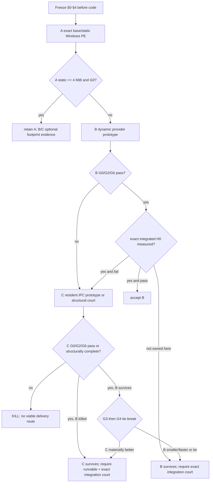

# ACU embedder delivery experiment

This experiment is not a must-ship item and does not change PRD capability
state. It chooses a delivery boundary for the already functional
`agenterm:acu` implementation.

| field | value |
|---|---|
| date | 2026-09-07 |
| purpose | keep `agenterm:acu` on the existing `Command -> Executor -> CuReply` authority while restoring the Windows main-PE size court |
| implementation | `research/acu-embedder-delivery/` |
| pre-reading | `AGENTS.md`, `docs/agenterm-rust-cheatsheet.md`, `.agents/skills/decisive-experiment/SKILL.md`, `plan/design-cu-single-entry-size-experiment.md` |
| source discipline | same dirty shared tree and pinned Rust 1.97.0 for paired measurements; every result records HEAD plus dirty-state digest |
| source provenance | clean-room boundary prototype using only repository interfaces and OS loader/IPC contracts; no third-party implementation copied |

## 0. Settled facts and capability tree

The product question is delivery topology, not whether ACU semantics should be
reimplemented.

```text
outcome: qjs `agenterm:acu` reaches the one ACU product authority within delivery budgets
├─ shared semantic authority
│  ├─ behavior: deserialize the existing Command and call the existing Executor
│  ├─ evidence: legal ok:false remains ordinary CuReply data; raw boundary failure is typed
│  ├─ delivery: no qjs copy of Command, CuReply, authorization or receipts
│  └─ non-goal: changing ACU commands, grants, effects or verification
├─ A: static full-CU link
│  ├─ behavior: current implementation
│  ├─ evidence: exact paired Windows release PE bytes
│  ├─ safe failure: compile/link failure or size-gate rejection
│  └─ non-goal: trimming individual ACU verbs
├─ B: same-process dynamic provider
│  ├─ behavior: load once, call a versioned bounded C ABI in-process
│  ├─ evidence: provider lifecycle tests, loader failure tests, PE/footprint and cold-call measurements
│  ├─ safe failure: absent/bad provider refuses before ACU execution
│  └─ non-goal: shelling out or treating the provider as new authority
└─ C: resident IPC provider
   ├─ behavior: one resident provider retains Executor; calls use bounded local IPC
   ├─ evidence: one provider PID serves repeated calls, typed transport failures, footprint/latency
   ├─ safe failure: absent/stale/malformed provider refuses before ACU execution
   └─ non-goal: one process spawn per call or a second command implementation
```

Settled facts:

1. `Command`, `Executor`, authorization, effects, receipts and `CuReply` remain
   owned by `agenterm-cu`; none may be copied into qjs or the delivery shim.
2. `ok:false` is a legal product reply and must cross B/C as data. It must not
   be confused with a loader, ABI, framing, peer or transport failure.
3. The current static implementation is functionally green but the reported
   Windows x86_64 release PE moved from 3,731,968 to 8,865,792 bytes. This
   experiment first reproduces that pair under one command and source state.
4. The Windows main executable budget remains 4,194,304 bytes. Total delivered
   bytes are separately reported and cannot be used to waive this court.
5. B means `dlopen`/`LoadLibrary` in the calling process. C means an already
   resident provider. Neither permits a shell, a CLI subprocess per call, or a
   per-call provider spawn.

## 1. Hard constraints

| id | hard constraint | observable decision |
|---|---|---|
| H0 | Windows x86_64 stripped release `agenterm.exe <= 4,194,304` | exact file length; projection may kill a route but may not make it pass |
| H1 | one ACU semantic authority | provider imports `agenterm-cu` and calls its embedder/Executor; source audit finds no qjs or shim command schema |
| H2 | legal `ok:false` is byte-preserved data | provider returns a known refusal; decoded JSON equals provider-produced JSON and boundary status is success |
| H3 | raw failures are typed and fail closed | missing provider, ABI mismatch, malformed/oversize reply and IPC loss have distinct stable boundary codes; no command executes |
| H4 | no per-call spawn | B performs zero spawn; C records one provider PID across at least 32 calls and zero child creation in the call path |
| H5 | six-platform implementability | one closed seam maps to Windows x86_64/aarch64, Linux x86_64/aarch64 and macOS x86_64/aarch64 without changing Command/CuReply; unsupported target is a kill |
| H6 | bounded boundary | request/reply lengths, waits and retained state have explicit ceilings; overflow refuses before allocation/effect where applicable |
| H7 | provider absence is never fallback | no static CU, CLI subprocess, shell or untyped success is used after provider discovery fails |
| H8 | native boundary contains panic and aliasing | provider catches unwind before it crosses `extern "C"`, permanently latches failure after panic, and its copy is valid for overlapping caller buffers |

**Disease detector:** any urge to copy the ACU JSON schema into qjs, move
product dispatch into a loader/IPC server, accept an unversioned native ABI,
spawn `agenterm-cu` for each call, or count an external provider's bytes as
removed from the overall delivery is a finding to report, not a requirement to
satisfy by expanding the prototype.

Known measurement limitation: this task owns no existing source files. A
standalone loader/client PE is therefore a conservative seam-size probe, not
an exact integrated main PE. `base agenterm.exe + whole seam probe` may reject
a route when it exceeds H0, but even a value below H0 is only **survival**, not
H0 PASS. Acceptance requires a later same-SHA integration build of the real
main PE. This limitation is fixed before results are seen.

## 2. Minimal experiment

| dimension | fixed choice | reason |
|---|---|---|
| semantic payload | existing `agenterm_cu::embedder::execute_json_from_environment` | exercises the shipped `Command -> Executor -> CuReply`, not a twin |
| request corpus | one read-only success, one legal authorization refusal, malformed JSON, missing provider, 32 repeated calls | separates product data, raw failures and lifecycle |
| B ABI | versioned C table/function, bounded caller buffers, process-lifetime loaded handle | smallest same-process seam; no Rust ABI assumption |
| C wire | versioned length-prefixed JSON over a current-user local endpoint, one request/reply per connection or bounded persistent stream | maps to Unix sockets and Windows named pipes without changing product schema |
| first implementations | A exact rebuild and B runnable prototype | fastest decisive pair: A directly tests H0; B directly tests whether isolation recovers it without per-call process latency |
| third route | C structural specification unless B cannot yield size/behavior evidence | allowed by task; every C-only claim is tagged `结构推断` |
| size build | Rust 1.97.0, Windows x86_64 MSVC, `opt-level=z`, Thin LTO, one codegen unit, panic abort, stripped | matches the product release court |
| latency | native macOS arm64, fresh process, monotonic wall clock; 11 samples, report median and p95, first call is cold | available host can execute the exact prototype; timing is not confused with Windows bytes |

The B provider is allowed to serialize the existing `CuReply` because it calls
the existing library. The loader treats a successful provider payload as
opaque UTF-8 JSON and does not reconstruct ACU fields. Boundary failures use a
small transport status enum outside the product reply; qjs may map that status
to its existing host-bridge failure without inventing a CuReply.

## 3. Precommitted criteria and measurement discipline

Priority is `G0 hard semantic/safety gates -> G1 exact main-PE gate -> G2
delivery topology -> G3 footprint -> G4 latency`. A lower priority metric may
not rescue a higher-priority failure.

| id | nature | criterion |
|---|---|---|
| G0 | Boolean/safety | H1-H8 all pass for an implemented route; any failure kills it |
| G1 | Boolean | H0 exact pass; a non-integrated route can be `survives`, never `passes` |
| G2 | Boolean/topology | no per-call spawn and no schema duplication; B loads once or C retains one PID |
| G3 | footprint | report L1 seam, L2 seam+OS/provider, and L3 complete delivered flat bytes; no hard maximum except H0 |
| G4 | latency | report cold median/p95 and steady 32-call median/p95; no acceptance threshold was requested, so this is a tie-breaker only |
| G5 | slope | adding a second ordinary ACU command changes main/seam bytes by 0 because payload remains opaque; provider growth is reported separately |
| G6 | portability checklist | all six target cells have a named loader/IPC primitive, artifact naming rule and failure mapping; any structurally missing cell kills the route |

Every byte number is labeled inline with
`{boundary, tool, build, target/execution}` and an execution status. Fixed size
levels are:

- L1: delivery seam only; OS seam and ACU payload excluded.
- L2: seam plus required OS loader/IPC code and full ACU provider.
- L3: all required delivered files, counted once as whole stripped files.

The OS seam is excluded from L1 and included in L2. Provider code, adapter,
catalog and data are excluded from L1 and included in L2/L3. Whole stripped
files use filesystem byte length; PE section attribution, if available, uses
`llvm-size` separately and is never divided into flat bytes. The A baseline is
cross-calibrated by reproducing the reported 3,731,968/8,865,792 pair. A
different same-tree value is not forced to match stale history; both values and
the reason are reported.

## 4. Decision tree, kill criteria and time box



Kill criteria:

- A is killed immediately if its exact release PE exceeds 4,194,304 bytes.
- B/C are killed immediately on schema duplication, legal `ok:false` becoming
  boundary failure, any untyped raw failure, fallback to static/CLI/shell,
  per-call spawn, unbounded frame/wait, or a missing implementation story for
  any of the six cells.
- A route that cannot produce an exact integrated main PE in this ownership
  tranche cannot be accepted; it may only win the right to the next integrated
  experiment.

Time box: stop when A has an exact paired Windows byte result, B has G0/G2 plus
Windows provider/seam/L3 bytes and native cold/steady latency, and C has the G6
structural matrix. Do not implement C unless B is killed before those results
or C is needed to break a G3/G4 tie. Do not optimize either route inside this
experiment.

Decision-tree audit:

- G0 appears before all other nodes; G1 is the exact acceptance node.
- G2 and G6 are part of the B/C hard node. G3 then G4 break a surviving tie.
- G5 is not a later branch because both eligible routes must have an opaque
  payload seam; a nonzero main/seam command slope is a G0/G2 schema leak and
  kills the route.
- All pass/fail/unmeasured combinations exit as accept, survive-next-court, or
  kill. `unmeasured exact H0` never exits as acceptance.

## 5. Evidence layout

```text
research/acu-embedder-delivery/
├─ Cargo.toml
├─ README.md
├─ RESULTS.md
├─ provider/
├─ loader-probe/
├─ empty-probe/
└─ fixtures/
```

The exact prototype layout may be smaller, but any deviation is recorded in
§8 and `RESULTS.md`. Generated build output remains under the repo-local
`target/acu-embedder-delivery/` lane and is not committed.

## 6. Excluded choices

| choice | reason |
|---|---|
| per-call `agenterm-cu` process | violates H4 and measures process startup, not a resident delivery boundary |
| shell/CLI compatibility wrapper | changes the architecture and loses the direct Executor authority |
| qjs Command/CuReply switch or validation table | duplicates schema and will drift |
| Rust dylib ABI | compiler-private and not a six-platform stable delivery contract |
| unversioned `extern "C"` JSON function | cannot fail closed on provider/version mismatch |
| TCP resident service | expands discovery/authentication scope when local native IPC exists |
| raising the 4 MiB gate | erases the motivating constraint |
| counting only `agenterm.exe` | hides provider delivery cost; H0 and L3 are both required |

## 7. Not answered

- Final provider installation, signing, update atomicity and rollback policy.
- Whether a resident provider should serve other product surfaces.
- Throughput under concurrency, cancellation during a native ACU effect, or
  long-lived provider memory pressure.
- Exact Windows cold-call latency; this host supplies native macOS timing and
  Windows byte evidence only.

## 8. Result

**B survives; exact integrated H0 remains mandatory.** The fixed criteria and
measurements are in `research/acu-embedder-delivery/RESULTS.md`. The Windows
x86_64 load-once seam measured 40,448 bytes versus a 9,576,448-byte provider
DLL; native repeated calls used one loaded library and no child process. This
is authority to integrate B and remeasure the real main PE, not authority to
call B accepted. A remains killed by the prior exact static-link main-PE court;
C remains closed unless integrated B fails a hard gate.
