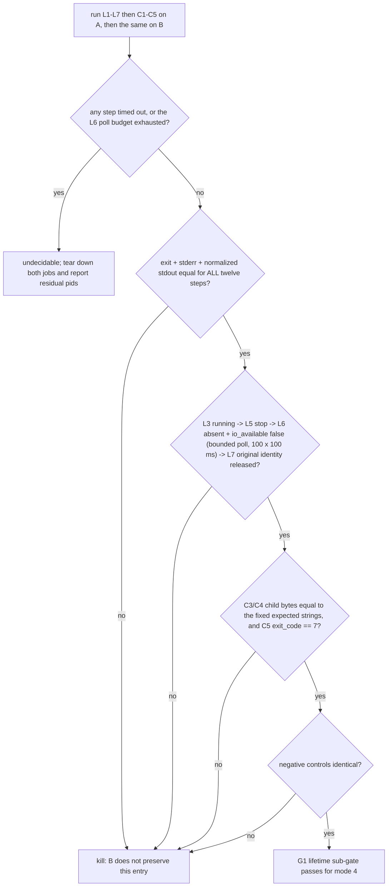

# ACU managed-job lifetime parity experiment

| Field | Value |
|---|---|
| Date | 2026-09-16 |
| Purpose | Decide whether the thin launcher preserves the managed-job resident owner's **lifetime** as well as its bytes, which is the one dimension the existing macOS paired court does not cover |
| Implementation | **spec only**; no code in this change |
| Owning product node | `prd/PRD_02_28_agenterm_cu.md` (`G1 behavior parity` for the thin-launcher entry routes) |
| Parent experiment | `plan/design-acu-thin-launcher-experiment.md` (G1 definition at its `:90`) |

This document chooses whether one bounded leaf exists. It is not a shipped
capability and must not be cited as accepted topology until its result section
says so.

## 0. Fixed facts and prior verdicts

1. G1 is `stdout/stderr/exit/lifetime` parity between the monolith and the
   fixed-sibling thin launcher (`plan/design-acu-thin-launcher-experiment.md:90`),
   under H2 "every resident/worker/native-host entry mode has an explicit parity
   path" (`:58`) and H3 "stdout, stderr and exit status match the monolith"
   (`:59`).
2. The existing macOS paired court already covers **twelve non-mutating
   presentation/refusal cases** plus a bad-ABI negative control
   (`research/acu-thin-launcher/parity-court/src/main.rs:41-113`). Every one of
   them **returns immediately**; the `host` case is Linux-only (`:108`) and is a
   `HostUnsupported` refusal, not a macOS entry. So the missing dimension is
   **lifetime**, not pairing itself.
3. **The internal owner argv form is already judged negative.** The parent
   builds that launch as `owner_command`
   (`crates/agenterm-cu/src/executor/managed_jobs.rs:1224-1234`): the launch
   document travels on **stdin**, `--agenterm-cu-internal-managed-job-owner`
   (`crates/agenterm-cu/src/lib.rs:53`) is the whole argv, and the parent sets
   `.stdout(Stdio::null()).stderr(Stdio::null())`. A court that spawns that argv
   would (a) need a real parent to supply the launch document and (b) have
   nothing observable to compare. **That form is excluded by prior verdict.**
4. **Mode 9 (`host`/`hotkeys`) is already judged negative for this purpose.** A
   single monolith run of `agenterm-cu host --self-test` returned exit 0 in one
   second, but its stdout carries machine state and a GUI side effect
   (`ax_trusted=true`, `window-place center ok`) ⇒ it reads Accessibility/TCC
   trust and performs a window placement. Pairing it would import an AX/TCC and
   GUI dependency this experiment does not want.
5. Every managed-job operation already has a public CLI front door, and
   `scripts/qjs/cu-managed-job-smoke.qjs` drives the whole lifecycle that way
   with all durable state redirected into one run directory (`:6-8`, `:43-52`).
6. **A terminated job cannot also report its child's output.** The smoke observes
   child output through `job-events` / `job-output` (`:558-583`) and the child's
   exit through `job-wait --expect-exit 7` (`:608-618`); a `job-stop` on the same
   job would kill the child while it is still blocked on stdin. The two facts
   therefore need **two job instances of the same base sequence**, executed
   inside **one** session and **one** A/B run each.

## 1. Hard constraints

- **Fixed A/B**: A is the monolith `agenterm-cu`; B is the fixed-sibling thin
  launcher running the **same argv**. No other variable changes between the two
  runs (same child, same env, same step order).
- **One run per side.** Each side executes the whole fixed sequence below exactly
  once, on one session, with two job instances. Re-running a side after seeing a
  result voids the verdict.
- **The parent is the CLI itself.** No step may require the court to impersonate
  the owner's parent, and no step may use the internal owner argv (§0.3).
- **All durable state stays in one run directory** (§2.4); the real job store,
  real `$HOME` and real XDG roots are never touched.
- **The deterministic child is copied verbatim** from the existing smoke.
- The counting unit is the **product's own observable surface**: each step's exit
  code, stdout JSON and stderr. Wall-clock is never the lifetime evidence.
- **Do not** raise a limit, drop a verb, or copy the parser into the launcher to
  make parity pass (the parent experiment's disease detector, `:66-68`).

## 2. Minimal experiment

### 2.1 A and B

```text
A = target/debug/agenterm-cu
B = target/<launcher path from the running experiment>   # same argv, provider delegated
```

### 2.2 The fixed sequence (argv is literal; every step is mandatory)

`…P…` = `--target current --grant actuate --request-id <id> --session <sid>
--session-lease <lease>` (verbatim shape from
`scripts/qjs/cu-managed-job-smoke.qjs:150-157`). The three values are not the same
kind of thing:

- `<sid>` and `<lease>` are the **random identity** values that each side reads
  back from **its own** `session-start` reply. They differ per side and are
  compared only for shape (§3.2).
- `<id>` is **not** an identity: it is the **fixed per-verb request id**, the same
  value on both sides (`lifetime-parity-<verb>`). That equality is safe because
  each side keeps its own isolated state store, so one side's request id can never
  replay the other side's effect.

The session label is **not** a member of this prefix at all, and, like `<id>`, it
is a fixed value that **is** compared across sides -- see below.

**`…P…` belongs to effect verbs only -- never to the session's own creation.**
`session-start` takes `--target current --grant actuate`, its own `--label` and
`--ttl-seconds`, and **nothing else**: it must **not** carry `--request-id`,
`--session` or `--session-lease`, because the session it is about to create does
not exist yet and the product answers a request naming an unknown session with a
typed refusal (`runtime_session_not_found`, produced only by the lookups in
`crates/agenterm-cu/src/runtime_coordinator.rs:360-372`, `:713-720` and
`:748-755`; the creating entry `:311-341` takes only `label` and `ttl_seconds`
and mints both identity values itself). The identity every `…P…` verb uses is
therefore **read back from that reply** -- `data.session_id` and `data.lease`,
both required non-empty -- and only then attached to the side. This is the shape
the qjs smoke follows at `scripts/qjs/cu-managed-job-smoke.qjs:384-388`. Each
start uses a fresh reply identity. **The label is a fixed semantic value, not run
identity**: both sides pass the same `--label lifetime-parity`, the harness
asserts the reply's `data.label` equals it exactly, and that value does cross
sides. Only the identity (`session_id`, `lease`) stays shape-only (§3.2).

```text
L1  --target current --grant actuate session-start --label lifetime-parity --ttl-seconds 120
L2  …P… job-spawn --cwd <run_dir> --env AGENTERM_JOB_SMOKE_PRIVATE=not-for-logs \
       --ttl-seconds 10 --cpu-seconds 60 --max-processes 32 \
       [--memory-bytes 536870912]  [--file-size-bytes 67108864 --max-open-files 256] \
       -- <deterministic child>                                  # job L
L3  --target current --grant observe job-status <jobL>
L4  --target current --grant observe process-state --pid <ownerL_pid>
L5  …P… job-stop <jobL> <genL>
L6  --target current --grant observe job-status <jobL>
L7  --target current --grant observe process-state --pid <ownerL_pid>

C1  …P… job-spawn …（same child, same flags as L2）              # job C
C2  …P… job-write <jobC> <genC> --data-base64 cGluZwo= --close-stdin
C3  --target current --grant observe job-events <jobC> <genC> \
       --stdout-cursor 0 --stderr-cursor 0 --timeout-ms 10000 --max-bytes 4096
C4  --target current --grant observe job-output <jobC> <genC> \
       --stream stderr --cursor 0 --max-bytes 4096
C5  --target current --grant observe job-wait <jobC> <genC> \
       --timeout-ms 10000 --expect-exit 7
```

- **Arms L1–L7 cover (a)**: ready (`job-status` running + owner identity) →
  controlled termination (`job-stop`) → **the job side's IO authority gone**,
  proved by L6 with the smoke's own bounded poll `wait_owner_absent`
  (`cu-managed-job-smoke.qjs:216-225`: up to 100 polls 100 ms apart, stopping at
  the first `io_available === false` **with** `live === null` — never a single
  read, §3.3) → **owner release proved on the original identity**, which L7 reads
  **once** by re-reading `process-state` for the same `owner_pid`; its rules are
  the smoke's own: `fixture_presence` classifies the pid as `live` **only** when
  `state.state === "live"` **and** the observed `start_identity` equals the
  original one, otherwise `absent`, otherwise `reused`
  (`:276-281`, closed set at `:229-232`; a reused pid is never signalled,
  `:240-247`). **The original `(owner_pid, start_identity)` pair — not the bare
  pid — is the subject.** For parity, the two non-`live` labels are normalized to
  a single value, **`released`**: `absent` and `reused` are never compared with
  each other (a reused pid is a different process, and requiring the same label
  would be a false red). `reused` is still not sufficient on its own — release is
  the conjunction "the original identity is no longer `live`" **and** "L6 reports
  `io_available === false`".
- **Arms C1–C5 cover (b)**: the deterministic child's stdout, stderr and exit
  status, read through the product's own output verbs.
- The platform branches in L2/C1 are part of the copied shape, not a choice: the
  smoke adds `--memory-bytes 536870912` only `if (windows || !macos)` and adds
  `--file-size-bytes … --max-open-files …` only `if (!windows)`
  (`cu-managed-job-smoke.qjs:412-420`). Keep them exactly.
- `job-events`/`job-output` and `job-wait` are the only output witnesses; a bare
  `job-status` does not carry child bytes (§0.6).

### 2.3 The deterministic child (copied verbatim)

```text
/bin/sh -c "IFS= read -r line; printf 'OUT:%s\n' \"$line\"; printf 'ERR:%s\n' \"$line\" >&2; exit 7"
```

(from `cu-managed-job-smoke.qjs:399-402`). Its only input is `C2`'s five bytes
(`--data-base64 cGluZwo=`, i.e. `ping\n`), so its stdout, stderr and exit status
are fully determined. Expected byte strings are derived from that fixed input at
implementation time (`OUT:ping\n` / `ERR:ping\n`); this document deliberately
does not hard-code hand-computed base64.

### 2.4 Environment and temporary state

Every step of both sides runs with:

```text
AGENTERM_CU_AUDIT_PATH       = <run_dir>/cu-audit.jsonl
AGENTERM_CU_RUNTIME_PATH     = <run_dir>/cu-runtime.json
AGENTERM_CU_IDEMPOTENCY_PATH = <run_dir>/cu-requests.json
AGENTERM_CU_MANAGED_JOB_PATH = <run_dir>/cu-managed-jobs.json
HOME                         = <run_dir>
XDG_DATA_HOME                = <run_dir>/data
XDG_CONFIG_HOME              = <run_dir>/config
```

`<run_dir>` comes from the harness owned root under `target/smoke/test-runs/`
(`scripts/qjs/lib/test_harness.qjs:122`), so nothing outside the repository is
written.

## 3. Precommitted criteria

### 3.1 Must be equal (both arms, every step)

| Step | Fields that must be identical across A and B |
|---|---|
| L1 | exit code, stderr, `ok`, `command`, `label === "lifetime-parity"` (a fixed semantic value both sides pass), and `identity_present`; the identity's own values are shape-only (§3.2) |
| L2 | exit code, stderr, `ok`, `command`, job identity shape (non-empty `job_id`, `generation > 0`) |
| L3 | `status`/`state` (running), and the same field set the smoke asserts at `:441-446` |
| L4 | `state === "live"`, non-empty `start_identity` |
| L5 | exit code, stderr, `ok`, `command` |
| L6 | the terminating/absent answer, proved by the smoke's **bounded poll** — never a single read, never a cached earlier one (`wait_owner_absent`, `cu-managed-job-smoke.qjs:216-225`: up to 100 polls, 100 ms apart, each a positive reply). Only `io_available === false` **with** a `live` key that is **present and `null`** succeeds; both halves are read from the raw reply, and a missing field is a stall rather than a pass (§3.3). A legal intermediate state — owner still answering while it reports the child exited — is **not** the closed state |
| L7 | `process-state` on the **original** `owner_pid`: the original `(pid, start_identity)` pair must no longer be `live`. `absent` and `reused` are **normalized to one value, `released`** — the two labels are never compared with each other (§3.3) |
| C2 | `accepted_bytes === 5`, `delivery === "complete"`, `stdin_closed === true` |
| C3 | `stdout.bytes > 0`, `stderr.bytes > 0`, both `next_cursor !== "0"`, and **`stdout.data_base64` / `stderr.data_base64` equal to the fixed expected byte strings** |
| C4 | `stream === "stderr"`, `output.data_base64` and `output.bytes` equal to C3's stderr, `output.next_cursor` equal to C3's stderr cursor |
| C5 | `completed === true`, `status.state.kind === "exited"`, **`status.state.exit_code === 7`** |

### 3.2 Fields that must be normalized (run identity, not product semantics)

**Only identities and clocks are normalized**: `job_id`, `generation`,
`owner_pid`, `session_id`, `session_lease`, timestamps, and audit line ordering
where the PRD does not fix it. Compare these **only for shape** (non-empty, and
monotonic where the contract says so). The session `label` and the per-verb
`--request-id` are **not** in this list: both are fixed semantic values that the
two sides pass identically. That is safe because each side keeps its **own
isolated state directory**, so one side's request identity can never replay the
other side's effect -- which is what makes the same-argv discipline real rather
than approximate.

### 3.3 ready → controlled termination → absent

- **ready**: L3 answers running, and L4 on the owner pid answers `live` with a
  non-empty `start_identity`.
- **controlled termination**: L5 succeeds for the exact `<jobL> <genL>`.
- **absent / io closed** (job side): L6 is a **bounded poll**, not a single
  re-read — it repeats the smoke's own `wait_owner_absent` exactly
  (`cu-managed-job-smoke.qjs:216-225`): up to **100 polls, 100 ms apart**, every
  poll a fresh `job-status` that must be a **positive reply** (`exit 0`,
  `ok: true`). Only the conjunction `io_available === false` **and** a `live` key
  that is **present and `null`** is the closed state, and the loop stops at the
  first poll that satisfies it. An exhausted budget is **`undecidable` /
  harness-invalid, never a pass** (§3.5, §4), and the report carries the **last**
  poll's status so the stall is inspectable.
- **Both halves are read from the raw reply, never from the projection.** The
  comparison projection folds a whitelisted key the reply omits into `null`
  (`lifetime_project`), so it carries **no** presence information: reading
  "closed" off the projection cannot distinguish "`live` is `null`" from "`live`
  was never sent". Presence therefore comes from the raw `data` object, parsed
  once per poll. The cross-side projection is **unchanged** and still receives
  only the final, closed observation.
- **A missing field is a stall, never a silent success.** A poll whose
  `io_available` is absent or not a bool, or whose `live` key is absent, neither
  ends the loop early nor satisfies it: the poll is recorded as `missing` and the
  loop keeps polling. If the budget runs out that way, the failure names the half
  that was missing —
  `last=io_available=<bool|missing_or_not_bool>:live=<missing|null|not_null>` — so
  "the product never sent the field" can never be read as "the product converged".
- **A legal intermediate state must never be read as the closed state.** Until
  the owner stops answering, `job-status` legitimately returns
  `io_available === true` together with a `Some` `live` projection of the already
  terminated job — the owner is still reachable, so `record_payload`'s
  `"io_available": live.is_some_and(|status| !status.adopted)`
  (`crates/agenterm-cu/src/executor/managed_jobs.rs:1921`) is `true`. Only when the
  owner becomes unreachable does `job_status_payload` reconcile the record and
  pass `None`, which yields `io_available === false` **together with**
  `live === null` (`:600-621`). That convergence is exactly what the poll waits
  for; a single read cannot observe it (the §10 run measured a 159 ms
  `created_at → terminal_at` gap and the owner outlived the first read).
  ⇒ "exited while `io_available` is still `true`" is **not** an accepted
  substitute for the closed state.
- What this step does **not** accept: a `job-status` that fails because the record
  itself is gone (`required_record` returns a typed error, `:602`) is *not*
  evidence of an IO-closed owner — that reply is not positive, so the poll fails
  loudly at the `positive_reply` assertion rather than being counted as a stall.
  Conversely a poll that violates the **field** contract (absent or non-bool
  `io_available`, absent `live`) is **not** turned into an early failure: it counts
  as a stall and the loop keeps polling until the budget is spent. The field is
  unconditional and always a bool in the product (`:1921`), which is exactly why a
  violation must stay visible as a stall instead of being normalized away.
- **owner released** (normalized, L7): L7 re-reads `process-state` for the
  **original** `owner_pid`. It fails when the pair is `live` with the original
  `start_identity`. Otherwise the answer is normalized to a single value,
  **`released`**: both `absent` and `reused` mean the original identity is no
  longer running, and the two labels are **not** required to match each other
  across sides — a reused pid is simply a different process, so demanding the
  same label would be a false red. `reused` is still **not** sufficient on its
  own: release is claimed only together with the job-side witness above, i.e. the
  conjunction `original identity no longer live` **and** `L6 reports
  io_available === false`.

### 3.4 Three negative controls

1. The internal owner argv refusal already in `CASES` (`:67-71`), identical on
   both sides.
2. `job-spawn` without the `--grant actuate` prefix: same typed refusal on both
   sides.
3. `job-stop` with a wrong `generation`: same typed refusal on both sides.

### 3.5 Deadlines and teardown on failure

30 s per step (the smoke's own budget), and a **hard wall for the whole
sequence** — **twelve** steps (L1–L7 + C1–C5), so **165 s** — reported as
`undecidable` on timeout, never as a pass. `C3`/`C5` keep their own 10 s
`--timeout-ms` inside that budget.

**The poll belongs to L6, not L7.** `wait_owner_absent`'s own bound is **100 polls
× 100 ms** (`:217-222`), and L6 stops at the first poll that satisfies the closed
state, so the worst case adds roughly the smoke's own ten seconds. The poll takes
its deadline as an **explicit argument**, and every individual poll call takes the
**sooner** of its 30 s step budget and that deadline — so whenever the deadline is
earlier it wins, and the loop can never outlive the budget it was handed. L6 passes
the sequence wall; teardown passes its own per-job budget (below). An L6 poll budget
exhausted before the closed state holds (§3.3) is an `undecidable` outcome under §4,
not a `kill`. L7 stays a **single** `process-state` read and its criterion is
unchanged: once L6 has converged the owner is already unreachable, so polling there
would only spend budget.

**Teardown on any failure** (mandatory, and reported): before the run directory
is left behind, best-effort `job-stop` **both** jobs (L and C) with their exact
`<job_id> <generation>`, then settle each with the **same bounded convergence as
L6** (the `wait_owner_absent` poll of §3.3) instead of a single `job-status`, so a
brief legitimate `live` after a successful stop is not misreported as a residual.
Teardown's own polls write **no** cross-side projection — they decide the residual
list and nothing else.

**Teardown gets its own budget, and never inherits a spent sequence wall.** Each
job is cleaned against a **fresh, fixed, bounded** deadline of its own — the same
100 × 100 ms shape, i.e. ten seconds — covering both that job's `job-stop` call and
its settlement poll, with each call still additionally capped by the 30 s step
budget. This is deliberate: the sequence wall may already be exhausted when a late
failure brings teardown in, and "the sequence ran out of time" must never be the
reason a job is left uncleaned or is reported as a residual it was never given a
chance to resolve. A job whose own ten seconds run out **is** reported as an
unresolved residual, which is then a statement about that job alone.

The report must list every residual pid (and its `start_identity`) that survived
the teardown, and must say when a stop was refused, when a job's own convergence
budget ran out, or when a poll could not be inspected. A failure never leaves the
two jobs unreported, and never suppresses the residual list because the run already
failed.

## 4. Decision tree, kill criteria and time box



Kill criteria:

1. Any semantic that **only appears under a real parent or system
   registration** kills this leaf (this is why the internal owner argv form is
   excluded up front).
2. Any step that cannot be made bounded (hangs, or needs a human/TCC/browser)
   kills the leaf.
3. Any need to change A, the child, the steps, or a limit after seeing a result
   makes the verdict post hoc and void.
4. A pass here is **only** a mode-4 lifetime sub-gate; it does not close G1,
   because the remaining native lifecycle, installed activation, and the
   Linux/Windows paired courts stay open.

Time box: stop as soon as all **twelve** steps have numbers on both sides, or as
soon as one kill criterion fires. No second workload, no re-run for a more
favourable result.

## 5. Evidence layout

```text
research/acu-thin-launcher/
├─ parity-court/          # extend with a sequence-shaped case (two job instances)
└─ RESULTS.md             # append the twelve-step table + deviations
```

## 6. Owning files and estimated cost

| File | Change |
|---|---|
| `research/acu-thin-launcher/parity-court/src/main.rs` | **the only implementation file.** `Case { name, argv: &[&str], expectation }` (`:41-113`, `:245`) is single-argv only; this experiment needs a **sequence** case (twelve steps, two job instances) plus transition and byte assertions. The existing `observe()` already gives argv → (stdout, stderr, exit), so the change is "call it several times and assert the transitions and the fixed child bytes". |

Estimated cost: **1–2 commits**, and it is a structural small change rather than
appending one case. A court that pairs only a single `job-spawn` reply carries no
lifetime and no child output, and must not be reported as this gate.

## 7. Public black-box follow-up (not part of this experiment)

If the research-side result passes, the registered follow-up is a bounded smoke
in `scripts/qjs/` that runs the same A/B sequence on the staged topology and
emits its own evidence id, in the shape of the existing managed-job smoke. That
smoke — not this document — would be the public evidence; it needs its own
precommitted criteria before it is written.

## 8. Excluded options and non-goals

| Option | Reason |
|---|---|
| Internal owner argv as the A/B entry | Prior verdict (§0.3): requires a real parent, and its stdout/stderr are nulled |
| mode 9 `host`/`hotkeys` pairing | Prior verdict (§0.4): reads AX/TCC trust and performs a window placement |
| mode 6 privilege broker | Needs signed/root-owned activation under a service manager |
| mode 1 Native Messaging | Needs a real Chromium host |
| One job for both arms | Impossible: `job-stop` would kill the child before it can report `exit 7` (§0.6) |
| Pairing only bytes/exit of one command | Does not carry lifetime |
| Raising the launcher budget or pruning verbs to make parity pass | Disease detector of the parent experiment |
| Treating this document as acceptance of topology B | It is one sub-gate |

## 9. Not answered

- Whether provider-side internals need their own lifetime parity (a per-family
  split is out of scope).
- Installed-service activation, update recovery and the Linux/Windows paired
  courts.
- Signed privileged-provider rollout.

## 10. Deviations and prior runs

**2026-09-16 — one authorised run, classified `harness-invalid` (no product
verdict).** The single `--lifetime-parity` run (HEAD `daade72d`, court built from
the working tree) stopped at the first step with

```text
lifetime_side_failed:monolith:lifetime_expectation_failed:L1-session-start:positive_reply:
{"command":"session-start","data":{},"error_code":"runtime_session_not_found","exit":1,"ok":false}:residuals[none]
```

Root cause, found by a read-only audit and **not** a product behaviour: the
harness sent the `…P…` prefix (including `--session` / `--session-lease`) to
`session-start` itself. That verb creates the session, accepts only
`--target current --grant actuate` plus its own `--label` / `--ttl-seconds`, and
mints both identity values itself
(`crates/agenterm-cu/src/runtime_coordinator.rs:311-341`), while
`runtime_session_not_found` is produced **only** by the lookups at `:360-372`,
`:713-720` and `:748-755`. The product's refusal was therefore correct.

Consequences recorded here so the run is not misread:

- **A and B never reached the comparison surface.** The monolith failed at L1 and
  the launcher side never ran; no step of the twelve-step identity was computed
  on either side. This is a harness/argv contract violation, not "B does not
  preserve the entry" and not an `undecidable` timeout.
- **No product verdict was produced** by that run. The failure says nothing about
  the thin launcher, the provider or the managed-job entry; it says the harness
  called a creating verb as if the created identity already existed.
- **The precommitted criteria are unchanged.** §3's equality table, the three
  negative controls, the per-step 30 s / whole 165 s budgets and the kill
  criteria stay exactly as written; only the calling shape of the session step is
  corrected by §2.2.

The run left its repository-local run root in place
(`target/acu-thin-launcher/lifetime-parity/<pid>-<nonce>/`, containing an empty
`home/` and a zero-byte `cu-runtime.json.lock`, i.e. no session was ever
recorded), with `residuals[none]` and no surviving process. Its input artifacts
were built earlier the same day, before the recorded HEAD; the court binary
itself was built from the working tree.

**2026-09-16 — second authorised run, also `harness-invalid` (still no product
verdict).** The single `--lifetime-parity` run after §2.2 was corrected (HEAD
`daade72d`, court rebuilt from the working tree) advanced to **L6** and stopped
there: **exit 1 in 1545 ms**, stdout empty, verdict on stderr. Verbatim (the only
edit is the run-root path, made repo-relative per `AGENTS.md:10-20`):

```text
acu-thin-launcher-parity:lifetime_side_failed:monolith:lifetime_expectation_failed:L6-job-status:io_closed:{"command":"job-status","data":{"io_available":true,"live":{"adopted":false,"lease_remaining_ms":9862,"state":{"exit_code":7,"kind":"exited"},"stderr_current_cursor":5,"stderr_earliest_cursor":0,"stdin_open":false,"stdout_current_cursor":5,"stdout_earliest_cursor":0},"state":"exited"},"error_code":null,"exit":0,"ok":true}:residuals[L:residual_live={"adopted":false,"lease_remaining_ms":9796,"state":{"exit_code":7,"kind":"exited"},"stderr_current_cursor":5,"stderr_earliest_cursor":0,"stdin_open":false,"stdout_current_cursor":5,"stdout_earliest_cursor":0}:io_available=Some(true)]:run_root_kept=target/acu-thin-launcher/lifetime-parity/85264-1789563372883551000
```

What this run **did** establish — it is progress, not a failure:

- **L1–L5 all passed.** `#170`/`#171`'s session prelude fix is now empirically
  validated: `monolith/cu-runtime.json` is 350 B (the earlier run left only a
  zero-byte lock), and `monolith/cu-managed-jobs.json` (628 B) holds a full record
  with `"terminal_trigger":"explicit_stop"`. So session creation, `job-spawn`, the
  `running` ready state, owner `live` with a non-empty `start_identity`, and
  **controlled termination by `job-stop`** all worked.
- **The explicit trigger also proves L5 was a real stop**, not an expiry: the
  record's `on_expiry` is `stop`, but the trigger that actually fired is the
  explicit verb.

Why this is `harness-invalid` rather than a verdict:

- **B never started.** A failed at L6, so the launcher side was never invoked and
  no step of the twelve-step identity was computed on both sides. **No parity
  verdict of any kind was produced**, and the failure says nothing about the thin
  launcher, the provider or the managed-job entry.
- **The observed `io_available === true` was a legal intermediate state, not a
  product fault.** The record's own clocks show `created_at_utc_ms 1789563372967 →
  terminal_at_utc_ms 1789563373126` (**Δ = 159 ms**), so the owner was still
  answering `job-status` when the harness read it once: `record_payload`'s
  `"io_available": live.is_some_and(|status| !status.adopted)`
  (`crates/agenterm-cu/src/executor/managed_jobs.rs:1921`) is legitimately `true`
  while `live` is a `Some(exited)` projection. The product converges to
  `live === null` **with** `io_available === false` only once the owner stops
  answering (`:600-621`). That is exactly why the smoke **polls**
  (`cu-managed-job-smoke.qjs:216-225`, 100 × 100 ms, used directly after an
  explicit `job-stop` at `:326-329` → `:619`/`:842`) and why a single read cannot
  observe it.
- **The defect was in the harness, and it was written into this spec.** §3.3 had
  said L6 proves absence "**by re-reading**" — not the same rule as the smoke's
  bounded poll, and the reason the first read returned a legitimate intermediate
  state. §3.1, §3.3, §3.5 and §4 now state the poll explicitly (up to 100 polls
  100 ms apart, every poll a positive reply, only `io_available === false` **and**
  `live === null` succeeding, the whole wall winning whenever it is earlier, an
  exhausted budget being `undecidable`/harness-invalid and never a pass). L7 keeps
  its **single** read and its unchanged `released` criterion, and teardown settles
  with the same bounded convergence.

Environment, so the two runs are comparable: the four inputs are **the same
artifacts** as the run above (mtimes 14:06–14:35, sha256 recorded at run time —
monolith `5a45a921…`, staged launcher `e9562d1c…`, ABI library `820cdb5e…`,
bad-ABI fixture `950b3960…`) and only the court binary was rebuilt
(`dcdc54da…`, 20:56). The run root
`target/acu-thin-launcher/lifetime-parity/85264-1789563372883551000/` is left in
place with its `monolith/` state files, `residuals[L:residual_live=…]` is the
teardown's own observation rather than a surviving process, and no process from
the run outlived it.

**2026-09-16 — third authorised run, `harness-invalid` again; the sequence is
halted at its time box (still no product verdict).** The single
`--lifetime-parity` run after the §3.3/§3.5 and L6/teardown revisions (HEAD
`daade72d`, court rebuilt from the working tree) advanced to **C3** — the first run
to cross L6 — and stopped there: **exit 1 in 21.45 s** (the earlier runs took 1 s
and 1.5 s; the difference is the bounded L6 and teardown polling actually
waiting), stdout empty, verdict on stderr. Verbatim (run-root path made
repo-relative per `AGENTS.md:10-20`):

```text
acu-thin-launcher-parity:lifetime_side_failed:monolith:lifetime_expectation_failed:C3-job-events:residuals[none]:run_root_kept=target/acu-thin-launcher/lifetime-parity/16622-1789564031976462000
```

Positive findings, recorded so the stop does not erase them:

- **L1–L7 all passed**, including the bounded L6 written after the second run.
- **C1 and C2 passed**: audit recorded `accepted_bytes 5`, `delivery complete`,
  `stdin_closed true`.
- **Teardown converged**: audit shows teardown's `job-stop` failing with
  `managed_job_owner_unavailable` while the run still reported `residuals[none]`
  — the second run's `residual_live=…` is gone.
- Both job records reached `state {kind: "exited", exit_code: 7}`, one with
  `terminal_trigger: "explicit_stop"` and one with `root_exit`.

Why it is `harness-invalid` rather than a verdict: **B never started.** A failed at
C3, so the launcher side was never invoked and not one of the twelve steps was
computed on both sides. **After three runs no parity verdict of any kind exists,
and no A baseline exists either.**

Why C3 is **unresolved** rather than diagnosed: its byte assertion reports only
its step name (the bare fact `"C3-job-events"`), so the failure text carries no
returned projection; `observe`-class verbs do not write the audit log (this run's
audit holds only `session-start`, `job-spawn` ×2, `job-stop` and `job-write`); and
the run root leaves no job IO buffers. The failure is provably *not* a product
refusal (`exit 0` / `ok: true` was required before the byte check) and provably
not an expectation typo (`base64("OUT:ping\n")` and `base64("ERR:ping\n")` match
the constants, and the child is copied verbatim from the smoke), yet "wrong bytes"
and "missing field" cannot be told apart from what was left behind. The most
plausible remaining candidate is that C3 reads a buffer the owner has already
reclaimed — this side's job went from `job-write` to `terminal_at` in ~38 ms —
which is the same family as L6, except that L6 treats convergence as success while
C3 needs the bytes *before* convergence.

Two defects carried forward, neither fixed here: teardown's **request id is the
same fixed string for every job**, so a second job's `job-stop` is deduplicated by
the idempotency store instead of executed (the audit holds a single
`teardown-stop` row, for job L); and the **C3/C4/C5 assertions still report bare
step names**, so a byte-level failure there can never be diagnosed from its own
text.

Environment: the four inputs are **the same artifacts as both runs above** (mtimes
14:06–14:35, sha256 unchanged — monolith `5a45a921…`, staged launcher `e9562d1c…`,
ABI library `820cdb5e…`, bad-ABI fixture `950b3960…`), and only the court was
rebuilt (`80a88f95…`, 21:07). The run root
`target/acu-thin-launcher/lifetime-parity/16622-1789564031976462000/` is left in
place, `git diff | sha256` was `2638bac4…` both before and after the run, and no
process from the run outlived it.

**The sequence stops here, on this document's time box.** This section is the end
of the experiment, not a checkpoint before a re-run: no further run of this spec is
planned, and nothing in it should be described as "waiting for a re-run". Reopening
the question requires a **new, separately precommitted follow-up** with its own
hard constraints, its own equality table, its own diagnostic requirement (a failure
fact must carry data, per the third run's unresolved C3) and its own teardown
request-id rule — re-running this sequence under these criteria would be post hoc
and is void by §4's kill criterion 3.
