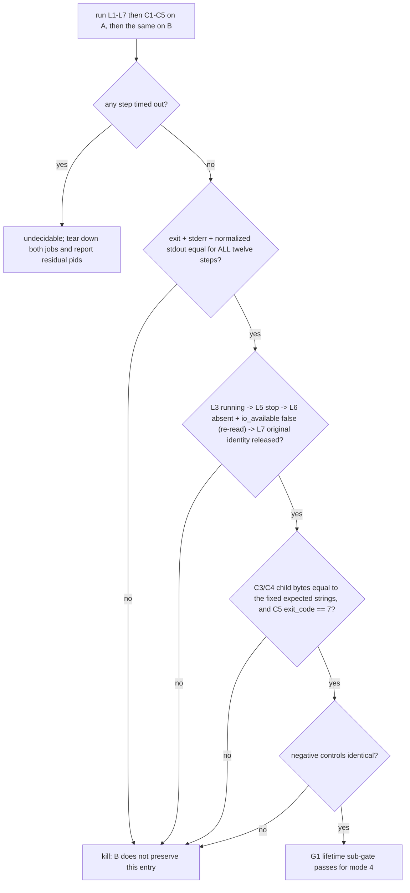

# ACU managed-job lifetime parity experiment

| Field | Value |
|---|---|
| Date | 2026-09-16 |
| Purpose | Decide whether the thin launcher preserves the managed-job resident owner's **lifetime** as well as its bytes, which is the one dimension the existing macOS paired court does not cover |
| Implementation | **spec only**; no code in this change |
| Owning product node | `prd/PRD_02_28_agenterm_cu.md` (`G1 behavior parity` for the thin-launcher entry routes) |
| Parent experiment | `plan/design-acu-thin-launcher-experiment.md` (G1 definition at its `:90`) |

This document chooses whether one bounded leaf exists. It is not a shipped
capability and must not be cited as accepted topology until its result section
says so.

## 0. Fixed facts and prior verdicts

1. G1 is `stdout/stderr/exit/lifetime` parity between the monolith and the
   fixed-sibling thin launcher (`plan/design-acu-thin-launcher-experiment.md:90`),
   under H2 "every resident/worker/native-host entry mode has an explicit parity
   path" (`:58`) and H3 "stdout, stderr and exit status match the monolith"
   (`:59`).
2. The existing macOS paired court already covers **twelve non-mutating
   presentation/refusal cases** plus a bad-ABI negative control
   (`research/acu-thin-launcher/parity-court/src/main.rs:41-113`). Every one of
   them **returns immediately**; the `host` case is Linux-only (`:108`) and is a
   `HostUnsupported` refusal, not a macOS entry. So the missing dimension is
   **lifetime**, not pairing itself.
3. **The internal owner argv form is already judged negative.** The parent
   builds that launch as `owner_command`
   (`crates/agenterm-cu/src/executor/managed_jobs.rs:1224-1234`): the launch
   document travels on **stdin**, `--agenterm-cu-internal-managed-job-owner`
   (`crates/agenterm-cu/src/lib.rs:53`) is the whole argv, and the parent sets
   `.stdout(Stdio::null()).stderr(Stdio::null())`. A court that spawns that argv
   would (a) need a real parent to supply the launch document and (b) have
   nothing observable to compare. **That form is excluded by prior verdict.**
4. **Mode 9 (`host`/`hotkeys`) is already judged negative for this purpose.** A
   single monolith run of `agenterm-cu host --self-test` returned exit 0 in one
   second, but its stdout carries machine state and a GUI side effect
   (`ax_trusted=true`, `window-place center ok`) ⇒ it reads Accessibility/TCC
   trust and performs a window placement. Pairing it would import an AX/TCC and
   GUI dependency this experiment does not want.
5. Every managed-job operation already has a public CLI front door, and
   `scripts/qjs/cu-managed-job-smoke.qjs` drives the whole lifecycle that way
   with all durable state redirected into one run directory (`:6-8`, `:43-52`).
6. **A terminated job cannot also report its child's output.** The smoke observes
   child output through `job-events` / `job-output` (`:558-583`) and the child's
   exit through `job-wait --expect-exit 7` (`:608-618`); a `job-stop` on the same
   job would kill the child while it is still blocked on stdin. The two facts
   therefore need **two job instances of the same base sequence**, executed
   inside **one** session and **one** A/B run each.

## 1. Hard constraints

- **Fixed A/B**: A is the monolith `agenterm-cu`; B is the fixed-sibling thin
  launcher running the **same argv**. No other variable changes between the two
  runs (same child, same env, same step order).
- **One run per side.** Each side executes the whole fixed sequence below exactly
  once, on one session, with two job instances. Re-running a side after seeing a
  result voids the verdict.
- **The parent is the CLI itself.** No step may require the court to impersonate
  the owner's parent, and no step may use the internal owner argv (§0.3).
- **All durable state stays in one run directory** (§2.4); the real job store,
  real `$HOME` and real XDG roots are never touched.
- **The deterministic child is copied verbatim** from the existing smoke.
- The counting unit is the **product's own observable surface**: each step's exit
  code, stdout JSON and stderr. Wall-clock is never the lifetime evidence.
- **Do not** raise a limit, drop a verb, or copy the parser into the launcher to
  make parity pass (the parent experiment's disease detector, `:66-68`).

## 2. Minimal experiment

### 2.1 A and B

```text
A = <repo>/target/debug/agenterm-cu
B = <repo>/<launcher path from the running experiment>   # same argv, provider delegated
```

### 2.2 The fixed sequence (argv is literal; every step is mandatory)

`…P…` = `--target current --grant actuate --request-id <id> --session <sid>
--session-lease <lease>` (verbatim shape from
`scripts/qjs/cu-managed-job-smoke.qjs:150-157`). `<label>`, `<id>` and `<lease>`
are the run's own identity values; they are never compared across sides (§3.2).

```text
L1  …P… session-start --label <label> --ttl-seconds 120
L2  …P… job-spawn --cwd <run_dir> --env AGENTERM_JOB_SMOKE_PRIVATE=not-for-logs \
       --ttl-seconds 10 --cpu-seconds 60 --max-processes 32 \
       [--memory-bytes 536870912]  [--file-size-bytes 67108864 --max-open-files 256] \
       -- <deterministic child>                                  # job L
L3  --target current --grant observe job-status <jobL>
L4  --target current --grant observe process-state --pid <ownerL_pid>
L5  …P… job-stop <jobL> <genL>
L6  --target current --grant observe job-status <jobL>
L7  --target current --grant observe process-state --pid <ownerL_pid>

C1  …P… job-spawn …（same child, same flags as L2）              # job C
C2  …P… job-write <jobC> <genC> --data-base64 cGluZwo= --close-stdin
C3  --target current --grant observe job-events <jobC> <genC> \
       --stdout-cursor 0 --stderr-cursor 0 --timeout-ms 10000 --max-bytes 4096
C4  --target current --grant observe job-output <jobC> <genC> \
       --stream stderr --cursor 0 --max-bytes 4096
C5  --target current --grant observe job-wait <jobC> <genC> \
       --timeout-ms 10000 --expect-exit 7
```

- **Arms L1–L7 cover (a)**: ready (`job-status` running + owner identity) →
  controlled termination (`job-stop`) → **owner release proved on the original
  identity** (L7 re-reads `process-state` for the same `owner_pid`) → absent
  proved by re-reading.
  L7 reuses the smoke's own rules: `wait_owner_absent` polls `job-status` until
  `io_available === false` (`cu-managed-job-smoke.qjs:216-225`), and
  `fixture_presence` classifies the pid as `live` **only** when
  `state.state === "live"` **and** the observed `start_identity` equals the
  original one, otherwise `absent`, otherwise `reused`
  (`:276-281`, closed set at `:229-232`; a reused pid is never signalled,
  `:240-247`). **The original `(owner_pid, start_identity)` pair — not the bare
  pid — is the subject.** For parity, the two non-`live` labels are normalized to
  a single value, **`released`**: `absent` and `reused` are never compared with
  each other (a reused pid is a different process, and requiring the same label
  would be a false red). `reused` is still not sufficient on its own — release is
  the conjunction "the original identity is no longer `live`" **and** "L6 reports
  `io_available === false`".
- **Arms C1–C5 cover (b)**: the deterministic child's stdout, stderr and exit
  status, read through the product's own output verbs.
- The platform branches in L2/C1 are part of the copied shape, not a choice: the
  smoke adds `--memory-bytes 536870912` only `if (windows || !macos)` and adds
  `--file-size-bytes … --max-open-files …` only `if (!windows)`
  (`cu-managed-job-smoke.qjs:412-420`). Keep them exactly.
- `job-events`/`job-output` and `job-wait` are the only output witnesses; a bare
  `job-status` does not carry child bytes (§0.6).

### 2.3 The deterministic child (copied verbatim)

```text
/bin/sh -c "IFS= read -r line; printf 'OUT:%s\n' \"$line\"; printf 'ERR:%s\n' \"$line\" >&2; exit 7"
```

(from `cu-managed-job-smoke.qjs:399-402`). Its only input is `C2`'s five bytes
(`--data-base64 cGluZwo=`, i.e. `ping\n`), so its stdout, stderr and exit status
are fully determined. Expected byte strings are derived from that fixed input at
implementation time (`OUT:ping\n` / `ERR:ping\n`); this document deliberately
does not hard-code hand-computed base64.

### 2.4 Environment and temporary state

Every step of both sides runs with:

```text
AGENTERM_CU_AUDIT_PATH       = <run_dir>/cu-audit.jsonl
AGENTERM_CU_RUNTIME_PATH     = <run_dir>/cu-runtime.json
AGENTERM_CU_IDEMPOTENCY_PATH = <run_dir>/cu-requests.json
AGENTERM_CU_MANAGED_JOB_PATH = <run_dir>/cu-managed-jobs.json
HOME                         = <run_dir>
XDG_DATA_HOME                = <run_dir>/data
XDG_CONFIG_HOME              = <run_dir>/config
```

`<run_dir>` comes from the harness owned root under `target/smoke/test-runs/`
(`scripts/qjs/lib/test_harness.qjs:122`), so nothing outside the repository is
written.

## 3. Precommitted criteria

### 3.1 Must be equal (both arms, every step)

| Step | Fields that must be identical across A and B |
|---|---|
| L1 | exit code, stderr, `ok`, `command`, session shape |
| L2 | exit code, stderr, `ok`, `command`, job identity shape (non-empty `job_id`, `generation > 0`) |
| L3 | `status`/`state` (running), and the same field set the smoke asserts at `:441-446` |
| L4 | `state === "live"`, non-empty `start_identity` |
| L5 | exit code, stderr, `ok`, `command` |
| L6 | the terminating/absent answer, **re-read** (never a cached earlier one — the smoke states this rule at `:242-244`): `io_available === false` with `live === null`, the field being unconditional (§3.3) |
| L7 | `process-state` on the **original** `owner_pid`: the original `(pid, start_identity)` pair must no longer be `live`. `absent` and `reused` are **normalized to one value, `released`** — the two labels are never compared with each other (§3.3) |
| C2 | `accepted_bytes === 5`, `delivery === "complete"`, `stdin_closed === true` |
| C3 | `stdout.bytes > 0`, `stderr.bytes > 0`, both `next_cursor !== "0"`, and **`stdout.data_base64` / `stderr.data_base64` equal to the fixed expected byte strings** |
| C4 | `stream === "stderr"`, `output.data_base64` and `output.bytes` equal to C3's stderr, `output.next_cursor` equal to C3's stderr cursor |
| C5 | `completed === true`, `status.state.kind === "exited"`, **`status.state.exit_code === 7`** |

### 3.2 Fields that must be normalized (run identity, not product semantics)

`job_id`, `generation`, `owner_pid`, `session_id`, `session_lease`, `label`,
request ids, timestamps, and audit line ordering where the PRD does not fix it.
Compare these **only for shape** (non-empty, and monotonic where the contract
says so).

### 3.3 ready → controlled termination → absent

- **ready**: L3 answers running, and L4 on the owner pid answers `live` with a
  non-empty `start_identity`.
- **controlled termination**: L5 succeeds for the exact `<jobL> <genL>`.
- **absent / io closed** (job side): L6 proves absence **by re-reading**, and the
  job's IO authority is gone — the smoke's `wait_owner_absent` rule, i.e.
  `job-status` answers `io_available === false` (`:216-225`). The field's contract
  is authoritative and unconditional: `record_payload` always writes
  `"io_available": live.is_some_and(|status| !status.adopted)`
  (`crates/agenterm-cu/src/executor/managed_jobs.rs:1921`), so it is **always
  present and always a bool** — a missing field is not a case this step has to
  normalize. When the owner is unreachable, `job_status_payload` reconciles the
  record and passes `None`, which yields `io_available === false` together with
  `live === null` (`:600-621`). What this step does **not** accept: a
  `job-status` that fails because the record itself is gone (`required_record`
  returns a typed error, `:602`) is *not* evidence of an IO-closed owner — the
  step requires the record to still exist and report `io_available === false`.
- **owner released** (normalized, L7): L7 re-reads `process-state` for the
  **original** `owner_pid`. It fails when the pair is `live` with the original
  `start_identity`. Otherwise the answer is normalized to a single value,
  **`released`**: both `absent` and `reused` mean the original identity is no
  longer running, and the two labels are **not** required to match each other
  across sides — a reused pid is simply a different process, so demanding the
  same label would be a false red. `reused` is still **not** sufficient on its
  own: release is claimed only together with the job-side witness above, i.e. the
  conjunction `original identity no longer live` **and** `L6 reports
  io_available === false`.

### 3.4 Three negative controls

1. The internal owner argv refusal already in `CASES` (`:67-71`), identical on
   both sides.
2. `job-spawn` without the `--grant actuate` prefix: same typed refusal on both
   sides.
3. `job-stop` with a wrong `generation`: same typed refusal on both sides.

### 3.5 Deadlines and teardown on failure

30 s per step (the smoke's own budget), and a **hard wall for the whole
sequence** — **twelve** steps (L1–L7 + C1–C5), so **165 s** — reported as
`undecidable` on timeout, never as a pass. `C3`/`C5` keep their own 10 s
`--timeout-ms` inside that budget, and L7's poll follows the smoke's own bound
(100 polls × 100 ms, `:217-222`).

**Teardown on any failure** (mandatory, and reported): before the run directory
is left behind, best-effort `job-stop` **both** jobs (L and C) with their exact
`<job_id> <generation>`, then re-read each with `job-status`. The report must list
every residual pid (and its `start_identity`) that survived the teardown, and must
say when a stop was refused or `undecidable`. A failure never leaves the two jobs
unreported, and never suppresses the residual list because the run already
failed.

## 4. Decision tree, kill criteria and time box



Kill criteria:

1. Any semantic that **only appears under a real parent or system
   registration** kills this leaf (this is why the internal owner argv form is
   excluded up front).
2. Any step that cannot be made bounded (hangs, or needs a human/TCC/browser)
   kills the leaf.
3. Any need to change A, the child, the steps, or a limit after seeing a result
   makes the verdict post hoc and void.
4. A pass here is **only** a mode-4 lifetime sub-gate; it does not close G1,
   because the remaining native lifecycle, installed activation, and the
   Linux/Windows paired courts stay open.

Time box: stop as soon as all **twelve** steps have numbers on both sides, or as
soon as one kill criterion fires. No second workload, no re-run for a more
favourable result.

## 5. Evidence layout

```text
research/acu-thin-launcher/
├─ parity-court/          # extend with a sequence-shaped case (two job instances)
└─ RESULTS.md             # append the twelve-step table + deviations
```

## 6. Owning files and estimated cost

| File | Change |
|---|---|
| `research/acu-thin-launcher/parity-court/src/main.rs` | **the only implementation file.** `Case { name, argv: &[&str], expectation }` (`:41-113`, `:245`) is single-argv only; this experiment needs a **sequence** case (twelve steps, two job instances) plus transition and byte assertions. The existing `observe()` already gives argv → (stdout, stderr, exit), so the change is "call it several times and assert the transitions and the fixed child bytes". |

Estimated cost: **1–2 commits**, and it is a structural small change rather than
appending one case. A court that pairs only a single `job-spawn` reply carries no
lifetime and no child output, and must not be reported as this gate.

## 7. Public black-box follow-up (not part of this experiment)

If the research-side result passes, the registered follow-up is a bounded smoke
in `scripts/qjs/` that runs the same A/B sequence on the staged topology and
emits its own evidence id, in the shape of the existing managed-job smoke. That
smoke — not this document — would be the public evidence; it needs its own
precommitted criteria before it is written.

## 8. Excluded options and non-goals

| Option | Reason |
|---|---|
| Internal owner argv as the A/B entry | Prior verdict (§0.3): requires a real parent, and its stdout/stderr are nulled |
| mode 9 `host`/`hotkeys` pairing | Prior verdict (§0.4): reads AX/TCC trust and performs a window placement |
| mode 6 privilege broker | Needs signed/root-owned activation under a service manager |
| mode 1 Native Messaging | Needs a real Chromium host |
| One job for both arms | Impossible: `job-stop` would kill the child before it can report `exit 7` (§0.6) |
| Pairing only bytes/exit of one command | Does not carry lifetime |
| Raising the launcher budget or pruning verbs to make parity pass | Disease detector of the parent experiment |
| Treating this document as acceptance of topology B | It is one sub-gate |

## 9. Not answered

- Whether provider-side internals need their own lifetime parity (a per-family
  split is out of scope).
- Installed-service activation, update recovery and the Linux/Windows paired
  courts.
- Signed privileged-provider rollout.
