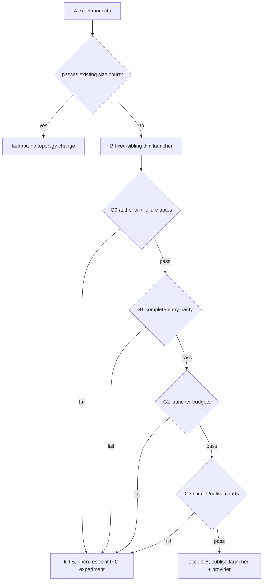

# ACU thin-launcher experiment

Status: **in progress; no product topology verdict yet**.

| field | value |
|---|---|
| purpose | recover the public `agenterm-cu` size court without removing any ACU capability |
| implementation | `research/acu-thin-launcher/` |
| pre-reading | `AGENTS.md`, `docs/agenterm-rust-cheatsheet.md`, `plan/design-acu-embedder-delivery-experiment.md` |
| source discipline | one exact source tree, one pinned toolchain and paired monolith/launcher builds |
| source provenance | repository-owned provider ABI and clean-room launcher only |

## 0. Settled facts and outcome tree

The product outcome is a complete ACU command surface whose public launcher
passes its existing per-platform size court. This is not permission to remove
verbs, narrow platforms, raise budgets, duplicate `Command` in a shim, or
reintroduce an MCU/Bun fallback.

```text
ACU public launcher within delivery budgets
├─ behavior
│  ├─ ordinary argv reaches the existing argv -> Command -> Executor path
│  ├─ binary entry modes retain stdout/stdin, lifetime and exit semantics
│  └─ legal CuReply ok:false remains product data, not a loader failure
├─ evidence
│  ├─ paired stripped bytes from one source state
│  ├─ argv/output/exit parity corpus
│  └─ absent/bad provider fails closed and never finds PATH/MCU/Bun
├─ delivery
│  ├─ fixed sibling provider is the one semantic payload
│  └─ all six cells have an artifact name and native loader primitive
└─ non-goals
   ├─ capability pruning or command-schema redesign
   └─ hiding provider bytes from total delivery reporting
```

Settled facts:

1. The fixed sibling `agenterm-cu-provider` is already the accepted delivery
   direction for qjswasm and MCP, and already owns the existing ACU library.
2. At source `9837cf81`, a Linux x86_64 release measurement produced a
   10,188,952-byte stripped `agenterm-cu` against a 4,194,304-byte court.
   Its 6.0 MiB `.text` was approximately 4.1 MiB `agenterm_cu`, 510 KiB `std`,
   467 KiB `zbus`, and 363 KiB `agenterm_platform`. This rules out cosmetic
   strip tuning as the primary remedy.
3. The existing provider ABI already accepts the versioned `argv` envelope,
   but binary-only entry modes are intentionally not library argv calls.
4. A thin launcher may load a sibling provider once. It may not know the
   `Command` schema or execute a second dispatcher.

## 1. Hard constraints

| id | constraint | observable gate |
|---|---|---|
| H0 | unchanged budgets | stripped Linux launcher <= 4,194,304 bytes and Windows launcher <= 2,097,152 bytes |
| H1 | one semantic authority | parsing, `Command`, authorization, effects, receipts and `CuReply` remain in `agenterm-cu` inside the provider |
| H2 | full public behavior | ordinary success/refusal/help/usage/version plus every resident/worker/native-host entry mode has an explicit parity path |
| H3 | exact presentation | stdout, stderr and exit status match the monolith for the parity corpus |
| H4 | fail closed | missing, wrong-ABI, panic, oversize and malformed provider failures are typed; no PATH/static/CLI/MCU/Bun fallback |
| H5 | fixed discovery | only the canonical sibling provider name for the current OS is accepted |
| H6 | bounded ABI | argv count/bytes, output and error fields have fixed limits; provider panic cannot cross FFI |
| H7 | six-cell shape | Windows/Linux/macOS x x86_64/aarch64 use the same ABI and named sibling rule |
| H8 | honest footprint | report launcher and provider files separately and together; launcher H0 cannot hide provider L3 size |

**Disease detector:** any attempt to make H0 pass by deleting a verb, copying
the parser/schema into the launcher, raising a budget, searching `PATH`, or
silently falling back is a finding that kills the route.

## 2. Minimal experiment

| dimension | fixed choice | reason |
|---|---|---|
| A | current monolithic `agenterm-cu` | exact behavior and size baseline |
| B | small native launcher calling one versioned provider process-main ABI | preserves resident entry modes and avoids a second parser |
| ordinary argv | provider delegates to existing `argv::execute_argv_from_environment` | one parser and Executor |
| binary modes | provider owns the current process-entry dispatcher | native host and resident workers cannot be reduced to one `CuReply` |
| failure transport | small boundary-status enum plus bounded diagnostic | distinct from legal product exit code and `ok:false` |
| first target | Linux x86_64 build and native macOS behavior probe | fastest byte and executable seams available locally |
| final acceptance | all six build cells plus three native OS courts | cross-build is not runtime evidence |

## 3. Precommitted criteria and measurement discipline

Priority is `G0 safety/authority -> G1 behavior parity -> G2 launcher budgets ->
G3 six-cell portability -> G4 total footprint`.

| id | nature | criterion |
|---|---|---|
| G0 | Boolean | H1, H4, H5 and H6 pass; otherwise kill B |
| G1 | Boolean | ordinary and binary-entry corpus preserves stdout/stderr/exit/lifetime; otherwise kill B |
| G2 | Boolean | same-source stripped launchers pass H0; provider size cannot waive this gate |
| G3 | checklist | all six cells build and each OS has one native fixed-sibling execution court |
| G4 | footprint | report L1 launcher, L2 provider and L3 sum with `{boundary, tool, build, target/execution}` labels |
| G5 | slope | adding one ordinary verb changes launcher bytes by zero; growth belongs to provider only |

Flat sizes use whole stripped files. Function attribution uses `cargo-bloat`
`.text` and is never divided into flat bytes. Every number says whether the
artifact was native-executed or only cross-built.

## 4. Decision tree, kill criteria and time box



Time box: stop once B has a measured Linux x86_64 launcher, one native macOS
ordinary-call probe, the full binary-entry mapping, and all raw-failure tests.
Do not optimize provider internals inside this experiment.

## 5. Evidence layout

```text
research/acu-thin-launcher/
├─ README.md
├─ RESULTS.md
├─ parity-court/
├─ fixtures/bad-abi-provider/
└─ launcher-probe/
```

## 6. Excluded choices

| choice | reason |
|---|---|
| prune ACU verbs or platform providers | changes the requested product |
| provider subprocess per call | loses same-process lifetime and adds a second transport |
| static fallback | recreates the failed size topology |
| PATH or environment provider override | weakens fixed artifact identity |
| raise 4 MiB / 2 MiB budgets | erases the existing delivery court |
| count only launcher bytes | hides L3 delivery cost |

## 7. Not answered

- Live installed-provider activation and update recovery under the native
  service managers; repository installers now publish the fixed sibling and
  exercise their file transactions, but those courts do not start the installed
  authority.
- Whether the provider should later split by capability family.
- Signed privileged-provider rollout on macOS and Windows.

## 8. Result

**B remains alive but is not accepted.** The ordinary fixed-sibling seam is
real: its Linux x86_64 stripped launcher is 393,144 bytes and macOS arm64
native help, capabilities and legal refusal preserve product exits while
missing/wrong providers fail at the boundary. The first G1 slice now preserves
the exact `--version` / `-V` text mode through an explicit provider/launcher
allow-list, while a sentinel with trailing argv retains the ordinary typed
refusal. The second slice preserves the network-probe worker and loopback
fixture as child-process-owned stdin/stdout modes: the provider writes fd 1,
the ABI publishes zero duplicate bytes, and the parent still bounds, validates,
times out and reaps the exact child. The next slice preserves the managed-job
resident owner inside the already detached launcher process. Its existing parent
still observes durable readiness plus early exit, while the ABI publishes no
competing output. A following macOS native court now preserves the browser-session
owner's exact directory argv, durable readiness, identity and cleanup lifecycle
through entry mode 3. Entry mode 5 also preserves the device-lease resident
owner's exact sentinel and inherited launch pipe without copying its lease secret
into argv, environment or ABI buffers. Entry mode 7 preserves the paired Unix PTY
fixture's direct stdout and bounded lifetime; the existing registered device-lease
court is green through the staged topology. Entry mode 10 now preserves the
library-owned `verbs` text, JSON and typed-usage bytes through the bounded ABI
buffer. Entry mode 11 now shares the X11 clipboard stdin/environment adapter
between monolith and provider and retains zero ABI output. The tree still stops
at G1 red. Entry mode 9 now preserves the `host`/`hotkeys` first-argument
surface by running the existing platform desktop host as a direct process owner;
its event loop, diagnostics, self-test output and exit status never pass through
ABI buffers. Entry mode 6 likewise runs the existing Linux/macOS privilege
broker inside the service-manager-owned process with an exact sentinel and no
ABI output. Linux and macOS packaging now place the provider beside the
privilege launcher and test their publication transactions, but this does not
prove live root-owned/signed activation or a native consent court. The Native
Messaging entry now also shares one library
adapter for extension-origin/argv validation and preserves Chromium-owned stdio
directly. A bounded macOS paired court now gives repeatable exit/stdout/stderr
parity for twelve non-mutating presentation and refusal cases, with absolute
product anchors plus a bad-ABI negative control. All twelve entry routes
therefore exist, but G1 stays red until the remaining native lifecycle,
installed activation and Linux/Windows paired parity courts are complete.
The process-main ABI has since moved into the production fixed-sibling provider
as an additive symbol family beside the embedded-call ABI. Both paths share one
panic latch and one library-owned entry classifier, and an export-set court
requires all five public symbols in the same artifact. A native macOS rerun of
the twelve paired cases plus the bad-ABI control stayed green with that
production provider. This removes the single-file dual-ABI blocker for the
Windows required journey; it is a prerequisite result, not the Windows G1
verdict.
The browser-session result is native court evidence, not Candidate evidence:
its existing qjs court is a registered macOS court rather than a Windows
Candidate gate. The device-lease lifecycle result is likewise native macOS
evidence from a registered Unix court, not Candidate evidence.

Decision path: A is over budget → B passes the measured G0 subset and two G2
cells → G1 red → no topology promotion. The result overturns only the fear that
the loader itself might be too large; it does not prove a complete replacement.
No criterion or budget was changed after measurement. Exact bytes, L1/L2/L3,
deviations and reproduction commands live in
`research/acu-thin-launcher/RESULTS.md`.
