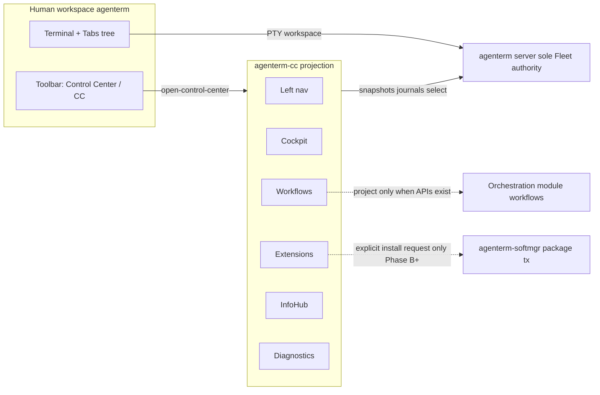
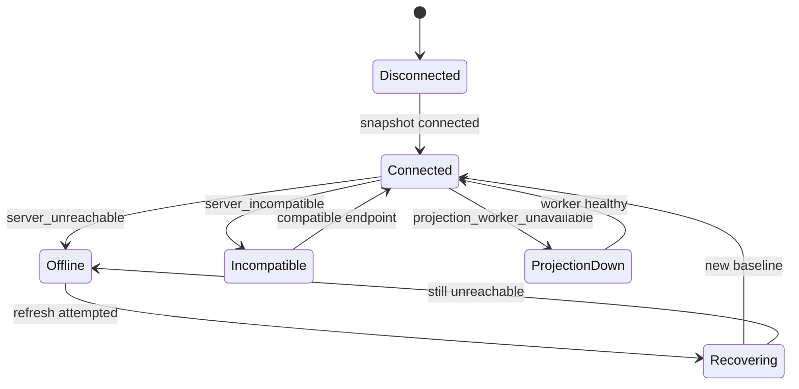
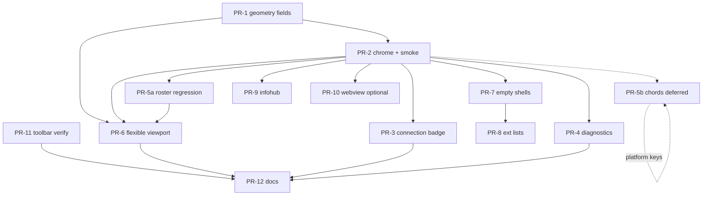

# Control Center — Functions and Layout

| Field | Value |
|-------|--------|
| **Document** | Control Center UX & Information Architecture |
| **Author** | Design (product UX) |
| **Date** | 2026-08-05 |
| **Status** | Draft (revision 3 — native-A composition + nav hit + footer cut) |
| **Target version** | L-CC · v0.2.0 design brief (implementation slices may land earlier) |
| **SSOT starting points** | `plan/plan-control-center-ux.md`, `prd/PRD_02_21_control_center.md`, `prd/PRD_02_06_human_workspace.md` |
| **Code anchors** | `src/control_center.rs`, `src/platform/contract/control_center_shell.rs`, `src/platform/services/control_center_shell.rs`, `src/frontend/action.rs` (`open-control-center`), `scripts/rhai/control-center-*-smoke.rhai` |
| **Renderer dual-track** | Phase A = **native** geometry contracts; Phase C = optional **system-WebView** presentation over the same projection model |

> **Naming note:** “Panel” was considered and **rejected** as product chrome (see KD-1 / Alternative A1). This document title intentionally does not use “Panel.”

---

## Overview

AgenTerm Control Center (`agenterm-cc`) is an **optional, independently replaceable secondary control surface**. It is not a second Fleet authority, not a terminal workspace, and not a package installer. Humans use it as a decision cockpit: which server, which tab, which future workflow/extension/info route—while all durable truth stays on `agenterm server` and all package transactions stay on `agenterm-softmgr`.

Today only the **Cockpit** view has useful content: a native monospace text shell with a **dual-layer presentation** (diagnostic dump + three-row interactive tab viewport) driven by server `select-window`. Workflows, Extensions, and InfoHub appear only as snapshot-unavailable shells; there is no left navigation chrome, and `selected_view` is hard-coded to `cockpit` in the renderer snapshot.

This document freezes **functions and layout** for Phase A–C so engineers can implement without inventing IA: naming, top-level navigation, per-view wireframes, connection visual language, empty-state copy, keyboard model (within host key contracts), snapshot geometry contracts, and an ordered PR plan. It refines—not replaces—`plan/plan-control-center-ux.md`.

---

## Background & Motivation

### Current shipped reality (v0.1.11–v0.1.14)

| Surface | State |
|---------|--------|
| Process | Independent `agenterm-cc`; one interactive instance per user config domain; `open` focuses existing; `--no-activate` does not steal focus |
| Main GUI entry | Toolbar action `open-control-center`; full label **Control Center**, compact **CC** (Human workspace-owned geometry) |
| Cockpit content | Server identity, build, epoch/sequence, tab counts, active tab, component availability; **dual presentation** (see below); ↑↓/Home/End/Enter + primary-click → typed `select` |
| Other views | Snapshot rows with `state=unavailable` and reason codes; no nav UI to switch views |
| Public CLI | `agenterm-cli control-center open\|status\|snapshot\|close`; `agenterm-cc` inspect/select/screenshot/capabilities |
| Evidence | `control-center-*-smoke.rhai` + alignment IDs under `control-center.*` |

### Engineering notes: presentation pipeline (SSOT for implementers)

#### Pre-chrome (shipped today)

```text
ShellProjection::lines()
  → title line(s) + Cockpit header + connected_cockpit_lines(...)
       includes diagnostic tab dump: up to COCKPIT_TAB_ROWS_SHOWN (16)
         format: "  #{idx}{id} {title} · {state} · {pid}[ · note]"
       + footer lines for other views' unavailable states  ← REMOVE in PR-2
  → ProductShellHost::lines() wraps with cockpit_presentation(...)
       appends: "Tabs  click or arrows · Enter selects"
       appends: COCKPIT_VISIBLE_TAB_ROWS (3) interactive strip rows
         format: "{>|}{*|} {id} {title} ({health})"
       appends: optional navigation_status
  → ControlCenterShellHost line list rendered by NativeTextWindowHost
  → Pointer hit-test: adapter supplies line index (+ physical_x)
       product classifies line → tab_lines only today
       (interactive strip rows alone are hittable; dump rows are NOT)
```

#### Host reality (do not ignore)

- Single full-width `lines() -> Vec<String>` buffer — **not** multi-region OS child widgets.
- Windows: pointer **Y → line** (`FIRST_LINE_TOP=16`, `LINE_HEIGHT=28`); `physical_x` available but unused for product classification today.
- Unix: title band + body lines full-width from small left pad; line hit is Y-derived.
- There is **no** sticky left rail, content-subscroll widget, or multi-surface paint API in Phase A.

#### Native-A composition model (Phase A — normative)

Phase A left nav **must** paint as **composed monospaced lines**, not a new multi-surface host:

```text
Each frame:
  1. Build content_lines[] for selected_view body
       (Cockpit dual dump+strip, or unavailable shell, or diagnostics)
       — WITHOUT other-view footer listing once nav ships (see KD-17)
  2. Virtual-scroll content_lines into a visible window of height H_content
       (scroll offset is local UI state; re-emit full lines() each frame)
  3. Compose frame_lines[]:
       - top_bar line(s) full width (context label + connection badge)
       - body rows: fixed-width NAV_PREFIX | CONTENT_CELL
           NAV_PREFIX width = N_nav cols (labels mode ~18–20 chars ≈ 140px
           at host metrics; icon rail fewer cols)
           content text may be truncated/padded to remaining width
       - status_bar line full width
  4. Publish geometry from composition metrics:
       content_origin_x = left_pad + nav_prefix_pixel_width
       content_origin_y = top_bar pixel height
       line indices into frame_lines[]
  5. Classify pointer:
       line L, physical_x X (same coordinate space as content_origin_x)
       → nav hit if L in chrome.nav_lines AND X < content_origin_x
       → cockpit tab hit if L in cockpit.tab_lines AND X >= content_origin_x
       → else ignore (or scroll chrome only)
```

**Rules:**

| Rule | Normative Phase A |
|------|-------------------|
| Paint model | Composed monospaced lines (nav as **left prefix / gutter** on body rows) |
| “Content scroll” | **Virtual window** over content line list; nav labels re-stamped on every visible body row that has a nav slot (or first K body rows hold the K nav entries; remaining body rows use empty/nav-spacer prefix) |
| Preferred nav stamping | Reserve the first `nav_count` body lines for nav labels in the prefix column; content virtual window starts at content_origin and may share those rows in the content cell only — **or** stamp nav prefix only on a fixed set of body lines and empty prefix below. Publish the actual choice via `nav_lines[]`. |
| Platform multi-region paint | **Out of Phase A** unless a **named platform PR** is added to the plan |
| `geometry.content_origin_*` / optional regions | **Derived from composition metrics** (prefix width, top bar rows × line height), not assumed OS child widgets |
| Top-stacked faux-nav only | **Forbidden** as the Phase A default (violates KD-2 left vertical nav). A temporary top list of views is not an acceptable substitute for the prefix gutter. |

**Nav stamping detail (default algorithm):**

```text
Body line i (0-based among body rows):
  prefix = if i < nav_entries.len:
              format selected/unselected label for nav_entries[i]
           else:
              spaces of width N_nav
  content = visible_content_lines[i] or ""
  frame body line = prefix + content
nav_lines[j] = { line: top_bar_rows + j, view_id: nav_entries[j].id }
  for j in 0..nav_entries.len
```

This keeps a true left column within a flat host and yields stable `nav_lines` for smoke.

**Constants (code):**

| Constant | Value | Role |
|----------|-------|------|
| `COCKPIT_TAB_ROWS_SHOWN` | 16 | Diagnostic dump cap (non-hittable) |
| `COCKPIT_VISIBLE_TAB_ROWS` | 3 | Interactive viewport rows (hittable; center-on-cursor) |

**Host keys today** (`ControlCenterKey` in `src/platform/contract/control_center_shell.rs`):  
`ArrowUp`, `ArrowDown`, `Home`, `End`, `Enter`, `Escape` only — **no modifier channel** on `KeyPressed`.

**Default window size:** 760×480 logical (PNG / `ControlWindowOptions` evidence).  
**Windows input smoke** resizes to **760×900** because dual presentation pushes clickable strip below 480.  
**Linux smoke** documents that often only the first strip row is inside default 480 height.

**Live smoke pointer formulas (pre-chrome — must not be left implicit):**

| Platform | Formula sketch (logical/content space) |
|----------|----------------------------------------|
| Windows (`control-center-smoke.rhai`) | Resize 760×900; `pointer_y = 16 + (13 + detail_rows + pointer_row) * 28 + 14`; `x=120` |
| Linux | `detail_rows` from tab count (cap 16 + ellipsis); `clickable_line = 2+6+1+detail_rows` (+ pre-chrome view footers); `y ≈ 76 + (clickable_line-1)*26 + 13`; `x=120` |
| macOS | Same line-index model with scale conversion through renderer / WindowServer / adapter scale |

**Post-chrome:** formulas are obsolete. Smokes **must** read `chrome.nav_lines` / `cockpit.tab_lines` and `geometry.content_origin_x` (see §10). Note: pre-chrome `x=120` lands **inside** a ~140 px nav gutter after PR-2 — cockpit clicks must move to `x >= content_origin_x`.

Any chrome that shifts line indices or left inset **breaks these formulas**. Phase A chrome PRs **must co-own smoke migration** (line-based hit contract preferred).

### Relevant implementation facts (summary)

- View IDs in capabilities: `cockpit` · `workflows` · `extensions` · `info_hub`.
- Window title: `AgenTerm Control Center — Cockpit · {endpoint · N tabs | reason}`.
- Renderer snapshot hard-codes `selected_view: "cockpit"`.
- Inspect is **CLI-only** today (`agenterm-cc inspect --tab @ID`); no shell Inspect panel.

### Pain points

1. **No navigable shell** — users cannot reach unavailable views; chrome changes break smoke geometry unless co-migrated.
2. **Dual presentation density** — diagnostic 16-row dump + 3-row strip + chrome does not fit 760×480 without scroll/prune policy.
3. **Connection recovery** — typed in code; chrome lacks badge language mapped to projection fields vs derived presentation.
4. **Main toolbar chrome clip** — Human-workspace owned (`PRD_02_06`); design specifies labels only.
5. **Naming pressure** — “Panel” rejected; residual dual vocabulary must stay out of titles.

### Hard invariants (non-negotiable)

| Invariant | Design implication |
|-----------|-------------------|
| CC crash/upgrade must not kill PTYs | No PTY ownership; close is projection-only |
| Single Fleet authority | All facts from server snapshots/journals/actions |
| Honest availability | Empty shell + reason code; never fake durable runs with Rhai tasks |
| No silent installs | Install CTAs request softmgr transaction only (Phase B+) |
| Epoch continuity | After restart, stale data never shown as live; recovery language required |
| One interactive CC | `open` focuses; context switch selects caller’s server |
| Theme inheritance | Prefer shared `ThemePalette` fields when colored; Phase A may remain mono text |

---

## Goals & Non-Goals

### Goals

1. Define **product chrome naming** vs **stable machine names** (CLI, exe, action IDs, view IDs).
2. Ship a **testable Phase A shell**: top bar + left nav + Cockpit content + status bar, with **line-based** geometry fields smoke can assert on all three platform journeys.
3. Specify **per-view layout** for Cockpit / Workflows / Extensions / InfoHub / Diagnostics with wireframes that match dual presentation.
4. Keep **PluginHub ≠ AppHub** as distinct product classes.
5. Define **connection/epoch/recovery** visual language as **projection fields vs derived chrome**.
6. Define **keyboard model** within shipped host keys for Phase A; platform chord expansion is separate.
7. Dual-track **native Phase A** vs optional **WebView Phase C**.
8. Break delivery into **independently reviewable PRs** with smoke/evidence ownership.

### Non-Goals

- Workflow execution engine, designer graph runtime, durable run recovery.
- softmgr package marketplace, payments, silent updates, softmgr client in Phase A.
- Catalog network fetch or fake catalog data.
- Automatic execution of InfoHub routes or destructive Fleet actions.
- Requiring WebView; bundling a browser runtime; treating WebView as v0.2.0 must-ship.
- Embedding libp2p/IPFS or Script permission policy into CC.
- Fixing main Human-workspace toolbar clip bugs.
- Renaming view IDs, `open-control-center`, or `agenterm-cc` in Phase A.
- **Phase A freeze (do not invent):** multi-instance discovery menu, Inspect result panel, new theme palette system, workflow graph client, silent installs.

### Phase A freeze checklist (PR-2 description must restate)

- [ ] No softmgr client or install transaction UI
- [ ] No catalog/network fetch; no fake extension rows
- [ ] No workflow runtime client; no Rhai task lists as runs
- [ ] No Inspect panel (CLI inspect remains; see §5.1)
- [ ] No multi-instance discovery scanning of instance dirs as product UI
- [ ] No inventing `server_reason` codes not emitted by projection
- [ ] No platform key/modifier expansion as a silent dependency of chrome land
- [ ] No multi-region OS paint host for Phase A nav (use nav-prefix composition)
- [ ] No retaining other-view footer lines once left nav ships

---

## Key Decisions

| ID | Decision | Rationale |
|----|----------|-----------|
| **KD-1 Naming** | **Keep “Control Center”.** Compact **CC**. Do **not** rename to “Panel”. Machine names stay: `agenterm-cc`, `control-center` CLI, `open-control-center`, PRD module, view IDs. | Overload of “Panel”; toolbar already has `CC`; dual vocabulary cost. |
| **KD-2 Top-level nav** | **Left vertical primary nav**. Collapse to **icon rail** at width ≤ 640 logical. | Control-tower metaphor; 4–5 segments crowd 760 width. |
| **KD-3 Window size vs interactive density** | **Default evidence size remains 760×480** for PNG/receipt continuity. **Minimum interactive height** for pointer journeys may exceed 480 (today Windows uses 900). Chrome reduces content height → **content column scrolls**; interactive strip must remain reachable via scroll or height policy (see §3). | 760×480 is not a workable density target for dual dump + chrome without scroll/prune. |
| **KD-4 Cockpit dual presentation** | **Phase A keeps dual surfaces:** (1) non-hittable **diagnostic dump** capped at 16; (2) hittable **3-row interactive viewport** with center-on-cursor. Product choice: dump remains visible by default (collapsed summary optional in A.1). | Matches shipped code and smoke line math; collapsing dump is Alternative A7. |
| **KD-5 Viewport rows** | Phase A: keep `COCKPIT_VISIBLE_TAB_ROWS = 3`. Phase A.1: flexible rows behind published `tab_viewport_*` + line hit fields; algorithm specified in §5.1. | Smoke co-migration required. |
| **KD-6 Server switcher** | **Top bar** owns connection badge + **current context label only** in Phase A. Multi-instance discovery menu is **out of Phase A** until an explicit discovery contract PR. | Avoid inventing filesystem instance scanning as UI. |
| **KD-7 Extensions IA** | Horizontal sub-tabs: PluginHub · AppHub · Installed · Sources (Phase B). | Saves horizontal space at 760. |
| **KD-8 Diagnostics** | Fifth **chrome** nav item. Allowed `selected_view` includes `diagnostics` (see § API). Never in `views[]` until versioned API. | Recovery one keystroke away without lying in capabilities. |
| **KD-9 Renderer track** | Native-A only for Phase A ship. WebView-C optional, **not** v0.2.0 must-ship. | PRD evidence-based WebView. |
| **KD-10 Theme** | Prefer shared `ThemePalette` mapping (§11). **Phase A native-A may ship monochrome monospace** if skin plumbing is out of shell scope; colored chrome is not a Phase A ship gate. | Avoid inventing abstract tokens that do not exist. |
| **KD-11 Focus sync** | Local cursor `>` may differ from server `*` until Select; reconcile on projection update. | Matches `selected_tab_id` / `active_tab_id`. |
| **KD-12 Unavailable honesty** | Title + sentence + monospace reason + guidance. No fake data. | PRD invariant. |
| **KD-13 Hit testing** | **Primary:** composed **line index** + **X-gutter rule** against published `nav_lines` / `tab_lines` and `content_origin_x`. Pixel region rects optional. Smokes must not hard-code Y/X once fields exist. | Adapters are Y→line; after nav gutter, X disambiguates nav vs content on shared body rows. |
| **KD-14 Inspect** | **Phase A: CLI-only.** No shell [Inspect] button/panel. Phase B may add inspect panel with mini-spec. | Avoid inventing UI without result layout/contract. |
| **KD-15 Keyboard phases** | Phase A: only existing `ControlCenterKey` set for roster + Esc. View switching via **pointer on nav rows** first; optional in-process chords only after platform key contract expands (PR-5b). | Host has no Ctrl/modifier channel today. |
| **KD-16 Chrome + smoke** | Any PR that changes line indices, top inset, or left content origin **must** update all three `control-center-*-smoke.rhai` pointer paths in the **same merge**. | Issue-class: PR-2 without smoke is not mergeable. |
| **KD-17 Footer removal** | **When left nav ships (PR-2), remove other-view footer lines** from Cockpit/`ShellProjection::lines()` dump. Unavailable detail lives only in the selected view body (and Diagnostics). Clean cut in the same PR as nav—no indefinite dual listing. | Dual footers + nav double-present views and destabilize line indices/smokes. |
| **KD-18 Native-A composition** | Phase A left nav is a **nav prefix on flat `lines()`**, virtual content scroll, derived `content_origin_*`. **No** multi-region platform host in Phase A unless a named platform PR is planned. | Host is single line buffer today; expanding paint surfaces is out of product chrome slice. |

---

## Proposed Design

### 1. Product naming matrix

| Surface | Phase A string (EN) | Notes |
|---------|---------------------|--------|
| Window title prefix | `AgenTerm Control Center` | Append `— {View} · {suffix}` |
| Main toolbar full | `Control Center` | Human workspace |
| Main toolbar compact | `CC` | Same action ID / accessible name |
| Tooltip / accessible name | `Control Center` | Never “Panel” |
| CLI verb | `control-center` | **Stable** |
| UI action | `open-control-center` | **Stable** |
| Executable | `agenterm-cc` | **Stable** |
| PRD module | Control Center | **Stable** |
| View labels | Cockpit, Workflows, Extensions, InfoHub, Diagnostics | Diagnostics = chrome label |
| zh-Hant (locale later) | 控制中心 / 緊湊 `CC` | When UI text pipeline wires CC |

### 2. Information architecture

```text
Control Center
├─ Chrome (always)
│  ├─ Top bar: title · current context label · connection badge · overflow
│  ├─ Left nav: primary views (pointer-selectable in Phase A)
│  └─ Status bar: renderer · sequence · short diagnostic / derived presentation
├─ cockpit          [API view id]
├─ workflows        [API view id]
│  ├─ definitions | runs | designer | evidence   (local sub-views, Phase B)
├─ extensions       [API view id]
│  ├─ plugin_hub | app_hub | installed | sources (local sub-views, Phase B)
├─ info_hub         [API view id]
└─ diagnostics      [chrome view id for selected_view only; not in views[]]
```



### 3. Global chrome layout (Phase A)

#### 3.1 Regions (logical product regions; native-A is composed lines)

Logical **default** canvas for evidence: **760×480**.  
**Interactive** journeys may resize taller (preserve today’s Windows 760×900 pattern until content fits).

**Important:** The ASCII below is the **product IA**. On native-A it is realized by the **prefix composition model** in Engineering notes (flat `lines()`), not by OS-level multi-pane widgets.

```text
┌─ top_bar ───────────────────────────────────────────────────────────┐
│ AgenTerm Control Center     ctx: user_main · endpoint…   ● Conn  ···│
├─nav──────┬─ content (virtual-scrolls vertically) ───────────────────┤
│ ● Cockpit│  [view body — see per-view; may exceed viewport height]  │
│ ○ Workfl.│                                                          │
│ ○ Extens.│                                                          │
│ ○ InfoHub│                                                          │
│ ─────────│                                                          │
│ ○ Diagn. │                                                          │
├──────────┴──────────────────────────────────────────────────────────┤
│ status_bar: connected · renderer=native · epoch… · seq…             │
└─────────────────────────────────────────────────────────────────────┘
```

Composed line example (labels mode, fixed nav prefix width):

```text
AgenTerm Control Center          ctx:user_main  ● Connected
● Cockpit     │ Server   user_main · PID … · v…
○ Workflows   │ Fleet    12 tabs · 8 running · 4 dead
○ Extensions  │ Tabs     12 total
○ InfoHub     │   #0 @1 reviewer · running · …
──────────────│   …
○ Diagnostics │ Tabs     click or arrows · Enter selects
              │ >* @1 reviewer (running)
status: connected · renderer=native · epoch … · seq …
```

| Region | Default size | Scroll? | Native-A realization |
|--------|--------------|---------|----------------------|
| Top bar | 1–2 text rows | No | Full-width line(s) at top of `lines()` |
| Left nav | ~140 px / N_nav cols; icon rail when width ≤ 640 | No (nav itself) | **Prefix gutter** on body lines; `nav_lines[]` |
| Status bar | 1 row | No | Full-width last line(s) |
| Content | Remainder | **Yes (virtual)** | Content cell right of prefix; virtual window over content list |

#### 3.2 Density policy (critical)

| Policy | Rule |
|--------|------|
| Default window | 760×480 for screenshot/receipt continuity unless product changes evidence size in a dedicated PR |
| Content overflow | Content cell **virtual-scrolls** inside composed frame; **do not** clip interactive strip without a way to reach it |
| Pointer smoke height | May resize window (e.g. 760×900) **or** scroll-to-strip then click using published line indices + X rule |
| Diagnostic dump | Phase A: keep up to 16 rows (non-hittable). Prefer virtual scroll over silent dump removal in PR-2; optional **collapse dump** is A7 / A.1 |
| Evidence PNGs | May remain 760×480 and show partial scrolled content + structured snapshot; do not require full dump visible in PNG |
| Other-view footers | **Removed when nav ships (KD-17)** — not a density knob; mandatory clean cut |

### 4. Top bar: context label & connection badge

#### 4.1 Server / context (Phase A)

| Element | Phase A behavior |
|---------|------------------|
| Control | **Read-only label**: logical instance name or `explicit`, plus truncated endpoint |
| Optional | “Copy endpoint” text action (clipboard) if host clipboard path exists; else omit |
| Menu of discovered instances | **Not Phase A** — blocked until discovery contract PR cites exact API/module |
| Context rebinding | Still via CLI/env/`open` from a caller (`--instance` / `--endpoint`); not inventing in-window scan of `AGENTERM_INSTANCE_DIR` as product UI |

Phase B+ switcher may list instances only when a **public, tested discovery surface** exists (cite module then).

#### 4.2 Connection: projection SSOT vs derived chrome

**Projection fields (SSOT — snapshot JSON):**

| Field | Shipped values / notes |
|-------|------------------------|
| `server_state` | `connected`, `disconnected`, `unavailable` (and related paths used today) |
| `server_reason` | `no_server_context`, `server_unreachable`, `server_incompatible`, `projection_worker_unavailable`, … |
| `server_detail` | Human/debug detail string |
| `connected_server.epoch` / `sequence` | Live identity when connected |

**Not shipped as stable chrome `server_reason`:** `server_restart` (exists as **bail/detail text** during navigation/snapshot races, e.g. `server_restart: authority PID changed…`, `control_center_server_restart_during_navigation`). Do **not** list it as a peer reason code in snapshot until productization adds it.

**Derived chrome presentation (local UI state, not new backend API):**

| Chrome badge | Derivation rule | Actions |
|--------------|-----------------|---------|
| ● Connected | `server_state` healthy + connected server present | Full interactive |
| ○ Disconnected | `disconnected` + `no_server_context` | Empty authority copy |
| ! Offline | `server_reason=server_unreachable` (or equivalent) | Grey stale only if local cache marked `stale=true` + observation time; prefer empty+reason |
| ◐ Recovering | **Local:** previous epoch retained OR last reason was unreachable AND refresh in flight without new baseline yet | Disable select; “Waiting for baseline…” |
| ● Connected + status “Epoch changed” | **Local pulse:** epoch string changed vs last presented baseline after reconnect | Fresh facts only; drop pre-epoch cache |
| ⊗ Incompatible | `server_reason=server_incompatible` | Block fleet actions; encourage Diagnostics |
| ! Projection error | `projection_worker_unavailable` | Explain local worker; PTYs unaffected |



Smoke asserts **projection fields** for offline/incompatible paths already covered. Recovering/Epoch-changed are **optional** presentation assertions once local transition flags are published in chrome snapshot (additive).

### 5. Per-view layouts

#### 5.1 Cockpit (Phase A priority) — dual presentation

**User problem:** Which fleet? Who is running/dead? Which tab should become active?

```text
MAIN (Cockpit) — content column (scrollable)
┌─ Server strip ─────────────────────────────────────────────────────┐
│ Instance · PID · version · build · epoch · sequence                │
│ Components: server ✓  workflows ✗  extensions ✗  info ✗            │
│ Fleet: Total N · Running R · Dead D                                │
│ Active on server: * @id title                                      │
└────────────────────────────────────────────────────────────────────┘
┌─ Diagnostic tab dump (NON-HITTABLE)  COCKPIT_TAB_ROWS_SHOWN≤16 ────┐
│ Tabs        N total                                                │
│   #0  @1 title · running · pid …                                   │
│   #1  @2 title · dead · …                                          │
│   … up to 16; then "  … K more"                                    │
└────────────────────────────────────────────────────────────────────┘
┌─ Interactive viewport (HITTABLE)  COCKPIT_VISIBLE_TAB_ROWS=3 ──────┐
│ Tabs        click or arrows · Enter selects                        │
│ >* @1  reviewer   (running)     ← tab_lines[] only                 │
│    @2  logs       (dead)                                           │
│    @3  build      (running)                                        │
└────────────────────────────────────────────────────────────────────┘
┌─ Navigation status (optional line) ────────────────────────────────┐
│ Selecting @3  |  Selected @3  |  Action failed …  |  Queued …      │
└────────────────────────────────────────────────────────────────────┘
```

**Other-view footers (normative for PR-2):**  
Today `ShellProjection::lines()` appends unavailable lines for Workflows/Extensions/InfoHub. **When left nav ships, those footer lines must be removed in the same PR** (KD-17). Unavailable copy appears only when that view is selected (view body empty-state) or under Diagnostics component table. No transitional dual listing flag—clean cut so line indices and smokes stay single-sourced.

**Markers:**

| Glyph | Meaning |
|-------|---------|
| `>` | Local CC cursor |
| `*` | Server active tab |
| `>*` | Cursor on active tab |

**Phase A actions (shell):**

| Action | Effect | Authority |
|--------|--------|-----------|
| Enter / primary-click interactive row | Typed server select + receipt + re-read | Server |
| ↑↓ Home End | Move local cursor only | Local |
| Esc | Clear `navigation_status` | Local |
| **Inspect** | **Not in Phase A shell** — use CLI `agenterm-cc inspect --tab @ID` | Server (CLI) |

**Phase B Inspect panel (deferred mini-spec outline only):**

- Entry: button or key when platform allows; does not change selection.
- Panel: fields from `InspectedTab` / navigation document; busy/error lines; last-inspect snapshot fields.
- Evidence: CLI inspect already covered; UI path needs new smoke when built.

**Phase A.1 interactive viewport algorithm:**

| Case | Behavior |
|------|----------|
| N = 0 tabs | No strip rows; help line says unavailable/empty |
| 1 ≤ N < 3 | Show N rows; no phantom rows |
| N ≥ 3, height allows ≥3 slots | Show `min(slots, N)` rows, **min 3 when height allows 3** |
| Height allows only 1–2 slots | Show as many as fit (may be &lt;3); publish actual `tab_viewport_rows` |
| Cursor move | **Center-on-cursor** (same as today: `start = selected - rows/2` clamped) |
| Scroll origin | Viewport start derived from cursor; diagnostic dump scrolls with content independently |
| Pointer after reflow | Hit only published `tab_lines[{line,id}]` for current frame |
| Smoke fixtures | One journey with N≫3 and one with N&lt;3 |

#### 5.2 Workflows (Phase B shell → lists)

Sub-nav: Definitions | Runs | Designer | Evidence  

Empty shell uses reason codes from projection (`workflow_runtime_not_connected` vs `workflow_runtime_unavailable`). No Rhai task lists.

#### 5.3 Extensions (Phase B)

Sub-tabs: PluginHub | AppHub | Installed | Sources  

Install CTA only when catalog API exists; softmgr request-only; no silent install.

#### 5.4 InfoHub (Phase C)

Sources | Items | Provenance/Routes — no auto-exec destructive actions.

#### 5.5 Diagnostics (Phase A chrome)

Component table from snapshot; connection fields; renderer/host facts; **Capture PNG** reuses existing screenshot path (no focus steal).  
`selected_view=diagnostics` is chrome-only (not in `views[]`).

### 6. Empty / unavailable component library

#### 6.1 Anatomy

```text
[glyph]  {View title}
         {One human sentence}
         Reason: {reason_code}     ← monospace
         {Secondary guidance}
```

#### 6.2 Reason-code → copy map

| Reason code | Class | Where | EN title | EN body |
|-------------|-------|-------|----------|---------|
| `no_server_context` | **shipped** | Cockpit / global | No server context | Select or open a server context. This window does not start a Fleet authority. |
| `server_unreachable` | **shipped** | Global / Cockpit | Server unreachable | The selected server did not respond. Terminal sessions are independent of this window. |
| `server_incompatible` | **shipped** | Global | Incompatible server | Protocol or build is incompatible. Fleet actions are blocked. |
| `projection_worker_unavailable` | **shipped** | Global | Projection worker stopped | Local background projection failed. The server and PTYs are unaffected. |
| `workflow_runtime_not_connected` | **shipped** | Workflows (no server) | Workflows offline | Connect a server to query workflow availability. |
| `workflow_runtime_unavailable` | **shipped** | Workflows (connected) | Workflow runtime unavailable | Durable workflow runtime is not available on this server yet. |
| `extension_catalog_not_connected` | **shipped** | Extensions (no server) | Extensions offline | Connect a server to query extension catalogs. |
| `extension_catalog_unavailable` | **shipped** | Extensions (connected) | Extension catalog unavailable | PluginHub/AppHub catalog is not available on this server yet. |
| `info_sources_not_connected` | **shipped** | InfoHub (no server) | InfoHub offline | Connect a server to query information sources. |
| `info_sources_unavailable` | **shipped** | InfoHub (connected) | Info sources unavailable | InfoHub sources are not available on this server yet. |
| `control_center_unavailable` | **shipped** | Main GUI entry | Control Center unavailable | Binary missing or failed to launch. Terminal remains usable. |
| `control_center_registry_incompatible_live` | **shipped** | Open/status | Live registry incompatible | Existing owner cannot be verified safe to replace. |
| `control_center_registry_unparseable` | **shipped** | Open/status | Registry unparseable | Registry unreadable; fail closed. |
| Epoch-changed / Recovering copy | **presentation-only** | Chrome badge/status | (see §4.2) | Derived from local transitions; not a `server_reason` peer |
| `server_restart` bail strings | **error detail only** | Navigation/snapshot failures | Action/snapshot failed | Surface as failure detail text; **not** a stable chrome reason enum value |

**zh-Hant example (offline):** 「未連上艦隊伺服器。原因：`server_unreachable`。終端機工作階段不受此視窗影響。」

### 7. Keyboard model & focus sync

#### 7.1 Phase A (shipped host contract)

| Scope | Keys | Notes |
|-------|------|-------|
| Cockpit roster | `↑` `↓` `Home` `End` | Cursor only; only when hit region is content (`X >= content_origin_x`) or focus is roster |
| Activate | `Enter` (no key-repeat activate) | Server select on cursor tab |
| Clear status | `Esc` | Local |
| View switch | **Pointer:** line ∈ `nav_lines` **and** `physical_x < content_origin_x` → `view_id` | Must use published SSOT (§10.4); no magic coords |
| Modifiers / Ctrl+Tab / Ctrl+1..5 / Alt+S / Ctrl+Shift+P | **Out of Phase A** | Requires `ControlCenterKey` + adapter expansion (PR-5b) |

#### 7.2 Phase A.1 / PR-5b (platform contract expansion)

Only after Win/Linux/macOS adapters prove delivery:

- Prefer non-contested chords where possible; `Ctrl+Tab` is WM-contested — document Unsupported where undeliverable.
- Digits/modifiers need explicit enum + `KeyPressed` schema change.
- OQ-4 remains open until platform spike returns.

#### 7.3 Focus sync with main terminal

Unchanged sequence: cursor may lead active; Enter/click selects; GUI/CC cohere via server truth; `reconcile_selection` when cursor target disappears.

### 8. Relationship to main Human workspace

| Dimension | Human workspace | Control Center |
|-----------|-----------------|----------------|
| Role | Daily terminal workbench | Secondary control tower |
| Entry | Toolbar Control Center / CC | Focus or launch |
| Theme | Skin + luminance | Shared palette when colored; mono OK Phase A |
| Peer failure | Missing CC → typed non-blocking | GUI detach → CC+server+PTY may remain |

### 9. Renderer dual-track labeling

| Track | When | Notes |
|-------|------|-------|
| **native-A** | Phase A ship | Character-cell / light vector; line hit contract |
| **webview-C** | Optional later | Packaged assets + bridge v1; **not** v0.2.0 must-ship unless product elevates |

Research spike assets = density reference only.

### 10. Snapshot / geometry contract (implementation-ready)

#### 10.1 Ownership

| Surface | Schema | Must carry hit contract? |
|---------|--------|---------------------------|
| `agenterm-cc snapshot --json` → `SnapshotDocument` | CLI / automation | **Yes** — cockpit presentation + chrome |
| Renderer-request screenshot `rendered_snapshot` → `RendererSnapshot` | Linux/macOS PNG pairing / no-activate capture | **Yes** — same cockpit hit fields + `selected_view` |
| Windows direct-native screenshot + process-window facts | Native PNG plus owner/window identity | **No renderer snapshot** — pair `snapshot --json`, owned process-window facts and exact-owner PNG |
| Capabilities `views[]` | Discovery | Four API views only; optional future `chrome_views` |

Renderer-request snapshots must agree on cockpit hit fields when a live shell is
running. A Windows direct-native screenshot intentionally has no renderer
snapshot; causal evidence pairs the semantic CLI snapshot, the owned native
window facts, and the exact-owner PNG instead. CLI snapshot without GUI may
omit pixel hints but should still report logical presentation when projection
is available.

#### 10.2 Schema version policy

- Current CC documents use `schema_version: 1`.
- **Keep v1 for additive fields** (unknown fields ignored by old clients).
- **Bump only on breaking removes/renames** of required fields.
- Smokes that require new fields pin minimum presence checks, not a forced bump.

#### 10.3 Units and hit testing

| Layer | Unit | Role |
|-------|------|------|
| **Primary Y** | **Line index** (0-based into composed `lines()`) | Adapter supplies line from Y |
| **Primary X** | **Logical client X** same space as `geometry.content_origin_x` | Disambiguates nav gutter vs content on shared body rows |
| Secondary | Optional pixel rects | Host-derived; recompute each frame; never sole SSOT |
| Physical pixels | Renderer framebuffer | Screenshots / scale conversion for automation drivers |

**Classification algorithm (normative Phase A product shell):**

```text
on PointerPressed(physical_x, physical_y, line):
  // Prefer adapter-provided line; if missing, derive from published line_height + content_origin_y
  if line is None: ignore or derive; do not invent smoke-only paths

  x = to_logical_client_x(physical_x)   // document platform conversion once; smoke uses published origin

  if exists e in chrome.nav_lines where e.line == line
     and x < geometry.content_origin_x:
       select_view(e.view_id); return

  if selected_view == cockpit
     and exists t in cockpit.tab_lines where t.line == line
     and x >= geometry.content_origin_x:
       activate_tab(t.id); return

  // else: no-op (or future scroll drag)
```

| Hit class | Line condition | X condition | Result |
|-----------|----------------|-------------|--------|
| Nav | `line` ∈ `chrome.nav_lines[].line` | `x < content_origin_x` | Switch `selected_view` |
| Cockpit tab | `line` ∈ `cockpit.tab_lines[].line` | `x >= content_origin_x` | Select tab |
| Dump / other | any other | any | No select |

Smokes for `control-center.nav-chrome` **must** read `nav_lines` + `content_origin_x` (e.g. click at `content_origin_x / 2` on a nav line).  
Smokes for tab select **must** use `tab_lines` + `x = content_origin_x + margin` (legacy `x=120` is invalid once nav gutter ≥ 120).

#### 10.4 Required additive fields (sketch)

```json
{
  "schema_version": 1,
  "chrome": {
    "selected_view": "cockpit",
    "nav_mode": "labels",
    "connection_badge": "connected",
    "connection_badge_source": "projection",
    "context_label": "user_main",
    "nav_lines": [
      { "line": 1, "view_id": "cockpit" },
      { "line": 2, "view_id": "workflows" },
      { "line": 3, "view_id": "extensions" },
      { "line": 4, "view_id": "info_hub" },
      { "line": 6, "view_id": "diagnostics" }
    ],
    "presentation_flags": {
      "recovering": false,
      "epoch_changed_pulse": false
    }
  },
  "cockpit": {
    "diagnostic_line_start": 8,
    "diagnostic_line_end": 20,
    "diagnostic_rows_shown": 12,
    "interactive_help_line": 21,
    "tab_viewport_rows": 3,
    "tab_viewport_start_index": 0,
    "tab_cursor_id": "@1",
    "tab_active_id": "@3",
    "tab_lines": [
      { "line": 22, "id": "@1" },
      { "line": 23, "id": "@2" },
      { "line": 24, "id": "@3" }
    ],
    "navigation_status": null
  },
  "geometry": {
    "logical_width": 760,
    "logical_height": 480,
    "line_height_px": 28,
    "content_origin_x": 140,
    "content_origin_y": 32,
    "nav_prefix_cols": 18,
    "composition": "nav_prefix_flat_lines",
    "regions_optional": {
      "top_bar": { "x": 0, "y": 0, "w": 760, "h": 32 },
      "nav": { "x": 0, "y": 32, "w": 140, "h": 420 },
      "content": { "x": 140, "y": 32, "w": 620, "h": 420 },
      "status_bar": { "x": 0, "y": 452, "w": 760, "h": 28 }
    }
  }
}
```

**Rules:**

- `chrome.nav_lines` is the smoke SSOT for view-switch pointer targets (line → `view_id`).
- `cockpit.tab_lines` is the smoke SSOT for tab select (line → tab id), only with `x >= content_origin_x`.
- `geometry.content_origin_x` is **required** once nav ships; derived from nav prefix pixel width + left pad.
- `geometry.composition` documents model (`nav_prefix_flat_lines` for Phase A); multi-region values only after a platform PR.
- `diagnostic_*` ranges document non-hittable dump; smokes must **not** click dump lines expecting select.
- Optional pixel `regions_*` recomputed each frame; never the only source of truth.
- Line numbers in samples are **illustrative**; derive from composed `lines()` each frame.
- After PR-2, **no** other-view footer lines exist in the dump (KD-17)—do not reserve line slots for them.

#### 10.5 `selected_view` allowed values (Phase A)

```text
cockpit | workflows | extensions | info_hub | diagnostics
```

- First four align with API `views[].id`.
- `diagnostics` is **chrome-only**; never appear in `views[]` until versioned API/capabilities change.
- Automation distinguishes: `chrome.selected_view` vs `views[]` availability.

### 11. Theme token map (real `ThemePalette`)

From `src/theme.rs` `ThemePalette` / `AppearancePreset`:

| CC role | Existing field | Phase A native-A |
|---------|----------------|------------------|
| Window / content background | `terminal_background` or `sidebar` | Optional; mono host may ignore |
| Elevated chrome (top/status) | `status` / `composer` / `modal` | Optional |
| Primary text | `text` / `terminal_foreground` | Optional |
| Secondary / dead / muted | `muted_text` | Optional |
| Dividers / region rules | `divider` | Optional |
| Selected nav / cursor bar | `active` / `active_border` / `accent` | Optional |
| Connected / running | `success` / `accent` | Badge if colored |
| Warning / recovering / offline | `warning` | Badge if colored |
| Incompatible / failed | `danger` | Badge if colored |
| Focus | `focus_ring` | If focus chrome exists |
| Controls | `control`, `control_hover`, `control_pressed` | Future buttons |
| Selection (if any) | `selection_background`, `selection_foreground` | Future |
| Monospace reason codes | *(no mono color field)* | Use `text` + monospace font face |

**Missing roles:** no dedicated `mono` color; no `bg_elevated` name — use `status`/`modal` instead of inventing parallel tokens.  
**Phase A ship gate:** monochrome monospace shell is **acceptable**; skin wiring is not blocking.

### 12. Risks

| Risk | Severity | Mitigation |
|------|----------|------------|
| Chrome breaks pointer smoke | Critical | KD-16; `nav_lines` + `tab_lines` + X-gutter; co-land smoke in PR-2 |
| Dual dump + chrome overflow | High | Virtual-scroll content; optional A7 collapse; allow taller interactive windows |
| Expanding platform paint for nav | High | KD-18: prefix composition only in Phase A |
| Footer + nav double listing | Medium | KD-17 clean cut in PR-2 |
| Invented discovery/inspect/theme | High | Phase A freeze checklist |
| Keyboard over-promise | Medium | KD-15; PR-5 split |
| Dual selected_view vs views[] | Medium | Explicit enum; diagnostics chrome-only |
| WebView scope creep | Medium | PR-10 not must-ship |

---

## API / Interface Changes

### Stable (no change)

- View IDs in capabilities: `cockpit`, `workflows`, `extensions`, `info_hub`
- Action: `open-control-center`
- CLI: `control-center`, `agenterm-cc` inspect/select/screenshot
- Executable: `agenterm-cc`
- Host keys for roster: six-key enum

### Additive (Phase A+)

| Change | Notes |
|--------|-------|
| `chrome` / `cockpit` hit fields on SnapshotDocument **and** RendererSnapshot | Line-primary |
| `selected_view` dynamic including `diagnostics` | Chrome enum |
| Nav pointer targets | Product shell |
| Presentation flags for recovering / epoch pulse | Local derived |

### Explicitly deferred

| Item | Until |
|------|-------|
| Shell Inspect panel | Phase B mini-spec |
| Multi-instance discovery menu | Discovery contract PR |
| Ctrl/modifier view chords | PR-5b platform expansion |
| softmgr install UI | PR-8 + softmgr API |
| `server_restart` as stable `server_reason` | Productization decision |

---

## Data Model Changes

| Model | Change |
|-------|--------|
| `SnapshotDocument` / `RendererSnapshot` | Additive cockpit/chrome/geometry fields; schema_version stays 1 if additive |
| Local UI state | `selected_view`, `nav_mode`, presentation flags, sub-views later |
| Persistence | Phase A: do not persist `selected_view` (default Cockpit) unless OQ-2 decides otherwise |

---

## Alternatives Considered

### A1. Rename chrome to “Panel”
Rejected (KD-1). Residual risk reduced by removing “(Panel)” from document title.

### A2. Top segmented tabs
Rejected as 760 default; optional wide preference later.

### A3. Full scrollable roster day one
Deferred to A.1 after hit contract publication.

### A4. Extensions second left sidebar
Rejected; horizontal sub-tabs.

### A5. Server switcher only in Cockpit
Rejected; top bar context + badge. Phase A label-only (no discovery menu).

### A6. WebView-first
Rejected for Phase A; PR-10 optional not must-ship.

### A7. Collapse diagnostic 16-row dump in Phase A
- **Pros:** Fits 760×480 with chrome; simpler pointer Y.
- **Cons:** Loses at-a-glance fleet detail; changes line math and smoke in the same breath as chrome.
- **Verdict:** **Keep dual list in Phase A** (KD-4). Optional collapse in A.1 or a dedicated density PR if scroll UX proves poor. Do not silently drop dump in PR-2 without explicit decision + smoke update.

### A8. Raise default window height (e.g. 760×720) vs scroll
- **Pros:** More content visible; fewer scroll surprises.
- **Cons:** Changes PNG evidence dimensions and platform receipts; multi-platform gate churn.
- **Verdict:** **Keep 760×480 default evidence size** (KD-3). Prefer content scroll + allow interactive resize in smokes. Dedicated evidence-size PR only if product wants new default.

### A9. Pixel region geometry as primary vs line-index hits
- **Pros:** Decouples from text layout.
- **Cons:** Scale bugs across Win/macOS/Linux; contradicts current adapter line hit-test.
- **Verdict:** **Line-index primary** (KD-13); pixel rects optional secondary.

---

## Security & Privacy Considerations

Unchanged in spirit: projection-only; no second authority; softmgr owns installs; WebView packaged+bridged; screenshot owner-matched; no secret leakage in chrome; InfoHub routes non-auto-exec.

---

## Observability

| Signal | How |
|--------|-----|
| Connection | Projection `server_state`/`server_reason` + derived badge flags |
| Navigation | `navigation_status` |
| Evidence | renderer snapshot where available; on Windows, semantic snapshot + owned native-window facts + exact-owner PNG |
| Capabilities | views[4]; chrome selected_view separate |

### Evidence IDs (existing + proposed)

**Keep green (existing):**  
`control-center.offline-contract`, `live-cockpit`, `native-cockpit-input`, `typed-navigation`, `process-reuse`, `context-refresh`, `causal-projection-refresh`, `launch-failure`, `server-recovery`, `no-activate`, `typed-close`, `process-isolation`, `renderer-failure-isolation`, `cross-process-detach`, plus linux/macos siblings in `prd/alignment-contract.json`.

**Register when feature lands:**

| PR | New evidence ID (proposal) | Asserts |
|----|----------------------------|---------|
| PR-1 | `control-center.geometry-contract` | `tab_lines` / diagnostic ranges present |
| PR-2 | `control-center.nav-chrome` | `selected_view` via `nav_lines`+X; tab select via `tab_lines`+X; footers gone |
| PR-3 | `control-center.connection-badge` | badge/flags vs unreachable/incompatible |
| PR-4 | `control-center.diagnostics-view` | selected_view=diagnostics; components table |
| PR-6 | `control-center.flexible-viewport` | N≫3 and N&lt;3 fixtures |
| PR-5b | `control-center.view-chords` | only after platform keys |

---

## Rollout Plan

```text
Phase A — native-A
  A0 PR-1 geometry fields (additive; may land without chrome)
  A1 PR-2 chrome + smoke line migration (blocking co-change)
  A2 PR-3 connection presentation mapping
  A3 PR-4 Diagnostics chrome (parallelizable with PR-7)
  A4 PR-7 empty shells (parallelizable)
  A5 PR-6 flexible viewport (after geometry+chrome stable; not blocked on chords)
  A6 PR-5a roster regression after nav (with PR-2 or immediately after)
  A7 PR-5b chords only after platform key expansion

Phase B — lists, softmgr request UX, optional Inspect panel
Phase C — InfoHub + optional WebView-C (not must-ship)
```

**Feature flags:** prefer complete chrome; optional flag only mid-flight.  
**Rollback:** revert chrome PR; additive snapshot fields remain harmless.

---

## Open Questions

| ID | Question | Owner | Default |
|----|----------|-------|---------|
| OQ-1 | Marketing nickname “Panel”? | Product | No |
| OQ-2 | Persist last `selected_view`? | Product | No (always Cockpit) |
| OQ-3 | Icon glyphs for rail? | Design eng | ASCII/unicode native-A |
| OQ-4 | View-switch chords after platform keys exist? | UX + platform | Defer; spike modifiers; avoid Ctrl+Tab if Unsupported |
| OQ-5 | Promote diagnostics into capabilities `views[]`? | Product/API | No until versioned |
| OQ-6 | When multi-instance discovery UI? | Product | **Not Phase A**; needs discovery contract |
| OQ-7 | zh-Hant CC strings same milestone? | i18n | EN first |
| OQ-8 | Collapse diagnostic dump (A7) in A.1? | Product | Keep dump unless density fails |
| OQ-9 | Change default evidence height from 480? | Product | No; scroll + smoke resize |

---

## References

- `plan/plan-control-center-ux.md`
- `prd/PRD_02_21_control_center.md`
- `prd/PRD_02_06_human_workspace.md`
- `src/control_center.rs` — dual presentation, navigation, snapshot
- `src/platform/contract/control_center_shell.rs` — `ControlCenterKey` six keys
- `scripts/rhai/control-center-smoke.rhai` — Windows 760×900 pointer formula
- `scripts/rhai/control-center-linux-smoke.rhai` / `control-center-macos-smoke.rhai`
- `src/theme.rs` — `ThemePalette` fields
- `prd/alignment-contract.json` — `control-center.*`
- `research/agenterm-webview/assets/` — density reference only

---

## Key Decisions

(See table in section **Key Decisions** above — KD-1…KD-16. Repeated here for skill-required heading scan.)

| ID | Decision (short) |
|----|------------------|
| KD-1 | Control Center + CC; no Panel rename |
| KD-2 | Left nav + icon rail collapse |
| KD-3 | 760×480 evidence default; scroll + taller interactive windows |
| KD-4 | Keep dual dump + 3-row strip in Phase A |
| KD-5 | Magic-3 until A.1 flexible algorithm |
| KD-6 | Top-bar current context only; no discovery menu Phase A |
| KD-7 | Extensions horizontal sub-tabs |
| KD-8 | Diagnostics chrome selected_view |
| KD-9 | native-A ship; webview-C optional not must-ship |
| KD-10 | Real ThemePalette map; mono OK Phase A |
| KD-11 | Cursor vs active focus sync |
| KD-12 | Honest unavailable shells |
| KD-13 | Line + X-gutter hits (`nav_lines` / `tab_lines`) |
| KD-14 | Inspect CLI-only Phase A |
| KD-15 | No Ctrl chords until platform keys |
| KD-16 | Chrome PR co-owns smoke migration |
| KD-17 | Remove other-view footers when nav ships |
| KD-18 | Native-A nav = prefix on flat lines() |

---

## PR Plan

Ordered for smoke safety and parallelism. Each PR lists **must-stay-green** evidence and co-owned files.

### PR-1 — Geometry / hit contract fields (additive)

- **PR title:** `cc: publish cockpit tab_lines and chrome.selected_view fields`
- **Files/components:** `src/control_center.rs` (SnapshotDocument, RendererSnapshot, presentation export); unit tests
- **Dependencies:** none
- **Must stay green:** all existing `control-center.*` smokes (no layout change yet)
- **New evidence:** `control-center.geometry-contract` (optional soft assert if fields present)
- **Description:** Publish `tab_lines`, diagnostic line ranges, `tab_viewport_rows=3`, dynamic `selected_view` variable (still cockpit). Optionally pre-declare empty `nav_lines: []` and `content_origin_x: 0` for schema stability. **No visual chrome.** schema_version stays 1 if additive. Enables PR-2 smoke rewrite against fields instead of magic formulas.

### PR-2 — Nav chrome + smoke co-migration (blocking)

- **PR title:** `cc: left nav chrome with line-based smoke migration`
- **Files/components:** `src/control_center.rs` presentation/composition (nav prefix + virtual content scroll); shell host input classification (X-gutter); **`scripts/rhai/control-center-smoke.rhai`**, **`control-center-linux-smoke.rhai`**, **`control-center-macos-smoke.rhai`** pointer paths; alignment notes if needed. **No** new multi-region platform paint APIs (KD-18).
- **Dependencies:** PR-1 (strongly preferred so smokes read `tab_lines` / `nav_lines`; if combined, single PR must still own both)
- **Must stay green:** `native-cockpit-input`, linux/macos input contracts, live-cockpit, process-reuse, no-activate, server-recovery
- **New evidence:** `control-center.nav-chrome`
- **Description (normative checklist):**
  1. Compose left nav as **nav prefix on flat `lines()`** (Engineering notes); publish `geometry.composition=nav_prefix_flat_lines`, `content_origin_x`, `nav_prefix_cols`.
  2. Publish **`chrome.nav_lines[{line,view_id}]`** and classify hits per §10.3 (nav: `x < origin`; tab: `x >= origin`).
  3. **Remove other-view footer lines** from Cockpit/`ShellProjection` dump in this same PR (KD-17); unavailable text only in selected view body / Diagnostics.
  4. Top bar + status bar full-width lines; virtual-scroll content cell.
  5. **Forbidden to merge** if pointer paths still use pre-chrome Y formulas or legacy `x=120` for tab select without reading published fields.
  6. Restate Phase A freeze checklist in PR body. Preserve dual dump+strip (KD-4) unless A7 chosen with smoke updates.
  7. Nav view-switch smoke: click using `nav_lines` + `x < content_origin_x`; assert `selected_view` change; return to cockpit; tab select still works.

### PR-3 — Connection badge presentation mapping

- **PR title:** `cc: connection badge from projection fields + local recovering flags`
- **Files/components:** `src/control_center.rs` chrome presentation; copy constants
- **Dependencies:** PR-2
- **Must stay green:** server-recovery, offline-contract, incompatible sibling journeys
- **New evidence:** `control-center.connection-badge`
- **Description:** Map §4.2 projection vs derived chrome. Do not invent `server_restart` as snapshot reason.

### PR-4 — Diagnostics chrome view

- **PR title:** `cc: diagnostics chrome view`
- **Files/components:** `src/control_center.rs`; screenshot action reuse
- **Dependencies:** PR-2
- **Parallel with:** PR-7
- **Must stay green:** screenshot capture, process isolation
- **New evidence:** `control-center.diagnostics-view`
- **Description:** `selected_view=diagnostics`; not in `views[]`.

### PR-5a — Roster regression after nav (no new keys)

- **PR title:** `cc: cockpit roster keyboard regression after nav chrome`
- **Files/components:** smokes + shell if needed
- **Dependencies:** PR-2
- **Must stay green:** native-cockpit-input (keyboard path)
- **Description:** Prove ↑↓/Home/End/Enter after visiting another view and returning. **No** Ctrl chords.

### PR-5b — View chords after platform key expansion (deferred)

- **PR title:** `cc: view-switch keys after ControlCenterKey expansion`
- **Files/components:** `control_center_shell` contract, platform adapters (Win/Linux/macOS), product shell, smokes
- **Dependencies:** platform key/modifier design + PR-2; **not** on critical path for A.1 viewport
- **New evidence:** `control-center.view-chords` when proven
- **Description:** Expand enum only with three-platform evidence. Document Unsupported for contested chords.

### PR-6 — Flexible tab viewport (A.1)

- **PR title:** `cc: flexible cockpit viewport behind tab_viewport contract`
- **Files/components:** `src/control_center.rs`; all three smokes (N≫3 and N&lt;3)
- **Dependencies:** PR-1, PR-2 (geometry + chrome stable). **Does not depend on PR-5b.**
- **Must stay green:** input contracts + geometry-contract
- **New evidence:** `control-center.flexible-viewport`
- **Description:** Implement §5.1 algorithm; publish actual rows; migrate smokes.

### PR-7 — Workflows & Extensions empty shells

- **PR title:** `cc: workflows and extensions unavailable shells`
- **Files/components:** `src/control_center.rs`; copy map
- **Dependencies:** PR-2
- **Parallel with:** PR-4
- **Must stay green:** live-cockpit still default; offline views honest
- **Description:** Sub-nav chrome optional; no Rhai lists; no catalog fetch.

### PR-8 — Extensions lists + install request UX

- **PR title:** `cc: pluginhub/apphub lists and softmgr install request`
- **Dependencies:** PR-7 + real catalog/softmgr APIs
- **Description:** Request-only; explicit confirm.

### PR-9 — InfoHub shells

- **PR title:** `cc: infohub shells and route stubs`
- **Dependencies:** PR-2 + info contracts
- **Description:** No auto-exec routes.

### PR-10 — Optional WebView track (not must-ship)

- **PR title:** `cc: optional webview presentation track`
- **Dependencies:** product model stable + platform WebView evidence
- **Description:** Default remains native. **Not** required for v0.2.0 unless product elevates.

### PR-11 — Toolbar label verification

- **PR title:** `ui: verify Control Center / CC toolbar labels`
- **Files/components:** Human workspace locale/labels only
- **Dependencies:** none (parallel)
- **Description:** Verification more than feature; accessible name full string; compact `CC`. No clip-geometry fix.

### PR-12 — Docs / alignment closeout

- **PR title:** `docs: align PRD and plan-control-center-ux with shipped IA`
- **Dependencies:** Phase A PRs merged
- **Description:** Checkboxes, KD log, evidence IDs registered.



---

## Revision Summary (document)

**Revision 2** addressed design review issues 1–20 (dual presentation, smoke co-ownership, density, geometry, keyboard split, connection SSOT, freeze, PR reorder, etc.).

**Revision 3** addresses residual re-review gaps:
- **KD-18 / Engineering notes:** native-A composition = nav prefix on flat `lines()`, virtual content scroll; multi-region paint out of Phase A.
- **KD-13 / §10.3–10.4:** `chrome.nav_lines` + X-gutter hit algorithm; cockpit requires `x >= content_origin_x`.
- **KD-17 / PR-2 / §5.1:** mandatory removal of other-view footer lines when left nav ships (clean cut, same PR).
