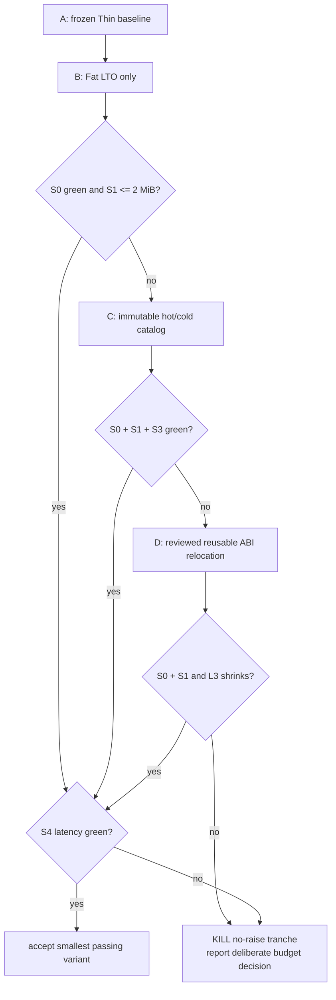

# ACU single-entry release-size experiment

Status: **active · Variant C keeps the catalog growth-bounded but misses S1 ·
Variant D next · the 2 MiB Windows executable ceiling is unchanged**.

| field | value |
|---|---|
| date | 2026-09-04 |
| purpose | keep the growing MCU-replacement surface in one distributable `agenterm-cu` entry without hiding bytes or slowing the development loop beyond its budget |
| implementation | `research/cu-size-budget/` |
| pre-reading | `prd/PRD_02_28_agenterm_cu.md`, `scripts/artifacts.json`, `docs/agenterm-rust-cheatsheet.md` |
| source discipline | same source SHA, toolchain and Windows x86_64 target for every compared build |

## 0. Settled facts

```text
ACU delivery footprint
├─ L1 hot entry: parse · route · typed reply
├─ L2 mechanism: current/ssh/vnc providers + OS seam
├─ L3 shipped court: agenterm-cu.exe + required libagenterm
└─ cold product metadata: help · verb catalog · capability/gap declarations
```

1. The v0.1.16 Windows x86_64 Release carried a 1,420,800-byte
   `agenterm-cu.exe`. The current Thin-LTO stripped Release pilot is 2,376,704
   bytes, after a much larger post-v0.1.16 capability set; that interval is not
   attributed to `network-probe` alone.
2. The existing executable ceiling is 2,097,152 bytes. This experiment cannot
   raise it, delete public behavior, split a second ACU executable, or count
   compression outside the executable as success.
3. A Fat-LTO pilot produced 2,268,672 bytes. It recovers 108,032 bytes but still
   misses the ceiling by 171,520 bytes, so a compiler switch alone is not a
   verdict.
4. `agenterm-cu` is already a dynamic consumer of the shipped `libagenterm`.
   Moving bytes across that seam is not automatically a product-size win; L3
   is reported separately.
5. Release build latency is product cost. A size win that turns routine warm
   qualification into a multi-minute rebuild is not free.

## 1. Hard constraints

- Compare an exact clean source SHA using Rust 1.97.0, Windows x86_64 MSVC,
  `opt-level=z`, `panic=abort`, `codegen-units=1`, stripped Release output.
- Report every size as `{boundary, tool, build, target/execution}` and report
  L1/L2/L3 separately where measurable. Never divide unlike measurements.
- Public CLI parsing, `help`, `verbs --json`, current/ssh/vnc routing, typed
  errors, three-OS smoke evidence and six-cell compilation must remain intact.
- The hot development profile remains `release-fast`. Release-only LTO may not
  leak into that loop.
- No runtime download, writable catalog, self-extraction, second executable,
  UPX, or external data file required for `--help`/dispatch.
- Any catalog compaction must fail at build time on missing/duplicate verb
  identity and retain generated-doc parity.
- **Disease detector:** any urge to move bytes into `libagenterm`, an overlay,
  or a downloaded catalog merely so `agenterm-cu.exe` passes is a finding to
  measure at L3, not a success to claim at L1.

## 2. Minimal variants

| variant | change | why it remains in court |
|---|---|---|
| A · frozen Thin | current Release profile | truth baseline |
| B · Fat LTO | only `lto=fat`; no source change | measures the compiler/linker opportunity independently |
| C · hot/cold catalog | retain typed hot name/alias/scope/family routing; encode cold help and capability prose in one immutable in-binary table generated from the same source | tests whether static product metadata, rather than behavior, can stop growing linearly in machine code/data |
| D · reviewed ABI relocation | only if C misses: move genuinely reusable mechanism into the already-shipped ABI, never help/CLI policy | distinguishes reusable mechanism from byte shuffling; L3 is the primary size for this branch |

## 3. Precommitted criteria

| id | nature | criterion |
|---|---|---|
| S0 | Boolean | exact public behavior and owning unit/policy/three-OS journeys stay green; otherwise reject the variant |
| S1 | Boolean | stripped Windows x86_64 `agenterm-cu.exe` is at most 2,097,152 bytes |
| S2 | footprint | L3 (`agenterm-cu.exe` + required exact `agenterm.dll`) does not grow relative to A; D must reduce L3, not only L1 |
| S3 | slope | 16 synthetic cold metadata rows add at most 4,096 stripped bytes; measure 0/16/32 rows and reject a slope above 256 bytes/row |
| S4 | latency | warm Windows x86_64 Release rebuild is at most 60 seconds and no more than 25% slower than A; report cold separately |
| S5 | delivery | release task consumes the measured bytes without a bespoke second staging route; `release-fast` behavior and time remain unchanged |

S0 and S1 are kill gates. S3 is the structural primary criterion: today-small
but linearly growing metadata does not solve an MCU-replacement product whose
verb surface is intentionally expanding.

## 4. Decision tree and time box



- Stop B after exact S0/S1/S4 measurements; do not tune linker flags endlessly.
- Stop C after 0/16/32 metadata points and one exact release build.
- D is allowed only after C has a written result. Kill D on an ABI that owns
  CLI wording or on any L1 win with flat/worse L3.
- The time box ends at the first S0+S1+S3+S4 passing variant, or D's first L3
  result. A miss returns a measured product-budget decision to the PRD; it does
  not silently raise the ceiling.

## 5. Evidence layout

```text
research/cu-size-budget/
├─ README.md
├─ measure.sh
└─ RESULTS.md
```

Each result records exact SHA, dirty state, `rustc -Vv`, flags, whole stripped
file bytes, PE section bytes, elapsed seconds, execution state and the commands
needed to reproduce it.

## 6. Excluded choices

| choice | reason |
|---|---|
| UPX or another executable packer | AV/reputation and startup regressions; changes the object being qualified |
| external help/catalog file | breaks the single distributable entry and creates version-skew failure |
| remove typed gaps/help/aliases | capability discovery is product behavior, not debug text |
| second ACU executable | violates the accepted single-entry product identity |
| immediate global budget raise | erases the experiment instead of explaining the growth |

## 7. Not answered here

- Whether a future qjswasm L2 moves product logic out of six native shells.
- Whether the 2 MiB class remains the right long-term budget after this
  no-raise tranche produces its final evidence.
- Generic tinyvm/Wasmtime competition; that horizon has its own courts.

## 8. Result

### A/B exact rerun — B rejected at S1

Both variants were rerun from clean exact source `b7ba020b` with
`research/cu-size-budget/measure.sh`; commands, section bytes and complete
provenance are retained in `research/cu-size-budget/RESULTS.md`.

```text
A Thin baseline = 2,376,704 B · 18 s package rebuild
└─ B Fat LTO    = 2,268,672 B · 21 s package rebuild
   ├─ S4 latency: PASS (21 s < 60 s; +16.7% < 25%)
   └─ S1 size: FAIL (171,520 B above 2 MiB) → stop B → enter C
```

Fat LTO recovers 108,032 bytes and substantially reduces PE unwind metadata,
but the decision tree checks S1 before convenience: B is not an accepted
solution. S0 was not rerun for a variant already killed by S1, and no metric or
threshold was changed after seeing the result. The result overturned the hope
that linker configuration alone could close the court; Variant C now owns the
next measurement.

### C exact rerun — bounded growth accepted, S1 still red

```text
C0  = 2,221,056 B · 22 s · +123,904 over 2 MiB
C16 = 2,222,592 B · 20 s · 96 B/row from C0
C32 = 2,223,104 B · 20 s · 64 B/row average from C0
├─ S3: PASS (both slopes < 256 B/row)
├─ S4: PASS (< 60 s and no regression against A)
└─ S1: FAIL → retain the bounded catalog architecture → enter D
```

The catalog refactor removed 47,616 bytes from B while converting future cold
metadata growth from Rust code/data/relocations into a measured compressed
stream. It is therefore retained even though it is not the final size answer.
D may inspect genuinely reusable mechanism only; CLI grammar, wording and
catalog policy remain in the executable, and L3 must shrink for D to count.

### D attribution start — resolver is the first reviewed mechanism

A Fat-LTO Darwin symbol profile is direction-finding only, not Windows size
evidence. It attributes about 130.8 KiB of text to the standard-library system
DNS resolver path, while `agenterm-platform` itself contributes about 12.1 KiB
and the new decompressor about 3.8 KiB. This makes DNS resolution the first D
candidate: it is a neutral OS mechanism useful to CU, qjswasm and other
consumers, and the public probe already runs it inside an invocation-owned
child so cancellation remains outside the resolver call.

The admissible experiment is a typed `agenterm-platform` resolver facade plus
a bounded libagenterm ABI projection; the CU worker keeps product validation,
attempt policy, TCP outcome language and JSON. Reject a JSON-shaped ABI, any
loss of the owned-worker timeout/reap contract, or a change whose exact Windows
L3 (`agenterm-cu.exe + agenterm.dll`) does not shrink. No ABI change is accepted
from the Darwin profile alone.
