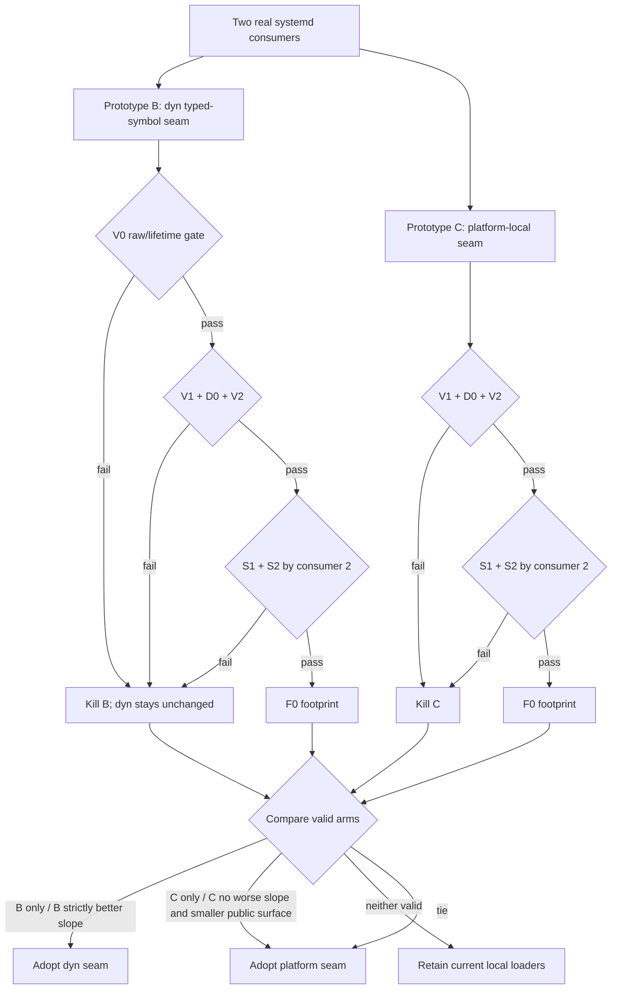

# dyn typed-symbol folding decisive experiment

**SPEC ONLY · not started · not must-ship · no capability-status change**

| field | value |
|---|---|
| date | 2026-09-14 |
| purpose | Decide whether a lifetime-bound typed-symbol seam belongs in `agenterm-dyn`, in `agenterm-platform`, or nowhere new |
| implementation | `research/dyn-typed-symbol-fold/` |
| pre-reading | `AGENTS.md`, `docs/agenterm-rust-cheatsheet.md`, `.agents/skills/decisive-experiment/SKILL.md`, `prd/PRD_02_34_agenterm_dyn.md` |
| source discipline | One shared checkout; dedicated repo-local Cargo lane; no product policy or symbol catalog enters dyn |

This experiment serves the Native Importer engineering economy: a dyn enhancement
is acceptable only when a small stable mechanism lets two real upper-layer
consumers delete parallel loader machinery. The specification accepts a result
that keeps dyn unchanged.

## 0. Settled facts and question

The following facts are not reopened.

1. `agenterm-dyn` already owns its ABI Importer loader and symbol-resolution path,
   `LibraryHandle` RAII, the 75-shape invocation matrix and the five-word
   `AbiError` vocabulary. It owns no product allowlist, budget or authorization.
2. `agenterm-platform` owns typed OS meaning. Its Linux `login_session.rs` and
   `current_target_binding.rs` adapters each independently implement
   `dlopen("libsystemd.so.0")`, `dlsym`, function-pointer conversion, cleanup and
   partial-construction rollback.
3. Those two adapters are real product consumers with different product errors
   but the same native library and loader pattern. Their fixed symbol names and
   exact C prototypes remain platform-owned facts.
4. Copying a function pointer out of a library is only valid while that library
   remains loaded. A public API that returns an unbound raw address or a copied
   effectively-`'static` function pointer would weaken rather than strengthen
   the Native Importer atom.
5. This is not a performance benchmark. All alternatives should load and resolve
   the same symbols the same number of times. The question is ownership, safety,
   dependency shape and marginal code economy.

The disputed structural choice is:

- **A — retain** both adapter-local loaders;
- **B — dyn seam**: add a lifetime-bound typed-symbol resolution mechanism to
  `LibraryHandle`, then migrate both platform consumers;
- **C — platform seam**: keep dyn unchanged and factor the shared `libsystemd`
  loader inside `agenterm-platform`.

All three are credible before measurement. A keeps platform independence and
local proof; B strengthens one Native Importer mechanism and may delete duplicate
unsafe loader code; C deletes duplication without broadening dyn's public unsafe
surface.

## 1. Hard constraints

An arm is invalid if any constraint below fails.

1. **No policy in dyn.** Dyn may accept a caller-provided library and symbol name;
   it must not contain a symbol/library allowlist, `libsystemd` knowledge, product
   target names, pointee layouts, budgets or authorization.
2. **Lifetime is structural.** A resolved callable cannot be invoked after its
   owning library is dropped. Documentation, convention, debug assertions or
   “the adapter stores both fields” do not satisfy this gate. The Rust type and
   borrowing shape must reject a compile-fail witness.
3. **No raw escape hatch.** The candidate must not expose `*mut c_void`, `usize`,
   a `'static` function pointer, public `transmute`, or a generic address API.
4. **Mechanism remains singular.** B must reuse dyn's existing `LibraryHandle`
   loader and lookup-error path; C must produce one platform-local systemd loader.
   Neither arm may leave the two current implementations alongside the new one.
5. **Product errors remain owned above dyn.** Both adapters keep their current
   typed product error codes and messages. A dyn lookup error may be mapped at the
   adapter boundary but may not replace them.
6. **Two consumer points are mandatory.** Measuring only one adapter cannot
   reveal marginal cost and yields no verdict.
7. **Like-for-like capability.** Both migrated adapters load the same soname,
   resolve the same operation sets, retain partial-load cleanup, and preserve all
   current behavior. No new symbol or product capability is added.
8. **No hidden allocation or cache.** No global state, symbol cache, mutex,
   allocation per lookup, retry or eviction policy is introduced.
9. **Dependency direction stays acyclic.** `agenterm-dyn` must not depend on
   `agenterm-platform`; if platform consumes dyn, the exact feature/dependency
   edge is recorded and checked in isolation.
10. **Disease detector.** Any urge to make the prototype succeed by adding a
    raw-address method, a symbol-specific macro/table in dyn, self-referential
    unsafe storage, a `'static` cast, or a second error/loader system is a finding
    that kills B, not a requirement to satisfy.

## 2. Minimal experiment

Implement one separable research patch per arm from the same baseline. Do not
maintain three independent long-lived branches; capture each patch and reset it
before the next arm.

| dimension | A — retain | B — dyn seam | C — platform seam | why |
|---|---|---|---|---|
| first consumer | existing `login_session.rs` | migrate it through lifetime-bound dyn symbols | migrate it through platform systemd loader | Measures shared-entry intercept |
| second consumer | existing `current_target_binding.rs` | migrate through the same dyn seam | migrate through the same platform seam | Measures marginal slope |
| library lifetime | local raw handle | existing `LibraryHandle` owns all resolved borrows | platform RAII systemd handle owns all resolved borrows | Same lifetime requirement |
| symbol identity | platform constants | passed from platform to dyn | platform constants | Dyn never learns product policy |
| invocation | existing typed function pointers | call through a borrowed resolved-symbol wrapper | call through platform wrapper | No ABI matrix expansion |
| error mapping | current errors | dyn mechanism error mapped to current errors | loader error mapped to current errors | Public behavior frozen |
| runtime court | current Linux adapter courts | same courts | same courts | Like-for-like black-box owner |

B may add only the smallest generic lifetime-bound symbol abstraction needed by
both adapters. It must not route these calls through `invoke_abi`: these typed OS
adapters already know their prototypes, and converting them into runtime
`AbiSignature` values would add work and erase compile-time type information.

## 3. Precommitted criteria and measurement discipline

Criteria are evaluated in this order: safety/validity, dependency and behavior,
then marginal economy, then delivery footprint.

| id | property | pass condition |
|---|---|---|
| V0 | Boolean / safety | §1.2 and §1.3 pass, including a compile-fail witness showing a resolved callable cannot outlive/drop its library |
| V1 | Boolean / mechanism | exactly one loader/lookup implementation remains in the measured arm; no policy/global cache/raw escape appears |
| V2 | Boolean / behavior | both adapters' unit and Linux native black-box courts preserve result/error behavior and partial-load cleanup |
| D0 | Boolean / dependency | feature-isolated `agenterm-platform` builds remain acyclic; non-Linux and no-feature configurations do not gain an accidental dyn dependency |
| S1 | Slope / production code | after consumer 2, B or C has non-positive marginal production NCLOC and total production NCLOC is lower than A |
| S2 | Slope / unsafe surface | after consumer 2, the winning arm has fewer independent loader/lookup unsafe sites than A and adds no new unchecked lifetime claim per consumer |
| F0 | Footprint | stripped release L1/L2/L3 are no larger than A beyond measurement noise; otherwise the arm must recover the bytes by consumer 2 |
| M0 | List | exact public APIs, dependency edges, unsafe sites, loaders, symbols and adapter-owned mappings for every arm |

NCLOC means nonblank, noncomment production lines; tests and documentation are
reported separately. Record shared code after consumer 1 and marginal change for
consumer 2—only reporting total LOC is invalid. Recalculate A with the same script
used for B/C. For bytes, report the four-part label `{boundary, tool, build,
target/execution}` beside each value and fixed L1/L2/L3 rows. Use the same stripped
release build, target and size tool for all arms; an unmeasured cell says
“not measured”, never substitutes another metric.

Required negative mutations:

1. remove the ownership/lifetime tie and confirm the compile-fail witness changes
   state;
2. bypass the shared resolver in consumer 2 and confirm the single-loader/source
   inventory gate fails;
3. remove one mapped missing-symbol failure and confirm its owning adapter court
   fails by name.

## 4. Decision tree, kill criteria and timebox



The tie goes to C because it does not broaden dyn's public unsafe contract. B
wins only if it is valid and its second-consumer slope is strictly better than C,
or C fails a hard gate.

Kill B immediately if it requires a raw address, copied `'static` pointer,
self-referential unsafe object, symbol/product table in dyn, new global state, or
new public mechanism error. Kill either refactor if consumer 2 does not make total
production NCLOC lower than A, if current errors drift, or if a second loader
remains. A killed arm is reverted completely; findings remain in §8.

**Timebox:** stop as soon as both consumers have produced V0–V2/D0 and S1/S2 for
B and C, or as soon as a fatal gate kills an arm. Do not optimize bytes before
the safety and second-consumer slope are known. F0 is measured only for arms still
alive after S2.

## 5. Research layout and integration boundary

```text
research/dyn-typed-symbol-fold/
├── README.md                 # identities, arm status and exact commands
├── measure_ncloc.*           # one meter for A/B/C and both consumer points
├── arm-a-baseline.patch
├── arm-b-dyn-seam.patch
├── arm-c-platform-seam.patch
├── compile-fail/             # lifetime/raw-escape witnesses
└── RESULTS.md                # §3 table, deviations, rerun commands, verdict
```

If B wins, the coherent product increment contains the dyn seam, both platform
migrations, tests, PRD 02.34 ownership update and the reusable Rust rule. If C
wins, dyn remains byte-identical and the platform-local seam plus both migrations
form the increment. No experiment patch is production state before §8 has a
verdict.

## 6. Excluded alternatives

| option | reason excluded |
|---|---|
| route systemd calls through runtime `AbiSignature`/`invoke_abi` | loses compile-time prototypes and adds per-call lowering without consumer value |
| return copied generic function pointers from `LibraryHandle` | lifetime is conventional rather than structural |
| expose raw symbol addresses | enlarges unsafe surface and makes every caller reinvent the cast/lifetime proof |
| cache symbols globally or per process | introduces ownership, eviction and retry semantics absent from the problem |
| put systemd symbol names/prototypes in dyn | product/OS policy leaks into the mechanism microkernel |
| migrate only one adapter | cannot measure marginal consumer slope |
| merge the two product adapters | they own distinct product meanings and errors; only the loader seam is disputed |
| add syscall/ioctl/ABI shapes | unrelated Native Importer families and confounding capability growth |

## 7. Questions this experiment does not answer

- Whether a future callback, struct-by-value, variadic or JIT family belongs in
  dyn.
- Whether other platform loaders should migrate; they become new consumers only
  after this two-point slope has a verdict and their ownership matches it.
- Whether symbol-address caching is profitable.
- Whether qjswasm should expose typed symbol lookup to guests—it should not gain
  that surface from this experiment.
- Any permission, symbol-approval or trusted-library policy.
- Windows/macOS runtime parity for Linux systemd behavior. Six-cell compilation
  remains required; native behavior is owned by Linux runners.

## 8. Result template — not started

Until this section and `research/dyn-typed-symbol-fold/RESULTS.md` contain measured
results, this specification has **no architectural verdict** and must not be cited
as evidence that dyn should gain a typed-symbol API.

| criterion | A retain | B dyn seam | C platform seam |
|---|---:|---:|---:|
| V0 lifetime/raw safety | not run | not run | not run |
| V1 single mechanism | not run | not run | not run |
| V2 two-consumer behavior | not run | not run | not run |
| D0 dependency isolation | not run | not run | not run |
| shared NCLOC after consumer 1 | not measured | not measured | not measured |
| marginal NCLOC consumer 2 | not measured | not measured | not measured |
| total production NCLOC | not measured | not measured | not measured |
| independent unsafe sites | not measured | not measured | not measured |
| L1 / L2 / L3 stripped bytes | not measured | not measured | not measured |

The completed section must state the exact decision-tree path, source/toolchain
identity, every deviation from this specification, both favorable and unfavorable
readings, negative-mutation results, and whether the result overturned the initial
expectation. The meter and rerun commands must be sufficient for an independent
reviewer to reproduce every number.
