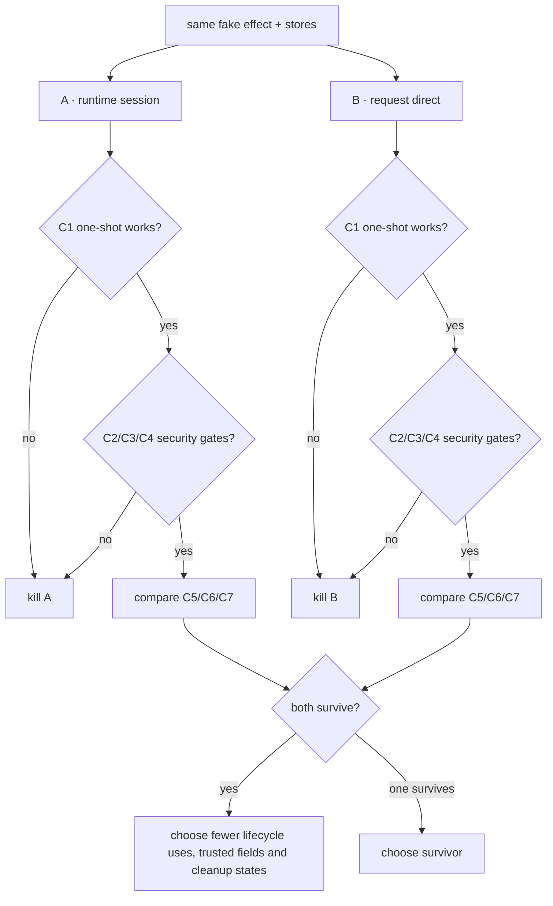

# MCP persisted authorization/session experiment

> Research decision only. It does not advertise an MCP mutation tool, change
> the public catalog, or relax any authorization gate.

| Field | Value |
|---|---|
| Date | 2026-09-08 |
| Purpose | Decide whether MCP shell mutation keeps an ACU runtime session or uses persisted request identity directly |
| Implementation | `research/mcp-persisted-session/` |
| Read first | `prd/PRD_02_31_cu_authorization_safety.md`, `docs/agenterm-rust-cheatsheet.md` |
| Source discipline | One shared fake effect mechanism; no GUI, credential, network or real shell payload |

## 0. Fixed facts

1. Production MCP mutation remains undiscoverable and unreachable.
2. A human starts the sidecar with one explicit persisted grant id; MCP cannot
   create, select, list or revoke grants.
3. Ambient `AGENTERM_CU_GRANT*` / `AGENTERM_CU_AUTH*` never authorizes this path.
4. JSON-RPC id owns transport cancellation. Caller `idempotency_key` owns
   durable effect identity across a reconnect.
5. Grant expiry, revocation, target/session binding, operation binding and use
   accounting remain owned by the existing persisted grant store.
6. The shared executor already reserves a fresh durable request before it
   consumes a persisted grant; replay and uncertain outcomes do not consume a
   second use.

The disputed choice is only:

```text
MCP persisted mutation
├─ A · runtime-session model
│  ├─ persisted grant authorizes session-start
│  ├─ same grant authorizes each shell-exec
│  └─ same grant authorizes session-renew/session-end
└─ B · request-direct model
   ├─ connection nonce is transport state, not authorization
   ├─ each shell-exec consumes one persisted grant attempt
   └─ durable request store owns replay/outcome-unknown across reconnect
```

## 1. Hard constraints

- One-shot `shell-exec` must be usable; lifecycle bookkeeping may not consume
  its only effect use.
- Same grant + idempotency key + command after reconnect must not repeat the
  effect or consume another use.
- A revoked/expired/wrong-operation grant causes zero mechanism attempts.
- Cancellation after dispatch never changes an authoritative result into a
  refusal and never redispatches an uncertain effect.
- Broken stdout with stdin still open must enter bounded teardown.
- No lease, target/session binding, installation key, command output or
  credential-like value enters stdout, stderr, audit or grant projections.
- Existing session-bound job/device ownership semantics must not be weakened.
- Any impulse to add an unscoped internal authority, ambient fallback or
  caller-constructible trusted identity is the disease this experiment detects;
  record and reject it instead of widening the prototype.

## 2. Minimal experiment

Build one test-only harness with the same fake effect counter and durable
request/grant stores. Package it twice:

| Dimension | A | B | Why fixed this way |
|---|---|---|---|
| Public command | bounded `shell-exec` only | same | avoids mixing job/device ownership into the first decision |
| Grant | current target, Actuate, exact shell operation | same | isolates lifecycle accounting |
| Effect | append one opaque marker | same | independently countable without shell output |
| Transport | two sequential connection instances | same | proves reconnect behavior |
| Failure injection | after reservation, after effect, stdout disconnect | same | exercises uncertainty and teardown |

Do not implement a public descriptor, native court, lease-renew scheduler or
general command family in this experiment.

## 3. Predetermined criteria

| ID | Nature | Criterion |
|---|---|---|
| C1 | Boolean/security | one-shot executes exactly one marker and returns an authoritative result |
| C2 | Boolean/security | reconnect replay returns the prior result, markers=1, consumed uses=1 |
| C3 | Boolean/security | revoke/expiry/wrong operation before dispatch leaves markers=0 and uses unchanged when mismatch semantics require it |
| C4 | Boolean/cleanup | stdout-only disconnect drains/cancels within the bounded deadline and leaves no owned child/session record |
| C5 | Slope | additional successful shell calls consume exactly one grant use each; report lifecycle uses separately |
| C6 | Inventory | list every new trusted state, secret and public protocol field |
| C7 | Compatibility | session-bound job/device commands remain outside the chosen shell-only path and retain their current contract |

Every result records source SHA, target, command, test name, store digests before
and after, marker count, consumed-use delta and elapsed milliseconds. No timing
comparison decides the architecture; time is diagnostic only.

## 4. Decision tree and kill criteria



Priority is C1, then C2/C3/C4, then C5/C6/C7. Every criterion appears in the
tree. If A requires more than one grant use before the first shell effect, A
fails C1 rather than raising the one-shot budget. If B needs an ambient/internal
authority or weakens job/device ownership, B fails C3/C7.

Timebox: stop as soon as both variants have produced C1–C7 results, or as soon
as one variant fails a kill criterion and the other passes all Boolean gates.

## 5. Expected files

```text
research/mcp-persisted-session/
├─ README.md
├─ harness.rs
├─ run.sh
└─ RESULTS.md
```

## 6. Excluded choices

| Choice | Reason |
|---|---|
| Ambient `actuate` environment | not persisted, target-bound or independently revocable |
| Auto-select the only/latest grant | lets the runtime choose authority the human did not name |
| Put grant id in MCP tool arguments | lets each untrusted caller switch authority |
| Temporary process-environment mutation | races in the multithreaded sidecar and crosses the worker boundary |
| Give lifecycle calls free internal Actuate | creates an unscoped bypass around the authorization model |

## 7. Not answered here

- Linux verified current-session binding implementation.
- Native six-cell packaged qualification.
- Which non-shell mutation verbs MCP should eventually expose.
- Human UX for issuing or backing up grants.

## 8. Result

Not run. No option is selected until `research/mcp-persisted-session/RESULTS.md`
contains the reproducible C1–C7 trace.
