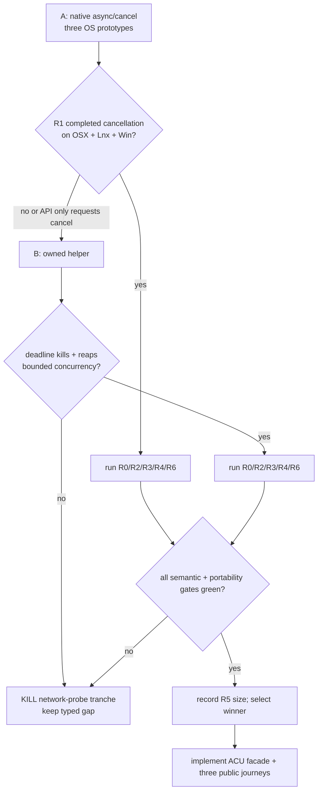

# Network probe resolver containment experiment

Status: **Variant A rejected at R1 · Variant B selected for implementation ·
does not yet promote the ACU capability**.

| field | value |
|---|---|
| date | 2026-09-04 |
| purpose | choose a truly bounded DNS mechanism for `agenterm-cu network-probe` |
| implementation | `research/network-probe-resolver/` |
| product owner | `agenterm-platform` mechanism + `agenterm-cu` typed facade |
| pre-reading | `prd/PRD_02_28_agenterm_cu.md`, `plan/acu-mcu-capability-ledger.json`, `docs/agenterm-rust-cheatsheet.md` |
| source discipline | clean-room behavior; do not copy MCU TypeScript |

## 0. Settled facts

```text
network-probe outcome
├─ parse/validate before effect
├─ resolve host once
├─ deduplicate addresses
├─ connect attempts round-robin over that frozen set
├─ per-attempt latency + outcome
└─ deadline cleanup
   ├─ no resolver thread/process can grow without a fixed bound
   ├─ every owned child is killed and reaped
   └─ timeout is typed; it is never reported as TCP unreachable
```

1. Active qjswasm/tinyvm exposes no generic DNS/TCP host API. Historical
   `std.net.*` catalog names are not an implementation.
2. ACU must not spawn MCU, a shell, `ping`, `nc`, PowerShell or another external
   network tool.
3. A connect refusal or connect timeout is a successfully completed observation
   with `status=unreachable`. Resolver/worker failure is a typed command failure.
4. The first public shape is
   `network-probe HOST [--port N] [--attempts N] [--timeout-ms N]`, with
   `network probe` as the MCU-compatible alias.
5. This experiment decides containment only. It does not add interfaces,
   routes, DNS-service inventory, socket inventory, HTTP or raw packet APIs.

## 1. Hard constraints

- Host is one bare value of 1..253 bytes; port `1..=65535`, attempts `1..=20`,
  per-attempt timeout `100..=60000 ms`. Invalid input fails before DNS/socket.
- Resolution happens once per command and its deduplicated address set is
  frozen before attempt 1. No hostname-based hidden re-resolution is allowed.
- The parent owns one monotonic overall deadline covering resolver plus all
  attempts. Deadline arithmetic is checked and capped.
- A timed-out resolver must leave no unbounded background work. A fixed
  process-wide pool may become typed `resolver_saturated`, but may never grow
  another thread to hide saturation.
- An owned helper, if selected, is an internal protocol: bounded request and
  response frames, no shell, no inherited ambient stdio, exact kill + reap on
  timeout, and no public capability claim for the helper entry itself.
- Three-platform proof uses only an invocation-owned loopback listener. Public
  evidence never depends on Internet reachability or external DNS health.
- **Disease detector:** any urge to add a policy allowlist, silently retry DNS,
  leave a detached resolver after timeout, or call an external utility is a
  finding that fails this experiment—not a convenience to implement.

## 2. Minimal variants

| variant | mechanism | reason to keep in court |
|---|---|---|
| A · native async/cancel | each OS's cancellable resolver API, followed by standard bounded TCP connect | smallest runtime topology if all three hosts prove cancellation completion |
| B · owned internal helper | one child performs blocking system resolution and bounded connects; parent enforces deadline, kills and reaps | portable containment even when the system resolver cannot be cancelled |

Rejected before measurement: one detached thread per request (unbounded under a
stalled resolver), pure UDP DNS (not the host resolver), and a generic async
runtime dependency (size/topology change larger than this capability).

## 3. Precommitted criteria

| id | property | criterion |
|---|---|---|
| R0 | Boolean | valid loopback host resolves once and two attempts reach the owned listener on OSX/Lnx/Win |
| R1 | safety | injected resolver stall returns by overall deadline + 250 ms and leaves zero live owned helper processes; variant A must prove cancellation completion, not only request cancellation |
| R2 | boundedness | 32 concurrent stalled requests never exceed the declared fixed worker/process bound; excess calls fail typed |
| R3 | semantics | frozen addresses are deduplicated; attempt count is exact; a closed loopback port returns `ok` observation with `status=unreachable` and no hidden retry |
| R4 | integration | invalid host/limits fail before effect; worker/protocol/DNS faults are distinguishable typed failures |
| R5 | cost | report stripped release delta for `agenterm-cu` and added transitive crates; no hard byte ceiling is changed |
| R6 | portability | matching implementation compiles for all six cells and executes on one native court per OS |

R1 precedes size and convenience. A smaller implementation that cannot prove
completed cancellation loses.

## 4. Decision tree, kill criteria and time box



- Kill A as soon as one target cannot prove *completed* cancellation within the
  bound; an API named “cancel” is insufficient.
- Kill B on orphan child, inherited interactive window, unbounded output, or a
  second public command surface.
- Kill the tranche if neither variant passes R1/R2. Keep `network.probe` typed
  as a gap rather than weakening the deadline.
- Time box ends when R0–R4 have one reproducible table for the surviving
  variant. Do not continue into HTTP, UDP, TLS or socket inventory.

## 5. Evidence layout

```text
research/network-probe-resolver/
├─ README.md
├─ measure.sh
├─ fixtures/
└─ RESULTS.md
```

Every result records exact source SHA, compiler, target, command, raw duration,
process/thread high-water mark, exit state and cleanup observation.

## 6. Excluded choices

| choice | reason |
|---|---|
| `ToSocketAddrs` on a throwaway thread per call | timeout does not stop resolution; repeated stalls grow work |
| MCU subprocess | preserves the dependency ACU is meant to replace |
| `ping`, `nc`, PowerShell, shell script | external semantics, parsing and lifecycle become part of the product contract |
| custom UDP DNS | bypasses hosts files, enterprise resolver policy, mDNS and platform search behavior |
| qjswasm catalog name | no active host implementation exists |

## 7. Not answered here

- Whether qjswasm should later expose generic sockets/listeners/WebSockets.
- Whether ACU network inventory should share this resolver cache.
- HTTP/TLS reachability, certificate policy, proxy behavior or endpoint
  authorization. Script Runtime remains unrestricted; caller policy belongs to
  the future Agent harness.

## 8. Result

### 8.1 Variant A verdict — rejected before product implementation

```text
A native async/cancel
├─ Windows: FAIL R1
│  └─ GetAddrInfoExCancel may signal cancellation while a synchronous legacy
│     name-service provider continues consuming resources until it completes
├─ Linux/glibc: FAIL R1
│  ├─ gai_suspend timeout does not cancel
│  └─ gai_cancel returns EAI_NOTCANCELED after a resolver worker starts
└─ decision: stop A immediately; do not spend the court on OSX convenience
```

This is the precommitted kill criterion, not an implementation setback.
Microsoft explicitly documents that an underlying synchronous legacy
name-service-provider operation may continue after `GetAddrInfoExCancel`
signals `WSA_E_CANCELLED`. Linux `getaddrinfo_a` likewise cannot cancel a
request after its worker starts; `gai_suspend` only bounds the caller's wait.
Both violate R1's requirement to prove completed cancellation and zero
unbounded background work.

References:

- Microsoft [`GetAddrInfoExCancel`](https://learn.microsoft.com/windows/win32/api/ws2tcpip/nf-ws2tcpip-getaddrinfoexcancel)
- Microsoft [`GetAddrInfoExW`](https://learn.microsoft.com/windows/win32/api/ws2tcpip/nf-ws2tcpip-getaddrinfoexw)
- Linux man-pages [`getaddrinfo_a(3)`](https://man7.org/linux/man-pages/man3/getaddrinfo_a.3.html)

Linux also has a delivery conflict independent of R1: both Linux release cells
hold a glibc 2.28 floor, while the GNU asynchronous resolver lived in
`libanl` before glibc 2.34; the current Zig-provided libc path does not supply
that extra library. The safety failure already decides the branch, so this
portability cost is recorded but not worked around.

### 8.2 Selected next branch

Variant B is selected: an invocation-owned internal helper performs blocking
host resolution and bounded TCP connects; the parent applies the overall
deadline and kills **and reaps** the exact child on expiry. The helper remains
an internal bounded protocol, never a second public capability or an external
utility dependency.

`network.probe` remains a typed gap until Variant B passes R0–R6. The result
section must be updated again with measured cleanup, concurrency, semantic,
six-cell compile, three-OS runtime and size evidence before promotion.
