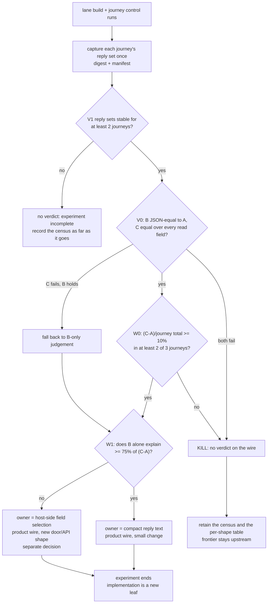

# qjswasm host-reply wire cost experiment

Status: **SPEC ONLY · not started · not must-ship · no capability-status change**.

This leaf writes one frozen experiment specification and nothing else. It is not
scheduled into any version, does not enter `must-ship`, and changes no PRD
capability state, no `tinyvm` / `tinyvm-qjs` pin, no budget default, no Rust
source and no `.qjs` script. An accepted verdict would still require its own
reviewed implementation leaf. The current revisions are execution-time record
items, never premises of this specification.

| field | value |
|---|---|
| date | 2026-09-13 |
| purpose | decide whether the *bytes* the host hands a guest as a reply are a large enough owner of journey steps that a product-side wire change (compact reply text and/or host-side field selection) is the next action |
| implementation | future: `research/qjswasm-host-reply-wire-cost/` (reply sets, census, pricing court, `RESULTS.md`) |
| pre-reading | `plan/design-host-op-budget.md` (§7, §7.6, §9, §10), `research/qjswasm-harness-journal/RESULTS.md`, `research/qjswasm-immediate-host-argument-region/RESULTS.md`, `prd/PRD_02_36_agenterm_qjswasm.md`, `scripts/qjs/server-smoke.qjs`, `scripts/qjs/native-ipc-smoke.qjs`, `scripts/qjs/workbench-smoke.qjs` |
| frozen baseline | **recorded at execution time**: exact AgenTerm HEAD, exact `tinyvm` / `tinyvm-qjs` pin, lane binary digest, toolchain, target/ISA. The pin at spec time (`9ac2598`) and HEAD at spec time (`986846e0`) are context, not premises |
| source discipline | one lane, one reporter, three shapes built from one frozen reply set; no twin prototypes |

## 0. Background and settled facts

Every host reply a `.qjs` guest consumes crosses the wire as text the guest must
parse. The reply reaches the guest through the same two-pass fetch every host
string uses, and the payload arrives inside an escaped JSON envelope, so one
reply is parsed twice by the guest before the script can read a field.

The product already pays for this and already routes around it, which is what
makes the wire a real owner rather than a hypothesis:

```text
reply wire today
├─ host parks the answer text (bridge result / child stdout)
├─ guest fetches it: fleet_result_len + fleet_result        (bytes copied into guest memory)
├─ guest JSON.parse(escaped envelope) -> payload text       (per-byte prelude walk)
└─ guest JSON.parse(payload) -> object the script reads     (per-byte prelude walk)
```

Settled facts outside this experiment:

1. The product budget currency is guest **steps**; `wall_time_ms` is a sibling
   field and is not a deterministic ceiling here.
2. The reply path's flagging and truncation semantics (`truncated_stdout`,
   `max_bridge_result_bytes` refusal, per-stream loss flags) are product
   contracts and are frozen for this experiment.
3. `plan/design-host-op-budget.md` §7 recorded, on old pins, that `JSON.parse`
   was 48% of `server-smoke`'s 31.2M steps and that 13.56M of those steps were 22
   pretty-printed replies totalling 225 KB. §7.3–§7.6 then cut several prelude
   prices. **Those numbers are prior-pin context; this experiment must re-take
   every number it judges on, in its own lane, and must not quote a prior-pin
   number as its own measurement.**
4. The `.qjs` corpus already demonstrates that the wire is a cost, not only the
   parser: `server-smoke.qjs` writes an answer to a file with `exec "$@" > "$0"`
   and reads it back because "parsing a 61 KB answer out of it measured 8-12M
   steps against 4-6M for the same answer written to a file"; `native-ipc-smoke.qjs`
   cuts an answer down to seven keys with `grep` in `sh` before the guest parses
   it; `workbench-smoke.qjs` records a "route-around cost ~1.4M more steps per
   13 KB answer for nothing".
5. The price of a byte is a property of the **pin**. A verdict here is therefore
   conditioned on the execution-time pin's per-byte price, and a later pin that
   changes that price re-opens the share, not the decision procedure.
6. Closed elsewhere and **not** candidates in this leaf: the upstream prelude /
   string-positional-access family (three times rejected, frozen; see §6), the
   guest-side record serialization owner, dyn symbol resolution, native region
   copies, engine/instance load lifecycle, and cooperative-interrupt polling.
7. Nothing in this experiment is a permission, allow-list or policy question.
   It measures a cost; it authorizes nothing.

### Should this experiment exist?

All four decisive-experiment conditions hold:

1. The choice is structural: are reply **bytes** a top-tier step owner (product
   wire change) or is the remaining cost a per-node parse price that only
   upstream can move?
2. Both positions have evidence: the corpus workarounds show real bytes being
   moved out of the guest by shell tricks, while §7.6 measured large per-node
   parse constants that no wire change can remove.
3. A measurable quantity separates them: steps removed by removing wire bytes,
   as a share of the journey's own total steps.
4. A negative result is acceptable: `C` below the frozen ratio kills the
   product-wire route for this pin and leaves the frontier upstream.

## 1. Hard constraints

### 1.1 The three shapes, exactly

One frozen reply set per journey is fed to the same guest in three shapes:

- **A (control, current truth):** the reply byte-for-byte as the guest receives
  it today — same envelope, same payload text, same escaping and indentation.
- **B (indentation only):** the same reply *value*; only insignificant
  whitespace outside string literals removed (line breaks and indentation).
  Key order, every value, and every number's spelling are preserved. B answers
  one question only: **what do the pretty-print bytes cost the guest.**
- **C (read subset):** only the fields the journey actually reads, with every
  retained field carrying its exact value and spelling. C answers the bound of
  the whole "stop carrying bytes the script never reads" route: **indentation
  plus every unread byte.** C is not a proposal to drop data the script needs;
  the field census is what defines it.

### 1.2 Sameness and validity

- Same guest program text, same host-call count, same call order, same budget
  vector, and the same reply semantics per shape. A shape may not reduce the
  number of parses, the number of reads, or the number of calls; only bytes
  change.
- **V1 reply-freeze:** each journey's reply set is captured **once**, stored
  under `research/qjswasm-host-reply-wire-cost/replies/<journey>/`, and frozen
  with a SHA-256 manifest. A later run that does not reproduce the digest is
  invalid, not "close enough".
- **V2 control reproduction:** the journey's own unmodified run is executed in
  the same lane, with its own unchanged command and budget, three times; its
  total steps must reproduce within the recorded run-to-run spread, and the
  median is the denominator.
- **V3 shape-C equivalence:** a JSON-aware comparison proves that C parses to a
  value identical to A at every field the census says the journey reads, and
  that the journey's read sequence yields byte-identical values under both.
- **V4 shape-B equivalence:** a JSON-aware comparison proves B and A parse to
  the same value (whitespace removal only, string literals untouched).

### 1.3 One ruler

Every judged number is `cost.steps` from the same reporter, in the same lane,
with 3 runs per shape per journey and the median taken. Crossed-wire input bytes
(envelope bytes and payload bytes as handed to the guest) are recorded beside
each step number. If the existing allocation probe is available in the lane
(`AGENTERM_QJS_ALLOCATION_PROBE`, read at guest-compile time in
`src/script_engine.rs`, which is what emits the `__tinyvm_qjs_json_parse_bytes`
and `__tinyvm_qjs_json_stringify_bytes` exports), record `json_parse_bytes` too;
**if it is not available, write "未测定"** — never substitute a different
quantity. The probe compiles a different guest, so probe runs are reporters
only: their steps may be quoted as judged numbers only if they reproduce the
non-probe A median within the recorded spread, and this must be stated either
way. Wall time is recorded but is not a gate. Percentages divide by the same
journey's own A total steps only; no cross-pin ratio and no cross-journey ratio.

### 1.4 Disease detector

Any urge to (a) reopen the rejected upstream prelude / string-record family
inside this leaf, (b) add a guest-side fast-path reader, second parser or new
guest instruction to make the numbers move, (c) raise a step budget, lower a
frozen gate, or re-define "read field" after seeing a share, (d) publish a share
computed from raw byte counts instead of measured steps, or (e) quote a
prior-pin number as this experiment's own result, **is the disease this
experiment detects**. Record the need as a finding and stop; do not quietly
implement it.

## 2. Minimal experiment content

| dimension | selected content | why |
|---|---|---|
| journeys | `server-smoke`, `workbench-smoke`, `native-ipc-smoke` | the three frozen public tasks whose profiles are dominated by whole-answer parsing, and the three that already contain hand-written wire workarounds |
| shapes | A / B / C as in §1.1 | A is current truth; B isolates indentation; C bounds indentation plus all unread bytes |
| capture | once per journey, digested, then read-only | re-capturing per shape would move the wire and destroy the comparison |
| unit of measurement | the journey's reply set: same reply count and same read sequence as the journey performs | keeps the comparison at the journey's own scale |
| denominator | the same journey's unmodified total steps, median of 3, in the same lane | the criterion is a **share**, so the guest's other work is priced in |
| repeats | 3 runs per shape per journey, median | run-to-run spread on a development host is wide enough to invent a win |
| reporters | `cost.steps`; crossed reply bytes; `json_parse_bytes` if the probe is available, else 未测定; `host_ops` / `host_bytes` / `waited_ms` as context; wall time recorded only | one ruler per column, no cross-quantity ratios |
| lane | repo-local `CARGO_TARGET_DIR` dedicated to this experiment | never share a target directory with another active build |
| target | one OS/ISA (macOS aarch64) | this is a wire and step-price question, not a six-cell delivery question |
| import shape | replies are handed to the guest through the ordinary host-string path, not through a new door | the guest must see the same value path it sees today |

The pricing court is one program that consumes the frozen reply set with the
journey's own read sequence, run three times per shape. It is a *reporter*, not
a second implementation of the journey: if the court's own run-to-run spread or
the journey's control reproduction fails §1.2, the run is invalid and is not
replaced with a synthetic shape.

## 3. Precommitted criteria and measurement discipline

| id | nature | criterion |
|---|---|---|
| V0 | Boolean / validity | §1.2 V1–V4 hold: reply sets frozen and digest-stable, control reproduces, B is JSON-equivalent to A, C is JSON-equivalent to A over every field the census says the journey reads. A shape that fails validity is dropped; if C fails, the verdict may fall back to B alone; if both fail, the experiment is killed with no verdict. |
| W0 | Boolean / primary gate | `(steps_C − steps_A) / journey_total_steps ≥ 10%` holds in **at least two of the three** journeys, with each shape's own 3-run median. |
| W1 | Share / decomposition | `(steps_B − steps_A) / (steps_C − steps_A)` per journey: the indentation-only share of the removable wire. This decides *which* wire change is the owner, not whether one is. |
| S0 | Safety / semantics | No shape changes guest-visible values, typed failures, exit classes or budget outcomes; no run reaches a step ceiling; reply flagging/truncation contracts are unchanged; the journey's A runs show no step regression against their own frozen baseline. |
| M0 | List | The per-journey reply census (reply count, envelope bytes, payload bytes, steps per shape, share, notes) — the primary product of this experiment may be this list, not one number. |

Order, as declared above: **V0 (validity/safety) → W0 (gate) → W1 (mechanism) →
M0 (the list)**. Every criterion appears as a node in §4.

Judged numbers are medians of 3; a share is reported to one decimal and never
rounded up to reach 10%. A shape may not be re-run "for a better number" after
its verdict is read; a re-run invalidates the run and must be recorded as such
in §8.

## 4. Decision tree, kill criterion and time box



Kill criteria:

- V0 fails for both B and C, or the semantic equivalence cannot be established
  for a shape without changing what the guest reads;
- W0 fails: `C` removes less than 10% of the journey's own total steps in two or
  more journeys — the reply bytes are then not the next owner at this pin;
- fewer than two journeys produce a frozen reply set with three reproducible
  medians each;
- satisfying a shape requires any disease-detector item from §1.4, a budget
  change, a redefinition of a read field, or a second guest parser.

All pass/fail combinations exit: validity failure → no verdict; C-only failure
→ B-only judgement; W0 fail → kill with the census retained; W0 pass → W1
chooses between the two wire owners and the experiment ends.

Time box is evidence-based, not calendar-based:

1. The experiment ends as soon as **the three journeys' reply sets are frozen
   and A/B/C each have a 3-run median**, or as soon as only one journey remains
   usable (then: no verdict).
2. No product wire implementation, no door/API addition, no guest change and no
   upstream work happens inside this experiment. Passing W0 ends the experiment,
   it does not start the implementation.
3. No second journey may be added, no shape may gain a variant (for example a
   "compact + selected fields" hybrid), and no ceiling may be moved after the
   first numbers exist.

## 5. Evidence layout and rerun commands

```text
research/qjswasm-host-reply-wire-cost/
├─ README.md            Q-index entry and status
├─ replies/<journey>/   frozen reply set + manifest.json (bytes, sha256)
├─ census.json          per-journey reply census and field-use list
├─ measurements.json    A/B/C steps, crossed bytes, probe values, medians
└─ RESULTS.md           third-party rerunnable receipt, written per §8
```

Commands are run from the repository root. The exact lane, revisions and binary
digest are recorded with every number:

```bash
export CARGO_TARGET_DIR="$PWD/target/frontier-host-reply-wire"   # repo-local lane
git rev-parse HEAD; git status --porcelain                        # identity of the run
cargo build --bin agenterm                                        # lane build
shasum -a 256 "$CARGO_TARGET_DIR/debug/agenterm"                  # binary digest

# journey control runs (unmodified commands and budgets), 3 times each
"$CARGO_TARGET_DIR/debug/agenterm" cli script task run server-smoke    --manifest agenterm.tasks.json
"$CARGO_TARGET_DIR/debug/agenterm" cli script task run workbench-smoke --manifest agenterm.tasks.json
"$CARGO_TARGET_DIR/debug/agenterm" cli script task run native-ipc-smoke --manifest agenterm.tasks.json

# capture each journey's reply set once, then freeze it (reporter-owned)
#   the reporter writes replies/<journey>/manifest.json + the reply bytes

# pricing runs: one court, three shapes, 3 runs each
"$CARGO_TARGET_DIR/debug/agenterm" cli script run \
  research/qjswasm-host-reply-wire-cost/court.qjs --profile tool --json -- <replies-dir> A|B|C
```

The flag set above is the one recorded by `plan/design-host-op-budget.md` §9;
the executing agent must re-derive it from its own lane binary
(`"$CARGO_TARGET_DIR/debug/agenterm" cli script run --help`) and record the
command it actually ran. If the task
manifest projects a journey as platform-specific, run the same host-shaped
script entry directly with the lane binary and unchanged budgets, and record
that deviation in §8 as the previous experiment did.

## 6. Excluded choices

| choice | reason excluded |
|---|---|
| reopen the upstream prelude / `.length` / string-record family | three times rejected and frozen; reopening requires its own pre-registered upstream experiment (double control, closed-form slope), not this leaf |
| treat per-node parse constants as this experiment's owner | they are the residual after W0 kills the wire route, and they belong to a pin bump |
| guest-side field selection, a second JSON parser or a new guest instruction | that is the disease in §1.4; the guest stays byte-for-byte the guest |
| the record-serialization owner (guest as JSON encoder for `fs.append`) | a separate candidate with its own consumers; mixing it here would confound the wire share |
| dyn symbol resolution, native region copies, engine/instance lifecycle | audited this round and eliminated: no consumer repeats the load, the region path has three call sites in one court, and the library cache already covers the loop case |
| cooperative-interrupt polling | upstream already gated it (≤5% throughput regression, poll every 1024 steps); closed, not re-proposed |
| raising `max_steps` / `max_bridge_result_bytes`, or lowering a frozen court | hides cost instead of deciding it |
| changing which fields a journey reads, or its assertions, to make C cheaper | changes the consumer instead of the wire |
| accepting a shape by raw byte count | bytes are context; the criterion is steps |
| a stale `dist/` artifact or a cross-pin number as evidence | the previous round's dist was an obsolete build; the lane rule exists for this |

## 7. Not answered here

- Whether the same wire share holds on other pins: a pin that changes the
  per-byte price re-opens the *share*, not the procedure.
- Whether a host-side field-selection door is the right API shape, what it costs
  to carry, and who owns its schema — that is the next leaf if W1 sends the
  verdict there.
- Whether compacting replies is acceptable to the human-facing CLI JSON format
  and to other consumers of the same text.
- The input direction: `JSON.stringify(args)` on the way out of the guest (that
  is the record-serialization candidate, and it is priced separately).
- Whether the upstream prelude structural rewrite would make the wire change
  unnecessary: the two are additive (bytes × price), and C3's fate is decided
  upstream.
- Wall-clock, memory, six-cell parity, release scope and any version decision.

## 8. Result — to be filled when the experiment runs

> Template. Nothing below may be filled before the three reply sets are frozen
> and the A/B/C medians exist in the lane recorded here. Until then this leaf
> has **no verdict** and its criteria must not be quoted as a result.

| field | value (to fill) |
|---|---|
| execution date | |
| AgenTerm HEAD / dirty state | |
| `tinyvm` + `tinyvm-qjs` pin | |
| lane `CARGO_TARGET_DIR`, binary sha256 | |
| toolchain, target/ISA, profile | |
| budget vector per journey | |
| reply sets: journeys frozen, reply count, sha256 manifest | |
| control runs: 3 totals + spread per journey | |

| journey | replies | envelope B | payload B | steps A | steps B | steps C | (C−A)/total | B share of (C−A) | `json_parse_bytes` |
|---|---:|---:|---:|---:|---:|---:|---:|---:|---|
| server-smoke | | | | | | | | | |
| workbench-smoke | | | | | | | | | |
| native-ipc-smoke | | | | | | | | | |

Then, in order:

1. **Verdict path**: walk §4 node by node (`V0 yes → W0 yes → W1 …`) and write
   the path, not only the conclusion.
2. **Numbers**: the table above, medians of 3, with units and measurement
   conditions; every number labelled 真机执行 / 仅字节测量 / 编码器验证 /
   结构推断 as applicable.
3. **Deviations**: every mismatch with this specification (a journey dropped, a
   projected platform, a flag set that differs from §5, a shape that had to be
   defined more narrowly) — including the ones that make the verdict look
   worse.
4. **Honesty clause**: state that no metric, threshold or read-field definition
   was changed after the numbers existed. If the result admits two readings,
   write both and say which section each rests on.
5. **Surprises**: anything that contradicted the expectation, named explicitly.
6. **Spec bugs**: if the decision tree missed a combination or a criterion was
   ambiguous, fix the specification here rather than in prose.
7. **Follow-up**: the owner named by W1 (compact reply text, or host-side field
   selection), or the upstream frontier if W0 killed the route — as a new leaf,
   never as work inside this one.

`RESULTS.md` in the evidence directory must additionally carry the rerun
commands, the A/B/C court invocations, the independent reference values (reply
digests and a JSON-equality digest for each shape), and the per-shape
independent values that prove the three shapes are not all wrong together.
