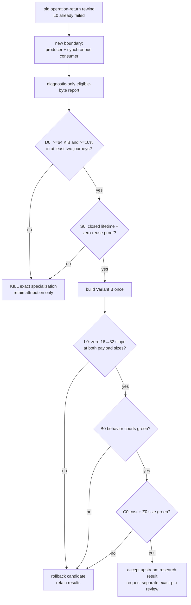

# qjswasm immediate host-argument region experiment

Status: **planned research experiment · not must-ship · not started**.

This experiment does not change the current AgenTerm `tinyvm` / `tinyvm-qjs`
pin, product capability state, budget defaults, or release scope. An accepted
result would still require a separate exact-pin review.

| field | value |
|---|---|
| date | 2026-09-05 |
| purpose | decide whether an immediately consumed `JSON.stringify(...)` result can form one safe compiler-proven temporary region around a synchronous host call |
| implementation | upstream `tinyvm` research first; AgenTerm supplies product journeys and may consume a later exact pin only after every court passes |
| pre-reading | `plan/design-qjswasm-region-lifetime-experiment.md`, `research/qjswasm-region-lifetime/RESULTS.md`, `plan/design-host-op-budget.md`, `prd/PRD_02_36_agenterm_qjswasm.md` |
| frozen engine baseline | `tinyvm` + `tinyvm-qjs` `1bf632b` |
| source discipline | one implementation with a build-time experiment switch; build A and B from the same source rather than maintaining twin prototypes |

## 0. Background and settled facts

The previous experiment is decided and is not reopened here:
`JSON.parse` and `JSON.stringify` allocate live return records after their
temporary state, leaving a zero-byte dead suffix at the operation-return
boundary in server and wake. Its L0 failed and operation-boundary rewind stays
killed.

This experiment asks a different structural question. In a call such as
`process_command(JSON.stringify(spec))`, the returned string remains live
through the synchronous `StrPtrLen` host call, but the compiler may be able to
prove that the string and its builder are dead immediately after that call.
The proposed region therefore encloses both the producer and its sole consumer;
it does not rewind inside `JSON.stringify`.

```text
immediate host-argument region
├─ mark immediately before JSON.stringify(existing binding)
├─ keep every allocation live while the synchronous host reads StrPtrLen
├─ host returns Void / I32 / F64 normally
└─ restore only after the argument's compiler-proven last use
```

Settled facts outside this experiment:

1. `runtime.rs::alloc` is a monotonic, four-byte-aligned bump allocator. The
   existing typed page ceiling and heap-exhaustion result remain authoritative.
2. `HostParam::StrPtrLen` is valid only for the duration of the host call. The
   host must not retain the pointer.
3. Existing lowering depends on newly allocated memory being zeroed; notably a
   fresh captured cell reads as `undefined` without explicit initialization.
   Reusing dirty bytes without restoring that invariant is invalid.
4. Public JavaScript behavior, object/string records, host-door ABI, typed
   errors, resource limits and deterministic cost receipts are frozen.
5. The experiment optimizes persistent-slot lifetime. Destruction of a
   one-shot slot is not region recovery evidence.

### Should this experiment exist?

All four decisive-experiment conditions are satisfied:

1. The choice is structural: monotonic lifetime versus one compiler-proven
   producer-consumer region.
2. Both positions have evidence: the prior allocation report found substantial
   JSON allocation, while the failed operation-boundary court demonstrated how
   easily a live tail defeats rewind.
3. Eligible bytes, persistent waterline slope, steps and emitted-module bytes
   distinguish the alternatives.
4. A negative result is acceptable and permanently closes this exact syntactic
   specialization unless a genuinely new variable appears.

## 1. Hard constraints

### 1.1 Exact eligible shape

Variant B may recognize only a raw declared host call satisfying every row:

- exactly one argument, declared `HostParam::StrPtrLen`;
- the argument is the direct result of `JSON.stringify(binding)` with no
  replacer or spacing argument;
- `binding` is an already-evaluated local, parameter, global or captured
  binding; its referenced object graph lies below the new mark;
- the host result is `Void`, `I32` or `F64`, never `Bytes`;
- the call is direct, synchronous and not lexically inside `try` / `catch` /
  `finally` in this first experiment;
- the expression does not assign, return, throw, store or otherwise publish
  the produced string.

Every other spelling stays byte-for-byte on Variant A lowering. In particular,
aliases of `JSON.stringify`, multiple host arguments, nested allocating
arguments and a stored intermediate are not inferred to be equivalent.

### 1.2 Lifetime and failure invariants

- Restore occurs only after a normal host return. A stringify exception, host
  trap, cancellation, budget failure or unwind path keeps the monotonic
  waterline and preserves every diagnostic/exception object.
- The input binding and its full graph survive unchanged. Global or captured
  input identity is not evidence that the temporary output escaped.
- No live local, global, cell, environment, closure, completion value, pending
  return/throw, host result or object/array slot may point into the restored
  interval.
- Reused storage is zero before the next allocation is published. The region
  implementation must not introduce a new possible trap after a side-effecting
  host call. A permitted minimal design keeps a high-water value, restores only
  the current bump pointer, and zeroes the reused subrange during a later
  allocation before returning its address.
- The heap mark must be at or above the literal-pool heap start and at or below
  the current bump pointer. A failed guard is a loud VM invariant failure, not
  a best-effort restore.
- Ordinary modules with no eligible site remain byte-identical to the baseline.
  Diagnostic compilation remains opt-in.

### 1.3 Disease detector

Any urge to add tracing GC, reference counts, a general arena API, a public
region primitive, an unrestricted escape-analysis pass, a new tinyvm runtime
instruction, or a second recovery family to rescue the numbers is the disease
this experiment detects. Record the need and kill this bounded experiment.
Plumbing the already-standard and already-supported Wasm `memory.fill` through
the qjs emitter is allowed only if Variant B needs it for zero-on-reuse; it does
not authorize a new VM primitive.

## 2. Minimal experiment content

| dimension | selected content | why |
|---|---|---|
| Variant A | exact `1bf632b` monotonic bump behavior | current truth and control |
| Variant B | the one exact shape in §1.1, with mark, normal-return restore and zero-on-reuse | tests the smallest boundary that encloses the formerly live tail |
| Attribution phase | diagnostic-only per-site allocated-byte totals, no rewind | answers D0 before implementation cost can create sunk-cost pressure |
| Synthetic payload sizes | 1 KiB and 64 KiB JSON string fields | separates fixed cost from byte slope and crosses a Wasm page boundary |
| Persistent call counts | 1, 16 and 32 calls after one warm-up | exposes linear accumulation rather than a one-shot intercept |
| Product workloads | server, wake and workbench tasks | existing real consumers with frozen public evidence |
| Target for structural comparison | macOS aarch64 for both variants | fixes OS and ISA; the experiment concerns compiler/runtime structure, not six-cell delivery |

The synthetic program holds its input object persistently below the mark and
repeatedly executes one direct sink call equivalent to
`sink(JSON.stringify(payload))`. The sink records only byte length and digest;
it never retains the guest pointer.

## 3. Precommitted criteria and measurement discipline

| id | nature | criterion |
|---|---|---|
| D0 | Boolean / attribution | Before Variant B exists, diagnostic lowering identifies at least 64 KiB and at least 10% of run allocation as eligible at this exact boundary in at least two of server/wake/workbench. Otherwise stop. |
| S0 | Boolean / safety | Every positive and negative case in §3.1 is classified correctly; zero-on-reuse, normal return, throw, trap, cancellation and budget cases preserve exact values and typed failures. One false-positive recovery kills the experiment. |
| L0 | Slope / primary | For both 1 KiB and 64 KiB payloads, after warm-up Variant B has `waterline(32) - waterline(16) == 0` and `pages(32) == pages(1)`. A smaller one-call intercept with a non-zero repeated-call slope loses. |
| B0 | Behavior | Server/wake/workbench preserve exact STEP/EVIDENCE/PASS counts, public output fields, typed failure classes and owned-resource cleanup under unchanged budgets. |
| C0 | Cost | No real journey regresses steps by more than 3%; host operations and host bytes are exactly unchanged. Wall time is reported but is not a deterministic gate. |
| Z0 | Size | A module with zero eligible sites is byte-identical. Across generated modules containing 1 and 32 otherwise-identical eligible sites, marginal growth is at most 48 B/site; each real-journey module grows at most 2,048 B. The downstream stripped delivery artifact grows at most 16 KiB and remains inside its existing product budget. |

D0 and S0 are gates. L0 is the structural primary criterion. B0 follows
safety, then C0 and Z0 decide whether a structurally successful result is worth
shipping.

### 3.1 Mandatory alias, state and exception court

| class | required case | expected classification/result |
|---|---|---|
| positive local | `sink(JSON.stringify(local_object))` | eligible; input survives |
| positive global | same with a global input binding | eligible; identity/content survives |
| positive captured input | same inside a function reading a captured input | eligible; captured cell and object survive |
| local alias | store stringify output in `s`, pass `s`, then read `s` | ineligible; baseline bytes |
| global publication | assign output to a global before/after the call | ineligible |
| object/array publication | store output in a property or array element | ineligible |
| closure escape | capture output in a returned or persistent closure | ineligible |
| return/throw | return or throw the output directly or nested in a graph | ineligible |
| indirect stringify | `const f = JSON.stringify; sink(f(o))` | ineligible |
| multiple arguments | candidate is one of two or more host arguments | ineligible |
| returned bytes | host result is `HostResult::Bytes` | ineligible |
| lexical unwind | candidate spelling appears under try/catch/finally | ineligible in this experiment |
| stringify exception | cyclic graph is caught and its named error observed | no restore; subsequent call remains correct |
| host failure | trap/cancel/budget failure after argument construction | no restore; same typed result and failed cost |
| reused captured cell | a later allocation creates an uninitialized captured cell in reused bytes | reads `undefined`, proving dirty data did not revive |
| persistent unrelated state | globals, closures and objects allocated below the mark are read after 32 calls | exact identity/value preserved |

### 3.2 One ruler and reproducible records

Every numeric row in `RESULTS.md` records:

- exact AgenTerm and tinyvm revisions, dirty state and source-tree digest;
- compiler/toolchain, build flags, target/ISA and whether the artifact executed;
- budgets, input bytes, call count, waterline, pages, steps, host ops/bytes and
  output digest;
- A/B module SHA-256 and the exact command that produced it.

Size uses three separately labelled boundaries; no cross-boundary ratio:

1. **L1 mechanism code:** candidate-gated mark/restore/reuse mechanism in the
   Wasm code section, measured by one fixed section parser.
2. **L2 mechanism plus generated seam:** whole raw generated `.wasm`, measured
   with `wc -c`, at zero/one/32 eligible sites.
3. **L3 delivery footprint:** whole stripped downstream executable, measured
   with `wc -c` under one release profile and target.

The 1- and 32-site modules cover the same capability set. The 32-site result is
the required slope point, not a second hand-written implementation. A control
run must remeasure Variant A with the same reporter before any A/B ratio is
published.

## 4. Decision tree, kill criterion and time box



Kill criteria:

- D0 fails, any S0 false-positive occurs, dirty memory can become observable,
  or restore can add a failure after a side-effecting host call;
- satisfying the proof requires any disease-detector item from §1.3;
- L0 has any positive 16-to-32 slope at either payload size;
- B0, C0 or Z0 misses its frozen threshold.

Time box is evidence-based, not calendar-based:

1. Phase D ends as soon as the three product workloads have one eligible-byte
   table and D0 has a Boolean answer. No rewind code is written before it.
2. If D0 passes, implementation ends after the single §1.1 shape completes the
   mandatory safety table and both payloads have 1/16/32 results.
3. Integration ends after one A/B execution of server, wake and workbench plus
   the Z0 size report. Do not add another eligible expression, host signature
   or recovery family inside this experiment.

Every criterion is represented in the tree: D0, S0, structural L0, behavior
B0, then C0/Z0. All pass/fail combinations exit through kill, rollback or an
explicit request for later pin review.

## 5. Evidence layout and rerun commands

Proposed implementation/evidence layout:

```text
research/qjswasm-immediate-host-argument-region/
├─ README.md
├─ attribution.json
├─ measurements.json
└─ RESULTS.md
```

Commands are run from the named repository root. The future test/reporter must
create the JSON and module files itself so these commands remain exact:

```bash
# upstream tinyvm repository
cargo test -p tinyvm-qjs --test immediate_host_argument_region -- --nocapture
cargo test -p tinyvm-qjs --test allocation_probe -- --nocapture
cargo test -p tinyvm-qjs

# AgenTerm repository after a research-only exact pin is prepared
cargo test -p agenterm-qjswasm --test immediate_host_argument_region -- --nocapture
AGENTERM_QJS_ALLOCATION_PROBE=1 ./target/debug/agenterm cli script task run server-smoke --manifest agenterm.tasks.json
AGENTERM_QJS_ALLOCATION_PROBE=1 ./target/debug/agenterm cli script task run wake-smoke --manifest agenterm.tasks.json
AGENTERM_QJS_ALLOCATION_PROBE=1 ./target/debug/agenterm cli script task run workbench-smoke --manifest agenterm.tasks.json

# size and identity report produced by the owning test/reporter
wc -c research/qjswasm-immediate-host-argument-region/modules/*.wasm
shasum -a 256 research/qjswasm-immediate-host-argument-region/modules/*.wasm
```

The owning reporter must print and persist the command line, source revisions,
budgets and all D0/S0/L0/B0/C0/Z0 fields; prose copied from terminal output is
not evidence.

## 6. Excluded choices

| choice | reason excluded |
|---|---|
| retry operation-return rewind | already killed by a zero-byte safe suffix |
| reset the heap after each top-level call | destroys persistent slot state |
| tracing GC or reference counting | different architecture and unbounded scope |
| general escape/liveness analysis | not needed to decide the exact immediate-consumer shape |
| reclaim a stored temporary | aliases require a different experiment |
| handle multiple arguments | evaluation order and later allocations widen the proof |
| reclaim a `Bytes` host result | that returned string is live after the host call |
| raise step/page limits | hides cost or growth rather than deciding it |
| skip zero-on-reuse | violates an existing runtime invariant |

## 7. Not answered here

- Whether compiler-proven regions work for `JSON.parse`, stored temporaries,
  several statements, loops, or general last-use analysis.
- General JavaScript garbage collection or Wasm GC.
- Whether the same optimization is profitable on every OS/ISA; six-cell
  qualification belongs after an accepted exact pin.
- Wasmtime-class compatibility or throughput.
- A product release/version decision.

## 8. Result placeholder

Status: **not run**.

When complete, replace this placeholder with:

1. the decision-tree trace beginning at D0 and naming the first failed or final
   passed criterion;
2. one A/B table containing both payload sizes, 1/16/32 slopes, all three
   product journeys and the three size boundaries;
3. the complete S0 positive/negative classification table;
4. every deviation from this specification, including skipped platforms,
   changed order or instrumentation that affected allocation order;
5. the honesty statement: measurements were not changed after results were
   observed, and both interpretations are recorded if the evidence is
   ambiguous;
6. the exact commands, hashes and independent control value in `RESULTS.md`;
7. any result that overturned the expected direction, called out separately.

Until §8 is filled and `RESULTS.md` exists, this experiment is **planned**, not
decided, and none of its expected benefits may be quoted as product fact.
