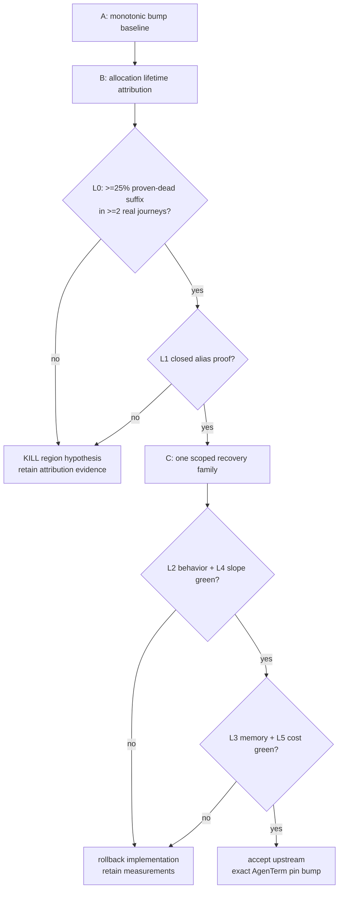

# qjswasm temporary-region lifetime experiment

Status: **precommitted · attribution probe landed · real-journey attribution next · no allocator change yet**.

| field | value |
|---|---|
| date | 2026-09-04 |
| purpose | decide whether scoped recovery of proven-dead JSON/host-reply temporaries can stop persistent-slot heap high-water growth without adding a tracing collector |
| implementation | upstream `tinyvm` research first; AgenTerm only bumps one exact pin after all courts pass |
| pre-reading | `prd/PRD_02_36_agenterm_qjswasm.md`, `plan/design-host-op-budget.md`, `crates/agenterm-qjswasm/README.md` |
| frozen baseline | tinyvm + tinyvm-qjs `af47e4d`; server/wake/workbench observed at 32/43/22 heap pages |
| attribution revision | tinyvm + tinyvm-qjs `78442d9`; opt-in read-only waterline export, ordinary compile unchanged |

## 0. Settled facts

```text
persistent qjswasm slot
├─ live graph: globals · closures · returned values · exceptions
├─ transient graph: parser/stringifier builders · host-reply projection
├─ current allocator: monotonic bump; no free or collector
└─ question: is there a provably dead suffix worth recovering?
```

1. The current bump allocator and typed `max_memory_pages` failure remain the
   truth baseline. Exhausted slots do not silently heal.
2. Removing intermediate JSON/string buffers already reduced real journeys by
   10–17 pages, then large-integer formatting removed another three pages.
   Allocation lifetime is therefore plausible but not yet proven.
3. This experiment does not promise general garbage collection. It asks only
   whether named internal operations have a safe recoverable suffix.
4. String records, object layout, public JS semantics, host-door ABI and budget
   defaults are frozen. The rejected string-metadata experiments stay rejected.
5. The first probe court separated lazy live state from dead growth: JSON's
   first call retained a 52-byte namespace object; after warm-up, a no-binding
   primitive-result parse added a stable 256 dead bytes per call. This proves
   the ruler, not L0 for the three product journeys.
6. AgenTerm's engine now has an explicit diagnostic compile +
   `Engine::allocation_waterline` path. Ordinary qjs and hand-written Wasm
   answer `None`; only an opt-in module can expose bytes. The remaining Phase B
   work is to drive the three product journeys and write their attribution
   table, not to add another allocator mechanism.

## 1. Hard constraints

- Phase A instruments allocation site, byte count, high-water and last-use
  class without changing allocation order, representation or public output.
- A recovery point is admissible only if no returned value, global, closure,
  exception, host result or persistent object can reference the reclaimed
  interval. One unclassified alias rejects that point.
- Typed heap exhaustion, failed cost, deterministic step receipts and surviving
  objects across repeated calls remain byte/field compatible.
- The same exact source and budgets run server, wake, workbench and a persistent
  multi-call court. No raised page/step limit may manufacture a pass.
- **Disease detector:** an urge to add tracing, reference counts, handles, a new
  object representation or a general arena API merely to save the hypothesis
  is evidence against this bounded experiment; record it and stop.

## 2. Minimal variants

| variant | content | purpose |
|---|---|---|
| A | current monotonic bump | behavior and high-water baseline |
| B | attribution-only counters/events | identify allocation site, lifetime class and candidate rewind suffix without changing semantics |
| C | one scoped mark/rewind implementation for the single best proven operation family | test the bounded hypothesis; no second recovery family in this time box |

Candidate operation families are JSON parse, JSON stringify and host-reply
projection. B ranks them by reclaimable bytes in real journeys; C implements
only the highest-ranked family that passes the alias proof.

## 3. Precommitted criteria

| id | nature | criterion |
|---|---|---|
| L0 | Boolean / attribution | B identifies a provably dead suffix worth at least 25% of peak allocated bytes in at least two of server/wake/workbench; otherwise kill before C |
| L1 | Safety | every C recovery point has a closed alias/lifetime proof and all persistent-value, closure, global, exception and repeated-call courts pass |
| L2 | Behavior | server/wake/workbench preserve exact STEP/EVIDENCE counts, typed failures, output fields and cleanup |
| L3 | high-water | server and wake heap pages each fall at least 20%; workbench does not increase |
| L4 | slope | after warm-up, 16 identical persistent-slot calls add at most one page; report 1/16/32-call points |
| L5 | cost | steps regress no more than 3% in any real journey; generated Wasm grows at most 2,048 bytes; host ops/bytes remain unchanged |

L0 and L1 precede every performance claim. L4 is the structural primary
criterion: a smaller one-shot intercept with linear persistent growth loses.

## 4. Decision tree, kill criterion and time box



- Time box A/B ends when the four workloads have an allocation-lifetime table
  and L0 has one unambiguous answer.
- If L0 passes, C ends after the first complete 1/16/32 slope and three-journey
  run. Do not add a second operation family to rescue a miss.
- Every L0–L5 criterion appears in the tree: L0 then safety L1, structural L2/L4,
  then intercept/cost L3/L5. Every branch exits through kill, rollback or accept.

## 5. Evidence layout

```text
research/qjswasm-region-lifetime/
├─ README.md
├─ allocation-report.json
└─ RESULTS.md
```

Each number records source revision, workload, budgets, steps, host ops/bytes,
heap pages, allocation bytes by site/lifetime and execution state. Upstream
commands and exact AgenTerm pin are required in `RESULTS.md`.

## 6. Excluded choices

| choice | reason |
|---|---|
| tracing GC or reference counting | different architecture and unbounded scope |
| reset the whole heap after each call | destroys persistent globals/closures/objects |
| raise memory pages | hides rather than fixes persistent growth |
| reclaim from host guesses | only the guest/runtime owns pointer liveness |
| change string/object records | repeats already rejected metadata experiments |

## 7. Not answered here

- General Wasm GC proposals or a JavaScript tracing collector.
- Wasmtime-wide throughput parity; this experiment advances the small,
  deterministic automation workload rung only.
- ACU's independent 2 MiB executable-budget decision.

## 8. Result

Not measured. No allocator or pin change is authorized until Phase B produces
the frozen lifetime table and L0 verdict.
