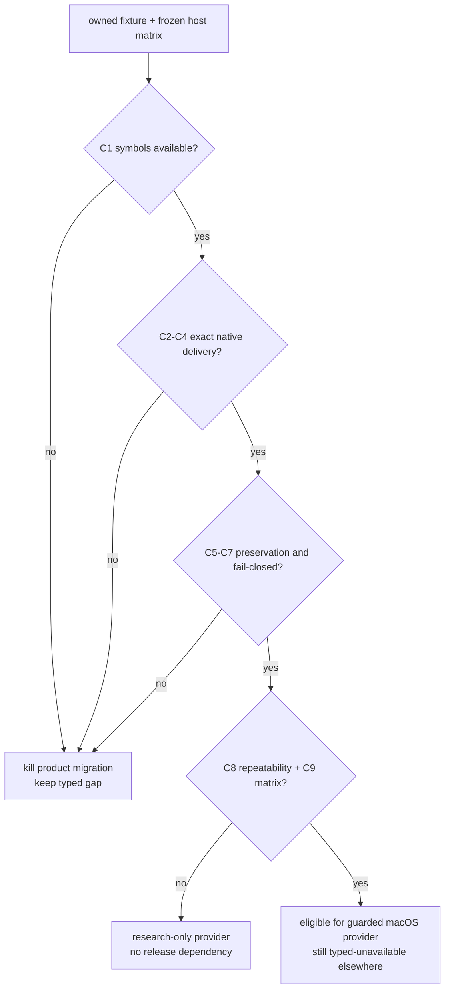
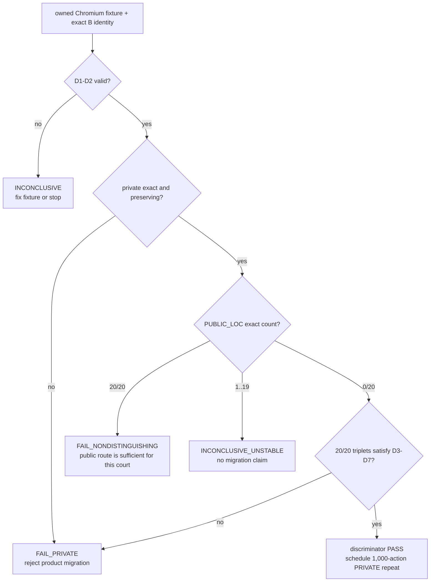
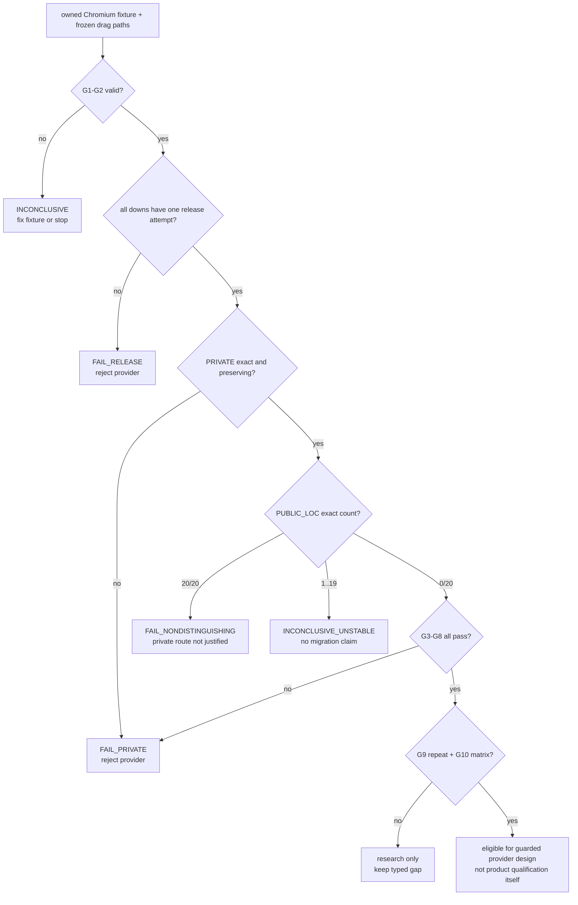

# SkyLight window-local pointer delivery experiment

Status: **MEASURED PARTIAL · research only · not a product provider**

Date: 2026-09-07
Purpose: decide whether the private macOS SkyLight route already explored by
MCU can become a bounded, fail-closed AgenTerm provider for window-local hover
and wheel delivery without moving the physical pointer or changing foreground
ownership.
Implementation home: `research/skylight-window-local-pointer/`
Parent: [`goal-acu-replaces-mcu.md`](goal-acu-replaces-mcu.md)

## 0. Frozen facts and question

```text
ACU retirement gap 095: move --to <window>
├── public CoreGraphics posting to a PID
│   └── historical claim: event reaches the process but has no AppKit window
│       current owned AppKit fixture did not reproduce that claim
├── global CoreGraphics posting
│   └── works only by moving the user's real pointer; not equivalent
└── MCU research provider: runtime-resolved private SkyLight symbols
    ├── symbol absence fails closed
    ├── foreground/pointer preservation is reported
    └── end-to-end delivery is not yet independently verified
```

Question: **on each supported macOS generation and ISA, can a runtime-resolved
SkyLight provider deliver hover and bounded wheel events to one exact live
window while the physical pointer, focused window and foreground application
remain unchanged, and can it fail closed before injection whenever identity,
symbols or verification are unavailable?**

This experiment does not block the separate public desktop-scoped wheel verb.

## 1. Hard constraints

- Resolve every private symbol at runtime. Missing or incompatible symbols are
  a typed `provider_unavailable` result before any event is posted.
- Bind every action to an exact live window handle plus owner process identity;
  a title, application name or PID alone is insufficient authority.
- Never fall back to a global event, foreground activation, cursor movement,
  coordinate click or AppleScript.
- Sample physical pointer position, focused window and foreground application
  before and after every candidate action.
- `performed` and `verified` are distinct. Symbol invocation alone cannot prove
  delivery.
- Use an owned fixture only. Do not inject into a user's real application.
- The research probe must not add private-framework linkage to release builds.
- A single-host success is evidence for that host only, not a compatibility
  promise.

## 2. Minimal experiment

| Dimension | Frozen choice | Why |
|---|---|---|
| Baseline | public PID-targeted CoreGraphics event | tests whether the historical no-window failure remains observable |
| Candidate | MCU-shaped runtime `dlopen`/`dlsym` SkyLight provider, independently re-integrated under `research/` | tests the only known window-local candidate without importing it into product code |
| Target | owned two-window fixture with event counters and monotonic sequence numbers | proves exact-window delivery and rejects process-wide ambiguity |
| Hover action | move inside target A, then target B | proves window identity rather than mere process delivery |
| Wheel action | bounded vertical and horizontal deltas | covers ACU gaps 095 and 074 without conflating them |
| Controls | unrelated owned window, physical pointer, foreground app and focused window | detects unintended global effects |
| Negative paths | stale handle, wrong owner identity, missing symbol fixture, closed target | proves pre-effect fail-closed behavior |
| Matrix | current and previous supported macOS generations on arm64; Intel/Rosetta only records loader compatibility, never native-kernel equivalence | private ABI risk is version-sensitive |

Fixture evidence must carry the target window identity, event kind, delta or
position, monotonic event sequence, native timestamp and the independently
sampled before/after host state.

## 3. Precommitted criteria

| ID | Criterion | Nature | Pass condition |
|---|---|---|---|
| C1 | Runtime availability | Boolean | every required symbol resolves on each claimed host; absence is typed before injection |
| C2 | Exact target delivery | Safety | only the addressed fixture window advances its event sequence |
| C3 | Real hover semantics | Behavioral | target receives a native move/hover event at the requested window-local point |
| C4 | Real wheel semantics | Behavioral | target receives vertical and horizontal wheel deltas with bounded sign and magnitude |
| C5 | Pointer preservation | Safety | physical pointer coordinates are byte-for-byte equal before and after |
| C6 | Foreground preservation | Safety | focused window and foreground application identities are unchanged |
| C7 | Stale/ambiguous refusal | Safety | stale handle, owner drift and ambiguous mapping reach zero injection attempts |
| C8 | Repeatability | Reliability | 1,000 alternating two-window actions have zero misdelivery, zero lost verification and zero host-state drift |
| C9 | Compatibility boundary | Delivery | every supported macOS generation has its own result; an untested generation remains `provider_unavailable` |

No criterion may be satisfied by `ok: true`, a returned provider name, or an
unchanged screenshot alone.

## 4. Decision tree, kill criterion and time box



Kill criterion: the first need for a global-event fallback, real-pointer move,
foreground activation, PID/title-only addressing, compile-time private linkage,
or an unverified effect immediately rejects product migration. Any crash,
misdelivery or host-state drift in the 1,000-action run also rejects it.

Time box: one owned fixture, one arm64 host on the current macOS generation and
one previous-generation court. If either cannot pass C1-C7 within two focused
implementation days, stop. Run C8 and expand C9 only after C1-C7 pass.

## 5. Result layout

```text
research/skylight-window-local-pointer/
├── README.md
├── RESULTS.md
├── fixture/
└── probe/
```

`RESULTS.md` records source SHA, OS build, architecture, resolved symbol set,
all C1-C9 outcomes, event counters, host-state comparisons and the resulting
verdict. It contains no host absolute paths or user application data.

## 6. Excluded alternatives

| Alternative | Reason excluded |
|---|---|
| Global `CGEventPost` | changes the user's real pointer/foreground target; not window-local |
| PID-targeted `CGEventPostToPid` alone | current AppKit fixture receives it, so a discriminating Chromium/Electron fixture must decide whether any product gap remains |
| Accessibility `AXScrollToVisible` | semantic reveal, not bounded wheel input |
| AppleScript or UI scripting | different mechanism and authority surface |
| Coordinate click or focus-before-send | violates background and pointer-preservation invariants |
| Treat MCU's provider receipt as proof | its delivery field is explicitly unverified |

## 7. Not answered

- public desktop-scoped wheel delivery on macOS, Windows or X11;
- Windows UI Automation or window-message local scroll/hover;
- Linux X11 local delivery or Wayland compositor protocols;
- App Store review or notarization policy for a private runtime-resolved API;
- whether a future public macOS API replaces this provider.

## 8. Result backfill · 2026-09-08

```text
current macOS arm64
├─ C1–C7: PASS
├─ C8: PASS · 1,000 alternating two-window actions · repeated twice
├─ C9: INCOMPLETE · no previous-generation arm64 or native Intel result
└─ discriminating baseline: FAIL
   └─ public PID-targeted posting also reached the owned AppKit fixture
```

Decision trace: the candidate reached the `C8 repeatability + C9 matrix?` node.
C8 passed, but C9 remains open; the decision tree therefore ends at
**research-only provider / no release dependency**. More importantly, the
owned AppKit baseline did not reproduce the premise that public PID-targeted
events lack window semantics. This is an honest negative result: the run proves
the private route can be exact on the measured host, not that the route is
needed or should enter product code.

Full criteria, exact source identity, host build, source digest and reproduction
command live in `research/skylight-window-local-pointer/RESULTS.md`. Revisit only
after an owned Chromium/Electron fixture distinguishes the public and private
routes and a previous-generation arm64 court supplies C9. Until then ACU gaps
074 and 095 remain typed TODOs; no private provider, durable receipt or release
linkage is authorized.

## 9. Precommitted discriminating extension · Chromium wheel delivery

The AppKit run answered whether the private route can work on one host, but it
did not answer whether ACU needs that route. The next run therefore changes
only the owned fixture and oracle. It does not widen the candidate provider or
the supported-host claim.

Attempt 1 used `browser-session-start --bridge` as the fixture owner. The owned
browser and CDP endpoint reached ready, but the caller-selected Google Chrome
build published no bridge connection before the 15-second deadline. The run
ended `INCONCLUSIVE` with zero injection attempts and verified session cleanup.
Attempt 2 revises only fixture ownership as described below; all discriminator
criteria and kill conditions remain frozen and every count restarts at zero.
Attempt 2 also ended `INCONCLUSIVE` with zero injection attempts: the direct
profile started, but its preselected fixed CDP port never answered. A bounded
diagnostic proved that the same Chrome build immediately publishes
`DevToolsActivePort` when asked to select its own port. Attempt 3 changes only
that readiness mechanism to port zero plus an exact-profile record read; the
discriminator remains unchanged.
Attempt 3 reached the record and listening browser but the readiness curl was
routed through the host HTTP proxy and received its 503 response. It also
ended before injection. Attempt 4 explicitly bypasses proxies for this
loopback-only readiness check, retries a partially written record, and requires
the `/json/version` WebSocket path to equal the exact profile record.
Attempt 4 then passed the frozen current-host discriminator: PRIVATE was exact
20/20, PUBLIC_LOC exact 0/20, PUBLIC_OFF target delivery 0/20, peer delivery
zero, host state unchanged after all 60 attempts, and cleanup verified. This
unlocks only the separately measured 1,000-action PRIVATE repeat below.

### 9.1 Frozen setup

- Reuse the direct disposable-profile pattern from
  `scripts/qjs/cu-linux-page-scroll-smoke.qjs`, adapted to the caller-selected
  macOS Chromium executable. Start one exact child with a fresh `--user-data-dir`,
  a Chromium-selected loopback CDP port (`--remote-debugging-port=0`), require
  the bounded `DevToolsActivePort` record from that exact profile, and open
  target window B; then ask that same profile singleton to open peer window A.
  Never attach to a user profile or an already-running browser.
- Create two normal browser windows in one owned profile. Require each window
  to settle at a distinct, stable read-back rectangle and give each page an
  independent `wheel` counter,
  last delta, last client coordinate and monotonic sequence. Register the
  listener as non-passive and call `preventDefault()` so page scrolling cannot
  become the oracle.
- Keep a separate owned non-browser guard application in front. Open target
  window B first, then peer window A so A becomes the browser process's key
  window, and only then let the guard take foreground ownership. B remains
  non-key and is the only addressed
  target. Neither browser window may become foreground during the comparison.
  This prevents a process-level key-window fallback from counting as exact
  delivery.
- Resolve B to exactly one on-screen layer-zero `CGWindowID` by browser owner
  PID, a short per-window nonce title and its independently read-back rectangle.
  The title is candidate discovery, never final authority: after discovering
  both native handles, place them at distinct non-overlapping rectangles with
  exact native read-back and revalidate each CDP title-to-window binding. Zero
  or multiple matches are `window_identity_ambiguous` before injection.
  Preserve each CDP target id, `CGWindowID`, owner PID and rectangle in the
  result.
- Run three arms. `PRIVATE` stamps B and posts through SkyLight at B's midpoint.
  `PUBLIC_LOC` uses `CGEventPostToPid` with the same public event fields and
  screen location. `PUBLIC_OFF` uses the public route with the same delta but a
  point outside B; it detects key-window or process fallback independently of
  location hit-testing. Freshly create the event for every arm.
- Randomize the three-arm order from a recorded seed and reset both page
  counters before each arm. Run 20 triplets before any repeatability expansion.
- Read delivery only through the addressed page's counter and independently
  read the peer page, physical pointer, foreground PID and foreground window
  before and after every arm. A provider return value is never delivery proof.

The experiment may reuse product lifecycle and read-only CDP/bridge mechanisms
to own the fixture and read counters. The candidate injection remains under
`research/skylight-window-local-pointer/`; no private symbol enters a product
binary.

### 9.2 Discriminator and criteria

The Boolean discriminator is evaluated per triplet:

```text
private_exact = B advances once with the requested delta and A stays unchanged
public_loc_exact = PUBLIC_LOC advances B once and A stays unchanged
public_off_target = PUBLIC_OFF advances B despite its point being outside B
discriminates = private_exact && !public_loc_exact
```

Before any arm ran, the executable PASS guard was made explicit: D5 means
`public_off_target` must also be false in every triplet. Any PUBLIC_OFF target
delivery is diagnostic instability, never PASS. This does not change the
precommitted D5 text below; it closes an implementation omission found while
attempts 1-3 still had zero injection attempts.

| ID | Criterion | Nature | Pass condition |
|---|---|---|---|
| D1 | Owned fixture identity | Safety | the exact profile, browser process, native B window and page oracle are unique before both arms |
| D2 | Equivalent inputs | Validity | PRIVATE and PUBLIC_LOC differ only by route-specific window stamping/posting; PUBLIC_OFF differs only by its recorded control location |
| D3 | Private exact delivery | Behavioral | every private arm advances B exactly once with the requested delta and never advances A |
| D4 | Public location non-equivalence | Discriminator | no PUBLIC_LOC arm produces `public_loc_exact`; delivery to A or no delivery is recorded separately |
| D5 | Public fallback classification | Diagnostic | every PUBLIC_OFF arm is classified as target fallback, peer fallback or no delivery; it cannot satisfy exact delivery |
| D6 | Host-state preservation | Safety | pointer, foreground PID and foreground window are unchanged after every arm |
| D7 | Stable comparison | Reliability | all 20 triplets agree with `discriminates=true`; no private loss, double delivery or ambiguous mapping occurs |
| D8 | Cleanup | Safety | both browser windows, the owned profile and the guard are removed or stopped and independently observed absent |

`PASS` requires D1–D8, including 20/20 private exact deliveries and 0/20
PUBLIC_LOC exact deliveries. `FAIL_NONDISTINGUISHING` requires both PRIVATE and
PUBLIC_LOC to deliver exactly to B in all 20 triplets while PUBLIC_OFF never
does; the public route is sufficient for this court and the private route is
retired. A PUBLIC_LOC result between 1/20 and 19/20 is
`INCONCLUSIVE_UNSTABLE`, not evidence for private migration. `FAIL_PRIVATE`
means the private route misses, misdelivers or changes host state. Missing
browser, missing symbols, identity ambiguity or an unavailable independent
oracle is `INCONCLUSIVE`, never a pass.

### 9.3 Decision and sequencing



Kill criterion: any private misdelivery, focus/pointer drift, identity ambiguity
after an injection attempt, need to activate the browser, or disagreement
between two complete 20-triplet runs ends the product-migration case. Do not
tune private event fields after observing either public arm. Time box the
fixture and two complete current-host runs to one focused implementation day.
If D1–D2 cannot be made deterministic in that box, record `INCONCLUSIVE` and
stop.

C9 is deliberately downstream. A previous-generation arm64 host is not spent
on this experiment unless D1–D8 first pass on the current host and a subsequent
1,000-action Chromium PRIVATE repeat has zero loss, misdelivery or host-state
drift. Only then rerun the unchanged source digest and seed protocol on the
previous supported macOS generation; any source or criterion change resets
both host results.

The repeat is a separate result, not a rerun that can rewrite the discriminator
counts. It must keep the attempt-4 event fields and exact target identity,
reset and independently read both DOM oracles for every PRIVATE action, and
compare the exact physical pointer plus foreground PID/window before and after
each action. `PASS` is exactly 1,000/1,000 single target deliveries, zero peer
deliveries and zero host-state drift. Any loss, double delivery, peer delivery,
identity change or host-state change is `FAIL_PRIVATE`; dependency, oracle or
cleanup loss is `INCONCLUSIVE`. Stop on the first behavioral failure and retain
its bounded diagnostic. The repeat may summarize green actions in blocks of
100, but must never omit a failing action's index and readback.

The first full repeat attempt exposed an execution-budget defect before it
could emit a verdict: one qjswasm top-level call exhausted the hard one-billion
step ceiling. Raising that ceiling is not available and would weaken the
runtime bound. The corrected, pre-run execution protocol keeps one parent-owned
Chromium profile, browser process, A/B window identity, guard and cleanup scope,
but delegates consecutive blocks of 50 actions to fresh qjswasm top-level
calls. A block may reset only the script step budget; it receives the frozen
identities and may not recreate, activate, move or re-resolve the fixture.
Every block applies the same per-action reset/inject/quiet/read-back checks,
reports its exact global start/end indices, and stops on its first behavioral
failure. The parent accepts `PASS` only when the contiguous block reports cover
1 through 1,000 exactly, their exact counts sum to 1,000, every failure count is
zero, and final cleanup is independently verified. A missing, duplicated,
malformed, timed-out or budget-exhausted block makes the whole run
`INCONCLUSIVE`. This changes only execution isolation; criteria, event fields,
target identity and the kill criterion remain frozen.

The corrected run from repository SHA `ee478c2a` and repeat digest
`c27769903ba69056ab171ff7297a69f4fa981a821a5af3b1e81c8e9a8e066e3e`
passed 1,000/1,000 actions in 20 contiguous blocks with zero loss,
misdelivery, duplicate delivery or host drift and with cleanup verified before
the verdict. The current-host repeat gate is therefore complete. C9 remains
the next required decision node; no product provider or release dependency is
authorized by this result alone.

### 9.4 Explicitly not answered

- whether PID-targeted public delivery is documented or future-stable;
- whether an Electron build behaves differently from the owned Chromium build;
- hover gap 095 (the first discriminator is wheel-only for gap 074);
- policy acceptance of private APIs, even if the discriminator passes;
- product rollout, durable receipts or platform qualification.

## 10. Precommitted drag extension · held-button exact-window delivery

The wheel discriminator does not answer `acu.dynamic.004`. A drag is a
stateful event sequence: once a button-down is posted, every exit path owns a
matching button-up obligation. Exact delivery of one stateless wheel event
cannot prove held-button routing, move ordering, capture behavior or release
cleanup. This extension therefore receives its own verdict and cannot borrow
the wheel counts.

This remains research only. A pass does not add a product provider, change the
capability ledger, remove the compatibility TODO or register public evidence.
Product work remains gated by the previous-generation compatibility boundary
in C9 as well as this drag-specific result.

The extension goes directly to the owned Chromium discriminator. Repeating the
AppKit fixture would not decide adoption: its public PID route already delivered
the simpler pointer events, while Chromium distinguished the private wheel
route and supplies an independent business-effect oracle for a drag.

### 10.1 Frozen setup and event sequence

- Reuse the owned two-window Chromium profile, exact `CGWindowID` plus owner
  PID binding, background target B, peer A and separate foreground guard from
  section 9. The runtime symbol set and OS-build/architecture allowlist remain
  pinned exactly as in the measured wheel injector; any other host returns
  `provider_unavailable` before injection. No user profile or user window is
  eligible.
- Extend the owned page oracle with capture listeners for `mousedown`,
  `mousemove`, `mouseup` and `click`. Each record carries one monotonic
  sequence, `button`, `buttons` and client coordinates under a trial nonce
  stored by the reset call. Reset and read target and peer independently over
  the frozen CDP identity.
- Freeze a left-button gesture of one down, twenty bounded dragged moves and
  one up. Create and stamp every event before posting the down. The first and
  last points come from a zero-injection viewport calibration. CDP supplies
  `screenX`, `screenY`, outer/inner dimensions and `devicePixelRatio`; the page
  supplies one known element's `getBoundingClientRect`. The derived screen to
  client transform must agree with the exact CGWindow and AX bounds within one
  CSS pixel or the run is `INCONCLUSIVE` before any down. One trajectory
  remains inside B. A second starts inside B and ends outside B without entering
  A or the guard, proving that the addressed window retains the held-button
  sequence through the release.
- A delivered gesture is exactly one down, one or more held moves and exactly
  one up in that order. Every observed move has `buttons == 1`; down has
  `button == 0 && buttons == 1`; up has `button == 0 && buttons == 0`. The
  final held move and up must reach the requested endpoint within one CSS
  pixel. Chromium may coalesce intermediate moves, so the DOM oracle does not
  require twenty callbacks; the injector receipt still requires twenty move
  post attempts. For the inside trajectory, zero or one `click` is valid. If
  present, it must follow the up and target the nearest common ancestor of the
  down and up targets inside B. The inside-to-outside trajectory must produce
  no click in B. A click before up, more than one click or any click in A is a
  failure.
- Sample the physical pointer, foreground PID/window, target application's
  main/key window and its AX-focused window or element after the down, after
  every move and after the up, not merely before and after the whole gesture.
  Independently bracket the gesture with both pages' `document.hasFocus()`
  values. Any change is host drift. Synthetic focus, raise and activation are
  forbidden. Preserve the archived six-millisecond move cadence; record every
  post-to-sample interval and require it to remain at most 50 milliseconds so
  observation cannot silently turn the gesture into an unbounded slow path.
- Run `PRIVATE`, `PUBLIC_LOC` and `PUBLIC_OFF` arms from freshly reset oracles.
  `PUBLIC_LOC` uses the identical down/move/up events and screen path through
  PID-targeted public posting. `PUBLIC_OFF` translates the whole path outside
  B and A and detects process-key-window fallback. Randomize arm order from a
  recorded seed; never tune event fields after observing an arm.

After a down post attempt, the injector must attempt exactly one up to the same
frozen PID, `CGWindowID` and final local point on every in-process success or
failure path. Identity or host drift discovered mid-gesture stops further
moves but does not cancel that release attempt. The parent court also owns one
independent release-only invocation for an injector crash, timeout or missing
receipt: it sends only an up to the same frozen identity and endpoint, and runs
at most once when the primary receipt does not prove an up attempt. Recovery
cannot turn that trial green because whether the first process posted an up is
unknown. A missing or uncertain release makes the run `FAIL_RELEASE` with
`outcome_unknown`; it can never be reported as an ordinary inconclusive
dependency failure. No further down may run in that fixture and the action is
never automatically retried.

### 10.2 Precommitted criteria

| ID | Criterion | Nature | Pass condition |
|---|---|---|---|
| G1 | Owned identity | Safety | pinned host ABI, profile, process, B window, peer window, zero-injection viewport transform and guard are unique before injection |
| G2 | Equivalent arms | Validity | the three arms differ only by route and the frozen translated control path |
| G3 | Exact target sequence | Behavioral | every PRIVATE arm gives B one ordered down/held-move/up gesture with the requested endpoint and only the trajectory-specific click outcome |
| G4 | Peer isolation | Safety | A receives no down, held move, up or click; the separate guard retains foreground ownership |
| G5 | Release closure | Safety | every successful primary down has exactly one same-target primary up attempt and one observed up; an uncertain primary may receive one release-only recovery but the trial fails |
| G6 | Host preservation | Safety | pointer doubles, foreground PID/window, target main/key window and AX-focused identity remain unchanged at every intermediate sample |
| G7 | Public discriminator | Discriminator | PRIVATE is exact in 20/20 triplets; PUBLIC_LOC is exact in 0/20; PUBLIC_OFF never reaches B or A |
| G8 | Boundary trajectory | Behavioral | both the inside path and the inside-to-outside path satisfy G3-G6 |
| G9 | Repeatability | Reliability | 1,000 PRIVATE gestures alternating 500 inside and 500 inside-to-outside paths have separately reported exact counts and zero loss, duplicate down/up, peer delivery, unexpected click, release failure or host drift |
| G10 | Host matrix | Delivery | every macOS generation claimed by a future provider passes its own unchanged drag court; wheel C9 alone is insufficient |

The page oracle is authoritative for delivery. A post count, provider return,
tree change or screenshot cannot satisfy G3-G5.

### 10.3 Decision tree, kill criterion and time box



Kill criterion: the first unmatched or uncertain release, duplicate down/up,
target or peer misdelivery, unexpected click, intermediate pointer/focus drift,
identity change after a down, need for global-pointer fallback, or disagreement
between two complete 20-triplet runs rejects the product-migration case. A
behavioral failure is never erased by a later successful cleanup. Dependency
or fixture failure before the first down is `INCONCLUSIVE` with zero injection;
after a down, release ownership takes precedence over all other classification.

Time box the injector, oracle and two complete current-host 20-triplet runs to
two focused implementation days. Only after two identical G1-G8 passes may the
1,000-gesture repeat run, using fresh top-level workers of at most 50 gestures
under one parent-owned fixture. Stop the repeat on its first behavioral
failure. Do not spend a previous-generation host until the current-host repeat
passes, and do not claim that the earlier wheel C9 substitutes for G10.

### 10.4 Product boundary after a research pass

An eligible product design must expose a target-aware native API/ABI carrying
the frozen window handle, owner PID and process start identity rather than
turning `window_local_drag_available()` into an unconditional true or reusing
the coordinate-only global pointer ABI. The compat mapping would preserve the
archived left button and twenty steps, bind the press to one exact window
identity, never add `--degraded`, and return typed unavailable before the press
on an unqualified host. Its receipt must distinguish posted events,
DOM-verified delivery, host-state preservation and release cleanup; an
uncertain release is outcome-unknown and non-retryable.
Windows and Linux remain separate gaps until their own exact-window mechanisms
and public courts satisfy the same sequence and release invariants.

### 10.5 Measured current-host verdict · 2026-09-10

Attempt 1 at source `bc13ef1c2604909b21bc1439048a3e33427718f4`
observed the same first-down focus drift described below, but was invalidated as
`INCONCLUSIVE_REPORT_CONTRACT`: two unexercised paths did not yet give uncertain
native up posting and page-observed release cardinality the precommitted
`FAIL_RELEASE` precedence. The correction changed reporting enforcement, not
the criteria.

The corrected committed discriminator at source
`69eabd558a6535a652b2ad58fce2220cea19c741` and probe digest
`7837190688d4db3e6e0adee37fcd3a3fc45aa81cbd69468b8a1a36b854e05c3e`
returned `FAIL_PRIVATE` on macOS build 25F80 arm64. On the first PRIVATE
button-down, the physical pointer and foreground guard remained unchanged, but
Chromium changed its AX main and focused window from peer A to target B. The
injector stopped before any dragged move, attempted exactly one same-route
button-up, reported `outcome_unknown=false`, and cleanup was verified.
Seed `20260910` produced the recorded PRIVATE-first arm order; PRIVATE is not a
fixed first arm in the discriminator.

This is a G6 host-preservation failure and takes the precommitted
`FAIL_PRIVATE` kill branch. The private route is rejected for product use on
this host; another qualifying current-host run, G9 repeat and G10 host matrix
must not run. The result remains research only and leaves the provider absent,
the ledger pending, public evidence unregistered and `acu.dynamic.004` open.

Application-local key/main-window handling on mouse-down is the likely
mechanism, not a further measured fact. The archived MCU helper did not sample
that state. The next product decision is therefore explicit: either permanently
retire the legacy window-handle drag, or precommit a different mechanism or a
changed contract. Accepting application-local focus movement would revise G6
and the background-local promise, so it resets these results and cannot
retroactively turn this run green.
