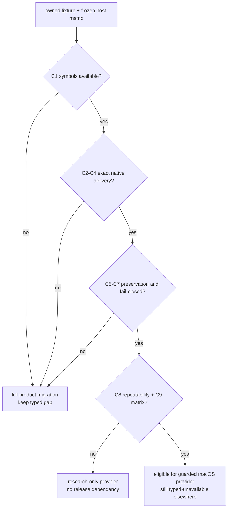

# SkyLight window-local pointer delivery experiment

Status: **PLANNED · research only · not a must-ship ACU dependency**

Date: 2026-09-07
Purpose: decide whether the private macOS SkyLight route already explored by
MCU can become a bounded, fail-closed AgenTerm provider for window-local hover
and wheel delivery without moving the physical pointer or changing foreground
ownership.
Implementation home: `research/skylight-window-local-pointer/`
Parent: [`goal-acu-replaces-mcu.md`](goal-acu-replaces-mcu.md)

## 0. Frozen facts and question

```text
ACU retirement gap 095: move --to <window>
├── public CoreGraphics posting to a PID
│   └── measured: event reaches the process but has no AppKit window
├── global CoreGraphics posting
│   └── works only by moving the user's real pointer; not equivalent
└── MCU research provider: runtime-resolved private SkyLight symbols
    ├── symbol absence fails closed
    ├── foreground/pointer preservation is reported
    └── end-to-end delivery is not yet independently verified
```

Question: **on each supported macOS generation and ISA, can a runtime-resolved
SkyLight provider deliver hover and bounded wheel events to one exact live
window while the physical pointer, focused window and foreground application
remain unchanged, and can it fail closed before injection whenever identity,
symbols or verification are unavailable?**

This experiment does not block the separate public desktop-scoped wheel verb.

## 1. Hard constraints

- Resolve every private symbol at runtime. Missing or incompatible symbols are
  a typed `provider_unavailable` result before any event is posted.
- Bind every action to an exact live window handle plus owner process identity;
  a title, application name or PID alone is insufficient authority.
- Never fall back to a global event, foreground activation, cursor movement,
  coordinate click or AppleScript.
- Sample physical pointer position, focused window and foreground application
  before and after every candidate action.
- `performed` and `verified` are distinct. Symbol invocation alone cannot prove
  delivery.
- Use an owned fixture only. Do not inject into a user's real application.
- The research probe must not add private-framework linkage to release builds.
- A single-host success is evidence for that host only, not a compatibility
  promise.

## 2. Minimal experiment

| Dimension | Frozen choice | Why |
|---|---|---|
| Baseline | public PID-targeted CoreGraphics event | proves the known no-window failure remains observable |
| Candidate | MCU-shaped runtime `dlopen`/`dlsym` SkyLight provider, independently re-integrated under `research/` | tests the only known window-local candidate without importing it into product code |
| Target | owned two-window fixture with event counters and monotonic sequence numbers | proves exact-window delivery and rejects process-wide ambiguity |
| Hover action | move inside target A, then target B | proves window identity rather than mere process delivery |
| Wheel action | bounded vertical and horizontal deltas | covers ACU gaps 095 and 074 without conflating them |
| Controls | unrelated owned window, physical pointer, foreground app and focused window | detects unintended global effects |
| Negative paths | stale handle, wrong owner identity, missing symbol fixture, closed target | proves pre-effect fail-closed behavior |
| Matrix | current and previous supported macOS generations on arm64; Intel/Rosetta only records loader compatibility, never native-kernel equivalence | private ABI risk is version-sensitive |

Fixture evidence must carry the target window identity, event kind, delta or
position, monotonic event sequence, native timestamp and the independently
sampled before/after host state.

## 3. Precommitted criteria

| ID | Criterion | Nature | Pass condition |
|---|---|---|---|
| C1 | Runtime availability | Boolean | every required symbol resolves on each claimed host; absence is typed before injection |
| C2 | Exact target delivery | Safety | only the addressed fixture window advances its event sequence |
| C3 | Real hover semantics | Behavioral | target receives a native move/hover event at the requested window-local point |
| C4 | Real wheel semantics | Behavioral | target receives vertical and horizontal wheel deltas with bounded sign and magnitude |
| C5 | Pointer preservation | Safety | physical pointer coordinates are byte-for-byte equal before and after |
| C6 | Foreground preservation | Safety | focused window and foreground application identities are unchanged |
| C7 | Stale/ambiguous refusal | Safety | stale handle, owner drift and ambiguous mapping reach zero injection attempts |
| C8 | Repeatability | Reliability | 1,000 alternating two-window actions have zero misdelivery, zero lost verification and zero host-state drift |
| C9 | Compatibility boundary | Delivery | every supported macOS generation has its own result; an untested generation remains `provider_unavailable` |

No criterion may be satisfied by `ok: true`, a returned provider name, or an
unchanged screenshot alone.

## 4. Decision tree, kill criterion and time box



Kill criterion: the first need for a global-event fallback, real-pointer move,
foreground activation, PID/title-only addressing, compile-time private linkage,
or an unverified effect immediately rejects product migration. Any crash,
misdelivery or host-state drift in the 1,000-action run also rejects it.

Time box: one owned fixture, one arm64 host on the current macOS generation and
one previous-generation court. If either cannot pass C1-C7 within two focused
implementation days, stop. Run C8 and expand C9 only after C1-C7 pass.

## 5. Result layout

```text
research/skylight-window-local-pointer/
├── README.md
├── RESULTS.md
├── fixture/
└── probe/
```

`RESULTS.md` records source SHA, OS build, architecture, resolved symbol set,
all C1-C9 outcomes, event counters, host-state comparisons and the resulting
verdict. It contains no host absolute paths or user application data.

## 6. Excluded alternatives

| Alternative | Reason excluded |
|---|---|
| Global `CGEventPost` | changes the user's real pointer/foreground target; not window-local |
| PID-targeted `CGEventPostToPid` alone | measured event lacks an AppKit window and cannot prove control delivery |
| Accessibility `AXScrollToVisible` | semantic reveal, not bounded wheel input |
| AppleScript or UI scripting | different mechanism and authority surface |
| Coordinate click or focus-before-send | violates background and pointer-preservation invariants |
| Treat MCU's provider receipt as proof | its delivery field is explicitly unverified |

## 7. Not answered

- public desktop-scoped wheel delivery on macOS, Windows or X11;
- Windows UI Automation or window-message local scroll/hover;
- Linux X11 local delivery or Wayland compositor protocols;
- App Store review or notarization policy for a private runtime-resolved API;
- whether a future public macOS API replaces this provider.

## 8. Result backfill

Not run. Backfill only measured results and the decision-tree verdict. A pass
permits a guarded provider implementation; it does not itself clear ACU gap 095
until the public typed command, durable receipt and qjswasm black-box court land.
