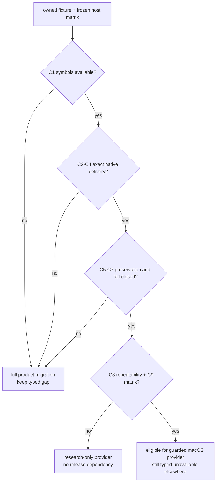
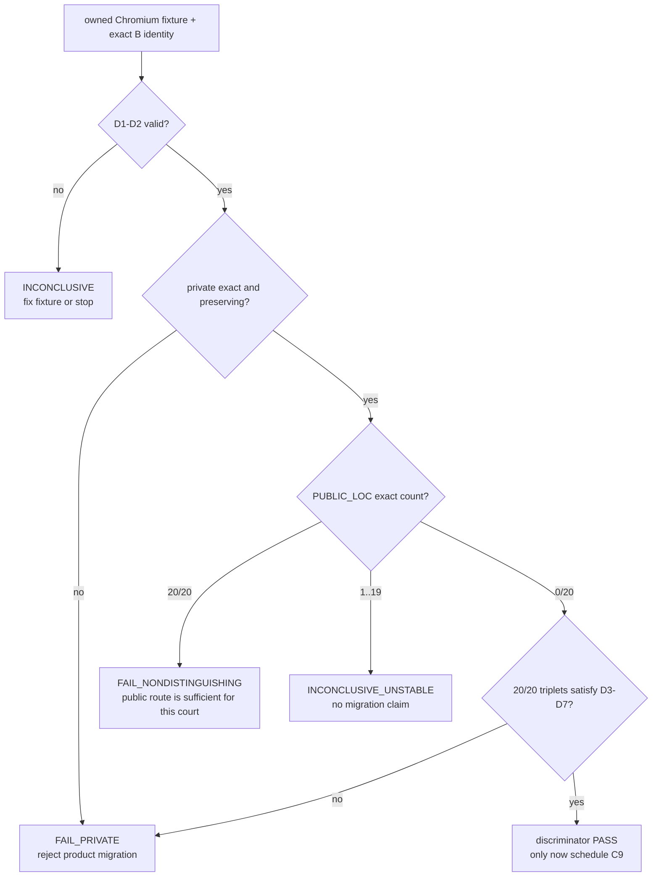

# SkyLight window-local pointer delivery experiment

Status: **MEASURED PARTIAL · research only · not a product provider**

Date: 2026-09-07
Purpose: decide whether the private macOS SkyLight route already explored by
MCU can become a bounded, fail-closed AgenTerm provider for window-local hover
and wheel delivery without moving the physical pointer or changing foreground
ownership.
Implementation home: `research/skylight-window-local-pointer/`
Parent: [`goal-acu-replaces-mcu.md`](goal-acu-replaces-mcu.md)

## 0. Frozen facts and question

```text
ACU retirement gap 095: move --to <window>
├── public CoreGraphics posting to a PID
│   └── historical claim: event reaches the process but has no AppKit window
│       current owned AppKit fixture did not reproduce that claim
├── global CoreGraphics posting
│   └── works only by moving the user's real pointer; not equivalent
└── MCU research provider: runtime-resolved private SkyLight symbols
    ├── symbol absence fails closed
    ├── foreground/pointer preservation is reported
    └── end-to-end delivery is not yet independently verified
```

Question: **on each supported macOS generation and ISA, can a runtime-resolved
SkyLight provider deliver hover and bounded wheel events to one exact live
window while the physical pointer, focused window and foreground application
remain unchanged, and can it fail closed before injection whenever identity,
symbols or verification are unavailable?**

This experiment does not block the separate public desktop-scoped wheel verb.

## 1. Hard constraints

- Resolve every private symbol at runtime. Missing or incompatible symbols are
  a typed `provider_unavailable` result before any event is posted.
- Bind every action to an exact live window handle plus owner process identity;
  a title, application name or PID alone is insufficient authority.
- Never fall back to a global event, foreground activation, cursor movement,
  coordinate click or AppleScript.
- Sample physical pointer position, focused window and foreground application
  before and after every candidate action.
- `performed` and `verified` are distinct. Symbol invocation alone cannot prove
  delivery.
- Use an owned fixture only. Do not inject into a user's real application.
- The research probe must not add private-framework linkage to release builds.
- A single-host success is evidence for that host only, not a compatibility
  promise.

## 2. Minimal experiment

| Dimension | Frozen choice | Why |
|---|---|---|
| Baseline | public PID-targeted CoreGraphics event | tests whether the historical no-window failure remains observable |
| Candidate | MCU-shaped runtime `dlopen`/`dlsym` SkyLight provider, independently re-integrated under `research/` | tests the only known window-local candidate without importing it into product code |
| Target | owned two-window fixture with event counters and monotonic sequence numbers | proves exact-window delivery and rejects process-wide ambiguity |
| Hover action | move inside target A, then target B | proves window identity rather than mere process delivery |
| Wheel action | bounded vertical and horizontal deltas | covers ACU gaps 095 and 074 without conflating them |
| Controls | unrelated owned window, physical pointer, foreground app and focused window | detects unintended global effects |
| Negative paths | stale handle, wrong owner identity, missing symbol fixture, closed target | proves pre-effect fail-closed behavior |
| Matrix | current and previous supported macOS generations on arm64; Intel/Rosetta only records loader compatibility, never native-kernel equivalence | private ABI risk is version-sensitive |

Fixture evidence must carry the target window identity, event kind, delta or
position, monotonic event sequence, native timestamp and the independently
sampled before/after host state.

## 3. Precommitted criteria

| ID | Criterion | Nature | Pass condition |
|---|---|---|---|
| C1 | Runtime availability | Boolean | every required symbol resolves on each claimed host; absence is typed before injection |
| C2 | Exact target delivery | Safety | only the addressed fixture window advances its event sequence |
| C3 | Real hover semantics | Behavioral | target receives a native move/hover event at the requested window-local point |
| C4 | Real wheel semantics | Behavioral | target receives vertical and horizontal wheel deltas with bounded sign and magnitude |
| C5 | Pointer preservation | Safety | physical pointer coordinates are byte-for-byte equal before and after |
| C6 | Foreground preservation | Safety | focused window and foreground application identities are unchanged |
| C7 | Stale/ambiguous refusal | Safety | stale handle, owner drift and ambiguous mapping reach zero injection attempts |
| C8 | Repeatability | Reliability | 1,000 alternating two-window actions have zero misdelivery, zero lost verification and zero host-state drift |
| C9 | Compatibility boundary | Delivery | every supported macOS generation has its own result; an untested generation remains `provider_unavailable` |

No criterion may be satisfied by `ok: true`, a returned provider name, or an
unchanged screenshot alone.

## 4. Decision tree, kill criterion and time box



Kill criterion: the first need for a global-event fallback, real-pointer move,
foreground activation, PID/title-only addressing, compile-time private linkage,
or an unverified effect immediately rejects product migration. Any crash,
misdelivery or host-state drift in the 1,000-action run also rejects it.

Time box: one owned fixture, one arm64 host on the current macOS generation and
one previous-generation court. If either cannot pass C1-C7 within two focused
implementation days, stop. Run C8 and expand C9 only after C1-C7 pass.

## 5. Result layout

```text
research/skylight-window-local-pointer/
├── README.md
├── RESULTS.md
├── fixture/
└── probe/
```

`RESULTS.md` records source SHA, OS build, architecture, resolved symbol set,
all C1-C9 outcomes, event counters, host-state comparisons and the resulting
verdict. It contains no host absolute paths or user application data.

## 6. Excluded alternatives

| Alternative | Reason excluded |
|---|---|
| Global `CGEventPost` | changes the user's real pointer/foreground target; not window-local |
| PID-targeted `CGEventPostToPid` alone | current AppKit fixture receives it, so a discriminating Chromium/Electron fixture must decide whether any product gap remains |
| Accessibility `AXScrollToVisible` | semantic reveal, not bounded wheel input |
| AppleScript or UI scripting | different mechanism and authority surface |
| Coordinate click or focus-before-send | violates background and pointer-preservation invariants |
| Treat MCU's provider receipt as proof | its delivery field is explicitly unverified |

## 7. Not answered

- public desktop-scoped wheel delivery on macOS, Windows or X11;
- Windows UI Automation or window-message local scroll/hover;
- Linux X11 local delivery or Wayland compositor protocols;
- App Store review or notarization policy for a private runtime-resolved API;
- whether a future public macOS API replaces this provider.

## 8. Result backfill · 2026-09-08

```text
current macOS arm64
├─ C1–C7: PASS
├─ C8: PASS · 1,000 alternating two-window actions · repeated twice
├─ C9: INCOMPLETE · no previous-generation arm64 or native Intel result
└─ discriminating baseline: FAIL
   └─ public PID-targeted posting also reached the owned AppKit fixture
```

Decision trace: the candidate reached the `C8 repeatability + C9 matrix?` node.
C8 passed, but C9 remains open; the decision tree therefore ends at
**research-only provider / no release dependency**. More importantly, the
owned AppKit baseline did not reproduce the premise that public PID-targeted
events lack window semantics. This is an honest negative result: the run proves
the private route can be exact on the measured host, not that the route is
needed or should enter product code.

Full criteria, exact source identity, host build, source digest and reproduction
command live in `research/skylight-window-local-pointer/RESULTS.md`. Revisit only
after an owned Chromium/Electron fixture distinguishes the public and private
routes and a previous-generation arm64 court supplies C9. Until then ACU gaps
074 and 095 remain typed TODOs; no private provider, durable receipt or release
linkage is authorized.

## 9. Precommitted discriminating extension · Chromium wheel delivery

The AppKit run answered whether the private route can work on one host, but it
did not answer whether ACU needs that route. The next run therefore changes
only the owned fixture and oracle. It does not widen the candidate provider or
the supported-host claim.

Attempt 1 used `browser-session-start --bridge` as the fixture owner. The owned
browser and CDP endpoint reached ready, but the caller-selected Google Chrome
build published no bridge connection before the 15-second deadline. The run
ended `INCONCLUSIVE` with zero injection attempts and verified session cleanup.
Attempt 2 revises only fixture ownership as described below; all discriminator
criteria and kill conditions remain frozen and every count restarts at zero.
Attempt 2 also ended `INCONCLUSIVE` with zero injection attempts: the direct
profile started, but its preselected fixed CDP port never answered. A bounded
diagnostic proved that the same Chrome build immediately publishes
`DevToolsActivePort` when asked to select its own port. Attempt 3 changes only
that readiness mechanism to port zero plus an exact-profile record read; the
discriminator remains unchanged.
Attempt 3 reached the record and listening browser but the readiness curl was
routed through the host HTTP proxy and received its 503 response. It also
ended before injection. Attempt 4 explicitly bypasses proxies for this
loopback-only readiness check, retries a partially written record, and requires
the `/json/version` WebSocket path to equal the exact profile record.

### 9.1 Frozen setup

- Reuse the direct disposable-profile pattern from
  `scripts/qjs/cu-linux-page-scroll-smoke.qjs`, adapted to the caller-selected
  macOS Chromium executable. Start one exact child with a fresh `--user-data-dir`,
  a Chromium-selected loopback CDP port (`--remote-debugging-port=0`), require
  the bounded `DevToolsActivePort` record from that exact profile, and open
  target window B; then ask that same profile singleton to open peer window A.
  Never attach to a user profile or an already-running browser.
- Create two normal browser windows in one owned profile. Require each window
  to settle at a distinct, stable read-back rectangle and give each page an
  independent `wheel` counter,
  last delta, last client coordinate and monotonic sequence. Register the
  listener as non-passive and call `preventDefault()` so page scrolling cannot
  become the oracle.
- Keep a separate owned non-browser guard application in front. Open target
  window B first, then peer window A so A becomes the browser process's key
  window, and only then let the guard take foreground ownership. B remains
  non-key and is the only addressed
  target. Neither browser window may become foreground during the comparison.
  This prevents a process-level key-window fallback from counting as exact
  delivery.
- Resolve B to exactly one on-screen layer-zero `CGWindowID` by browser owner
  PID, a short per-window nonce title and its independently read-back rectangle.
  The title is candidate discovery, never final authority: after discovering
  both native handles, place them at distinct non-overlapping rectangles with
  exact native read-back and revalidate each CDP title-to-window binding. Zero
  or multiple matches are `window_identity_ambiguous` before injection.
  Preserve each CDP target id, `CGWindowID`, owner PID and rectangle in the
  result.
- Run three arms. `PRIVATE` stamps B and posts through SkyLight at B's midpoint.
  `PUBLIC_LOC` uses `CGEventPostToPid` with the same public event fields and
  screen location. `PUBLIC_OFF` uses the public route with the same delta but a
  point outside B; it detects key-window or process fallback independently of
  location hit-testing. Freshly create the event for every arm.
- Randomize the three-arm order from a recorded seed and reset both page
  counters before each arm. Run 20 triplets before any repeatability expansion.
- Read delivery only through the addressed page's counter and independently
  read the peer page, physical pointer, foreground PID and foreground window
  before and after every arm. A provider return value is never delivery proof.

The experiment may reuse product lifecycle and read-only CDP/bridge mechanisms
to own the fixture and read counters. The candidate injection remains under
`research/skylight-window-local-pointer/`; no private symbol enters a product
binary.

### 9.2 Discriminator and criteria

The Boolean discriminator is evaluated per triplet:

```text
private_exact = B advances once with the requested delta and A stays unchanged
public_loc_exact = PUBLIC_LOC advances B once and A stays unchanged
public_off_target = PUBLIC_OFF advances B despite its point being outside B
discriminates = private_exact && !public_loc_exact
```

Before any arm ran, the executable PASS guard was made explicit: D5 means
`public_off_target` must also be false in every triplet. Any PUBLIC_OFF target
delivery is diagnostic instability, never PASS. This does not change the
precommitted D5 text below; it closes an implementation omission found while
attempts 1-3 still had zero injection attempts.

| ID | Criterion | Nature | Pass condition |
|---|---|---|---|
| D1 | Owned fixture identity | Safety | the exact profile, browser process, native B window and page oracle are unique before both arms |
| D2 | Equivalent inputs | Validity | PRIVATE and PUBLIC_LOC differ only by route-specific window stamping/posting; PUBLIC_OFF differs only by its recorded control location |
| D3 | Private exact delivery | Behavioral | every private arm advances B exactly once with the requested delta and never advances A |
| D4 | Public location non-equivalence | Discriminator | no PUBLIC_LOC arm produces `public_loc_exact`; delivery to A or no delivery is recorded separately |
| D5 | Public fallback classification | Diagnostic | every PUBLIC_OFF arm is classified as target fallback, peer fallback or no delivery; it cannot satisfy exact delivery |
| D6 | Host-state preservation | Safety | pointer, foreground PID and foreground window are unchanged after every arm |
| D7 | Stable comparison | Reliability | all 20 triplets agree with `discriminates=true`; no private loss, double delivery or ambiguous mapping occurs |
| D8 | Cleanup | Safety | both browser windows, the owned profile and the guard are removed or stopped and independently observed absent |

`PASS` requires D1–D8, including 20/20 private exact deliveries and 0/20
PUBLIC_LOC exact deliveries. `FAIL_NONDISTINGUISHING` requires both PRIVATE and
PUBLIC_LOC to deliver exactly to B in all 20 triplets while PUBLIC_OFF never
does; the public route is sufficient for this court and the private route is
retired. A PUBLIC_LOC result between 1/20 and 19/20 is
`INCONCLUSIVE_UNSTABLE`, not evidence for private migration. `FAIL_PRIVATE`
means the private route misses, misdelivers or changes host state. Missing
browser, missing symbols, identity ambiguity or an unavailable independent
oracle is `INCONCLUSIVE`, never a pass.

### 9.3 Decision and sequencing



Kill criterion: any private misdelivery, focus/pointer drift, identity ambiguity
after an injection attempt, need to activate the browser, or disagreement
between two complete 20-triplet runs ends the product-migration case. Do not
tune private event fields after observing either public arm. Time box the
fixture and two complete current-host runs to one focused implementation day.
If D1–D2 cannot be made deterministic in that box, record `INCONCLUSIVE` and
stop.

C9 is deliberately downstream. A previous-generation arm64 host is not spent
on this experiment unless D1–D8 first pass on the current host and a subsequent
1,000-action Chromium PRIVATE repeat has zero loss, misdelivery or host-state
drift. Only then rerun the unchanged source digest and seed protocol on the
previous supported macOS generation; any source or criterion change resets
both host results.

### 9.4 Explicitly not answered

- whether PID-targeted public delivery is documented or future-stable;
- whether an Electron build behaves differently from the owned Chromium build;
- hover gap 095 (the first discriminator is wheel-only for gap 074);
- policy acceptance of private APIs, even if the discriminator passes;
- product rollout, durable receipts or platform qualification.
