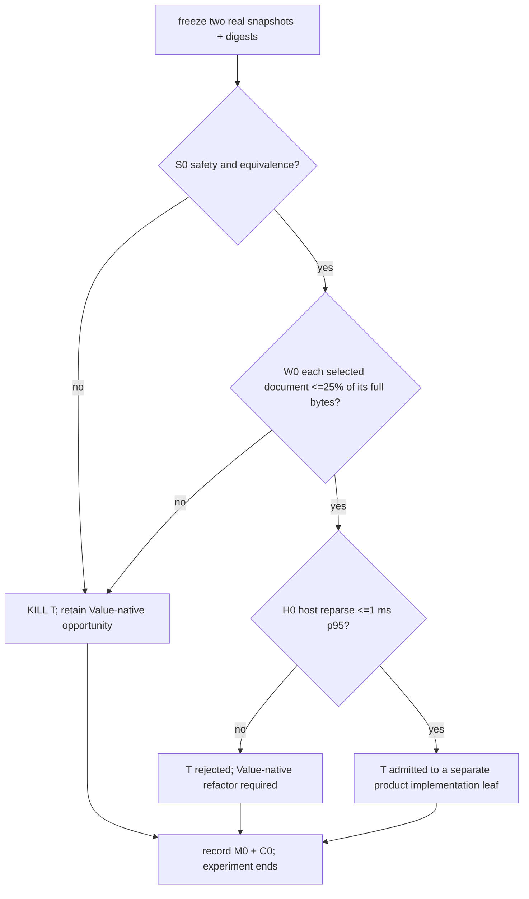

# ui-snapshot field-selection boundary experiment

Status: **COMPLETE · T admitted · no capability-state change · not must-ship**.

Pre-run correction (no measurement existed): the prior reply set contains real
rendered snapshots at multiple sizes but no headless `ui-snapshot`. The cost
axis is therefore frozen as two rendered documents (about 15 and 21 KiB), while
the locally serialized versus cached-text ownership distinction remains an S0
source audit. Inventing a synthetic headless document would be weaker evidence.

This experiment decides whether the measured `ui-snapshot` field-selection
opportunity can ship through an opt-in text-reparse adapter, or whether the
product must retain the opportunity for a later Value-native producer
refactor. It does not add a public flag, change the UI bridge protocol, or
change an ordinary `ui-snapshot` reply.

| field | value |
|---|---|
| date | 2026-09-14 |
| purpose | decide the ownership boundary for the second host-side JSON-selection producer |
| implementation | future `research/ui-snapshot-selection-boundary/` |
| pre-reading | `research/qjswasm-host-reply-wire-cost/RESULTS.md`, `research/json-select-protocol-info/RESULTS.md`, `src/json_select.rs`, `src/control_dispatch.rs`, `src/server_app.rs`, `scripts/qjs/workbench-smoke.qjs` |
| source discipline | one frozen snapshot set and one selection grammar; no twin selector implementation |

## 0. Settled facts

1. The host-reply experiment already passed its wire-value gate and named
   host-side field selection as the owner. This experiment does not repeat that
   decision.
2. `protocol-info --json --select` is the first producer. It projects a
   producer-owned `serde_json::Value` before the unchanged serializer.
3. `ui-snapshot` is always JSON but currently returns `Option<String>` from
   `ControlHost`. The headless fast path can return UI-client text byte for
   byte, while other paths serialize a locally built value immediately.
4. The frozen workbench census found one success-only `ui-snapshot` probe and
   four `wait-ui` replies carrying 15--21 KiB which the guest parses without
   reading their document fields. Those calls are the named consumer set.
5. `--json` is a meaningful format-selection precondition for
   `protocol-info`; inventing it as a precondition for an always-JSON command is
   outside this experiment.
6. The existing selector grammar, limits, projection semantics and typed codes
   remain the only selector implementation. A per-command field allowlist is
   forbidden.

The structural choice is:

- **T (text-reparse adapter):** no-selector replies keep the existing text path;
  an explicit selector parses that text once on the host, applies the shared
  selector, and serializes only the projection.
- **V (Value-native future):** the public leaf does not ship until every
  relevant producer/cache can retain a `Value` through selection while still
  returning the original bytes when no selector is present.

V is the fallback architecture, not a second full prototype. The experiment
asks whether T clears a precommitted product bar. If T fails, its result is a
bounded proof that the later V refactor is required; the experiment must not
grow V until it passes by construction.

## 1. Hard constraints

### 1.1 Same document and read sequence

- Freeze two real rendered snapshots from the existing workbench capture, one
  with one tab and one with three tabs, including their exact bytes and SHA-256
  digests. They are two points on the byte-cost axis rather than two copies of
  one size.
- Use exactly two selectors derived before timing:
  `event_position` for the narrow product polling shape, and
  `tabs[].id,tabs[].render.text` for the workbench rendered-tab shape.
- The selected values must be JSON-equivalent to the same paths in the full
  documents. No consumer assertion or read path may be removed.
- The prior experiment's guest-step percentages are context only. This run does
  not divide by or compare against those cross-experiment numbers; it measures
  the previously unknown host boundary on its own frozen documents.

### 1.2 Wire and authority

- No selector means byte-for-byte the current reply, including cached UI-client
  text. The adapter must not parse on that path.
- Selection happens only after the host has formed the same authoritative
  snapshot it would otherwise return. It is projection, not authorization,
  redaction, capability discovery or field support policy.
- Missing paths still yield an empty object. Malformed paths retain the shared
  selector's typed code. Projection never suppresses an authority or transport
  error.
- No `agenterm-dyn`, `agenterm-cu`, tinyvm, tinyvm-qjs, ABI, IPC envelope,
  budget or UI bridge schema change is admitted.

### 1.3 Disease detector

Any urge to add `--json` solely to satisfy the first producer's helper, add a
second selector parser, parse on the no-selector path, add a supported-field
table, weaken a workbench assertion, migrate the internal `wait-ui` engine, or
change the UI bridge protocol is a finding that this experiment must expose,
not work it may absorb. Record it and stop.

## 2. Minimal experiment content

| dimension | selected content | why |
|---|---|---|
| documents | real one-tab and three-tab rendered snapshots from the frozen workbench capture | measures two byte sizes without inventing a headless fixture |
| implementation | one default-ignored in-module measurement reporter calling the production `json_select::Selector`; retain it for third-party reruns | measures T without adding a public flag or copying the grammar |
| consumers | frozen workbench success-only shape plus one rendered-tab read | one keeps only `event_position`; one proves nested-array semantics |
| controls | the same frozen full document bytes | isolates reparse/project/serialize cost |
| repetitions | 100 warm-ups plus 1,000 measured iterations per document; repeat the complete sample three times | exposes distribution and run spread |
| primary ruler | selected bytes as a share of the same document's full bytes | verifies that this concrete projection removes the wire it claims |
| opposing ruler | host projection latency and allocation count/bytes if the existing allocation reporter can measure them | T's disputed cost lives on the host |
| safety evidence | exact no-selector bytes, selected JSON equivalence, unchanged evidence and exit class | prevents a performance-only verdict |
| target | native macOS aarch64, one repo-local Rust test lane | architecture boundary first; six-cell is delivery, not this decision |

If no existing reporter can measure host allocation, write **未测定**. Do not
replace it with heap pages, guest allocation or process RSS. Host projection
latency is measured in one process over the two frozen documents for 1,000
iterations after 100 warm-ups; report median and p95 separately for each size.

## 3. Precommitted criteria

| id | nature | criterion |
|---|---|---|
| S0 | Boolean safety | the prototype's absent-selector branch returns the exact input bytes without parsing; selected values equal the source paths; every existing selector refusal remains unchanged; source audit confirms both local and cached producers reach the same unchanged absent branch |
| W0 | Boolean wire gate | each selected document is at most 25% of its own full serialized byte count; compare bytes from this run only |
| H0 | Boolean opposing-cost gate | T's p95 parse+project+serialize latency is at most 1.0 ms for each frozen document |
| M0 | list | full/selected bytes and ratio, host median/p95 latency, and host allocation count/bytes or 未测定 |
| C0 | boundary count | product files and production non-comment LOC required by T; report separately from tests/docs, without using this count to override S0/W0/H0 |

Percentages use only the same frozen document from this run. The earlier guest
step result is not a denominator here. Wall time is not a guest budget
substitute. A negative delta is recorded as negative and cannot pass.
The 1.0 ms absolute H0 ceiling protects repeated polling without hiding host
work inside a slow end-to-end harness.

## 4. Decision tree, kill criterion and time box



Ordering is safety, product benefit, then the opposing host cost. M0 and C0 are
reported on every exit and are not later tie-breakers. Every Boolean
combination has an exit.

Kill immediately if S0 or W0 fails, if fewer than two real snapshot sizes can
be frozen, if the existing selector cannot serve T without a second
grammar, or if any disease-detector item is required. If W0 passes but H0
fails, reject T and name V as required; do not implement V inside this run. If
T passes, the later product leaf must independently run a successful public
journey before/after; this experiment does not borrow the failed workbench
control run as product evidence.

The time box ends when S0, W0 and H0 each have a verdict, or at the first kill.
No production flag or refactor is allowed before that result is written.

## 5. Evidence layout

```text
research/ui-snapshot-selection-boundary/
├── README.md
├── snapshot-manifest.json
├── measurements.json
├── receipt.json
└── RESULTS.md
```

`RESULTS.md` must record the exact HEAD, toolchain, target, frozen-document
digests, extraction commands, selectors, three raw benchmark samples, full and
selected byte counts, host benchmark values, deviations and the decision trace
through §4. No binary digest or tinyvm pin is claimed because this experiment
executes a Rust in-module harness, not a guest binary.

## 6. Excluded choices

| choice | reason excluded |
|---|---|
| add `--json` to `ui-snapshot` | always-JSON output needs no invented format precondition |
| select after the reply reaches the guest | repeats the cost the prior experiment assigned to the host |
| compact all JSON | indentation lost the prior owner decision |
| migrate `wait-ui` internals | separate polling semantics and deadline surface |
| cache both text and Value in production before measurement | commits to V's memory cost before T is judged |
| per-command field schemas | turns projection into a policy/allowlist surface |
| UI bridge protocol change | delivery program, not required to judge T |
| six-cell qualification | follows a selected product implementation |

## 7. Not answered here

- The final public spelling for selection on an always-JSON command.
- How a later V design would retain original no-selector bytes without a second
  full snapshot allocation.
- Whether product-internal `wait-ui` polling should request projections.
- Cross-host performance and release scheduling.
- Whether a second producer makes the shared selector core a net LOC deletion;
  that account belongs to the selected implementation.
- The end-to-end guest saving of a shipped T implementation; its product leaf
  must measure a succeeding public journey at one source state.

## 8. Result

Complete at `d249df8bf472f69529b8dafeade618446d68c882`. S0, W0 and
H0 all passed, so the decision tree admits T to a separate product
implementation leaf. The experiment did not add a public option or change a
capability state. Exact inputs, raw samples, deviations, commands and the
decision trace are in `research/ui-snapshot-selection-boundary/RESULTS.md`.

The evidence reuses the immutable envelope files already owned by
`research/qjswasm-host-reply-wire-cost/` and freezes both envelope and extracted
document digests in `snapshot-manifest.json`; copying the documents would add a
second evidence owner without adding information. Host allocation bytes remain
**未测定**. C0 is also **未测定** because the experiment intentionally contains
no production implementation; it cannot honestly count a future leaf.
