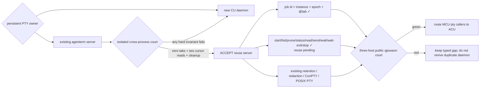

# Headless PTY owner decision

Status: **DECIDED · reuse the existing `agenterm server` authority**

Parent: [`goal-acu-replaces-mcu.md`](goal-acu-replaces-mcu.md)

## Product question

ACU must replace MCU's persistent native PTY/job loop without inventing a
second terminal kernel or requiring a visible terminal window. The unresolved
architecture choice was:

```text
one persistent PTY/job authority
├─ A: existing headless agenterm server + isolated logical instance
├─ B: a new agenterm-cu daemon with its own PTY registry
└─ C: retain MCU native/tmux provider
```

C cannot satisfy the replacement outcome. A and B both sounded plausible, so
the choice was resolved by a bounded behavior court rather than another design
argument.

## Frozen court

Time box: one local macOS court using owned processes and repo-local transient
state under `target/`; no GUI activation and no external service.

Pass A only if one existing headless server can prove all of these together:

1. start under a unique `ephemeral:*` logical instance and isolated workspace,
   settings and instance-registry paths;
2. answer a later, independently spawned `agenterm-cu terminal-list` process;
3. close its automatic initial tab and remain live with exactly zero tabs;
4. accept a later `terminal-new --detached -- PROGRAM...` from another ACU
   process;
5. expose process output through the loss-aware raw byte cursor across at least
   two reads, then reach `finalized`;
6. close the exact job tab, remain live with zero tabs, then stop through the
   existing explicit server shutdown command;
7. never require a visible frontend or a second PTY implementation.

Any failed invariant selects B for a separately specified prototype. A false
success at the CLI/process boundary invalidates the run rather than counting
as server evidence.

## Result · 2026-09-05

The first readiness loop exposed an independent P0: `agenterm-cu` printed
`ok:false / control_unavailable` but exited 0. That run was discarded. Commit
`5446f2c7` makes process status agree with typed JSON (`ok` = 0, runtime failure
= 1, usage = 2), and the court was rerun.

The valid rerun passed every criterion:

```text
initial tab       @1
after close       0 tabs; server live
owned job         @2
raw page 1        HEADLESS_READY + exact next_cursor
raw page 2        HEADLESS_DONE + exact next_cursor
final state       finalized; exact tab close; 0 tabs; server live
cleanup           explicit server shutdown completed
```

The server and every ACU call used the same logical instance but were separate
processes. The court left only bounded ignored evidence under `target/`; no
product or user data was read.

## Decision and boundary

- **Accept A.** `agenterm server` remains the single PTY/session/tree owner for
  both visible terminals and headless jobs.
- Reject a new CU daemon: it would duplicate POSIX PTY/ConPTY lifecycle,
  retention, redaction, parent promotion and shutdown behavior already owned by
  the product server.
- MCU remains only a migration adapter until the public `pty-*` facade below is
  complete; it is not the future owner.
- The existing `terminal-*` verbs remain the low-level AgenTerm-tab surface.
  The future `pty-*` facade adds durable job identity, server supervision and
  cleanup; it must not change those verbs' meaning.

## Productization DAG

```text
[x] owner decision: existing headless agenterm server
├─ [x] raw byte continuation: terminal-output
├─ [x] cross-process server persistence and zero-tab survival court
├─ [x] owned job identity: job id → logical instance + server epoch + @tab
├─ [~] supervisor: start/list/prune/status/read/send/wait/wait-exit/stop are live; reuse remains
│  ├─ [x] no false-green readiness; typed deadline
│  ├─ [x] one authority per job id; concurrent-start court
│  └─ [~] stale state reclamation ✓; orphan process-tree authority remains
├─ [~] process lifecycle: exact exit + explicit stop postconditions; tree/signal remain
├─ [ ] bounded events/snapshot/diff projection compatible with MCU callers
└─ [x] local six-cell public qjswasm court (macOS x86_64 via Rosetta)
```



## Kill criterion

Reopen B only if a Windows or Unix native court proves that the existing server
cannot satisfy a required job invariant even after a bounded supervisor layer:
detached lifetime, exact process-tree cleanup, single-owner identity, or stale
reclamation. GUI inconvenience, the initial automatic tab, or missing public
verbs are productization gaps, not evidence for a second kernel.

## First product slice · 2026-09-05

The public ACU facade now exposes `pty-start`, `pty-status`, `pty-read`,
`pty-send`, `pty-wait`, `pty-wait-exit` and `pty-stop`. One validated job name deterministically maps to
one private `ephemeral:acu-pty-*` server instance; the server starts with zero
tabs, then owns exactly one typed-argv job tab. Start and stop serialize through
a cross-process path lock. Read reuses the terminal owner's loss-aware raw byte
cursor, wait requires `finalized` and can require an exact exit status, and stop
requires `--expect stopped`.

The macOS public-process court proved all of these together: two concurrent
starts yield exactly one owner and one typed `pty_job_busy`; a later duplicate
is `pty_job_exists`; output continues across bounded cursors; a wrong expected
exit status fails typed; and stop removes the exact tab and then proves the
dedicated control endpoint disappeared. A shutdown ACK is auxiliary because a
successful destructive operation may remove the response authority itself.
Both Windows ISA cells pass `cargo-xwin` checking and both Linux ISA cells pass
`cargo-zigbuild`; native Linux and Windows lifecycle courts remain open.

The next interactive court on the same owner passed on macOS: an interactive
shell received exact literal input, `pty-wait` found the response in retained
raw bytes, exit status 7 was verified, and explicit stop removed the endpoint.
Wait advances a loss-aware byte cursor and carries `needle.len - 1` bytes across
page boundaries, so it neither reduces history to the current screen nor loses
a split match. Regex waits and terminal event/screen projection remain separate
leaves rather than silently weaker aliases.
