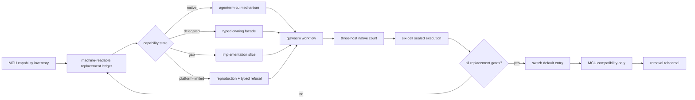

# Goal: ACU replaces MCU

Status: **active**

Product owners: [`prd/PRD_02_28_agenterm_cu.md`](../prd/PRD_02_28_agenterm_cu.md) and
[`prd/PRD_02_36_agenterm_qjswasm.md`](../prd/PRD_02_36_agenterm_qjswasm.md)

Capability ledger: [`plan/capability-mcu-cu.md`](capability-mcu-cu.md)

## Product outcome

`agenterm-cu` becomes the one installed machine/computer-use entry for agents.
It replaces the user-visible MCU/Bun runtime while reusing the correct owning
mechanism behind typed facades. MCU remains only a temporary compatibility
adapter and an experiment incubator until its retirement gates pass.

Replacement means **all useful workflows remain reachable without MCU**, not
that every MCU TypeScript module is translated into Rust. A capability may be
implemented by ACU itself or delegated to AgenTerm, qjswasm, libagenterm, or an
`agenterm-platform` adapter, but the public command, result schema, target
identity, deadline, cleanup and evidence contract belong to ACU.

## Markdown-tree DAG

```text
ACU replaces MCU
├─ capability accounting
│  ├─ every MCU public verb and sub-verb has one stable capability id
│  ├─ state = native | delegated | gap | platform-limited | retired
│  ├─ available requires named black-box evidence; catalog presence is not proof
│  └─ no permanent catch-all equivalent to acu.ts STAY
├─ one product entry
│  ├─ desktop/a11y/browser/window/input → CU + platform/libagenterm
│  ├─ PTY/process/task composition → AgenTerm + qjswasm
│  ├─ file/network/device/service/privilege → typed platform facades
│  └─ current/ssh/vnc/VM targets preserve one command and result schema
├─ qjswasm execution core
│  ├─ release-critical workflows are .qjs, not Bun/TS or archived Rh
│  ├─ typed compile/host/budget/deadline/cancel failures
│  ├─ bounded output, memory, operations and concurrency
│  └─ invocation-owned cleanup with no cross-run global state
├─ evidence
│  ├─ Win UIA, macOS AX and Linux AT-SPI2 native journeys
│  ├─ six OS/ISA execute-only delivery cells
│  ├─ MCU workflow parity corpus run against ACU
│  └─ comparative court: structure, background control, success and recovery
└─ retirement
   ├─ default docs and PATH resolve to agenterm-cu
   ├─ no production workflow imports skills/mcu or requires Bun
   ├─ acu.ts compatibility telemetry has zero unexplained stays
   └─ MCU removal rehearsal leaves all declared gates green
```

## Mermaid flowchart memory palace



## Capability-state contract

| State | Meaning | Evidence required |
|---|---|---|
| `native` | ACU owns and executes the mechanism | public command journey plus post-state |
| `delegated` | ACU calls another AgenTerm-owned mechanism through a typed facade | facade identity, timeout, error and cleanup tests |
| `gap` | required replacement capability is not implemented | owning slice and safe typed failure |
| `platform-limited` | the OS/backend cannot supply the promised behavior | reproducible court evidence and an alternative path when one exists |
| `retired` | obsolete MCU behavior intentionally has no successor | user-impact review and migration note |

`unsupported` is a runtime result, not a roadmap state. It must map to either a
temporary `gap`, a proved `platform-limited` cell, or a reviewed `retired`
behavior. A group or verb appearing in `capabilities` does not make it shipped.

## Current observed frontier (2026-09-04)

- MCU currently exposes **79 top-level verbs**. This is only the first
  accounting dimension: `page`, `browser`, `process`, `resource`, `file` and
  other families contain independently meaningful sub-verbs and argument
  shapes that R0 must also enumerate.
- The transitional `acu.ts` adapter currently keeps **41 top-level spellings**
  on MCU. Its 84-name pass-through set is not a parity count: it mixes MCU
  spellings, ACU-native spellings and group aliases. The adapter's 40 green
  tests prove lossless argv routing and honest refusal only; they do not prove
  that any kept workflow has an ACU mechanism.
- The 41 current stays split into four implementation queues:
  - desktop closure: `drag`, `hit`, `zoom`, `snapshot`, `diff`, `raise`,
    `minimize`, `restore`, `focus` and the diagnostic `ghost` overlay;
  - process/runtime: `exec`, `ps`, `process`, `job`, `pty`, `term`, `signal`,
    `kill`, `service`, `daemon`, `session`, `lock` and `audit`;
  - machine/system: `setup`, `doctor`, `permissions`, `caps`, `state`, `open`,
    `notify`, `resource`, `power`, `login-session`, `storage`, `file`,
    `network`, `device`, `audio`, `privilege` and `desktop-helper`;
  - platform product: `simulator`.
  This grouping is sequencing, not permanent ownership. Every retained item
  must leave `STAY` before R4/R6 can pass.
- The ACU catalog already names the broad desktop and machine groups. PTY,
  process, resource, power, login-session, storage, file, network, device,
  privilege, runtime, desktop-helper and simulator are currently mostly typed
  refusals. Under this goal those declarations are **gaps to close through
  facades**, not permanent ownership exclusions.
- An in-flight desktop slice is converting `drag`, `hit`, `zoom`, `snapshot`,
  `diff`, `raise`, `minimize` and `restore` from typed-only declarations into
  live commands. They remain unproved until their owning tests and native
  journeys pass on the integrated source state.
- The MCU-shaped `acu.ts` adapter still says it is not a 79-verb replacement.
  That sentence describes the transitional adapter, not the product goal. The
  adapter must eventually report the state contract above instead of one flat
  `STAY` set.
- Existing adapter tests prove only honest argv rewriting. They do not prove
  the target ACU mechanism, post-state, cleanup, platform parity or MCU
  independence; those belong to R1-R6.

## Work tranches

1. **Ledger court** — replace the flat `STAY` concept with the state contract
   above; account for sub-verbs and parameter shapes, not only top-level names.
2. **Desktop closure** — snapshots/diffs, hit testing, drag/wheel, window
   lifecycle, browser/CDP operations and deterministic waits on all three OSes.
3. **Machine facade** — make PTY, process, file, network, device, service,
   privilege and VM operations reachable through ACU without duplicating their
   owning kernels.
4. **qjswasm closure** — run the parity corpus under bounded qjswasm, then fix
   measured language/host-operation gaps without raising limits to hide cost.
5. **Delivery court** — native three-host journeys, six-cell sealed execution,
   package identity and failure cleanup.
6. **Retirement court** — switch examples/default PATH, remove Bun from the
   production dependency graph, rehearse MCU absence, then archive the shim.

## Hard gates

- **R0 Accounting:** zero unclassified MCU public command shapes.
- **R1 Reachability:** every retained capability is `native` or `delegated`, or
  has cell-specific `platform-limited` evidence; no required item remains `gap`.
- **R2 Behavior:** the parity corpus proves success, refusal, timeout and cleanup
  through the ACU public interface.
- **R3 Portability:** Win/macOS/Linux native courts pass and all six sealed
  artifacts execute; a compile-only result cannot satisfy this gate.
- **R4 Independence:** production workflows do not import MCU TypeScript and do
  not require Bun.
- **R5 Superiority:** comparative evidence demonstrates at least structured
  identity, background-safe actuation, deterministic waits, typed recovery,
  auditable receipts and remote-target reuse. Marketing claims cannot substitute.
- **R6 Removal:** running the full declared gate set with MCU unavailable remains
  green before the compatibility layer is archived.

## Non-goals

- Do not translate MCU TypeScript line by line.
- Do not fork PTY, process, filesystem or platform kernels inside the CU crate.
- Do not call a typed refusal feature parity.
- Do not weaken qjswasm budgets or action verification to make a court green.
- Do not claim superiority from a command-count comparison.
