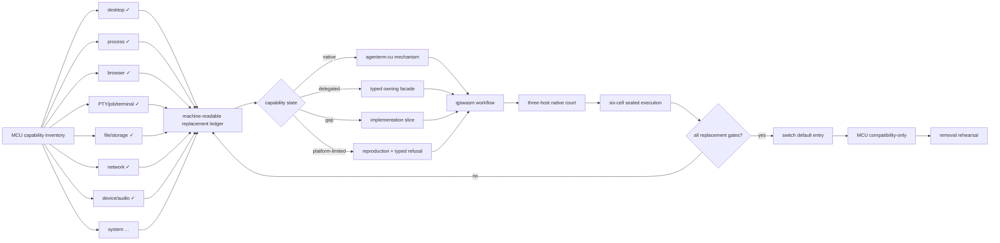

# Goal: ACU replaces MCU

Status: **active**

Product owners: [`prd/PRD_02_28_agenterm_cu.md`](../prd/PRD_02_28_agenterm_cu.md) and
[`prd/PRD_02_36_agenterm_qjswasm.md`](../prd/PRD_02_36_agenterm_qjswasm.md)

Capability ledger: [`plan/capability-mcu-cu.md`](capability-mcu-cu.md)

Machine-readable state ledger:
[`plan/acu-mcu-capability-ledger.json`](acu-mcu-capability-ledger.json). It is
currently exhaustive for the process family and grows family by family until
R0 reaches zero unclassified public shapes.

## Product outcome

`agenterm-cu` becomes the one installed machine/computer-use entry for agents.
It replaces the user-visible MCU/Bun runtime while reusing the correct owning
mechanism behind typed facades. MCU remains only a temporary compatibility
adapter and an experiment incubator until its retirement gates pass.

Replacement means **all useful workflows remain reachable without MCU**, not
that every MCU TypeScript module is translated into Rust. A capability may be
implemented by ACU itself or delegated to AgenTerm, qjswasm, libagenterm, or an
`agenterm-platform` adapter, but the public command, result schema, target
identity, deadline, cleanup and evidence contract belong to ACU.

## Markdown-tree DAG

```text
ACU replaces MCU
├─ capability accounting
│  ├─ every MCU public verb and sub-verb has one stable capability id
│  ├─ state = native | delegated | gap | platform-limited | retired
│  ├─ available requires named black-box evidence; catalog presence is not proof
│  └─ no permanent catch-all equivalent to acu.ts STAY
├─ one product entry
│  ├─ desktop/a11y/browser/window/input → CU + platform/libagenterm
│  ├─ PTY/process/task composition → AgenTerm + qjswasm
│  ├─ file/network/device/service/privilege → typed platform facades
│  └─ current/ssh/vnc/VM targets preserve one command and result schema
├─ qjswasm execution core
│  ├─ release-critical workflows are .qjs, not Bun/TS or archived Rh
│  ├─ typed compile/host/budget/deadline/cancel failures
│  ├─ bounded output, memory, operations and concurrency
│  └─ invocation-owned cleanup with no cross-run global state
├─ evidence
│  ├─ Win UIA, macOS AX and Linux AT-SPI2 native journeys
│  ├─ six OS/ISA execute-only delivery cells
│  ├─ MCU workflow parity corpus run against ACU
│  └─ comparative court: structure, background control, success and recovery
└─ retirement
   ├─ default docs and PATH resolve to agenterm-cu
   ├─ no production workflow imports skills/mcu or requires Bun
   ├─ acu.ts compatibility telemetry has zero unexplained stays
   └─ MCU removal rehearsal leaves all declared gates green
```

## Mermaid flowchart memory palace



## Capability-state contract

| State | Meaning | Evidence required |
|---|---|---|
| `native` | ACU owns and executes the mechanism | public command journey plus post-state |
| `delegated` | ACU calls another AgenTerm-owned mechanism through a typed facade | facade identity, timeout, error and cleanup tests |
| `gap` | required replacement capability is not implemented | owning slice and safe typed failure |
| `platform-limited` | the OS/backend cannot supply the promised behavior | reproducible court evidence and an alternative path when one exists |
| `retired` | obsolete MCU behavior intentionally has no successor | user-impact review and migration note |

`unsupported` is a runtime result, not a roadmap state. It must map to either a
temporary `gap`, a proved `platform-limited` cell, or a reviewed `retired`
behavior. A group or verb appearing in `capabilities` does not make it shipped.

## Current observed frontier (2026-09-04)

- MCU currently exposes **79 top-level verbs**. This is only the first
  accounting dimension: `page`, `browser`, `process`, `resource`, `file` and
  other families contain independently meaningful sub-verbs and argument
  shapes that R0 must also enumerate.
- The transitional `acu.ts` adapter now keeps **32 top-level spellings** on
  MCU. Its 96-name pass-through set is not a parity count: it mixes MCU
  spellings, ACU-native spellings and group aliases. The adapter's 45 green
  tests prove lossless argv routing and honest refusal only; they do not prove
  native post-state or platform parity.
- The 32 current stays split into four implementation queues:
  - desktop closure: window activation (`focus`) and the diagnostic `ghost`
    overlay;
  - process/runtime: `exec`, `process`, `job`, `pty`, `term`, `signal`,
    `kill`, `service`, `daemon`, `session`, `lock` and `audit`;
  - machine/system: `setup`, `doctor`, `permissions`, `caps`, `state`, `open`,
    `notify`, `resource`, `power`, `login-session`, `storage`, `file`,
    `network`, `device`, `audio`, `privilege` and `desktop-helper`;
  - platform product: `simulator`.
  This grouping is sequencing, not permanent ownership. Every retained item
  must leave `STAY` before R4/R6 can pass.
- The ACU catalog already names the broad desktop and machine groups. PTY,
  process, resource, power, login-session, storage, file, network, device,
  privilege, runtime, desktop-helper and simulator are currently mostly typed
  refusals. Under this goal those declarations are **gaps to close through
  facades**, not permanent ownership exclusions.
- The first desktop closure implementation is integrated. MCU-shaped
  `raise`/`minimize`/`restore`/`hit`/`snapshot`/`diff` now rewrite to ACU, and
  ACU-native `drag`/`zoom` are reachable through the compatibility entry.
  MCU-shaped `drag` remains a gap because it promises background-local input
  while the current ACU path requires explicit degraded global-pointer
  admission; MCU-shaped `zoom` remains a gap because its window-local corner
  coordinates and percentage padding are not the same contract as ACU's
  screen rectangle and pixel padding. Both fail typed instead of silently
  changing behavior.
- macOS now has native journey evidence for `snapshot`/`diff`, `hit`/`zoom`,
  `raise` and gated `minimize`/`restore`. The restore step exposed a real
  platform bug: `kCGWindowListOptionIncludingWindow` alone returned no owner
  row after minimize. The adapter now filters `kCGWindowListOptionAll` by the
  stable `CGWindowID`; the journey proves minimize, off-screen lookup, restore,
  foreground preservation and owned cleanup together. Linux and Windows are
  still required before this tranche is three-host complete.
- The first non-desktop facade is integrated: `ps --pid/--parent/--name` with
  bounded pagination now calls `agenterm-platform::process::list`, the same
  native mechanism used by qjswasm `process.list`. Richer MCU process filters
  remain explicit gaps; the compatibility router forwards the proven subset
  and temporarily falls back for unsupported shapes.
- The second process slice is integrated: `process-state --pid N` returns
  `live|dead|unknown`, a platform start identity where available, and
  `verified=false` for unknown evidence. The compatibility router maps MCU
  `process state N` to this facade. This identity is a prerequisite for later
  signal/kill operations; a reusable PID alone is never sufficient.
- `process-usage --pid N` adds a one-shot cumulative CPU, resident-memory and
  page-fault sample. It reads the start identity before and after the sample,
  fails if they differ, and encodes wide counters as decimal strings so a
  JavaScript/qjswasm consumer cannot silently round them. `--watch-ms` adds a
  monotonic bounded series with independent interval/sample ceilings and binds
  every sample to that first identity. MCU `process usage N [--watch ...]`
  can now route here when no privilege-only shape was requested.
- `process-wait --pid N --start-identity ID --timeout-ms N` retains a native
  process object (pidfd/kqueue/Windows HANDLE), verifies the caller's prior
  identity, and waits monotonically for that exact object. A live timeout is a
  verified result. This is intentionally stronger than MCU's repeated PID
  inventory polling; the native ACU spelling is reachable through the shim.
- The three public native journeys now bind those commands to each owned GUI
  fixture. macOS is live green at 37 STEP / 38 evidence ids. The exact-SHA
  Linux x86_64 court passed the process leaves through STEP 13, including a
  real owned child exit, then correctly emitted 0 / 25 evidence because the
  later accessibility observer missed an editable-text event. Root cause is a
  baseline tree walk racing concurrent mutations on a slow AT-SPI host;
  poll-diff now exposes an atomic `--ready-path` edge and the journey waits on
  it. Linux remains unproven until that integrated journey reruns green;
  Windows 16 / 16 also awaits its exact-SHA court.
- `process-watch` closes MCU's lifecycle-observation shape with a stronger
  identity contract: composable PID/parent/name filters or explicit all, an immediate
  bounded baseline, and started/exited events keyed by PID plus start identity.
  Duration, interval, event count and matched inventory are separately capped;
  broad selectors report incomplete identity coverage rather than emitting
  PID-only rows;
  macOS public-CLI evidence has observed a real owned child exit. The three
  qjswasm native journeys now declare the same event and await integrated runs.
- The PTY/job/terminal family is now fully classified by public shape. The
  existing AgenTerm session/tab kernel is the owner for product-terminal
  inventory, capture, input and deterministic waits, but those commands are
  not counted as ACU-reachable until a typed facade and public journey exist.
  Arbitrary background PTYs and lease-owned process groups remain separate
  gaps: a visible AgenTerm tab is not silently treated as a native/tmux PTY,
  and single-process metrics are not presented as job-group coverage.
- MCU `exec <command...>` and ACU `exec --json` currently mean different
  things. The router must keep refusing that collision until an explicit
  argv-based shell/job command is named; compatibility never justifies a
  meaning-changing rewrite.
- File/storage accounting is complete. Existing platform primitives for stable
  entry identity, no-overwrite publication and per-volume capacity are useful
  building blocks, but they do not yet constitute MCU's recoverable copy/move
  transaction or physical-device inventory. Unix modes/xattrs and Windows
  ACLs/attributes remain distinct platform vocabularies; parity must not be
  manufactured by renaming one as the other.
- Network accounting is complete across interfaces, routes, DNS, sockets and
  DNS+TCP probes. qjswasm's generic TCP surface is the correct composition
  engine for probes, but it does not make the ACU command reachable by itself;
  system inventory remains a native platform facade and sockets must join a
  process start identity rather than a reusable PID alone.
- Device/audio accounting is complete across peripheral inventory and events,
  exclusive device leases, byte I/O, serial configuration and default-output
  state. A path alone is never durable device identity, and audio backends stay
  explicitly platform-limited until each native court proves them.
- The compatibility adapter now states the complete replacement goal and
  labels every `stay` as a migration gap. The flat set is still transitional;
  R0 replaces it with the machine-readable state ledger.
- Existing adapter tests prove only honest argv rewriting. They do not prove
  the target ACU mechanism, post-state, cleanup, platform parity or MCU
  independence; those belong to R1-R6.

## Work tranches

1. **Ledger court** — replace the flat `STAY` concept with the state contract
   above; account for sub-verbs and parameter shapes, not only top-level names.
2. **Desktop closure** — snapshots/diffs, hit testing, drag/wheel, window
   lifecycle, browser/CDP operations and deterministic waits on all three OSes.
3. **Machine facade** — make PTY, process, file, network, device, service,
   privilege and VM operations reachable through ACU without duplicating their
   owning kernels.
4. **qjswasm closure** — run the parity corpus under bounded qjswasm, then fix
   measured language/host-operation gaps without raising limits to hide cost.
5. **Delivery court** — native three-host journeys, six-cell sealed execution,
   package identity and failure cleanup.
6. **Retirement court** — switch examples/default PATH, remove Bun from the
   production dependency graph, rehearse MCU absence, then archive the shim.

## Ordered execution queue

```text
Q0 truthful boundary
├─ [x] runtime/help text: no useful capability is described as permanently MCU-owned
└─ [~] replace top-level STAY counting with sub-verb + argument-shape ledger
   ├─ [x] process family accounted shape by shape in the JSON ledger
   ├─ [x] desktop family accounted shape by shape in the JSON ledger
   ├─ [x] browser family accounted shape by shape in the JSON ledger
   ├─ [x] PTY/job/terminal family accounted shape by shape in the JSON ledger
   ├─ [x] file/storage family accounted shape by shape in the JSON ledger
   ├─ [x] network family accounted shape by shape in the JSON ledger
   ├─ [x] device/audio family accounted shape by shape in the JSON ledger
   └─ [ ] runtime/system families remain to enumerate
Q1 desktop closure
├─ [x] macOS snapshot/diff/hit/zoom/raise/minimize/restore native journey
├─ [ ] Linux and Windows journeys for the same verbs
└─ [ ] explicit pointer court for drag/wheel/global input; never hide degradation
Q2 fast delegated facades
├─ [ ] caps/doctor/permissions/setup and app inventory
├─ [ ] open/notify/state and terminal adoption
└─ [~] process inventory/exec/signal through bounded qjswasm/AgenTerm contracts
   ├─ [x] basic ps: pid/parent/name + bounded page through shared platform process facade
   ├─ [x] process-state: live/dead/unknown + stable start identity, observe-only
   ├─ [x] process-usage: one-shot or bounded identity-bound series, lossless counters
   ├─ [x] process-wait: prior identity + native exact-object reference + monotonic timeout
   ├─ [x] process-watch: bounded baseline + identity-safe started/exited diff
   └─ [ ] rich filters, process detail, exec and identity-bound signal/mutation
Q3 owned runtime facades
├─ [~] PTY/job/daemon/session/lock/audit/service
│  ├─ [ ] typed ACU facade over existing AgenTerm session/tab control
│  ├─ [ ] portable owned headless PTY (POSIX PTY + Windows ConPTY)
│  └─ [ ] lease-owned job registry, streams, resource policy and cleanup
└─ [ ] file/network/storage/device/audio/resource/power/privilege
Q4 browser and platform depth
├─ [~] CDP core live; pointer/dialog/files and MCU auto-pick shapes remain
├─ [ ] MV3/Native Messaging + managed-profile ownership
├─ [ ] Simulator facade
└─ [ ] current/ssh/vnc/VM schema parity
Q5 retirement
└─ [ ] parity corpus + three-host native + six-cell + MCU-absent rehearsal
```

`moltbaby/skills/mcu/acu.ts` is only the transition router. Its `stay` result
means “ACU cannot yet express this exact public shape; use MCU temporarily,”
not “this capability belongs to MCU forever.” A same-named command also stays
when forwarding would silently change meaning, such as window activation vs.
node focus or shell execution vs. one JSON CU command. The ledger and queues
above turn every such honest refusal into owned removal work.

## Hard gates

- **R0 Accounting:** zero unclassified MCU public command shapes.
- **R1 Reachability:** every retained capability is `native` or `delegated`, or
  has cell-specific `platform-limited` evidence; no required item remains `gap`.
- **R2 Behavior:** the parity corpus proves success, refusal, timeout and cleanup
  through the ACU public interface.
- **R3 Portability:** Win/macOS/Linux native courts pass and all six sealed
  artifacts execute; a compile-only result cannot satisfy this gate.
- **R4 Independence:** production workflows do not import MCU TypeScript and do
  not require Bun.
- **R5 Superiority:** comparative evidence demonstrates at least structured
  identity, background-safe actuation, deterministic waits, typed recovery,
  auditable receipts and remote-target reuse. Marketing claims cannot substitute.
- **R6 Removal:** running the full declared gate set with MCU unavailable remains
  green before the compatibility layer is archived.

## Non-goals

- Do not translate MCU TypeScript line by line.
- Do not fork PTY, process, filesystem or platform kernels inside the CU crate.
- Do not call a typed refusal feature parity.
- Do not weaken qjswasm budgets or action verification to make a court green.
- Do not claim superiority from a command-count comparison.
