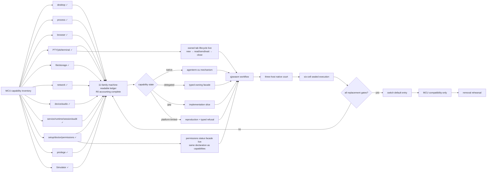

# Goal: ACU replaces MCU

Status: **active**

Product owners: [`prd/PRD_02_28_agenterm_cu.md`](../prd/PRD_02_28_agenterm_cu.md) and
[`prd/PRD_02_36_agenterm_qjswasm.md`](../prd/PRD_02_36_agenterm_qjswasm.md)

Capability ledger: [`plan/capability-mcu-cu.md`](capability-mcu-cu.md)

Machine-readable state ledger:
[`plan/acu-mcu-capability-ledger.json`](acu-mcu-capability-ledger.json). It is
now exhaustive across 11 public capability families and R0 has zero
unclassified public shapes. This closes accounting, not implementation: every
`gap` and `platform-limited` row still needs its owning slice and court.

## Product outcome

`agenterm-cu` becomes the one installed machine/computer-use entry for agents.
It replaces the user-visible MCU/Bun runtime while reusing the correct owning
mechanism behind typed facades. MCU remains only a temporary compatibility
adapter and an experiment incubator until its retirement gates pass.

Replacement means **all useful workflows remain reachable without MCU**, not
that every MCU TypeScript module is translated into Rust. A capability may be
implemented by ACU itself or delegated to AgenTerm, qjswasm, libagenterm, or an
`agenterm-platform` adapter, but the public command, result schema, target
identity, deadline, cleanup and evidence contract belong to ACU.

## Markdown-tree DAG

```text
ACU replaces MCU
├─ capability accounting
│  ├─ every MCU public verb and sub-verb has one stable capability id
│  ├─ state = native | delegated | gap | platform-limited | retired
│  ├─ available requires named black-box evidence; catalog presence is not proof
│  └─ no permanent catch-all equivalent to acu.ts STAY
├─ one product entry
│  ├─ desktop/a11y/browser/window/input → CU + platform/libagenterm
│  ├─ PTY/process/task composition → AgenTerm + qjswasm
│  ├─ file/network/device/service/privilege → typed platform facades
│  ├─ setup/doctor/permissions → truthful probes + exact repair actions
│  ├─ daemon/session/lock/audit → one durable native ACU coordinator
│  ├─ Simulator → explicit macOS-limited typed facade
│  └─ current/ssh/vnc/VM targets preserve one command and result schema
├─ qjswasm execution core
│  ├─ release-critical workflows are .qjs, not Bun/TS or archived Rh
│  ├─ typed compile/host/budget/deadline/cancel failures
│  ├─ bounded output, memory, operations and concurrency
│  └─ invocation-owned cleanup with no cross-run global state
├─ evidence
│  ├─ Win UIA, macOS AX and Linux AT-SPI2 native journeys
│  ├─ six OS/ISA execute-only delivery cells
│  ├─ MCU workflow parity corpus run against ACU
│  └─ comparative court: structure, background control, success and recovery
└─ retirement
   ├─ default docs and PATH resolve to agenterm-cu
   ├─ no production workflow imports skills/mcu or requires Bun
   ├─ acu.ts compatibility telemetry has zero unexplained stays
   └─ MCU removal rehearsal leaves all declared gates green
```

## Mermaid flowchart memory palace



## Capability-state contract

| State | Meaning | Evidence required |
|---|---|---|
| `native` | ACU owns and executes the mechanism | public command journey plus post-state |
| `delegated` | ACU calls another AgenTerm-owned mechanism through a typed facade | facade identity, timeout, error and cleanup tests |
| `gap` | required replacement capability is not implemented | owning slice and safe typed failure |
| `platform-limited` | the OS/backend cannot supply the promised behavior | reproducible court evidence and an alternative path when one exists |
| `retired` | obsolete MCU behavior intentionally has no successor | user-impact review and migration note |

`unsupported` is a runtime result, not a roadmap state. It must map to either a
temporary `gap`, a proved `platform-limited` cell, or a reviewed `retired`
behavior. A group or verb appearing in `capabilities` does not make it shipped.

## Current observed frontier (2026-09-04)

- MCU currently exposes **79 top-level verbs**. This is only the first
  accounting dimension: `page`, `browser`, `process`, `resource`, `file` and
  other families contain independently meaningful sub-verbs and argument
  shapes that R0 must also enumerate.
- The transitional `acu.ts` adapter now keeps **31 top-level spellings** on
  MCU. Its 97-name pass-through set is not a parity count: it mixes MCU
  spellings, ACU-native spellings and group aliases. The adapter's 45 green
  tests prove lossless argv routing and honest refusal only; they do not prove
  native post-state or platform parity.
- The 31 current stays split into four implementation queues:
  - desktop closure: window activation (`focus`) and the diagnostic `ghost`
    overlay;
  - process/runtime: `exec`, `process`, `job`, `pty`, `term`, `signal`,
    `kill`, `service`, `daemon`, `session`, `lock` and `audit`;
  - machine/system: `setup`, `permissions`, `caps`, `state`, `open`,
    `notify`, `resource`, `power`, `login-session`, `storage`, `file`,
    `network`, `device`, `audio`, `privilege` and `desktop-helper`;
  - platform product: `simulator`.
  This grouping is sequencing, not permanent ownership. Every retained item
  must leave `STAY` before R4/R6 can pass.
- The ACU catalog already names the broad desktop and machine groups. PTY,
  process, resource, power, login-session, storage, file, network, device,
  privilege, runtime, desktop-helper and simulator are currently mostly typed
  refusals. Under this goal those declarations are **gaps to close through
  facades**, not permanent ownership exclusions.
- The first desktop closure implementation is integrated. MCU-shaped
  `raise`/`minimize`/`restore`/`hit`/`snapshot`/`diff` now rewrite to ACU, and
  ACU-native `drag`/`zoom` are reachable through the compatibility entry.
  MCU-shaped `drag` remains a gap because it promises background-local input
  while the current ACU path requires explicit degraded global-pointer
  admission; MCU-shaped `zoom` remains a gap because its window-local corner
  coordinates and percentage padding are not the same contract as ACU's
  screen rectangle and pixel padding. Both fail typed instead of silently
  changing behavior.
- The browser endpoint gap is closed at the compatibility boundary. All ACU
  CDP page verbs accept either `--port N` or `--pid PID`; the PID route binds
  the process start identity around a bounded native command-line read,
  extracts only an explicit debugging-port flag, never scans, and never
  publishes the command line. `scripts/cu-cdp-smoke.sh` proves the real PID
  route against a throwaway headless browser; the MCU-shaped adapter now
  forwards it instead of retaining the call.
  A native Windows ARM64 UTM court also returned the owned Edge page through
  this PID route. `scripts/qjs/cu-windows-browser-smoke.qjs` now owns that
  assertion for the next integrated Windows journey. Linux ARM64 and x86_64
  court probes found no Chromium-family browser, so their runtime evidence
  remains open with the prerequisite named instead of being skipped as green.
  The Windows x86_64 court currently fails earlier at its interactive-job-agent
  registration; QGA can execute `cmd.exe` and transfer files, but its
  PowerShell child produced no result receipt. That cell is infrastructure
  unavailable, not a failed ACU assertion, and remains open until the court
  channel is repaired or the GitHub native runner executes the journey.
- macOS now has native journey evidence for `snapshot`/`diff`, `hit`/`zoom`,
  `raise` and gated `minimize`/`restore`. The restore step exposed a real
  platform bug: `kCGWindowListOptionIncludingWindow` alone returned no owner
  row after minimize. The adapter now filters `kCGWindowListOptionAll` by the
  stable `CGWindowID`; the journey proves minimize, off-screen lookup, restore,
  foreground preservation and owned cleanup together. Linux and Windows are
  still required before this tranche is three-host complete.
- The first non-desktop facade is integrated: `ps --pid/--parent/--name` with
  bounded pagination now calls `agenterm-platform::process::list`, the same
  native mechanism used by qjswasm `process.list`. Richer MCU process filters
  remain explicit gaps; the compatibility router forwards the proven subset
  and temporarily falls back for unsupported shapes.
- The second process slice is integrated: `process-state --pid N` returns
  `live|dead|unknown`, a platform start identity where available, and
  `verified=false` for unknown evidence. The compatibility router maps MCU
  `process state N` to this facade. This identity is a prerequisite for later
  signal/kill operations; a reusable PID alone is never sufficient.
- `process-usage --pid N` adds a one-shot cumulative CPU, resident-memory and
  page-fault sample. It reads the start identity before and after the sample,
  fails if they differ, and encodes wide counters as decimal strings so a
  JavaScript/qjswasm consumer cannot silently round them. `--watch-ms` adds a
  monotonic bounded series with independent interval/sample ceilings and binds
  every sample to that first identity. MCU `process usage N [--watch ...]`
  can now route here when no privilege-only shape was requested.
- `process-wait --pid N --start-identity ID --timeout-ms N` retains a native
  process object (pidfd/kqueue/Windows HANDLE), verifies the caller's prior
  identity, and waits monotonically for that exact object. A live timeout is a
  verified result. This is intentionally stronger than MCU's repeated PID
  inventory polling; the native ACU spelling is reachable through the shim.
- The three public native journeys now bind those commands to each owned GUI
  fixture. macOS exact source `986863c0` is live green at 40 STEP / 41 evidence
  ids in 28.504 s. Linux x86_64 is
  also exact-SHA green at 24 / 24 STEP and 25 / 25 evidence ids: the atomic
  ready marker, real owned-child exit, accessibility observation and cleanup
  all passed in 54.106 s. This proves the integrated source state, not a final
  explanation for the previous mixed-time AT-SPI snapshot; complete poll/error
  accounting remains in the failure bundle so a recurrence is diagnosable.
  Windows x86 now crosses the public no-console `.com` entry and the recovered
  interactive UTM worker. The current-source journey proves capabilities,
  fixture identity, process state/usage/watch/wait, UIA tree/query/invoke and
  background menu inspection before stopping at the focus court. Two false
  infrastructure/test failures were removed: the worker now synchronizes
  asynchronous Scheduled Task creation with a nonce receipt, and the lifecycle
  probe uses an inbox native short process rather than cold PowerShell startup.
  UIA root resolution retries only named transient HRESULTs within the existing
  action budget. The remaining result is a truthful product/court boundary:
  the background desktop reports `focus performed=true` but focused read-back
  remains false, so the 16-evidence journey stays red rather than claiming an
  unverified action.
- `process-watch` closes MCU's lifecycle-observation shape with a stronger
  identity contract: composable PID/parent/name filters or explicit all, an immediate
  bounded baseline, and started/exited events keyed by PID plus start identity.
  Duration, interval, event count and matched inventory are separately capped;
  broad selectors report incomplete identity coverage rather than emitting
  PID-only rows;
  macOS public-CLI evidence has observed a real owned child exit. The three
  qjswasm native journeys now declare the same event and await integrated runs.
- `process-argv` closes one more MCU sub-verb without leaking its default
  payload. Linux reads NUL-delimited `/proc` entries, macOS consumes exactly
  the native `argc`, and Windows reconstructs the documented native command-line
  lexical projection. ACU brackets the read with the same process start
  identity, pages at a hard 4,096-row ceiling, and returns only index, byte
  length and SHA-256 unless the caller explicitly supplies `--values`. The MCU
  compatibility adapter routes this exact shape to ACU; three qjswasm journeys
  declare the evidence, with integrated Linux/Windows reruns still open.
- The PTY/job/terminal family is now fully classified by public shape. The
  existing AgenTerm session/tab kernel is the owner for product-terminal
  create/close, inventory, capture, input and deterministic waits. The typed
  ACU facade now reaches all six through one scope+epoch+`@tab` identity and
  verifies lifecycle effects by inventory read-back; the registered qjswasm
  journey owns the public assertion and awaits the next three-host run.
  The first headless layer is also live: `pty-start/status/read/send/wait/wait-exit/stop`
  map one validated job name to one isolated zero-UI server instance and exact
  epoch+`@tab` identity. A macOS race court proved one owner under concurrent
  start, loss-aware output continuation, literal input, cross-page exact wait,
  exact exit mismatch, and verified shutdown. Reuse/list/prune, events/screen projection, stale registry
  reclamation and process-group control remain open; one process is not claimed
  as job-group coverage.
- MCU `exec <command...>` and ACU `exec --json` currently mean different
  things. The router must keep refusing that collision until an explicit
  argv-based shell/job command is named; compatibility never justifies a
  meaning-changing rewrite.
- File/storage accounting is complete. Existing platform primitives for stable
  entry identity, no-overwrite publication and per-volume capacity are useful
  building blocks, but they do not yet constitute MCU's recoverable copy/move
  transaction or physical-device inventory. Unix modes/xattrs and Windows
  ACLs/attributes remain distinct platform vocabularies; parity must not be
  manufactured by renaming one as the other.
- Network accounting is complete across interfaces, routes, DNS, sockets and
  DNS+TCP probes. The active qjswasm/tinyvm host surface has no generic TCP or
  DNS API; historical catalog names are not implementation. Probes require a
  bounded native `agenterm-platform` resolver/connect facade first, while
  system inventory remains platform-owned and socket rows must join a process
  start identity rather than a reusable PID alone.
- Device/audio accounting is complete across peripheral inventory and events,
  exclusive device leases, byte I/O, serial configuration and default-output
  state. A path alone is never durable device identity, and audio backends stay
  explicitly platform-limited until each native court proves them.
- R0 accounting is complete across all 11 families. Runtime/service/session/
  audit contains user/system services, native coordinator, login service,
  leases, target locks, request idempotency, desktop delivery, audit
  query/retention/replay and console-session locking. Setup/doctor/permissions,
  the privilege broker chain and all CoreSimulator device/app/deployment/
  foreground/capture shapes are separately classified. An empty
  `remaining_families` means there is no hidden command family; it does not
  turn any gap into an implementation.
- The compatibility adapter now states the complete replacement goal and
  labels every `stay` as a migration gap. The flat set is still transitional;
  R0 replaces it with the machine-readable state ledger.
- `doctor` is the first setup-family spelling to leave `STAY`: MCU-shaped
  `acu doctor` now routes to the ACU-native bounded diagnostic. Adapter tests
  and a live macOS invocation are green; this does not promote `setup` or
  permission-opening mutations.
- Existing adapter tests prove only honest argv rewriting. They do not prove
  the target ACU mechanism, post-state, cleanup, platform parity or MCU
  independence; those belong to R1-R6.

## Work tranches

1. **Ledger court** — replace the flat `STAY` concept with the state contract
   above; account for sub-verbs and parameter shapes, not only top-level names.
2. **Desktop closure** — snapshots/diffs, hit testing, drag/wheel, window
   lifecycle, browser/CDP operations and deterministic waits on all three OSes.
3. **Machine facade** — make PTY, process, file, network, device, service,
   privilege and VM operations reachable through ACU without duplicating their
   owning kernels.
4. **qjswasm closure** — run the parity corpus under bounded qjswasm, then fix
   measured language/host-operation gaps without raising limits to hide cost.
5. **Delivery court** — native three-host journeys, six-cell sealed execution,
   package identity and failure cleanup.
6. **Retirement court** — switch examples/default PATH, remove Bun from the
   production dependency graph, rehearse MCU absence, then archive the shim.

## Ordered execution queue

```text
Q0 truthful boundary
├─ [x] runtime/help text: no useful capability is described as permanently MCU-owned
└─ [x] replace top-level STAY counting with sub-verb + argument-shape ledger
   ├─ [x] process family accounted shape by shape in the JSON ledger
   ├─ [x] desktop family accounted shape by shape in the JSON ledger
   ├─ [x] browser family accounted shape by shape in the JSON ledger
   ├─ [x] PTY/job/terminal family accounted shape by shape in the JSON ledger
   ├─ [x] file/storage family accounted shape by shape in the JSON ledger
   ├─ [x] network family accounted shape by shape in the JSON ledger
   ├─ [x] device/audio family accounted shape by shape in the JSON ledger
   ├─ [x] service/runtime/session/lock/audit family accounted shape by shape
   ├─ [x] setup/doctor/permissions family accounted shape by shape
   ├─ [x] privilege family accounted shape by shape
   └─ [x] Simulator family accounted shape by shape
Q1 desktop closure
├─ [x] macOS snapshot/diff/hit/zoom/raise/minimize/restore native journey
├─ [~] Linux and Windows journeys for the same verbs
│  ├─ [x] Linux exact-3390 rerun: 24/24 STEP · 25/25 evidence · cleanup green
│  └─ [~] Windows x86 UTM: public `.com` + process/UIA path live; background focus court remains typed-red
└─ [ ] explicit pointer court for drag/wheel/global input; never hide degradation
Q2 fast delegated facades
├─ [~] caps/doctor/permissions/setup and app inventory
│  ├─ [x] permissions: read-only platform state + gated verbs + repair guidance
│  ├─ [ ] permissions: required/optional three-host evidence + open-next action
│  ├─ [~] doctor: bounded read-only health receipt; local CLI green, three-host pending
│  └─ [ ] setup: idempotent launcher/runtime repair
├─ [ ] open/notify/state and terminal adoption
└─ [~] process inventory/exec/signal through bounded qjswasm/AgenTerm contracts
   ├─ [x] basic ps: pid/parent/name + bounded page through shared platform process facade
   ├─ [x] process-state: live/dead/unknown + stable start identity, observe-only
   ├─ [x] process-usage: one-shot or bounded identity-bound series, lossless counters
   ├─ [x] process-wait: prior identity + native exact-object reference + monotonic timeout
   ├─ [x] process-watch: bounded baseline + identity-safe started/exited diff
   └─ [ ] rich filters, process detail, exec and identity-bound signal/mutation
Q3 owned runtime facades
├─ [~] PTY/job/daemon/session/lock/audit/service
│  ├─ [x] typed ACU terminal-new/close/list/read/send/wait facade over stable scope+epoch+tab identity
│  ├─ [~] terminal lifecycle: macOS registered qjswasm journey green; Linux/Windows courts pending
│  ├─ [x] terminal-snapshot/events: structured screen + loss-aware epoch/sequence cursor
│  ├─ [~] terminal cursor qualification: macOS registered qjswasm journey green; Linux/Windows pending
│  ├─ [x] terminal-output: retained raw bytes + absolute cursor + typed gap/future failures
│  ├─ [~] raw-output cursor qualification: macOS registered qjswasm journey green; Linux/Windows pending
│  ├─ [~] portable owned headless PTY: existing agenterm server selected as sole owner
│  │  ├─ [x] decision court: cross-process, zero-tab, cursor continuation, shutdown green
│  │  ├─ [x] public pty-start/status/read/send/wait/wait-exit/stop + exact identity
│  │  ├─ [x] literal input + loss-aware cross-page exact-output wait
│  │  ├─ [x] exact-source `a6a1c7b9` local six-cell qjswasm public court; macOS x86_64 via Rosetta
│  │  ├─ [x] concurrent-start single-owner + typed exit mismatch + verified shutdown court
│  │  └─ [~] list/prune ✓; reuse + orphan process-tree cleanup pending
│  ├─ [~] durable-job screen/event projection
│  │  ├─ [x] pty-snapshot: sole-tab structured screen + exact job/scope/epoch/tab cursor
│  │  ├─ [x] pty-diff: persisted identity-bound rows/metadata + bounded atomic advance
│  │  ├─ [x] pty-events: same-epoch continuation + all-scanned cursor advance
│  │  ├─ [x] pty-resize: temporary lease + exact grid/epoch/tab read-back + detach proof
│  │  ├─ [x] local macOS public qjswasm snapshot → resize/diff → output/diff → event continuation → restart refusal
│  │  └─ [ ] enlarged journey six-cell rerun
│  └─ [ ] lease-owned job registry, streams, resource policy and cleanup
└─ [~] file/network/storage/device/audio/resource/power/privilege
   ├─ [x] bounded identity-aware network-probe
   ├─ [~] file-inspect: no-follow final entry + bounded metadata + stable identity
   │  ├─ [x] macOS public qjswasm journey: 41 STEP / 42 evidence + cleanup
   │  ├─ [x] Linux x86_64 focused native UTM court: exact-byte pair + file/link/missing
   │  ├─ [x] Windows x86_64 cargo-xwin compile
   │  ├─ [x] Windows x86_64 focused native UTM court: exact-byte pair + file/missing
   │  └─ [~] Linux + Windows focused leaves await full qjswasm journey promotion
   └─ [ ] remaining transaction/device/service facades follow the machine ledger
Q4 browser and platform depth
├─ [x] CDP core live
│  ├─ [x] page hover: trusted mousemove target read-back; MCU positional shape routed
│  ├─ [x] page scroll: owned-container scroll event + offset read-back; MCU positional shape routed
│  ├─ [x] page drag: trusted down/held-move/up read-back; release cleanup; MCU positional shape routed
│  ├─ [x] page dialog: opening/closed event proof; prompt contents redacted; MCU shape routed
│  ├─ [x] page files: exact FileList read-back; bounded regular non-symlink inputs; paths redacted
│  ├─ [x] page pixel click: frozen viewport hit + trusted down/up read-back + release cleanup
│  ├─ [x] page current-focus type: editable preflight + same-focus/value-growth proof; plaintext redacted
│  └─ [x] MCU --match: title+URL+description; unique or typed ambiguity; routed for lossless page shapes
├─ [~] browser control without a pre-opened CDP port
│  ├─ [~] owned browser-session: public lifecycle + macOS live cleanup ✓; Windows suspended→Job→resume implemented/×2 compile ✓; Linux/native Windows courts pending
│  ├─ [~] MV3/Native Messaging: protocol v1 framing/validation core; host/extension/installer pending
│  └─ [x] no fake attach: an existing process without a startup debug endpoint stays AX-only
├─ [ ] Simulator facade
└─ [ ] current/ssh/vnc/VM schema parity
Q5 retirement
└─ [ ] parity corpus + three-host native + six-cell + MCU-absent rehearsal
```

`moltbaby/skills/mcu/acu.ts` is only the transition router. Its `stay` result
means “ACU cannot yet express this exact public shape; use MCU temporarily,”
not “this capability belongs to MCU forever.” A same-named command also stays
when forwarding would silently change meaning, such as window activation vs.
node focus or shell execution vs. one JSON CU command. The ledger and queues
above turn every such honest refusal into owned removal work.

## Hard gates

- **R0 Accounting:** zero unclassified MCU public command shapes.
- **R1 Reachability:** every retained capability is `native` or `delegated`, or
  has cell-specific `platform-limited` evidence; no required item remains `gap`.
- **R2 Behavior:** the parity corpus proves success, refusal, timeout and cleanup
  through the ACU public interface.
- **R3 Portability:** Win/macOS/Linux native courts pass and all six sealed
  artifacts execute; a compile-only result cannot satisfy this gate.
- **R4 Independence:** production workflows do not import MCU TypeScript and do
  not require Bun.
- **R5 Superiority:** comparative evidence demonstrates at least structured
  identity, background-safe actuation, deterministic waits, typed recovery,
  auditable receipts and remote-target reuse. Marketing claims cannot substitute.
- **R6 Removal:** running the full declared gate set with MCU unavailable remains
  green before the compatibility layer is archived.

## Non-goals

- Do not translate MCU TypeScript line by line.
- Do not fork PTY, process, filesystem or platform kernels inside the CU crate.
- Do not call a typed refusal feature parity.
- Do not weaken qjswasm budgets or action verification to make a court green.
- Do not claim superiority from a command-count comparison.
