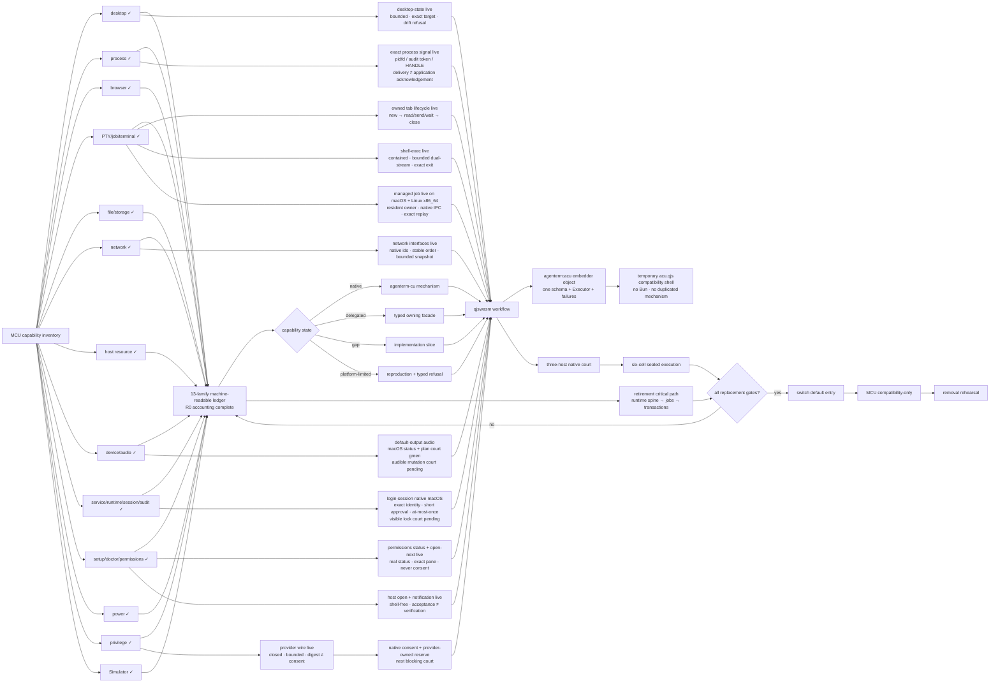

# Goal: ACU replaces MCU

Status: **active**

Product owners: [`prd/PRD_02_28_agenterm_cu.md`](../prd/PRD_02_28_agenterm_cu.md) and
[`prd/PRD_02_36_agenterm_qjswasm.md`](../prd/PRD_02_36_agenterm_qjswasm.md)

Capability ledger: [`plan/capability-mcu-cu.md`](capability-mcu-cu.md)

Machine-readable state ledger:
[`plan/acu-mcu-capability-ledger.json`](acu-mcu-capability-ledger.json). It is
now exhaustive across 13 public capability families and R0 has zero
unclassified public shapes. This closes accounting, not implementation: every
`gap` and `platform-limited` row still needs its owning slice and court.

## Product outcome

`agenterm-cu` becomes the one installed machine/computer-use entry for agents.
It replaces the user-visible MCU/Bun runtime while reusing the correct owning
mechanism behind typed facades. MCU remains only a temporary compatibility
adapter and an experiment incubator until its retirement gates pass.

Replacement means **all useful workflows remain reachable without MCU**, not
that every MCU TypeScript module is translated into Rust. A capability may be
implemented by ACU itself or delegated to AgenTerm, qjswasm, libagenterm, or an
`agenterm-platform` adapter, but the public command, result schema, target
identity, deadline, cleanup and evidence contract belong to ACU.

## Markdown-tree DAG

```text
ACU replaces MCU
├─ capability accounting
│  ├─ every MCU public verb and sub-verb has one stable capability id
│  ├─ state = native | delegated | gap | platform-limited | retired
│  ├─ available requires named black-box evidence; catalog presence is not proof
│  └─ no permanent catch-all equivalent to acu.ts STAY
├─ one product entry
│  ├─ desktop/a11y/browser/window/input → CU + platform/libagenterm
│  ├─ PTY/process/task composition → AgenTerm + qjswasm
│  ├─ file/network/device/service/privilege → typed platform facades
│  ├─ setup/doctor/permissions → truthful probes + exact repair actions
│  ├─ runtime/session/lock/audit → on-demand coordinator + per-resource owners
│  ├─ Simulator → explicit macOS-limited typed facade
│  └─ current/ssh/vnc/VM targets preserve one command and result schema
├─ active device frontier
│  ├─ [x] opaque id → exact resident native object; no raw locator as public authority
│  ├─ [x] macOS public qjswasm claim/replay/I/O/renew/release/TTL/session court
│  ├─ [x] durable state and audit exclude locator, lease secret and byte payload
│  ├─ [x] preserve partial-write lower bound, delivery uncertainty and retry safety independently
│  ├─ [x] Linux aarch64 + x86_64 native public qjswasm courts
│  └─ [ ] Windows native COM/virtual-COM court
├─ active audio frontier
│  ├─ [x] macOS CoreAudio exact default-output status + mutation-free plan court
│  ├─ [x] Linux/Windows typed unsupported; no fabricated backend or receipt
│  ├─ [x] durable at-most-once apply + exact-device readback + guarded rollback mechanism
│  └─ [ ] explicit audible apply/readback/rollback court; keep platform-limited
├─ qjswasm execution core
│  ├─ release-critical workflows are .qjs, not Bun/TS or archived Rh
│  ├─ phase 1: `acu.ts` is only a temporary lossless MCU→ACU argv adapter
│  ├─ phase 2: embedder-provided `agenterm:acu` object (qjs `acu`) shares schema/Executor/errors with CLI and MCP
│  ├─ phase 3: after object parity + zero STAY, `acu.qjs` removes Bun while retaining only compatibility mapping
│  ├─ never copy native mechanism or product policy from Rust into `acu.qjs`
│  ├─ typed compile/host/budget/deadline/cancel failures
│  ├─ bounded output, memory, operations and concurrency
│  ├─ synchronous child calls default to a 60-second wall deadline
│  ├─ all child entry paths enter native containment before user code
│  └─ invocation-owned cleanup with no cross-run global state
├─ evidence
│  ├─ Win UIA, macOS AX and Linux AT-SPI2 native journeys
│  ├─ six OS/ISA execute-only delivery cells
│  ├─ MCU workflow parity corpus run against ACU
│  └─ comparative court: structure, background control, success and recovery
└─ retirement
   ├─ default docs and PATH resolve to agenterm-cu
   ├─ no production workflow imports skills/mcu or requires Bun
   ├─ acu.ts compatibility telemetry has zero unexplained stays
   └─ MCU removal rehearsal leaves all declared gates green
```

## Mermaid flowchart memory palace



## Capability-state contract

| State | Meaning | Evidence required |
|---|---|---|
| `native` | ACU owns and executes the mechanism | public command journey plus post-state |
| `delegated` | ACU calls another AgenTerm-owned mechanism through a typed facade | facade identity, timeout, error and cleanup tests |
| `gap` | required replacement capability is not implemented | owning slice and safe typed failure |
| `platform-limited` | the OS/backend cannot supply the promised behavior | reproducible court evidence and an alternative path when one exists |
| `retired` | obsolete MCU behavior intentionally has no successor | user-impact review and migration note |

`unsupported` is a runtime result, not a roadmap state. It must map to either a
temporary `gap`, a proved `platform-limited` cell, or a reviewed `retired`
behavior. A group or verb appearing in `capabilities` does not make it shipped.

## Current retirement frontier (2026-09-05)

The active cut is deliberately narrow: clear every unexplained compatibility
`STAY`, then pass the MCU-absence court. General qjswasm optimization and new
product branches do not pre-empt these blockers.

The compatibility migration has three explicit phases. Today `acu.ts` may
only perform lossless legacy argv projection and binary discovery; it cannot
own a second implementation. The embedder-provided qjswasm `agenterm:acu`
object (available to qjs as `acu`) lands next and is the convergence owner.
Only after its typed parity, the zero-STAY ledger and MCU-absent courts are
green may `acu.qjs` replace the Bun shell while keeping only compatibility
mapping:
CLI, MCP and qjs call the same typed schema and Rust `Executor`, with identical
deadlines, cleanup, errors and receipts. Moving TypeScript logic line-for-line
into qjswasm would preserve the duplication and is explicitly rejected.

```text
MCU retirement blockers
├─ [x] desktop state: bounded native desktop-state + state alias
├─ [~] shared runtime spine
│  ├─ [x] session create/list/status/renew/end + target lock acquire/list/release/expiry sweep (`cu.target-lock-lifecycle`)
│  ├─ [x] audit query with bounded result/scan/byte budgets
│  ├─ [x] audit retention: plan/apply + atomic bounded compact + qjswasm court
│  ├─ [x] audit replay rejected: MCU never shipped it; request-id owns exact retry and uncertainty never replays
│  ├─ [x] MCU-shaped session/lock/audit-query/compact compatibility routes to ACU
│  ├─ [x] runtime-status + daemon status/caps aliases report truthful topology without publishing state
│  ├─ [x] setup refresh: stable admission fence + resident-owner snapshot; never recreate global daemon lifecycle
│  ├─ [x] daemon start/restart/stop are typed retirements and never fall back to MCU
│  └─ [ ] daemon service/login lifecycle remains a real native-provider gap
├─ [~] managed job facade
│  ├─ [x] private crash-safe identity/state registry; no command/env/lease persistence
│  ├─ [x] contained owner core + dual bounded stdout/stderr cursor rings
│  ├─ [x] cross-platform owned stdin pipe; drop is explicit EOF, not process stop
│  ├─ [x] closed current-user native IPC + opaque bounded endpoint + resident expiry loop
│  ├─ [x] detached launcher + public spawn/list/status/events/output/write/wait/renew/stop
│  ├─ [x] MCU `job output` single-stream cursor/byte-budget shape routes to ACU with explicit generation
│  ├─ [x] exact request replay returns the same public job identity without a second spawn
│  ├─ [x] session-end closes admission, stops every bound job, releases locks and retries idempotently
│  ├─ [x] macOS public-process lifecycle: dual output, write/EOF, wait, renew and stop
│  ├─ [x] registered qjswasm journey green on macOS
│  ├─ [x] same journey green on Linux x86_64 execute-only court
│  ├─ [~] job set-state/signal: owning session + generation + durable root identity → crash-recoverable exact tree
│  │  ├─ [x] Unix STOP/CONT share the proven tree recovery journal and verified post-state
│  │  ├─ [x] non-idempotent signals refuse until request-id replay prevents duplicate delivery
│  │  ├─ [x] Windows refuses undocumented Job Object freeze and non-equivalent POSIX signals
│  │  ├─ [x] Unix group priority: write-ahead receipt + one native group effect + stable member/value readback
│  │  ├─ [x] macOS qjswasm court proves priority effect and request replay; Windows code refuses before effect
│  │  └─ [ ] resource policy, Linux rerun and Windows typed-refusal public evidence
│  └─ [ ] Linux aarch64 and Windows journeys green
├─ [~] machine transactions
│  ├─ [x] recoverable file copy: marker-owned no-replace publication + crash recovery
│  ├─ [~] recoverable file move: macOS qjswasm green; Linux/Windows courts pending
│  ├─ [~] process set-state: exact-object stop/resume on macOS/Linux; Windows typed gap
│  │  ├─ [x] start-identity gate + retained pidfd/audit-token effect authority
│  │  ├─ [x] scheduler read-back + closed success/failure receipt + public qjswasm court
│  │  └─ [ ] Linux native and Windows typed-refusal courts
│  ├─ [~] process signal: exact-object closed signal set; macOS qjswasm green
│  │  ├─ [x] stale identity refusal + pidfd/audit-token/HANDLE effect authority
│  │  ├─ [x] TERM/KILL exit, STOP/CONT state and generic-delivery truth separated
│  │  ├─ [x] MCU single-process unprivileged shape routes to ACU
│  │  └─ [ ] Linux/Windows native courts; privileged shapes remain gaps
│  ├─ [~] tree-signal crash recovery
│  │  ├─ [x] receipt reserved before freeze; handled failure restores retained objects
│  │  └─ [x] restart recovery resolves or reports every member after owner death
│  ├─ [~] host dispatch: open + notification typed; macOS qjswasm green, Linux/Windows courts pending
│  ├─ [~] MV3 browser bridge and managed profile/window lifecycle
│  │  ├─ [x] fixed extension identity + bounded secret-free native protocol
│  │  ├─ [x] same-binary native host + current-user manifest/registry installer
│  │  ├─ [x] public exact-connection setup/connections/status/tabs/windows/debug-read CLI
│  │  ├─ [x] guarded exact `window-state`: closed state vocabulary + focus/tab read-back + rollback
│  │  ├─ [x] macOS owned Profile loads exact extension; live connection + host EOF/TTL cleanup qjswasm court
│  │  ├─ [ ] native background-browser focus bridge for the no-focused-browser case
│  │  └─ [ ] real-window state/closed-shadow court + Linux/Windows owned-Profile bridge courts
│  ├─ [~] privilege plan/broker/OS consent
│  │  ├─ [x] read-only `process.set-priority` plan on macOS/Linux: exact start identity + before/after + expiry + dual digest
│  │  ├─ [x] public qjswasm `cu.privilege-plan`; Windows names the semantic gap instead of fabricating Unix nice
│  │  ├─ [x] closed protocol-v1 provider wire: deny unknown/tampered/expired/non-current requests; digest means intent, never consent
│  │  ├─ [x] provider-owned replay ledger: namespace + OS-principal digest + request id; reserved crash never reopens effect
│  │  └─ [ ] native consented provider, one-shot postcondition, TTL broker and Windows priority-class contract
│  └─ [~] CoreSimulator plus required device/service operations
│     ├─ [x] bounded device/app inventory + exact boot/app lifecycle platform facade
│     ├─ [x] read-only live device and installed-app inventory
│     ├─ [x] exact MCU boot shape routes to ACU's verified Booted read-back
│     └─ [ ] mutation courts, shutdown, deployment/foreground/screenshot
├─ [ ] classify and remove every remaining argument-shape fallback
└─ [ ] MCU-absent three-host parity + six-cell delivery rehearsal
```

`acu.ts` now has **zero reachable top-level `STAY` spellings**.
Family routers
still report their argument-sensitive gaps dynamically; they are not hidden in
the static count. Native
`setup --check|apply` and its `path-install` alias removed launcher filesystem
effects from the compatibility shell. Runtime refresh is now native too: it
serializes future job admission with setup, snapshots resident owners, aligns
future activation when idle, and otherwise returns `deferred` without stopping,
restarting or releasing anything. Its local public qjswasm owner-preservation
court is green and its six-cell Candidate court is wired but not yet executed.
The ledger no longer treats MCU's never-shipped `audit replay` idea as a
required parity gap: audit rows remain evidence, while exact retry stays in the
request-id state machine and uncertain effects remain closed.
The exact `storage devices` route and truthful `daemon status|caps`
observations have left the static set. `setup refresh` now reaches the same
owner-preserving native setup, and obsolete `daemon start|restart|stop`
spellings return typed retirements instead of falling back to MCU. The distinct
`daemon service` login-lifecycle shape remains a real provider gap. Other
storage mutation/volume shapes still fall over dynamically.
The reviewed retirement of the no-authority `ghost` overlay and obsolete
`desktop-helper` sidecar removed two more fallbacks without inventing replacement
mechanisms. This is not the remaining capability count: group verbs contain
multiple independently gated shapes. The machine-readable ledger, not the
top-level number, decides retirement.

The service replacement is now a real typed frontier rather than a catalog
placeholder: `agenterm-platform` owns bounded launchd/systemd inventory,
provider-qualified identity and user-domain lifecycle mechanics, while
`agenterm-cu service` exposes mutation-free list/status/plan plus approval-bound
apply. Plans bind the complete before snapshot, native incarnation and (for
launchd bootstrap) a current-user-owned plist's canonical path, declared Label,
size and digest; apply reserves durably before effect and closes success,
verified rollback or uncertainty without automatic replay. The public qjswasm
`cu.service-plan` and `cu.service-transaction` courts are green on macOS. The
old one-call lifecycle now requires caller request/session identity, acquires
the exact service target lock and enters the same plan/apply state machine, so
an interrupted request cannot be automatically repeated. This clears the final
static STAY without claiming retirement: system mutation still needs the
privilege provider, dynamic argument-shape gaps remain, and Linux,
Windows-refusal plus explicit mutation/rollback courts are not yet green.

ACU now owns `job-resources JOB_ID GENERATION [--watch-ms N]` as an exact,
identity-bracketed observation of every current native containment-group
member. Point and bounded-series replies expose a stable membership digest,
per-member facts and lossless aggregate RSS, CPU and page-fault counters. A
Windows Job Object prevents breakaway and can report `tree_complete=true`;
POSIX process groups report complete current membership but deliberately do
not claim genealogy after breakaway. MCU routing still waits on exact flag
alignment and three-host evidence. `job env` remains separate because the
resident record intentionally does not publish a secret-bearing environment.

Recoverable `file move` is now the same proven copy-transaction ownership rule,
not a second loose file mechanism: the random marker and both backup names use
atomic no-replace publication; the temporary stays on one opened read/write
object through identity persistence and copying; source and destination path
locks are acquired in stable order. The macOS qjswasm journey is green.
Linux/Windows native evidence remains required.

The unprivileged `process set-state PID running|stopped` shape has left the
sub-verb fallback ledger. ACU freezes the public start identity, opens one
retained native object, performs stop/resume through Linux pidfd or the macOS
audit token, and reads scheduler state back. Every post-effect failure closes
its durable receipt as performed-but-unverified. Windows refuses the operation
because no documented exact-process suspension primitive is currently owned;
MCU `--sudo/--broker` shapes remain behind the privilege-provider branch.

The unprivileged single-process and bounded-tree `signal PID SIGNAL` shapes
have also left `STAY`. ACU opens native process objects before binding start
identities, reserves before effect, and separates observable postconditions
from mere delivery: exit and scheduler transitions can be verified, but
HUP/INT/USR application meaning cannot. Unix tree mode freezes until two exact
snapshots agree, delivers deepest-first, and restores only members that were
running before the freeze. Its recovery transaction is durable before the
first suspend, and every member moves through write-ahead freeze, release and
delivery phases. A replacement PID is never touched; an uncertain freeze
intent is cleaned up with explicit ownership-ambiguous evidence rather than
hidden as a verified effect. The public qjswasm court kills the exact ACU owner
while the transaction is still stabilizing, then proves exact-member recovery,
terminal receipt closure and no frozen orphan. Sudo and broker shapes remain on
MCU until the native consent contract lands.

The latest removed fallbacks are `session`, `lock` and `audit`; all their MCU
public shapes now rewrite onto the native ACU runtime spine. `audit compact`
defaults to a read-only plan and applies only under explicit actuation, sharing
the append lock and publishing bounded retained bytes atomically. The adapter
suite is green at 69 tests, and the platform-neutral public qjswasm journey
proved create/status/acquire/list/query/retention/release/end on macOS.

The preceding removed fallback is `state`. `desktop-state` (also spelled `state`)
composes one complete bounded window inventory, one exact window accessibility
tree and pointer position without a screenshot. It refuses ambiguous focus,
unknown handles, inventories over 512 windows, and target drift during capture;
tree truncation remains explicit. The macOS public CLI is live; Linux and
Windows journey evidence is still required before the row is three-host green.

The legacy `acu caps` spelling now projects directly onto ACU `capabilities`.
It no longer keeps MCU's private capability manifest alive; live mechanism
depth that ACU has not proved remains explicit in the replacement truth table.

The legacy `open PATH_OR_URL [--app APPLICATION] [--bg]` spelling now routes
to ACU `host-open`. Its platform facade never invokes a shell, rejects
option-like/NUL/oversized values before dispatch, uses the native registered
application mechanism, and writes a pre-effect receipt containing only byte
lengths and digests. Native dispatcher acceptance is deliberately reported as
`performed=true, accepted=true, verified=false`; it is not proof that the
handler rendered or consumed the target. A no-window macOS `.app` fixture is
green through the public qjswasm court; Linux and Windows handler-owned courts
remain before three-host promotion.

`notify TITLE [BODY] [--subtitle TEXT] [--sound]` now routes to
`host-notify`. Text is bounded and passed as argv data rather than shell or
AppleScript source; durable evidence contains lengths and SHA-256 only. A
normal macOS Notification Center dispatch is green through
`cu.host-notify.macos`, while the reply remains `verified=false` because user
presentation and attention are not observable. Linux and Windows mechanisms
compile in both ISAs and await their native courts; unsupported subtitle/sound
shapes fail typed instead of being ignored.

## Historical observed frontier (2026-09-04)

- MCU currently exposes **79 top-level verbs**. This is only the first
  accounting dimension: `page`, `browser`, `process`, `resource`, `file` and
  other families contain independently meaningful sub-verbs and argument
  shapes that R0 must also enumerate.
- At this historical snapshot, the transitional `acu.ts` adapter kept **31 top-level spellings** on
  MCU. Its 97-name pass-through set is not a parity count: it mixes MCU
  spellings, ACU-native spellings and group aliases. The adapter's 45 green
  tests prove lossless argv routing and honest refusal only; they do not prove
  native post-state or platform parity.
- The 31 current stays split into four implementation queues:
  - desktop closure: window activation (`focus`); the decorative `ghost`
    overlay is reviewed-retired because it has no control authority;
  - process/runtime: `exec`, `process`, `job`, `pty`, `term`, `signal`,
    `kill`, `service`, `daemon`, `session`, `lock` and `audit`;
  - machine/system: `setup`, `permissions`, `caps`, `state`, `open`,
    `notify`, `resource`, `power`, `login-session`, `storage`, `file`,
    `network`, `device`, `audio` and `privilege`; the MCU-only
    `desktop-helper` sidecar is reviewed-retired because ACU uses libagenterm
    in-process;
  - platform product: `simulator`.
  This grouping is sequencing, not permanent ownership. Every retained item
  must leave `STAY` before R4/R6 can pass.
- The ACU catalog already names the broad desktop and machine groups. PTY,
  process, resource, power, login-session, storage, file, network, device,
  privilege, runtime, desktop-helper and simulator are currently mostly typed
  refusals. Under this goal those declarations are **gaps to close through
  facades**, not permanent ownership exclusions.
- The first desktop closure implementation is integrated. MCU-shaped
  `raise`/`minimize`/`restore`/`hit`/`snapshot`/`diff` now rewrite to ACU, and
  ACU-native `drag`/`zoom` are reachable through the compatibility entry.
  MCU-shaped `drag` remains a gap because it promises background-local input
  while the current ACU path requires explicit degraded global-pointer
  admission; MCU-shaped `zoom` remains a gap because its window-local corner
  coordinates and percentage padding are not the same contract as ACU's
  screen rectangle and pixel padding. Both fail typed instead of silently
  changing behavior.
- The browser endpoint gap is closed at the compatibility boundary. All ACU
  CDP page verbs accept either `--port N` or `--pid PID`; the PID route binds
  the process start identity around a bounded native command-line read,
  extracts only an explicit debugging-port flag, never scans, and never
  publishes the command line. `scripts/cu-cdp-smoke.sh` proves the real PID
  route against a throwaway headless browser; the MCU-shaped adapter now
  forwards it instead of retaining the call.
  A native Windows ARM64 UTM court also returned the owned Edge page through
  this PID route. `scripts/qjs/cu-windows-browser-smoke.qjs` now owns that
  assertion for the next integrated Windows journey. Linux ARM64 and x86_64
  court probes found no Chromium-family browser, so their runtime evidence
  remains open with the prerequisite named instead of being skipped as green.
  The Windows x86_64 court currently fails earlier at its interactive-job-agent
  registration; QGA can execute `cmd.exe` and transfer files, but its
  PowerShell child produced no result receipt. That cell is infrastructure
  unavailable, not a failed ACU assertion, and remains open until the court
  channel is repaired or the GitHub native runner executes the journey.
- macOS now has native journey evidence for `snapshot`/`diff`, `hit`/`zoom`,
  `raise` and gated `minimize`/`restore`. The restore step exposed a real
  platform bug: `kCGWindowListOptionIncludingWindow` alone returned no owner
  row after minimize. The adapter now filters `kCGWindowListOptionAll` by the
  stable `CGWindowID`; the journey proves minimize, off-screen lookup, restore,
  foreground preservation and owned cleanup together. Linux and Windows are
  still required before this tranche is three-host complete.
- The first non-desktop facade is integrated: `ps --pid/--parent/--name` with
  bounded pagination now calls `agenterm-platform::process::list`, the same
  native mechanism used by qjswasm `process.list`. Richer MCU process filters
  remain explicit gaps; the compatibility router forwards the proven subset
  and temporarily falls back for unsupported shapes.
- The second process slice is integrated: `process-state --pid N` returns
  `live|dead|unknown`, a platform start identity where available, and
  `verified=false` for unknown evidence. The compatibility router maps MCU
  `process state N` to this facade. This identity is a prerequisite for later
  signal/kill operations; a reusable PID alone is never sufficient.
- `process-usage --pid N` adds a one-shot cumulative CPU, resident-memory and
  page-fault sample. It reads the start identity before and after the sample,
  fails if they differ, and encodes wide counters as decimal strings so a
  JavaScript/qjswasm consumer cannot silently round them. `--watch-ms` adds a
  monotonic bounded series with independent interval/sample ceilings and binds
  every sample to that first identity. MCU `process usage N [--watch ...]`
  can now route here when no privilege-only shape was requested.
- `process-wait --pid N --start-identity ID --timeout-ms N` retains a native
  process object (pidfd/kqueue/Windows HANDLE), verifies the caller's prior
  identity, and waits monotonically for that exact object. A live timeout is a
  verified result. This is intentionally stronger than MCU's repeated PID
  inventory polling; the native ACU spelling is reachable through the shim.
- `process-kill` now owns an exact native mutation on all three hosts: Linux
  signals its pidfd, Windows terminates its retained HANDLE, and macOS signals
  a retained task audit token whose pidversion is checked by XNU. The macOS
  public qjswasm journey proves graceful exit and reaping; arbitrary signals
  and bounded tree termination remain separate gaps.
- The three public native journeys now bind those commands to each owned GUI
  fixture. macOS exact source `986863c0` is live green at 40 STEP / 41 evidence
  ids in 28.504 s. Linux x86_64 is
  also exact-SHA green at 24 / 24 STEP and 25 / 25 evidence ids: the atomic
  ready marker, real owned-child exit, accessibility observation and cleanup
  all passed in 54.106 s. This proves the integrated source state, not a final
  explanation for the previous mixed-time AT-SPI snapshot; complete poll/error
  accounting remains in the failure bundle so a recurrence is diagnosable.
  Windows x86 now crosses the public no-console `.com` entry and the recovered
  interactive UTM worker. The current-source journey proves capabilities,
  fixture identity, process state/usage/watch/wait, UIA tree/query/invoke and
  background menu inspection before stopping at the focus court. Two false
  infrastructure/test failures were removed: the worker now synchronizes
  asynchronous Scheduled Task creation with a nonce receipt, and the lifecycle
  probe uses an inbox native short process rather than cold PowerShell startup.
  UIA root resolution retries only named transient HRESULTs within the existing
  action budget. The remaining result is a truthful product/court boundary:
  the background desktop reports `focus performed=true` but focused read-back
  remains false, so the 16-evidence journey stays red rather than claiming an
  unverified action.
- `process-watch` closes MCU's lifecycle-observation shape with a stronger
  identity contract: composable PID/parent/name filters or explicit all, an immediate
  bounded baseline, and started/exited events keyed by PID plus start identity.
  Duration, interval, event count and matched inventory are separately capped;
  broad selectors report incomplete identity coverage rather than emitting
  PID-only rows;
  macOS public-CLI evidence has observed a real owned child exit. The three
  qjswasm native journeys now declare the same event and await integrated runs.
- `process-argv` closes one more MCU sub-verb without leaking its default
  payload. Linux reads NUL-delimited `/proc` entries, macOS consumes exactly
  the native `argc`, and Windows reconstructs the documented native command-line
  lexical projection. ACU brackets the read with the same process start
  identity, pages at a hard 4,096-row ceiling, and returns only index, byte
  length and SHA-256 unless the caller explicitly supplies `--values`. The MCU
  compatibility adapter routes this exact shape to ACU; three qjswasm journeys
  declare the evidence, with integrated Linux/Windows reruns still open.
- The PTY/job/terminal family is now fully classified by public shape. The
  existing AgenTerm session/tab kernel is the owner for product-terminal
  create/close, inventory, capture, input and deterministic waits. The typed
  ACU facade now reaches all six through one scope+epoch+`@tab` identity and
  verifies lifecycle effects by inventory read-back; the registered qjswasm
  journey owns the public assertion and awaits the next three-host run.
  The first headless layer is also live: `pty-start/status/read/send/wait/wait-exit/stop`
  map one validated job name to one isolated zero-UI server instance and exact
  epoch+`@tab` identity. A macOS race court proved one owner under concurrent
  start, loss-aware output continuation, literal input, cross-page exact wait,
  exact exit mismatch, and verified shutdown. Reuse/list/prune, events/screen projection, stale registry
  reclamation and process-group control remain open; one process is not claimed
  as job-group coverage.
  This does not cover MCU `term read|send|wait <window-handle>`, which adopts
  an arbitrary Terminal, iTerm or editor terminal through desktop
  accessibility. That external-window identity remains a separate gap; an
  AgenTerm scope/epoch/`@tab` must never be substituted for it.
- `shell-exec` now closes MCU's synchronous `exec <command...>` shape without
  overloading ACU's transport-only `exec --json`. The root is contained before
  its first instruction; stdout and stderr drain concurrently under one shared
  ceiling; timeout/output-limit paths kill and reap or return
  `cleanup_uncertain`. A nonzero nested exit is a completed typed result, and
  the compatibility router propagates that code. Audit rows retain only counts,
  timing and exit facts, never command output. macOS and Windows arm64 public
  runs are green; Linux and Windows x86_64 promotion evidence remains open.
- File/storage accounting is complete. `storage-devices` now exposes a bounded,
  privacy-minimized physical/block inventory through fixed system providers,
  one shared deadline and contained cleanup. Exact capacities cross JSON as
  decimal strings; serial/WWN/Windows UniqueId are never queried. Its macOS
  qjswasm court is green. Exact source `76f85249` also passed the public journey
  on a native Linux aarch64 Lima/VZ court with source and artifact digests
  matched. Exact source `00d22433` then passed the same journey on Windows
  aarch64 after a ten-file guest manifest match and disposable-court rollback.
  Linux x86_64 and Windows x86_64 remain; the exact inventory route has left
  static STAY while other storage sub-shapes remain dynamic.
  Existing stable-entry, no-overwrite and per-volume primitives stay separate
  from physical devices. Unix modes/xattrs and Windows
  ACLs/attributes remain distinct platform vocabularies; parity must not be
  manufactured by renaming one as the other.
- Network accounting is complete across interfaces, routes, DNS, sockets and
  DNS+TCP probes. `network-interfaces` now exposes a bounded native snapshot:
  Unix uses `getifaddrs` plus ifindex, Windows uses `GetAdaptersAddresses` plus
  adapter LUID, and ACU preserves stable ordering, explicit unavailable fields,
  a 10,000-record scan ceiling and a 1 MiB response ceiling. MCU-shaped
  `network interfaces [--max N]` routes to it; Linux and Windows public runtime
  courts remain before promotion from `platform-limited` to `native`.
  `network-routes` now inventories the native routing table through netlink,
  route sockets, or IP Helper without a shell. It preserves ifindex/LUID
  identity, rejects interrupted/malformed native snapshots, and shares the
  10,000-record / 1 MiB bounds. The MCU-shaped `network routes [--max N]`
  routes losslessly; macOS public qjswasm evidence is green while Linux and
  Windows native courts remain.
  The active qjswasm/tinyvm host surface still has no generic TCP or DNS API;
  historical catalog names are not implementation. DNS remains native platform
  work. Process-owned socket rows now join one native fd to a snapshot
  bracketed by the same start identity; global/name-selected socket inventory
  and watch/diff remain open rather than reusing a naked PID.
- Device/audio accounting is complete across peripheral inventory and events,
  exclusive device leases, byte I/O, serial configuration and default-output
  state. A path alone is never durable device identity. Audio status and
  mutation-free planning now route to ACU: macOS uses CoreAudio, while Linux
  and Windows return typed `audio_unsupported`. Apply is exact-device,
  approval-expiring, durably at-most-once and guarded by post-state readback
  plus same-device rollback, but it stays `platform-limited` until a separate
  explicit audible mutation court proves the effect and restoration.
- `device.inventory` has left the pure gap state. Public `device-list` now
  returns bounded USB/Bluetooth/audio/camera/GPU rows through platform-owned
  providers; low-entropy native identifiers remain private and become
  installation-scoped HMAC pseudonyms with an honest continuity class. The
  macOS arm64 qjswasm court is green. Linux and Windows runtime courts still
  keep the row platform-limited, while device watch/claim/byte I/O remain
  separate blockers rather than being implied by inventory.
- `device.watch` is now the active device slice. Its proof boundary is stricter
  than a naive poller: only two consecutive complete provider snapshots may
  yield `added`, `removed` or `changed`; partial/unavailable samples publish
  incomplete coverage and suppress inferred events. It must reuse the same
  platform inventory and private pseudonym owner and remains bounded by one
  monotonic deadline. Its macOS arm64 public qjswasm court is green and all six
  target cells compile; Linux and Windows native runtime courts keep it `[~]`.
- R0 accounting is complete across all 13 families. Runtime/service/session/
  audit contains user/system services, native coordinator, login service,
  leases, target locks, request idempotency, desktop delivery, audit
  query/retention/replay and console-session locking. Setup/doctor/permissions,
  the privilege broker chain and all CoreSimulator device/app/deployment/
  foreground/capture shapes are separately classified. An empty
  `remaining_families` means there is no hidden command family; it does not
  turn any gap into an implementation.
- System-service evidence is split from user lifecycle evidence:
  `cu.service-system-observe` proves bounded read-only system inventory/status
  on macOS, while Linux rerun, Windows typed refusal and the privilege-backed
  system mutation provider remain open.
- The compatibility adapter now states the complete replacement goal and
  labels every `stay` as a migration gap. The flat set is still transitional;
  R0 replaces it with the machine-readable state ledger.
- `doctor` is the first setup-family spelling to leave `STAY`: MCU-shaped
  `acu doctor` now routes to the ACU-native bounded diagnostic. Adapter tests
  and a live macOS invocation are green; this does not promote `setup` or
  permission-opening mutations.
- Existing adapter tests prove only honest argv rewriting. They do not prove
  the target ACU mechanism, post-state, cleanup, platform parity or MCU
  independence; those belong to R1-R6.

## Work tranches

1. **Ledger court** — replace the flat `STAY` concept with the state contract
   above; account for sub-verbs and parameter shapes, not only top-level names.
2. **Desktop closure** — snapshots/diffs, hit testing, drag/wheel, window
   lifecycle, browser/CDP operations and deterministic waits on all three OSes.
3. **Machine facade** — make PTY, process, file, network, device, service,
   privilege and VM operations reachable through ACU without duplicating their
   owning kernels.
4. **qjswasm closure** — run the parity corpus under bounded qjswasm, then fix
   measured language/host-operation gaps without raising limits to hide cost.
5. **Delivery court** — native three-host journeys, six-cell sealed execution,
   package identity and failure cleanup.
6. **Retirement court** — switch examples/default PATH, remove Bun from the
   production dependency graph, rehearse MCU absence, then archive the shim.

## Ordered execution queue

```text
Q0 truthful boundary
├─ [x] runtime/help text: no useful capability is described as permanently MCU-owned
└─ [x] replace top-level STAY counting with sub-verb + argument-shape ledger
   ├─ [x] process family accounted shape by shape in the JSON ledger
   ├─ [x] desktop family accounted shape by shape in the JSON ledger
   ├─ [x] browser family accounted shape by shape in the JSON ledger
   ├─ [x] PTY/job/terminal family accounted shape by shape in the JSON ledger
   ├─ [x] file/storage family accounted shape by shape in the JSON ledger
   ├─ [x] network family accounted shape by shape in the JSON ledger
   ├─ [x] device/audio family accounted shape by shape in the JSON ledger
   ├─ [x] service/runtime/session/lock/audit family accounted shape by shape
   ├─ [x] setup/doctor/permissions family accounted shape by shape
   ├─ [x] privilege family accounted shape by shape
   └─ [x] Simulator family accounted shape by shape
Q1 desktop closure
├─ [x] macOS snapshot/diff/hit/zoom/raise/minimize/restore native journey
├─ [~] Linux and Windows journeys for the same verbs
│  ├─ [x] Linux exact-3390 rerun: 24/24 STEP · 25/25 evidence · cleanup green
│  └─ [~] Windows x86 UTM: public `.com` + process/UIA path live; background focus court remains typed-red
└─ [~] pointer courts
   ├─ [x] macOS global move has independent read-back, exact restoration and typed refusal evidence
   └─ [ ] exact-window pixel delivery remains a real cross-host gap; never hide degradation
Q2 fast delegated facades
├─ [~] caps/doctor/permissions/setup and app inventory
│  ├─ [x] permissions: read-only platform state + gated verbs + repair guidance
│  ├─ [~] permissions open-next: macOS exact pane + granted no-op; denied-pane and two native courts pending
│  ├─ [~] doctor desktop baseline: public qjswasm macOS green; Linux/Windows pending
│  ├─ [ ] doctor system readiness: runtime/service/ABI/target-binding checks
│  ├─ [~] capability declaration counts: local invariant green; cross-mechanism live probe pending
│  ├─ [~] setup launcher: native zero-write check + atomic apply; macOS arm64 and Rosetta x86_64 qjswasm courts green; Candidate six-cell execution wired but not yet run
│  └─ [~] setup runtime refresh: stable admission fence; exact managed-job owner survives locally; native device-claim inventory participates, fresh missing state is zero-write empty; six-cell execution pending
├─ [~] open/notify/state and terminal adoption
│  ├─ [x] open/notify → typed host adapters; macOS public courts green, Linux/Windows pending
│  ├─ [x] state → bounded native desktop-state
│  └─ [~] external terminal exact-window adoption
│     ├─ [x] macOS read/wait + background/no-activate refusal public qjswasm evidence
│     ├─ [x] macOS explicit foreground send: same-buffer postcondition + focus restore visible court
│     ├─ [x] Windows ARM64 observe + explicit foreground send public UTM courts green
│     ├─ [x] Linux x86_64 observe + explicit foreground send public UTM court green
│     └─ [x] three-host gate complete; transitional MCU `term` STAY removed
└─ [~] process inventory/exec/signal through bounded qjswasm/AgenTerm contracts
   ├─ [x] basic ps: pid/parent/name + bounded page through shared platform process facade
   ├─ [~] rich ps: composable command/resource filters + sampled CPU + pid tree/file/socket detail
   │  ├─ [x] plaintext-safe command digest, explicit scan/sample/page bounds
   │  ├─ [x] public qjswasm court `cu.process-inventory-rich` on macOS
   │  └─ [ ] Linux + Windows native reruns
   ├─ [x] process-state: live/dead/unknown + stable start identity, observe-only
   ├─ [x] process-usage: one-shot or bounded identity-bound series, lossless counters
   ├─ [x] process-wait: prior identity + native exact-object reference + monotonic timeout
   ├─ [x] process-watch: bounded baseline + identity-safe started/exited diff
   ├─ [x] exact-object process signal/tree: closed names + typed postcondition semantics
   ├─ [~] process fds/maps/threads: native one-shot + public qjswasm macOS court ✓
   │  └─ [ ] bounded watch/diff + Linux native and Windows typed-refusal courts
   ├─ [~] process sockets: native one-shot + public qjswasm macOS court ✓
   │  └─ [ ] bounded watch/diff + Linux native and Windows typed-refusal courts
   ├─ [~] process cgroup: Linux cgroup v2 exact-process point snapshot
   │  ├─ [x] pid/start identity + membership bytes + opened directory identity are bracketed
   │  ├─ [x] public qjswasm macOS typed-not-applicable court; no false process-group equivalence
   │  └─ [ ] Linux x86_64/aarch64 native courts + Windows typed-not-applicable court
   ├─ [~] process policy is an exact observation + fail-closed platform contract
   │  ├─ [x] rejected bare-PID `taskpolicy` plus before/after identity as mutation authority
   │  ├─ [x] rejected Linux per-thread scheduling and Windows current-process mode as false parity
   │  ├─ [x] decisive probe: ordinary macOS process cannot obtain a Mach task port even for its owned child
   │  ├─ [x] public command observes exact Darwin flags; mutation verifies identity then refuses before effect
   │  └─ [ ] Linux + Windows public typed-not-applicable reruns; owned-child pre-exec policy is a separate future shape
   └─ [ ] privileged mutation and inspection watch/diff remain
Q2b host/boot identity
├─ [x] `power status` / `power-status` uses one typed observe-only ACU facade
├─ [x] host identity is an enrolled installation pseudonym; observation never enrolls
├─ [x] boot identity composes that pseudonym with a platform-owned native boot instance
│  ├─ [x] macOS `kern.boottime`
│  ├─ [x] Linux kernel boot UUID
│  └─ [x] Windows SystemBootEnvironmentInformation GUID (x86_64 target compile green)
├─ [x] public qjswasm court `cu.power-host-status` green on macOS
├─ [ ] Linux + Windows native court reruns
└─ [ ] terminal sleep/restart/shutdown plan/apply remain separate privilege leaves
Q3 owned runtime facades
├─ [~] request idempotency
│  ├─ [x] public qjswasm current-target file-copy: exact replay no effect; changed command typed conflict
│  └─ [ ] SSH/VNC public mutation journeys + exact target-lock derivation + three-host qualification
├─ [~] PTY/job/runtime/session/lock/audit/service
│  ├─ [x] runtime-status: on-demand coordinator + per-resource owner topology, non-publishing snapshot
│  ├─ [~] daemon status/caps route to ACU; macOS + Windows aarch64 qjswasm green; Linux + Windows x86 pending
│  ├─ [x] daemon start/restart/stop typed retirement; no MCU fallback and no false no-op
│  ├─ [ ] per-user login-service install/status/uninstall provider
│  ├─ [~] login-session parity (MCU itself is macOS-only)
│  │  ├─ [x] scope decision: macOS native; Linux/Windows truthful typed unsupported
│  │  ├─ [x] platform contract + bounded IOKit console inventory; no shell/private framework
│  │  ├─ [x] exact-session 120s plan + approval digest + durable at-most-once lock receipt
│  │  ├─ [x] replay lookup precedes TTL/session/provider checks while its bounded receipt survives
│  │  └─ [~] Rust fixture state machine + public qjswasm native read-only court green; separate explicit visible lock court pending
│  ├─ [x] typed ACU terminal-new/close/list/read/send/wait facade over stable scope+epoch+tab identity
│  ├─ [~] terminal lifecycle: macOS registered qjswasm journey green; Linux/Windows courts pending
│  ├─ [x] terminal-snapshot/events: structured screen + loss-aware epoch/sequence cursor
│  ├─ [~] terminal cursor qualification: macOS registered qjswasm journey green; Linux/Windows pending
│  ├─ [x] terminal-output: retained raw bytes + absolute cursor + typed gap/future failures
│  ├─ [~] raw-output cursor qualification: macOS registered qjswasm journey green; Linux/Windows pending
│  ├─ [x] terminal-scroll: exact @tab viewport + scope/epoch/grid/offset read-back; alternate screen refuses typed
│  ├─ [~] terminal-screenshot: active exact @tab + screen generation/offset identity + atomic no-clobber PNG
│  │  ├─ [x] macOS public qjswasm journey proves top/bottom frames, distinct digests and unchanged PTY output cursor
│  │  └─ [ ] Linux + Windows native GUI courts
│  ├─ [~] portable owned headless PTY: existing agenterm server selected as sole owner
│  │  ├─ [x] decision court: cross-process, zero-tab, cursor continuation, shutdown green
│  │  ├─ [x] public pty-start/status/read/send/wait/wait-exit/stop + exact identity
│  │  ├─ [x] literal input + loss-aware cross-page exact-output wait
│  │  ├─ [x] exact-source `a6a1c7b9` local six-cell qjswasm public court; macOS x86_64 via Rosetta
│  │  ├─ [x] concurrent-start single-owner + typed exit mismatch + verified shutdown court
│  │  └─ [~] list/prune ✓; reuse + orphan process-tree cleanup pending
│  ├─ [~] durable-job screen/event projection
│  │  ├─ [x] pty-snapshot: sole-tab structured screen + exact job/scope/epoch/tab cursor
│  │  ├─ [x] pty-diff: persisted identity-bound rows/metadata + bounded atomic advance
│  │  ├─ [x] pty-events: same-epoch continuation + all-scanned cursor advance
│  │  ├─ [x] pty-resize: temporary lease + exact grid/epoch/tab read-back + detach proof
│  │  ├─ [x] local macOS public qjswasm snapshot → resize/diff → output/diff → event continuation → restart refusal
│  │  └─ [ ] enlarged journey six-cell rerun
│  ├─ [x] lease-owned registry, streams and explicit session-end cleanup
│  ├─ [~] PTY process control: exact owned-session cleanup + foreground signal semantics
│  │  ├─ [x] architecture/court frozen in `design-pty-process-control-experiment.md`
│  │  ├─ [x] POSIX bounded session freeze/kill/empty + Windows Job accounting contract
│  │  ├─ [x] public qjswasm resistant-child cleanup + unrelated-sibling isolation on macOS
│  │  ├─ [x] POSIX retained-master foreground STOP/CONT/TERM + exact post-state
│  │  ├─ [x] macOS public qjswasm foreground/background/unrelated isolation court
│  │  ├─ [x] direct ConPTY + console-agent C1 verdict: typed limit before mutation
│  │  └─ [ ] Linux/Windows runtime rerun of the enlarged signal + cleanup court
│  ├─ [~] managed-job adopt + prune + pre-exec limits
│  │  ├─ [x] live/detached/orphaned-uncertain records are never candidates
│  │  ├─ [x] CPU/file-size/open-file/process-count enter macOS/Linux before exec; Linux also has RLIMIT_AS
│  │  ├─ [x] Windows child is suspended until configured Job CPU/memory/process limits own it
│  │  ├─ [x] unsupported host/limit pairs fail before target spawn; macOS finite RLIMIT_AS is explicit
│  │  ├─ [x] identity-bound POSIX process-group adopt; default expiry/session end detach
│  │  ├─ [x] explicit stop freezes + rechecks exact membership; uncertain effect is never retried
│  │  ├─ [x] macOS public qjswasm court `cu.managed-job-adopt` green
│  │  └─ [ ] Linux native run + Windows exact typed-limitation evidence
│  └─ [ ] resource policy, non-idempotent signals and expiry-detach shape; group priority is implemented
└─ [~] file/network/storage/device/audio/resource/power/privilege
   ├─ [~] host resource status: bounded CPU/memory/load/uptime/process snapshot
   │  ├─ [x] strict free memory stays distinct from reclaimable available memory
   │  ├─ [x] Windows load is explicitly unavailable, never a fabricated measurement
   │  ├─ [x] macOS public qjswasm journey `cu.resource-status`
   │  └─ [ ] Linux + Windows native public journeys; pressure/top/disk/volumes/policy remain separate gaps
   ├─ [~] storage-devices: fixed native provider + bounded privacy-minimized inventory
   │  ├─ [x] exact decimal capacities; no serial/WWN/Windows UniqueId
   │  ├─ [x] 10,000-row scan + 2 MiB provider + 1 MiB response ceilings
   │  ├─ [x] macOS + Linux aarch64 + Windows aarch64 public qjswasm journey `cu.storage-devices`
   │  └─ [ ] Linux x86_64 + Windows x86_64 qjswasm journeys; non-inventory storage shapes remain
   ├─ [x] bounded identity-aware network-probe
   ├─ [~] network-interfaces: native ifindex/LUID + bounded stable snapshot
   │  ├─ [x] macOS public qjswasm schema/count/identity court `cu.network-interfaces`
   │  ├─ [x] Windows x86_64 + arm64 compile/Clippy
   │  └─ [ ] Linux + Windows native public runtime courts
   ├─ [~] desktop-state: screenshot-free bounded inventory + tree + pointer aggregate
   │  ├─ [x] macOS public qjswasm journey `cu.desktop-state`
   │  └─ [ ] Linux + Windows native desktop courts
   ├─ [~] displays/spaces
   │  ├─ [x] registered macOS host-native stacking journey `cu.macos-ax-stacking`
   │  └─ [ ] Linux + Windows display courts; spaces remain macOS-only
   ├─ [~] network-routes: netlink/route-socket/IP-Helper bounded snapshot
   │  ├─ [x] ifindex/LUID identity + deterministic public ordering
   │  ├─ [x] interrupted/malformed snapshot fails typed; no shell
   │  ├─ [x] macOS public qjswasm journey `cu.network-routes`
   │  └─ [ ] Linux + Windows native public runtime courts
   ├─ [~] network-dns: effective resolver/search-domain inventory
   │  ├─ [x] macOS scoped system-effective provider + public qjswasm journey `cu.network-dns`
   │  ├─ [x] Linux systemd-resolved stub detection; stub-only is explicitly incomplete
   │  ├─ [x] Linux arm64 + x86_64 exact-source UTM public qjswasm courts
   │  ├─ [x] Windows adapter/LUID provider; all six targets compile; arm64 UTM journey green
   │  └─ [ ] Windows x86_64 runtime: interactive agent failed nonce at 180s and 360s; no product verdict
   ├─ [~] default-output audio: exact observation + approval-bound transaction
   │  ├─ [x] macOS CoreAudio status and mutation-free plan public qjswasm journey `cu.audio-plan`
   │  ├─ [x] Linux/Windows return typed unsupported without durable effect state
   │  ├─ [x] apply reserves before effect, revalidates exact device, reads back and guards rollback
   │  └─ [ ] explicit macOS audible apply/readback/rollback court; remains platform-limited
   ├─ [~] file-inspect: no-follow final entry + bounded metadata + stable identity
   │  ├─ [x] macOS public qjswasm journey: 41 STEP / 42 evidence + cleanup
   │  ├─ [x] Linux x86_64 focused native UTM court: exact-byte pair + file/link/missing
   │  ├─ [x] Windows x86_64 cargo-xwin compile
   │  ├─ [x] Windows x86_64 focused native UTM court: exact-byte pair + file/missing
   │  └─ [~] Linux + Windows focused leaves await full qjswasm journey promotion
   ├─ [~] recoverable file-copy transaction: plan/apply/status/rollback/recover/finalize
   │  ├─ [x] receipt-before-effect + exact object/content snapshots + destination lock
   │  ├─ [x] retained replacement backup; changed post-state refuses rollback/finalize
   │  ├─ [x] qjswasm public macOS journey `cu.file-copy-transaction`
   │  ├─ [x] MCU adapter routes copy and explicit applied transaction actions
   │  └─ [ ] Linux + Windows native public journeys through independent `utm-court`
   ├─ [~] recoverable file-move transaction: copy then retire with two retained backups
   │  ├─ [x] both path locks + atomic no-replace marker/backup publication
   │  ├─ [x] rollback/finalize + installed/retirement crash recovery
   │  ├─ [x] qjswasm public macOS journey `cu.file-move-transaction`
   │  └─ [ ] Linux + Windows native public journeys through independent `utm-court`
   ├─ [~] privilege plan: read-only closed operation before any administrator boundary
   │  ├─ [x] `process.set-priority` binds exact process start identity and two stable priority reads
   │  ├─ [x] contract digest excludes time; approval digest binds issue/expiry; mutation is always false
   │  ├─ [x] macOS public qjswasm journey `cu.privilege-plan`
   │  ├─ [x] provider wire rejects unknown fields, digest tamper, expiry and non-current scope before consent
   │  ├─ [x] provider-owned replay court: exact completion replays; reserved/unknown never dispatches twice; changed fingerprint conflicts
   │  └─ [ ] native consent/apply provider + Linux/Windows public courts; Windows nice mapping remains typed unavailable
   ├─ [~] process scheduler state mutation
   │  ├─ [x] macOS/Linux exact retained-object stop/resume + native state read-back
   │  ├─ [x] qjswasm public journey `cu.process-set-state`; stale identity cannot mutate
   │  ├─ [x] MCU unprivileged shape routes through observe-identity then ACU effect
   │  └─ [ ] Linux court + Windows typed-refusal court; privileged shapes stay with broker work
   ├─ [~] exact-object process signal and bounded tree
   │  ├─ [x] HUP/INT/TERM/KILL/STOP/CONT/USR1/USR2 closed portable set
   │  ├─ [x] public macOS qjswasm journey `cu.process-signal` includes root + two descendants
   │  ├─ [x] MCU unprivileged single/tree shapes route without naked-PID mutation
   │  ├─ [x] pre-freeze write-ahead recovery + external owner-death qjswasm court
   │  └─ [ ] Linux native court + Windows typed-refusal court; privileged shape remains
   └─ [ ] remaining transaction/device/service facades follow the machine ledger
Q4 browser and platform depth
├─ [x] CDP core live
│  ├─ [x] public qjswasm owned-Profile macOS court: actuation + pointer/dialog/files + PNG + stat-only download
│  ├─ [x] page hover: trusted mousemove target read-back; MCU positional shape routed
│  ├─ [x] page scroll: owned-container scroll event + offset read-back; MCU positional shape routed
│  ├─ [x] page drag: trusted down/held-move/up read-back; release cleanup; MCU positional shape routed
│  ├─ [x] page dialog: opening/closed event proof; prompt contents redacted; MCU shape routed
│  ├─ [x] page files: exact FileList read-back; bounded regular non-symlink inputs; paths redacted
│  ├─ [x] page pixel click: frozen viewport hit + trusted down/up read-back + release cleanup
│  ├─ [x] page current-focus type: editable preflight + same-focus/value-growth proof; plaintext redacted
│  └─ [x] MCU --match: title+URL+description; unique or typed ambiguity; routed for lossless page shapes
├─ [~] browser control without a pre-opened CDP port
│  ├─ [~] owned browser-session: public lifecycle + macOS live cleanup ✓; Windows exact-Job first instruction win-x86/ARM64 ✓; Win ARM64 managed-Job Edge ready→status→stopped→removed ✓; Linux + descendant-kill courts pending
│  ├─ [~] MV3/Native Messaging: fixed ACU extension assets + bounded secret-free protocol/registry core + same-binary host/current-user installer + exact-connection public CLI; macOS owned-Profile load/host EOF cleanup is public-qjswasm green; real-window state, native focus bridge, closed-shadow and Linux/Windows courts pending
│  └─ [x] no fake attach: an existing process without a startup debug endpoint stays AX-only
├─ [~] Simulator facade: public bounded device/app inventory + exact boot/launch/terminate routes
│  ├─ [x] macOS qjswasm read-only court `cu.simulator-readonly`; app paths never leave the provider
│  ├─ [x] boot requires `--expect booted` and exact-state verification
│  ├─ [x] app lifecycle says accepted, never fabricates running/stopped verification
│  └─ [ ] controlled mutation courts; shutdown/deployment/guest foreground/screenshot
└─ [ ] current/ssh/vnc/VM schema parity
Q5 retirement
├─ [~] one qjswasm retirement court
│  ├─ [x] report mode measures ledger gaps/evidence, host-task registration, Candidate wiring, Bun/MCU production dependencies and adapter truth
│  ├─ [x] adapter exposes a machine report that cannot mistake zero static STAY for complete dynamic parity
│  └─ [ ] enforce-absent mode green with zero blockers and the retired MCU path unavailable
├─ [~] six-cell baseline now requires architecture-matched `agenterm-cu`
│  ├─ [x] local arm64 rehearsal executes public bounded storage inventory
│  └─ [ ] same qjswasm ACU journey on all six native/emulated userland courts
└─ [ ] parity corpus + three-host native + MCU-absent rehearsal
```

The current `acu-retirement-readiness` run is intentionally red as a promotion
decision while remaining a successful bounded audit: 134 ledger capabilities
currently include 5 `gap` and 58 `platform-limited` rows. The compatibility
adapter has zero static `STAY` spellings, but its argument-sensitive corpus is
still incomplete and dynamic fallback remains required. The Candidate workflow now includes
`cu-retirement-cell-smoke`. The obsolete Bun-only release-dispatch helper was
removed; release authority and dispatch remain owned by the release skill and
GitHub workflow rather than a second credential-bearing script.
Only `enforce-absent` may emit `cu.retirement`; report-mode evidence proves that
the blockers were measured, never that MCU may be removed.

The previous `terminal.agenterm.viewport-image` gap incorrectly collapsed two
product-level behaviors into MCU's already-covered PTY screen parity. It is now
split into exact viewport scrolling and rendered-image publication. Both are
native ACU facades over AgenTerm's sole control plane rather than new terminal
owners. The macOS public qjswasm journey proves exact top/bottom offsets,
unchanged raw-output cursors, identity-bound PNG metadata and atomic
no-clobber publication; Linux and Windows qualification remain open.

Evidence accounting is fail-closed. An available ledger row is credited only
when at least one `cu.*` identifier is registered by the qualification or
host-native evidence manifests. Unit-test prose, catalog presence, a script
path, or a merely nonempty array cannot satisfy retirement. Candidate and
MCU-absent courts must still produce the registered receipts for the exact
source identity.

The owned browser-session row is no longer a capability gap. Its macOS public
qjswasm court proves exact owner/browser identities, generation-preserving
inventory and status, explicit stop, verified removal, same-name restart and
TTL-owned cleanup in an isolated headless profile without foreground change.
Linux and Windows native courts plus crash-recovery evidence remain required,
so the row is `platform-limited`, not yet cross-platform native.

The separate `browser.window-lifecycle` leaf has now left the gap set. A fixed
MV3 connection owns explicit `window-open`, bounded identity inventory and
background state changes. Its macOS qjswasm court proves real
minimize/restore/maximize behavior twice: once with another browser window
focused and once with the whole browser behind an owned AgenTerm window. The
executor couples extension read-back to a 500 ms native foreground settle and
exact-handle restoration, so a delayed WindowServer focus change cannot be
reported green. Linux and Windows executions remain qualification work; the
retirement ledger is now 35 native / 31 delegated / 58 platform-limited / 5
gap / 5 retired.

The runtime capability-probe frontier now has one shared qjswasm core with
thin macOS/Linux/Windows evidence entry points: native platform identity, live
displays, payload-free clipboard metadata and bounded shell cleanup cannot
drift into three platform-specific contracts. macOS and a real Windows ARM64
UTM desktop are green at source `e0a2ab54`. Its second
component covers owned-process inventory, identity, plaintext-free argv/env
metadata, cwd, usage, fd/map/thread and socket attribution; a third owned Cocoa
fixture proves the remaining window/tree/query/read/screenshot vocabulary
without foreground change. Linux remains registered but unqualified; a written
court is not evidence, so the cross-platform row remains `gap` and cannot
authorize MCU removal. The separate Windows x86_64 court was stopped before
product execution after QGA stayed unavailable for 600 seconds and is now
marked non-ready in `utm-court`, preventing another false runtime attempt.

Persisted desktop-delivery authority has moved from `gap` to
`platform-limited`: schema 3 freezes explicit canonical operation ids in
addition to target, session, scope, lifetime and use count. Wrong operations
do not consume a use, legacy schema-2 records never gain inferred authority,
and unknown operation ids fail before creating product state. macOS now has a
sealed completed-console-session provider and a public qjswasm court proving
operation mismatch, zero consumption, exact intended consumption and durable
revocation. Windows still needs the exact public rerun, while Linux needs its
sealed current-session identity provider before this row can become native.

`moltbaby/skills/mcu/acu.ts` is only the transition router. Its `stay` result
means “ACU cannot yet express this exact public shape; use MCU temporarily,”
not “this capability belongs to MCU forever.” A same-named command also stays
when forwarding would silently change meaning, such as window activation vs.
node focus or shell execution vs. one JSON CU command. The ledger and queues
above turn every such honest refusal into owned removal work.

## Hard gates

- **R0 Accounting:** zero unclassified MCU public command shapes.
- **R1 Reachability:** every retained capability is `native` or `delegated`, or
  has cell-specific `platform-limited` evidence; no required item remains `gap`.
- **R2 Behavior:** the parity corpus proves success, refusal, timeout and cleanup
  through the ACU public interface.
- **R3 Portability:** Win/macOS/Linux native courts pass and all six sealed
  artifacts execute; a compile-only result cannot satisfy this gate.
- **R4 Independence:** production workflows do not import MCU TypeScript and do
  not require Bun.
- **R5 Superiority:** comparative evidence demonstrates at least structured
  identity, background-safe actuation, deterministic waits, typed recovery,
  auditable receipts and remote-target reuse. Marketing claims cannot substitute.
- **R6 Removal:** running the full declared gate set with MCU unavailable remains
  green before the compatibility layer is archived.

## Non-goals

- Do not translate MCU TypeScript line by line.
- Do not fork PTY, process, filesystem or platform kernels inside the CU crate.
- Do not call a typed refusal feature parity.
- Do not weaken qjswasm budgets or action verification to make a court green.
- Do not claim superiority from a command-count comparison.
