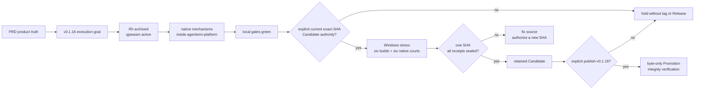

# Codex goal snapshot

状态：**历史目标快照；不替代当前版本计划。**  
执行真源：[`plan-v0.1.16.md`](plan-v0.1.16.md)。产品真源从
[`PRD.md`](../PRD.md) 进入对应 `prd/PRD_*.md` 模块。

## 目标

以 `plan/plan-v0.1.16.md` 的 Markdown-tree DAG 与 Mermaid memory palace
为持续更新的执行真源，收口 AgenTerm 0.1.16：保持 Rh 归档并由
qjswasm/tinyvm 接管活跃脚本门禁；把 Linux XKB 等原生机制收回
`agenterm-platform`；跑绿本地 lint、Quick、发布策略与精确 SHA Candidate
前置门禁；保持六格原生构建与执行验证。

权限边界：未经用户对 exact SHA 的明确授权，不 dispatch Candidate；未经
`publish-v0.1.16` 的明确授权，不 Promotion。

## Markdown-tree DAG

```text
v0.1.16 goal
├─ [x] script succession
│  ├─ Rh implementation and .rh corpus archived
│  ├─ qjswasm/tinyvm owns active .qjs execution
│  └─ bounded qjswasm check-many owns repository lint
├─ [x] native boundary
│  └─ Linux XKB startup mechanism owned by agenterm-platform
├─ [x] local exact-source gates
│  ├─ lint / Quick / release-policy checks green
│  ├─ documentation redaction green
│  └─ Candidate and Promotion workflow contracts reviewed
├─ [ ] exact-SHA Candidate
│  ├─ bind dispatch to the current origin/main SHA
│  ├─ run the single Windows stress qualification
│  ├─ build six OS/ISA archives
│  ├─ execute final archive bytes on six native runners
│  └─ seal hashes, sizes, SBOM, provenance and receipts
└─ [ ] Promotion
   ├─ require separate publish-v0.1.16 authority
   ├─ promote sealed Candidate bytes without rebuild
   └─ verify tag, Release asset set and post-release integrity
```

## Mermaid memory palace



## Snapshot boundary

- Candidate authorization is immutable-source authority, not permission for a
  later `main` commit. If `main` advances, inspect the delta and request authority
  for the new exact SHA.
- Candidate creates no tag and no public Release.
- Promotion is a separate human boundary and must never rebuild Candidate bytes.
- Current operational status and evidence remain in `plan/plan-v0.1.16.md`; this
  file preserves the goal shape so later agents do not reconstruct it from chat.
