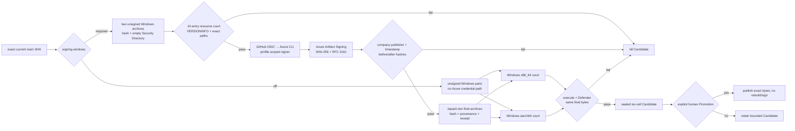

# Goal: company-sign AgenTerm Windows Candidate bytes

Outcome: when `release-policy.json` selects `signing.windows=required`, the
exact Windows bytes inside one exact-SHA Candidate are Authenticode-signed by
PARTNERNET SOFTWARE PTY LTD through Azure Artifact Signing, timestamped,
executed on both Windows ISAs, scanned by Defender, and sealed before the
human Promotion boundary. `off` remains a complete unsigned path and never
loads signing credentials.

Owner module: `prd/PRD_02_17_delivery_quality.md`. Operational authority:
`skills/agenterm-release/SKILL.md`. Company setup memory:
`skills/agenterm-release/references/company-signing-enrollment.md`.

## Markdown tree DAG

- [x] one company publisher, one product-specific OIDC identity
  - [x] shared Azure Artifact Signing Public Trust profile is Active
  - [x] GitHub Environment `release-signing` exists for AgenTerm
  - [x] its three protected provider-coordinate variables are copied from the
    shared company profile without exposing their values
  - [x] the AgenTerm-only Entra application and service principal exist
  - [x] the federated credential subject uses GitHub's exact immutable form
    `repo:<ORG>@<OWNER_ID>/<REPO>@<REPO_ID>:environment:release-signing`;
    owner/repository numeric IDs come from GitHub APIs and never enter git or
    public receipts
  - [x] its service principal has only `Artifact Signing Certificate Profile
    Signer` at the shared profile scope; no human signer role remains
  - [x] the Environment has three OIDC identifiers as secrets and three
    provider coordinates as variables. Values never enter git, workflow
    output, receipts, screenshots, or handoff text
- [~] exact signing allowlist: 10 PE files, no glob-discovered extras
  - [x] each Windows archive declares the same five entries in
    `scripts/artifacts.json`: `agenterm.exe`, `agenterm.com`,
    `agenterm-cc.exe`, `agenterm-cu.exe`, `agenterm.dll`
  - [x] public v0.1.16 baseline proves all ten are unsigned and the tiny
    `agenterm.com` has ample room below its 64 KiB release budget
  - [x] every entry has a nonempty `ProductName` and `ProductVersion` and an
    empty Security Directory before signing
    - [x] root package and ABI build scripts now branch on the Cargo target,
      compile VERSIONINFO on non-Windows hosts, and keep icons only on the two
      intended GUI binaries. Two-ISA MSVC inspection proves `agenterm.exe`,
      `agenterm.com`, `agenterm-cc.exe`, and `agenterm.dll` all carry the
      product/version fields with an empty Security Directory; the ARM64
      `agenterm.com` is 5,632 B and x86_64 is 6,144 B, below 64 KiB
    - [x] `agenterm-cu` owns its own target-aware VERSIONINFO build script;
      two-ISA MSVC inspection proves ProductName/ProductVersion and an empty
      Security Directory (ARM64 1,640,960 B; x86_64 1,776,128 B)
    - [x] Candidate installs/pins the resource compiler needed by the Linux →
      MSVC ARM64 cross-build instead of trusting runner ambient tools
  - [x] a policy test derives the two-ISA allowlist from
    `scripts/artifacts.json` and rejects missing, renamed, duplicate, or extra
    signing inputs
- [~] Candidate transformation, never Promotion mutation
  - [~] `signing.windows=off`: a credential-free finalizer copies the exact
    unsigned build parts into the canonical runtime/aggregate names; signing
    action, Azure login, Environment and receipt are absent. Source policy and
    actionlint courts pass; the next ordinary Candidate must provide live
    evidence
  - [~] `signing.windows=required`: after both Windows build parts exist, one
    `windows-2025` job downloads and verifies their unsigned archive hashes,
    extracts exactly ten inputs, and records before hashes. Its repo-specific
    OIDC identity, profile-scoped role and protected Environment values now
    exist; the first live signed Candidate court remains the missing evidence
  - [x] `azure/login` exchanges GitHub OIDC into a short-lived Azure CLI
    session; `Azure/artifact-signing-action` consumes only that credential
  - [~] sign with SHA-256 plus Microsoft RFC 3161 SHA-256 timestamp; verify
    company `O=`, timestamp certificate, VERSIONINFO, and byte mutation
  - [~] rebuild both Windows archives and adjacent hash/provenance from the
    signed bytes; forbid unsigned Windows archives from entering aggregate
  - [~] write one redacted `windows-signing-receipt.json` binding source SHA,
    run identity, ten before/after hashes, two archive hashes, byte counts and
    public certificate facts. It contains no Azure/OIDC resource coordinates,
    explicitly records `release_eligible=true`, and records `Valid` for each
    Authenticode result; QJS aggregate/verify rejects missing or inconsistent
    receipts
- [~] final-byte courts
  - [~] Windows x86_64 and aarch64 runners download only the canonical final
    part, verify archive and receipt hashes, run `agenterm.com cli --version`,
    and inspect all five signatures (or all five `NotSigned` states in `off`
    mode)
  - [x] Defender scans the exact extracted final directory on both ISAs
  - [~] Candidate aggregate requires both Windows PASS jobs and exactly one
    valid signing receipt when policy is `required`
  - [x] Promotion downloads the sealed Candidate and performs no build,
    signing, timestamping, scanning, or repackaging
- [ ] first-signature qualification
  - [x] shared provider/profile mechanism is proven by MiniCon's independent
    three-input, six-cell, explicitly non-promotable live court
  - [x] `windows-signing-qualification.yml` consumes one successful unsigned
    exact-SHA Candidate, signs the fixed ten-file set, audits a
    `release_eligible=false` receipt, then executes, verifies and Defender-scans
    the signed archives on both Windows ISAs without rebuilding; each runtime
    receipt's observed archive SHA must equal the signing receipt's after-SHA
  - [x] Candidate receipt validation still requires `release_eligible=true`,
    so qualification artifacts cannot be supplied to Promotion
  - [ ] first run of the qualification workflow needs a successful unsigned
    Candidate for the same current-main SHA; creating that Candidate remains
    under the repository's exact-SHA Candidate authorization boundary
  - [ ] after qualification passes, the owner may select
    `signing.windows=required` for one future exact SHA; do not retrofit v0.1.16
  - [ ] compare signed `agenterm.com` size against 64 KiB and every other file
    against `scripts/artifacts.json`; a budget failure blocks the Candidate
  - [ ] preserve the first run id/attempt and receipt as evidence; a successful
    signature alone is not a release approval

## Observable success and safe failure

Success is one sealed Candidate manifest whose Windows archives contain the
ten allowlisted signed PEs, whose receipt agrees with the final archive bytes,
and whose two native Windows courts both execute and scan those bytes. Any
missing Environment value, wrong publisher, absent timestamp, unchanged file,
foreign endpoint, resource/version gap, hash mismatch, unexpected path, runtime
failure, or Defender finding fails closed before Candidate sealing.

Excluded: Linux signing, Apple Developer ID/notarization, installer/MSIX work,
certificate export, PFX storage, changing public v0.1.16, and claiming that a
valid signature immediately eliminates SmartScreen reputation prompts.

Implementation owners: `.github/workflows/candidate.yml` controls the policy
split and final-byte topology; `scripts/windows-signing-candidate.ps1` owns the
exact archive/PE set, VERSIONINFO input court, signed repack and receipt;
`.github/workflows/windows-signing-qualification.yml` reuses that transformer
only in explicitly non-promotable mode;
`scripts/qjs/lib/release_candidate.qjs` binds the receipt and signed provenance
into Candidate verification.

## Mermaid flowchart memory palace

## Measured unsigned baseline

Public v0.1.16 archives were inspected on 2026-09-03. These values are
diagnostic baselines, not future budgets:

| File | win-x86_64 | win-aarch64 | v0.1.16 signature |
|---|---:|---:|---|
| `agenterm.com` | 3,584 B · no resource | 4,608 B · no resource | absent |
| `agenterm.exe` | 3,678,720 B · resource | 3,250,176 B · no resource | absent |
| `agenterm-cc.exe` | 681,984 B · resource | 562,176 B · no resource | absent |
| `agenterm-cu.exe` | 1,420,800 B · no resource | 1,304,064 B · no resource | absent |
| `agenterm.dll` | 663,552 B · no resource | 620,544 B · no resource | absent |
