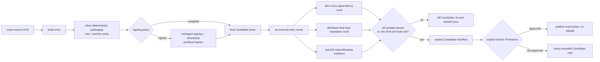

# Goal: absorb Minicon release lessons into AgenTerm

Outcome: AgenTerm keeps its exact-SHA Candidate → byte-only Promotion contract,
while adopting the release failures already paid for in Minicon: clean inputs,
visible size evidence, execute-only runtime courts, dependency-complete Linux
archives, explicit signing policy, and final-byte reputation checks.

## Markdown tree DAG

- [~] release optimization
  - [x] preserve one exact source SHA → one sealed Candidate → no-rebuild Promotion
  - [~] deterministic package bytes
    - [x] reclaim owned stale package scratch before staging
    - [x] record and report uncompressed payload bytes and archive bytes
    - [ ] reject unexpected files after extracting every archive
  - [~] six execute-only runtime courts
    - [x] six native runners download the matching final archive; runtime jobs
      have no checkout and no Cargo/cosmocc/build step
    - [x] every runner verifies archive SHA-256 and executes the packaged
      console version probe on its real OS/ISA
    - [x] Linux package gate binds the known
      `libxkbcommon-x11.so.0 → libxcb-xkb.so.1` transitive edge, then a pinned
      package-free Ubuntu container runs `ldd` over every bundled library and
      executes the packaged CLI without installing runtime or `-dev` packages
    - [ ] Windows courts execute the final PE bytes, not pre-package binaries
    - [ ] macOS courts cover arm64 and real Intel runner/Rosetta evidence distinctly
  - [ ] provider-neutral signing policy
    - [x] checked-in `release-policy.json` explicitly selects unsigned preview
      or required macOS signing; missing credentials never silently choose policy
    - [~] Windows/Linux modes are explicit `off`; Azure Artifact Signing adapter remains
    - [ ] signing changes bytes only before Candidate sealing
    - [ ] receipt binds pre-sign and final SHA-256 plus timestamp evidence
  - [ ] final-byte reputation court
    - [x] Defender scans the exact extracted Windows Candidate files on both
      native ISA runners, after archive SHA verification and execution
    - [ ] no UPX or opaque executable compression in public assets
    - [ ] third-party heuristic results are qualification evidence, not an installer dependency
  - [ ] delivery latency and cleanup
    - [ ] report cold/cache-hit build time separately from six runtime time
    - [ ] retain only bounded evidence and reclaim failed/stale staging trees
  - [ ] evidence and delivery
    - [ ] Candidate manifest proves six cells, sizes, hashes, provenance and court receipts
    - [ ] Promotion only publishes the manifest allowlist after explicit human approval

Dependencies: deterministic packaging precedes runtime courts; signing precedes
final-byte reputation checks; all courts precede Candidate sealing; Promotion is
the final human-authority boundary. Minicon's APE/container format is excluded:
only its general release lessons transfer.

## Mermaid flowchart memory palace

## Current evidence

- `scripts/qjs/package-client-release.qjs` owns fresh staging and records both
  uncompressed payload and compressed archive sizes in provenance.
- `scripts/qjs/candidate-aggregate.qjs` carries payload size evidence into the
  sealed manifest; `scripts/qjs/lib/release_candidate.qjs` verifies it.
- `.github/workflows/candidate.yml` publishes the six raw/archive byte pairs in
  the Candidate summary so size drift is visible before Promotion.
- The Candidate Linux legs extract the public archives and reject the known XKB
  transitive-dependency leak before those archives reach the sealed byte set.
- `release-policy.json` is hashed into the Candidate manifest. It selects the
  macOS signing lane from source control and records Windows/Linux signing plus
  executable-compression policy without relying on absent secrets as choices.
- `.github/workflows/candidate.yml` and `.github/workflows/release.yml` remain
  the Candidate and Promotion authorities. Remaining unchecked leaves are not
  release claims.
- The Candidate runtime matrix uses native Windows, Linux, and macOS runners
  for both x86_64 and aarch64. Aggregate cannot seal bytes unless all six
  downloaded archives pass hash and packaged-binary execution.
