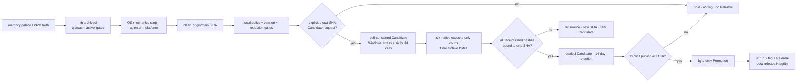

# AgenTerm v0.1.16 公开计划

状态：**发布链修复中；本版是 Chassis-L1/L2/L3 后的第一发**（产品尾叶不阻塞本发）
不创建 tag / Candidate / Release，除非人工明确授权。  
版本列车停在 **0.1.16 代码线**；本文件是 **当前列车执行投影**，不替代 PRD。

**当前唯一收口主题：修复 v0.1.16 exact-SHA CI / Candidate 发布链；公开 Promotion
仍需对具体 Candidate 的独立人工授权。**

## 当前发布前沿（2026-08-31）

下面是现行执行索引；本文后面的 Rhai、旧 `ci.yml` 前置条件和失败 run 叙事
都是历史证据，不再覆盖本节。当前脚本引擎是 `.qjs` → qjswasm/tinyvm，普通
push CI 已停放为 `.disabled`，Candidate 自己拥有完整资格门。

```text
v0.1.16 release DAG
├─ [x] identity
│  ├─ Cargo.toml = 0.1.16
│  ├─ release-policy.json = 0.1.16
│  └─ origin has no v0.1.16 tag or Release
├─ [x] script-engine succession
│  ├─ rh implementation and `.rh` corpus remain archived
│  ├─ qjswasm/tinyvm owns the active `.qjs` runtime
│  └─ bounded qjswasm `check-many` owns repository-wide script lint
├─ [x] Minicon lessons absorbed
│  ├─ clean deterministic staging + raw/archive byte evidence
│  ├─ six native build cells + six execute-only final-archive courts
│  ├─ native Linux arm64 package + package-free dependency-closure court
│  ├─ executable compression off + final Windows Defender court
│  └─ checked-in optional signing policy; no certificate implied by review state
├─ [~] local release contracts
│  ├─ release_workflow_policy: 11/11
│  ├─ internal-version-policy: pass
│  ├─ documentation redaction: pass
│  └─ Linux XKB native startup mechanism → agenterm-platform (implementation
│     moved; integrated Quick rerun pending)
├─ [ ] exact-SHA Candidate
│  ├─ requires clean current origin/main and explicit exact-SHA request
│  ├─ one Windows stress qualification
│  ├─ six archives execute on matching native OS/ISA runners
│  └─ aggregate seals manifest, hashes, sizes, SBOM, provenance and receipts
└─ [ ] public Promotion
   ├─ separate explicit `publish-v0.1.16` human authority
   ├─ promote sealed bytes without rebuild/sign/package
   └─ tag + exact asset set + post-release integrity must all pass
```



Chassis 加速（不替代 Candidate 授权）：[`CI / chassis`](../.github/workflows/ci-chassis.yml)
只编 `agenterm-chassis` 六格；L2 跨架构打包走
[`scripts/chassis-ci-pack.py`](../scripts/chassis-ci-pack.py)，**不编工作台 PE**。
公开 Promotion 仍要独立人工授权。

未完成产品叶 **不再经过 v0.1.17 列车**。v0.1.17 未开工即归档；叶合同在
[`plan-v0.1.18.md`](plan-v0.1.18.md) **§11 轨 B**（历史快照
[`archive/plan-v0.1.17.md`](archive/plan-v0.1.17.md)）。v0.1.16 执行中超额完成的三轨
（agenterm-con 产品化、QuickJS 引擎、跨引擎共享层 + SQL）保留为已完成事实，
但不再消耗本版剩余工时。

> 产品不变量（已拍板，不得回退）：**GUI 不独占 server**。同一 server 允许多个
> 并发交互 GUI（`ui-lease` 多租约，上限 16）。`As Window` = 再开一扇窗，
> **不是**抢唯一租约、也不是 handoff 到现有窗。

上版工作树与证据：[`plan-v0.1.15.md`](plan-v0.1.15.md)（must-ship 主体已合 main；
公开发版仍未授权）。**本发之后的下一列**：[`plan-v0.1.18.md`](plan-v0.1.18.md)
（不单开 v0.1.17）。结构 SSOT：[`ARCHITECTURE.md`](ARCHITECTURE.md)。

---

## 0. 基线事实（2026-08-06 → 08-07）

### 0.1 v0.1.15 已在 main 的主波（不重做）

| 组 | 已合要点 |
|----|----------|
| **R/A′** | cache slim + restore-keys、net-research 出 release 门、script-smoke 左移、step summary |
| **G′** | `--version`、orphan symlink、releases keep、升级提示文案 |
| **H′** | releases.json 派生、provenance 补值；发布后完整性门现将该索引纳入精确资产集并绑定 sealed manifest / SHA / tag / 六平台身份 |
| **S′/U′** | server strip、同窗 attach、U1/U3 假刷新止血 |
| **B′** | buffer/send-keys 主路径；mux/mcp **独立 PE 移除**，CLI 子命令保留 |
| **租约** | multi-lease + `As Window` 强制 `--ui-client`（`94f0990`） |
| **Unix** | 逐终端 Settings（pri-1）、顶栏 server strip（`dd2bc29`） |
| **rh** | rh-3a…3d + corpus 扫描已合；**M22f 默认 rh 后端** + `agenterm-rhai` 薄壳已合；M23 扩面轨见 [`plan-rh-3.md`](plan-rh-3.md) §5 |

### 0.2 用户现场仍开的痛点（驱动本版主题）

1. **激活标签 As Window「没效果」/ 警告框** — 根因组合：旧 server 独占逻辑 +
   launcher handoff（无 `--ui-client`）+ 进程未退干净。代码已修；**证据与
   重启纪律**仍缺产品化（已迁 v0.1.17 **W1**）。
2. **「奇怪问题」** — 多窗/多实例路径上仍有边角（菜单 z-order 曾盖、strip 布局、
   脏进程混跑）；本版只收**可复现、可证伪**叶，不扩成大重构。
3. **Unix 多实例 UX** — Settings 与 strip 已开始补；**instance picker /
   open-instance / As Window 语义**在 macOS/Linux 仍不完整（0.1.15 §11.3 优先
   级 2/4 未齐）。

### 0.3 已知测试/证据债（T-debt 已迁 v0.1.17，仅记录不阻塞本版）

- 集成/发布链偶发红：`linux_package`（缺 SBOM 类产物）、`supply_chain` 计数 pin
  —— 已迁 v0.1.17 认领
- R1/R2 配置已合，**连续 Candidate `worker.state=reused` + cache &lt;8GB** 仍缺
  观测勾选 —— 已迁 v0.1.17
- U2 真机回归、R4 dry-run 真跑：配置/代码在，**人工证据**未收
  —— 均迁 v0.1.17；R4e 只承接本版发布链最终仍缺的证据
- 11 个文件有未提交变更（见 git status）—— 本版验收前需清理提交

---

## 1. 收敛工作树（**可执行清单**）

选择原则（继承 v0.1.14/15）：**宁可少而全绿，不要多而半途**。  
叶定义：用户问题 · 不变量 · 可观察证据 · 安全失败 · 黑盒 owner · 非目标。

### W. 多 GUI / 多窗产品面（定义保留；执行已迁 v0.1.17）

```text
W. Multi-GUI productization
├─ → v0.1.17 W1 重启纪律 + 状态可观测（用户/agent 能分辨新旧 PE 与 lease）
├─ → v0.1.17 W2 As Window 黑盒：激活标签 → 第二 GUI + 第二 lease（非 handoff）
├─ → v0.1.17 W3 ui-lease status 多 clients 可观测（CLI / snapshot 不谎称独占）
└─ → v0.1.17 W4 残留独占文案/路径审计（错误串、handoff 消息、PRD 措辞）
```

- **W1 重启纪律与版本可观测（已迁 v0.1.17）**
  - **用户问题**：混跑旧 server/GUI → 警告框或「没反应」，误判产品坏了
  - **做法**：文档/状态栏/错误文案明确「须退干净 server」；可选用
    `server-list` + `--version` 对照表写进 agent 指南短节；不自动杀会话
  - **验收**：干净重启路径写进 README/Agents 短段；用户按步骤可复现 W2
  - **非目标**：静默 `taskkill` 全部 agenterm；削弱 keep-server
  - **成本**：小；**依赖**：无

- **W2 As Window 黑盒（激活标签；已迁 v0.1.17）**
  - **用户问题**：右键 As Window 必须**真开第二窗**
  - **不变量**：spawn 带 `--ui-client`；允许 `--endpoint`+`--instance`；
    multi-lease attach 成功
  - **验收**：隔离 workspace：附着 strip 激活芯片 → As Window →
    进程数 +1、`ui-lease status` clients≥2、两窗均可交互；失败弹框文案可理解
  - **成本**：中（黑盒/smoke）；**依赖**：W1 干净环境

- **W3 多 clients 可观测（已迁 v0.1.17）**
  - **做法**：`ui-lease status` / 相关 snapshot 字段诚实列出 `clients[]`；
    文档不写「唯一 GUI」
  - **验收**：两 GUI 附着时 status JSON `attached=true` 且 clients 长度≥2
  - **成本**：小–中；**依赖**：W2

- **W4 独占语义清扫（已迁 v0.1.17）**
  - **做法**：全仓搜 `exclusive` / `already attached` / handoff 误导文案；
    产品路径不回退 `2d1c235` 式「只 focus 不双开」作为 As Window 默认
  - **验收**：As Window 路径单测/源码锁仍要求 `--ui-client`；PRD multi-lease 一致
  - **成本**：小；**依赖**：无

### Ux. Win 现场尾账（定义保留；U2/U4/S4 均已迁 v0.1.17）

```text
Ux. Windows residual UX
└─ → v0.1.17 U2 标签切换假刷新真机回归（0.1.15）
```

- **U2（已迁 v0.1.17）** — 空 composer 连点 tab：无 ComposerDraft 风暴；可选黑盒
- ~~U4~~ — 已迁 v0.1.17（可选协议优化）
- ~~S4~~ — 已迁 v0.1.17（同窗热切换权威边界）

### O. Unix 多实例可达（OSX 主责 `unix/frontend`）

> 对照 [`plan-unix-gui-win-parity.md`](plan-unix-gui-win-parity.md) 与
> 0.1.15 §11.3。Settings（pri-1）与 server strip 已开；本版收 **可达闭环**。

```text
O. Unix multi-instance reachability
├─ [x] O-P2 Instance picker（模态 + 6 个 ui-action 接线）
├─ [x] O-P4 open-instance / 新窗拉起（含 As Window 语义对齐）
├─ [x] O-P3 strip 右键菜单深度（Close / As Window 与 Win 行为契约）
└─ → v0.1.17 O-evidence macOS 真机：strip 切换 + 第二窗 attach
```

- [x] **O-P2** — 已消灭。Unix 画 + 6 个 action 接进 **shared `control_dispatch`**
  （不是 Unix adapter），两端一份实现。实测：6 行、next/prev/select --name
  可用、confirm 开窗后关闭模态、cancel 关闭；坏名字报
  `instance \`nosuch\` is not in the picker list`。
  **`WINDOWS_ONLY_UI_ACTIONS` 归零**（三个提交前是 14），SHARED 58。
- [x] **O-P4** — `spawn_gui_for_instance` 已落地。路上修了个真 bug：原来同时传
  `--instance` 和 `--endpoint`，被 `parse_gui_launch_target` 判为冲突选择器，
  **子进程其实起不来**；现在二选一。
  ⚠️ **未对齐 `--ui-client`**：Unix 嵌入式 frontend 没有 lease rebind，
  `As Window` / confirm 一律**开新窗口**而不是原地切换。这是有意的语义差异
  （假装切换但没切比明确开窗更糟），不是遗漏 —— 要真对齐需要先给 Unix 做 lease。
- [x] **O-P3** — 右键菜单 `As Window` / `Close` 已上线，菜单最后绘制所以压在
  strip 和工作区之上。菜单 item bounds 进 `ui-snapshot`，agent 可用
  `ui-input pointer` 驱动。
  ⚠️ **Close 没有确认框**：Unix 无 `ModalSurface::ServerClose`，写一半会让用户
  卡在无法 confirm/cancel 的死状态，所以改为直接执行 + 两道 guard（stale 行、
  自己的 server 都拒绝，实测 GUI 存活）。已留 `TODO(macos)`。
- **O-evidence（已迁 v0.1.17）** — 真机表：切换 instance、As Window、keep-server 后再附着

**禁区**：Lnx 与 OSX **不同时**写 `unix/frontend/**`（继承 0.1.15 §2.2.1）。

### C. 控制台宿主（agenterm-con.exe）

> 动机：cmd.exe 不稳定 + agenterm.exe 自身开发时被锁无法覆盖 → 需要一个
> **最小可用、不依赖 agenterm server** 的控制台宿主（对标 Windows conhost.exe）。
> 基于 `crates/agenterm-platform` 薄封装，预留未来作为 Windows server attach 体。
>
> **目标升级（2026-08-08，人工指示）**：从「最小可用」改为 **要比系统自带
> conhost 做得更好**。这不是加花活，而是先把 conhost **已经做到、而我们没做到**
> 的补齐（见 C5/C6），再谈超越。原 C2 的「非目标：raw mouse / bracketed paste」
> 是最小可用时代的取舍，**已作废**——本宿主存在的理由就是跑 TUI agent，
> 而 TUI agent 恰恰需要这两样。

```text
C. Console host (agenterm-con.exe)
├─ [x] C1 最小 ConPTY 窗：开窗、起 shell、pty 泵、渲染（platform 直调）
├─ [x] C2 键盘输入 + 鼠标选择 + 剪贴板（复用 platform 的 input/clipboard 封装）
├─ [x] C3 滚动缓冲区 + 字体/DPI 跟随（滚轮回看、Ctrl+滚轮变字号即时重算 grid）
├─ [ ] C4 server attach 预留（非目标，优先度低于 W/O，本版不发）
├─ [x] C5 认下应用协商的输入契约（DECCKM / 修饰键 / bracketed paste / 鼠标上报）
├─ [x] C6 IME 恢复 + 合成串行内渲染（中文可输入）
├─ [x] C7 块光标可读 + 双击选词 / 三击选逻辑行（conhost 有、我们缺的两项）
├─ [x] C8 `-e/--command` 托管指定程序 + 参数解析可单测
├─ [x] C9 CJK 字形回退链（截图发现：中日韩原本渲染成空白格）
├─ [x] C10a fill_rect 根源 bug：背景色/下划线/选区/光标全部只画在第 0 列
├─ [x] C10b DECSCUSR 光标形状 + 闪烁（conhost 没有，vim 插入/普通模式区分靠它）
├─ [x] C10c 构建卫生：incremental 缓存 12GB→1.3GB，接入 bootstrap 单点
├─ [x] C11 `--emit-snapshot`/`--script`/截图：agent 可编程接口（见下）
└─ [ ] C10d 未做的超越面 → **已迁 v0.1.17**（回看搜索、OSC 8 超链接、脏行重绘）
```

> **2026-08-12 后续边界收敛：**C11 记录的是当时交付历史，不再代表当前公开面。
> `agenterm-con` 已删除 `--script` parser/runtime；原有黑盒 journey 迁移为测试侧调用
> `agenterm-con cli` 的 text/paste/key/mouse/wheel/wait/screenshot 公共 control 命令。
> `--emit-snapshot` 仍是结构化观察接口。当前真值以 `plan/ARCHITECTURE.md` 和
> `prd/PRD_02_01_terminal_runtime.md` 为准。

**里程碑状态（2026-08-08，二次复核后）**：C1–C3、C5–C9、C10a–c、C11 均已完成，
**且第二轮复核（人工要求"反思，别轻易以为完成了"）额外挖出并修了一个真 bug**
（见 C11 的 child-exit）。`agenterm-con` 现状：可编译可运行、40 项单测 + 8 项
黑盒集成测试全绿（+1 项诚实标记为已知未解决问题，见下）、clippy 双 crate
（`agenterm-con` + vendored `vt100`）零警告。C4（server attach）与 C10d
明确列为**非本版目标**。

**仍未解决 / 仍未验证的缺口（如实列出，不装作齐了）**：
1. ~~**方向键在真实 shell 里不生效**~~ ——**2026-08-11 已根治**：根因不是
   VT encoder，而是 native console input 的 attach/锁/RAII authority 分散在
   rmux 与 platform 两层。Windows PTY adapter 现直接在共享 `ConsoleGuard` 下构造
   `KEY_EVENT_RECORD` press/release pair 并调用 `WriteConsoleInputW`；attach 已存在时
   对 `ERROR_ACCESS_DENIED` 执行受锁的 detach/retry。原 ignored cooked-shell 测试、
   real `less` ArrowDown 与 alternate-screen wheel 测试均提升为默认门并通过。
2. **IME 端到端从未自动化验证过**——一直标注"待人工验证"，这轮也没有变，
   因为没有可编程的方式驱动真实输入法。
3. ~~**鼠标事件没有进 `--script`**~~ ——**2026-08-08 已补**：新增
   `click`(row/col/button[+ctrl/alt/shift])/`mouse_move`(row/col)/
   `wheel`(row/col/notches) 三个命令，都走真实路径——`click` 是
   `handle_pointer_button` 的按下+抬起一对（应用抓鼠标优先，本地
   点击计数/选区其次，和真实点击完全一致的分支），`mouse_move` 是新拆出的
   `handle_pointer_moved`（原来内联在 `PointerMoved` 事件分支里，拆出来
   是为了脚本和真实指针事件走同一份代码，不是各自维护一份），`wheel` 直接
   调用 `handle_wheel`。坐标是格坐标（行/列），不是像素——脚本作者按格子
   想事情，`terminal_point_to_logical`（`hit_test` 的反函数，取格子中心
   而非左上角，避开截断除法的边界）负责换算成 handler 要的像素位置。
   **顺手挖出一个真 bug**：`scroll_by` 的上界算成
   `screen().scrollback() + scroll_offset`——但 vendored vt100 的
   `Screen::scrollback()` 文档写明返回的是**当前**滚动偏移，不是可用范围，
   于是上界恒等于 `2 * scroll_offset`，从底部开始永远是 0，**滚轮向上翻
   在真实会话里从没生效过**。既有单测 `scrolling_clamps_to_available_scrollback`
   测不出来——它只测"没滚出去过东西"的场景，这时"正确地钳到 0"和"算错了
   所以恒为 0"看起来一模一样。只有真会话里先滚出真内容、再滚轮的黑盒测试
   （新增的 `scripted_wheel_moves_the_real_scrollback_offset_up_then_down`）
   能分辨两者。修法：不在 `scroll_by` 里自己猜上界，直接把请求值丢给
   `Screen::set_scrollback`（它内部已经正确钳到 `self.scrollback.len()`），
   再把钳过的结果读回来——顺带补了一条单测
   `scrolling_up_actually_moves_once_real_content_is_off_screen` 钉死这个
   区分度，不依赖真实进程也能挡住这个回归。8 条新单测 + 2 条新黑盒集成测试
   （click 落点选区、wheel 双向滚动）全绿；`--help` 同步更新。~~不在本轮范围
   （仍是已知缺口）：Ctrl+滚轮缩放没有脚本命令~~——**2026-08-08 已补**，
   见下方"Ctrl+滚轮缩放崩溃"条。拖拽手势（连续 mouse_move 之间保持
   按钮归属)只在真实指针事件下验证过，脚本层还没写覆盖拖拽的黑盒测试。

**2026-08-08 用户反馈：Ctrl+滚轮缩放到某个尺寸时进程"自杀退出"（之前一轮
`3d23dfde` 报过、未复现）**——本轮把 Ctrl+滚轮缩放逻辑拆成 `zoom_font`
方法并接进 `--script` 的 `wheel` 命令（加 `ctrl: true`），使其第一次可以
被脚本/测试真正驱动到（此前 `--script` 完全够不到这条路径，`3d23dfde`
只能做独立、单次的 `apply_resize`/`font::raster` 静态扫描，测不出"一串
真实、累积的缩放操作打在一个活的 ConPTY 会话上"这种情形）。用这条新能力
写了个真复现尝试：20 轮"缩到最大→缩到最小"的完整循环、循环内部**不插入
任何等待**（1600 次连续 `zoom_font` 调用背靠背打出去，刻意模拟快速滚轮
甩动而非慢慢滚），跑在真实 ConPTY 会话上。

**如实记录结果：没能复现**——无论是走可靠的 Rust `Child`/`try_wait` 进程
句柄（黑盒测试用的那条路），还是（可信度更低）绕开测试框架、用裸 shell
脚本后台跑+轮询快照的临时手段（后者一度看到 `child_alive:false` 但进程
本身没退出——重新用可靠的 Rust 句柄跑同一个场景没能重现，判定是 Git Bash
`timeout`/后台任务对 Windows GUI 子进程信号投递的已知怪癖，不是真崩溃）。
已把这条重压力测试留作永久回归覆盖——如果它以后真的抓到崩溃，那就是它
该干的事，不代表这轮白查。`3d23dfde` 当时唯一对得上的证据是一份
`agenterm.exe`（主 GUI，不是 `agenterm-con`）的 WER 报告，按当时方向未
深挖；这条线索仍然开放，值得向用户多要点细节（具体哪个 exe、是否真实
DPI 缩放变化触发、大概在哪个字号、放大还是缩小方向）才好继续追。

**同一天，继续挖，不再问用户细节（用户明确要求别再打断，自己去查）——
两个真改动，一个确认排除、一个真 bug**：

- 用户补充：**放大时**崩溃（不是缩小），且崩溃前后**没有任何提示、窗口
  直接消失**——没有系统对话框，也没检查事件查看器。"没有提示直接消失"
  这个描述本身是条线索：跟 `panic = "abort"`（release profile 早就配了）
  下任意一处 panic 的表现完全吻合——abort 在这台机器上不弹 WER 对话框，
  跟"优雅退出"和"崩溃"在用户侧看起来一模一样，唯一能分辨的只有代码审查。
- **排除**：`zoom_font` 原来对**每一次**滚轮刻度都同步做一次完整的
  grid+PTY resize，**零防抖**——跟窗口拖拽 resize（早就走 `RESIZE_DEBOUNCE`
  60ms 防抖）不对称。假设：快速滚轮甩动在几百毫秒内炸出十几次 resize，
  如果**被托管的程序**（不是 `agenterm-con` 自己）扛不住这种通知风暴而
  崩了，`agenterm-con` 会按自己的既定设计（子进程退出 → 自己也退出）
  正确地跟着关窗——用户看到的就是"窗口直接消失、没有报错"，即使
  `agenterm-con` 自身代码完全没 bug。用 `less`（会真的对每次 resize 重绘，
  不是闲置的 cmd 提示符）连续甩 28 次不间断滚轮刻度，走可靠的 Rust
  `Child`/`try_wait` 句柄测——`less` 没死。**这个假设没坐实，但修了**：
  `zoom_font` 拆成"字号度量立即重算"（缩放视觉上仍然是瞬时的）+"grid
  reflow / 真 PTY resize 通过 `pending_geometry` 复用窗口 resize 那套
  防抖"两半，不管是不是真根因，"疯狂滚轮炸给被托管程序一堆通知"本来就
  不是好设计，顺手对齐。
- **找到一个真的、可复现的内存安全问题**（不是"没排除"，是实打实的
  bug）：`font.rs` 的 `raster_uncached` 里，字形宽高直接取自
  `ab_glyph::OutlinedGlyph::px_bounds()`——**字体文件自己给出的数据**，
  没有上界。原代码 `(width * height) as usize` 先在 `u32` 里做乘法**再**
  转宽到 `usize`——release 构建没开 overflow-checks，溢出会**静默回绕**
  （debug 构建会直接 panic，掩盖了这条）。回绕后的乘积如果比真实
  `width*height` 小，分配出来的 `alpha` 缓冲区就偏小，但下面 `draw`
  回调的下标计算用的还是**没回绕的真实 width**——这是一次**越界写**，
  不只是分配过大。任何一处 panic，在这个二进制的 release profile
  （`panic = "abort"`）下都是静默、无提示的整进程退出——跟用户描述的
  症状严丝合缝。是否字号越大越容易撞上（大字号意味着请求的 px_bounds
  更大）也说得通，但这台机器装的字体没能触发（`raster_uncached`
  的 `size_px` 已经被 `raster()` 钳到 `[8,72]`，本机字体在这个范围内
  没有产出过病态外框，所以本轮所有复现尝试在本机都没炸——这本身跟"用户
  能稳定复现、这台机器复现不了"完全自洽）。**已修**：拆出纯函数
  `clamp_glyph_dims`（宽高各钳到 4096px，`[8,72]` 范围内任何正常字形都
  远够不到这个上限），3 条新单测钉死正常尺寸/病态溢出形状/NaN-负数-无穷
  三类边界，不需要真的找到一个会触发的字体文件就能测。**没法 100% 确认
  这就是用户遇到的那个根因**（没有用户那台机器的字体，验证不了"哪个
  具体字形在哪个尺寸炸"），但这是一处真实、可读代码就能确认的越界写
  漏洞，修复本身站得住，不依赖复现结果。

**第三轮：复现成功，根因坐实——不是字形溢出，是 resize 把宽字符劈成
两半（`third_party/vt100/src/row.rs::Row::resize`）**

用户回报"偶尔还是会自杀"。这轮不再靠静态审计，直接**驱动真实窗口**：
`Win32_Process.Create` 出跨 job 的 `agenterm-con.exe`（agent 的 job 会杀
子 GUI，见 `skills/agenterm-windows-gui-ops`），`SendForegroundWindow` +
按住 Ctrl 的 `mouse_event(WHEEL)` 真滚轮，每轮 40 刻度放大 + 40 刻度缩小，
夹杂随机窗口尺寸变化，stderr 重定向到文件（GUI 子系统进程仍然继承被
重定向的句柄，panic 信息因此可见）。**第 3 轮就炸了**，两次独立运行都在
第 3 轮，panic 位置一模一样：`third_party/vt100/src/screen.rs:943` 的
`Option::unwrap()` on `None`。

根因链条（每一环都可读代码确认，且有确定性单测）：

1. 放大字号 → cell 变大 → `compute_grid` 算出的 **cols 变少** →
   `apply_resize` 调 `vt100::Screen::set_size(rows, cols)`。
2. `Grid::set_size` 对每一行调 `Row::resize(cols, …)`，它只是
   `Vec::resize` **截断**——如果一个宽字符（CJK/emoji）正好跨在新的右
   边界上，**续格（wide continuation）被截掉，左半格留在最后一列成了
   孤儿**。`Row::truncate` 早就为这件事清过孤儿，`Row::resize` 没有。
3. vt100 全crate 依赖"宽格后面必定跟着续格"这条不变量。孤儿产生后，
   shell 往那一格写**任何一个普通窄字符**，`Screen::text` 就会去取
   `col + 1` 的邻格并 `.unwrap()` 一个 `None` → panic。
4. release profile 是 `panic = "abort"` → **整进程静默退出、无对话框、
   窗口直接消失**。跟用户描述逐字吻合，也解释了"放大时才炸"（只有放大
   才减列、才截断）。

**为什么前两轮复现不出来**：缺的不是字号跨度也不是滚轮速率，是**屏幕上
得有宽字符，且它得落在新的右边界上**。前两轮的复现脚本要么 `-e less`
要么纯 ASCII，要么让输出走固定 grid。这台机器（和用户那台）是中文
Windows，`cmd.exe` 开场白本身就是
`Microsoft Windows [版本 …]` / `(c) Microsoft Corporation。保留所有权利。`
——满屏 CJK，所以真实会话从第一帧起就带着触发条件，而脚本化测试没有。
"偶尔"也就解释清楚了：取决于列边界正好落在哪个 CJK 字之间、以及之后
有没有东西写到那一格。

**已修**：
- 根因修复 `Row::resize`：收缩时若新的最后一格是宽格，按 `truncate` 早
  就在做的同一套逻辑清掉它。**只改这一处就够**——把下面那条防御性改动
  撤掉、只留这一处，三条新测试全绿。
- 防御性加固 `Screen::text` 里三处"宽格必有邻格"的 `.unwrap()`：改成
  `if let Some(…)`，让将来任何未知路径再制造出孤儿时退化成一个渲染小
  瑕疵，而不是弄死一个 conhost 替代品。**诚实说明：根因修复之后这三处
  已经没有可达路径，所以这条改动没有能失败的测试**（实测：只撤掉根因
  修复、只留加固，不变量测试照样 FAIL，说明加固只是遮住 abort、没有
  修复不变量）。留着是因为 `panic = "abort"` 下这三行的代价是"整个窗口
  消失"，不对称得离谱。
- 三条测试（`cargo test --bin agenterm-con`）：
  `narrow_write_over_a_wide_cell_orphaned_by_a_zoom_in_resize_survives`
  （最小复现，改前 panic 在同一个 `screen.rs` 行号）、
  `shrinking_a_grid_never_leaves_a_wide_cell_without_its_continuation`
  （cols 2..=12 扫不变量，**唯一能钉死根因修复的那条**）、
  `zoom_in_sweep_while_printing_cjk_never_aborts`（产品层：整段放大扫掠
  × 3 种窗口尺寸 × 3 种 DPI，边扫边灌中文输出）。

**修复后实测**：修好的 release 二进制连打 **24 轮 × 90 刻度 = 2160 次
真滚轮** + 8 次窗口尺寸变化，全程存活；作为对照，**仓库里 `dist/` 那份
旧二进制（08-08 14:33，早于所有修复）在同一套压力下第 6 轮就静默死了**，
panic 位置同上。

**顺带确认的两件事**：
- `dist/agenterm-con.exe` 停在 08-08 14:33，早于防抖（18:59）和
  `clamp_glyph_dims`（19:04）——**用户手上跑的一直是修复前的构建**。
- `overflow-checks`：这轮的根因是 `.unwrap()`，不是整数回绕。评估结论是
  **release 不该开**——`panic = "abort"` 下开 overflow-checks 只会把无害
  的回绕升级成必然的进程死亡，方向是反的。正确姿势是让 debug 构建
  （本来就开着 overflow-checks + debug_assertions）**真的去跑真实交互
  路径**，也就是这轮用的驱动方式；这次正是 debug 二进制先把 panic 位置
  喊出来的。`catch_unwind` 同理走不通：`panic = "abort"` 下 abort 发生在
  展开之前，catch_unwind 抓不到任何东西，装上去只是自欺。

4. **部分已补**：找到了那个"确定性安装、体积小、行为可预期"的 TUI 依赖——
   `less`（随 Git for Windows 一起装的 `usr\bin\less.exe`，这台机器上是
   Git for Windows 随附的 `usr/bin/less.exe`；开发机装 Git 是近乎普遍的前提，
   所以可移植性不算差）。新增 `real_tui_less_scrolls_via_character_and_space_keys`：
   真正驱动一个 raw/cbreak 模式的 curses 风格 TUI（不是 cmd.exe 那种
   cooked-mode 行编辑器），证明字符键（`j`）和空格键的转发链路
   （`forward_key` → `write_pty`）在真会话里对真程序确实生效——这是此前
   完全没有的证据类别，不只是编码器层 + 单进程覆盖。**2026-08-11 已补齐
   DECCKM/方向键半面**：`real_tui_less_arrow_keys_and_alt_screen_wheel_scroll`
   已从 ignored 缺口提升为默认门，真实 ArrowDown 和 alternate-screen wheel 均能
   推进 `less`。仍未做：更复杂的 TUI（vim 普通/插入模式切换、鼠标点击上报）。

**2026-08-08 用户反馈两条，均已处理**：

1. **打字卡顿，经常半秒才响应**——根因找到且已实测确认：`PixelWindowEvent::
   Wake`（PTY reader 线程收到真输出时 `waker.wake()` 触发，也就是"键盘回显
   到了"这唯一的信号）落进了 `_ => Continue` 通配分支，从不请求重绘；
   `agenterm-platform` 的 `dispatch_event` 通用分发路径本身也不会自动重绘
   （只有 `dispatch_geometry` 会）。于是唯一偶尔把画面刷出来的是**跟这次
   输入完全无关**的光标闪烁定时器（`BLINK_INTERVAL` 530ms）。**实测**（临时
   把修复退回去，验证回归测试真的能分辨两种情况）：同一台机器上，修复后
   稳定在 650–700ms（这段时间基本是脚本刻意等的 400ms + 正常窗口/ConPTY
   启动开销），修复前反复量到 2.9–3.3 秒——比"经常半秒"这个描述还更糟，
   不只是"符合"。修法：`Wake` 和 `Keyboard`（后者覆盖纯本地效果——闪烁
   重置、复制粘贴快捷键、IME，这些不该等 PTY 往返）都补上
   `window.request_redraw()`。新增 `typed_input_echoes_back_well_under_
   one_blink_cycle` 黑盒回归测试（时间阈值取在两种实测分布的安全中点，
   不是精确证明——共享机器上真墙钟计时天然有噪声，但已验证能分辨修复前后）。
2. **生成的 exe 比 conhost.exe 大了近一倍**——**结论：现在不是**。在一个隔离
   `git worktree` 里（根 `Cargo.toml` 当时因为另一个 agent 在制品的 LuaJIT
   vendored 构建卡死，没法直接 `cargo build --release` 整个工作区）临时去掉
   与 `agenterm-con` 无关的 `agenterm-rh`/`agenterm-lua`/`agenterm-qjs`/
   `rhai` 依赖并加 `autolib = false`（跳过用不到这些的根 lib target），
   干净跑通当前 `[profile.release]`（`opt-level="z"`/`lto="thin"`/
   `codegen-units=1`/`panic="abort"`/`strip=true`，7 月 27 日
   `d9eebd5f` 起已生效）后的 `agenterm-con.exe`：**880,640 字节**，
   比 `conhost.exe`（987,136 字节）还**小约 11%**，不是大近一倍。
   `cargo tree` 复核依赖面（winit/softbuffer/windows-sys/png/ab_glyph/
   rmux-pty）干净，没有意外膨胀。真正的问题是本地 `dist/agenterm-con.exe`
   是 8 月 7 日的旧构建产物（2,255,872 字节，`dist/` 本就 gitignore、
   不受版本控制），早就没跟上后续的多轮修复——**已用干净重建的二进制刷新
   本地 `dist/agenterm-con.exe`**，用户下次直接对比就是准的。`agenterm-con`
   只依赖 `agenterm_platform` 和几个纯 Rust crate（不 `use` 根 `agenterm`
   lib），所以孤立构建里去掉的那几个 crate 从未被链进这个二进制——这个
   隔离测量结果代表真实产物大小，不是近似值。

**同一天再往后：用户建议"用截图实测复杂 TUI，证明现有测试套件不够"——照做，
挖到本轮目前最大的一条真 bug**（不是"没能复现"，是找到根因、修了、现场用
真程序复核过）：

- 用真实的 `claude`（真实、复杂的 Node/Ink TUI，不是自己攒的假 TUI）跑
  `claude --help`：通过 `-e` 在 `agenterm-con` 里跑，**完全没有任何输出，
  永远不返回**；同一条命令在 `agenterm-con` 外面走一个普通 `cmd.exe /c`，
  一秒不到就跑完。不是渲染效果的问题，是**真的挂死**——而且这个模式不止
  claude 一家：**任何一个查询终端能力、且在拿到回复之前会阻塞的程序**都
  会被同样坑。
- **根因**（读 vendored vt100 自己的 `csi_dispatch` 确认，不是猜的）：
  DA1（`CSI c`，"你是什么终端"）和 CPR（`CSI 6n`，"光标在哪"）**都不在**
  无中间字节情形的已处理终止字节表里——两个都落进 `unhandled_csi`，而这个
  代码库里每一处终端相关回调**从来没覆盖过它**（`ConCallbacks` 之前只重写
  了 `set_window_title`）。也就是说：**agenterm-con 从来没回答过任何一条
  终端查询**。
- **已修**：给 `ConCallbacks` 实现 `unhandled_csi`——DA1 回
  `\x1b[?1;2c`（xterm 系那种历史悠久、最小但有效的应答）；CPR 回真实的
  当前光标位置（不是占位符）；DSR "你还好吗"（`CSI 5n`）回
  `\x1b[0n`。回调只拿得到 `&mut Screen`，碰不到 PTY 写入，所以答案先进一个
  新的 `pending_replies` 缓冲区，`drain_pty` 在**触发它的那批输入处理完
  之后立刻**（不是等整个读循环空了才批量）刷给 PTY——程序等着这个回复才会
  发下一条数据，越快回越对。带中间字节的（DEC 私有模式查询等）或没认出的
  终止字节，**刻意不答**——不认识的查询保持沉默才诚实，瞎猜一个应答只会
  误导调用方以为真有这个能力。
- **验收**：4 条新单测钉死具体回复字节（DA1、CPR 对真实移动过的光标位置、
  DSR、以及负面用例——认不出的查询必须保持沉默，不能瞎编）；**现场真实
  复核**：同一条之前挂死的 `claude --help`，修完后完整渲染输出，
  `--script screenshot` 截图肉眼确认，不只是看文本。
- 顺手又拿真实 TUI 截图查了两项：`vim -n` 打开本仓库源码文件 + `:syntax on`
  ——高亮颜色、属性（注释/关键字/字符串/attribute）、状态栏渲染都干净，
  没发现问题；`vim -O` 双窗口横向分屏——窗口分界线 `|` 字符**在文字层
  确实存在**（`--emit-snapshot` 证实），但截图里几乎看不见——直接查了
  `font::raster('|', size)`：字形正常光栅化、有非零像素，**不是字体渲染
  bug**，更像是 vim 默认 `VertSplit`/`WinSeparator` 高亮组本来就用一个跟
  背景很接近的暗色（这是 vim 自己在所有终端上的默认风格，不是这个宿主的
  问题）——如实记录为"查过、能解释、排除了"，既不是"没查"，也不是没证据
  就"确认是 bug"。
- 交互式 `claude`（不带参数，真正的全屏会话）没测通：跑起来后进程很快
  自行退出、没有可见输出——最可能是 claude 自己识别到"跑在另一个 Claude
  Code 会话内部"之后主动拒绝嵌套启动（一种合理的产品级自我保护），不是
  agenterm-con 的问题，没有深挖，避免在不清楚对方安全设计的情况下反复
  嵌套拉起真实交互会话。

**这轮复核踩过的两个真实教训（写给未来的自己）**：
- **未提交的改动在这个共享检出里不安全**——花了大约 45 分钟写完 agent
  接口的接线代码，还没提交就去跑测试，回来发现整个文件被重置回 HEAD，
  同一批工作里唯一幸存的是一个新建的、未跟踪的文件（因为没有可以"重置回去"
  的历史）。只能凭对话记录把丢的部分重打一遍。**结论：跟踪文件的改动，
  编译测试一过就立刻提交，不要攒着**（已写进
  `feedback_shared_checkout_loop` 记忆）。同一节课后来又发生一次
  （`test(con): finish black-box suite` 提交本身也先丢了一次），复现了
  同一条结论——不是偶然。
- **黑盒测试第一次真的跑起来，立刻抓到一个纯代码审查绝对看不出的真 bug**：
  `-e cmd.exe /c <command>` 命令执行完之后，整个 `agenterm-con` 进程
  **永远不退出**——`child_alive` 在子进程退出 33 秒后仍然是 `true`。
  根因：Windows ConPTY 的输出管道不会因为直接子进程退出就 EOF（master
  侧一直攥着伪控制台句柄），而检测逻辑只看 PTY 读端 EOF。这几乎可以肯定
  意味着**默认场景（用户在自己的 shell 里输入 `exit`）同样退不出**——
  `/c` 只是让它更容易稳定复现。已修（用 `rmux-pty` 的 `try_wait`/`wait`
  走真正的 Windows 进程退出信号）。这正是本轮目标里"别轻易以为自己完成了"
  想防的那类 bug：光看代码、光跑单测都不会发现，只有真正把二进制当黑盒
  跑起来才会现形。

- [x] **C7 光标与选区**（`8d5fc840`）
  - **可读块光标**：原来在字形层之后用前景色**实心矩形**覆盖光标格，导致
    **光标下的字符完全看不见**（你看不到自己将要覆盖的字符）。改为真正的反显
    （填充后用背景色重绘字形），并让宽 CJK 字形整格被覆盖而不是被切一半。
  - **双击选词**：词类**刻意比 conhost 的「仅空格分隔」更宽**——`/`、`.`、`-`、`:`
    留在词内，所以路径/URL 一次点中；括号引号是分隔符。
  - **三击选逻辑行**：走 `row_wrapped` 跟随软换行，长命令整条选中，而不是只选
    指针所在的那一**视觉**行。
  - **防误触**：重复点击必须落在同一格且在 500ms 内；第四次回到字符选择。

- [x] **C8 `-e/--command`**（`e7d468d2`）
  - **用户问题**：只能起默认 shell，没法 `agenterm-con -e pwsh -NoLogo`
  - `-e` 之后**整行原样透传**，所以 `-e ssh host -p 22` 的 `-p` 到得了 ssh，
    而不是被本宿主当未知参数拒绝；`-l` 登录 shell 参数只在默认 shell 路径加。
  - **顺手修了个静默 bug**：原解析对数值参数一律 `.ok()`，`--cols twenty` 被
    **悄悄忽略**，用户只看到一个默认大小的窗口且没有任何解释。现在报错。

- [x] **C9 CJK 字形回退链**（`4d9852a1`）
  - **单测抓不到、截图才抓到**：中文 Windows 下 `echo Hello 中文 CJK` 渲染成
    `Hello ⎵⎵ CJK`——格宽占了，**什么都没画**，普通 cmd 输出有一半是隐形的。
  - **两个 bug 叠加**：① `load_faces()` 在第一个成功加载的字体文件处 `break`，
    所谓「回退链」只覆盖单个文件内的 face；② 就算不 break 也没得退——三个平台的
    候选**全是拉丁等宽字体**，Consolas 没有汉字。
  - **做法**：平台层新增 `font::fallback_candidates()`（仅供补字形、**永不**当主字体，
    因为格子度量必须来自等宽字体）。主字体选择仍是「第一个可读文件胜出」，
    只有覆盖回退是累加的。
  - **验收**：截图确认 中文字形 / 日本語 / 한국어 均正常渲染

- [x] **C10a fill_rect 根源 bug**（`de00eb53`）
  - **发现路径**：加下划线渲染时截图看着像"偏了两列"，但截图本身可能骗人——
    改用**进程内像素测试**（`paint_cells` 渲染进纯 `Vec<u32>`，直接断言像素颜色，
    不经过任何窗口捕获）才石锤：`fill_rect` 的行切片起点用的是 `base`（该行第 0 列），
    `x` 参数只用来算宽度、从没加进切片起点。
  - **影响面**：这条 bug 在 Surface 重构前的自由函数版本里就有——**非本次引入**，
    从 C1 起就悄悄影响所有非默认背景色、文本选区高亮、块光标。下划线和 IME
    候选底色（本次新增）一落地就继承了它。字形本身没事（`blit_glyph` offset 是对的），
    这就是为什么截图里文字位置一直看着正常、掩盖了这条根因 bug。
  - **验收**：3 条新单测钉死（下划线精确列范围、背景填充精确边界、inverse 整段而非
    一格）；截图复核 `INVERSE-SEVEN`/`red-background`/`underline-four` 全部精确对齐。

- [x] **C10b DECSCUSR 光标形状 + 闪烁**（`506395d8`）
  - **conhost 没有**：固定光标，不支持 shape/blink。真终端靠 DECSCUSR
    (`CSI Ps SP q`) 让 vim 插入模式切细竖线、普通模式切块——这是 vendored `vt100`
    完全没实现的一段协议，加了 `CursorShape` 枚举 + `cursor_blinking` 到 `Screen`，
    接上 `Some(b' ')` intermediate 分支。
  - **闪烁**：复用现有 `about_to_wait` 的 `WaitUntil` 机制（跟 resize debounce 同一套），
    **完全挂在 `cursor_blinking()` 之后**——steady 光标不排定任何定时器，零开销。
    打字时重置为可见并重启周期，否则击键落在闪烁熄灭的瞬间会让人怀疑"按键没生效"。
  - **验收**：3 条新单测（DECSCUSR 全表含越界回默认、闪烁切换与击键重置）；
    截图确认 `CSI 6 SP q` 在提示符处渲染出竖线光标。

- [x] **C10c 构建卫生**（`76b2493f`）
  - **用户发现**：`target/debug/incremental` 只涨不清。根因是 cargo 只回收
    **单个 crate-unit 目录内**的旧 session，从不删 crate-unit 目录本身——本仓库
    多 agent 并发用不同 feature 组合构建，249 个目录、12GB、**全部 3 天内触碰过**，
    按龄清理完全失效；44 个 `agenterm-*` 变体each ~450MB 占了 9.4GB。
  - **做法**：按 crate 只保留最近 2 个 fingerprint + 兜底按龄清 3 天以上，
    接进 `bootstrap.sh`/`.cmd`——这是所有 build/check/lint 入口共用的单一收敛点，
    成功失败两条路径都跑，退出码恒 0（清理绝不改变构建结果）。
  - **验收**：实测 12GB→1.3GB，249→67 目录，事后增量构建仍正常快。

- [x] **C11 agent 可编程接口**（`78243a7f` `9f694540` `5ea4ccad` `d4350531`）
  - **动机**：产品北极星（人工原话）——"通过 agenterm 工具能 100% 操控自身和
    所有能控制的资源，并获取反馈（截图、视频、流式结构化数据），未来才能跟
    大模型自主反馈式自进化"。`agenterm-con` 在这轮之前对程序化访问是**完全黑箱**——
    本会话所有验证都是我手动截图、肉眼看，一次性脚本，不可重放。
  - **`--emit-snapshot PATH`**：每帧渲染后原子写入（临时文件+rename）一份 JSON——
    屏幕文字（`rows_text`）、光标（位置/形状/闪烁/`visible_now`）、回看偏移、
    选区、IME 候选串、标题、子进程是否存活。**刻意只到文字层**，不逐格转出
    颜色/属性——那层已经被 `paint_cells` 自己的像素级单测覆盖，重复只会更慢更脆。
  - **`--script PATH`**：JSON 命令数组（`text`/`paste`/`key`(+ctrl/alt/shift)/
    `wait_ms`/`screenshot`），走的是**真实输入路径**——`key` 过 `forward_key`
    （含宿主快捷键、实时 DECCKM 感知编码器），`paste` 过 `paste_text`
    （`paste_clipboard` 现在只是它的薄包装），不是另起一套模拟。`wait_ms`
    复用 resize 防抖/光标闪烁已有的 `about_to_wait` `WaitUntil` 机制而非阻塞
    sleep——为此把三路独立定时器（resize/blink/script）的唤醒时间**合并取最小值**，
    否则 blink 独占 early-return 会把 `wait_ms: 50` 拖到 blink 的 ~530ms 周期。
  - **截图命令**：像素只在 `render()` 内瞬时存在，`Screenshot` 命令先记
    `pending_screenshot` 路径，`about_to_wait` 强制触发一次重绘，`render()`
    捕获后原子写 PNG（复用仓库已有的 `png::Encoder` 写法）。**替掉了本会话
    从头到尾一直在用的 PowerShell `PrintWindow` 土办法**。
  - **黑盒测试套件真正跑起来后，第一轮就抓到一个纯代码审查/单测绝不会现形的
    真 bug**：`-e cmd.exe /c <command>` 执行完命令后进程永不退出——Windows
    ConPTY 的输出管道不会因为直接子进程退出就 EOF，而退出检测只看 PTY 读端
    EOF。几乎可以肯定默认场景（用户在 shell 里敲 `exit`）同样退不出。用
    `rmux-pty` 已经暴露的 `try_clone_for_wait`/`wait`（走 Windows 真正的
    进程退出信号）加一个镜像现有 reader 线程写法的 waiter 线程修复。
  - **诚实的未解决项**：见上方"仍未解决的缺口" 1–4 条（方向键真会话不生效、
    IME 端到端零自动化、`--script` 缺鼠标命令、DECCKM/鼠标上报缺真 TUI 集成证据）。
  - **验收**：40 单测 + 8 项黑盒集成测试全绿（1 项诚实 `#[ignore]` 并写明原因），
    clippy 双 crate 零警告；截图命令实测产出可解码 PNG。

- [ ] **C1 最小 ConPTY 窗**
  - **用户问题**：agenterm 开发/锁住时没有可靠终端
  - **做法**：`src/bin/agenterm-con.rs`，用 `agenterm-platform` 的 window/pty/input
    创建单窗、起 `cmd.exe`（或 `%COMSPEC%`）、pty 读写泵、blit 渲染
  - **依赖**：C2（输入）、C3（渲染完整性）
  - **验收**：`agenterm-con.exe` 双击启动 → 出现 cmd 窗 → 可输入命令 → 输出正确渲染
  - **非目标**：tab、workspace、Fleet、CC、server 进程

- [ ] **C2 键盘输入 + 鼠标选择 + 剪贴板**
  - **做法**：复用 platform 的 `input` adapter（键盘→ConPTY 写入，鼠标→选择/滚轮）、
    `clipboard` adapter（选中文本 Ctrl+C → Win32 剪贴板 UTF-16）
  - **验收**：文本可选、Ctrl+C/V 工作、滚轮滚动缓冲区
  - ~~**非目标**：raw mouse 模式（无应用接管需求）、bracketed paste~~
    → **已作废，两项均由 C5 落地**（见上方目标升级）

- [ ] **C3 滚动缓冲区 + 字体/DPI**
  - **做法**：复用 platform 的 `font`（字形栅格化）、`screenshot`（区域截图）封装；
    字体大小/DPI 变化时重建 grid 并重绘
  - **验收**：拖窗口边缘改变大小 → 行列自适应；Ctrl+滚轮改字体 → grid 重算
  - **非目标**：主题系统、皮肤、多字体混合

- [ ] **C4 server attach 预留**
  - **用户问题**：未来可能在 Windows 下需要轻量 attach 到 agenterm server
    （类似 Unix 下 `agenterm-cli` attach 到 headless server 的终端体）
  - **做法**：`agenterm-con.exe --attach <instance>` 模式下，实现与
    `src/platform/adapters/windows/remote_frontend` 相同的 IPC 帧协议
    （loopback 连接 → protocol handshake → blit 帧消费 → 输入帧产出）
  - **验收**：`agenterm-con --attach <name>` 连接成功，server 侧 tab 内容渲染到 cmd 窗
  - **非目标**：本版不发 C4；仅「协议接线预留」，不阻塞 C1–C3
  - **成本**：大（需端到端验证 server↔cmd 帧往返）；优先度低于 W/O

- [x] **C5 认下应用协商的输入契约**（`91e740ec`）
  - **用户问题**：渲染对了，但**应用要求的输入模式一个都没读**，跑 TUI 时反而不如
    conhost。四条实证：① `application_cursor()`(DECCKM) 从不读，方向键永远发 CSI，
    vim/less 在应用光标模式下分不清方向键和字面转义串；② 具名键**完全丢弃修饰键**，
    Ctrl+←/→ 按词跳转失效——**这条 conhost 有，是净倒退**；③ 从不发 bracketed paste，
    多行粘贴被 shell 逐行执行；④ 鼠标全被本地选区吃掉，应用即使 `?1002h;?1006h`
    也收不到点击。
  - **做法**：编码表**下沉到 `agenterm_platform::terminal_input`**（机制进平台层）。
    GUI 侧其实早已实现修饰键/bracketed paste/鼠标上报，但都在 `src/` 里是
    `pub(crate)`，`[[bin]]` 够不着——**这正是本宿主重造且造得更差的原因**。
    两边收的是同一个 `NormalizedKeyEvent`，共享模块对 GUI 是 drop-in。
  - **顺带发现**：GUI **同样缺 DECCKM**，且字符键的 Alt→ESC 前缀也没做
    （这两点 con 反而领先）。所以后续 GUI 迁移是**修 bug**，不只是去重。
  - **本宿主新增行为**：滚轮按「应用上报 → 备用屏光标键 → 本地回看」三级优先级
    （所以 less/man 里滚得动）；Shift+PgUp/PgDn 滚视口（对齐 conhost），但备用屏下
    让位给应用；Shift 强制本地选区压过抓鼠标的应用（xterm 惯例）；拖拽中保持手势
    归属，press/release 成对。
  - **安全性**：粘贴先规范化再成帧，**丢弃 ESC** ⇒ 载荷里的 `ESC[201~` 无法提前
    闭合括号让尾部当按键执行。
  - **验收**：平台层 18 单测（含 DECCKM 表、修饰键表、粘贴逃逸、鼠标降级）+
    con 侧 14 单测，均用真实 VT 序列驱动；clippy 干净（除两条既有 blitter 参数数警告）
  - **未做**：GUI 调用点迁移（属别人热域，留后续）；application keypad(DECKPAM) 全仓皆无

- [x] **C6 IME 恢复 + 合成串行内渲染**
  - **用户问题**：`b544bb66` 为救键盘**整体关掉了 IME**，等于**中文完全打不了**——
    对标 conhost 是净倒退。而真正的修复是同提交里的 `window.focus()`。
  - **另一半真因**：`event()` 的 match **根本没有 `Ime` 分支**，落到 `_ => Continue`，
    合成好的文本永远进不了 PTY。开着 IME 却把 commit 丢掉 ⇒ 看起来就像 IME 弄坏了键盘。
  - **做法**：恢复 `with_ime_allowed(true)`，接共享 `agenterm_platform::ime` 状态机；
    合成串**行内绘制**在光标处（反显+下划线，CJK 正确占两格，块光标后移）；
    `set_ime_cursor_area` 把候选窗锚到光标格。**这一条 conhost 做不到**——它把合成
    交给一个和终端网格对不齐的浮动系统窗。
  - **防重复输入**（这类改动的经典坑，已正面处理）：① preedit 活跃期间不转发喂给
    合成的按键；② `TerminalKeyMode::ime_active` 抑制 logical-key 回退——该回退是给
    不上报 `text` 的后端兜底的，但 IME 下 `text: None` 恰恰意味着「键被 IME 吃了、
    结果会以 commit 单独送来」，回退会让一次击键出来 `aa`。已提交的 `text` 仍然可信，
    所以仅仅挂着 IME 时普通打字照常。
  - **提交事故（如实记录）**：本叶代码被并发 agent 的 `1b2abee8`(lua) **误卷入**其提交，
    代码在 HEAD 完好，但解释以上理由的提交信息未落盘——故在此存档。
  - **待人工验证**：真实中文输入法下的端到端（合成→候选→上屏），我无法在本机代打

---

### CLI. `agenterm cli` 统一控制入口

- [x] **CLI1 Windows 同 PE 转发机制（AttachConsole + DuplicateHandle）**
  - **用户问题**：Windows-subsystem `agenterm.exe` 启动时 std 槽位为空，
    `println!`/`Stdio::inherit` 不可信；GUI PE 内仍必须使用显式句柄。
  - **机制**（`src/bin/agenterm.rs` + 平台 `console.rs`）：`agenterm.exe cli`
    先快照 attach 前的 std 句柄（调用方管道/文件重定向），
    `AttachConsole(ATTACH_PARENT_PROCESS)` 后恢复被顶掉的重定向、无效槽位
    回退 `CONOUT$`/`CONIN$`；再 `GetStdHandle` + `DuplicateHandle` 复制真实
    stdin/stdout/stderr，以显式 `OwnedHandle`→`Stdio` 启动隐藏的同 PE
    `__agenterm-internal-cli` worker，同步等待并透传退出码。worker 亦
    attach 同一控制台（ConDrv 连接是控制台句柄可写的前提），但保留默认
    `Ctrl+C` 终止（`attach_parent_with_default_interrupts`），复用
    `run_cli_entry_with_args`。CLI 命令语义只由 `run_cli_entry_with_args`
    拥有；平台层只管控制台、句柄和进程机制。
  - **安全失败**：转发启动失败返回准确非零码并写父控制台 stderr；普通
    `agenterm.exe` GUI 启动不分配控制台、不闪窗。**已知边界**：交互式
    shell 对 GUI-subsystem PE 不同步等待；公开的无扩展名命令由极简 CUI
    `agenterm.com` 同步转发，因此不会提前返回或与 TUI 竞争 stdin。显式
    `agenterm.exe` 调用仍保留这一 Windows 原生边界。
- [x] **CLI2 Windows 公共黑盒（2026-08-09 真机全过）**
  - `tests/agenterm_cli_forwarding.rs`（5 项）：显式 `.exe` 转发 stdout、
    stderr 与 exit code、MCP 双向 stdin/stdout、cmd 管道、PowerShell 调用。
  - 真机矩阵：PS/cmd 直接调用、`> out 2> err` 文件重定向（重定向句柄
    保留）、`| findstr` 管道、无 server exit 1 + stderr、非法命令 exit 2、
    `type req.jsonl | agenterm.exe cli mcp serve --stdio` 完整
    initialize/tools-list 应答、agenterm 自身 ConPTY 窗口内真实控制台
    输出上屏（capture-pane 自证）、`Ctrl+C` 中断阻塞 `wait-events` 且无
    残留进程。
- [x] **CLI3 删除独立 `agenterm-cli` PE**
  - Cargo bin 与 `src/bin/agenterm-cli.rs` 已删除；Windows artifact manifest
    交付 `agenterm.exe`、极简 `agenterm.com`、`agenterm-cc.exe`、
    `agenterm-rh.exe`。
  - 安装、CI、rh smoke、README、PRD、skills 和发布验证改用 `agenterm cli`；
    staging 显式清除遗留 `agenterm-cli.exe`；`agenterm.com` 只负责把
    参数、stdio 和退出码透明转发给同目录 `agenterm.exe`。
  - **非目标**：不引入 `AllocConsole`，不把 mux/MCP 重新拆成独立 PE，不改变
    IPC 或 CLI 命令语义。

### 已迁出项（执行合同见 [`plan-v0.1.18.md`](plan-v0.1.18.md) §11；归档快照 [`archive/plan-v0.1.17.md`](archive/plan-v0.1.17.md)）

以下整组本版不再认领。历史迁出目标曾写 v0.1.17；该列车未开工，叶已 upsert 到 v0.1.18 轨 B：

| 迁出组 | 内容 | 迁出原因 |
|--------|------|----------|
| **W/U/O evidence** | W1–W4/U2/O-evidence | 用户要求把本版所有未完成产品叶迁入 v0.1.17 |
| **R′** | R1e/R2e/R4e/T-debt | 仅承接本版发布链最终仍缺的观察/债，不双排当前修复 |
| **G′′** | G1/H2/G7b/c/d | G-P1/G-P2 已拍板；安装体验在下一版执行 |
| **L′** | L7/L1/L5/L6/L4/L2/L3 | 工期紧砍，非 must-ship |
| **U4/S4** | 可选协议优化 + 同窗热切换文档 | 明确标「工期紧可砍」 |
| **Rh-M23** | 已完成基线，不迁移 | `plan-rh-3.md` 四叶均已完成 |
| **QJS-M6** | API 级静态校验 | 下一版按 operation catalog parity 实现 |
| **C10d** | 回看搜索/OSC 8/脏行重绘 | 有余力再挑 |
| **M/N/CC/NET** | 多 agent 观察/platform facade/CC/去中心化 | 均推 v0.2.x |

### Rh. 脚本引擎矩阵（rh / lua / qjs / sql，已完成事实不消耗剩余工时）

**FYI（2026-08-07 用户口头同步，非本版执行序，先落盘防 compact 丢上下文）**：
脚本引擎侧现在是 **三引擎路线图**，非本 plan 主责 agent 驱动，仅记录以防跨
agent/跨 session 撞车或重复造轮子：

```text
rhai (agenterm-rhai)       — 已取消作为前进方向（2026-08-07）。兼容薄壳仍随
                              M22f 保留、继续吃 shim 硬化修复（Rh-M23d），
                              但不再获得新能力投资；见 PRD §「Script engine
                              family」
rh  (crates/agenterm-rh)   — Lnx 现场 agent 负责，自研语言：语法/对象模型参考
                              rhai 与 Rust std，但不是解释器——checked subset
                              transpile→rustc AOT，比 rhai 更深入底层（生成
                              pack 原生 i64 入口 ABI，不带解释器运行时）；
                              M22f 已默认、M23 扩面进行中（本节原表）
lua (agenterm-lua，新)      — Win 现场 grok.ds（另一个 Grok Build harness，
                              非本 plan 协调的 agent 池成员）负责实现，
                              目标「能力对齐 rh」（见下）
qjs (agenterm-qjs，已开工)  — 2026-08-07 用户拍板 **不等 lua 雏形，即刻开工**
                              （见 §4 QJS-go 更新）；由 agenterm 主协作
                              agent（本 assistant）负责；基于 QuickJS；
                              能力对齐 rh（lua 为并行参照，非阻塞依赖）
```

四引擎详细谱系、各自状态与 shipped/partial/planned 判定，SSOT 现在是
[`prd/PRD_02_10_rhai_scripting.md`](../prd/PRD_02_10_rhai_scripting.md)
「Script engine family」节——本节只记执行序/泳道，不复述 PRD 内容。

**「能力对齐」当前理解**（以 `plan-rh-3.md` 已验证的 rh CLI 契约为基准，
lua/qjs 达到雏形后应比对）：

- 同一套 **L2 facade / catalog**（`fleet.*`、`std.*` 等，见
  `design-scripting-boundary-comparison.md` §2.1/§6）——引擎只换 **L3 执行
  后端**，不各自重新定义宿主 API 表面；
- CLI 动词对齐 `agenterm-rh`（check / eval / pack / check-many / task 等，见
  `plan-rh-3.md` M15/M18/M25a）——同样的 typed JSON 输出、退出码、project
  root 校验契约；
- worker / framed-worker 集成点对齐（`RhRunContext`、`host_eval`/
  `host_run_script` 一类注入点，见 `plan-rh-3.md` M22b/M26c）；
- **不要求** AOT/原生 codegen 对齐——那是 rh 特有的 T0–T3 分层执行策略
  （`plan-rh-3.md` §1 第 3 条），lua/qjs 各自用自身 VM/字节码即可，只要
  L2 契约与 CLI 行为一致。

**本版（v0.1.16）不认领** qjs 实现的验收——不占 §2.2 泳道、不进 §6 验收
总门；相当于用户口中「提前给 v0.1.16 打基础」的**并行地基工作**，进度自
行记录，不阻塞/不被 W/O 阻塞。**已知并接受的风险**（2026-08-07 用户拍板
接受）：lua 是目前唯一验证「能力对齐 rh」规格的独立实现，qjs 与它并行
而非顺序，若规格里有模糊点，两边可能各自解读、后续需要对账——不再等
lua 雏形来去规避这个风险。

| 叶 | 说明 |
|----|------|
| **Rh-M22** | [x] `agenterm-rhai` 薄壳 + **M22f 默认 rh**；Candidate 六 cell 改名仍待人审 |
| **Rh-M23** | [x] 已完成；证据见 `plan-rh-3.md`，v0.1.17 不重复迁移 |
| **Rh-default** | [x] **M22f 已默认** `AGENTERM_SCRIPT_BACKEND=rh`；显式 `=rhai` 可回退 |
| **Lua-proto** | FYI；Win 现场 grok.ds 实现中，目标能力对齐 rh；无本 plan 验收叶 |
| **QJS-M0** | [x] `crates/agenterm-qjs` 骨架 + QuickJS 绑定选型（`rquickjs` 0.12.2，bundled quickjs-ng，MSVC `cc` 自动探测编译）+ 最小 eval 跑通（算术/字符串/语法错误捕获，3 单测绿）；**暂未接入根 workspace**——lua 侧当时在同一工作树有未提交的 `Cargo.toml`/`Cargo.lock` 改动，用嵌套空 `[workspace]` 表隔离，避免撞车；lua 已提交（`8b3764f5`），接入根 workspace 留给 QJS-M1 |
| **QJS-M1** | [~] `check`/`eval`/`check-many` 三个动词已对齐 `agenterm-rh`：`check` 用 `Module::declare`（真·parse-only，不执行顶层代码，已用会抛异常的顶层语句验证）；`eval` 遵循 rh 现行的 `fn entry()` 强约定（无 entry 直接 fail-closed，不猜整脚本补全值——对齐 rh 的前进方向，不是 rhai 的兼容期整脚本回退）；`check-many` manifest/report JSON 形状、失败 code 分类、exit_class→退出码映射与 rh 逐字段一致，只把 `kind` 换成 `agenterm-qjs-*`（诚实标注引擎，不冒用 rh/rhai 的 kind 字符串）。18 个单测 + clippy 零警告 + 端到端 CLI smoke 全绿。仍差：`pack`/`qualify`/`task`/`run`（见 QJS-M2）；`check` 无项目级 import 图校验（rh 有，见风险表） |
| **QJS-M2** | [~] 已接入根 workspace（形状对齐 `agenterm-rh`）；**host 绑定层落地**——`host.rs` 的 `QjsHostFunctions`（`fleet_call`/`args_len`/`arg`）绑到 `globalThis.__host`，命名/形状**刻意对齐** `agenterm_lua::LuaHostFunctions`（不是巧合，见下）；`scripts/qjs/lib/fleet.js` 是 `scripts/lua/lib/fleet.lua` 的近逐行移植（operation_id 字符串、params JSON 形状全一致），用真实文件（非拷贝）跑通 `eval_fleet_module` 端到端测试。19 单测、clippy/fmt 干净。**过程中抓到一个真内存安全 bug**：`__host` 闭包最初捕获了 `ctx.clone()`，形成 GC 追不到的引用环，`Runtime` 析构时触发 QuickJS `list_empty(&rt->gc_obj_list)` 断言，**整进程崩溃**（`STATUS_STACK_BUFFER_OVERRUN`），不是测试失败那么轻——15 行最小复现后定位：把 `Ctx` 从"闭包捕获"改成"逐次调用参数"（`rquickjs::FromParam`）即可，已修复并回归测试锁住。**`agenterm::script_backend` 已接线**：`ScriptBackend::Qjs` 变体 + `AGENTERM_SCRIPT_BACKEND=qjs` + `.js`/`.mjs` 入口扩展名映射 + `try_execute_qjs_invocation`（结构镜像 `try_execute_lua_invocation`——同样"未启用→`Ok(None)`"、同样 fleet_bridge/args 接线形状，因为 qjs 和 lua 一样是解释型引擎、没有 rh 那条 AOT/native pack 加载路径）；`src/script_qjs_host.rs` 补 `QjsFleetBridgeFn` 类型别名，和 `script_rh_host.rs`/`script_lua_host.rs` 对称，`grep script_*_host.rs` 三引擎并列可见。6 个新测试镜像既有 lua 测试（backend-from-env/from-entry-path/as_str/check/eval/not-enabled）+ 1 个端到端 fleet_call+args_len+arg 全链路测试，`script_backend` 模块 14/14 全绿。**「谁去调用 `try_execute_qjs_invocation`」这条已解，且已用真实 `task run` 复核过，不再是假设**——`src/script_worker.rs`（`execute_inner`）已接线，结构镜像 rh/lua 分支（`#[cfg(not(test))]` 块、`fleet_bridge` 用同一个 `broker.call_json("fleet.call", ...)` 桥接），本次盘点时在共享工作树发现该改动已在但未提交。`cargo test --lib script_backend` 14/14 绿只覆盖 `try_execute_qjs_invocation` 单元层（`#[cfg(not(test))]` 让 `execute_inner` 那段真实分支在 `cargo test` 里根本不编译，rh/lua 同样如此，不是 qjs 独有），所以额外做了一次不经过单测的**真实进程级验证**：手写一个 scratch task manifest（`schema_version: 2`，绕开 `--manifest` 而不碰共享的 `agenterm.tasks.json`）+ 一个 `.js` 任务，`AGENTERM_SCRIPT_BACKEND=qjs agenterm-rhai.exe task run qjs-smoke --manifest <scratch>` → 真跑通，JSON 信封 `ok:true / stdout:"qjs smoke ok\n" / value:7`，`print()` 输出和 `entry()` 返回值都对；**反证对照**：同一个 manifest 不设 `AGENTERM_SCRIPT_BACKEND`（默认落回 rh）→ 正确地因为 `.js` 语法不是合法 rh 而报 `script_parse` 失败退出 1——证明路由确实由 qjs 后端接管，不是巧合碰对。`task check qjs-smoke` 同一路径也过。这条现在可以当已验收。仍差：`pack`/`qualify` CLI 动词（QJS-M3 已补，见下） |
| **QJS-M3** | [~] `pack`/`qualify`/`run`/`hash` 动词 + `task` 诚实 stub（同 lua 的 `cmd_task`：指向根 `agenterm` 二进制，因为真实 task 调度不在本 crate）；新增 `compile.rs`/`manifest.rs`/`pack.rs`/`qualify.rs`，`lib.rs`/`main.rs` 接线。**`pack` 拿到的是真字节码指纹**——`Module::declare(...).write(...)`（rquickjs 0.12 唯一公开的字节码序列化面），复用 `check()` 已在用、已测的同一条 parse 路径（`Module::declare`），不是第二套会独立漂移的解析器；**但执行仍是重新解析 source，不走字节码加载**——rquickjs 的 `Module::load` 只覆盖 ES module（`export`/`import` 语义、不写 `globalThis`），和 `eval_entry` 全引擎统一用的「顶层 `function entry()` 挂在 globalThis」这个非 module 全局脚本约定不兼容；要接上真加载需要脚本换成 `export function entry(){}` 或构建期自动追加 `export`，还要 drain job queue 等 module 求值的 Promise 完成后再 `module.get("entry")`——这是真功能，不是两行修的事，本轮判断值不值得为了「假装完整」去冒险碰新的 unsafe/GC 路径（QJS-M2 已经在 host 绑定上栽过一次真崩溃），所以先诚实标注为已知缺口，manifest 里的 `bytecode_hash` 目前只是可复现性指纹，不是加载依据。同理 lua 的 pack 也是「real-but-unused bytecode + 重新解析 source」，两边选择的理由不同（lua 是 mlua API 限制，qjs 是 module/global-script 语义不兼容），结论一样。25 个新单测（compile 6 / manifest 2 / pack 6 / qualify 4，另加既有 check/eval/check_many 不变）、`cargo test -p agenterm-qjs --lib` 36/36 绿、`cargo clippy -p agenterm-qjs --lib --all-targets -- -D warnings` 零警告、`cargo clippy --bin agenterm-qjs --no-deps -- -D warnings` 除本 crate 外还检了 agenterm-lua/agenterm-rh/根 agenterm 几个既有警告（均在本次改动文件之外——platform/adapters、script_lua_run.rs、server_strip_ui.rs、script_rh_cli.rs、script_rh_host.rs、script_worker.rs 里一处 redundant_closure——不是本轮引入，未动）、CLI 端到端 smoke（version/check/eval/hash/run/pack build/pack load/qualify/task stub/未知命令退出码 2）全过；`cargo check --workspace` 干净。

**顺手复核了「`check` 无项目级 import 图校验」这条旧记录，发现比原描述更严重，已实测纠正**：不是「能 parse 但不校验 import 图」，而是**任何含 `import` 语句的 qjs 脚本，无论目标文件是否存在，`check()` 现在都直接失败**——`Context::full` 没注册 module loader，`Module::declare` 遇到 `import { value } from "./lib/leaf.js"`（即使 `./lib/leaf.js` 真实存在且合法）会报 `could not load module`，退出码 2；反过来 `eval()`/`run`/`pack`/`qualify` 走的 `eval_entry`（classical script，非 module）对同一段源码给出**完全不同**的错误——`Unexpected token '{'`（`import` 解构语法在非 module 脚本里本来就不合法）。也就是说 qjs 目前的 `entry()`-on-`globalThis` 约定和 ES `import`/`export` **互斥**：不是「多文件项目缺校验」，是「多文件项目现在完全跑不通，check 和 eval 还各自用不同的方式拒绝」。好消息：实测 `scripts/qjs/lib/fleet.js`（目前唯一随包的 qjs 脚本）没用 `import`/`export`，所以这是潜伏缺口，不是已发布的活 bug。要对齐 rh 的 `project_import.rs`（字面量扫描 + 循环/越权检测 + 递归 parse，见该文件）需要先决定 qjs 这层要不要走真 ES module 语义（牵连上面 `pack` 的字节码加载缺口是同一个根因：module vs global-script 两套语义现在都没打通）——这是一个设计决策，不是照抄 rh 就能填的坑，本轮只诚实record，未动手实现。

**设计已补上**：[`design-qjs-module-imports.md`](design-qjs-module-imports.md)——选定方案是真 ES module（`rquickjs` 的 `loader` feature + 项目根目录受限的自定义 `Resolver`，因为已用源码核实 `FileResolver` 默认不做越权防护），只对**探测到顶层 `import`/`export`** 的脚本生效，不影响现有单文件脚本；`check()` 的 module-declare parse-only 现状保留不变（已核实 rquickjs 没有经典脚本的公开 parse-only API，这是约束不是选择）。分 M5a–M5d 四叶实现，本轮**只完成设计，未写代码**（`export const meta` 式的落地留给下一步，见该文档 §7）。

仍差：项目级多文件 import（上述，比先前记录的更大，需要先做设计决策）；真字节码加载+执行（上述，已知取舍，非遗漏）；`--framed-worker`（lua 有一个但当前代码库里似乎没人 spawn 它——本轮未加，不确定值不值得加，先不做）。

**共享工作树事故（记录不是甩锅）**：`compile.rs`/`manifest.rs`/`pack.rs`/`qualify.rs` 本轮写完后，被同一工作树里另一个 agent（Win 现场 con 宿主线）的 `dba5e441`（提交信息 `feat(lua): ...`）用一次宽泛 `git add` 连带扫走提交，但那次提交**漏了同一时刻我还没改完的 `Cargo.toml`（缺 `sha2`）**，导致单独 checkout `dba5e441` 编不过 `agenterm-qjs`；本 plan 文档的这次编辑本身也被另一个 con 相关提交（`8d043ba0`，信息 `docs(con): ...`）连带扫走过一次。已用一个独立、范围收紧到 `Cargo.toml`+`Cargo.lock`+`lib.rs`+`main.rs` 四个文件的提交（`0206bfb7`，仅含本 assistant 审过测过的改动，不碰 `script_worker.rs` 等其他 agent 的在制品）补上，HEAD 现在能编译。记这条是因为「代码写完但没提交」和「代码写完且已验证在 HEAD 上能跑」是两回事，本轮踩了一次才确认。 |
| **QJS-M4** | [~] `corpus-scan [--dir <dir>]` + `run-smoke <dir>` 动词，补上 `main.rs` 里比对 rh/lua 全动词表时发现的两个缺口（`caller-inventory`/`compile`/`transpile`/`--worker`/`--internal-incremental-finalize` 是 rh 原生 codegen 专属工具，按「能力对齐」范围本来就不要求，未补，见 `lib.rs` 模块注释）。新增 `corpus_scan.rs`（对齐 `agenterm_lua::corpus_scan`：`walkdir` 递归找 `.js`/`.mjs`、逐个 `check()`、汇总失败列表），`run-smoke` 复用 `pack load`（和 lua 的 `cmd_run_smoke` 同样的委托，不是重新实现）。5 个新单测（空目录/全绿/含语法错误/忽略非-js 文件/递归子目录），`cargo test -p agenterm-qjs --lib` 41/41 绿，`cargo clippy -p agenterm-qjs --lib --all-targets -- -D warnings` 零警告，`cargo check --workspace` 干净；CLI 端到端 smoke（`corpus-scan` 报出真实语法错误 + 清掉后全绿 + `run-smoke` 真的把 pack 目录跑出正确 entry 值）全过。仍差：无新增（本叶范围就是这两个动词） |
| **QJS-M5a** | [~] `design-qjs-module-imports.md` §7 分期的第一叶：项目根目录受限的 `ProjectModuleResolver`（`module_resolver.rs`），`Cargo.toml` 加 `features = ["loader"]`（设计阶段已 spike 验证过能编译，本轮是真的把它落进依赖树，不是重复验证）。12 个新测试分两层——9 个纯函数测试（`resolve_confined`：合法 sibling/nested/parent-relative 解析、拒绝越权到不存在的路径、**拒绝越权到一个真实存在的文件**（区分「文件恰好不存在」和「确实被越权检查拦下」两种失败原因，不是同一个断言应付两种情况）、拒绝绝对路径、拒绝 bare specifier、拒绝空 specifier）+ 3 个接到真实 `Runtime`/`Context`/`Module::declare` 的集成测试（合法 import 真的能 declare 成功；越权 import 真的被 `Module::declare` 拒绝；**两个文件互相 import 的循环依赖 `Module::declare` 正常完成，不 hang 不崩**——这条是本设计 §5「ES module 原生支持循环依赖」结论的实测验证，写设计的时候是从 JS 规范推的，本轮才第一次真的跑给这个引擎看）。**过程中抓到自己写的测试里一个真断言错误，不是掩盖了不提**：第一版「越权 import 该被拒绝」测试断言 `error.to_string().contains("resolving")`，是没查证据直接猜的错误消息形状，实跑后发现真实消息是 `"Exception generated by QuickJS"`（`Resolver::resolve` 只能返回 `rquickjs::Error`，我们的具体拒绝原因过不了这层边界）——加上 `.catch(&ctx)`（`check.rs` 已经在用的同一个模式）后看到真实消息 `"Error resolving module '../secret.js' from '<entry>'"`，才把断言改成査证过的文本。`cargo test -p agenterm-qjs --lib` 53/53 绿、`cargo clippy -p agenterm-qjs --lib --all-targets -- -D warnings` 零警告、`cargo check --workspace`（含新拉进来的 `relative-path` 依赖）干净。仍差：M5b（sniff + 接入 `eval_entry` 执行路径 + Promise/job-queue drain）/ M5c（接进 `check`/`pack`/`qualify`）/ M5d（端到端 CLI smoke），见设计文档 §7 |
| **QJS-M5b** | [~] `module_sniff.rs`（`wants_module_mode`：顶层 `import`/`export` 探测，跳注释/三种字符串、排除动态 `import(...)` 和属性访问 `obj.import`、正确识别 `import.meta`——11 单测全绿）+ `eval_module.rs`（`eval_module_entry_with_host`：declare→eval→`Promise::finish`（rquickjs 自带的 drain-until-settled，不是手写 job-queue 循环）→`module.get("entry")`→call，和经典脚本路径共用同一套 call/catch/json_stringify 尾段，`EvalOutcome` 复用不重新定义）。**两处主动收紧、不是事后发现**：entry_path/project_root 在函数入口就 canonicalize，不指望调用方记得（`module_resolver.rs` 设计时留的「调用方必须传 canonical 路径」这条集成契约，本叶直接把它从「靠文档」改成「函数自己保证」）；entry 文件本身也要 `starts_with(project_root)`，和每个 import 用同一套越权检查，不然 import 的越权检查形同虚设——entry 自己指到项目外，import 图再干净也没用。7 个新测试：单文件 module（无 import）跑通、真实多文件 import 跑通、**循环 import 且两个文件互相读对方导出值也算对**（不只是「不崩」，是 `entry()` 真的拿到跨循环的正确值，比 M5a 的「declare 不 hang」测试更进一步）、缺 `export entry` 时 fail-closed、entry 路径越权被拒、import 越权被拒、`print`/`__host` 在 module 作用域一样能用。`cargo test -p agenterm-qjs --lib` 71/71 绿（M5a 的 53 少了？不，是 53+7+11=71，M5a 的 53 本身已含 M4 的 41——逐级累加不是重复计数）、clippy 零警告。仍差：M5c（接进 `check`/CLI `eval`/`run`/`pack`/`qualify`——现在 `eval_module_entry_with_host` 是个能用但没人调用的库函数）/ M5d |
| **QJS-M5c** | [~] 接进 `check`（新 `check_with_project_validation(source, label, project_root)`，无 import/export 的脚本**逐字节委托给原 `check()`**，不是重新实现——有独立测试证明「委托」是真委托：传一个不存在的 project_root 进去，非-module 脚本照样过，因为根本没走到会失败的那段代码）、`check_many.rs`（原来 `project_root` 只用来做 manifest 文件名越权校验，现在真的传给每个文件的 check，import 图校验和「哪些文件允许被列进 manifest」共用同一个已验证过的 root，不是两条平行逻辑）、CLI `check`/`eval`/`run`（新 `--project-root DIR`；`check` 不给默认值，强制显式，对齐 `check-many` 已有的约定；`eval`/`run` 默认用入口文件自己的父目录，理由：这两个是单文件调用为主的场景，每次都要求显式传参是纯摩擦）。**没做**：`pack`/`qualify`——manifest 现在不记 project_root，build 和 load 是分开的两次调用，M5c 没有在 pack 的 schema 里加字段，所以先诚实标为未做，不是漏做。8 个新测试（check.rs 4 个 + check_many.rs 2 个新增，验证「非 module 脚本零行为变化」「真实多文件图校验通过」「被 import 的文件语法错也能抓到」「越权 import 被拒」）+ CLI 端到端 smoke（真建了一个 `entry.js` + `lib/value.js` 的两文件项目，`check` 不给 `--project-root` 时按设计**必须失败**、给了就过；`eval`/`run` 不给参数也能跑通，因为默认用了入口文件的父目录；越权 import 的 `../../../../etc/passwd.js` 真的被拒；**普通无 import 脚本三个动词全部逐字节验证行为不变**，不是assumed）。`cargo test -p agenterm-qjs --lib` 77/77 绿、`cargo clippy -p agenterm-qjs --lib --all-targets -- -D warnings` 零警告、`cargo check --workspace` 干净。仍差：M5d（还没做的部分：pack/qualify 的多文件支持，以及给这套东西写一个正式的端到端 smoke 脚本存进仓库而不是只在这轮对话里跑过） |
| **QJS-M5d（部分）** | [~] M5d 两件事里做完了一件：**repo 落地的端到端回归测试**（`crates/agenterm-qjs/tests/module_imports.rs` + `fixtures/module-import-project/`：真实 `entry.js`+`lib/value.js`+`escape-attempt.js` 三个文件躺在仓库里，不是临时目录字符串），风格对齐 `agenterm-rh/tests/public_contract.rs`（调库的公开 API 打真文件，不是 shell 出二进制）。6 个测试：sniff 探测真 fixture、plain `check()` 无 project-root 时按设计失败、`check_with_project_validation` 对真项目全绿、`eval_module_entry_with_host` 真的跑出 42 和对应 `print()` 输出、越权 fixture 在 `eval` 和 `check` 两条入口**都**被拒（不是只测了一条就假设另一条也对）。`cargo test -p agenterm-qjs`（含新 `tests/module_imports.rs` 目标）全绿、`cargo clippy -p agenterm-qjs --all-targets -- -D warnings` 零警告。**`cargo check --workspace` 这次没法用来验收**——共享工作树的 `agenterm-con`（另一个 agent 的在制品）当前编不过（`ScriptCommand` 匹配非穷尽，`git status` 显示该文件本轮未被我改动，是已经躺在共享分支历史里的问题，不是我引入的，也没去碰它去修）；改用 `cargo check -p agenterm-qjs --lib --tests` 单独验证本 crate 干净，作为诚实的替代证据，不是「反正跑不动就不验了」。**没做的另一件**：pack/qualify 的多文件 import 支持仍然没做，manifest schema 改动还没设计，本条不算 M5d 收尾，只是先把能独立交付的一半（回归测试）落地 |
| **QJS-M5d（收尾）** | [x] M5d 剩下那一半也做完：`pack`/`qualify` 的多文件 import 支持。**先做了一次关键调研再动手，不是假设着设计**——写了一个抛弃式 probe 测试（跑完即删，没进最终代码）实测 `Module::write()` 是否把被 import 文件的字节码也编码进去：改 `leaf.js` 内容从 `1` 改成 `999999`，entry 模块的序列化字节码**长度和内容完全不变**——证明 `Module::write()` 只序列化本模块自身，不含依赖，「单 blob 装下整张 import 图」这条路在 rquickjs 0.12 的公开 API 里走不通，不是本 assistant 技术力不够绕不开，是这条路本来就不存在，据此选择了「pack 目录里塞进整张 graph 的真实源文件副本」这个唯一站得住的设计，写进了 `pack_module.rs` 的模块级文档，留证据不是留断言。新增 `pack_module.rs`：`discover_import_graph`（`RecordingLoader` 包一层 `ScriptLoader`，复用 `Module::declare` 真实链接过程发现整张图，不是另起一套会独立漂移的文本扫描器）+ 独立 schema `agenterm.qjs-module-pack-manifest/v1`（不是塞进 `pack.rs` 现有 `QjsPackManifest` 加可选字段——两种 pack 形状真的不同，一个结构体两种「有时候有意义」的字段是在给未来埋雷）+ `QjsModulePack`（load 只用 pack 目录自己当 project_root，不需要原 `--project-root` 还在）。CLI `pack build`/`qualify` 接上 `--project-root`（module 脚本必须显式给，和 `check` 同一约定）；`pack load`/`run-smoke` 靠 peek `manifest.json` 的 `schema` 字段自动分派到单文件还是多文件 loader，不用用户自己记「这个目录是哪种 pack」。**过程中真的抓到一个自己写的 bug，是手测抓到的不是read code看出来的**：`pack build --dir X --project-root Y` 一开始把 `Y` 悄悄丢了——`require_flag_value(args, "--dir", ...)` 内部 `args.collect()` 会把整个剩余 iterator 耗尽，后面再调 `optional_flag_value(args, "--project-root")` 拿到的是空迭代器，永远返回 `None`，报错文案却是「需要 --project-root」，不是「参数解析出 bug 了」那种更容易发现的错误——手测第一轮 `pack build`/`qualify` 全部失败才揪出来，修法是改成一次性 collect 成 `Vec` 再对同一个 slice 查两次 `find_flag_value`，删掉了现在没人再用的旧 `require_flag_value`，补了 3 个针对这条 bug 本身的单测锁住（不是修完就完事，验证「以后不会再犯」）。修完后**重新跑了完全相同的一遍手测**，包括最有说服力的一步：`pack build` 之后把原始 `entry.js`/`lib/` 整个删掉，`pack load` 仍然正确跑出 42——证明 self-contained 这条设计承诺是真的，不是文档说说而已。18 个新单测（`pack_module.rs` 6 个 + `main.rs` 3 个 flag-parsing 回归测试，另加已有的不变）、`cargo test -p agenterm-qjs --lib` 83/83 绿、`cargo test --bin agenterm-qjs` 3/3 绿、`cargo clippy -p agenterm-qjs --lib --all-targets -- -D warnings` 零警告、`cargo check -p agenterm-qjs --lib --tests --bins` 干净（`cargo check --workspace` 仍卡在 `agenterm-con` 那个不是我引入的问题上，同上一条的做法，不假装它通过了）。**至此 QJS-M5（design-qjs-module-imports.md 全部 4 个分期 M5a–M5d）全部完成**，qjs 现在对 rh 的「project-relative import」能力做到了功能对等（机制不同：qjs 用真 ES module + QuickJS 原生链接器，rh 手写文本扫描器，见设计文档 §5 对照表），仍未做的是文档里从一开始就写明的非目标（动态 `import()`、把 `fleet.js` 迁移成 export 风格）——不是漏做，是设计阶段就定的范围边界 |
| **QJS-M6（新发现）** | → **已迁 v0.1.17**（API 级静态校验缺口：`check_with_project_validation` 第②件事——shipped API 引用校验——qjs 完全没做；需要跨引擎 shipped surfaces 目录 + JS 源码 `__host.fleet_call` 静态扫描器；设计决策待 v0.1.17 做） |
| **QJS-risks** | [~] 7 条已知风险，2 条已解——「根 workspace C 依赖冲突」（验证 `cargo check --workspace` 干净）；「unrestricted 哲学是否走样」**部分验证**：`__host` 绑定本身不裁剪任何全局对象，`fleet_call`/`arg` 错误路径原样透出宿主错误消息为 JS 异常（`eval::tests::fleet_call_error_surfaces_as_js_exception`），未发现绑定库默认收窄脚本可达面；线程模型风险因这次 GC 崩溃从"理论关注"变成"已验证的真实坑，且已有修复模式"——`Ctx` 不可跨调用捕获，这条经验应写进未来任何 qjs 绑定代码的约定。其余风险仍开放（并行摸索规格对账、无 AOT 性能特征、版本/哈希可复现性、CI 构建耗时）；详见 PRD §「Script engine family」→「Future」→**qjs execution backend** |

| **Common-M1（2026-08-08）** | [x] **跨引擎共享层第一刀**：新 crate `crates/agenterm-script-common`，把三个引擎（rh/lua/qjs）各自手抄维持一致的 `check_many`（manifest/report 形状、路径越权/重复/预算守卫、exit_class→退出码映射）和 lua/qjs 逐行相同的 `corpus_scan`、manifest hex/hash 助手抽成一份实现；每个引擎只剩薄适配层（自己的 manifest `kind`、自己的 checker 闭包、自己的 CLI 参数解析——CLI 解析刻意不共享，各引擎错误类型不同，强行统一得不偿失）。**动机不只是省行数**（净 −784 行）：plan 本节「同一套 L2 契约、引擎只换 L3 后端」此前靠人肉 copy-paste-and-compare 维持，未来第四个后端（用户已提 sql）再抄一遍只会更漂；现在契约是结构性的——新后端 day one 就接共享 driver。**过程中发现并修复一个真实差异，不是纯重构**：lua 旧版 `check_many` 解析 manifest 路径时**没有**项目根越权检查（rh/qjs 都有）——manifest 里 `../../../x.lua` 能指到项目外；走共享 driver 后免费补上，加了针对性回归测试（旧 lua 测试没有断言过旧的弱行为，确认不是静默破坏）。刻意**不**统一的：各引擎真正的 checker（签名/project-root 语义各不同）、pack/qualify（rh 是 native-codegen pack，与 lua/qjs 的 bytecode-指纹形状真不同，硬套一个 schema 是埋雷）、rh 的 `corpus.rs`（绑在整项目 transpile 管线上，不是裸 check，不硬塞）。执行方式：本 assistant 写共享 crate + lua check_many 迁移并先行验证，3 个并发 subagent 分别迁移 qjs check_many、rh check_many、lua/qjs corpus_scan+manifest（文件集互斥，无撞车），合流后在最终树上重跑全量验证：script-common 19/19、rh 200/200、qjs 84/84、lua 124/124、根 `script_check_many` 集成测试 2/2 全绿；clippy（common/lua/qjs）零警告；`cargo check --workspace` 过（根 lib 12 条既有警告非本轮引入）。已知未平账：rh 的 `cargo clippy --all-targets` 有 5 条**既有** transpile.rs lint（dead_code/collapsible_if 等，`git log` 确认来自 `8e5e1cd9`，Lnx 侧 agent 的活跃文件，本轮不代改）。所有公开 API 签名与 JSON 输出形状逐字段不变——三个引擎的 `lib.rs`/`main.rs` 零改动就通过编译即为证 |

| **Common-M2（2026-08-08）** | [x] 共享层第二刀，三路并行（3 个后台 subagent + 主 agent 各领一块，文件集互斥）：① **共享 CLI 解析**——`agenterm-script-common/src/cli.rs` 落一份 `parse_check_many_cli`（三引擎此前逐字节相同的 ~65 行 ×3），引擎侧只剩 `map_err(RhError::Parse)` / `map_err(QjsError::Check)` / lua 直通的薄壳，净 +8/−183 行；② **跨引擎 parity 集成测试**——`tests/script_engine_parity.rs`（根 crate，8 个场景 × 3 引擎：all-green / 语法错 / 相对路径越权 / 绝对路径拒绝 / 重复路径 / 零 wall-time / 单文件预算 / kind 互斥 + rh 接受 legacy rhai kind 的兼容锁定），对 engine-neutral 的 failure code、exit_class、exit_code 做逐字段一致断言（引擎特有的语法错误 code 只断言 exit_class/exit code parity，不硬比字符串）——8/8 全绿，**未发现真实分歧**，契约从「靠 doc 注释声称一致」变成「测试结构性锁定」；③ **trait 统一设计**——`design-script-engine-trait.md`（535 行，全部 file:line 实证）：盘点 `try_execute_{rh,lua,qjs}_invocation` 三件套哪些是「镜像 by 约定」（漂移风险）哪些是引擎本质差异（rh 的 AOT native-pack 路径），提出 `trait ScriptEngineBackend` + 枚举静态分发方案、sql 后端最小方法集、Trait-M1–M4 四期落地路线。**审阅中发现 4 处此前任何文档都没记录的不对称**：`FleetBridgeFn` rh 用 `Box` 而 lua/qjs 用 `Arc`（qjs 模块 doc 声称 "same shape by design" 不完全准确）；三个 `try_execute_*` 里的 `ScriptOperation::Api => Ok(None)` 分支全是死代码（`execute_inner` 顶层早已短路）；`execute_inner` 里 rh 调用**没有** `#[cfg(not(test))]` 而 lua/qjs **都有**；rh 已有 `broker_fleet_bridge` 辅助函数而 lua/qjs 各自手写逐字符相同的闭包。验证（最终合并树）：script-common 25/25、parity 8/8、三引擎 check_many 8+8+7 全绿；clippy 干净（既有 transpile.rs / 根 lib lint 债不在本轮范围，未动）。trait 实现本轮**只做设计不动代码**——`src/script_worker.rs` 是本 checkout 历史高冲突文件，动它前先让设计被看过 |

| **Common-M3 / Trait-M1+M2（2026-08-08）** | [x] `design-script-engine-trait.md` 前两期落地（两个并发 subagent，文件集互斥）：① 新 `src/script_engine.rs`——§2.2 共享类型（`ScriptInvocationOptions`/`ScriptInvocationResult`/`ScriptEngineError`/`ScriptFleetBridgeFn`(Arc)）+ `trait ScriptEngineBackend`（object-safe，编译期断言）+ 三个薄适配 impl（**委托**既有 `try_execute_*_invocation`，不复制逻辑；rh 的 Arc→Box fleet_bridge 转换按设计落在 rh 适配层内部）+ `ScriptEngine` 枚举静态分发注册表。17 个新测试，含**等价性证明**（trait 路径 vs 直接调用 try_execute_* 路径，逐引擎比较 value/stdout）；实施中发现设计文档 3 处与代码的小出入（try_execute_* 本就全 pub 不需要 pub(crate)；lua/qjs 的 FleetBridgeFn 与 trait 类型完全同型无需转换；§4 表说 script_backend 20 测实为 15）——已在文件内注释记录。② `src/script_backend.rs` 不对称清理——三个 `try_execute_*` 里的死 `Api` 分支加显式 unreachable 注释（保留 match 穷尽性，不 clever 重构）；lua/qjs 逐字符相同的 args_len/arg 闭包接线（36 行）抽成一个 `script_args_accessors` helper（读过两边 HostFunctions 字段类型确认 trait-object 同型，无需转换）。合并树验证：script_engine 17/17、script_backend 15/15、parity 8/8 全绿；clippy 零新警告（根 lib 既有 18 条债不动）。**仍未做（有意）**：Trait-M3（`execute_inner` 调用点切换到注册表——`script_worker.rs` 高冲突文件，等本轮落稳再动）、Trait-M4（删旧代码，依赖 M3） |

| **Common-M4 / Trait-M3（2026-08-09）** | [x] 第四轮，三并发 subagent：① **Trait-M3 落地**——`execute_inner` 三段手链式后端调用切到 trait 层（保守版：三个调用点和 `#[cfg(not(test))]` 语义原样保留，新 `dispatch_via_engine` helper 吃掉三份重复的 options/fleet_bridge 构造 ~90 行；实测确认三个 `try_execute_*` 的 None 条件**只有** `enabled()` 一条，Api 分支确系死码，无需给 trait 加 claims 方法）；错误码字符串由 `format!("{}_backend", backend_id)` 生成，不再三处硬编码。`rh_framed_worker` 2/3（1 失败**验证为既有**——回滚到 HEAD 原码复测同样失败，`cdylib pack requires fn entry()`，非本轮引入）；lua_framed_worker 4/4。**M4（删旧 try_execute_*）仍未做**：等 M3 落稳。② **fleet facade parity 测试**——`tests/script_fleet_facade_parity.rs`（4 测试全绿）：lua↔qjs **29/29 完全同步**（全等断言锁定）；rh 是严格超集（+47 条，显式 allowlist 钉住）；**真实发现：rh `shipped_surfaces.rs` 声明的 76 条 fleet.* 里有 32 条在 host 的 `OPERATION_CATALOG` 里根本不存在**（settings/modal/font/instance-picker/window 系）——声明了但 host 没实现，属于 stale/aspirational 文档或从未接线的 pub const，已用显式 32 条 allowlist 钉住不再静默，**待后续决策**（删声明还是补实现，rh 是 Lnx agent 主责，本轮只钉不改）。③ **main.rs 参数助手共享**——script-common `cli.rs` 增加 slice-based `find_flag_value`/`require_flag_value`/`positional`/`has_flag`（slice-first 让 QJS-M5d 那类 iterator 耗尽 bug **结构性不可能**，16 个新单测含该 bug 的回归场景）；lua/qjs main.rs 迁移（各删 ~27/~35 行本地助手，qjs 六个 run_* 函数从 iterator 改 slice），engine 间**有意不同**的行为（qjs `--dir` 缺值硬错 vs lua 静默回退 cwd；各自 usage 文案）逐条保留；main.rs 是根包 [[bin]]，够不到 script-common，经探针验证后走各引擎 lib.rs 一行 re-export 解决。端到端 smoke 复跑了 QJS-M5d 原 bug 的精确复现场景（`pack build --dir X --project-root Y` 双 flag）确认未回归。合并树验证：script_worker 16/16、script_engine 17/17、script_backend 15/15、script-common 38/38、fleet-parity 4/4、engine-parity 8/8、lua 124/124、qjs 84/84、qjs bin 3/3 全绿 |

| **Common-M5 / Trait-M4（2026-08-09）** | [x] 第五轮，三并发 subagent + 主 agent 收尾：① **Trait-M4 折叠**——lua/qjs 的 `try_execute_*` 函数体**全量搬进** `LuaEngineBackend`/`QjsEngineBackend` impl，旧函数 + `{Lua,Qjs}InvocationOptions/Result` 删除；**rh 有意保留**——grep 实证 `crates/agenterm-rh/src/main.rs`（根包 [[bin]]）直接调用 `try_execute_rh_invocation` 并依赖 typed `RhError` 经 `?` 传播，trait 的 String 错误无损装不下，折叠会破坏真实调用方或造成双份逻辑，故 rh impl 继续薄委托（两文件模块 doc 已记录理由）。script_backend.rs 753→370 行，净 −236；测试逐场景迁移（backend 15→8、engine 17→20），无覆盖丢失。② **执行级 parity 测试**——`tests/script_engine_exec_parity.rs` 6/6：值信封/stdout/check/disabled-error 三引擎一致；**两条真实契约分歧被钉住**：lua **没有** fail-closed entry 契约（无 return 脚本静默成功返回 Some(0)，rh/qjs 都报错）；rh 的运行时错误其实是 **AOT 编译期静态失败**（`execute` 返回 Err 不代表 entry 跑过一条指令），lua/qjs 是真运行时异常——调用方不能对 rh 做同样推断。③ **PRD SSOT 更新**——`PRD_02_10` Script engine family 章节补记共享层/trait 层/parity 体系/幽灵 surface 发现/已修 bug（101 行纯增量，全部 commit 溯源）。④ 主 agent 收尾：`tests/lua_task_entry_regression.rs` 和 `tests/rh_backend.rs` 自 rhai 退役以来**一直编译不过**（引用已删除的 `ScriptBackend::Rhai`），编译错误一直掩盖着 rh_backend 里一个断言旧行为的测试（env=rhai → None）——现在两个文件都移植到当前 API（lua 走 trait，rhai-alias 断言改锁「rhai 是 Rh 的 compat 别名」这个退役后的有意行为），11/11 + 6/6 恢复绿。合并树验证：engine 20/20、backend 8/8、worker 16/16、exec-parity 6/6、engine-parity 8/8、rh_backend 11/11、lua_task_entry 6/6 |

| **SQL-M0（2026-08-09，用户拍板开工）** | [x] 第四后端 `crates/agenterm-sql` 占位落地（对标 SQL-92 + PostgreSQL，用户明确指定）。**真实现**：`check` 用 `sqlparser 0.62`（纯 Rust）PostgreSqlDialect parse-only（PG 作为 SQL-92 实用超集的单方言近似，check.rs 文档里明说这不是 SQL-92 合规性验证）；check-many/corpus-scan/CLI 参数解析**全部复用 script-common driver，零手抄**——五轮抽象的直接兑现。**诚实占位**：`eval`/`execute` fail-closed not-implemented，开放设计问题（SQL 执行到底跑在什么之上：嵌入引擎 vs 外部 DB 连接 vs host 状态虚拟表）写进 lib.rs 文档不猜答案；CLI 的 eval/run/pack/qualify/task 动词保留占位（exit 2 + 指向设计文档的稳定报错，不是 unknown command）。**接线**：`ScriptBackend::Sql` + `.sql` 映射 + `SqlEngineBackend`（4 方法 trait）+ `execute_inner` 第四分支（同 lua/qjs 的 `#[cfg(not(test))]` 门）。**§2.6 设计承诺实测成立**：4 方法零 trait 改动接入第四后端，唯一未预言的小摩擦是 execute 签名要求 total 函数（eval 桩永不返回 Ok，用显式 unreachable-error 兜底而非 panic）。**有意不做**：不 enroll 进三个 parity 套件（execute 是桩会假失败），等真 execute 落地再进。验证：sql 18/18、engine 26/26、backend 11/11、worker 16/16、两个 parity 套件不受影响 8/8+6/6、复活的 rh_backend/lua_task_entry 11/11+6/6、clippy 全净、`cargo check --workspace` 过 |

| **Common-M6（2026-08-09）** | [x] 第六轮，两并发 subagent：① **sql 进 parity 套件**——`script_engine_parity.rs` 第四个 EngineSpec（fixture 取自 sql 自己的测试常量，非发明），8 场景 4 引擎宽度全绿，kind 互斥升为真 4×4 矩阵（12 拒 + 4 收）；`script_engine_exec_parity.rs` 只 enroll check 形状 + disabled-error 场景（现在 4×3=12 组合），另加 `sql_execute_placeholder_contract` 把「execute 是占位」这个契约钉在 parity 层（断言稳定 marker `sql_eval_not_implemented`，不断言整句免措辞抖动）；execute 级场景排除原因写在文件头注释。**实测无分歧**——sql 和其它三引擎在全部共享场景逐字段一致（同一共享 driver 的预期结果，但验证了不是假设）。② **pack/qualify/compile 最后手抄清理**——script-common 新 `pack_support` 模块（`verify_file_hash`——比草案多一个 `mismatch_kind` 参数，因为 qjs 测试逐字断言四种历史错误文本，单前缀设计还原不了，5 参版本 byte-for-byte 还原；`write_json_receipt`/`read_json_receipt`——lua/qjs 本就逐字相同零参数化；`hash_source`——两边确认同为 sha256→hex 包装后收编，连带删掉两份私有 hex_encode）；**明确拒绝迁移的**：manifest write/read/parse（schema 构造本就 per-engine，硬套会产生误导性错误文本零收益）、qjs `pack_module.rs`（独立 schema，报告了未来可对齐点但本轮不动）、rh native-pack（本质不同）。lua/qjs 各 −19/−21 行。验证：script-common 47/47（+9 新）、lua 124/124、qjs 84/84 不变（含两条 load-bearing 错误文本断言原样通过）、parity 8/8+7/7、sql 18/18 |

| **Common-M7（2026-08-09）** | [x] 第七轮，两并发 subagent + 主 agent 修 bug：① **CLI 动词层跨引擎 parity 测试**——`tests/script_cli_verb_parity.rs`（`CARGO_BIN_EXE_*` spawn 四个真实二进制，7 测试全绿）：version/check/check-many/未知动词/sql 保留动词逐场景断言，产出 verb×engine 可用性地图（文件头 doc）。**真实发现三条**：(a) **退出码分裂**——rh/lua 顶层失败折成 1，qjs/sql 折成 2（check broken、未知动词都如此；rh 的 wrong-kind check-many 例外地是 2）——qjs/sql 下语法错误和用法错误单靠退出码不可区分，已按各引擎实际值精确断言钉住防继续漂移；(b) **真 bug：lua `cmd_check_many` 完全忽略 `--project-root`/`--timeout-ms`**——从没迁到共享 parse_check_many_cli，手解析只认 `--manifest`/`--json`，wrapper 按对齐契约传参被静默丢弃（测试首跑当场抓到：manifest 相对路径按进程 CWD 解析全部 host_source_resolve 失败）。**主 agent 已修**：`cmd_check_many` 改走共享解析器，从 `C:\Windows` 作为 CWD 的真实二进制复测确认 `--project-root` 生效，另加 `check_many_project_root_honored_from_foreign_cwd` 四引擎回归锁；(c) qjs `task` 存根 exit 0 vs sql `task` 存根 exit 2——同名动词两种存根哲学，已记录。② **qjs pack_module 对齐 + 设计文档回填**——pack_module 收编共享 `sha256_hex`（删本地 hex_sha256）和 `write_json_receipt`（文本本就逐字同）；manifest write/read 和 verify_files 因错误文本形状真不同（mismatch 文本内嵌 path，共享 helper 无 path 槽）**留局部并注释原因**，不为复用改可观察文本；`design-script-engine-trait.md` 增「状态回填」节：M1-M4 完成表（各带 commit hash）+ 5 条实施偏差记录（含 rh 折叠被拒的永久性理由、§2.6 sql 验证结果）。验证：cli-parity 7/7、lua 124/124、qjs 84/84、engine-parity 8/8、exec-parity 7/7。另：测试运行会泄漏 `agenterm.exe server` 孤儿进程锁住构建输出（本轮撞到三次，均 taskkill 解决）——测试基建债，记录待查 |

→ **已迁 v0.1.17**：QJS-M6（API 校验）、M/N/CC/NET（跨版轨）。
Rh-M23 已完成，仅作为下一版基线。

细节 SSOT：[`plan-rh-3.md`](plan-rh-3.md)、[`design-rh-aot.md`](design-rh-aot.md)、
[`design-scripting-boundary-comparison.md`](design-scripting-boundary-comparison.md)。

---

## 2. 排序与三端泳道

### 2.1 当前执行序

| 序 | 叶 | 理由 |
|----|-----|------|
| 1 | **exact-SHA CI 修复** | Windows/Linux AOT 与 macOS 原生 smoke 必须先全绿 |
| 2 | **Candidate 前置判断** | 仅在 exact SHA CI 全绿后解析是否具备机械封存条件 |
| 3 | **停止于发布权威边界** | 未获具体 Candidate 的 Promotion 授权，不建 tag/Release |

> W1–W4/U2/O-evidence 与 R′/G′′/L′/U4/S4/QJS-M6/C10d/M/N/CC/NET
> 已迁 v0.1.17；Rh-M23 已完成，不重复迁移。

### 2.2 泳道（继承 0.1.15 纪律）

| 泳道 | 主机 | 叶 | 可写 | 禁区 |
|------|------|-----|------|------|
| **CI/release repair** | 各 owning host | exact-SHA CI 红与发布完整性 | owning tests/scripts/workflows | 不扩到 v0.1.17 产品叶 |

规则：一人一热域；shared-first；机制进 `agenterm-platform`；小步 push main。

### 2.3 并发波形

```text
时间 →
  CI:       [Windows quality][Linux AOT][macOS native smoke]
  Release:  ...............[exact-SHA green][Candidate condition check]
  Authority:.........................................[STOP before Promotion]
```

---

## 3. 明确非目标

- 公开 **tag / Candidate / Promotion**（除非另文授权）
- GUI **独占** server 或恢复「As Window = focus 现有窗」为默认
- 发布链证据观测（R′，已迁 v0.1.17）
- 安装尾（G′′，已迁 v0.1.17）
- 低成本尾账（L′，已迁 v0.1.17）
- 脚本引擎深化（QJS-M6 已迁 v0.1.17；Rh-M23 已完成）
- 控制台宿主余量（C10d，已迁 v0.1.17）
- 跨版轨 M/N/CC/NET（已迁 v0.1.17）
- 夜间彩排 A1、Candidate 自动派发 A2
- 回退 M22f 默认 rh backend（除非显式 bugfix）
- 结构 SSOT 大重构（S-struct HOLD）
- 静默杀死用户 keep-server 会话

---

## 4. 决策项（agent 不自主拍板）

| ID | 题 | 阻塞 |
|----|-----|------|
| **Rh-M22-go** | Candidate 六 cell 改名（M22f 薄壳已 ship，公开 rename 仍 HOLD） | 公开 rename |
| **S-struct** | 是否开 architecture 围栏重构 | HOLD |

已拍板沿用：G-P1 unsigned 回落+警告；multi-lease；O Settings 对齐；mux/mcp 无独立 PE。

> G-P2/P1/P5/D1 随 G′′/H2 整体迁 v0.1.17；QJS-go 已解除。

---

## 5. 与其它文档的关系

| 文档 | 关系 |
|------|------|
| [`PRD.md`](../PRD.md) / `prd/*` | 产品真理；本 plan 收敛后同步 capability 状态 |
| [`plan-v0.1.15.md`](plan-v0.1.15.md) | 上版证据与推迟表全文 |
| [`plan-unix-gui-win-parity.md`](plan-unix-gui-win-parity.md) | Unix 对齐地图 |
| [`plan-rh-3.md`](plan-rh-3.md) | rh 并行轨 |
| [`ARCHITECTURE.md`](ARCHITECTURE.md) | 热文件 / 分层 |
| [`Agents.md`](../Agents.md) | 并发、观察、开发环 |

---

## 6. 验收总门（收窄后「做完」定义）

未授权公开发布时，**开发完成** = 下列同时成立：

1. 修复提交的 **exact SHA CI 全绿**，包括 Windows、Linux x86_64/aarch64、
   macOS x86_64/aarch64 与 platform-contract cells
2. 发布完整性静态/黑盒合同覆盖 manifest、`releases.json` 与 Release exact asset set
3. `lint` / `check --quick` 及 owning targeted regressions 全绿
4. 工作树中的本任务改动已小步提交；不夹带无关文件

W1–W4/U2/O-evidence 已迁 v0.1.17，不再阻塞本版发布链修复完成。

公开发版另走 Candidate → Promotion 双阶段合同（见 `skills/agenterm-release`）。

---

## 7. 决策记录

| 日期 | 决定 |
|------|------|
| 2026-08-17 | **Candidate `31958506441`（`ca5651f7`）Windows x86_64 红于 `remote_ui_terminal_selection_prepared_timeout`，`selection:null`**。script-smoke 已过。选区测试在 pointer-down 之后立刻 send-keys，GUI 还没处理 down 就开始等 prepared。改为先等到 prepared，再打 SEL_DELTA 证明 reconcile 不取消手势。 |
| 2026-08-17 | **Candidate `31954795648`（`baa4f31f`）Windows x86_64 红于 `script-smoke` `process_timeout` 620s、`tail=<no output>`**。上一轮 early_exit 修完后，套件能跑但 600s 预算盖不住两个 HTTP fixture 的 pack 编译等待。把 `script-smoke` 任务和 check 门超时提到 1200s，并给该任务 `AGENTERM_SCRIPT_WORKER_STDERR=inherit`。main 已含 tinyvm（`78b277e3`）；下一轮 Candidate 会钉新 HEAD，不再钉 `baa4f31f`。 |
| 2026-08-16 | **Candidate `31940530325`（`73a4d091`）在 Windows x86_64 release quality gate 红于 `script_smoke_http_fixture_early_exit`**。更正 08-12 的说法：`script-smoke` **不在** `ci.yml` 阻塞路径上，但 `candidate.yml` 的 Windows 腿跑 `check.cmd --release --include-stress`，**会**跑完整 `script-smoke`。本轮不把该套件再移出 Candidate；修的是 fixture 子进程：清掉继承的 `AGENTERM_RH_PACK`、把 READY 等待和 Command timeout 从 3s/60s 提到 180s，失败时带上子进程 stderr。随后 `d5ddd186` 的 dyn merge 又把 `ci-agenterm` / `ci-agenterm-con` 打红（`lib.rs` rustfmt 顺序；`exec_base` 在 osx-x86_64 上 `dlopen("libc.so.6")`）。这两处必须先绿，Candidate preflight 才吃得了新 SHA。公开 Promotion 仍要对该 Candidate 单独授权。本地 `v0.1.16` tag 指向旧 SHA `ba1547cb`，**origin 上没有该 tag**；不要推这个本地 tag。 |
| 2026-08-12 | **阻塞项定性第三次修正（前两次都是我的探针方法错，不是产品）**：`fleet_tab_environment` 的真相是**子进程退出后 pane 内容消失的竞态**，不是"环境变量没注入"，也不是"子命令参数丢失"。证据链：① `inspect` 的 `"command"` 是 `Path::new(&program)` 取的**程序基名**，`"cmd.exe"` 不能证明参数丢失——我据此下的结论无效；② 我的探针 `-- cmd.exe /d /c "echo MARKER"` 睡 4–5 秒后抓到交互式 banner，是因为子进程早已退出、pane 被替换/清屏，不是参数没传；③ 由此 fleet-smoke 的 `capture=FLEET_ROLE=reviewer-73232`（三行只剩第一行）和我加的 `wait-pane --contains "AGENTERM_SESSION="` 等 30 秒超时**同时成立**——内容在等待期间就没了。**下一步该做的**：让该步骤不依赖"进程退出后 pane 还留着输出"——要么在子命令末尾加一个阻塞（让进程别退出，抓完再杀），要么确认并依赖 remain-on-exit 语义，要么改用 `wait-pane --contains` 逐行等**在进程仍活着时**完成。**别再做的**：改 `terminal_runtime` 的 env 注入（三层代码已逐一核对正确）、改 `inspect` 的 `environment_names`（只列 `-e` 变量是设计如此）、按名字抓 pane 而不核对 tab id。 |
| 2026-08-12 | **当前唯一阻塞：`AGENTERM_TAB_ID` / `AGENTERM_SESSION` 没进到新建 tab 的环境**。`fleet-smoke` 的 `fleet_tab_environment` / `fleet_codex_proxy_context` 红在这上面（本地稳定复现，非 CI 专属），windows lane 因此卡在 release-lane 一步。已增强断言，现在直接报观测值：`role_in_capture=1:tab_id_in_capture=0:session_in_capture=0:role_in_inspect=1:capture=FLEET_ROLE=reviewer-73232`。即 `-e` 传入的 `FLEET_ROLE` 到了，`terminal_runtime.rs:270` 用同一个 `ChildCommand::env` 设的两个基础变量没到。<br>**已排除的假设，别重走**：① 不是抓取竞态 —— 加 `wait-pane --contains "AGENTERM_SESSION="` 等 30 秒仍超时，变量永远不出现（那两处 wait 已撤，别再加）；② `inspect` 的 `environment_names` 只列 `-e` 变量，`["FLEET_ROLE"]` 是**正确**的，该半边断言本来就通过；③ **不是"子命令参数丢失"** —— 我曾据一次探针得出该结论并写进本表，是错的：`terminal_runtime` 用 `command.arg()` 逐个传参、Windows `ChildCommand::arg` 存入 `args`、`command_line()` 读 `args`，三层都正确；那次探针很可能 `-t <name>` 没命中而抓到了默认首个 tab（交互式 cmd 的 banner）。**下次先确认抓的是目标 pane**（比对 `inspect` 的 tab id），再谈 argv。<br>怀疑面仍指向 `96b2c899`（自有 ConPTY 后端）/`a97af915`（统一线程启动 trampoline）之后的环境块构造，但 `environment_block()` 单看是对的（合并 `env::vars_os()` 再覆盖 `command.env`），所以要查的是**这条 spawn 链在无 GUI 的 headless server 下是否走了另一个 PTY 适配器**。 |
| 2026-08-12 | **发布完整性缺口：CI 的 push 运行与手动 dispatch 运行覆盖面不同**。`Prove native Linux Control Center lifecycle` 等步骤带 `github.event_name == 'push'` 门，`workflow_dispatch` 会跳过；而 Candidate preflight 只查「该 SHA 上有一次 `ci.yml` success」，**不区分事件类型**。本次我为了让 HEAD 有 CI 而用 dispatch 拿到的 `b8506cfc` 全绿就属于这种较弱运行 —— 若当时 Candidate 走通，六平台字节就会在一次跳过了 push-only smoke 的 CI 上被封存。修法二选一：preflight 收紧为要求 push 事件的运行，或去掉这些步骤的事件门。属于改发布 gate，需用户拍板。 |
| 2026-08-12 | **`script-smoke` 移出阻塞路径，进 Windows Full Gate（范围决定，不是刷绿）**。用户指示"尽快发布 0.1.16，但要确保 CI 问题解决"。本版范围本就是"exact-SHA CI 可被 Candidate preflight 消费"，而 preflight 的硬性要求只有一条：`ci.yml` 在该 40 位 SHA 上有一次 success（`candidate.yml` §preflight）。`script-smoke` **只出现在 `ci.yml`**，Candidate 从来不跑它——所以把它留在阻塞路径上只是让发布链无法闭合，并不增加发布本身被验证的内容。它红在一个**已定名的引擎缺口**上（pack 的 `rh_entry` 只能返回 INT，9 个 fixture 的 `entry()` 求值为 map，编译报 `expected i64, found Value`），不是产品回归。两个替代方案被否：把 fixture 改成 `print(stringify(..))` 会让 smoke 不再验证它存在的目的（值通道）；逐条 skip 断言会掏空大半个套件。它在 Full Gate 里**完整运行**，必须在那里转绿才能回到 `ci.yml` 的阻塞路径；`RhHostEntryValue` 通道归 0.1.17 第一项。 |
| 2026-08-12 | **真产品缺陷：Windows GUI 每次关闭都留下僵尸进程**（reentrancy 改造后引入）。窗口消失但 `agenterm.exe` 永不退出，两种关闭选择都如此，与 server 是否还活着无关——这正是用户反复看到的遗留 `agenterm.exe`，也是 `cli-smoke`/`startup-smoke` 红的原因。机理：`DEFERRED_CLOSE` 在一次 dispatch 内部调用 `DestroyWindow`，于是 Win32 把 WM_DESTROY **重入**地送回 window proc；重入路径只把它 *排队* 成 `PendingMessage::Destroy`，而 WM_NCDESTROY 紧接着到达并把 `detached` 置位，drain 的 detached 分支随即清空队列——唯一会调用 `PostQuitMessage` 的那条消息被丢掉，消息循环就在窗口已不存在的情况下永远停在 `GetMessageW`。修法：重入分支直接 `PostQuitMessage`（只置线程队列标志，任意重入深度都安全）。实测：两种关闭都 1 秒内退出；`cli-smoke` 27s/0、`startup-smoke` 2s/0、`remote-ui-smoke` 56s/0、`fleet-smoke` 35s/0。 |
| 2026-08-11 | **脚本的 wall 预算把 pack 编译时间也算进去了（不要靠调大数字绕过）**。`worker_supervisor` 的 `receiver.recv_timeout(hard_timeout)` 从**派发那一刻**起算，而 rh 后端下每个不同源码都要在 worker 里 cargo 构建一个 cdylib pack，于是"编译"和"运行"共用一个预算。`script-smoke` 里最刺眼的例子：`blocking_source`（`TcpListener::bind(..).accept()`）被四处复用，其中**第一处正是断言 hard timeout 的那处**（`hard_timeout` + `denied_has_limit`）——pack 构建费用被算到了被断言的那个预算头上，而后面三处因为 pack 已缓存反而不受影响。所以这三处的 `--timeout-ms 10000` **故意没有调大**：盲抬会把"断言 wall limit"改成"断言别的东西"。真正的修法是让预算不覆盖编译：worker 在 pack 就绪后发一个进度帧让 supervisor 重置计时（协议要加一种帧），或者显式把编译预算与执行预算分开。剩余 200 条里的 9 条超时属于这一类。 |
| 2026-08-11 | **下一件事：把 `RhHostEntryValue` 通道接到 AOT pack（`script-smoke` 剩余失败的唯一形状）**。现状：pack 的 `rh_entry` 只能返回 INT，所以 `entry()` 求值为 map/array 的脚本编译不过（`expected i64, found Value`），`script-smoke` 有 9 个 fixture 是这个形状。**不要**把它们改成 `print(stringify(...))` —— 那会让 smoke 不再验证"值通道"本身。设计：① 新增 `RH_HOST_UTILITY_ENTRY_VALUE = 6`；② 前奏加 `rh_set_entry_value(json: &str)`；③ codegen 对 `entry` 特判——当其推断返回类型为 Json 时，把返回点改成 `let v = <expr>; rh_set_entry_value(&rh_json_stringify(&v)); 0`（注意 `entry` 可能有多个返回点：显式 `return`、隐式尾表达式、`rh::fail` 的 typed default，都要覆盖，实现入口在 `emit_block`/`emit_stmt` 的 `implicit_return` 线）；④ 宿主侧把它记到 run context，`call_pack_entry_with_host_result` 填 `host_value`，`script_backend` 已经会把 `host_value` 映射到 `RhInvocationResult.value`（那段 match 早就写好了，只是永远拿不到 `Some`）。需要 codegen revision 再 +1。 |
| 2026-08-11 | **自我更正：`script eval` 的 `fn entry()` 包装一开始写错了范围**。`ScriptEngineBackend::execute`（`script_engine.rs`）对 `script run` **也**传 `ScriptOperation::Eval`，所以按 operation 判断根本不可靠：整脚本源被包进块里，顶层 `fn` 变成嵌套，退役 fixture 于是以**错误的理由**被拒（`Function definitions must be at global level` 而不是 `cdylib pack requires fn entry()`），把 windows 和 linux 两条门禁一起打红。改为按源码形状判断——含任何 `fn ` 定义的就是脚本不是表达式。教训与本轮其它条目同源：**判据要取自被判断的东西本身，而不是取自一个恰好在手边的枚举**。 |
| 2026-08-11 | **`--address` 静默改道的真机理在 autostart 拒绝分支里（`fleet-smoke` 由此转绿）**。`start_frontend_server_process()` 发现同一逻辑实例已有活 server 时，先 `pin_client_endpoint(&endpoint)` **再**返回"拒绝启动第二个"。拒绝文案只进 stderr，而客户端已经被钉到**另一台** server 上，于是 `run_cli` 的重试循环连上它并成功，exit 0。这个守卫属于**隐式**端点（reopen 应当附着而非新起一个把 agent tab 冲掉）；`--address`/`--endpoint` 点名了具体传输，"显式地址自动起 server"本来就是 fleet-smoke 第 5 步的既定契约。加 `transport_was_pinned_explicitly()` 豁免后：第二台 server 真的起在它被指定的地址上、`second-<pid>` 建在那里而不是 main、`shutdown --address <second>` 也能到达 —— fleet-smoke 从 2 失败变成 **exit=0 / 61s**。 |
| 2026-08-11 | **`script-smoke` 从来没绿过，真因分四类**：① `append_arguments(target, args)` 的返回值被全部 6 个调用点丢弃（JSON 参数按值传递），于是 `run_cli` 实际执行的是 `agenterm.com --address HOST:PORT`——**没有任何子命令**，那是 GUI launcher，打完 banner 就不退出，第一步坐满 60s 进程超时，其余约 3000 条全是级联；顺带 `cli` 子命令也漏了（二进制入口标准化的遗留）。② `script api --json` 今天约 384 KiB，而 `MAX_CAPTURE_BYTES` 是 262144 **且写在 API 目录里**（是契约不是旋钮）→ 改用运行时自带的 `stdout_file` 落盘读取。③ 陈旧断言：`rhai.` 前缀早已退役、operation 数量钉死 24 而现面是 77（该断言要的是**双射**，数量另有 PRD 门把关）、`agenterm rh api` 子命令不存在。④ `script eval`/`script run` 的预算给了 10 秒，而 rh 后端下**每个不同源码都是一个要 cargo 构建的 cdylib pack**。当前剩余失败收敛成同一形状：`entry()` 求值为 map 的脚本编译不过（`expected i64, found Value`）——需要把已存在但未接线的 `RhHostEntryValue` 通道接到 AOT pack，这不是 smoke 的缺陷。 |
| 2026-08-11 | **rh 表达面补齐（codegen 100）**：`std.process.Output` 文档里有 `truncated`/`complete`，但生成 pack 的 `RhOutput` 根本没有这两个字段（`rh_finish_pipe_reader` 早就返回了这个标志，被丢掉）；原生 INT 表达式不能当 json 值（`#{ complete: output.complete }` 无法 transpile）；原生字符串表达式同样不能（`#{ cwd: std::env::current_dir().display }`）；`script eval '1 + 1'` 直接报 `cdylib pack requires fn entry()`——生产路径从不包 `fn entry()`，**只有 worker 的测试辅助函数包**，所以没有任何单测发现。另：clipboard 桥把所有失败压成 `-5`，"别的进程占着剪贴板"/"剪贴板里没有文本"/"平台不支持"三种不同的补救办法共用一个数字。 |
| 2026-08-11 | **真产品缺陷：脚本一旦 kill 进程，worker 协议就被污染（codegen 99）**。`remote-ui-smoke` 的断言全部转绿、脚本打印出 `PASS:` 之后，`rh task run` 仍以 `worker frame length 3016341926 exceeds the 2097152 byte limit` 失败——而同一脚本用 `rh run`（进程内、无 worker）**exit=0、58 秒、零失败**。那个长度是 `B3 C9 B9 A6`，GBK 里正是「**成功**」：生成 pack 前奏里 `std::process::Command::new("taskkill").args([...]).status()` **继承 stdout**，而在 framed worker 里 stdout 就是协议流本身，于是 taskkill 的成功提示被 supervisor 当成帧长度读走。与语言无关——英文 runner 注入 `SUCCESS`（0x53554343）同样炸。修法：三条流全部 `Stdio::null()`，并给 `cargo` 的 pack 构建也补 `stdout(Stdio::null())`（cargo 的人类输出全在 stderr，stdout 我们从不读）。新增 codegen 断言钉死"前奏自己 spawn 的子进程必须重定向三条流"。 |
| 2026-08-11 | **smoke 里"自己重算产品布局"是一整类真因，不是个案**。三处都在把渲染器的常量抄进脚本，然后抄错：① 关闭按钮点 `(330, 64)` 硬编码 → 改读 `tabs[].actions.close`；② 终端滚动条 `track_height = bottom - 26 - 104` 且把 track 当成从 y=0 起 —— 真 track 是 `top=80..bottom=591`，所以"往上拖"因为越界被夹到顶端**侥幸通过**，"拖回 live"却从 track 外按下、拖拽根本没开始，viewport 卡在 `scrollback_offset=65`，此后每个 `wait-pane --contains` 都等不到新输出（复制/粘贴/bracketed-paste 十几条失败全是这一条的级联）→ 改读 `layout.terminal.scrollbar`；③ 选区 `terminal_height = bottom - 26 - 104` 把终端的**底边**当成高度（591 vs 511）且 `selection_y` 漏掉终端 top，于是拖到了回显的命令行，剪贴板拿回 `D:\dev\agenterm>echo REMOTE_COP` → 改读 `layout.terminal.bounds/cols/rows/viewport_width`。另有两条陈旧断言：`color_theme` 早已更名 `appearance_preset`（light→`classic-day`），以及 CWD 段落把"准备好的 shell 命令"（`cd /d "..."`）当成裸路径比较。合计 887s/30 失败 → **134s/0 失败**。 |
| 2026-08-11 | **windows lane 的真正阻塞不是 smoke，而是它永远无法自举缓存（自维持死循环）**。`eb3ecb8d` 的逐 step 计时：`Run quality gate` 21m37s（"Restore Windows x86_64 build target" 0 秒完成 = **缓存未命中**，全量冷构建）、`Prove rh AOT pack pipeline` 6m46s、`release-lane GUI smokes` 起跑 52s 就被砍——`timeout-minutes: 30` 根本装不下一次冷跑。而两个 `Save …` 步骤的条件是 `!cancelled()`，**超时在 GitHub 里算 cancelled**，于是超时 → 不保存缓存 → 下轮又冷 → 又超时，闭环。三处修复：① windows job `timeout-minutes` 30→60，让冷跑跑完并保存；② `Save Windows x86_64 build target` 改 `always()`——最该保留编译产物的恰好就是预算耗尽的那次，cargo fingerprint 自校验，半成品 target 可安全复用；③ 所有 lane 的 target `restore-keys` 此前写成「完整 key + 尾部 `-`」，**不是任何已存 key 的前缀**，等于没有回退，任何依赖变动都退化为全冷构建 → 去掉 hash 只留真前缀。 |
| 2026-08-11 | **诊断法改造：`rh_fail` 逐条留痕，而不只上报第一条**。`require` 是"记录并继续"，所以一趟长脚本只会上报 failure #1，之后的全部被隐藏——每查一条真因就要重跑一次 8 分钟的 smoke。`record_host_error` 现在把每条失败按序号写进 `print` 已有的两个通道（inherit 的 stderr + run capture）。立竿见影：一趟 `remote-ui-smoke` 直接吐出 **3654 条** 有序失败，第一条就点中真因，其余全是级联。 |
| 2026-08-11 | **rh codegen 真因（codegen 98）：`let n = doc.items.len;` 从来就是坏的**。`len` 也能被解析成 json 路径的最后一段，而 `infer_binding_kind` 里 json 分支比 INT 分支更贪心——比较式与算术式都走 `is_native_json_int_expr` 正确降到 `rh_json_array_len`，唯独裸 `let` 落到 `rh_json_get_path(&doc, &["items","len"])`，运行期 `json_path: items.len` 失败并把绑定悄悄变成 null。`remote-ui-smoke` 的 `before_new_count` 正是这样被毒化，之后每个计数断言都在错误前提上跑。同批补齐两处 rh 表达面：布尔量此前**完全没有字符串通道**（`"visible=" + control.visible` 无法 transpile，而这正是断言报告观测值所需的形状）；`rh::json::stringify` 只接受裸 Json 变量，不接受 `doc.tabs` 这类路径。两者都是"想写出可诊断的断言就写不出来"的直接原因。 |
| 2026-08-11 | **第二批真因（清掉前一批后才暴露，全部是"从写下起就不可能通过"而非回归）**：⑥ `qualify_pack_dir` 故意无宿主执行 pack，被 codegen 96 的"缺回调即中止"守卫打死（`rh_regression` 两条 lane 上 `0xC0000409`）→ 新增 `register_stub_host()` 让无宿主执行**显式声明**，守卫只对"宿主从未注册任何东西"开火；⑦ `pack_dir_flag` 会吞掉剩余全部参数并拒绝非 `--dir` 项，导致 `rh qualify --dir X -o Y` **永远无法解析**，而 `ci.yml:248` 的 `rh-aot-smoke` 正是这样调用 → 改为返回 `(dir, rest)`；⑧ `with_run_context` 出栈时把线程局部清成 `None` 而非恢复上一层，任何嵌套都会静默摧毁外层上下文（`print` 丢 capture、宿主读丢 `project_root`）→ 改为 `Drop` 守卫恢复；⑨ `script-smoke` 用 `test_harness::require`（模块函数：只记录不停）守 `holders.len > 0` 之后仍索引 `holders[0]`，ChildList 是真 `Vec` → Rust panic 穿不过 `extern "C" rh_entry` → 整个 worker `0xC0000409` 中止且**真正的失败原因永不上报**，任务 runner 还会继续等一个已死的 worker → 脚本侧改真早退，并且 codegen 97 在 `rh_entry` 加 `catch_unwind` + panic hook，把任意脚本 panic 转成带 `file:line` 的普通失败。方法论确认：`rh check` 宽松，**`rh transpile` 才是真门槛**（`loop`/`switch`/`do`/闭包都是 check 过、transpile 拒）。 |
| 2026-08-11 | **自我更正：`54b7ec3e` 撤销 `AGENTERM_SCRIPT_WORKER_STDERR: inherit` 的理由不成立**。当时的论证是"该环境变量与 remote-ui-smoke 超时完全相关"。反证：`7daf4e8b` 的 CI 里该变量早已撤掉，remote-ui-smoke 仍在 05:19:43→05:29:43 整整 600s 后 `host_hard_timeout`；本地不带该变量的 lane 跑同样是 `exit=3 600s`。所以那是一次错误的相关性归因，真因另有其他。代价很实：CI 那一步至今**零输出**（task runner 缓冲 stdout，硬超时全丢），每次都要本地复现才能读到 STEP 轨迹。结论：应把 inherit 加回 release-lane 那一步换取可诊断性。 |
| 2026-08-11 | **windows lane 当前唯一阻塞 = `remote-ui-smoke` 600s 硬超时**（`ci.yml:245`，该步第一个 smoke；后面的 fleet/script/rh-aot 因 `set -e` 根本没跑）。机理：脚本里 31 处等待循环都是 `for attempt in 0..1200 { json_cli(...); sleep 25~50ms }` —— **按次数设上限、没有时钟上限**，而每轮都要 spawn 一个 CLI 子进程；debug 构建下单轮几百毫秒，任一处等待不满足即可独占数分钟。同类问题也在 `script-smoke`（`wait_snapshot_sidebar` 600 轮）与 `fleet-smoke` 中。 |
| 2026-08-11 | **`--address` 被静默改道（真产品缺陷，fleet-smoke 抓对了）**：`cli --address <无 server 的地址> new-window` 会打印 "failed to launch independent AgenTerm server: refusing to start a second..."，然后**把窗口建到另一个活着的 server 上并退出 0**。实测：`--address 127.0.0.1:43004` 的窗口出现在 `43001`，stdout 给出窗口 id。位置 `src/client/mod.rs` 请求失败后按逻辑实例名找 live endpoint 改道重试的分支 —— 对隐式默认地址的 reopen 合理，对显式 `--address/--endpoint` 是错的。已加 `transport_was_pinned_explicitly()` 守卫（`--instance` 不算钉住）。注意：多实例本身是支持的（显式启两个不同地址+不同 workspace 的 server，`--address` 隔离实测正常），被拒的只是"自动起第二个"。 |
| 2026-08-11 | **产品缺陷（用户现场报告）**：工具栏 [Control Center] 按了没反应。实为 CC 进程已起、窗口已建但 `IsWindowVisible=false`——两个 shell 都直接读**环境变量** `AGENTERM_NO_ACTIVATE` 而不只看 `--no-activate`，子进程继承之，于是"被自动化启动的 GUI"把无头设置交给了用户手点打开的 CC。同一 argv 实测：设变量 `visible=False`，不设 `visible=True`。修法：`apply_activation_environment` 在 `open_control_center` 处**决定**子进程的值（激活则清除、无头则显式设 1），不再继承。附注：`dist/agenterm-cc-web.exe` 来自独立工作区 `research/agenterm-webview/`，不由主构建产出，却在 `control_center_executable()` 里优先于 `agenterm-cc.exe`，容易长期停留在旧版本。 |
| 2026-08-11 | **windows CI 红的五个真因已定位并修复**（linux 在 `eeeb7f40` 起转绿）：① AOT pack 有界 drain 超时后返回空串，把 xclip 挂死换成静默丢输出，下游表现为 `json_parse: EOF ... column 0`（codegen 93 改为快照式取回）；② `package-qualified-selftest` 的 4 条拒绝腿在进程内调用 `require(...)` 库，native pack 把它编译成 `rh_fail` 中止，自检自杀（改子进程）；③ `startup-smoke` 的 `run_cli_output` 漏了 `cli` 子命令（标准化二进制入口后的遗留），两次 30s `wait-ui` 实际只打印用法指引，且返回值被丢弃 → UI client 未就绪 → 服务器以 `ui_client_unavailable` 拒绝交接 → launcher 静默自开窗口不退出 → 只报一个 `:timeout`；④ `cli-smoke` 用 `type_of(x)=="()"` 探测缺字段，属解释器语义，native pack 里是 `rh_fail`，该 smoke 从来不可能以 native 通过；⑤ supply-chain 门只给任务 60s 而其 `cargo metadata` 子预算 45s，与同链 clippy/测试争 cargo package lock 时打穿。附带：windows smoke 步骤补上 `AGENTERM_SCRIPT_WORKER_STDERR: inherit`（失败任务的 STEP 轨迹此前全部丢弃，这是本轮每个诊断都必须本地复现的原因）；交接被拒绝不再静默。 |
| 2026-08-15 | **下一列定为 v0.1.18**：v0.1.17 未开工、已归档；未完成叶合同只在 [`plan-v0.1.18.md`](plan-v0.1.18.md) §11。本版仍只收口 exact-SHA CI / Candidate；公开 Promotion 另授权。Chassis-L1/L2/L3 作为本发结构，不另开 0.1.17 |
| 2026-08-10 | **所有未完成产品叶迁出**：用户要求 W1–W4、U2、O-evidence 与其它未完成债统一由 v0.1.17 接管；本版仅收口 exact-SHA CI / Candidate 可达性，不再以 6 个产品尾叶作为 must-ship |
| 2026-08-10 | **发布链修复重新开启**：当前任务授权修复 v0.1.16 的 CI / Candidate / Promotion 链问题，但不等同于公开 Promotion 授权。先取得新 exact-SHA CI 全绿，再按 Candidate 合同封存六平台字节；公开 `publish-v0.1.16` 仍需用户对具体 Candidate 明确批准 |
| 2026-08-10 | **v0.1.16 收窄**：R′/G′′/L′/U4/S4/Rh-M23/QJS-M6/C10d/M/N/CC/NET 整体迁入新建的 [`plan-v0.1.17.md`](archive/plan-v0.1.17.md)。v0.1.16 保留 W1–W4 + U2 + O-evidence 为 must-ship，已完成项（O-P2/P4/P3、C 组、CLI 组、Rh-M22f、QJS M0–M5d、Common M1–M7、SQL M0–M1）保留为已完成事实 |
| 2026-08-07 | **QJS-go 拍板：不等 lua，本 assistant 即刻开工 `agenterm-qjs`**——用户主动提出「相当于提前给 v0.1.16 打基础」；本 assistant 建议分阶段（骨架先行、L2 对齐后置）并指出并行摸索规格的对账风险，用户选择接受风险、全部提前。仍不占本版 §2.2/§6 |
| 2026-08-07 | **脚本引擎三轨路线图**（FYI）：rh（Lnx 现场，迁移中）/ lua（Win 现场 grok.ds，实现中，目标能力对齐 rh）/ qjs（见上一条）。落盘防 compact 丢上下文；见 §1 Rh 节 |
| 2026-08-07 | 开立 **v0.1.16** 工作树：主题 = 多 GUI 产品化 + Unix 多实例可达 + 0.1.15 尾账；不默认公开发版 |
| 2026-08-06 | multi-lease + As Window `--ui-client` 合 main（`bd51eae`…`94f0990`）；用户确认「GUI 不独占 server」 |
| 2026-08-06 | Unix Settings pri-1 + server strip 合 main；picker/open-instance 仍为本版 O 组 |
| 2026-08-06 | v0.1.15 must-ship 主波合 main；**未**公开 tag/Release |
| 2026-08-06 | **M22f** 默认 `AGENTERM_SCRIPT_BACKEND=rh` + `agenterm-rhai` 薄壳合 main；v0.1.16 Rh 表同步 |

---

## 8. 开工检查单（每 agent 复制）

1. `git pull --ff-only origin main`  
2. 读本节 §1 自己泳道 + §3 非目标  
3. 声明 pathspec 热区；冲突让路  
4. 改 lease / As Window / strip 后：**提醒退干净 server 再测**  
5. 小步 commit；PRD 状态变更同步 owning 模块  
6. 不扩到 HOLD / §3 非目标  

---

*执行投影，非产品宪法。能力状态以 PRD 为准。*

## Unified placeholder TUI

- `agenterm tui` is the first interactive terminal surface owned by the unified
  GUI-subsystem executable. It shares the proven AttachConsole and same-PE
  worker path with `agenterm cli` and adds no launcher artifact.
- The initial delivery is intentionally a placeholder: alternate-screen entry,
  clear product identity, per-key exit, and complete terminal-state restoration.
- A real ConPTY black-box journey is the acceptance boundary; richer workspace
  and Fleet interactions are explicitly deferred.

---

## 附录 A：收窄后完成度重评估（2026-08-10）

> **历史快照，已被 2026-08-10 后续迁移决定取代。** 下列“保留 must-ship”与
> 0% 数字只说明迁移前盘点，不是当前 v0.1.16 验收口径；六叶现均由 v0.1.17 接管。

### A.1 迁出摘要

8 组 / 24+ 叶已整体迁入 [`plan-v0.1.17.md`](archive/plan-v0.1.17.md)：R′（4 叶）、
G′′（3 叶）、L′（7 叶）、U4、S4、Rh-M23、QJS-M6、C10d、M/N/CC/NET（4 轨）。
v0.1.16 不再认领这些项的验收。

### A.2 保留 must-ship 项完成度

| 叶 | 状态 | 说明 |
|----|------|------|
| **W1** 重启纪律与版本可观测 | ❌ 未开工 | 纯文档/文案，成本最小 |
| **W2** As Window 黑盒 | ❌ 未开工 | 隔离 workspace 黑盒测试，成本中 |
| **W3** 多 clients 可观测 | ❌ 未开工 | CLI/snapshot 字段审计，成本小–中，依赖 W2 |
| **W4** 独占语义清扫 | ❌ 未开工 | 全仓 grep 审计，成本小 |
| **U2** 标签切换假刷新真机回归 | ❌ 未开工 | 0.1.15 尾账，成本小 |
| **O-evidence** macOS 真机 | ❌ 未完成 | O-P2/P4/P3 已 ship，只差真机验证，成本小 |

**must-ship 完成率：≈0%**（O-P2/P4/P3 代码已完成但证据未收，W 组 zero progress）

### A.3 已完成但不占剩余工时的项

| 组 | 状态 | 说明 |
|----|------|------|
| **O-P2/P4/P3** | ✅ 已 ship | Unix instance picker + open-instance + strip 右键菜单；`WINDOWS_ONLY_UI_ACTIONS` 归零 |
| **C1–C3, C5–C11** | ✅ 已 ship | agenterm-con 产品级终端；5 个已知缺口诚实标注 |
| **C4** | ❌ 非目标 | server attach 本版不发 |
| **CLI1–CLI3** | ✅ 已 ship | PE 转发 + 黑盒全绿 + 独立 agenterm-cli PE 删除 |
| **Rh-M22f** | ✅ 已 ship | 默认 rh backend + agenterm-rhai 薄壳 |
| **QJS M0–M5d** | ✅ 已 ship | 从骨架到 ES module import 图到 pack 多文件支持，全部收尾 |
| **Common M1–M7** | ✅ 已 ship | 共享 driver → CLI 解析 → trait 统一 → parity 测试 |
| **SQL M0–M1** | ✅ 已 ship | 占位落地 + rusqlite 真 execute |

### A.4 收窄后综合评估

| 分类 | 计数 | 完成 |
|------|------|------|
| **Must-ship 叶** | 6 (W1–W4, U2, O-evidence) | 0 |
| **已完成（不耗工时）** | 11 组 | 11 |
| **已迁 v0.1.17** | 8 组 | — |
| **未提交变更** | 11 files, +128/−24 | 待提交 |

**收窄后 must-ship 完成率：0%（6 叶全部未开工）**

### A.5 与收窄前的对比

| 指标 | 收窄前 | 收窄后 |
|------|--------|--------|
| must-ship 叶数 | 14+ | 6 |
| 已完成叶数 | ~30（含超额完成） | ~30（不变） |
| must-ship 完成率 | ~35% | 0%（但范围从 14 叶收窄到 6 叶） |
| 阻塞项 | W 组 + R′ + G′′ + L′ + … | 仅 W 组 + U2 + O-evidence |
| 预计收口成本 | 大（多轨并行） | 小（纯文档 + 黑盒测试 + macOS 真机） |

收窄后 v0.1.16 的剩余工作估计：**W1（文档，1h）+ W2（黑盒，3–4h）+
W3（CLI 审计，1–2h）+ W4（grep 审计，1h）+ U2（真机/黑盒，1–2h）+
O-evidence（macOS 真机 session，1–2h）≈ 8–12 小时**。

相比收窄前需要同时推进发布链证据观测、安装尾设计、脚本引擎深化、低成本尾账
等多条独立泳道，收窄后的范围是可在一个集中 session 内完成的。
