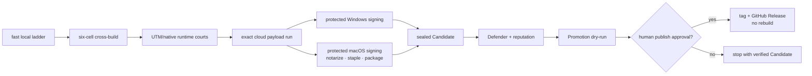

# AgenTerm v0.1.17 — trusted, repeatable release

Status: **active plan; implementation and Candidate work are authorized, public
Promotion is not**
Product owner: [`prd/PRD_02_18_roadmap.md`](../prd/PRD_02_18_roadmap.md)
Delivery owner: [`prd/PRD_02_17_delivery_quality.md`](../prd/PRD_02_17_delivery_quality.md)

The old v0.1.17 plan remains archived as a truthful record of a train that was
never started. The product owner reopened the number on 2026-09-19 for a new,
narrow outcome: make AgenTerm's development-to-release path as smooth,
repeatable and fail-closed as MiniCon's proven path. None of the archived
v0.1.17 backlog is revived by this decision.

## Outcome tree

```text
v0.1.17 — one current-main SHA moves predictably from development to a trusted release
├─ Behavior
│  ├─ the post-v0.1.16 window/ConPTY changes retain their owning black-box behavior
│  ├─ local fast checks fail before expensive matrix or provider work
│  └─ all six packages start through their declared native or typed emulated court
├─ Evidence
│  ├─ local six-cell build and UTM runtime receipts precede remote Candidate spend
│  ├─ Windows Authenticode and macOS Developer ID/notarization/stapling are qualified
│  ├─ signed final bytes, SBOM, provenance and Defender verdict bind to one SHA
│  └─ Promotion dry-run re-verifies the sealed Candidate without rebuilding
├─ Delivery
│  ├─ protected signing stages consume the existing company identities
│  ├─ Candidate assembles already-qualified bytes instead of receiving broad secrets
│  ├─ one bounded observer reports stage identity and actionable failure ownership
│  └─ explicit human approval alone authorizes public v0.1.17 Promotion
└─ Non-goals
   ├─ no MiniCon/AgenTerm shared abstraction or cross-repository framework
   ├─ no new CU target, verb or three-host product claim
   ├─ no installer/updater/marketplace or universal product redesign
   └─ no replacement Apple certificate, notary key or Windows signing identity
```

## MiniCon comparison and AgenTerm decision

MiniCon's current release path is the reference because it has repeatedly
published dual-signed exact bytes. AgenTerm adopts its proven stage boundaries,
not its product-specific implementation.

| Stage | MiniCon settled practice | AgenTerm v0.1.17 decision |
|---|---|---|
| Developer loop | one build/test entry, cheap checks first | retain root aliases; make the fast ladder and owning smokes explicit and timed |
| Pre-push matrix | six-cell cross-build before cloud spend | require AgenTerm `six-cell-qualify` evidence for the release SHA; a missing runner is `BLOCKED`, never skipped |
| Local runtime | sibling `utm-court` owns VM lifecycle | use the same sibling court contract; AgenTerm owns only artifact/journey meaning |
| Unsigned payload | one exact cloud build is reusable | separate exact six-cell payload production from signing and Candidate sealing |
| Windows trust | protected company-signing stage | graduate the existing non-promotable Azure qualification into an exact-byte release-eligible stage only after both Windows courts pass |
| macOS trust | protected sign → notarize → staple → package | move Apple secrets out of the six-cell build matrix; sign/notarize/staple before final packaging and hashing |
| Candidate | consumes successful upstream runs | Candidate accepts exact upstream run identities and seals; it does not rebuild or sign |
| Reputation | Defender receipt binds sealed Windows bytes | preserve the existing local Defender → `reputation.yml` binding |
| Promotion | dry-run first; publish exact Candidate later | require a green non-publishing rehearsal, then separate human approval for the public tag/Release |
| History | every release records run chain and lessons | write v0.1.17 release history with source SHA, run IDs, timings, failures and surviving follow-ups |

The comparison is a one-release operational copy. Generalizing common scripts,
receipts, signing components or repository interfaces belongs to v0.1.18 and
must be justified by the two completed workflows, not designed speculatively in
v0.1.17.

## Dependency graph



## Work order and gates

### R0 — freeze identities and measure the current path

- Record current `main`, version identities, release policy, signing mode,
  workflow topology and warm/cold stage timings.
- Confirm the `release-signing` Environment contains the configured Apple and
  Azure names and still requires a human reviewer. Values are never read back.
- Run the company signing readiness checks before provider work.

Gate: one redacted baseline names every stage, owner, expected input/output,
cache boundary and current blocker. A credential name may be recorded; its
value may not.

### R1 — development and local evidence

- Keep the validation ladder: lint/static checks → owning unit tests → local
  build/smoke → six-cell build → native runtime courts.
- Reconcile AgenTerm's `six-cell-qualify` and runner registry with the sibling
  `utm-court` contract used successfully by MiniCon. Product scripts may lease,
  transfer, execute and release; they do not own hypervisor lifecycle.
- Time cold build, warm build, transfer and runtime separately. A fast result
  may not hide a blocked native cell.

Gate: the exact prospective release SHA has six architecture-correct payloads
and honest runtime receipts. Any missing court is named `BLOCKED` with recovery
instructions.

### R2 — protected signing stages

- Run the existing Windows and macOS non-promotable qualification workflows
  against exact unsigned Candidate bytes before changing release policy.
- Windows must prove all allowlisted executables have the expected publisher,
  timestamp and native runtime/Defender evidence.
- macOS must prove both architectures through Developer ID signing,
  notarization, stapling and Gatekeeper assessment.
- Refactor Candidate topology so Apple credentials are available only to a
  protected macOS signing job. The final archive is created **after** stapling.
  Apply the same upstream-run pattern to Windows signed bytes.

Gate: both signing workflows produce audited, exact-SHA, release-eligible
artifacts; unrelated build cells receive no signing credentials. Missing or
rejected provider state is a hard failure, never unsigned fallback.

### R3 — Candidate assembly and observability

- Candidate consumes the exact successful payload/signing run IDs and validates
  workflow path, event, attempt, SHA, policy and receipts before packaging.
- Package/SBOM/provenance identities are derived from final signed bytes.
- Preserve the single bounded observer contract. Record the first failing stage
  and actionable owner without treating observation loss as build failure.
- Use current-main exact-SHA dispatch; if `main` later advances, use a temporary
  source-SHA dispatch ref only where the release skill explicitly requires it.

Gate: one successful sealed Candidate contains all declared assets, no secrets,
no rebuild gap and machine-readable timing for the complete chain.

### R4 — rehearsal, reputation and public release

- Run Defender against the sealed Windows Candidate, publish the bound
  reputation qualification, and pass it to Promotion.
- Run `release.yml` in dry-run mode first. It must reverify every byte and
  execute its platform sanity checks without creating a tag, draft or Release.
- Fixes to Candidate-owned bytes require a new Candidate. A Promotion-only
  verifier fix may reuse the same Candidate only when the release skill's
  exact-source rules permit it.
- After all gates are green, request explicit human approval for
  `publish-v0.1.17`. Promotion creates the exact tag and publishes without
  Cargo, signing, notarization, packaging or overwrite.

Gate: public GitHub Release assets, checksums, manifest and tag all bind to the
Candidate SHA; integrity workflow succeeds after publication.

### R5 — write back the release

- Add a release-history record with the immutable run chain, timings,
  discovered failure modes and remaining product work.
- Move completed PRD 17 leaves to truthful shipped state, update install pins,
  and archive this plan only after the public Release exists.
- Leave v0.1.18 as the next product/architecture decision point.

## Kill and cut rules

- A signing qualification that cannot prove the exact final bytes blocks the
  signed claim; do not weaken receipt matching or raise retry counts blindly.
- A native runtime cell that is missing, flaky or executed in the wrong user
  session is `BLOCKED`; translation or cross-build evidence cannot substitute.
- If a workflow refactor expands secret exposure beyond the protected signing
  job, revert the topology rather than accept convenience.
- If a product feature threatens the release chain's bounded scope, cut it to
  v0.1.18 unless it repairs a v0.1.17 regression or release blocker.
- No public Promotion occurs from this plan alone. It requires the user's
  explicit version and publish confirmation after the dry-run evidence.

## Final serial validation

Run on one integrated source state, in order:

1. documentation redaction and release-policy tests;
2. fast local lint/check plus directly owning window and ConPTY smokes;
3. six-cell cross-build and registered native/UTM runtime courts;
4. exact cloud payload build;
5. protected Windows and macOS signing stages;
6. sealed Candidate and bounded observer;
7. Defender/reputation qualification;
8. non-publishing Promotion rehearsal;
9. human-approved public Promotion and post-release integrity.
