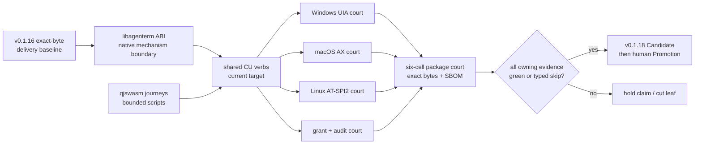

# AgenTerm v0.1.18 — agent-operable desktop

Status: **active plan; no Candidate or release authorization implied**
Product owner: [`prd/PRD_02_18_roadmap.md`](../prd/PRD_02_18_roadmap.md)
Capability owners: PRD 28–32 and PRD 36

v0.1.17 was archived without shipping and is not reused. v0.1.18 follows the
public v0.1.16 baseline.

## Outcome tree

```text
v0.1.18 — an agent can use one qualified three-host desktop-control product
├─ Behavior
│  ├─ one shared command vocabulary for current-host observe / act / wait
│  ├─ native control trees: Windows UIA, macOS AX, Linux AT-SPI2
│  ├─ invoke/focus/input/window actions return verifiable post-state
│  └─ product journeys run through qjswasm/tinyvm, not archived Rh
├─ Evidence
│  ├─ three native host journeys; distro/backend variance is capability data
│  ├─ authorization refusal + granted action + append-only audit evidence
│  ├─ exact packaged agenterm-cu + matching libagenterm identity
│  └─ six-cell Candidate remains fail-closed for every declared artifact
├─ Delivery
│  ├─ public help/catalog names the supported current tier truthfully
│  ├─ release package and SBOM contain the executable and required library
│  └─ no-rebuild Promotion consumes exact qualified bytes
└─ Non-goals
   ├─ complete ssh / rdp / vnc product tiers
   ├─ model, planner or unrestricted remote automation
   ├─ Control Center feature expansion
   └─ Chassis L1/L2/L3 migration
```

## Dependency and gate palace



## Gates

| Gate | Observable requirement | Fail-safe result |
|---|---|---|
| G0 identity | version, Cargo lock, source SHA and package manifests agree | no Candidate |
| G1 boundary | CU product code reaches native mechanisms only through the declared platform/ABI boundary | reject boundary drift |
| G2 current tier | Win/macOS/Linux each complete discover → tree → action → post-state with native evidence | hold only the unsupported claim; never pixel-success substitution |
| G3 authority | observe-only refuses mutation; granted action has matching audit attempt/result without sensitive payload | refuse action if grant or audit fails |
| G4 script owner | every release-critical CU journey is `.qjs` and runs on qjswasm/tinyvm under bounded resources | dark Rh-era gate cannot count |
| G5 packaging | each supported package contains exact `agenterm-cu` plus its matching dynamic library and metadata | package fails closed |
| G6 delivery | exact Candidate executes on declared cells and Promotion rebuilds nothing | no tag or Release |

## Work order

1. Reconcile PRD 28–32 and the public verb catalog with actual current-tier code.
2. Close shared command/backend parity before adding new verbs.
3. Port or retire every release-critical Rh-era script gate; do not preserve a
   dark gate only to keep its name.
4. Prove the three native journeys with capability-aware assertions. A backend
   that cannot publish a state returns a typed capability result; tests do not
   invent success.
5. Seal packages and receipts, then run the exact-SHA Candidate contract.

Formal Candidate dispatch and public Promotion follow
`skills/agenterm-release/SKILL.md`; this plan grants neither authority.
