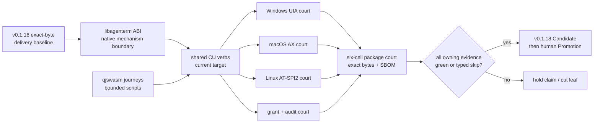

# AgenTerm v0.1.18 — agent-operable desktop

Status: **published 2026-09-21; release evidence in
[`docs/release-0.1.18-record.md`](../docs/release-0.1.18-record.md)**
Product owner: [`prd/PRD_02_18_roadmap.md`](../prd/PRD_02_18_roadmap.md)
Capability owners: PRD 28–32 and PRD 36

The original v0.1.17 backlog remains archived and is not reused. On 2026-09-19
the product owner assigned the version number to a new, narrow trusted-release
train. On 2026-09-20 the user stopped that train without publishing it and
activated v0.1.18. This plan retains its own G0–G6 product and delivery gates;
the unfinished single-cross-build / native-execute-only release topology is
now a prerequisite of its Candidate, not evidence that v0.1.17 shipped.

## Outcome tree

```text
v0.1.18 — an agent can use one qualified three-host desktop-control product
├─ Behavior
│  ├─ one shared command vocabulary for current-host observe / act / wait
│  ├─ native control trees: Windows UIA, macOS AX, Linux AT-SPI2
│  ├─ node focus, app-local raise and desktop-window activation stay distinct
│  ├─ invoke/input/window actions return verifiable post-state
│  └─ product journeys run through qjswasm/tinyvm, not archived Rh
├─ Evidence
│  ├─ three native host journeys; distro/backend variance is capability data
│  ├─ authorization refusal + granted action + append-only audit evidence
│  ├─ exact packaged agenterm-cu + matching libagenterm identity
│  └─ six-cell Candidate remains fail-closed for every declared artifact
├─ Delivery
│  ├─ public help/catalog names the supported current tier truthfully
│  ├─ release package and SBOM contain the executable and required library
│  └─ no-rebuild Promotion consumes exact qualified bytes
└─ Non-goals
   ├─ complete ssh / rdp / vnc product tiers
   ├─ model, planner or unrestricted remote automation
   ├─ Control Center feature expansion
   ├─ speculative cross-repository reuse without two measured consumers
   └─ Chassis L1/L2/L3 migration
```

## Dependency and gate palace



## Gates

| Gate | Observable requirement | Fail-safe result |
|---|---|---|
| G0 identity | version, Cargo lock, source SHA and package manifests agree | no Candidate |
| G1 boundary | CU product code reaches native mechanisms only through the declared platform/ABI boundary | reject boundary drift |
| G2 current tier | Win/macOS/Linux each complete discover → tree → action → post-state with native evidence | hold only the unsupported claim; never pixel-success substitution |
| G3 authority | observe-only refuses mutation; granted action has matching audit attempt/result without sensitive payload | refuse action if grant or audit fails |
| G4 script owner | every release-critical CU journey is `.qjs` and runs on qjswasm/tinyvm under bounded resources | dark Rh-era gate cannot count |
| G5 packaging | each supported package contains exact `agenterm-cu` plus its matching dynamic library and metadata | package fails closed |
| G6 delivery | one exact-SHA cross-build produces six target payloads; six architecture-checked native cells only execute and verify those bytes; Promotion rebuilds nothing | no tag or Release |

## Work order

1. Close the release-topology gap before a Candidate: one macOS-hosted
   cross-build produces all six payloads; native runtime cells verify their
   OS/ISA and downloaded hashes without Cargo. Preserve the Windows quality
   receipt and native tests. Source-tree audits in the existing primary unit
   gate read `src/`, `prd/`, and `scripts/` and therefore stay against the
   exact-SHA checkout on the build/quality host; they are not a bounded VM
   fixture. Native test harnesses instead resolve shipped binaries and only
   their declared fixtures at runtime from a bounded bundle. Do not silently
   skip either class or count one host's result as another host's PASS. Measure
   commit-to-sealed-Candidate wall time, not only the Candidate job duration:
   moving an unchanged gate to an earlier workflow is not a speedup by itself.
   `artifact-build-fast` makes the prior-version upgrade fixture, whereas
   `artifact-build` makes the release artifact; different profiles and tests
   make them distinct, not a proved 22-minute duplicate. Preserve that order
   while measuring which build work can actually be reused. Any changed gate
   meaning gets a new gate identity rather than silently reusing an old PASS.
2. Reconcile PRD 28–32 and the public verb catalog with actual current-tier code.
3. Close shared command/backend parity before adding new verbs.
   Whole-window `activate` now has ABI 1.26 plus green macOS and active-lane
   Windows exact-handle read-back; the Linux native court still owns promotion.
4. Port or retire every release-critical Rh-era script gate; do not preserve a
   dark gate only to keep its name.
5. Prove the three native journeys with capability-aware assertions. A backend
   that cannot publish a state returns a typed capability result; tests do not
   invent success.
6. Seal packages and receipts, then run the exact-SHA Candidate contract.

Formal Candidate dispatch and public Promotion follow
`skills/agenterm-release/SKILL.md`; this plan grants neither authority.

## G6 migration evidence (2026-09-20)

The existing `client-build-all` task completed a cold, isolated `release`
lane on one macOS ARM64 host: all six target triples passed and its summary
listed 32 artifacts (5 per macOS/Linux cell, 6 per Windows cell). An
independent reread matched all 32 reported SHA-256 values to nonempty files.
This proves the single-host build mechanism, not native execution, signing,
packaging equivalence, or Candidate sealing. The current `candidate.yml`
still builds in six separate jobs and must not be described as migrated.

Linux packaging remains a native Linux step even when its binaries are built
elsewhere: the package script stages the `libxkbcommon-x11` / `libxcb-xkb`
closure only on Linux. A macOS packaging probe returned success but omitted
that closure, so cross-host Linux packaging now fails explicitly. A future
execute-only Linux cell must download the cross-built binaries, package them
on Linux without Cargo, and run the resulting exact archive.

Default-feature Windows test executables also cross-compiled with
`cargo xwin test --no-run`; the existing `--all-features` primary test did
not, because vendored LuaJIT requires a Windows `cl.exe` build tool. Those
are distinct evidence scopes. No Windows all-features PASS is inferred from
the default-feature cross-build.
