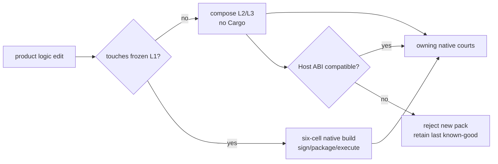

# AgenTerm v0.1.19 — fast-change chassis boundary

Status: **planned; starts only after v0.1.18 closes**
Product owner: [`prd/PRD_02_18_roadmap.md`](../prd/PRD_02_18_roadmap.md)
Execution owner: [`goal-chassis-l1-l2-l3.md`](goal-chassis-l1-l2-l3.md)

## Outcome tree

```text
v0.1.19 — product-logic changes stop paying native six-cell rebuild cost
├─ [ ] freeze the thin Native L1 surface and its six digests
├─ [ ] version one bounded L2 Host ABI with explicit compatibility failure
├─ [ ] compose one real L2/L3 product slice without Cargo
├─ [ ] prove app-only edit → unchanged L1 digests + owning runtime courts
├─ [ ] prove L1 edit → all native build/sign/package courts re-enter
└─ [-] no JIT, embedded compiler, marketplace, remote update or PTY scripting
```



Hard acceptance is measured, not architectural prose: an L2/L3-only change
must leave all six L1 digests unchanged and complete its build/compose lane in
the declared fast-loop budget without invoking Cargo. Until that evidence
exists, Chassis remains a partial substrate and cannot replace the live path.
