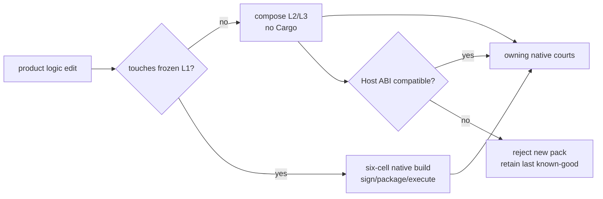

# AgenTerm v0.1.19 — fast-change chassis boundary

Status: **active planning; v0.1.18 published 2026-09-21**
Product owner: [`prd/PRD_02_18_roadmap.md`](../prd/PRD_02_18_roadmap.md)
Execution owner: [`goal-chassis-l1-l2-l3.md`](goal-chassis-l1-l2-l3.md)

## Outcome tree

```text
v0.1.19 — product-logic changes stop paying native six-cell rebuild cost
├─ [ ] freeze the thin Native L1 surface and its six digests
├─ [ ] version one bounded L2 Host ABI with explicit compatibility failure
├─ [ ] compose one real L2/L3 product slice without Cargo
├─ [ ] prove app-only edit → unchanged L1 digests + owning runtime courts
├─ [ ] prove L1 edit → all native build/sign/package courts re-enter
└─ [-] no JIT, embedded compiler, marketplace, remote update or PTY scripting
```



Hard acceptance is measured, not architectural prose: an L2/L3-only change
must leave all six L1 digests unchanged and complete its build/compose lane in
the declared fast-loop budget without invoking Cargo. Until that evidence
exists, Chassis remains a partial substrate and cannot replace the live path.

## Current baseline and version decision

At main `5eda1de74`, v0.1.18 is public and v0.1.19 is open. The independent
Chassis crate can deterministically compose and validate a six-cell image, and
both workbench adapters reject an invalid image before presentation. Its
`active-tab` L2 artifact is still a substrate: the live workbench PE and its
PTY/IPC/product dispatch have not been replaced. Thus a successful compose
test alone cannot satisfy this version's fast-change promise. See the current
layout and debt in [`ARCHITECTURE.md`](ARCHITECTURE.md) §1 and §4.

Candidate `35626359893` is a delivery blocker, not Chassis evidence. Five
build cells passed; the Windows x86_64 quality gate trapped in
`powershell-migration-audit`, leaving runtime and aggregate skipped. Its
93.13% sccache hit rate proves cache reuse only. The exact recovery work is
owned by [`plan-candidate-gate-speed.md`](plan-candidate-gate-speed.md).

The sealed v0.1.18 Candidate `35606274661` supplies a traceable historical
six-cell loader baseline: the independently recomputed loader SHA-256 values
match its product manifest and each cell's descriptor, and the product archive
matches its provenance and public release asset. Its source SHA is
`eaaec807d`; these are v0.1.18 bytes, not a claim that current `main` has the
same L1 bytes. Here, "six L1 digests" means the six loader **binary** hashes
in the compose manifest. Source-path hashes are change-classification evidence
and cannot stand in for those bytes.

G1's candidate is the shared next/previous tab cycling rule, observable
through the public CLI's stable active tab ID. Windows computes that rule in
a persistent server process, while `--chassis-image` currently loads only in
the GUI process. Give the server an explicit, validated image identity and
reject incompatible attachments before freezing L1. This is a one-time L1
startup-contract change, so its new six-cell bytes replace the v0.1.18
historical baseline for G2/G3. Do not use inherited environment variables or
the first server starter as an implicit image selector. An isolated L2 behavior
variant may prove the fast loop; the shipped default must preserve cycling.

## Execution order and release cut

| Gate | Deliverable | Proof before advancing | Stop or cut condition |
|---|---|---|---|
| G0 — restore qualification | Reproduce and repair the audit trap locally; fix failed-job rerun's attempt-bound control artifact; retain the existing release assertions. | Negative control for each repair, then a six-build/six-runtime/aggregate exact-SHA Candidate. | No Candidate success claim from five builds or a skipped aggregate. Public Promotion remains a separate human decision. |
| G1 — choose one production slice | Select an existing product action with a real L2 decision that crosses live workbench dispatch; record its caller, authority, output bytes and owning public court. Freeze the exact six L1 loader binary digests and Host ABI version before changing the slice. | One stable baseline public CLI journey and an independently checked six-cell loader manifest tied to its source revision. The slice must be reachable by users, not merely by `agenterm-chassis` tests. | If the action only forwards a host value, lacks stable public observation, or cannot cross the versioned ABI without moving PTY/window/input/IPC semantics into L2, reject it and choose a narrower one. |
| G2 — wire replaceable behavior | Put only the chosen product rule behind the versioned L2 Host ABI and let the live product dispatch call it. Keep the native host, authority and lifecycle in their current owners. Reject incompatible packs before replacing the last known-good image. | Change the L2/L3 rule twice without invoking Cargo: output changes in the public journey, all six frozen L1 digests remain identical, and an incompatible ABI pack is refused while the prior image still runs. For each edit, measure source edit → composed/inspected package on one declared host; require at most 10 minutes and retain elapsed time and artifact hashes. Native courts are measured separately. | If the live journey still uses the old compiled rule, either edit exceeds the budget, or any L1 digest changes, this gate is open; do not claim a fast-change boundary. |
| G3 — native and release evidence | Run the owning native courts for the chosen slice on all six OS/ISA cells, then the existing Candidate, reputation and rehearsal chain over the exact packaged bytes. Deliberately change one L1 input and show that the native build/sign/package path re-enters. | Per-cell runtime receipts and one sealed Candidate; the L1-change control triggers the full native path. Preserve existing product tree, remain-on-exit, explicit-close, signing and no-overwrite rules. | A blocked host is recorded as BLOCKED, not inferred from another OS. If G2/G3 cannot finish, v0.1.19 must narrow its stated capability or remain unreleased; an example app alone is insufficient. |

Do the bounded UI cleanup below only after G0, and only when it helps G1/G2
remove a real duplicate product rule. Do not make a wholesale adapter split,
MiniCon platform change or optional new feature part of the version's critical
path. This order leaves the version with one measurable product boundary and a
clear release decision.

## Bounded product-structure cleanup

This is a small supporting track, not a second source map or a substitute for
the Chassis acceptance above. Current ownership and debt IDs remain in
[`ARCHITECTURE.md`](ARCHITECTURE.md) §1 and §4; product behavior remains in the
owning PRDs. Keep the current CU frontier ahead of unrelated UI breadth.

| Order | Change | Owner and dependency | Evidence / safe failure |
|---|---|---|---|
| 0 | Restore a trustworthy Candidate before using it as refactor evidence. Diagnose the Windows `powershell-migration-audit` qjswasm out-of-bounds trap from run `35626359893`; retain the 93.13% sccache hit measurement as a cache result only. Repair the attempt-specific runtime-control download that makes a failed-job rerun unable to find the preflight artifact. | Delivery quality, [`plan-candidate-gate-speed.md`](plan-candidate-gate-speed.md); no public Promotion. | Local owning reproduction and negative control, then an exact-SHA Candidate with six build/runtime cells and aggregate. A failed or skipped aggregate remains failed. |
| 1 | Trace one existing shared `ui-action` family end to end through `frontend`, Windows remote, Unix embedded, and `control_dispatch`. Start with window and tab selection actions, which are already in `SHARED_UI_ACTIONS`; record the actual duplicate parse/transition points before moving code. | L2 product semantics in `src/frontend/*`; host adapters only present and forward. Do not change action IDs or public payloads. | Existing catalog set test plus an owning pure-state test that fails when one host's rule diverges; public CLI journey on available native hosts. An untested host is `BLOCKED`, not inferred green. |
| 2 | Move only the proven duplicate request normalization or state transition into the existing shared frontend owner. Replace the two adapter branches with calls to it; leave host-specific wake, IME, drawing and native controls in their adapters. | Depends on order 1 showing the same rule on both hosts. Update `ui_action_catalog.rs` only if its inventory truly changes; record a `parity-gap:` for genuine host-only behavior. | Red/green guard mutation, `cargo test --lib` owning tests, boundary test, and public CLI behavior. Preserve terminal tree, remain-on-exit and explicit-close behavior. |
| 3 | After the shared rule is green, extract the remaining Windows command-presenting branch into a sibling module only if it removes a real ownership tangle from `remote_frontend.rs`. Do not split by line count alone. Audit `platform/mod.rs` consumers before any L3 facade removal. | L2 then L3 in [`ARCHITECTURE.md`](ARCHITECTURE.md) §4. Keep MiniCon's `agenterm-platform` consumer and Windows font owner out of this slice. | No new product semantics in an adapter or mechanism crate; same CLI snapshots/receipts before and after. Update the architecture map in the same change if a physical owner moves. |

Stop this track after the first complete shared action family and its native
evidence. Review the result before selecting another family. Candidate topology
changes, Chassis L1 replacement and broad adapter rewrites are separate owners;
none are prerequisites for this small UI slice beyond a trustworthy gate.
