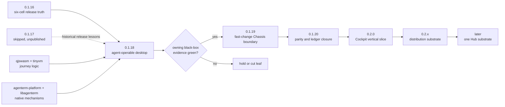

# AgenTerm 0.1.x → 0.2.x execution route

Status: **active portfolio view**
Product owner: [`prd/PRD_02_18_roadmap.md`](../prd/PRD_02_18_roadmap.md)

## Markdown-tree DAG

```text
0.1.x — make today's product controllable and tomorrow's changes cheaper
├─ [x] 0.1.16 reproducible six-cell baseline
├─ [-] 0.1.17 trusted-release train skipped without publication
│  ├─ local fast loop → six-cell build → UTM/native courts
│  ├─ protected Windows and macOS signing stages
│  └─ sealed Candidate → reputation → dry-run → human Promotion
├─ [x] 0.1.18 published agent-operable desktop train (2026-09-21)
│  ├─ agenterm-cu current tier qualified on Win/macOS/Linux
│  ├─ native accessibility + shared verbs + grant/audit contract
│  ├─ qjswasm owns release-critical .qjs journeys
│  └─ extract MiniCon/AgenTerm reuse only from two proven release paths
├─ [ ] 0.1.19 fast-change Chassis boundary
│  ├─ frozen thin L1; versioned bounded L2 ABI
│  └─ L2/L3-only change composes and tests without six-cell rustc
└─ [ ] 0.1.20 convergence
   ├─ close selected three-host UX/lifecycle parity debt
   └─ PRD/catalog/alignment/evidence ledger agrees

0.2.x — build useful product surfaces on the stable base
├─ [ ] 0.2.0 one operable Control Center Cockpit slice
├─ [ ] one install/update/rollback and signing-data substrate
└─ [ ] later Hub substrate; marketplace/network/mobile stay dependency-gated
```

## Mermaid flowchart memory palace



## Version decisions

| Version | One user result | Hard evidence | First exclusions |
|---|---|---|---|
| 0.1.17 (skipped) | attempted trusted-release train; no public result | no sealed Candidate or Promotion claimed | historical record only |
| 0.1.18 | one distributable agent can observe and control the current desktop across three hosts | native UIA/AX/AT-SPI2 journeys; grant/audit; qjswasm gate; exact packages | full remote tiers, planner/model, CC, Chassis migration |
| 0.1.19 | product-logic changes no longer rebuild six native bases | unchanged L1 digests; no-Cargo compose; ABI rejection and last-good recovery | JIT/compiler, OTA, marketplace, PTY scripting |
| 0.1.20 | accumulated parity and truth-ledger debt is closed | selected three-host black boxes; PRD/alignment/catalog zero drift | new products and speculative engines |
| 0.2.0 | Control Center has one real operable Cockpit workflow | typed post-state/receipt; one authority; disconnect/gap recovery | feature-complete CC, WebView mandate, marketplace |

## Sequencing rules

1. v0.1.17 was skipped without publication on 2026-09-20. v0.1.18 published
   on 2026-09-21; its exact evidence is in
   [`docs/release-0.1.18-record.md`](../docs/release-0.1.18-record.md). No
   v0.1.17 success is inferred from its attempted Candidate runs.
2. v0.1.19 is the active planning train. Its Chassis proof remains one outcome;
   Candidate recovery and shared UI cleanup are supporting work, not added
   product promises. [`plan-v0.1.19.md`](plan-v0.1.19.md) owns the execution cut.
3. v0.1.19 must prove the time-folding claim quantitatively. If an L2/L3-only
   change still invokes six-cell Cargo or changes L1 bytes, hold the migration.
4. v0.1.20 admits only bounded closure leaves selected from measured product
   debt; it is not a backlog dump.
5. v0.2.0 starts with Cockpit. Workflow, Extensions, InfoHub and distribution
   expand only after the first vertical slice has public black-box evidence.
6. Cross-build, GitHub native runners and local UTM are independent evidence
   layers. Exact-SHA Candidate and no-rebuild Promotion remain the release path.

## Select the v0.1.20 closure leaves

Before assigning implementation, compare the open leaves in the owning PRDs
against one user journey, its current native evidence and the cost of leaving
it partial. Select at most two product leaves plus the alignment/evidence
closure; publish their exact IDs in a v0.1.20 execution plan. Current
evidence-backed candidates are:

1. Human workspace tab editing: the existing PRD 06 open commit, validation
   and same-row focus rules. A chosen slice must prove one tab's draft never
   silently saves or contaminates another tab's Composer on all three hosts.
2. Unix terminal font selection: PRD 06 and
   [`plan-unix-gui-win-parity.md`](plan-unix-gui-win-parity.md) still mark a real
   TTF/font-family-to-pixels path open. Treat Linux and macOS evidence
   separately; do not infer either from Windows or MiniCon's font work.
3. A bounded `agenterm-cu` native-evidence gap from PRD 28, only if its owner
   can name one public journey and all target hosts before coding. The CU
   subtree is large; the whole partial frontier is not one release leaf.

Prefer the candidate that removes the most visible daily-work failure with a
small owning surface and a falsifiable native court. If no candidate meets
that bar, v0.1.20 closes only catalog/PRD/evidence drift and says so. The first
new Control Center Cockpit workflow remains v0.2.0, owned by PRD 21 and its
existing UX design; do not pull its unfinished navigation into 0.1.20 merely
to fill the version.
