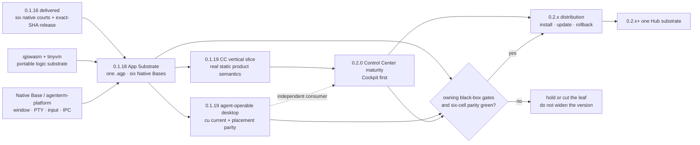

# AgenTerm 0.1.x → 0.2.x 系列执行路线

状态：**active portfolio view**。本文只管版本之间的依赖、切片和砍叶；
产品真理在 [`prd/PRD_02_18_roadmap.md`](../prd/PRD_02_18_roadmap.md)，每个版本的
具体证据门在对应 `plan-v*.md`，源码结构只由
[`plan/ARCHITECTURE.md`](ARCHITECTURE.md) 拥有。

Legend：`[x]` 已发布，`[~]` 在制，`[ ]` 计划，`[?]` 尚未绑定版本。

## 系列结果

```text
0.1.x — 把已有能力变成可快速发展、可原生验证的产品底座
├─ [x] 0.1.16 交付基线
│  ├─ exact-SHA Candidate → no-rebuild Promotion
│  ├─ 六格构建 + 六格原生执行 + 发布后完整性审计
│  └─ qjswasm/tinyvm 成为唯一活跃 .qjs 引擎线
├─ [~] 0.1.18 Portable App Substrate
│  ├─ 一份密封 .agp 被六格 Native Base 消费
│  ├─ App-only 变更不调 Cargo、不重编六份 Base
│  ├─ 窄小、版本化、typed fail-closed Host ABI
│  └─ 其他轨只能独立达门搭车，不得阻塞主结果
├─ [ ] 0.1.19 Agent-operable Desktop
│  ├─ agenterm-cu current tier 的结构化观察/动作/等待/审计竖线
│  ├─ window-place 三主机语义对齐，不复制平台机制
│  └─ Control Center 消费 App Substrate 的首条真实静态语义竖线
└─ [?] 后续 0.1.x
   └─ 不预先堆积版本号；只承接 0.1.18/0.1.19 实测后必须的小闭环

0.2.x — 让产品底座承载独立应用、更新与生态
├─ [ ] 0.2.0 Control Center content maturity
│  ├─ Cockpit 可操作竖线：健康/异常/run/evidence 下钻 + typed receipt
│  ├─ Workflow / Extensions 只消费已有 authority，不自建第二套调度或包系统
│  └─ InfoHub/WebView 按六格、离线、崩溃恢复和体积证据晋级
├─ [ ] 0.2.x Distribution surface
│  ├─ agenterm.work + releases.json + provenance 为一个发布真源
│  ├─ install/update/rollback 共用一条验证路径
│  └─ 签名/公证是数据驱动开关，不复制发布流程
└─ [ ] 0.2.x+–0.3.x One Hub substrate
   ├─ Plugin / Skin / App / Info 共用 kind catalog、来源、安装、更新、回滚
   └─ 先静态签名索引，后市场与去中心化；离线始终是一等状态
```

## 依赖图（memory palace）



## 版本门与砍叶

| 版本 | 唯一用户结果 | 硬门 | 首先砍掉 / 非目标 |
|------|--------------|------|----------------------|
| **0.1.18** | 产品逻辑可以单包快速迭代，六格 Base 不因 App-only 变更重编 | 同一 `.agp` digest；Host ABI typed fail-closed；App-only lane 无 Cargo；六格消费证据 | MiniCon 他仓工作、CC 内容成熟、远程 OTA、Hub、mobile |
| **0.1.19** | agent 能通过一条结构化公共面观察和控制本机桌面 | `current` tier 真实三主机证据；动作前授权、动作后审计；typed unsupported；CC 竖线只消费 0.1.18 ABI | ssh/rdp/vnc 完整化、模型/规划器、通用窗口管理器宣称、CC 全量内容 |
| **0.2.0** | Control Center 从壳变成可用的运营工作台 | Cockpit 竖线有 post-state/receipt；无第二 authority；断线/gap 可重建；六格原生证据 | WebView 强绑、市场交易、静默安装、嵌入 libp2p/IPFS、一次塞满 Workflows/Extensions/InfoHub |

## 横切约束

- qjswasm/tinyvm 是逻辑可移植底座，不代替 Native Base 的窗口、PTY、输入、
  IME、剪贴板、IPC 或签名。只在总体积、启动、交互预算和六格行为一致
  都胜出时迁逻辑；否则保留原生实现。
- 六格交叉构建、GitHub native execute-only courts 和本机 UTM courts 是三个独立
  证据层。存在性、翻译层和原生运行不得互相冒充。
- 发布继续用 exact-SHA Candidate → no-rebuild Promotion → public integrity audit。
  签名状态是 manifest/policy 数据，不是另一套发布脚本。
- MiniCon、tinyvm 和未来 mobile 拥有自己的产品树与证据。AgenTerm 可消费其
  版本化合同，不得把它们当作本版本的无门禁内部轨。

## 执行顺序

1. 先关闭 0.1.16 文档/临时战役索引，保留发布证据，不再当活任务单。
2. 对 0.1.18 做基线再盘点：删除已迁 MiniCon 轨，将已落地的 libagenterm /
   qjswasm 事实改为前置，只留 App Substrate 及其真正阻塞项。
3. 0.1.18 的 G0–G5 通过后才把 0.1.19 从预开草案升为唯一在制版本。
4. 0.1.19 只交付 `current` + window placement + 一条 CC 竖线；新 transport 不得
   拖住首个可用 computer-use 切片。
5. 0.2.0 先交付 Cockpit Phase A。Workflows/Extensions/InfoHub 按 authority 依赖
   和证据成本后续晋级，不为了版本号一次全塞进来。
