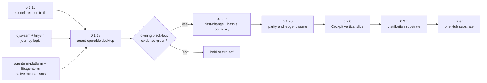

# AgenTerm 0.1.x → 0.2.x execution route

Status: **active portfolio view**
Product owner: [`prd/PRD_02_18_roadmap.md`](../prd/PRD_02_18_roadmap.md)

## Markdown-tree DAG

```text
0.1.x — make today's product controllable and tomorrow's changes cheaper
├─ [x] 0.1.16 reproducible six-cell baseline
├─ [~] 0.1.18 agent-operable desktop
│  ├─ agenterm-cu current tier qualified on Win/macOS/Linux
│  ├─ native accessibility + shared verbs + grant/audit contract
│  └─ qjswasm owns release-critical .qjs journeys
├─ [ ] 0.1.19 fast-change Chassis boundary
│  ├─ frozen thin L1; versioned bounded L2 ABI
│  └─ L2/L3-only change composes and tests without six-cell rustc
└─ [ ] 0.1.20 convergence
   ├─ close selected three-host UX/lifecycle parity debt
   └─ PRD/catalog/alignment/evidence ledger agrees

0.2.x — build useful product surfaces on the stable base
├─ [ ] 0.2.0 one operable Control Center Cockpit slice
├─ [ ] one install/update/rollback and signing-data substrate
└─ [ ] later Hub substrate; marketplace/network/mobile stay dependency-gated
```

## Mermaid flowchart memory palace



## Version decisions

| Version | One user result | Hard evidence | First exclusions |
|---|---|---|---|
| 0.1.18 | one distributable agent can observe and control the current desktop across three hosts | native UIA/AX/AT-SPI2 journeys; grant/audit; qjswasm gate; exact packages | full remote tiers, planner/model, CC, Chassis migration |
| 0.1.19 | product-logic changes no longer rebuild six native bases | unchanged L1 digests; no-Cargo compose; ABI rejection and last-good recovery | JIT/compiler, OTA, marketplace, PTY scripting |
| 0.1.20 | accumulated parity and truth-ledger debt is closed | selected three-host black boxes; PRD/alignment/catalog zero drift | new products and speculative engines |
| 0.2.0 | Control Center has one real operable Cockpit workflow | typed post-state/receipt; one authority; disconnect/gap recovery | feature-complete CC, WebView mandate, marketplace |

## Sequencing rules

1. v0.1.18 closes before v0.1.19 becomes active; Chassis research may continue
   independently but cannot redefine the active release outcome.
2. v0.1.19 must prove the time-folding claim quantitatively. If an L2/L3-only
   change still invokes six-cell Cargo or changes L1 bytes, hold the migration.
3. v0.1.20 admits only bounded closure leaves selected from measured product
   debt; it is not a backlog dump.
4. v0.2.0 starts with Cockpit. Workflow, Extensions, InfoHub and distribution
   expand only after the first vertical slice has public black-box evidence.
5. Cross-build, GitHub native runners and local UTM are independent evidence
   layers. Exact-SHA Candidate and no-rebuild Promotion remain the release path.
