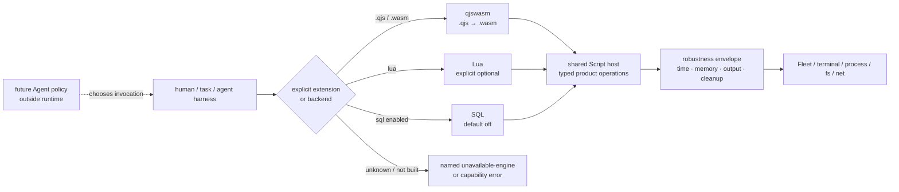

# Script runtime family

Parent: [AgenTerm product tree](../PRD.md#product-tree)

This module owns the shared Script Runtime product contract, engine routing and
cross-engine public behavior. The qjswasm implementation is owned by
[PRD 36](PRD_02_36_agenterm_qjswasm.md). Rh-era design and migration history is
preserved in
[`prd/archive/PRD_02_10_script_runtime_history_through_v0.1.16.md`](archive/PRD_02_10_script_runtime_history_through_v0.1.16.md).

Legend: `[x]` shipped, `[~]` partial, `[ ]` planned, `[-]` retired.

## Product contract

The Script Runtime is an unrestricted general-purpose local runtime operating
with the invoking user's OS authority. `capability` means discoverable API and
compatibility metadata; it is never a permission grant, sandbox tier or target
allowlist. Deadlines, memory/output/concurrency budgets and owned cleanup are
robustness controls. Agent permissions belong to a separate future harness.

There is no implicit engine. File extension or an explicit backend selects a
named engine; unknown or unavailable engines fail by name.

## Markdown-tree DAG

```text
Script Runtime
├─ shared public contract
│  ├─ agenterm cli script — .qjs / .wasm through qjswasm
│  ├─ check / run / qualify / pack / task / bounded check-many
│  ├─ typed failures, receipts, budgets and owned cleanup
│  └─ unrestricted local APIs; no permission profiles
├─ engine family
│  ├─ [~] qjswasm — current .qjs line; default product engine → PRD 36
│  ├─ [~] lua — explicit optional sibling; own named entry
│  ├─ [~] sql — optional, default-off, future disposition undecided
│  ├─ [-] Rh — moved to partnernetsoftware/rh on 2026-08-29
│  ├─ [-] rquickjs agenterm-qjs — removed and replaced by qjswasm
│  └─ [-] wasmtime agenterm-wasmcore — removed from product path
├─ product integration
│  ├─ Fleet/terminal APIs reuse public product operations
│  ├─ tasks name an engine-backed entry; legacy profile data is inert
│  └─ release-critical repository scripts must have a live .qjs owner
└─ non-goals
   ├─ no Agent authorization in engine registration
   ├─ no Node/browser compatibility claim for .qjs
   └─ no hidden fallback to an archived engine
```

## Mermaid flowchart memory palace



## Current truth

- [x] Design choice: Rust (`.rs`) implements the host; script engines express
  replaceable orchestration and product logic through versioned host doors.
- [x] Rh source and `.rh` corpus left this repository; no Rh-era task or pass
  count may satisfy a current AgenTerm gate.
- [x] `.qjs` resolves to qjswasm/tinyvm; rquickjs and wasmtime product engines
  are absent from the dependency tree.
- [x] the default product build includes the qjswasm engine needed to run the
  repository's own `.qjs` qualification surface.
- [x] `check-many` is bounded, gives each file a fresh engine/result and avoids
  one process per source file.
- [x] the public `prd-alignment` task and its `check.qjs` caller use the same
  1,000,000,000-operation hard cap. The former 100,000,000 task contract
  exhausted before producing a verdict even though the check wrapper was
  already calibrated higher; direct task execution is now green.
- [~] release-critical task migration is still audited by v0.1.18 G4. A task
  whose Rh entry disappeared is dark until a real `.qjs` equivalent lands or
  the obsolete task is explicitly retired.
- [~] Lua retains its explicit surface; SQL remains optional/default-off. Their
  existence does not make them fallback engines for `.qjs`.

## Acceptance and safe failure

- Public catalog, task manifest and engine routing agree on each entry.
- Single-file `check` and bounded `check-many` have black-box parity for the
  same source and diagnostic class.
- A missing API is a product gap with a named diagnostic, never a policy-reduced
  substitute.
- Budget exhaustion terminates owned work, publishes a typed error and leaves
  the host usable.
- Engine or task failure never silently changes backend, target or authority.

Current version assignment: [`plan/plan-v0.1.18.md`](../plan/plan-v0.1.18.md).
