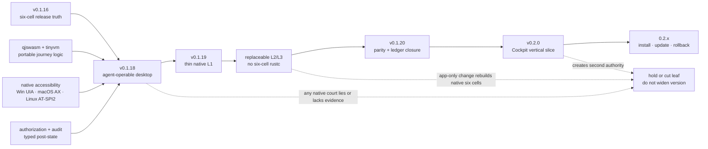

# Focused product roadmap

Parent: [AgenTerm product tree](../PRD.md#product-tree)

This module owns current version assignment and milestone gates. Long-horizon
ideas live in [PRD 19](PRD_02_19_inspiration_and_future_vision.md); detailed
sequencing lives in [`plan/roadmap-0.1x-0.2x.md`](../plan/roadmap-0.1x-0.2x.md).
The pre-v0.1.16 milestone ledger is preserved in
[`prd/archive/PRD_02_18_roadmap_history_through_v0.1.16.md`](archive/PRD_02_18_roadmap_history_through_v0.1.16.md).

Legend: `[x]` shipped, `[~]` partial, `[ ]` planned, `[-]` excluded.

## Markdown-tree DAG

```text
AgenTerm delivery after v0.1.16
├─ [x] v0.1.16 — reproducible six-cell delivery baseline
│  ├─ exact-SHA Candidate → no-rebuild Promotion → public audit
│  ├─ qjswasm + tinyvm is the only live .qjs engine line
│  └─ historical plan: plan/archive/plan-v0.1.16.md
├─ [~] v0.1.18 — agent-operable desktop
│  ├─ agenterm-cu current tier becomes a qualified distributable
│  ├─ Win/macOS/Linux native accessibility journeys tell the truth
│  ├─ authorization + audit gate every action; unsupported stays typed
│  ├─ product-owned .qjs journeys replace dark Rh-era gates
│  └─ [-] no complete ssh/rdp/vnc, model/planner, CC or chassis migration
├─ [ ] v0.1.19 — fast-change chassis boundary
│  ├─ freeze a thin Native L1 and versioned L2 host boundary
│  ├─ prove an L2/L3-only product change does not run six-cell rustc
│  ├─ keep PTY/window/input/IPC/signing in native ownership
│  └─ [-] no marketplace, remote update or wholesale workbench rewrite
├─ [ ] v0.1.20 — 0.1.x convergence
│  ├─ close high-value three-host UX and lifecycle parity debt
│  ├─ reconcile PRD, alignment contract, public commands and evidence
│  └─ admit no new product family
└─ [ ] v0.2.x — Control Center and distribution
   ├─ 0.2.0: one operable Cockpit vertical slice
   ├─ later: one install/update/rollback substrate
   └─ Hub/marketplace/decentralized expansion only after those gates
```

## Mermaid flowchart memory palace



## Version gates

### v0.1.18 — agent-operable desktop

- User problem: agents cannot yet rely on one shipped, three-host structured
  desktop-control surface.
- Invariant: product verbs are shared; OS differences stop in
  `agenterm-platform`; actions require the PRD 31 grant/audit contract.
- Success evidence: exact Candidate packages `agenterm-cu` and its required
  `libagenterm`; native Win/macOS/Linux journeys cover discover → observe →
  act → verify → audit; product `.qjs` gates execute on qjswasm/tinyvm.
- Safe failure: unsupported capability or missing native evidence is typed and
  blocks that claim; it never becomes coordinate success or a skipped cell.
- Non-goals: full remote tiers, RDP productization, model planning, Control
  Center content, Chassis migration and a new script engine.

### v0.1.19 — fast-change chassis boundary

- User problem: small product-logic changes still pay native six-cell build and
  qualification cost.
- Invariant: platform mechanisms stay native; replaceable logic crosses one
  versioned, bounded, fail-closed host ABI.
- Success evidence: an L2/L3-only change composes deterministic artifacts and
  runs owning courts without Cargo or changed L1 digests; a deliberate L1
  change still invokes all native gates.
- Safe failure: incompatible content is rejected while the last known-good
  product remains runnable.
- Non-goals: embedded C compiler/JIT, dynamic trust bypass, remote marketplace
  and conversion of frame-critical terminal work into scripts.

### v0.1.20 — convergence

- User problem: accumulated partial leaves and documentation drift make the
  product harder to trust and extend.
- Success evidence: selected parity/lifecycle leaves have public three-host
  evidence; PRD, `prd/alignment-contract.json`, command catalogs and receipts
  agree; every `[x]` points to evidence.
- Non-goal: no new executable or product family enters the closure release.

## Portfolio rules

- v0.1.17 remains an archived, never-shipped plan number and is not reused.
- A version owns one user-visible outcome; independent work may ride only after
  its own gates pass and may not block that outcome.
- Cross-build, GitHub native execution and local UTM are independent evidence
  layers. Translation evidence never claims a native kernel or ISA.
- Release remains exact-SHA Candidate → no-rebuild Promotion. Public Promotion
  and any switch to required signing remain explicit human authority boundaries.
- MiniCon, tinyvm and Rh own their repositories. AgenTerm consumes pinned public
  contracts; it does not inherit their shipped status.
