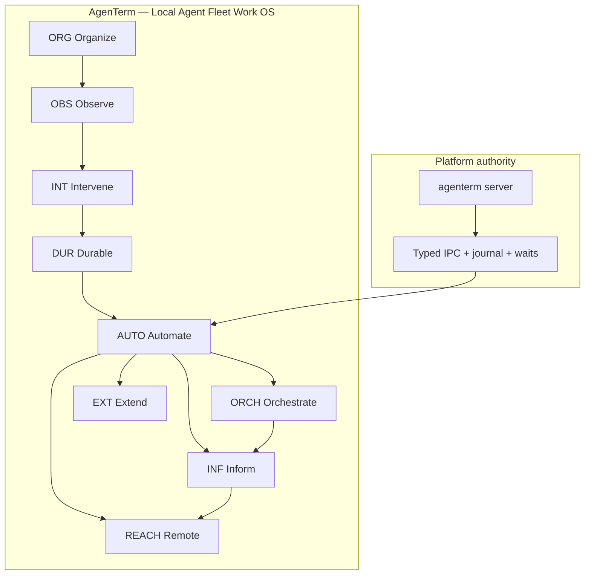

# Inspiration backlog and future vision

Parent: [AgenTerm product tree](../PRD.md#product-tree)

Chinese title (informal): 灵感采集与未来畅想

This module is the **living idea garden**. It captures product origin,
inspiration, and long-horizon hypotheses before they earn a version gate or an
owning PRD module. Entries here are **not** shipped status, **not**
implementation scope, and **not** release promises until promoted through the
workflow below.

Canonical shipped/partial/planned **capability status** remains in owning
`prd/PRD_*.md` modules and [`PRD_02_18_roadmap.md`](PRD_02_18_roadmap.md).
[`plan/`](../plan/) holds **version execution projections** for the engineering
track (for example the active v0.1.10 plan); it is not edited when capturing
inspiration here.

### Boundary: PRD vs `plan/`

| Document | Owner | Agent editing product vision |
|----------|-------|------------------------------|
| `prd/PRD_*.md`, this file | Product tree / inspiration | **Yes** — capture and promote ideas |
| `plan/plan-v*.md` | Engineering / release track | **No** — unless explicitly tasked with that version plan |

Promotion path: idea in this file → owning PRD module (required) → engineering
may reflect accepted scope in the **current** `plan/plan-v*.md` separately.

## Executive synthesis (read this first)

One-page orientation distilled from product-owner conversations. Details live
in the mind tree, lanes, and owning PRD modules below.

### What AgenTerm is

**Local agent and process fleet work OS** — not “another terminal.”

Public pitch (reviewed 2026-07-29):

> **AgenTerm — the verifiable fleet OS for local processes and agents.**

Emotional north star (human user, 2026-07-29):

> **Everything under control** — 一切盡在掌控；visible in one tree,
> intervenable through Composer and CLI, nothing silently erased, provable when
> it matters.

Category in one breath: **local multi-process / agent fleet console** — not a
terminal shell.

Go-to-market (same review): **seed programmers and sysadmins first**; office
and creator personas via templates later — not a separate SKU or broad
consumer launch.

- **Tree** = org chart for parallel daily work (programs, agents, chores).
- **Terminal viewport** = observe output; not the primary typing surface.
- **Composer** = external input per tab (draft → Send).
- **`agenterm server`** = single authority for tree, PTYs, events, persistence.
- **Clients** = GUI, CLI, mux, script, MCP, PWA, (later) store apps — same contract.

North star:

> Organize many long-lived workers on one machine; intervene without losing
> context; prove what happened — for programmers, sysadmins, creators, and
> office workers alike.

### Why it exists

Tabby, ConEmu, Warp, and OS terminals optimize **single-session UX** or
**chat-in-buffer**. They flatten tabs, erase context on exit, and make
automation guess with sleeps.

AgenTerm optimizes **fleet durability and verifiable control**:

- process exit does not remove the tab;
- close window does not kill the fleet (detach-first);
- stable `@id`, snapshots, waits, receipts — not timer soup;
- bounded tmux/RMUX via `agenterm-mux` — compatibility, not identity.

### Adjacent hype (shadows, not copies)

| Trend | AgenTerm angle |
|-------|----------------|
| Cowork / workbuddy | Shared **local** fleet + Composer, not cloud cowork room |
| OPC | One human commands a **tree of roles** on one PC |
| Warp / Tabby | Single-session or chat-in-buffer polish vs **fleet tree + verifiable control plane** |
| tmux / pm2 | Sessions/daemons without fleet semantics vs **tree + Composer + events/receipts** |
| Mobile “buddy” | **Connector** to desktop fleet — monitor, push, voice → Composer |
| dApp / libp2p / IPFS | Optional **`agenterm-net`** sidecar — on-demand, not in GUI |

### Where we are now

**Infrastructure phase (W0 → W1, edging W2):**

- Shipped direction: tree, Composer, remain-on-exit, detach, server/GUI split,
  CLI/script/mux foundations, Observable Fleet, script runtime v0.1.9 slice.
- Still hardening: typed operations, receipts, control-plane completeness,
  MCP read-only bridge (engineering on v0.1.10 plan).
- **Not** current work: iOS/Android store release or persona templates.
  Phone reach is accepted as [33](PRD_02_33_mobile_reach.md) with a **PWA
  first**; store apps stay placeholders. The
  v0.1.11 plan promotes an isolated libp2p/CID research proof and the
  independent Control Center foundation; Workflow pipelines, PluginHub,
  AppHub and InfoHub content then mature through later accepted slices
  (see Lane J).

### Roadmap waves (product sequence, not calendar)

```text
W0  Foundation     tree · Composer · durable tabs · server authority
W1  Control        CLI · script · mux · waits · receipts
W2  Agent bridge   MCP read-only → governed tools
W3  Orchestration  workflows · cross-agent handoff
W4  Extensions     softmgr · signed packages · PluginHub
W5  Intelligence   feeds (news, supply/demand) → fleet actions
W6  Reach          mobile connector · push · voice Composer
W7  Federation     remote attach · security model
W8  Decentralized  agenterm-net · libp2p/IPFS · verifiable exchange
```

Horizontal **persona packs** (dev / ops / creator / office) land on W1–W2 via
templates — one binary, not four products.

### Document roles (do not mix)

| You edit (product vision) | Engineering edits (version execution) |
|---------------------------|----------------------------------------|
| `PRD.md`, `prd/PRD_*.md`, this file | the current `plan/plan-v0.1.*.md` (active track) |
| Inspiration, mind tree, lanes | Build order, gates, delivery evidence |

### What we refuse to become

- Chat app, media reader, or hosted cowork SaaS.
- Full tmux clone while single-pane tabs remain shipped truth.
- Always-on p2p full node by default.
- Separate Office/Creator SKUs.
- Silent network downloads from GUI startup.

When lost: return to **ORG → OBS → INT → DUR → AUTO** before adding features.

## How to use this document

1. **Capture** — add a short idea card under the right lane (template below).
2. **Explore** — link research, sketches, or spikes; keep scope hypothetical.
3. **Promote** — when an idea has a concrete user case, invariant, and
   acceptance evidence, move requirements into exactly one owning PRD module.
   Version sequencing is recorded separately in the engineering `plan/` tree.
4. **Archive** — mark rejected or superseded cards; do not delete history.

Legend for idea cards:

| Mark | Meaning |
|------|---------|
| `[idea]` | captured inspiration only |
| `[explore]` | active research or spike |
| `[promoted]` | requirements moved to an owning module; card kept as trace |
| `[deferred]` | valid but explicitly not scheduled |
| `[rejected]` | explored and cut; reason recorded |

## Promotion workflow

```text
Inspiration card (this file)
    → owning PRD module (one canonical owner)
    → plan/plan-*.md (optional version execution)
    → PRD_02_18_roadmap milestone (when version-gated)
    → alignment-contract.json (when shipped evidence exists)
```

Do not duplicate normative requirements here after promotion; link to the owner.

## Product mind tree

Professional product-design frame for sorting inspiration. Read this section
first; lane tables below map to branch IDs.

### 1. Category boundary (what we are / are not)

| We are | We are not |
|--------|------------|
| Local **agent & process fleet workspace** | A prettier tabbed terminal (Tabby, ConEmu) |
| **Work OS** for long-lived crews on one machine | An IDE-embedded terminal or cloud dev box |
| **Inspectable control plane** for humans and agents | Warp-style “AI inside the shell buffer” |
| **Portable native runtime** with honest lifecycle | A chat app, team messenger, or feed reader |

Positioning sentence:

> **Organize many long-lived workers on one machine, intervene without losing
> context, and prove what happened.**

### 2. Primary persona and job tree

Product-owner intent: **programmers, sysadmins, content creators, and ordinary
office workers** should all be able to use AgenTerm to **organize and manage
daily work** effectively — not only “agent hackers.”

Strategy: **one fleet OS, persona packs** — same tree / Composer / durability /
control contract; different default trees, templates, and optional chrome
reduction. Not four separate products.

#### Persona lattice (who · daily work · fleet metaphor)

| Persona | Daily work they organize | Tree as… | Composer as… | AUTO need |
|---------|--------------------------|----------|--------------|-----------|
| **Programmer** | repos, agents, builds, reviews | sprint / feature crew | patch prompt, script, command block | high (CLI, script, MCP) |
| **Sysadmin / SRE** | servers, jobs, logs, incident tabs | rack / service map | runbook steps, remediation draft | high (mux, headless, waits) |
| **Content creator** | drafts, renders, publish pipelines | production lineup | long-form script, caption, post batch | medium (tasks, feeds) |
| **Office / general worker** | reports, forms, inbox chores, helpers | today’s task list | email/doc draft before send | low–medium (templates, agent assist) |

Shared job across all personas:

> **Turn messy parallel work into a visible crew I can steer without losing
> context when something stops or I step away.**

**Primary persona (v1 implementation focus):** technical operator (programmer +
sysadmin overlap) — fleet, control plane, and headless paths mature here first.

**Horizontal expansion (W1+):** content and office personas via **templates,
simpler defaults, and optional quiet UI** — not a second codebase.

**Secondary personas (later):** remote operator via mobile connector; feed
consumer; marketplace publisher; decentralized peer operators (NET).

```text
Job tree (JTBD) — universal daily work
└─ When I juggle several ongoing tasks on my computer
   ├─ I need a map of what is running, waiting, or finished     → Organize + Observe
   ├─ I need to prepare the next action without chaos in the stream → Intervene (Composer)
   ├─ I need finished or crashed work to stay visible             → Durable lifecycle
   ├─ I need helpers/scripts to respect the same map (if I use them) → Automate
   ├─ I need multi-step routines to survive interruptions          → Orchestrate (later)
   ├─ I need extra tools without a heavy app                       → Extend (later)
   ├─ I need outside news/signals to land as tasks                 → Inform (later)
   └─ I need to check or nudge from phone                          → Reach (later)
```

#### Persona packs (idea — Lane I)

| ID | Status | Idea |
|----|--------|------|
| I1 | [idea] | **Workspace templates** — importable tree presets (Dev crew, Server ops, Creator pipeline, Office today) |
| I2 | [idea] | **Quiet office mode** — hide CLI/mux vocabulary; tree + Composer + status only |
| I3 | [idea] | **Role-colored notes and icons** — scan tree by job type without reading every title |
| I4 | [idea] | **Guided first run** — pick persona → seed tree → one Composer send → one wait |
| I5 | [deferred] | Separate “Office Edition” binary — **rejected**; one binary, persona as data |

Office/general worker non-goals:

- no pretending everyone wants a terminal viewport front and center;
- no dumbing down server authority or hiding durability semantics;
- optional **simplified shell** tabs (browser, doc helper) via extensions later, not core bloat.

### 3. User mind tree (capability tree)

What the user thinks they are buying. Each branch has a **user promise**, a
**product surface**, and a **platform contract**. Status reflects overall
product direction, not per-feature shipped truth.

```text
AgenTerm — Local Agent Fleet Work OS
│
├─ [ORG] Organize the fleet
│   ├─ Hierarchical team tree (agents + programs + roles)
│   ├─ Names, notes, collapse, resize, search-at-scale (partial / planned)
│   └─ Stable tab @id for the lifetime of a tab
│   Surface: Tabs column · PRD: Human workspace
│
├─ [OBS] Observe truth
│   ├─ Terminal viewport (scrollback, selection, screenshot)
│   ├─ Status segments (CWD provenance, working context)
│   ├─ Structured snapshots (UI, pane, protocol)
│   └─ Event journal position (epoch / sequence)
│   Surface: Terminal + status bar · PRD: Terminal runtime, Observable Fleet
│
├─ [INT] Intervene safely
│   ├─ External Composer per tab (draft → Send, not raw stream typing)
│   ├─ Explicit close / confirm destructive actions
│   ├─ Detach GUI without killing the fleet
│   └─ Scoped launch (env, agent bootstrap, ephemeral proxy)
│   Surface: Composer · close modal · New dialog · PRD: Human workspace
│
├─ [DUR] Stay durable
│   ├─ Process exit → tab stays readable ([dead] until explicit close)
│   ├─ Restart → tree + metadata restore; PTY honest restart
│   ├─ Server/GUI split → replace UI without losing live PTYs
│   └─ Lightweight binaries and bounded memory posture
│   Surface: invariants users feel · PRD: Executable family, Delivery
│
├─ [AUTO] Automate & interoperate
│   ├─ agenterm cli — observe, act, wait, verify
│   ├─ agenterm-rh — unrestricted local runtime, tasks, catalog
│   ├─ agenterm-mux — bounded tmux/RMUX compatibility
│   ├─ agenterm-mcp — agent bridge (read-first, then governed tools)
│   └─ Receipts, replay, typed operations (maturing)
│   Surface: CLIs · PRD: Command line, Rhai, mux, MCP, Control plane
│
├─ [ORCH] Orchestrate work (later)
│   ├─ Pipelines / workflows (persisted steps, waits, branches)
│   ├─ Cross-agent handoff inside one fleet
│   └─ Recovery from snapshot + journal, not “hope process still alive”
│   Depends on: AUTO maturity · Lane C · PRD: MCP brain/flow
│
├─ [EXT] Extend without bloating core (later)
│   ├─ Optional sidecars (agenterm-{role}.exe)
│   ├─ Signed install / update / rollback (softmgr)
│   └─ PluginHub (optional sidecar discovery over softmgr)
│   Depends on: package contract · Lane D · PRD: Optional components
│
├─ [INF] Route intelligence in (later)
│   ├─ InfoHub feed connectors (LLM news, vertical data)
│   ├─ Filter → predicate → notify → Composer draft
│   ├─ On-device small models (summarize, triage, suggest)
│   └─ Governed LLM gateway (optional, evidence-gated)
│   Depends on: subscriptions · Lane E · not a media app
│
└─ [REACH] Reach the fleet remotely (later)
    ├─ Mobile = connector to desktop server (not mobile terminal)
    ├─ Monitor tree + bounded summaries
    ├─ Voice / keyboard → mobile Composer draft → Send
    └─ Push on urgent fleet predicates
    Depends on: remote transport + subscriptions · Lane F
```

### 4. Platform tree (how capabilities are built)

User branches sit on a **single authority** and **multiple clients**. Do not
build parallel stacks per idea.

```text
Platform enablers (bottom → top)
────────────────────────────────
P4  Experiences     GUI · Mobile connector · Market UI · Feed cards
P3  Orchestration   Flow runtime · Cross-tab coordination · Push rules
P2  Public contract Typed ops · IPC · Journal · Waits · Receipts · MCP
P1  Fleet authority `agenterm server` — tree, PTY, parser, events, persistence
P0  Trust & ship    Size budgets · portable dist · qualification · signing
```

Rule: a new idea must name which **user branch** (ORG…REACH) it serves and
which **platform layer** (P0–P4) it touches. If it needs a new authority or
duplicate state, redesign or reject.

### 5. Sequencing waves (dependency, not calendar)

| Wave | User outcome | Mind branches | Gate |
|------|--------------|---------------|------|
| W0 Foundation | Fleet map + Composer + durable tabs | ORG, OBS, INT, DUR | shipped / active |
| W1 Control | Same truth for human + script + mux | AUTO | typed ops + journal + waits |
| W2 Agent bridge | External agents read/wait safely | AUTO | MCP read-only + privacy |
| W3 Orchestration | Multi-step and multi-agent work | ORCH | receipts + flow runtime |
| W4 Extension | Install tools without fat GUI | EXT | softmgr + signed packages |
| W5 Signals | External world → fleet actions | INF | subscriptions + connectors |
| W6 Reach | Away-from-desk monitor + nudge | REACH | remote auth + push |
| W7 Federation | Cross-machine + decentralized net | ORCH, REACH, NET | B3 security + threat model |
| W8 Decentralized apps (optional) | CID packages, p2p market, dApp workspace | EXT, INF, NET | W7 + softmgr |

Ideas in W3–W8 are valid **inspiration** until their wave gate is green.

### 6. Experience principles (design filter)

Derived from product origin; use when judging any new idea.

1. **Quiet daily surface** — power through commands/API; hide secondary chrome.
2. **Input ≠ viewport** — long or sensitive typing goes to Composer or API.
3. **Exit ≠ erase** — death and detach are visible states, not silent cleanup.
4. **One truth, many clients** — GUI, CLI, script, mux, MCP, mobile read the
   same contract.
5. **Verify, don’t sleep** — automation waits on state/events, not timers.
6. **Fail explicitly** — unsupported tmux/MCP ops error; no false success.
7. **Light and local-first** — small binaries, portable dist, bounded journals.
8. **Extend outward** — market, feeds, and models plug in; core stays small.
9. **Network is a sidecar** — libp2p/IPFS never bloat GUI or server; on-demand
   nodes; crash-isolated from PTY fleet.

### 7. Idea admission checklist

Before adding or promoting an idea, answer:

1. Which **mind branch** (ORG–REACH)? If none, reject or defer.
2. Which **user job** from the job tree?
3. Does it need **new authority**? If yes, justify or sidecar it.
4. What is the **verifiable success signal** (snapshot, event, receipt, PNG)?
5. What is the **non-goal** (what we refuse to become)?

### 8. Lane ↔ mind branch map

| Lane | Mind branches | Wave |
|------|---------------|------|
| A — Fleet workspace | ORG, OBS, INT, DUR | W0 |
| B — Control plane | AUTO | W1–W2 |
| C — Orchestration | ORCH | W3 |
| D — Marketplace | EXT | W4 |
| E — Intelligence feeds | INF | W5 |
| F — Mobile connector | REACH | W6 |
| G — Platform & ship | DUR, P0 | W0–W1 |
| H — Decentralized network | NET, federation | W7–W8 |
| I — Persona & daily work | ORG, INT (templates) | W1–W2 |

### Mind tree diagram (mermaid)



## Platform layers (north star)

Long-term product shape discussed with the product owner. Layers build on the
same fleet contract (tree, Composer, server authority, typed control plane,
Observable Fleet) rather than replacing it.

```text
L0 Fleet kernel     — ORG, OBS, INT, DUR + P1 server authority
L1 Orchestration    — ORCH (workflows, coordination, subscriptions)
L2 Extensions       — EXT (signed packages, PluginHub, sidecars)
L3 Intelligence feeds — INF (news, supply/demand, on-device assist)
L4 Mobile connector — REACH (phone as client, not second terminal)
```

Layers align with mind branches; see **Product mind tree** above for the full frame.

## Product origin (why AgenTerm exists)

Captured from product-owner intent; anchors prioritization when evaluating new ideas.

- [idea] Existing terminals (Tabby, ConEmu, Warp, OS-native, and similar) did
  not satisfy:
  - large **team-tree** management for terminals plus long-lived processes and
    agents;
  - an **external Composer** so typing does not fight live message streams and
    long edits stay practical;
  - **lightweight portable** distribution, high stability, fault tolerance, and
    a small memory footprint;
  - **scriptability** and **session interoperability** through a bounded
    tmux/RMUX surface;
  - honest lifecycle semantics (process exit does not erase context; close is
    explicit).
- [promoted] Core responses now live in [Human workspace](PRD_02_06_human_workspace.md),
  [Agent control plane](PRD_02_07_agent_control_plane.md),
  [Fleet multiplexer](PRD_02_05_fleet_multiplexer.md),
  [Delivery and quality](PRD_02_17_delivery_quality.md), and PRD non-negotiable
  invariants.

One-sentence north star:

> Local agent/process **fleet workspace** — tree for organization, terminal as
> viewport, Composer/CLI as control plane; lightweight, durable, verifiable.

## Market narratives (shadows, not copies)

Popular labels move fast; AgenTerm already overlaps several without adopting
their UI or business model. Use this table to **steal the job**, not the
category name, when evaluating inspiration.

| Narrative | User fantasy | AgenTerm shadow | Deliberate difference |
|-----------|--------------|-----------------|------------------------|
| Cowork / shared workspace | One room where people and agents work together | Tree + shared snapshots + multi-client on one server | Not cloud-first collab; **local fleet authority** with explicit IPC |
| Workbuddy / AI sidekick | A partner that helps you execute | Composer, `new-agent`, script/MCP bridge | Buddy is **tab-scoped crew**, not a single chat bubble in the PTY |
| OPC (one-person company) | One human runs many roles/agents | Hierarchical tree, notes, many long-lived tabs | OPC ops desk, not HR/legal/finance suite |
| Human work partner | Colleague that stays in context | Remain-on-exit, drafts, CWD/provenance, waits | Partner = **verifiable state**, not persona roleplay |
| pm2 / process supervisor | Daemons stay up on a server | `agenterm server` headless, detach, stable server PID | Adds **terminal/agent semantics**, tree, and human GUI — not only restart counters |
| tmux / RMUX | Sessions survive disconnect; remote control | `agenterm-mux`, bounded command surface, server without GUI | **Honest subset** + native extensions; one tab = one pane today |
| systemd / Windows Service | OS-level service unit | Explicit lifecycle, kill-server vs detach | User-owned **workspace** model, not system service manager |

Unified OPC operator story:

> One person commands a **local company of processes and agents** — org chart
> on the left, truth in the viewport, orders through Composer and CLI, proof
> through events and screenshots.

## Headless and server-side ambition

Product-owner intent: eventually **replace pm2 + tmux/RMUX** as the stable
long-running application manager on servers, with `agenterm cli mux` as the
compatibility and migration frontend — not a second hidden fleet.

| Target tool | What users hire it for | AgenTerm counter-promise | Gap before promotion |
|-------------|------------------------|--------------------------|----------------------|
| **pm2** | Keep Node/worker processes alive, logs, restart policy | Headless server keeps PTY fleet alive; tree + events + script tasks | Restart policy, cluster, log aggregation APIs — **not** product truth yet |
| **tmux** | Multiplex terminals; session survives SSH drop | Server survives GUI detach/close; mux speaks tmux-like CLI | Split panes, full matrix, remote attach over network |
| **RMUX** | Rust-native tmux + agent ergonomics | Native extensions namespace, typed waits, agenterm cli richness | RMUX UI/parser parity items still `[ ]` in compatibility PRD |

Architecture already aligned:

- `agenterm server` = authority without HWND ([Executable family](PRD_02_02_executable_family.md))
- `agenterm-mux` = thin console over same IPC ([Fleet multiplexer](PRD_02_05_fleet_multiplexer.md))
- GUI optional, not required for fleet truth

Promotion gates for “server-grade fleet manager” (future wave, not W0):

1. Linux/macOS headless server as **supported deployment shape**, not only dev GUI
2. Network attach with auth (B3) for SSH-jump and datacenter operators
3. Documented **subset matrix** vs tmux/RMUX/pm2 — explicit wins and explicit gaps
4. Optional: restart/supervisor policies as **typed operations**, not silent pm2 clone

Non-goals:

- replace **systemd** or OS service manager for system daemons;
- claim **full** tmux/RMUX conformance while single-pane tabs remain shipped;
- become a **hosted** cowork SaaS.

## Decentralized network (`agenterm-net.exe`)

Product-owner intent (captured in this PRD module): **soon-ish** libp2p/IPFS
integration for decentralized networking, while preserving **small binaries,
low memory, absolute stability**, and room for **high-leverage “black tech”**
experiments without compromising the core.

This is **not** W0–W1 infrastructure. It is a **W7–W8** lane until loopback
control plane and optional-component gates are green.

### Architectural contract (product direction)

```text
agenterm-rh
  ├─ light HTTP in-process for ordinary scripts
  └─ typed calls to agenterm-net.exe for libp2p / IPFS / heavy transport

agenterm-net.exe (sidecar, optional)
  ├─ curl-class HTTP + libp2p + IPFS + dApp primitives
  ├─ NEVER inside agenterm.exe GUI or `agenterm server` PTY path
  ├─ on-demand start (not silent always-on node by default)
  └─ Observable Fleet receipts/events for network tasks

agenterm-agent.exe (later)
  └─ policy: which peers, CIDs, budgets, credentials — not raw execution
```

### Size, memory, and stability guardrails

Any promoted net work must pass the same product-owner constraints as the core:

| Constraint | Rule |
|------------|------|
| **Binary budget** | `agenterm-net.exe` obeys sidecar **2 MiB** release gate unless an explicit, reviewed budget change with dependency audit |
| **GUI/server isolation** | No libp2p/IPFS dependency linked into `agenterm.exe` (GUI or `server`) |
| **Memory ceiling** | Bounded connections, DHT participation, cache, and pin store; explicit caps in typed protocol |
| **Stability** | Net sidecar crash/upgrade must not kill tabs, journal, or workspace; kill-on-close job semantics |
| **Default posture** | **Off until invoked** — no background full node on install |
| **Enterprise path** | Proxy, firewall, offline, NAT, relay behavior defined before agent tools |

### Long capability tree (inspiration)

Mirrors plan v0.1.8; status here is **not** shipped.

- HTTP/curl-class CLI and structured JSON exits
- libp2p: identity, multiaddr, discovery, pubsub, relay/NAT, resource budgets
- IPFS: CID, block/DAG, pin, gateway, verified cache
- dApp base: content publish, verifiable artifacts, task/result exchange, offline-first sync
- Fleet integration: script `net/ipfs/p2p` stdlib surface, MCP net backend, status summaries

### “Black tech” exploration (ideas only)

High-leverage experiments to spike **inside `agenterm-net` or optional packages**,
not in core binaries. Mark `[explore]` until evidence beats simpler paths:

| ID | Status | Sketch |
|----|--------|--------|
| H-T1 | [explore] | CID-signed script modules and qualification receipts over IPFS |
| H-T2 | [explore] | libp2p pubsub for Observable Fleet event fanout between user-owned peers |
| H-T3 | [explore] | Content-addressed cache for large deps/build artifacts (pin budgets) |
| H-T4 | [explore] | Minimal embedded Rust IPFS/libp2p subset vs full node — size trade study |
| H-T5 | [explore] | Verifiable compute / evidence bundles as portable CIDs |
| H-T6 | [deferred] | Always-on LAN mesh node — conflicts with default-off posture unless opt-in |

Promotion requires: license review, Windows portability proof, threat model,
interop tests, and **no regression** to first-window / PTY latency gates.

### Product arc (if gates pass)

```text
local Fleet (W0–W1)
  -> authenticated remote attach (W6–W7)
    -> verifiable content exchange (W7, NET)
      -> cross-node tasks + p2p tool market (W8, EXT)
        -> local-first dApp workspace (W8)
```

Non-goals:

- full IPFS desktop node by default;
- blockchain/token layer as product requirement;
- bypassing agent policy or softmgr signing with “decentralized” labels.

## Idea lanes

Lanes map to **mind branches** and **waves** (see §8). Branch IDs: ORG, OBS,
INT, DUR, AUTO, ORCH, EXT, INF, REACH.

### Lane A — Fleet workspace and daily UX (ORG · OBS · INT · DUR · W0)

| ID | Status | Idea | Depends on | Owning module when promoted |
|----|--------|------|------------|------------------------------|
| A1 | [promoted] | Hierarchical team tree with remain-on-exit and promote-children-on-parent-close | — | Human workspace |
| A2 | [promoted] | Per-tab external Composer (multiline draft, Send) | — | Human workspace |
| A3 | [promoted] | Detach-first window close; server survives hidden GUI | — | Human workspace, Executable family |
| A4 | [idea] | Drag/drop tree reparenting and team-level bulk actions | large-tree UX evidence | Human workspace |
| A5 | [idea] | Scale evidence for 50+ tab trees (scroll, search, focus) | A4 optional | Human workspace |
| A6 | [deferred] | Global/default proxy workbench in GUI | explicit non-goal in v0.1.6+ | Human workspace |

### Lane B — Control plane, automation, and interoperability (AUTO · W1–W2)

| ID | Status | Idea | Depends on | Owning module when promoted |
|----|--------|------|------------|------------------------------|
| B1 | [promoted] | Typed loopback IPC, stable tab IDs, snapshots, waits | — | Agent control plane |
| B2 | [promoted] | Bounded tmux/RMUX subset via `agenterm cli mux` | — | tmux/RMUX compatibility, Fleet multiplexer |
| B3 | [explore] | Remote/network transport for non-loopback clients | auth, subscription | Agent control plane, Observable Fleet |
| B4 | [explore] | Stable event subscriptions for push and automation | Observable Fleet minimum | Observable Fleet, MCP orchestration |
| B5 | [idea] | Cross-tab broadcast input and synchronized panes | typed op completeness | Agent control plane |
| B6 | [promoted] | Rhai script runtime and task catalog | — | Rust host + Rhai scripting |
| B7 | [explore] | MCP read-only bridge then governed tools | v0.1.10 gates | MCP orchestration |
| B8 | [idea] | Headless server as **server-side fleet manager** (pm2-class uptime + tmux-class sessions) | Linux headless ship, B3 | Executable family, Fleet multiplexer |
| B9 | [idea] | Supervisor policies (restart on exit, max restarts) as explicit typed ops | B8, receipt model | Agent control plane, Executable family |
| B10 | [explore] | **Rhai → rh** incremental migration: rh AOT backend trial on `main`, per-script validation and optional default `AGENTERM_SCRIPT_BACKEND=rh` after v0.1.15 | B6, M15, rh-2 shipped | Rust host + Rhai scripting |
| B11 | [explore] | **Layered pack deployment** (base PE ≈ JVM, signed rh pack ≈ JAR): in-process load, hot-swap application layer without rebasing host PEs | B10, M15, softmgr substrate | Rust host + Rhai scripting, Executable family |

### Lane C — Orchestration and multi-agent collaboration (ORCH · W3)

| ID | Status | Idea | Depends on | Owning module when promoted |
|----|--------|------|------------|------------------------------|
| C1 | [promoted] | Persisted **workflow/pipeline** graph (steps, waits, branches, retry, cancel); **Control Center Workflows** is the human entry | receipt, journal, typed mutations | MCP orchestration (brain/flow), Control Center |
| C2 | [idea] | Cross-agent **team coordination** inside one fleet (delegate task, shared templates, handoff) | C1 partial, stable IDs | Agent control plane, MCP orchestration |
| C3 | [idea] | Workflow recovery from snapshot + journal without assuming process continuity | Observable Fleet | Observable Fleet, MCP orchestration |
| C4 | [deferred] | Federation across machines/users (not chat-first) | B3, security model | Agent control plane |

Non-goals for this lane:

- no Slack/Discord-style general messaging product;
- no natural-language success signal without verifiable post-state;
- no autonomous destructive actions without confirmation and policy.

### Lane D — Extensions and PluginHub (EXT · W4)

| ID | Status | Idea | Depends on | Owning module when promoted |
|----|--------|------|------------|------------------------------|
| D1 | [explore] | Signed optional components as `agenterm-{role}.exe` sidecars | package contract | Optional component lifecycle |
| D2 | [promoted] | **PluginHub** — discovery and install paths over softmgr (not a separate commerce product) | D1, supply-chain gates | Optional component lifecycle, Human workspace |
| D3 | [idea] | GUI never downloads at startup; manifest-only awareness | D1 | Optional component lifecycle, Executable family |
| D4 | [deferred] | Public registry with remote resolution and signing policy | D1, D2 | Optional component lifecycle, Rhai scripting |

### Lane E — Intelligence feeds and on-device assist (INF · W5)

| ID | Status | Idea | Depends on | Owning module when promoted |
|----|--------|------|------------|------------------------------|
| E1 | [promoted] | **InfoHub** — ingest feeds, filter, surface in fleet via Composer drafts | HTTP sidecar, notification predicates | Human workspace, Rhai scripting |
| E2 | [promoted] | InfoHub **vertical catalogs** (e.g. supply/demand sources) share the E1 pipeline | E1 framework | Human workspace, Rhai scripting |
| E3 | [explore] | On-device **small models** for summarize, triage, suggest Composer text | evidence gates | Specialized intelligence |
| E4 | [deferred] | Governed **LLM gateway** (routing, quota, audit, redaction) | scripting, MCP, event core | LLM gateway |
| E5 | [deferred] | Upload full pane/scrollback to cloud by default | — | **rejected** privacy boundary |

Feeds non-goals:

- AgenTerm is not a media reader app; it **routes signals into actionable fleet context**;
- no auto-execution of trades or commitments from feed content without explicit user confirm.

### Lane F — Mobile connector (REACH · W6)

Phone as **desktop fleet remote client**, not a standalone mobile terminal.
Product contract: [33 Mobile reach](PRD_02_33_mobile_reach.md) (PWA first at
`https://agenterm.work/app`; iOS/Android store apps remain placeholders).

| ID | Status | Idea | Depends on | Owning module when promoted |
|----|--------|------|------------|------------------------------|
| F1 | [promoted] | Phone surface connects to desktop `agenterm server` (PWA first, store later) | B3, B4 | [33 Mobile reach](PRD_02_33_mobile_reach.md) |
| F2 | [promoted] | Monitor fleet tree, tab status, bounded output summaries | F1 | [33](PRD_02_33_mobile_reach.md) + 06 / 07 |
| F3 | [promoted] | Mobile Composer + keyboard; voice-to-text into draft before Send | F1 | [33](PRD_02_33_mobile_reach.md) + 06 |
| F4 | [idea] | **Push notifications** for urgent fleet events (dead, wait timeout, keyword, modal) | B4, predicates | Observable Fleet (+ 33 when a host exists) |
| F5 | [idea] | On-phone small model assists monitoring (triage, summarize) without becoming authority | E3, F1 | Specialized intelligence |
| F6 | [deferred] | Full mobile PTY fleet | — | **rejected** — contradicts connector positioning |

Security notes (must be designed before F1 ships):

- pairing, device binding, operation tiers (observe / composer / destructive);
- LAN-first option; remote requires explicit opt-in;
- push payloads stay redacted; deep-link to stable tab `@id`.

### Lane G — Platform and distribution (DUR · P0 · W0–W1)

| ID | Status | Idea | Depends on | Owning module when promoted |
|----|--------|------|------------|------------------------------|
| G1 | [explore] | Multi-platform GUI (Linux/macOS) on shared kernel | — | Executable family |
| G2 | [idea] | Portable no-install distribution as default; installer later | — | Delivery and quality |
| G3 | [promoted] | Strict binary size budgets (4 MiB GUI, 2 MiB sidecars) | — | Delivery and quality, Executable family |
| G4 | [deferred] | Explorer shell replacement / `agenterm-desktop.exe` | high-risk gate | Optional component lifecycle, roadmap |

### Lane H — Decentralized network (`agenterm-net` · NET · W7–W8)

Lane rules: sidecar-only, on-demand, 2 MiB class, isolated from GUI/server.
See § Decentralized network above.

| ID | Status | Idea | Depends on | Owning module when promoted |
|----|--------|------|------------|------------------------------|
| H1 | [explore] | `agenterm-net.exe` — curl-class HTTP + typed JSON protocol | optional component contract | New PRD or Optional components |
| H2 | [idea] | libp2p layer (identity, discovery, pubsub, relay, budgets) | H1, threat model | same |
| H3 | [idea] | IPFS layer (CID, pin, cat/get, cache budgets) | H1, H2 | same |
| H4 | [idea] | script calls net sidecar; GUI never links p2p/ipfs | H1, Rhai HTTP | Rhai scripting |
| H5 | [idea] | dApp base: verifiable artifact exchange between user peers | H2, H3, softmgr | Optional components, NET |
| H6 | [explore] | Black-tech spikes (H-T1…H-T6 in § Decentralized network) | evidence gates | this file until promoted |
| H7 | [deferred] | Silent always-on p2p node at install | — | **rejected** default; opt-in only |

### Lane I — Persona packs and daily work (ORG · INT · W1–W2)

Make programmers, sysadmins, creators, and office workers share one product
through **data-driven onboarding**, not forked codebases.

| ID | Status | Idea | Depends on | Owning module when promoted |
|----|--------|------|------------|------------------------------|
| I1 | [idea] | Importable workspace templates per persona | workspace persistence | Human workspace |
| I2 | [idea] | Quiet / office UI mode (reduce terminal chrome) | I1 | Human workspace |
| I3 | [idea] | Guided first-run: persona → seed tree → Composer → optional wait | I1, AUTO basics | Human workspace, Delivery |
| I4 | [idea] | Creator pipeline template (draft / render / publish tabs + tasks) | script tasks | Human workspace, Rhai scripting |
| I5 | [idea] | Office template (report, inbox helper, form filler agents) | MCP/agent bridge | Human workspace, MCP |
| I6 | [deferred] | Separate SKU or binary per persona | — | **rejected** |

### Lane J — Control Center (P4 experience · v0.1.11 foundation)

Independent **AgenTerm Control Center** client: a centered, responsive toolbar
entry opens or focuses `agenterm-cc`; Cockpit, Workflows, Extensions and
InfoHub bind to existing OBS / ORCH / EXT / INF authorities without
duplicating them. This supersedes the earlier “Fleet Hub overlay” hypothesis;
Cockpit preserves the useful fleet-dashboard concept.

| ID | Status | Idea | Depends on | Owning module when promoted |
|----|--------|------|------------|------------------------------|
| J1 | [promoted] | **Control Center** process shell — centered entry, process reuse/focus, snapshot + typed actions | Unix GUI Win parity, toolbar geometry, public control plane | Control Center |
| J2 | [promoted] | **Cockpit** — read-only Fleet dashboard (tree, states, journal, shortcuts) | J1, public CLI reads | Control Center, Observable Fleet |
| J3 | [promoted] | **Workflows** — definitions, runs and pipeline projection (C1) | J1, C1 partial | Control Center, MCP orchestration |
| J4 | [promoted] | **Extensions** — PluginHub/AppHub views over shared catalog and softmgr substrate (D2) | J1, D1 manifest | Control Center, Optional components |
| J5 | [promoted] | **InfoHub** — source, provenance, subscription and signal routing (E1) | J1, E1 framework | Control Center, Observable Fleet |

Control Center non-goals:

- no second PTY fleet or Control-Center-owned server state;
- PluginHub and InfoHub are discovery and routing surfaces, not trading or
  silent-install products;
- primary daily surface remains terminal + Composer.

## Idea card template (copy for new entries)

```markdown
### IDEA-YYYY-MM-DD-short-name

- Status: [idea]
- Mind branch: (ORG | OBS | INT | DUR | AUTO | ORCH | EXT | INF | REACH | NET)
- Wave: (W0–W8)
- Lane: (A–J)
- Problem: (user pain in one sentence)
- Sketch: (what it might look like)
- Depends on: (capabilities or gates)
- Non-goals: (what we will not do)
- Verifiable signal: (snapshot / event / receipt / PNG)
- Promotion target: (owning PRD module)
- Notes: (links, spikes, conversations)
```

## Open inbox

Add uncategorized sparks here; sort into lanes during review.

- [idea] **IDEA-2026-07-29-founder-origin** — capture ongoing "and many more" items
  from product-owner sessions into lane tables or new IDEA cards; this file is
  the pressure-relief valve so the focused roadmap stays readable.

---

Last reviewed: 2026-07-31 (Control Center supersedes Fleet Hub overlay;
PluginHub / AppHub / InfoHub product boundaries)
