# Computer-use foundation (`agenterm-cu`)

Parent: [AgenTerm product tree](../PRD.md#product-tree)

This module is the root of the `agenterm-cu` product subtree. It owns the
product definition, the boundary against every existing observation/control
surface, the governing invariants, and the promotion gates. Its four child
modules own third-level requirements.

`agenterm-cu` is in active partial delivery. Its executable identity, command
shell, macOS host, runtime `libagenterm` boundary, Windows desktop-host ABI 1.7,
and Windows UIA backend have owning implementation evidence. The UIA claim is
backed by five pure tests, two real Win32 UIA fixture tests, and a staged public
`cu-windows-smoke` that declares 24 exact evidence identities. Those identities
are now registered as one qualification contract; a script existing on disk is
not itself a passing receipt. Candidate qualification and release are not
claimed. This subtree root remains partial, and each child marks only the
capability supported by its own named evidence.

Legend: `[x]` shipped, `[~]` partial, `[ ]` planned.

## Current priority and dependency memory palace

`agenterm-cu` is the highest-priority active AgenTerm capability. It is not one
feature among peers: it is the typed actuation, observation, cleanup, and
evidence substrate used to shorten every later development cycle. Work stays
focused on closing MCU-retirement TODOs and public cross-platform evidence;
unrelated breadth does not pre-empt this line.

```text
agenterm-cu priority frontier
├── behavior: close platform-limited cells and acu_todo entries without hidden fallback
├── evidence: every shipped verb owns a public black-box court
├── delivery: qualify exact bytes across the required host cells
├── leverage: qjswasm / GUI / browser / device / release automation
└── non-goal: unrelated feature breadth before retirement blockers close
```


## Subtree map

`agenterm-cu` is organized as four child modules under this root, plus the
platform-accessibility backends that live under targets/transports. Platform
accessibility backends are an explicit branch under targets/transports — not a
footnote inside a table.

```text
agenterm-cu (28)
├── command surface (29)
├── targets / transports (30)
│   ├── current / ssh / rdp / vnc
│   └── platform a11y backends (agenterm-platform)
│       ├── Windows: native API + UIA
│       ├── macOS: AX (NSAccessibility)
│       └── Linux: AT-SPI2
├── authorization, safety and audit (31)
└── window placement (32)
```

Structured `tree` observation and `click` / `focus` by node identity are
provided by these native accessibility stacks (see
[30 § Platform accessibility backends](PRD_02_30_cu_targets_transports.md#platform-accessibility-backends)).
Screenshot and coordinate actuation are **degraded fallbacks** with typed
markers in the command result; they are never silent substitutes for a missing
control tree. `agenterm-cu` consumes `libagenterm` as its runtime mechanism
boundary; it does not open raw OS APIs or fork a fifth screenshot stack.

## Subtree index

| # | 子模块 | 一句话 |
|---|--------|--------|
| 29 | [Command surface and layering](PRD_02_29_cu_command_surface.md) | 抽象命令集、洋葱分层契约、结构化控件树与确定性等待 |
| 30 | [Targets and transports](PRD_02_30_cu_targets_transports.md) | `current`/`ssh`/`rdp`/`vnc` 目标族、transport 抽象、**platform a11y backends**（Win UIA / macOS AX / Linux AT-SPI2） |
| 31 | [Authorization, safety and audit](PRD_02_31_cu_authorization_safety.md) | 高危能力面的授权模型、审计、拒绝语义与证据 |
| 32 | [Window placement](PRD_02_32_cu_window_placement.md) | 命名摆放（Spectacle 目录）：几何核 + `agenterm-cu window-place` + 桌面常驻 `agenterm-cu host` 宿主 |

## Current delivery truth

- [~] On Windows, the product `Command`/`Executor` path consumes UIA tree,
  process, file, network and terminal behavior through the 24-token public
  `cu-windows-smoke`. Exact source `91d55b69` passed all 24 identities on the
  native Windows ARM64 UTM court, with interactive nonce, exact bundle/log/
  manifest hashes, guest/host exit zero and owned cleanup. The runtime receipt
  is local and gitignored; the exact source/court verdict is retained here.
- [~] Linux current-target process, terminal and AT-SPI desktop behavior runs
  through the public qjswasm journey. The journey now declares 40 evidence
  identities: exact source `7c489577` proved 32 on a real Linux x86_64 X11
  court, while eight later identities (including named wheel delivery) remain
  pending until that public court is rerun.
- [~] Windows browser window, tab, page-text and CDP targeting use one owned
  Chromium-family profile. The existing eight-token journey is now a named
  task and qualification gate; typed browser absence emits no evidence.
- [~] The expanded macOS public journey declares process, file and advanced AX evidence
  as 45 exact identities. Its host-native gate now covers the full declared
  set rather than the older 22-token subset.
- [x] The Linux x86_64 managed-job court now proves the resident owner,
  replay-safe spawn, private list/status, containment resources, lease renewal,
  dual cursors, wait/stop, session-owned job and lock cleanup, idempotent
  session end, expiry sweep and bounded audit retention. Exact source
  `d9252a07` emitted all three declared identities; its compact runtime receipt
  is local and gitignored.
  The Windows court launcher has since moved from the Scheduled Task shape to
  a WTS/CreateProcessAsUser session process with Job breakaway, and its
  no-console PowerShell runner fixture is green. The exact-source ARM64 rerun
  did not reach this product journey: the interactive agent failed to claim
  its readiness nonce within 180 seconds. That is a court startup/restore
  blocker and yields no managed-job product verdict; it is not authority to
  weaken the independent-owner contract.

- [x] `agenterm-cu` is the only product executable. CLI and desktop-host modes
  share that binary; an executable named `cu` is not a compatibility surface.
- [~] Production compatibility is now the embedded Bun-free `skills/acu/acu.qjs`
  path. External `acu` and `mcu` wrappers only exec `agenterm cli acu`; the
  historical `acu.ts` is now a read-only archive reference and never executes
  in production or qualification. No `STAY` executes MCU: useful missing shapes
  remain named TODOs. The qjs entry is an intermediate shell, not a second product
  implementation: no native mechanism, authority policy or postcondition may
  be copied from the Rust owner into qjswasm. The converged API is an
  embedder-provided `agenterm:acu` object (exposed to qjs as `acu`) whose qjs
  calls, CLI and MCP share one typed schema, `Executor`, deadline/cleanup
  behavior, failure vocabulary and receipt contract. Once callers no longer
  require legacy MCU syntax, `acu.qjs` itself may retire.

  ```text
  compatibility-shell lifecycle
  ├─ [x] production cutover = embedded acu.qjs → agenterm:acu
  │  ├─ external wrappers only exec `agenterm cli acu`
  │  ├─ historical acu.ts is read-only archive input, never product runtime or qualification
  │  └─ every unresolved known shape is `acu_todo`; MCU fallback is disabled
  ├─ convergence owner: agenterm:acu = stable typed embedder object
  │  ├─ implemented before the compatibility-shell switch
  │  ├─ one schema / Executor / error vocabulary / receipt contract
  │  ├─ default delivery is one fixed-sibling dynamic provider with ABI check
  │  │  ├─ no path search, static/child/MCU fallback or malformed JSON acceptance
  │  │  └─ provider panic serializes and permanently latches failure
  │  └─ consumed directly by CLI, MCP and qjswasm
  ├─ [~] acu.qjs = Bun-free syntax adapter
  │  ├─ [x] bounded host argv + global normalization + direct native spelling → agenterm:acu.argv
  │  ├─ [x] no Bun / binary lookup / CU child process / MCU fallback; public CLI still uses the common Script Worker isolation process
  │  ├─ [x] freeze the engine-neutral compatibility oracle: 42 positive probes + 95 dynamic witnesses
  │  ├─ [x] 42/42 positive probes map to in-process typed calls; 8 are one call and legacy kill keeps the
  │  │      two-call identity bracket (process-state → process-kill with the exact start identity)
  │  ├─ [x] `agenterm cli acu` executes the compiled-in entry from any cwd; PATH needs no Bun or repository
  │  │      and its worker envelope is 650 seconds by default so provider-owned deadlines up to
  │  │      600 seconds remain authoritative; leading `--timeout-ms N` is an explicit override,
  │  │      including longer compatibility operations such as process kill or device watch;
  │  │      the same spelling after the legacy verb remains a verb-owned option
  │  ├─ [x] Unix hard-timeout cleanup keeps resident browser/job/PTY/device owners that crossed
  │  │      the explicit `setsid` boundary; same-session descendants remain invocation-owned
  │  ├─ [~] the Script invocation's call-scoped cancel token reaches ACU without crossing the
  │  │      provider ABI as a Rust layout
  │  │  ├─ [x] pure qjs/wasm computation observes the token without a host callback
  │  │  ├─ [x] observe-only `process-watch` acknowledges pre-effect cancellation through the
  │  │  │      additive provider-v2 callback descriptor and returns within the worker grace
  │  │  └─ [ ] migrate each remaining native wait with phase-aware evidence; mutation replies
  │  │         remain authoritative after effect dispatch and must never be hidden by late cancel
  │  ├─ [x] external compatibility wrapper execs `agenterm cli acu`; no Bun, repository cwd or MCU runtime
  │  ├─ [x] eight compound compatibility shapes execute through pure qjs projections + the same typed calls
  │  ├─ [~] MCP uses the same provider/Executor; bounded shell mutation is implemented but deliberately unadvertised
  │  │  ├─ [x] lazy connection-owned session, one dispatched + one queued, typed cancellation and EOF drain
  │  │  ├─ [x] JSON-RPC id owns transport cancellation; caller idempotency key owns durable effect identity
  │  │  ├─ [x] private lease never enters public arguments/stdout; local real-provider shell exit is green
  │  │  ├─ [x] startup admits exactly 1+1 deterministically; output disconnect still drains session-end before error
  │  │  ├─ [~] request id + persisted target grant compose; provider envelope + lease budget remain
  │  │  └─ [ ] packaged six-cell interactive stdio mutation court; only then enter `tools/list`
  │  └─ [ ] close the remaining named dynamic sub-shapes, native courts and physical reference archive
  │  ├─ calls the public agenterm:acu object
  │  └─ contains mapping only; never a second Executor
  └─ acu.qjs retires when legacy MCU syntax has no retained callers
  ```

  The frozen corpus records source digests and normalized, redacted argv; its
  qjswasm court currently proves exactly `42 positive exec / 0 positive TODO`, plus all
  `2 dynamic-stay` rows as their exact typed TODO and two permanent-scope rows as local
  rejections. The 32 resolved witnesses now have an executable disposition:
  18 direct exec, 9 Bun-free compound projections, and 5 local usage refusals; no resolved
  row remains TODO. All 95 dynamic witnesses remain frozen, and the 2 remaining
  dynamic-stay witness rows keep their stable repair identities. A public black-box
  compatibility court additionally proves 8 known argument-sensitive legacy shapes
  return `ACU_CAPABILITY_TODO` with their exact `gap_id` instead of falling through to
  naked native `usage`; unknown verbs and misspelled subcommands deliberately remain
  ordinary usage errors. The `.050` witness now
  maps to native exact simulator app status, `.072` maps exact application facts and the
  exact `apps watch APP` spelling through native identity-bound providers without borrowing
  window evidence, and `.084` now maps the archived timing defaults, event and complete-window
  ceilings, event kinds, and focused/minimized/onscreen/occluded/all filters into each native
  sample before diffing. Unsupported occlusion truth and inventory overflow fail typed rather
  than becoming false state or silent pagination loss.
  This closes the valid top-level compatibility set, not the dynamic debt: every unsupported
  sub-shape still returns its stable `acu_todo`/usage result and never falls back to MCU.
  A TODO is visible progress, not parity: no row may be called migrated until
  its expected argv and public behavior both pass without Bun or a child
  process.

  This boundary is enforceable, not aspirational:

  ```text
  compatibility implementation budget
  ├─ acu.ts may: discover the exact ACU binary; normalize legacy argv; forward stdio/exit
  ├─ acu.ts must not: implement filesystem/process/browser/device/privilege effects
  ├─ existing TypeScript-owned effects are migration debt, not accepted architecture
  ├─ acu.qjs may: preserve only the same legacy syntax projection without Bun
  ├─ acu.qjs must not: shell out around a missing typed command or duplicate verification
  ├─ agenterm:acu owns: typed calls into the shared schema + Executor + receipts
  └─ qjswasm/tinyvm must not absorb ACU's native effects; AgenTerm injects the object
  ```

  A compatibility route is complete only when the same public command succeeds
  with the MCU tree unavailable and its effect is proved by the owning native
  postcondition. Merely changing `acu.ts` from `STAY` to a private TypeScript
  implementation does not reduce the retirement gap. New product capability
  work therefore lands in `agenterm-cu`, an existing AgenTerm-owned facade, or
  the generic qjswasm/tinyvm layer; it never grows the transitional shell.

  The size court has selected the delivery boundary. Static linkage grew the
  Windows main PE from 3,731,968 to 8,865,792 bytes and was rejected. The
  fixed-sibling dynamic provider keeps the exact integrated release PE at
  3,738,112 bytes, below the unchanged 4 MiB court, while carrying ACU in a
  separately versioned artifact. All six targets build that artifact; Windows
  signing and macOS bundle signing now derive or validate it explicitly.
  The ordinary CLI parser and its catalog are now library-owned. The versioned
  provider envelope accepts either one typed `Command` or bounded argv, and
  both end at the same `Executor`; a legacy naked `Command` remains compatible.
  The public `acu-provider-smoke` proves both in-process paths and the
  missing-sibling path fails typed. The same fixed-sibling boundary now serves
  MCP's read-only `agenterm_acu_capabilities` tool and broad
  `agenterm_acu_observe` compatibility tool: both schemas are owned in
  `agenterm-cu`, and their `CuReply` passes through unchanged as MCP structured
  content. The generic observation tool accepts one exact canonical `Command`
  and rejects any non-observe grant before dispatch. Grant class is not effect
  class: the former accepted set included artifact writes, persistent cursor
  advancement and arbitrary page JavaScript. An exhaustive Rust `McpExposure`
  match now rejects those classes before provider dispatch and restores the
  descriptor's read-only claim; it remains open-world because read-only
  network/CDP observation can reach external systems. The match has no
  wildcard, so a new command cannot silently inherit read-only status.
  A macOS public stdio black box has executed both paths. The Candidate
  six-cell runtime job now hashes the public launcher and fixed-name provider,
  executes both `agenterm:acu.call` and `.argv` through `agenterm cli acu`, then
  drives both tools through MCP stdio, executes mutation-free power planning
  through both `agenterm:acu.call` and `.argv`, and seals all five paths in
  schema-6 per-cell receipts. The local macOS object court is green. The first
  exact-SHA remote
  execution is still pending, so this is wired evidence rather than six-target
  qualification; mutation-bearing MCP verbs remain open.

  The first complete local Candidate-cell rehearsal exposed and closed a macOS
  packaging blocker. One joint Cargo invocation had feature-unified the native
  device-capture translation unit into both the executable graph and fixed
  sibling provider, so loading the provider registered the same Objective-C
  class twice. Final executable, CU launcher, ABI library and CU provider are
  now built in independent serial Cargo invocations that share only the target
  cache. The release-fast images contain the class only in `agenterm-cu` and
  the provider; both the direct qjs object and MCP stdio black boxes load the
  packaged sibling with empty stderr. Warning suppression was not used.

- [~] qjswasm drives MCP stdio into the fixed-sibling ACU provider and preserves shared typed capability and generic observation replies; macOS is green and the six native Candidate cells are wired but not yet remotely qualified.

  ```mermaid
  flowchart LR
    TS["archived acu.ts oracle<br/>frozen migration provenance"]
    OWNER["typed native/delegated owner<br/>schema · Executor · postcondition"]
    OBJ["agenterm:acu.call/argv<br/>one parser · one Executor"]
    PROVIDER["fixed sibling dynamic provider<br/>ABI checked · bounded · no fallback"]
    COURT["six native Candidate cells [~]<br/>dynamic load + MCP + power plan · schema-6 receipt"]
    GATE{"typed-object parity · TODO-aware<br/>MCU-absent black box"}
    QJS["acu.qjs [~]<br/>Bun-free native path<br/>42/42 positive · dynamic queue remains"]
    USERS["typed consumers<br/>CLI · MCP · qjs"]
    MCPCLASS{"MCP exposure [~]<br/>ReadOnly · artifact · cursor<br/>arbitrary effect · Actuate"}
    MCPRO["read-only MCP subset [x]<br/>compiler-exhaustive admission"]
    MCPMUT["mutation lifecycle [~]<br/>internal smoke green · unadvertised<br/>authorization + six-cell court pending"]
    LEGACY["legacy callers<br/>temporary only"]
    DEBT["remaining TypeScript effect<br/>measured migration debt"]
    OWNER --> OBJ --> PROVIDER --> USERS
    OWNER --> MCPCLASS
    MCPCLASS -->|ReadOnly| MCPRO
    MCPCLASS -->|effectful| MCPMUT
    PROVIDER --> COURT --> GATE
    TS -. corpus provenance .-> GATE
    OWNER --> GATE
    GATE -->|red| DEBT --> OWNER
    GATE -->|green| QJS --> LEGACY
    OBJ -->|typed calls only| QJS
  ```
- [~] Retirement now has one machine-enforced qjswasm court rather than a
  prose checklist. `acu-retirement-readiness` walks all 13 ledger families,
  rejects every `gap`, requires public evidence for available or
  platform-limited claims, counts every frozen `dynamic-stay` witness as a
  blocker, verifies the three native host tasks and six-cell task registration,
  checks Candidate execution wiring, scans production automation for Bun/MCU
  dependencies, and consumes the frozen compatibility accounting report.
  Report mode succeeds only as an audit and emits
  `cu.retirement-readiness`; live capability totals belong exclusively to
  `plan/acu-mcu-capability-ledger.json`, while the argument-sensitive corpus
  owns its own counts. Blockers never authorize MCU runtime fallback. The
  public `acu-retirement` task owns `enforce-absent` and `cu.retirement`; only
  that mode emits the evidence, after zero blockers and after
  `ACU_MCU_REPOSITORY` resolves
  to a Git checkout matching the checked-in archive markers while every
  contract-derived live MCU runtime path is absent. An arbitrary missing path
  is not retirement evidence.
- [~] Platform-limited leaves no longer pass because a free-text
  `qualification` happens to be nonempty. The retirement contract requires a
  schema-versioned macOS/Linux/Windows matrix. Every qualified cell binds one
  registered public gate and evidence id; intentional retirement and
  not-applicable results also bind a typed error and rationale. Missing,
  legacy, pending or gap cells fail closed. Existing ledger prose must now be
  migrated from evidence, so the higher blocker count exposes previously
  hidden qualification debt rather than a product regression.
- [~] Clipboard parity now has an empty-safe public qjswasm court. It reads
  provider/type metadata without disclosing payload bytes, mutates only after
  proving the native clipboard is exactly empty, verifies direct UTF-8 and
  file-backed native-type round trips, proves byte-budget and no-overwrite
  refusals, then clears and re-verifies the admitted empty state. The macOS
  host court is green; Linux and Windows native desktop courts remain required.
- [~] Managed-job policy is no longer a missing MCU-only mechanism. The
  resident owner now samples bounded RSS, monotonic CPU-rate deltas and process
  count without caller polling, requires consecutive violations, and enforces
  either verified Unix group-stop or force-gated native containment
  termination. The first CPU sample is explicitly warm-up; clearing a policy
  never invents reversal of an already performed effect. The public macOS
  qjswasm journey proves enforcement, status, exact request replay, clear and
  explicit resume. Linux and Windows qualification remains open, so the ledger
  row is `platform-limited`, not cross-platform complete.
- [x] The managed-job public court no longer couples fixture lifetime to host
  speed. Full-system x86 emulation proved that a two-second owner TTL could
  expire during otherwise valid priority/policy/state assertions and surface
  as `process_tree_root_missing`. The fixture now owns a 60-second execution
  lease, shortens it to one second immediately before explicit stop, and then
  proves bounded resident-owner cleanup. Native behavior was unchanged; the
  court now distinguishes product failure from an under-budgeted fixture.
- [~] Runtime capability probing has left the hard-gap set. The shared
  qjswasm core is live on macOS, Windows ARM64 and Linux ARM64; a same-source
  Linux x86_64/X11 court additionally passed all 33 declared process,
  terminal, file, network, AT-SPI, screenshot, window and cleanup evidence
  lines. Windows still needs the full-scope same-source rerun, so the row is
  deliberately `platform-limited`, not yet cross-platform native. Linux also
  proved a reusable boundary rule: screen geometry may come from an
  authenticated XWayland root even when Wayland client-window enumeration is
  correctly unsupported.
- [~] Readiness evidence accounting is fail-closed. An available capability
  must reference at least one `cu.*` identifier registered in the qualification
  or host-native evidence manifests; unit-test names, catalog presence and a
  journey file alone do not discharge the public black-box obligation. Exact
  Candidate and MCU-absent receipts remain separate promotion evidence.
- [~] The setup family has left its implementation fallback. Native
  `setup --check` is a
  zero-write inspection; `setup` atomically publishes one owned launcher for
  the exact packaged `agenterm-cu` binary under a path lock, repairs only its
  own stale bytes, and refuses foreign files or links without changing them.
  `path-install` is only a compatibility alias. The macOS public qjswasm
  journey `cu.setup-cli-entrypoint` proves missing/check, install,
  idempotence, exact binary forwarding and collision preservation on native
  arm64 and a real x86_64 executable under Rosetta. Candidate runtime schema 2
  now requires the same journey before each cell may publish its receipt,
  binds its exact CU digest, and distinguishes cleaned owned-ephemeral effects
  from persistent machine mutation. Linux, Windows and one exact six-cell
  Candidate aggregate remain unproved until the workflow actually runs.
  Runtime refresh follows ACU's real on-demand architecture instead of
  recreating MCU's global daemon: setup apply and resident job admission share
  one stable fence; check remains zero-write; an idle refresh aligns future
  activation, while any start-intent, starting, running or owner-uncertain job
  makes the refresh `deferred`. It never stops, restarts or releases the
  resident owner. The public qjswasm journey
  `cu.setup-runtime-refresh-owned-job` is green on macOS: the exact job id,
  generation, process id and running state survive the refresh, and only the
  later explicit owner cleanup stops it. Candidate runtime schema 3 now binds
  this second receipt in every native cell. Device leases now have a resident
  native owner and durable inventory. A fresh-install read-only check treats a
  missing state parent as zero ACU-owned leases without creating it, while an
  existing link, malformed document or unreadable parent stays typed uncertain.
  Linux, Windows and one exact six-cell Candidate aggregate remain unproved.
  Direct workflow
  script runs carry their explicit task-equivalent wall/operation/output
  budgets; relying on the generic run defaults made the slower x86_64 launch
  cancel even though the command itself was healthy.
  The temporary MCU-shaped adapter now maps `setup refresh` onto this same
  native command. Obsolete `daemon start|restart|stop` spellings fail as typed
  retirements and no longer direct callers back to MCU; they are neither
  successful no-ops nor aliases for destructive owner cleanup. The distinct
  `daemon service` spelling only wrapped that removed global daemon and is
  retired too; arbitrary per-user service definition, registration and crash
  recovery remain an honest `service.user.lifecycle` provider gap.
- [x] Audit replay is not a replacement requirement. MCU exposed no such
  command; it recorded only a future idea. Audit rows are immutable evidence,
  never an effect queue. ACU's request-id state machine owns exact replay of a
  previously admitted request, while uncertain or non-idempotent effects stay
  closed. Classifying this leaf as retired reduces the current required gap
  count from 19 to 18 without removing any shipped MCU behavior.
- [~] Managed-job signaling now exposes the complete closed Unix signal set
  rather than only STOP/CONT. Exact tree membership and crash recovery own the
  native effect; STOP/CONT/TERM/KILL carry observable postconditions, while
  HUP/INT/USR1/USR2 truthfully report accepted delivery. The caller request
  fingerprint seals every signal, so replay returns the prior outcome without
  delivering it twice. The public qjswasm journey proves one SIGUSR1 effect
  followed by a no-repeat replay. Resident resource policy remains the last
  implementation gap in this combined job leaf.

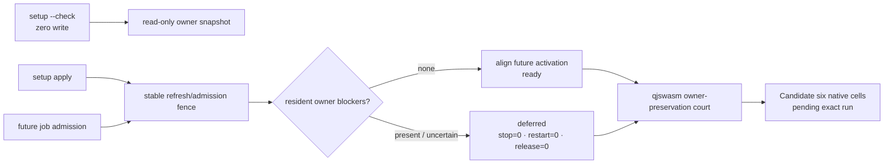
- [x] Two MCU-only surfaces are reviewed retirements, not ACU gaps. `ghost X Y`
  drew a decorative cursor with no observation or effect authority; callers
  must use real pointer state, structured hit-testing or screenshots instead.
  `desktop-helper status|probe|start|restart|stop` managed the obsolete
  `cu-helper-mac` sidecar; ACU loads libagenterm in-process and exposes
  permission status/repair separately. Compatibility callers receive an
  explicit typed retirement instead of silently invoking MCU or recreating the
  sidecar architecture.
- [x] CU is the first runtime consumer of the `libagenterm` dynamic library.
  Product code owns command and action meaning while ABI/platform layers own
  native mechanisms.
- [x] On Windows, the product `Command`/`Executor` path consumes UIA tree,
  Value, Invoke and Focus through the runtime `agenterm.dll`; it neither opens
  COM/UIA directly nor caches native interfaces. The platform backend uses an
  MTA-capable per-operation session, bounded UIA and wall-clock timeouts,
  `SetAutoSetFocus(FALSE)`, and RuntimeId re-resolution for every node action.
  Structured UIA failure is typed and never silently becomes a coordinate
  click. Five pure and two real fixture tests own the adapter evidence; the
  native ARM64 `cu-windows-smoke` receipt owns the public DLL-backed journey.
- [~] The expanded Windows x86 UTM journey now reaches the public `.com`,
  qjswasm worker, process observation and UIA actuation through an interactive
  desktop worker. Its remaining red is explicit: the background court lets UIA
  perform a node-focus request but publishes no focused read-back, so evidence
  is withheld. Transient `UIA_E_TIMEOUT` / rejected-call results get bounded
  retries inside the existing action deadline; semantic mismatches do not.
- [~] Whole-window foreground activation is now a separate vertical slice:
  `activate --window H` flows through `agenterm-platform`, additive
  `libagenterm` ABI 1.26, the ACU command/receipt layer and exact focused-window
  inventory read-back. It is deliberately distinct from accessibility-node
  `focus` and application-local `raise`. A live macOS round trip activated a
  background text-editor window and restored the prior foreground window, both
  verified on the first poll; Windows x86_64 and Linux x86_64 cross-builds are
  green. The MCU adapter now rewrites its whole-window `focus H` to this verb,
  so that compatibility fallback inventory falls from 31 to 30. Windows and
  Linux native desktop journeys remain the promotion evidence; the source and
  local macOS result alone do not promote the leaf. The first updated Windows
  x86_64 attempt reached a ready QEMU Guest Agent twice but the interactive
  desktop task produced no registration nonce, so the product journey never
  started; that attempt is recorded as court infrastructure blocked, the VM
  was stopped, and zero product evidence is inferred from it.
- [x] Windows runtime window enumeration follows a two-stage
  required-size/fill ABI. If desktop churn makes the fill call report
  `required > capacity`, the caller retries with a fresh capacity under a hard
  attempt bound; it never truncates, writes beyond capacity or spins forever.
- [~] Windows desktop-host ABI 1.7 implements notification-area menu projection,
  `RegisterHotKey`, polling and cleanup for the CU host's 18 placement actions
  plus Quit. A native `target/abi-dev` `host --self-test --json` run reported
  `actions=19` and `cleaned_up=true`.
- [x] Local `dist` staging colocates `agenterm-cu.exe` and `agenterm.dll`; the
  staged `cu-windows-smoke` proves version, dynamic-library load, 19 desktop
  actions and deterministic cleanup. The old “both below 1 MiB” statement is
  archived: v0.1.16 Windows x86_64 shipped a 1,420,800-byte CU executable, and
  current capability growth has crossed the still-governing 2 MiB executable
  court. The no-raise decision experiment is
  [`plan/design-cu-single-entry-size-experiment.md`](../plan/design-cu-single-entry-size-experiment.md).
  Variant C now keeps only route identity and parser family hot and stores the
  complete validated help/catalog projection as an immutable compressed
  in-binary stream. Exact Windows x86_64 evidence is 2,221,056 bytes at zero
  synthetic rows; 16 and 32 rows grow at 96 and 64 bytes/row respectively, so
  the structural slope and rebuild-time gates pass. The executable remains
  123,904 bytes above 2 MiB. D tested neutral system-DNS resolution after a
  Darwin symbol profile suggested about 130.8 KiB. Exact Windows evidence
  recovered only 1,536 bytes and still exceeded 2 MiB by 122,368 bytes, so the
  ABI prototype was rolled back. The time-boxed no-raise court is complete: C
  stays for its bounded slope, the release gate remains red by 123,904 bytes,
  and that gap returns as an explicit product-budget decision rather than an
  excuse for moving CLI policy across the DLL seam.
- [x] Staged public `cu-windows-smoke` passes all seven declared evidence
  receipts: host self-test, DLL load cleanup, window identity, UIA tree,
  name-addressed actuation, Value/GetText wait and UIA fixture cleanup.
- [~] The six-cell artifact manifest and shared build path now include
  `agenterm-cu` plus the colocated `libagenterm` dynamic library on Linux and
  macOS as well as Windows. The macOS release signer signs and strictly verifies
  manifest libraries before executables. Static manifest/build/signing gates
  own this wiring. The local six-cell baseline now also requires an
  architecture-matched `agenterm-cu` and executes its public bounded
  `storage-devices` observation after the AgenTerm launcher check; macOS arm64
  and a digest-matched native Linux arm64 qjswasm court are green. This is
  stronger than archive membership but remains a minimum court: Linux x86_64
  and Windows x86_64 local courts are still open. The formal Candidate path is
  now wired (not yet remotely executed): every one of the six native runtime
  runners consumes only its already sealed archive, runs the packaged
  `agenterm-cu` + colocated `libagenterm` through the exact-source
  `cu-retirement-cell-smoke`, and uploads a run/attempt/archive/binary-bound
  receipt. The aggregate requires exactly six current-attempt cells with
  matching source identity and embeds their validated summary into the sealed
  Candidate manifest. No runtime cell checks out source, invokes Cargo, or
  mutates machine state; a first successful exact-SHA Candidate remains the
  evidence needed to turn this leaf `[x]`.
  Native Unix packaging, macOS signing/notarization and sealed Candidate
  artifact evidence remain open.

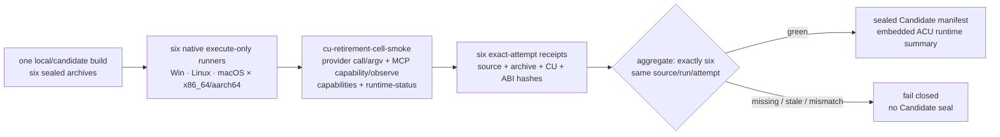
- [ ] Candidate and six-cell qualification and release evidence remain open.
  Passing local fixtures and staged public smoke does not promote this subtree
  root to shipped.

## Delivery and install (runtime `libagenterm` colocation)

`agenterm-cu` resolves every `agt_*` mechanism from a `libagenterm` dynamic
library loaded at runtime (`crates/agenterm-cu/src/dynlib.rs`): search order is
`AGENTERM_ABI_LIB` (full path) → the executable's own directory
(`libagenterm.dylib` / `.so` / `agenterm.dll`) → the development build dirs.
The load refuses an unlocatable library and refuses an ABI major mismatch. The
capability set, not the binary alone, is therefore the delivery unit: a cu
binary without its matching dylib is inert.

- [ ] **P0 — distribution defect: the shipped cu binary must be colocated with
  a version-matched `libagenterm.dylib`, and today it is not.** The macOS
  `.app` bundle (`~/Applications/AgentermCu.app/Contents/MacOS/`) ships the cu
  binary with **no `libagenterm.dylib` beside it**, and `install.sh` does not
  place one either. On such a host cu either fails to locate the library or
  loads a stale one, and reports `symbol agt_input_send_keys missing` /
  `agt_window_enumerate missing` / `input-inject not wired on unix` /
  `native-window-capture-is-unavailable`. These are **stale-library / missing-
  library symptoms, not missing mechanism**: the four foundation symbols
  (`agt_input_send_keys`, `agt_window_enumerate`, `agt_screenshot_capture_window`,
  `agt_a11y_tree_snapshot`) are declared, `#[no_mangle]`-exported and fully
  implemented on macOS at head (CGEventPost / CGWindowList /
  dlsym `CGWindowListCreateImage` / AXUIElement). Evidence and the full symbol
  and capability audit:
  [`docs/cu-gaps-analysis.md`](../docs/cu-gaps-analysis.md).
- [ ] the fix is in `packaging/` and `install.sh`: when the cu binary is copied
  into the bundle / onto `PATH`, copy the same-build `abi-release`
  `libagenterm.dylib` next to it (or set `AGENTERM_ABI_LIB`), and assert
  `agt_abi_version()` matches cu's `EXPECTED_ABI_MAJOR` / `REQUIRED_ABI_MINOR`
  (currently `1` / `29`, library reports `1.29`) at package time. This is the
  precondition for cu being usable out of the box on a user's machine; no new
  platform code is required.
- [~] **P1 — macOS TCC consent gates (runtime prerequisite, not a code
  defect).** Accessibility (AX tree, AX-backed window ops) and Screen Recording
  / Camera (`device-screenshot` full-screen capture) require TCC authorization.
  With consent absent, `device-screenshot` returns
  `host_tcc_consent_required`; `screenshot --window <handle>` uses the
  `CGWindowListCreateImage` path and works once granted. `permissions` and
  `doctor` (`crates/agenterm-platform/src/adapters/macos/permission_settings.rs`)
  must guide the user through granting these; they are the normal authorization
  flow, not a capability gap.
- [x] **Verification** (recorded in [`docs/cu-gaps-analysis.md`](../docs/cu-gaps-analysis.md)):
  `nm -gU target/abi-release/libagenterm.dylib | grep agt_` shows 88 `agt_*`
  exports including all four foundation symbols; with
  `AGENTERM_ABI_LIB=<repo>/target/abi-release/libagenterm.dylib` and
  `target/release/agenterm-cu --target current`, `capabilities` reports every
  group `available` (`input=Available`, `windows=Available`,
  `input_degraded: "none — shared agenterm.dll (milestone 46)"`), `tree`
  returns a real AX tree, `windows` returns real window handles, and
  `screenshot --window <handle>` produces a real PNG. This proves the four
  capabilities are live at head and isolates the failure to distribution + TCC.

## Immediate ACU-only cutover and archived-MCU repair loop

The 2026-09-07 product ruling changes retirement sequencing, not evidence
honesty. Runtime callers switch to ACU immediately; they no longer wait for
every compatibility leaf to ship. A shape ACU cannot yet express must fail
with one machine-readable `acu_todo` ALERT containing its stable `gap_id`.
Legacy MCU may be read from the archive to implement that gap, but must never
be executed as fallback. Closing a TODO still requires its owning public
qjswasm court and applicable native qualifications.

```text
ACU-only cutover
├─ [x] execution switch
│  ├─ [x] `mcu` compatibility command enters the ACU adapter only
│  ├─ [x] every unresolved shape returns `acu_todo` + ALERT + stable gap id
│  ├─ [x] no adapter branch spawns or recommends the archived MCU runtime
│  └─ [x] MCU implementation is read-only reference, outside supported entrypoints
├─ [x] dynamic repair registry (complete corpus; no unknown fallback)
│  ├─ [~] acu.dynamic.003 · snapshot tree + PNG share one id/reply; unit + adapter parity green,
│  │  └─ native macOS/Linux/Windows screenshot courts still required before full closure
│  ├─ [x] acu.dynamic.005 · legacy window-local zoom corners map to native `--local-region`;
│  │  └─ bounded pure arithmetic preserves the archived 20 percent padding while native
│  │     clipping uses one observed window bound; explicit output replaces the hidden path
│  ├─ [~] acu.dynamic.050 · exact simulator application status is native and Bun-free;
│  │  └─ bounded macOS read-only court proves installed/non-running truth; a pre-existing
│  │     running fixture must still prove the host-PID/start-identity/device join
│  ├─ [x] acu.dynamic.051 · the frozen `resource top` witness remains native and the related
│  │  `resource pressure` spelling now maps losslessly to `resource-pressure`; the public
│  │  qjswasm court executes both pressure spellings and preserves host-native semantics
│  ├─ [x] acu.dynamic.058 · legacy `privilege plan process.signal` reaches the native
│  │  identity- and tree-bound read-only planner; consented apply qualification remains separate
│  ├─ [x] acu.dynamic.061 · tmux topology is outside the one-tab AgenTerm PTY contract
│  ├─ [x] acu.dynamic.067 · `literal.*` reduces exactly to native loss-aware substring wait;
│  │  └─ general regex is native and linear-time over a complete retained scan window with
│  │     explicit pattern/match/scan ceilings; lookaround and backreferences fail typed
│  ├─ [~] acu.dynamic.072 · application facts umbrella; never borrow `.076` window evidence
│  │  ├─ [~] acu.native.app.facts-signature · Linux `app-facts` resolves exact bounded XDG
│  │  │  entry/executable facts; macOS resolves exact bundles and returns native signing,
│  │  │  verification and entitlement facts through a public court; the frozen `apps inspect`
│  │  │  witness maps to this verb; the Windows provider has landed and its public
│  │  │  court is registered but has not run on a Windows guest, so that cell remains pending
│  │  ├─ [~] acu.native.app.lifecycle-watch · shared app-facts × process-identity provider
│  │  │  emits bounded application-level launch/quit transitions; the macOS owned-process
│  │  │  court is green, while Linux/Windows native courts and provisioning remain open
│  │  └─ acu.native.app.provisioning · Apple provisioning/profile consistency
│  ├─ [~] acu.dynamic.074 · window-local scroll without physical-pointer movement
│  │  └─ current-host SkyLight research passed C1–C8, but the public AppKit baseline
│  │     also delivered. Three-arm Chromium attempt 1 stopped inconclusive before
│  │     injection when Google Chrome published no bridge connection; direct-profile
│  │     attempt 2 likewise stopped before injection when its fixed CDP port did not
│  │     answer. Attempt 3 reached the profile-owned `DevToolsActivePort` record but
│  │     its readiness curl was routed through the host HTTP proxy. Attempt 4 bypasses
│  │     proxies only for that loopback check and passed the frozen discriminator:
│  │     PRIVATE 20/20, both public controls 0/20, zero peer delivery or host-state
│  │     drift, and verified cleanup. The corrected current-host repeat then passed
│  │     1,000/1,000 PRIVATE actions in 20 contiguous blocks with zero loss,
│  │     misdelivery, duplicate or host drift and verified cleanup. Product
│  │     qualification remains blocked behind previous-generation C9; neither
│  │     research result registers public evidence or authorizes a provider.
│  │     This is distinct from Linux named `scroll-wheel`, which temporarily moves
│  │     and then restores the physical pointer.
│  ├─ [~] acu.dynamic.075 · native `browser-tabs` resolves one exact MV3 profile connection;
│  │  ├─ complete profile-wide background tabs retain stable tab/window ids, title and URL
│  │  ├─ truncated/ambiguous connection or tab inventories fail typed; no AX/CDP heuristic fallback
│  │  ├─ the frozen no-argument witness is resolved; this does not close every legacy option
│  │  ├─ [ ] acu.dynamic.075.profile-name-binding · human `--profile` / `--app` stays typed TODO
│  │  └─ owned-profile macOS qjswasm court is wired; Linux/Windows native courts remain
│  ├─ [x] acu.dynamic.076 · `inspect --app` maps to native bounded `app-inspect`;
│  │  ├─ whole matching window set + foreground identity are bracketed as one observation
│  │  ├─ truncated non-content trees are `inconclusive-truncated`, never false empty
│  │  ├─ macOS owned two-window Save Panel qjswasm court is green
│  │  └─ Linux/Windows native desktop qualification remains delivery evidence debt
│  ├─ [x] acu.dynamic.077 · native `query --subrole` preserves macOS `AXSubrole` through ABI 1.29;
│  │  └─ public owned Save Panel qjswasm court proves a deterministic `AXDialog` accessory probe
│  ├─ [~] acu.dynamic.078 · static legacy `elements` maps to native `query` with
│  │  ├─ the archived depth 12 / max 200 / actionable-by-default projection;
│  │  ├─ filtering before paging and original flatten indices shared with `invoke --index`;
│  │  ├─ invalid legacy `tree --page` and non-MCU tree/index/offset flags closed as usage;
│  │  ├─ valid `tree --max-value-bytes` maps to bounded previews and completeness truth;
│  │  └─ [ ] acu.dynamic.078.page-index-space · browser debug-read elements stay typed
│  │     until their separate page indices have a complete browser identity binding
│  ├─ [x] acu.dynamic.081 · legacy `observe` filters are a Bun-free post-capture projection;
│  │  ├─ poll-diff events carry same-walk actions/bounds/depth/states/text facts
│  │  ├─ unknown boolean facts match neither true nor false; `required` fails typed
│  │  └─ archived duration/tree/event defaults and matched-event paging are preserved
│  ├─ [x] acu.dynamic.084 · archived `windows watch` timing, event/window ceilings and
│  │  state/type/all filters map to bounded native per-sample semantics;
│  │  ├─ event type selection precedes the ceiling and truncation requires a retained max+1 event
│  │  ├─ `--max` is a complete filtered snapshot bound, not legacy silent pre-watch pagination
│  │  └─ macOS owned-window court proves state boundaries, occlusion honesty and ABI 1.36 `--all`
│  ├─ [x] acu.dynamic.085 · static `windows` Space/state/all and exact AX-root filters are native;
│  │  ├─ complete candidate filtering precedes offset/max paging
│  │  ├─ AX root inspection has an explicit scan ceiling and reports incomplete coverage
│  │  └─ macOS owned-window court proves state truth, exact roots and typed truncation
│  ├─ [x] acu.dynamic.086 · native macOS `app-menu-inspect` resolves an exact app + unique process;
│  │  ├─ process start identity, complete matching window set and foreground are bracketed
│  │  ├─ public owned qjswasm menu court is green without activation
│  │  └─ Linux/Windows return `app_menu_platform_unsupported`; use exact-window menu there
│  ├─ [x] acu.dynamic.087 · native macOS `app-menu-invoke` freezes exact app/process/window identity;
│  │  ├─ reserve precedes AXPress; delivery and business-effect verification remain separate
│  │  ├─ source-window disappearance after accepted delivery cannot become a false failure
│  │  ├─ public owned qjswasm menu court proves mark/tree read-back and unchanged foreground
│  │  └─ Linux/Windows typed-not-applicable; exact-window `menu-invoke` remains available
│  └─ [~] acu.dynamic.095 · window-local background hover without moving the real cursor
│     └─ distinct from shipped Linux named hover, which moves the pointer; no private background provider entered product code
├─ [ ] native/product TODO registry
│  ├─ capability truth and platform status → `plan/acu-mcu-capability-ledger.json`
│  ├─ zero catalog capability gaps; `process.signal.privileged` is platform-limited
│  │  └─ Linux/macOS apply qualification remains open; Windows provider remains a native TODO
│  ├─ implemented but unregistered evidence remains ALERT debt, never a fallback
│  └─ platform-limited cells remain typed and visible until their native court closes
└─ [ ] final retirement evidence
   ├─ MCU source absent from production entrypoints
   ├─ Bun absent from production ACU execution
   ├─ dynamic corpus returns only ACU execution, typed retirement or `acu_todo`
   └─ six-cell Candidate consumes ACU + matching `libagenterm` bytes
```

The Linux application-facts slice resolves one exact XDG desktop entry and
executable under bounded precedence and identity brackets. Its public qjswasm
court is green on the x86_64 UTM court; signature, verification, entitlements,
absent application version and incomplete process visibility remain individually
reasoned facts rather than guesses. The exact frozen `apps inspect APP` witness
calls that verb. `app-watch` now composes the same canonical executable identity
with native process start identities and emits only zero-to-live / live-to-zero
application transitions, so helper-instance churn cannot impersonate a launch or
quit. The exact `apps watch APP` spelling and its archived duration, interval and
event-ceiling defaults and ranges map to it; Linux/Windows lifecycle courts and
provisioning remain named `.072` work.

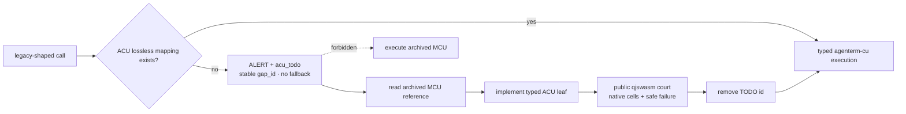

The TODO registry is deliberately an executable debt interface, not a claim
that missing behavior works. Unknown shapes still fail as ordinary usage;
known legacy shapes fail as `acu_todo`. Neither result is green evidence.

## Product outcome

- [~] `agenterm-cu` is AgenTerm's own computer-use foundation: one abstract
  command set for observing and controlling a machine — screenshot, window and
  control-tree enumeration, pointer, keyboard, clipboard, file transfer — that
  behaves identically whether the target is this machine or a remote one.
- [ ] it succeeds when an agent can drive a real desktop through one stable
  command surface, address controls by structured identity rather than guessed
  pixel coordinates, wait on observable state instead of sleeping, and have
  every action authorized and auditable.

## Why this product exists

- [ ] AgenTerm's north star is complete interface coverage: an agent must be
  able to control everything a human can and receive the same feedback. The
  terminal surface is largely covered; the machine outside the terminal is not.
  `agenterm-cu` closes that half.
- [~] The migration source is sibling-repo `moltbaby/skills/mcu` (`bin/mcu`).
  The accepted outcome is broader than the first desktop-bridge absorption:
  **`agenterm-cu` becomes the one machine-control entry and completely replaces
  MCU for production use.** Desktop discovery, accessibility trees, input,
  CDP, verification and window geometry land first; process, PTY, file,
  network, device, service, privilege and VM workflows must then become
  reachable through typed AgenTerm-owned facades. They need not be copied into
  the CU crate. Window placement
  ([32](PRD_02_32_cu_window_placement.md)) is one landed slice, not the product
  boundary. The executable goal, capability states and retirement gates are
  [`plan/goal-acu-replaces-mcu.md`](../plan/goal-acu-replaces-mcu.md).
  Provenance: [14](PRD_02_14_research_provenance.md) (lessons, not a TS copy).
- [x] R0 replacement accounting is exhaustive in
  `plan/acu-mcu-capability-ledger.json`: 13 families cover desktop, browser,
  process, PTY/job/terminal, file/storage, network, device/audio,
  service/runtime/session/audit, setup/doctor/permissions, host-resource,
  power, privilege and CoreSimulator. `remaining_families` is empty. This closes only the discovery
  DAG; rows marked `gap` or `platform-limited` remain work and cannot be called
  shipped from catalog presence.
- [~] MCU retirement is the current delivery cut, not a documentation-only
  migration. `desktop-state` (MCU alias `state`) is the first whole top-level
  fallback removed in this cut: one bounded window inventory selects an exact
  or uniquely resolved focused target, one bounded accessibility tree and the
  pointer are observed, then the complete window identity is revalidated.
  Ambiguity, disappearance, drift, inventory overflow and tree truncation are
  explicit rather than hidden. macOS public CLI evidence is green; Linux and
  Windows journey evidence remains open. The next dependency is the shared
  native runtime spine: on-demand coordinator → session lease → target lock → request identity
  → queryable audit. The middle three public leaves are now live: durable
  `session start|list|status|renew|end`, session-bound idempotent
  `lock acquire|list|release`, and newest-first `audit-query` with independent
  result/scan/byte budgets. Bounded `audit-compact` is plan-first; apply shares
  the append sidecar lock, drops malformed/expired/excess records explicitly,
  and atomically publishes a retained suffix under age/event/byte ceilings.
  Lease plaintext is returned once and never reaches
  durable state or audit. The transitional MCU-shaped entry now rewrites every
  session and lock operation plus `audit query|compact` onto these same ACU
  commands, removing the top-level `audit` fallback. The platform-neutral
  public qjswasm journey covers the full create/status/acquire/reacquire/
  release/end/query/retention loop on macOS, including expiry sweeping the
  session's target lock from public state. That lock acquire/session-end/expiry
  slice emits the distinct registered evidence `cu.target-lock-lifecycle`.
  Job admission and session
  termination now share one stable per-session cross-process sidecar gate. A
  job rechecks the live lease inside that gate before reserving or spawning;
  `session-end` first makes the session terminal, then stops every nonterminal
  bound job and releases its locks. The same lease may retry an interrupted
  cleanup idempotently, while incomplete cleanup is a typed failure whose
  effect explicitly remains `session_ended`. The public qjswasm journey proves
  the running child and resident owner disappear, the lock is released, and a
  retry repeats no effect. Current-target
  mutations can now carry the all-or-none `--request-id`, `--session` and
  `--session-lease` envelope: admission verifies the active lease without
  renewing it, reserves a private crash-persistent request record before the
  effect, returns terminal metadata on exact retry, and refuses an uncertain
  retry rather than executing twice. A changed command or session under the
  same request id is a typed conflict; command and lease plaintext never enter
  the request store. SSH and VNC now project a versioned, 1 MiB-bounded worker
  envelope over stdin: the effect-owning worker re-authorizes, verifies its own
  session, reserves before effect, audits and finalizes. The bearer lease never
  enters argv/environment, and target-to-current rewriting retains an opaque
  effect-scope digest so another endpoint conflicts instead of receiving a
  false replay. The platform-neutral public qjswasm file-copy court now also
  proves the current-target boundary: the first exact request publishes the
  destination, an exact retry returns `effect=not_repeated`, and the same id
  with a changed command is `request_id_conflict` without changing either
  object. Unit and process-boundary worker courts are green; public SSH/VNC
  mutation journeys, exact target-lock derivation, three-host evidence and
  remaining native courts stay open. `runtime-status` now truthfully reports
  that no global daemon is present or required: coordination is on demand and
  resident ownership belongs to the resource that needs it. Its snapshot reads
  effective session, lock and managed-job counts without sweeping, advancing
  the durable clock high-water mark or publishing state. The MCU compatibility
  shell maps `daemon status` to this result and `daemon caps` to the ACU
  capability catalog. `daemon start|restart|stop` are reviewed typed
  retirements with no MCU fallback and no successful no-op. The removed MCU
  daemon's login wrapper is retired with it; arbitrary per-user service
  installation and recovery policy remains a separate `service.user.lifecycle`
  provider gap. The public qjswasm evidence is
  `cu.runtime-status`; exact source `00d22433` passes it on Windows aarch64
  after a ten-file guest manifest match and disposable-court rollback. Linux
  and Windows x86_64 reruns remain open.
  The spine must serve jobs, file transactions, browser bridge,
  privilege and Simulator instead of spawning parallel coordinators.
- [~] Native service control now owns bounded launchd/systemd user and system
  inventory, exact provider/domain/name identity, status snapshots and
  user-domain lifecycle mechanics. The public `service list|status|plan|apply`
  contract binds native incarnation plus full before state; launchd bootstrap
  additionally binds a current-user-owned plist's canonical path, declared
  Label, byte length and digest. Approval is short-lived, reservation precedes
  effect, and uncertain outcomes never reopen automatic replay. The
  mutation-free qjswasm evidence is `cu.service-plan` on macOS; the same court
  separately proves bounded system inventory and exact system status as
  `cu.service-system-observe`. It does not claim privileged system mutation.
  The old
  one-call shape is now a Rust transaction requiring request/session identity;
  it acquires the exact service target lock before entering the same plan/apply
  state machine. `cu.service-transaction` proves no-effect failure, closed
  replay and lock release without touching a real service. This clears the
  final static STAY but does not retire MCU: system privilege provider, dynamic
  argument-shape gaps, Linux/Windows and explicit mutation/rollback courts
  remain open.
- [~] The compatibility spelling `acu caps` now returns the replacement ACU
  per-target capability matrix. It does not preserve MCU's private manifest as
  a second source of truth; declared, live, unavailable and unsupported states
  must instead become more precise in the ACU catalog and its native courts.
  Managed-job implementation has entered an internal, deliberately unshipped
  cohort: a private crash-safe registry seals start intent, generation, owner
  and exact child identity without accepting command, environment or lease
  plaintext; a resident owner claims that intent before contained spawn and
  drains stdout/stderr concurrently into loss-aware bounded rings. The shared
  platform child now yields one owned stdin writer whose drop is EOF, while
  containment ownership remains separate. The resident now derives a short
  opaque endpoint from its sealed generation, binds current-user native IPC
  before claiming `starting`, serves one bounded closed request per connection,
  and retains terminal output until its lease expires. No `job-*` verb is
  claimed yet: detached launch, request-bound public mutation and the
  platform-neutral qjswasm black-box journey remain required before any ledger
  row turns green.

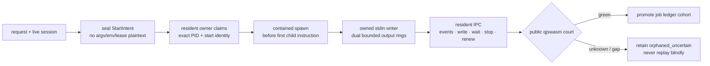
- [~] absorbed from that skill on 2026-08-30 (review and slices in
  [plan/design-mcu-absorption.md](../plan/design-mcu-absorption.md)): its
  default control loop `windows -> bounded query/tree -> invoke <selector>`,
  `verify --expect`, bounded tree acquisition (depth and node budget during
  traversal, truncation flagged), stable window handles with inventory
  filters, and its four invariants (background never steals the foreground,
  key focus or the real pointer; unsupported is fail-closed, never a silent
  global-input or sudo fallback; delivery is not success, every action says
  `verified` / `unverified`; destructive actions need an exact target, a
  prior snapshot and a checkable postcondition). Its shell / PTY / job /
  process mechanisms remain owned by AgenTerm and the `.qjs` tool door, while
  simulator, storage, device, network, power and privilege mechanisms remain
  owned by their platform/runtime modules. That ownership rule prevents kernel
  duplication; it no longer means those workflows may remain trapped behind
  MCU. ACU owns their stable public facade, typed result, deadline, cleanup and
  evidence contract. Each slice is proven by a `.qjs` journey
  (`scripts/qjs/cu-macos-smoke.qjs`, first) so the script engine is exercised
  by real computer-use scripts.
- [~] `tree --selector PATH` now closes the nested-subtree part of MCU's tree
  contract without inventing a second backend walk. One platform-bounded
  window-root acquisition resolves the existing deterministic sibling-index
  selector, then returns only that root and its descendants. The reply preserves
  original node ids and flatten indices, rebases displayed depth to the selected
  root, and retains the original `visited` / `truncated` scan truth. Public
  qjswasm evidence `cu.tree-selector-subtree` is green on macOS; the same owned
  fixture is registered for Linux and Windows. Invalid MCU `--page` remains a
  closed usage result; `--max-value-bytes` now bounds every returned node text,
  keeps complete observed byte length/SHA-256, and never hashes a provider-
  truncated value as though it were complete.
- [~] `query --watch-ms` now repeats the exact bounded query acquisition and
  filter rather than substituting the generic event observer. Optional
  `--until present|absent|change`, a bounded interval and a bounded compact
  diff ledger are public. A failed later acquisition increments
  `missing_samples` and can never satisfy `absent`; absence additionally
  requires a complete untruncated scan. Foreground identity is bracketed, an
  unmet condition is typed `query_watch_timeout` with the final observation,
  and diff events carry identity/changed-field names without duplicating node
  text. Public qjswasm evidence `cu.query-watch-filtered-poll` owns the
  macOS/Linux/Windows fixture contract; same-source native executions remain
  the qualification step. MCU-only filter shapes remain separate debt.
- [~] The post-watch parity audit found that the remaining query debt is not
  merely 20 unparsed flags. MCU and ACU currently differ in default traversal
  and result budgets, `within` geometry (center-in-rectangle versus rectangle
  intersection), actionable fallback roles, searchable fields, and the
  `inspect` / `find` / `read` result meanings. The next query tranche therefore
  starts with a correctness gate: align explicit budgets and geometry, and
  keep aliases typed as migration gaps where their meaning cannot be preserved.
  Only then may pure filters land; subrole/help/description/placeholder,
  required state and lossless long-value evidence require a platform/ABI
  extension rather than CLI-side invention.
- [~] The first correctness tranche is now native in the ACU query contract:
  case-insensitive exact action filters, bounded minimum/maximum depth, five
  explicit tri-state filters (`enabled`, `focused`, `selected`, `checked`,
  `expanded`), and MCU-compatible actionable-role fallback all compose over
  the same single bounded acquisition. Unknown state never matches `false`.
  Public qjswasm evidence `cu.query-native-filter-core` shares the existing
  three-host owned-fixture court with query watch. This does not promote the
  remaining aliases or cross-field text/region semantics; those stay typed
  migration debt until their complete contracts exist.
- [~] Profile-wide browser tab inventory now uses `browser-tabs` over the fixed
  MV3 bridge. It accepts one exact/unique-prefix profile instance or one exact
  connection, proves that the profile has exactly one live connection, rejects
  truncated inventories, preserves stable ids and URLs for background tabs,
  and brackets desktop focus through a settle window. `tab-list --window` and
  CDP title joins remain separate visible/heuristic tools and are never silent
  fallbacks. Human profile-name / application aliases remain excluded until a
  verifiable binding to the extension profile identity exists; the stable
  `acu.dynamic.075.profile-name-binding` TODO makes that missing sub-shape
  visible instead of misclassifying it as usage or treating the frozen
  no-argument witness as full closure. The macOS owned
  profile court is wired; Linux and Windows native qualification remains.
- [~] Desktop closure tranche: `snapshot`/`diff`, `hit`/`zoom`, `raise`, and
  gated `minimize`/`restore` are live in the macOS Cocoa/AX public journey.
  The same source state must still pass Linux AT-SPI2 and Windows UIA courts;
  `drag` stays in the separate explicit-global-pointer court because it may
  move the user's real cursor and must restore it even on failure.
- [~] Browser actuation closure now includes typed `page-hover`, `page-scroll`,
  `page-drag`, `page-dialog`, and `page-files` over a selected CDP target. All keep the page/window backgrounded, separate
  dispatch from verification, reserve receipts before effects, and use bounded
  viewport coordinates/deltas. Hover verifies the trusted DOM event target;
  scroll waits on the owned container's real scroll event and offset read-back.
  Files validates bounded regular non-symlink inputs, resolves one enabled file
  control, and verifies the exact FileList while omitting local paths from public
  evidence. Drag freezes two live viewport points, guarantees a release attempt
  after press, and verifies the trusted down/held-move/up sequence.
  Dialog handling first observes an opening event, then verifies the close event;
  prompt/message contents never enter public or persistent evidence.
  MCU-compatible `--match` now searches title + URL + description but tightens
  first-hit guessing into an exact-one contract: zero and ambiguity are typed
  before any page effect.
  Public `page-js` now treats Promise settlement as part of the observation:
  `Runtime.evaluate` always uses `awaitPromise`, synchronous values remain
  immediate, and resolved values, rejection, or the 10-second CDP deadline are
  returned as explicit evidence (`awaited=true`, `cdp_evaluation_failed`, or
  `cdp_timeout`). A throwaway headless Brave court proved a background Promise
  settles without changing the active target or foreground window and that a
  rejected Promise cannot be reported as success.
  MCU's viewport `page click X Y` is also native: the point is frozen before the
  receipt, trusted page down/up events are read back, and a failed release gets
  a cleanup attempt without converting the failed effect into success.
  MCU `page type TEXT` now freezes the existing editable focus and verifies
  same-element value growth; plaintext input and field values never enter its
  public reply or persistent receipt.
  MCU's `page --pid` endpoint discovery is no longer trapped behind the
  compatibility runtime: every ACU CDP verb accepts `--pid PID` as an exclusive
  alternative to `--port`. The native platform adapter reads only that exact
  live process, requires the same start identity before and after inspection,
  extracts an explicit valid `--remote-debugging-port`, and never scans guessed
  ports. The full command line is credential-bearing mechanism data and is
  never copied into replies, errors, receipts or documentation evidence.
  Native Windows ARM64 and x86_64 court evidence is green: on each ISA an owned
  Edge process launched with an explicit port was resolved from its PID through
  the Windows adapter, and `page-targets` returned the expected page. The
  x86_64 proof also repaired a court-only transport defect: QGA must invoke
  `schtasks.exe` directly, while a nested session-0 shell is not a portable
  registration boundary. The authoritative Windows `.qjs` browser journey now
  exercises that PID route; its integrated rerun is still required. Both Linux desktop courts currently report a typed
  prerequisite gap (`no Chromium-family browser`), not a fabricated pass.
  The 2026-09-04 headless Google Chrome court and scripted transport tests are green;
  real-profile and three-host journeys remain promotion evidence. The current
  public qjswasm court now runs the same mechanisms inside one ACU-owned,
  isolated Brave Profile: exact navigation/find/fill/click, trusted
  hover/scroll/drag, redacted dialog/file handling, PNG publication and a
  completed stat-only download all preserve `focus_changed=false`; stop and
  TTL then reap the browser and Native Messaging host. This replaces old
  shell-script citations with emitted evidence ids for macOS, but does not
  claim Linux or Windows qualification.
- [~] “No pre-opened CDP port” is now split into two honest product routes.
  Chromium cannot acquire a DevTools TCP/pipe endpoint after its process has
  started, so ACU will not publish a fictitious attach verb or restart a user's
  authenticated browser. The near-term default is an owned `browser-session`:
  its macOS public qjswasm court now proves start/list/status/stop, verified
  removal, same-name restart and TTL-owned cleanup against an exact
  caller-supplied headless browser without foreground activation. Linux and
  Windows native courts and crash-recovery evidence remain open, so this is a
  platform-limited replacement rather than a three-host completion.
  ACU starts a separate isolated profile with a random endpoint, records exact
  process identity, owns the complete process tree, and exposes typed
  start/list/status/stop/remove. Its pure foundation now validates one portable
  session-name component, emits `--remote-debugging-port=0` rather than scanning
  or reserving a guessed port, and strictly parses the bounded two-line
  `DevToolsActivePort` record into a loopback browser websocket. Its durable
  registry foundation now fixes one private per-user root, one closed
  per-session layout, bounded atomic JSON publication, generation + nonce +
  owner start-identity replacement checks, and explicit
  `starting/ready/stopping/stopped/failed/orphaned_uncertain` states. A ready or
  stopping record is invalid unless exact browser identity and endpoint travel
  together. The internal same-binary resident owner now waits for the launcher's
  post-spawn identity publication, holds the per-session lock, launches one
  process-group/Job-contained browser, publishes ready only after the strict
  port record, accepts only a stop request bound to generation + nonce + both
  process identities, and performs bounded cleanup on stop, TTL, failure and
  unwind. A prior endpoint file is removed before spawn, so a replacement
  generation cannot inherit stale readiness. Cleanup uncertainty—including an
  unexpectedly exited Unix tree root—is a durable state, never a claimed stop.
  The public lifecycle now reaches that owner. Start requires one absolute
  executable and bounded readiness/TTL. Stop requires the literal
  `--expect stopped` postcondition and verifies both identities absent; remove
  accepts the caller's exact terminal expectation (`stopped` or `failed`),
  repeats that proof, locks out the owner, checks the private profile object
  identity plus exact owner marker, refuses unknown entries, and only then
  removes owned state. A real macOS Chrome court passed ready → inventory →
  status → stopped → removed without opening a window. The platform crate now
  owns one reusable contained-headless spawn contract. Unix creates the process
  group in the pre-exec child; Windows creates the root suspended, assigns its
  exact process handle to a kill-on-close Job, and resumes only after assignment
  succeeds, with a fail-closed breakaway retry for an incompatible parent Job.
  Both Windows ISAs compile this path, and the refactored macOS lifecycle court
  remains green. The native `win-x86_64-desktop` and `win-aarch64-desktop`
  courts also executed the exact
  platform test whose first child instruction opens the expected named Job and
  proves its own exact process membership; both exited zero. The x86 court's attempted QGA
  batch-log pull produced no file, so exit status is the evidence and no text
  transcript is claimed. The ARM64 interactive court then exposed and closed two
  real lifecycle gaps: secure Windows relative opens had erased NTSTATUS
  `NotFound`, so readiness failed before `DevToolsActivePort` could appear; and
  a runner Job that denied breakaway left no usable lifetime mode. NTSTATUS is
  now translated to typed Win32 errors, creation/sharing races retry within the
  existing deadline, and the registry explicitly reports
  `caller-job-fallback` when the owner is bounded by the ambient Job. The same
  court passed Edge ready → status → stopped → removed, while a prior failed
  start was removed through `--expect failed` only after both recorded processes
  were proven absent. Linux lifecycle and descendant cleanup remain promotion
  evidence, not inferred passes.
  Executable discovery is intentionally caller-owned.
  Existing browsers with an explicit startup
  endpoint remain borrow-only through `--pid`; existing browsers without one
  retain AX/tab-strip control. The authenticated-profile route is a separately
  installed fixed-identity MV3 + Native Messaging bridge. Its protocol-v3 core
  now has bounded little-endian framing, split/combined-frame decoding, a
  closed `status|tabs|windows|window-open|window-state|debug-read|debug-invoke|debug-type|debug-files|reload` catalog,
  bounded request ids and typed
  malformed/oversize refusal. A fixed new ACU extension identity, embedded MV3
  assets, same-binary native-host manifest plan and current-user/exact-process
  connection registry are present. Protocol v3 also publishes a persistent
  random Profile instance identity. The same `agenterm-cu` executable now
  intercepts only that fixed extension origin before any ordinary CLI output,
  so Native Messaging stdout contains frames only; a foreign or malformed
  host invocation fails without stdout. Public typed commands install the
  current-user bundle, list bounded exact-process connections, and route
  `status`, `tabs`, `windows`, `window-open`, `window-state`, `debug-read`,
  `debug-invoke`, `debug-type`, `debug-files`, `attach`, or `reload` only
  through an exact 256-bit connection
  id. Setup truthfully reports `extension_loaded=false` and
  `manual_activation_required=true`; it never claims Chromium loaded the
  unpacked extension. `debug-read` walks a
  bounded cross-frame AX tree without exporting form values, proves tab/window
  presentation did not change, and treats debugger detach failure as failure;
  tab inventory is independently bounded. The same connection now exposes a
  bounded profile-scoped Chromium window inventory and a closed
  `normal|minimized|maximized` state mutation. The latter refuses a foreground
  target and also refuses when no exact browser focus owner exists: an MV3
  extension cannot restore an unrelated foreground application. Success
  requires exact state, tab identity and final browser focus read-back; a failed
  postcondition attempts rollback and never becomes success. This is useful
  implementation depth. `browser-session-start --bridge` now materializes the fixed
  current-user host registration and passes the exact extension directory to
  Chromium's isolated owned Profile. A public macOS qjswasm court has proved a
  real fixed extension connection, persistent Profile identity, exact
  status/tab/window inventory, stop →
  Native Messaging host EOF cleanup, same-name restart and TTL cleanup without
  changing foreground focus. The same court creates real windows, binds one
  exact background tab to a runtime-session lock, replaces the Native Messaging
  connection, and proves old-host exit, one unique new connection with the same
  Profile/tab identity, unchanged desktop focus, and exact lock release at
  session end. The receipt says `reload_scope=native-connection`; extension-code
  update and activation remain a separate setup boundary. This promotes the
  bridge slice on macOS only. The same public court now uses a child frame whose
  controls live in a closed shadow root and proves bounded read, exact type,
  focus, press and file injection by tab/frame/backend-node plus role/name. It
  requires effect-specific postconditions, mandatory debugger detach, durable
  request identity, independent business-state read-back and unchanged
  background presentation. Typed text, node labels and complete local file
  paths never enter persistent audit or public receipts. Once an effect frame
  may have reached the extension, write/flush/read/malformed-response or later
  verification loss becomes `outcome_unknown` and the durable request id cannot
  replay it. This promotes closed-tree control from gap to platform-limited;
  Linux/Windows native Profile courts remain pending. Unit, CLI, both
  Windows-ISA compile, foreign-origin stdout, and empty exact-connection
  inventory evidence are green.

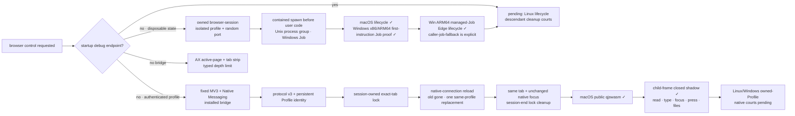
- [~] Browser download ownership is now a native `page-download` vertical
  slice rather than a successful `page-js` / `page-click` acknowledgement.
  The caller selects exactly one CDP page target and one download control,
  supplies an existing absolute `--download-dir`, and bounds the lifecycle
  with `--wait-ms 1..=300000`. ACU takes one cross-process lock per CDP
  endpoint because `Browser.setDownloadBehavior` is browser-global, installs
  `allowAndName` with events enabled, clicks without selecting the tab or
  raising its window, and correlates `downloadWillBegin` with
  `downloadProgress`. Success requires `state=completed` and a final regular
  non-symlink entry at the GUID path that is independently `stat`-verified;
  evidence returns the GUID, suggested filename, final path and decimal byte
  counts but never opens or emits file contents. Every exit attempts policy
  restoration. A held endpoint lock, policy refusal, cancellation, absent
  start event, deadline, or missing final file is a distinct typed failure,
  never a fabricated success. The non-sensitive Blob path is now green in the
  public qjswasm owned-Profile court: its GUID-named final path is a non-empty
  regular file, the suggested name is preserved, and `content_read=false` is
  asserted. Real one-time credential downloads remain excluded from
  repeatable test fixtures.
- [x] Native browser Save Panel handling is a separate P0 from direct CDP
  download. A real macOS incident proved that `windows` could observe a Brave
  `保存` panel by CGWindowID while `unlock`, targeted `send-keys`, and
  `activate` all reported no AX window; untargeted key injection then claimed
  success although the panel remained. The first platform correction resolves
  exact CG handles through the all-window owner inventory and recursively
  searches public `AXChildren` below every `AXWindows` root, so attached
  `AXSheet` descendants and off-Space windows are not rejected merely for
  missing the on-screen/root lists. An existing-but-unmatched handle is now
  typed `a11y_window_not_addressable`, distinct from a vanished window.
  The semantic panel leaf is now live. A separate planned unified download
  reducer must interleave CDP
  progress with bounded native panel observation, expose
  `waiting_for_save_panel | downloading | completed | canceled | blocked |
  timeout`, and permit Save/Cancel only under explicit actuation with semantic
  read-back. A controlled non-sensitive panel fixture owns that evidence; a
  live credential panel is never the test fixture.
  Live evidence then closed the first read/action loop: the mapped sheet
  exposed 12 nodes, including identifier `save-panel`, a filename field, a
  location pop-up and unique Cancel/OK buttons. The controlled
  `cu-macos-save-panel-smoke` court now proves both actions: semantic Cancel
  removes the exact panel and creates no file; semantic Save removes the exact
  panel and creates one bounded ordinary file. Both receipts require
  `performed=true`, `verified=true`, before-present/after-absent inventory, and
  orphan-free fixture cleanup. That court also found and fixed an effect
  receipt false negative: a successful Press invalidated the sheet before the
  generic post-action tree read. Invoke now treats exact before-present /
  after-absent inventory evidence as verified only for a mechanism-successful
  Press/Cancel. It cannot excuse another action or a surviving/unreadable
  window. The fixture reads no saved content and prints no path or secret.
  Untargeted `send-keys` was the inverse failure in the same incident: the OS
  injection API accepted Escape while the panel stayed open. That compatibility
  path now states `performed=true`, `verified=false`, `delivered=false`, with
  an unverified persistent receipt whose key evidence is length+digest rather
  than plaintext. Callers needing proof must use an exact window/node semantic
  action and its postcondition; JSON `ok` alone is not delivery evidence.

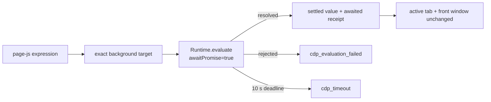
- [~] Non-desktop facade tranche has started across process, network and
  terminal owners; platform qualification remains independently explicit.
- [~] `ps` now closes MCU's rich process-inventory shape through one bounded
  typed facade. List mode composes exact/name/parent/command/resource filters,
  stable PID/CPU/memory sorting and offset/max pagination; `--max-visited`
  limits detail probes. CPU percentage is measured from two cumulative native
  samples over the declared `--sample-ms` window rather than fabricated from
  one counter. Command matching never returns command plaintext: only length
  and SHA-256 leave the process boundary. PID detail mode owns bounded
  ancestor/descendant traversal plus optional identity-bracketed file and
  socket attachments; an unavailable native provider remains a typed embedded
  result instead of erasing the valid tree. Public qjswasm evidence
  `cu.process-inventory-rich` is green on macOS; Linux and Windows native reruns
  remain before three-host promotion.

- [~] `process-cgroup` closes the Linux observation half of MCU's cgroup shape
  without equating unrelated host mechanisms. The native facade retains the
  exact process object, brackets `/proc/<pid>/cgroup` membership bytes, opens
  the cgroup v2 directory without following links, reads every bounded leaf
  relative to that directory handle, and then rechecks process identity,
  membership and directory device/inode. Counters leave the boundary as
  lossless decimal strings; absent optional leaves remain distinct from
  malformed, inaccessible or oversized data. Public qjswasm evidence
  `cu.process-cgroup` is green on macOS with the typed
  `process_cgroup_not_applicable` result. Linux x86_64/aarch64 native courts and
  the Windows typed-not-applicable court remain before this leaf is complete.

- [~] `process policy ... status|background|normal` is now one explicit
  platform-limited contract rather than a weaker PID-racy port. Status brackets
  one public macOS `proc_pidinfo` flag read with equal start identities. A
  precommitted native experiment then proved that a normal macOS process cannot
  obtain the Mach task port required for an exact effect, even for its direct
  child. Therefore `background|normal` verify caller intent and return
  `process_policy_exact_authority_unavailable` with `effect=not_performed`;
  they never invoke `taskpolicy -p PID`. Linux and Windows return typed
  not-applicable results instead of translating unrelated scheduling, priority
  or power semantics. The public qjswasm court is registered; Linux and Windows
  native reruns remain.

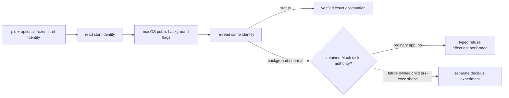

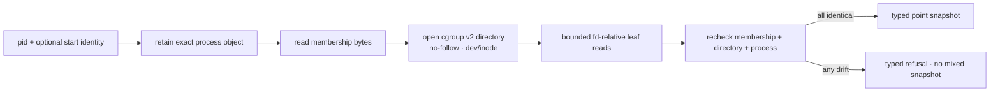

- [~] `power status` now has a native, observe-only ACU facade rather than a
  Bun/MCU host probe. `agenterm-platform` reduces each OS boot source to an
  opaque digest (macOS `kern.boottime`, Linux kernel boot UUID, Windows boot
  environment GUID); CU binds it to the explicitly enrolled installation
  pseudonym. The reply exposes neither a hardware UUID, raw native boot value,
  private installation key nor system-process identity. Observation refuses a
  missing enrollment instead of silently creating state. The public qjswasm
  court `cu.power-host-status` is green on macOS and the Windows x86_64 target
  compiles; Linux and Windows native executions remain before three-host
  promotion. Power mutations remain separate privilege-plan/apply leaves.

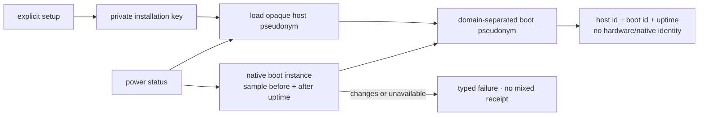

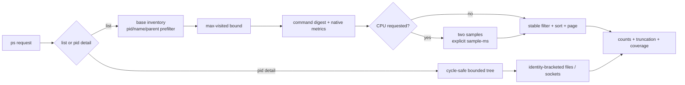
- [~] `process-argv` is the first process-image detail facade. It reads native
  argument boundaries between two matching process start-identity observations,
  caps a page at 4,096 rows and omits plaintext by default; every hidden row
  still carries its index, byte length and SHA-256. `--values` is the explicit
  disclosure path. The MCU-shaped `process argv PID` adapter now routes to the
  same command. macOS public-CLI evidence is live and all three qjswasm native
  journeys declare platform receipts; integrated Linux/Windows reruns remain
  open, so this leaf is not yet three-host complete.
- [~] `process-cwd` / MCU-compatible `process cwd PID` is the next native
  process-context slice. It brackets the native read with equal process-start
  identities, publishes the explicitly requested UTF-8 path plus byte length
  and SHA-256, and never substitutes the ACU worker's directory. Linux reads
  `/proc/<pid>/cwd`; macOS reads `PROC_PIDVNODEPATHINFO` directly through
  libproc. Windows is deliberately `process_cwd_unsupported`: there is no
  stable public API for another process's current directory, and undocumented
  remote PEB / `RTL_USER_PROCESS_PARAMETERS` layouts (including WOW64) are not
  a product contract. Host unit tests and a macOS public-CLI read are green;
  the registered Linux/macOS journey evidence and Windows refusal court remain
  to be executed before promotion.
- [~] `process-environment` / MCU-compatible `process env PID` closes another
  process-context gap without turning environment secrets into ambient logs.
  Linux reads the 4 MiB-bounded `/proc/<pid>/environ` block and macOS parses
  `KERN_PROCARGS2`; both name the result `exec-initial`, because later
  `setenv`/`putenv` mutations are outside these native contracts. The read is
  bracketed by equal process-start identities, preserves duplicate, empty,
  malformed and non-UTF-8 raw entries, then raw-name sorts, prefix-filters and
  pages them. Default rows expose names plus byte lengths and SHA-256 only;
  `--values` is the explicit value-disclosure path. A macOS kernel omission is
  `process_environment_empty_or_omitted`, never a fabricated empty set.
  Windows is deliberately `process_environment_unsupported` rather than a
  remote PEB/WOW64 reader. Host tests and a macOS owned-process public CLI
  circuit are green; registered Linux/macOS journey evidence and the Windows
  refusal court remain to execute before promotion.
- [~] Permission discovery no longer requires agents to mine the broad
  capability document: `permissions status` is a live observe-only public command
  that returns the host permission model, every gated verb and exact repair
  guidance. It reuses the identical declaration embedded in `capabilities`,
  performs no settings mutation and never claims a grant the host cannot
  inspect. Unit and local public-CLI evidence are green on macOS; required vs
  optional classification and native Linux/Windows journey evidence remain
  open. `permissions open [accessibility|screen-capture]` is now the separate
  actuate shape: it reads native state first, returns a verified no-op when the
  selected grant is already held, or on macOS dispatches only that grant's
  exact System Settings pane. Omission selects Accessibility before Screen
  Capture; any unknown state fails typed rather than guessing. Linux answers
  `permission_open_not_applicable` and Windows answers the truthful
  provider-specific gap. Dispatcher acceptance never claims consent changed;
  the caller must re-run status after the user acts. The no-visible-UI public
  qjswasm court is green locally; a denied macOS exact-pane court plus native
  Linux/Windows execution remain open.
- [~] `doctor` is now a first-class observe-only command. Schema 2 performs
  bounded live window/display probes and zero-write runtime/store, native
  service-provider, ABI version + required-symbol, exact target/session-binding
  and browser-bridge checks. It embeds the exact canonical `permissions` and
  `capabilities` declarations, opens no settings and installs no helper. A
  required failure returns nonzero `doctor_not_ready` while preserving the
  complete report; optional/non-applicable rows remain explicit. Public qjswasm
  evidence `cu.doctor-desktop-baseline` and `cu.doctor-system-readiness` is green
  on macOS and also proves `setup --check` does not publish its launcher.
  Linux/Windows native courts remain open.
- [~] `capabilities` now publishes deterministic `verb_status_counts` over the
  final merged public inventory. The public `cu.capabilities-declaration`
  journey proves every verb contributes exactly once and the count total equals
  the inventory length. This is declaration integrity, not MCU's cross-mechanism
  live probe. One shared core with thin macOS/Linux/Windows evidence entry
  points binds the native platform from the executable reply, inventories live
  display geometry, queries clipboard provider/type metadata without reading
  clipboard payload bytes, and proves a bounded shell child was reaped without
  allowing platform copies to drift. macOS is green locally and Windows ARM64
  is green on a real UTM desktop at source `e0a2ab54`; Linux remains registered
  but unqualified. A second focused component observes only its
  qjswasm worker and one owned listener while proving process inventory, stable
  identity, argv/environment metadata without plaintext, cwd, usage,
  descriptors, mappings, threads and socket attribution. The row remains a
  gap. A third owned no-activate Cocoa fixture now closes the macOS vocabulary
  with exact windows, bounded tree, query/find/read aliases, element text and a
  nonempty PNG while proving foreground preservation and exact-child cleanup.
  The Linux same-source receipt remains absent, so macOS/Windows completeness
  cannot promote the cross-platform row. Catalog presence and a caller-supplied
  cell label are never evidence.
- [x] The old MCU-shaped `setup/doctor/caps` aggregate ledger row is retired as
  an authority error, not as removed user value. Setup publication and owner
  preservation, desktop diagnosis, permission guidance, capability declaration,
  system readiness and live probes each have a separate leaf and evidence owner.

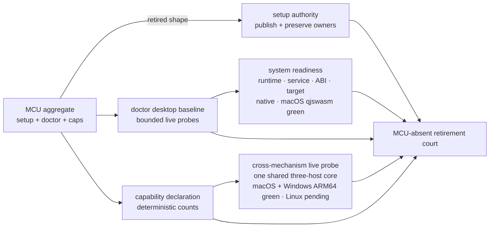

  The compatibility adapter now routes MCU-shaped `acu doctor` directly to
  this native command, reducing the MCU `STAY` inventory from 32 to 31; routing
  tests and a live macOS adapter invocation are green. Whole-window activation
  subsequently reduces it to 30 under the separate evidence above.
- [~] Host application dispatch is now a first-class actuation:
  `host-open PATH_OR_URL [--app APPLICATION] [--background]` (alias `open`)
  crosses a typed `agenterm-platform` facade and never invokes a shell. macOS
  uses the system LaunchServices launcher, Linux uses a system `xdg-open`, and
  Windows uses `ShellExecuteW`; target/application values are bounded and
  option-like or NUL-containing values are rejected before native dispatch.
  The durable receipt stores byte lengths and SHA-256, not plaintext. A native
  acceptance is only `performed=true, accepted=true, verified=false`, never a
  fabricated claim that the handler rendered or consumed the target. The
  background no-window macOS qjswasm fixture is green as
  `cu.host-open.macos`; Linux `--app` desktop-entry and PATH dispatch is green
  through `cu.host-open.linux` with independent windows/ps/get-text read-back
  (not CU self-report). Windows native court remains open. MCU `open` now
  routes here, reducing the top-level compatibility `STAY` set from 21 to 20.
- [~] Desktop notification dispatch now follows the same typed boundary as
  host-open: `host-notify TITLE [BODY] [--subtitle TEXT] [--sound] [--action KEY LABEL]...` (alias
  `notify`) sends bounded text as native argv data, never shell or generated
  AppleScript source. Receipts redact all content to byte length and SHA-256.
  macOS Notification Center is green through `cu.host-notify.macos`; Linux FDO
  session-bus dispatch is green through `cu.host-notify.linux` with independent
  dbus-monitor read-back (not CU self-report). The reply
  remains `verified=false` because acceptance cannot prove presentation or
  user attention. Linux `notify-send` / FDO dispatch and the Windows native
  notification-icon provider compile for both ISAs; Linux FDO dispatch and
  action-button pairs are evidenced through dbus-monitor Notify/ActionInvoked
  read-back (not CU self-report); dunst still publishes no AT-SPI action controls.
  Subtitle and
  sound are macOS-only until another provider can prove equivalent semantics.
  MCU `notify` now routes here, reducing top-level `STAY` from 20 to 19.
- [x] The compatibility boundary no longer lies about `permissions`: `acu
  permissions [status]` reaches the canonical observe-only ACU facade used by
  `doctor` and `capabilities`, and the old MCU entry advertises ACU as its
  replacement. This reduces the compatibility `STAY` inventory from 30 to 29;
  `acu permissions open` reaches the consent-preserving action above, while
  operating-system authorization itself remains user-controlled.
- [~] Process identity observation is live as `process-state --pid N` on
  current/ssh/vnc. It returns `live|dead|unknown`, preserves fail-closed unknown
  evidence, and publishes the platform start identity when available. MCU
  `process state N` routes to it. Future signal/kill work must bind the PID and
  this start identity, then verify post-state; naked PID mutation is excluded.
- [~] `process-usage --pid N` is live: cumulative CPU time,
  resident bytes and page faults are sampled between two equal start-identity
  observations and wide counters are decimal strings. `--watch-ms` returns an
  immediate sample plus a monotonic, identity-bound series under independent
  duration, interval and sample ceilings; `completed` and `truncated` remain
  distinct. MCU `process usage N --watch S --interval S --max-samples N` maps
  to this shape without a Bun-owned sampler; richer I/O remains an explicit
  gap. macOS has live evidence; Linux and Windows declare the same leaf and
  await their updated native-court runs.
- [~] One-shot `process-fds`, `process-maps`, and `process-threads` inventories
  are live through the shared platform boundary. Every snapshot is bounded
  independently from result pagination and bracketed by the same native start
  identity; native non-UTF-8 names and paths remain lossless in the typed JSON
  reply. macOS uses a build-linked `libproc` adapter and has public qjswasm
  evidence `cu.process-inspection`; Linux uses procfs and is cross-built for
  both ISAs. Windows refuses with `process_inspection_unsupported` instead of
  parsing undocumented remote-process structures. Linux native execution,
  Windows refusal courts and MCU-compatible watch/diff remain open.
- [~] One-shot `process-sockets` now joins each process-owned fd to a bounded
  native socket row between equal process start identities. The reply keeps
  family, protocol, local/remote/combined endpoint, normalized state and fd;
  Unix-domain endpoint bytes use the same lossless text-or-hex projection as
  other native paths. Native descriptor traversal and caller filtering/page
  limits are independent and both expose truncation. macOS uses build-linked
  `libproc`; Linux joins `/proc/PID/fd` socket inodes to the process network
  namespace without `lsof`; Windows returns typed unsupported instead of
  parsing private handle tables. Public qjswasm evidence `cu.process-sockets`
  is green on macOS against an invocation-owned loopback listener. Linux native
  execution, Windows refusal courts, global/name socket inventory and bounded
  watch/diff remain open.
- [~] `process-wait` is the first process capability that deliberately exceeds
  MCU's implementation: the caller supplies the `process-state` start identity,
  ACU opens and waits on a native stable process object, and PID reuse is a
  typed mismatch rather than a new target. Its timeout is monotonic and returns
  verified `timeout` instead of pretending the process exited. The three public
  journey scripts own the next evidence pass; macOS is live green while Linux
  and Windows await their next native-court rerun.
- [~] `process-kill` / MCU alias `kill` is the first identity-safe process
  mutation. The caller must provide PID + the prior `process-state` identity +
  explicit `--expect exited`; ACU then reserves a crash-persistent receipt,
  signals through a retained native process object, and waits on that same
  object for the postcondition. Linux uses `pidfd_send_signal` (graceful or
  forceful) and a real Linux x86_64 court has returned verified exit with no
  surviving child. Windows forceful mode uses a retained HANDLE; its x86_64
  court likewise returned verified exit in 114 ms with a closed receipt.
  macOS now retains `TASK_AUDIT_TOKEN` while opening the stronger termination
  reference, releases the task-name port, and calls
  `proc_signal_with_audittoken`; XNU validates the embedded pidversion, so a
  recycled PID cannot receive the effect. The macOS public qjswasm journey
  proved graceful exact exit, receipt completion and owned reaping. Arbitrary
  signals, suspend/resume and bounded process-tree termination remain separate
  leaves.
- [~] `process-set-state` closes the unprivileged MCU pause/resume shape with a
  stronger contract. The caller supplies the prior `process-state` identity;
  Linux signals through the retained pidfd and macOS through the retained audit
  token, then ACU reads the scheduler state back before returning verified.
  No-op state is verified without an effect receipt. Once the native signal is
  attempted, exit, PID reuse, observation failure and timeout all close the
  durable receipt as performed-but-unverified instead of leaving an ambiguous
  reservation. The public qjswasm journey `cu.process-set-state` is green on
  macOS. Windows answers `process_state_unsupported`, and MCU `--sudo/--broker`
  shapes remain with the privilege-provider leaf until a real consent boundary
  exists.
- [~] `process-signal --pid N SIGNAL` generalizes that exact-object authority
  without pretending every signal has a verifiable application effect. Linux
  delivers through the retained pidfd and macOS through the retained audit
  token; Windows supports only forceful KILL through its retained HANDLE and
  returns `process_signal_unsupported` for POSIX-only signals. TERM/KILL verify
  exact-object exit, STOP/CONT verify scheduler state, while HUP/INT/USR1/USR2
  truthfully return delivery accepted with `verified=false`. SIGKILL requires
  explicit `--force`; every post-effect observation failure closes the durable
  receipt rather than leaving a reusable reservation. The public qjswasm
  journey `cu.process-signal` is green on macOS: stale identity refusal,
  SIGUSR1 delivery, single-process STOP/CONT/KILL, then a real root plus two
  descendants through tree STOP/CONT/KILL all pass. Unix `--tree` freezes root
  and descendants until two bounded snapshots agree, retains each native
  object, delivers deepest-first, and resumes only members it found running;
  pre-stopped members remain stopped. Windows returns the same honest typed
  tree refusal as MCU because no containment object owns an arbitrary existing
  tree. MCU's unprivileged single-process and tree `signal` shapes now route
  here, reducing top-level compatibility `STAY` from 19 to 18; only privileged
  signal shapes remain behind the consent-provider gap. The operation reserves
  its public effect receipt and publishes a private recovery transaction before
  its first freeze. Every exact member is durably captured, then advances by
  write-ahead `freeze-intent → frozen-by-us` and, when it leaves the final
  stable tree, `release-intent → released`; delivery cannot start until the
  stable membership is sealed. Restart recovery observes the saved start
  identity before acting, never touches a replacement PID, preserves members
  that were already stopped, and separates `cleanup_verified` from an unknown
  signal effect. A crash between freeze intent and its completion is resumed
  with explicit `freeze_ownership_ambiguous=true`, not silently presented as a
  verified effect. The registered qjswasm court externally kills the exact ACU
  owner while the durable transaction is still `stabilizing`, then proves the
  next owner repairs the terminal receipt and leaves no frozen orphan. Unit
  courts cover first-intent, suspend-before-mark, mid-tree and
  resume-before-release-mark crash windows.
- [~] `process-watch` replaces MCU's PID/name/parent/all lifecycle watch with a
  bounded identity-safe diff. It takes one baseline and emits `started` /
  `exited` rows keyed by PID plus native start identity, so PID reuse cannot
  retarget the stream. Duration, interval, event count and matched inventory
  have independent hard ceilings. Unknown identity for an exact PID and
  oversized inventory fail typed; broad watches omit unidentified rows only
  with `coverage_complete=false` and an explicit count. A real owned-child exit is green through the macOS public CLI;
  macOS/Linux/Windows qjswasm journey leaves are declared for native reruns.
- [x] Linux x86_64 exact-SHA native execution is green at 24 / 24 STEP and
  26 / 26 evidence ids in 48.123 s, including the atomic `--ready-path` edge,
  real owned-child exit, identity-bound `process-kill` through a retained
  pidfd, accessibility observation and owned cleanup. This
  proves the integrated journey but does not retroactively invent a cause for
  the previous mixed-time AT-SPI snapshot. The complete poll/error account now
  survives in every failure bundle; fixed sleeps and weakened assertions stay
  excluded.
- [~] The Windows x86_64 Scheduled Task court exposed a distinct public-entry
  defect before the journey's first STEP: `agenterm.com` started the GUI PE
  with handle inheritance but without `STARTF_USESTDHANDLES`, so a no-console
  parent could lose redirected stdin/stdout/stderr before the hidden CLI
  worker existed. The trampoline now explicitly passes all three standard
  handles. Cross-compilation and source-contract tests are local evidence only;
  the same no-console public `.com` court must turn green before this is called
  fixed. Direct `agenterm.exe __agenterm-internal-cli` runs are diagnostic and
  can never substitute for that public evidence.
  The latest bounded court attempt is infrastructure-blocked rather than red:
  UTM and QGA became ready, but the interactive job agent did not claim the
  nonce request, so neither the public version probe nor the 16-step journey
  started. Zero evidence is attributed to the product, and the VM was stopped.
- [~] The MCU PTY/job/terminal surface is exhaustively classified in
  `plan/acu-mcu-capability-ledger.json`. The first AgenTerm-owned terminal
  facade is now live as `terminal-new/close/list/read/send/wait`: the small
  `agenterm-control-client` crate speaks the same bounded socket/pipe protocol
  directly, preserves typed server errors and control receipts, and never
  parses human-formatted CLI output or starts a second CLI process. Stable
  tab identity is `(server_scope_id, server_epoch, @tab_id)`; title and index
  are not authority. `terminal-read` truthfully returns a bounded current-screen
  snapshot, not an invented incremental output cursor. The registered macOS
  qjswasm journey now passes 44 steps / 45 evidence ids, including
  `cu.macos-terminal-control`: list → structured snapshot/cursor → literal send
  → contains wait → ordered delta continuation → bounded read → finalized wait
  → remain-on-exit → typed late-write refusal → owned cleanup. The full Linux
  x86_64 and Windows ARM64 native journeys now cross these assertions and their
  enclosing cleanup/evidence gates. Windows explicitly distinguishes graceful
  server shutdown from the remain-on-exit GUI invariant, then reclaims only the
  qjswasm-owned fixture process handle. Arbitrary headless
  PTYs and lease-owned jobs remain distinct platform/runtime gaps. They must
  not be simulated by a visible tab or by single-process metrics.

- [~] The arbitrary managed-job facade is now public as
  `job-spawn/list/status/resources/events/output/write/wait/set-state/signal/renew/stop`. It is distinct from an
  AgenTerm tab and from the bounded synchronous `shell-exec`: an independent
  resident owner contains the exact child tree, retains separate bounded
  stdout/stderr cursor rings, exposes either a dual-stream long poll or one
  stream with its full byte budget, owns stdin EOF, and serves one request per
  current-user native socket/pipe connection. The durable registry never
  stores command arguments, environment values, session lease, stdin bytes or
  the private owner nonce in a public reply. Mutating spawn/write/renew/stop
  require request identity; replay of an exact successful spawn returns the
  same `{job_id,generation}` and does not create another process. Delivery
  uncertainty remains typed and is never retried automatically. A macOS
  public qjswasm court has proved exact replay, binary stdin plus EOF, both
  output streams with independently advancing cursors, the single-stream
  `job-output` byte-for-byte projection, exit verification,
  renewal, identity-bound stop and owner cleanup on macOS. The independent
  `utm-court` Linux x86_64 execute-only court then verified the complete
  delivery closure by SHA-256 and passed the same public journey at exact
  source `8c07b647`: replay, privacy-preserving list/status, renewal, stdin
  plus EOF, independent stdout/stderr cursors, wait, stop and session-owned
  cleanup all crossed. The VM was released after evidence. Linux aarch64 and
  Windows remain the promotion boundary, so this leaf stays partial. Windows
  currently fails before product delivery in the court's interactive-worker
  nonce recovery; that lifecycle mechanism belongs to the independent
  `utm-court` repository and must not be copied into AgenTerm.
  `job-resources JOB_ID GENERATION [--watch-ms N --interval-ms N
  --max-samples N]` additionally exposes a
  point sample or an adaptively spaced, at-most-300-second bounded series for
  every current member of the resident owner's native containment group. Each
  stable-membership sweep brackets every member's start identity, requires the
  durable root identity to remain present, and refuses partial or drifting
  observations. Replies carry a membership digest, per-member facts, and
  lossless decimal aggregate `rss_bytes`, `cpu_ms`/`cpu_time_ns`, and page
  faults. Windows Job Objects prevent breakaway and therefore report
  `tree_complete=true`; POSIX process groups report complete current
  membership but deliberately do not claim genealogy after breakaway. The
  macOS public qjswasm court proves both point and bounded-watch projections;
  Linux and Windows native evidence remain open. The Bun-free compatibility
  entry now resolves legacy `job resources JOB_ID` through typed `job-status`,
  forwards the exact generation into `job-resources`, and preserves the shared
  point reply. Bounded legacy `--watch`, `--interval`, and `--max-samples`
  preserve their seconds conversion and one-second/300-sample defaults through
  the same compound. Public evidence `acu.compat-job-resources` owns both
  paths. Legacy `--max` now projects only pid-ordered returned member rows while
  preserving the complete count, digest and aggregates. Legacy `--top` ranks a
  point by cumulative CPU time and bounded-watch samples by interval CPU rate
  over complete membership; combining it with `--max` never ranks only the
  displayed prefix. Native `--members-per-sample` stops before the bounded
  131072-row ceiling and reports typed `member-rows` truncation. Public evidence
  `acu.compat-job-resources-projection` retires `acu.dynamic.018` without
  reproducing the archived partial-aggregate defect.
  `job-set-state` and the retry-safe `job-signal STOP|CONT` subset now
  require the owning session, exact generation and durable root start identity,
  then reuse the same write-ahead exact-tree transaction as `process-signal
  --tree`: every temporary freeze is recoverable, every final member is read
  back, and a changed or unstable tree fails closed. The macOS public qjswasm
  journey proves stopped and resumed postconditions. Non-idempotent signals
  remain unavailable until request-id replay can prevent duplicate delivery;
  Windows returns a typed refusal rather than depending on MCU's undocumented
  Job Object freeze information class. `job-priority JOB_ID GENERATION NICE`
  now binds the same owning session and durable group, reserves before a single
  Unix process-group `setpriority` call, then requires the exact same bounded
  member identities and every per-member nice value to read back. Any effect
  ambiguity is non-retryable; Windows refuses before mutation because its
  priority classes are not Unix nice values. The macOS public qjswasm journey
  proves the write, readback and request-id replay contract. Resource policy,
  Linux rerun and Windows refusal evidence remain in the owning gap. Stored job
  environment is a separate secret-bearing gap. `job-prune` now closes the
  retention part of the MCU shape without inheriting its daemon: the default
  operation is a zero-write plan over bounded terminal receipts, while
  `--apply` requires request/session identity and recomputes the same selection
  under the store publication lock. Only start-failed, exited and signaled
  receipts older than the cutoff and outside `keep_newest` may be removed;
  running, starting, detached and orphaned-uncertain ownership is preserved.
  `cu.managed-job-prune` owns the public qjswasm behavior. `job-spawn` now also
  seals CPU, memory, file-size, open-file and process-count budgets into the
  private owner launch document and installs each supported limit before the
  target's first instruction. POSIX uses native `setrlimit` in `pre_exec`;
  Windows creates the root suspended, assigns it to a configured Job Object,
  and resumes only after assignment. Unsupported pairs fail before target
  spawn: Windows has no file-size/open-file Job limit, and macOS cannot impose
  a useful finite `RLIMIT_AS` below dyld's process-wide mapping. The macOS
  public qjswasm journey `cu.managed-job-limits` proves the supported path;
  Linux/Windows reruns remain. `job-adopt` now closes the POSIX ownership gap:
  it requires an exact PID/start identity for a bounded same-user group and
  retains pidfd or audit-token-backed authority before durable publication.
  It owns none of the external process's stdin, output, cwd or environment.
  Default TTL and session end detach without mutation; only explicit
  `expiry=stop` plus `force` may terminate after freezing and rechecking exact
  membership. A failure after termination may have started becomes durable
  `managed_job_outcome_unknown`, so replay cannot repeat the effect. The
  public macOS qjswasm journey `cu.managed-job-adopt` proves exact replay,
  resource inventory, detach-on-session-end and explicit-stop cleanup.
  Linux execution and Windows's exact pre-effect limitation remain before the
  combined leaf can be release-qualified.

- [~] Privilege is now split at the real authority boundary. The public
  `privilege plan process.set-priority` command is read-only on macOS/Linux:
  it brackets the target with matching process-start identity and nice reads,
  freezes exact before/requested-after state, bounds expiry to 1..=600 seconds,
  and returns separate stable-contract and expiring-approval SHA-256 digests.
  `cu.privilege-plan` proves the public qjswasm path and `mutation_performed`
  remains false. The same public court is now live on macOS, Linux x86_64 and
  Windows ARM64. Windows returns `privilege_operation_unsupported` because a
  priority-class contract is not Unix nice. The next provider boundary now has
  a bounded protocol-v1 request/reply codec. Its closed plan union carries only
  `process.set-priority` or `process.signal`; authorization is exactly one-shot
  native consent or one explicit delegated-grant id. The shared 64 KiB ceiling
  carries the maximum legal 129-member signal request (16,607 bytes in the
  pinned worst-shape court). Unknown fields, unbounded identifiers, changed
  plan bytes and non-current targets fail before consent. Structural validation
  and replay lookup intentionally precede freshness: an expired approval can
  retrieve a retained completed/unknown result without prompting or repeating
  an effect. Only an absent request proceeds through freshness, native consent,
  exact-object preparation and a second atomic replay/reservation check. Tagged
  replies cannot encode completed/refused or before-effect/after-effect
  contradictions, and a completed replay binds a separately sealed receipt id
  and digest.
  This is protocol infrastructure, not shipped elevation: `approval_digest`
  identifies an expiring intent and is never evidence of human consent.
  Authorization Services, polkit or UAC must authenticate the peer and consent
  out of band; the privileged provider must then revalidate, reserve before the
  effect, own postcondition read-back, and return completed or outcome-unknown.
  The provider-side replay ledger is now implemented behind a fixed-authority
  coordinator: its opaque key binds fixed provider
  namespace, OS-principal digest and request id; it retains only canonical
  request/receipt digests and bounded outcome tokens. Exact completion replays
  without mutation, a changed request conflicts, and either a live reservation
  or a recorded uncertain outcome can never become fresh again. Exact-object
  preparation is no longer a digest-only type name: for `process.signal` it
  revalidates the complete precondition, opens and retains every native process
  reference, revalidates again while all references are held, then moves those
  non-cloneable references through authorization into the fresh provider
  execution reservation. Effect code therefore cannot discard preparation and
  reopen mutable numeric PIDs without crossing the typed boundary. The
  `process.set-priority` branch fails closed before reservation because no
  retained-object priority mutation primitive exists yet. The coordinator now
  binds one durable random UUIDv4 attempt before reservation, consumes the
  retained effect once, publishes an immutable provider-owned receipt whose
  digest is the SHA-256 of its exact file bytes, and replays only that receipt;
  uncertain reservations retain their attempt identity and never become fresh.
  Linux now has an experimental fixed-authority implementation, not the old
  one-shot `pkexec` rehearsal. A systemd-owned Unix socket accepts one bounded
  frame; the root broker derives the ordinary caller only from `SO_PEERCRED`,
  brackets its `/proc` start identity, retains a pidfd, verifies the fixed
  root-owned executable/socket ancestry, and consults its private replay ledger
  before any native consent. Only `Missing` asks polkit about that exact
  unix-process subject. Caller-selected uid/action/details, a shell, `pkexec`,
  `pkcheck`, password capture and the former hidden provider argv are absent.
  The provider package is a digest-sealed, crash-recoverable four-artifact
  transaction: fixed binary, polkit policy, socket unit and service unit. It
  enables only socket activation and restores both bytes and prior systemd
  state after injected failure or interruption.

  The x86_64 UTM court has now proved the first real half of this boundary: an
  unprivileged graphical-session client created an identity-bound plan for a
  root-owned process, systemd activated the installed broker, polkit displayed
  the fixed action/vendor prompt, explicit cancellation returned
  `privilege_consent_canceled`, and the target remained live. A separately
  approved request returned `completed + verified`, terminated its exact
  root-owned fixture, and replay returned the identical immutable receipt in
  0.13 seconds without repeating the effect. Broker-owned counters now prove
  finalized replay and request conflict add neither consent nor effect, and a
  two-connection race proves exactly one consent/effect plus one finalized
  replay. The B5 implementation now selects the one in-flight polkit request
  against retained-pidfd liveness and cancels the same authorization id on
  caller death; Linux cross-build, Clippy and deterministic seams are green,
  while a native caller-death court remains required. Retained-unknown,
  deny/no-agent, installed rejection/upgrade cuts, the aarch64 court and the
  20-run latency court remain unproved; therefore the capability is still `[~]`
  and not shipped. At source
  `9837cf81`, the current Linux x86_64 stripped release measured 10,188,952
  bytes against the unchanged 4,194,304-byte `agenterm-cu` court. Attribution
  shows that pruning the polkit transport alone cannot recover the budget, so
  qualification cannot raise that budget or promote these bytes. The
  fixed-sibling thin-launcher prototype reduces the measured Linux x86_64 L1
  to 389,096 bytes without copying the command schema, but correctly remains
  unaccepted because all 12 binary-entry families still fail closed instead of
  preserving framing/lifetime/cleanup parity. Its decision is recorded in
  `plan/design-acu-thin-launcher-experiment.md`; the broker experiment and
  exact result ledger live in `plan/design-linux-privilege-broker-experiment.md`
  and `research/linux-privilege-broker/RESULTS.md`.

  macOS now has the next non-mutating delivery slice: the signed app layout,
  embedded launchd helper, operation-scoped Authorization Services right and
  SMAppService-compatible LaunchDaemon contract are staged under
  `packaging/privilege/macos/`. An offline Installer builder accepts only an
  already Developer-ID-signed and stapled `AgenTerm.app`, requires an explicit
  same-Team Developer ID Installer identity and trusted timestamp, verifies a
  root:wheel, non-relocatable, script-free `/Applications` payload, and
  publishes without overwrite. Its fixture mode cannot emit a deployable
  package. The package itself must still be notarized before release, and no
  signed live court has passed yet. The platform mechanism now exposes typed,
  read-only status plus explicit register/unregister: it preserves
  `RequiresApproval` as an intermediate state, installs only an absent exact
  operation right before daemon registration, unregisters the daemon before
  removing that right, and refuses conflicts or non-fixed executable paths.
  The public `privilege-provider status|register|unregister` command now owns
  that lifecycle. Status is Observe; both mutations require the ordinary
  request/session identity, idempotency journal and audit path. The
  non-mutating qjswasm contract court `cu.privilege-provider-lifecycle-contract`
  is green on macOS and proves that `RequiresApproval` never becomes ready;
  it deliberately does not invoke either mutation. No signed fixed-path live
  registration has run. Windows protected-install/UAC remains an explicit gap;
  no worktree helper or silent elevation substitutes for either host.

  Linux broker promotion tree. The frozen decision procedure is
  `plan/design-linux-privilege-broker-experiment.md`:

  ```text
  privilege.apply.linux
  ├─ behavior
  │  ├─ fixed systemd socket accepts one bounded request
  │  ├─ kernel SO_PEERCRED + process start identity bind the ordinary caller
  │  ├─ root broker reads the private ledger before any consent
  │  └─ only Missing asks polkit for that exact unix-process subject
  ├─ evidence
  │  ├─ finalized / unknown / conflict => zero polkit calls and zero effects
  │  ├─ fresh approve => one prompt, one reservation, one verified effect
  │  ├─ fresh cancel / no agent => zero reservation and zero effects
  │  └─ same request raced twice => at most one prompt and one effect
  ├─ delivery
  │  ├─ fixed root-owned binary + policy + socket unit + service unit
  │  ├─ digest-sealed, crash-recoverable four-file installation
  │  └─ x86_64 + aarch64 active-desktop polkit courts
  └─ non-goals
     ├─ no world-readable ledger or caller-asserted uid/session
     ├─ no password capture, shell, pkcheck wrapper or parent-PID proof
     └─ no ordinary-user broker or silent consent fallback
  ```

  ```mermaid
  flowchart LR
    C["ordinary agenterm-cu client"] --> S["systemd-owned fixed socket"]
    S --> P["SO_PEERCRED + start identity + retained peer"]
    P --> L{"root-only replay lookup"}
    L -->|final / unknown / conflict| R["reply · zero consent · zero effect"]
    L -->|Missing| A["polkit CheckAuthorization<br/>kernel-bound unix-process subject"]
    A -->|cancel / deny / unavailable| N["typed no-effect reply"]
    A -->|authorized| V["recheck peer + freshness + exact target objects"]
    V --> Q{"second reserve"}
    Q -->|fresh| E["one effect + readback + immutable receipt"]
    Q -->|existing| R
    E --> D["durable terminal replay"]
  ```

- [~] The same read-only boundary now covers `privilege plan process.signal`.
  It freezes one exact process or a tree of at most 128 descendants, including
  every start identity, parent edge, depth and observed scheduler state. KILL
  requires explicit force, the effect timeout and plan lifetime are bounded,
  and the stable contract digest is separate from the expiring approval
  digest. The public qjswasm court `cu.privileged-signal-plan` proves that
  planning leaves the process tree unchanged and malformed KILL intent fails
  before observation or effect. The provider effect core now accepts only the
  retained, one-attempt reservation: single and exact-tree STOP/CONT/KILL use
  the same native references, tree stabilization has a provider-owned
  write-ahead recovery journal, every required postcondition is bounded and
  pre-stopped members remain stopped on failed TERM. Fixture courts prove the
  one-attempt gate and recoverable tree core without claiming elevation. This
  fixed Linux broker now reaches that effect core, so this is no longer an API
  capability gap. The Bun-free legacy entry forwards this exact plan shape to
  the same parser and Executor instead of retaining the stale
  `acu.dynamic.058` TODO. Its platform qualification remains open until the public
  apply court, remaining caller-death/failure cases, both Linux ISAs and the
  release-size court are green. macOS already has a launchd + Authorization
  Services protected transport, but still lacks broker-owned metrics and a
  signed/notarized/root-installed live apply court. Windows still lacks its
  protected provider transport. A result from one OS cannot qualify another.

- [~] The non-privileged exact-object signal court is live on macOS and Linux
  x86_64 for the same source line. Its Windows ARM64 run exposed and fixed two
  court-only PATH assumptions: inbox tools now resolve through
  `SystemRoot/System32` instead of relying on an interactive-shell PATH. The
  rerun exposed that the session worker synchronously ran test jobs and could
  therefore starve its own readiness nonce after a restored or interrupted
  court. `utm-court` fd7a274 moves readiness into a separate responder and a
  versioned protocol root, refuses source drift instead of overwriting a locked
  PowerShell script, resolves the QGA launcher by its absolute inbox path, and
  exposes `windows-agent-root` so product runners do not
  hard-code that generation. A 120-second blocking-job injection still returned
  a valid interactive nonce. The exact product journey remains pending until it
  is rerun through this repaired provider; infrastructure evidence is not
  authority to mark product behavior green or weaken the exact-object contract.

- [~] CoreSimulator now has a bounded macOS platform foundation rather than a
  shell-shaped MCU exception. It lists at most 200 devices by exact UDID,
  runtime, device type and state, and lists installed apps on one exact already
  booted device while discarding simulator container/data paths. Both real
  read-only inventories are green. Exact boot polls the same device identity
  to `Booted`; exact shutdown likewise polls it to `Shutdown`, reports an
  already-Shutdown device as a verified no-op, and returns an effect-unknown
  error if post-dispatch observation cannot settle. Exact app launch/terminate require an installed bundle id and
  verify the device stayed identical and booted. The public `simctl` exit and
  launch PID are only provider acknowledgement, so app lifecycle receipts say
  `accepted=true, verified=false` until a stable public app-state oracle exists.
  Public `simulator devices|apps|boot|launch|terminate` routes now preserve
  those distinctions: inventory is observe-only, boot requires explicit
  `--expect booted`, shutdown requires `--expect shutdown`, and both require
  exact state read-back, while app lifecycle requires
  `--expect accepted` and remains `verified=false`. The registered
  `cu.simulator-readonly` qjswasm court enumerates real devices and apps on an
  already-booted exact device without exposing container paths or performing a
  mutation. A separate `cu.simulator-lifecycle.macos` court is registered to
  boot one exact initially-Shutdown device, independently read back both state
  transitions, restore only that owned mutation, and prove idempotent shutdown
  without activating Simulator.app. The transitional MCU adapter now routes
  exact `simulator boot|shutdown --device UDID` shapes to those verified ACU
  contracts; state filters and lifecycle shapes without equivalent verification
  remain typed fallbacks rather than being silently weakened. The controlled
  lifecycle court has not been run, so this row remains pending rather than
  claiming native qualification.
  No existing court has yet booted a device or launched/terminated an app.
  App lifecycle mutation courts, deployment, guest foreground and guest
  screenshot remain open.

- [~] `resource status` now has a native platform-neutral ACU owner. Its closed
  snapshot includes host identity, uptime, CPU count/model, all three load
  averages, installed physical memory, strict native free memory, reclaimable
  available memory and the complete native process count. The reply explicitly
  says `atomicSnapshot=false`: these are bounded sequential observations, not a
  fabricated atomic system instant. Windows keeps its three compatibility zero
  values but marks `loadAverageSemantics=windows-not-available`; macOS/Linux
  mark native `getloadavg`. The registered `cu.resource-status` qjswasm court is
  green on macOS. Linux and Windows runtime courts remain before promotion;
  disk/volumes/priority/affinity/limits/scope are separate gaps.

- [~] `resource pressure|top` no longer collapses two different facts. The new
  `resource-pressure` observation preserves Linux PSI windows, the macOS raw
  `vm.memory_pressure` value, or Windows low/high memory-resource notification
  booleans; dimensions the host does not publish are explicitly unavailable.
  It never derives a shared percentage or green/yellow/red level. Ranked
  processes remain owned by the existing bounded `ps --sort cpu|memory`
  sampler, including its scan-completeness and detail-error disclosures. The
  public `cu-resource-pressure-top-smoke` court is green on macOS; Linux and
  Windows use native implementations but remain pending until the unchanged
  qjswasm court runs there.

  ```mermaid
  flowchart LR
    N["native pressure provider"] --> P["resource-pressure<br/>derived=false"]
    PS["bounded process sampler"] --> T["ps --sort cpu|memory"]
    P --> Q{"public qjswasm court"}
    T --> Q
    Q -->|macOS green| E["registered evidence"]
    Q -->|Linux / Windows pending| C["native courts"]
    P -. never infer .-> X["shared pressure level"]
  ```

- [~] The partial `resource.process-policy` row now has an owning public
  qjswasm court rather than catalog-only credit. It brackets the court process
  by exact identity, proves `process.set-priority` planning is read-only and
  digest-bound, and composes it with typed `process-policy status`;
  non-applicable hosts must refuse explicitly. This evidence does not promote
  affinity, limits or mutation: those remain separate gaps until their own
  native effects and read-back exist.

- [~] `shell-exec` is the explicit synchronous host-shell facade for the MCU
  compatibility frontier; ACU's transport worker `exec --json` keeps its old
  meaning. Commands are UTF-8/no-NUL and bounded before spawn. The shell is
  contained before its first instruction, captures stdout/stderr concurrently
  under one aggregate budget, and returns exact code/signal facts. Timeout and
  output exhaustion terminate the owned tree or fail as
  `shell_exec_cleanup_uncertain`; nonzero command exit remains `ok=true` with
  `success=false`. Persistent audit records redact both streams and retain only
  byte counts, timing, exit and cleanup facts. Local macOS and Windows arm64
  UTM courts prove exact exit 37; the Windows court also proves both streams and
  output-limit cleanup. Linux and Windows x86_64 native promotion runs remain
  required, so the release leaf stays partial.

  `terminal-new` and `terminal-close` now close the owned-tab lifecycle gap
  without creating another PTY authority. Both reserve a crash-persistent
  receipt first, bind identity to the current server scope and epoch, and read
  the structured inventory back: creation must expose the returned `@N` (and
  the requested parent), while close requires `--expect closed` and proves the
  exact `@N` disappeared. Receipt metadata retains only title/argv byte counts,
  not their values. A local macOS black-box run proved detached child output,
  parent identity, exact close and that closing the final tab leaves the server
  alive with an empty inventory. After correcting the shared qjswasm `.` path
  normalization, the registered macOS journey passes 44 STEP / 45 declared
  evidence with these same assertions. Linux and Windows courts remain
  required before this leaf can claim three-host release qualification.
  Arbitrary background PTY/job ownership is deliberately still a different
  gap.

  `terminal-snapshot` and `terminal-events` close the structured terminal
  observation gap.
  Snapshot returns the product's bounded screen cell runs, styles, cursor,
  terminal modes and completeness flags with the exact
  `(server_scope_id, server_epoch, sequence, @tab_id)` identity. Events
  continues the bounded `ui-deltas` journal: it publishes only the requested
  tab's events and screen updates, while advancing its cursor over every
  scanned event so activity in another tab cannot cause infinite replay.
  Restart, overwritten history and future cursors fail typed; the product's
  64-event / 1 MiB delta limits remain authoritative. The macOS registered
  qjswasm journey proves snapshot → terminal output → delta continuation plus
  the existing lifecycle assertions. Linux and Windows courts remain pending.
  This is a loss-aware event cursor, not a raw retained-PTY byte offset.

  `terminal-output` closes that separate raw-output gap against the existing
  1 MiB redacted retention ring. A caller bootstraps at `earliest` or `current`,
  then continues from the exact absolute `next_cursor`; pages are capped at
  1 MiB. Bytes are always base64 and an `utf8` projection appears only when the
  complete page is valid UTF-8. An overwritten cursor fails typed as
  `terminal_output_gap` and names earliest/current; a future cursor fails as
  `terminal_output_future_cursor`. No lossy conversion, fixed sleep, second
  cache or second PTY owner is introduced. The registered macOS qjswasm journey
  proves current → literal send → incremental reply → empty tail. Linux and
  Windows courts remain pending.

  The bounded headless-owner court has also decided the next architecture
  branch: reuse the existing independent `agenterm server`, not a new CU
  daemon. Under one isolated logical instance, separate ACU processes proved
  initial-tab close → zero-tab survival → detached job creation → two exact raw
  cursor reads → finalized → exact close → zero-tab survival → explicit server
  shutdown. The discarded first run exposed and led to the separate CLI exit
  truth fix in `5446f2c7`; it contributes no server evidence. The first durable
  facade is now public as `pty-start/status/read/send/wait/wait-exit/stop`: a validated
  job name selects one private zero-tab server instance, then binds the owned
  process to its exact scope, epoch and stable `@tab`. Start/stop are serialized
  by a cross-process lock; read reuses the raw retention cursor; wait can
  require an exact exit status; stop requires `--expect stopped`. A macOS
  public-process court proved one winner under two concurrent starts, typed
  duplicate and exit-mismatch failures, output continuation, finalization and
  endpoint disappearance after shutdown. Both Windows targets pass
  `cargo-xwin` checks and both Linux targets pass `cargo-zigbuild`.
  Omitting `-- PROGRAM ARG...` from `pty-start NAME` now deliberately selects
  AgenTerm's platform default terminal shell; the parser no longer rejects a
  behavior the terminal owner already supported. The same platform-neutral
  qjswasm journey starts the omitted-command form, drives it through literal
  input/output, exact exit, restart and cleanup, and emits
  `cu.pty-default-shell`. Explicit commands remain typed argv; MCU `--cmd` and
  `--exec-json` string-evaluation shortcuts are not folded into this contract.
  The interactive slice now sends one exact literal UTF-8 argument with a
  committed control receipt and waits on the retained raw byte stream from an
  explicit cursor. Its bounded overlap preserves a match split across output
  pages; overwritten/future cursors, timeout, and finalized-without-match are
  separate typed failures. This is stronger than polling the current screen,
  but deliberately does not claim MCU regex-wait parity yet.
  A registered platform-neutral qjswasm task now owns the complete public
  interaction assertion. Its first macOS run passed in 728 ms with exact
  input, raw-output match, exit 7, typed finalized-without-match and verified
  shutdown. The same bytes and public commands are now green inside the native
  Linux x86_64 UTM desktop court. That court exposed a real environment
  assumption before turning green: QGA/system sessions need not publish
  `HOME`, so the journey now supplies an isolated `HOME`, `XDG_DATA_HOME` and
  `XDG_CONFIG_HOME` to every ACU child instead of inheriting a login session or
  writing guest user state. The Linux aarch64 UTM desktop court then passed
  the same exact public journey and cleanup contract. Windows x86_64 is also
  green through the logged-in UTM desktop job agent and the public
  `agenterm.com` trampoline: qjswasm drove the native ConPTY job through the
  same five stages and exited zero. Windows aarch64 then passed the identical
  public journey on its native UTM guest. The exact x86_64 macOS product,
  qjswasm worker, ACU executable and ABI library then passed the same journey
  under Rosetta. This closes the local six-cell user-space projection; Rosetta
  is recorded as translation evidence, not an Intel kernel claim.
  `pty-list` now bounds the private job-state inventory at 4096 entries and
  reconciles every valid name against its deterministic live authority as
  `running`, `stale` or `conflicted`. It refuses malformed names and symlinks,
  never starts or deletes a job, and the qjswasm journey proves the same unique
  job absent → running with matching epoch/tab → stale after verified shutdown.
  `pty-prune NAME --expect stale` shares a registry lock with `pty-start`, takes
  the job lock, re-proves that the authority is unreachable, reserves a durable
  receipt, permits only known workspace/settings/lock entries, and verifies the
  exact directory disappeared. Live/conflicted authorities and unknown entries
  fail without deletion. The qjswasm journey proves stale → pruned → absent.
  Exact source `a6a1c7b9` then passed that enlarged journey in all six local
  user-space cells: macOS arm64, macOS x86_64 under Rosetta, native Linux
  arm64/x86_64, and native Windows arm64/x86_64. UTM execution used one active
  lease at a time and returned every guest to `stopped`. The Windows court
  rejected an initially observed zero exit because it belonged to the prior
  readiness nonce; only a new per-job marker, the journey PASS line, and the
  matching exit receipt together count as execution evidence.
  Durable job event/screen projection has now started: `pty-snapshot NAME`
  resolves the same sole tab and returns its bounded structured screen with the
  exact job/scope/epoch/tab event cursor; `pty-events NAME --epoch ... --after
  ...` refuses epoch substitution and advances across every scanned journal
  event while publishing only the job tab's rows. `pty-resize NAME --rows ...
  --columns ...` reserves a durable receipt, obtains a temporary UI lease on
  that exact authority, performs the resize, detaches the lease and accepts
  success only after status independently reports the requested grid with the
  same epoch and tab. Every `pty-snapshot` also writes an atomic bounded
  baseline beside the audit store; `pty-diff NAME --base ... [--advance]`
  returns changed rows separately from terminal metadata changes. Its private
  store retains at most 128 records globally, caps each at 2 MiB and reaps stale
  temporary writes. The local macOS public qjswasm journey proved snapshot →
  verified resize/diff → literal output/diff → non-empty event continuation,
  then restarted the same name and proved the prior baseline is refused as a
  different authority. The enlarged artifact pair passes macOS arm64, macOS
  x86_64/Rosetta and native Linux arm64/x86_64. Windows x86_64 then exposed
  `ERROR_BROKEN_PIPE (233)` between the first empty startup inventory and the
  first mutation; `121b76ed` requires two consecutive independent empty reads
  before mutation, and that exact product passed the complete x86_64 UTM
  journey. Windows arm64 subsequently exposed a legal ConPTY right-margin
  wrap-pending cursor as `column == columns`; rejecting it invalidated the
  complete UI bootstrap and blocked both `pty-wait` and cleanup. `735b7e0c`
  normalizes that one cursor state to the last visible cell without weakening
  any other screen bound, and the rebuilt arm64 product passed all nine stages,
  exact status 7, restart refusal and cleanup. A current-source x86_64 rerun
  remains an evidence-identity leaf because its TCG guest had not recovered
  interactive-agent liveness; the two Windows passes are not combined into an
  exact-source six-cell claim. Reuse and foreground-signal control remain open.
  The forced-cleanup floor is now stronger: the POSIX adapter freezes every
  exact member of the bounded PTY session until membership stabilizes, then
  force-terminates and observes all retained references exited; Windows
  terminates its retained Job Object and queries `ActiveProcesses == 0`.
  `kill-window` publishes containment kind, observed/terminated counts, empty
  post-state and worker completion. `agenterm-cu` rejects a missing or partial
  native receipt even when the tab endpoint disappeared. The strengthened
  qjswasm journey proves a root and two HUP/TERM/INT-resistant children are
  absent after stop while a separately owned sibling remains alive. macOS arm64
  is green; Linux and Windows runtime reruns remain required.
  Foreground signaling has now passed its decisive architecture court. Public
  `pty-signal NAME --signal ... --expect ...` binds the same job, scope, epoch
  and stable tab, then derives the target group only from the retained POSIX
  PTY master. Its product-side control command is
  `agenterm cli signal-terminal-foreground`; CU does not recreate PTY authority
  or signal policy. STOP/CONT require scheduler-state read-back, TERM requires exact
  member exit, and INT proves native delivery without fabricating application
  acknowledgement. The macOS qjswasm journey proves STOP and TERM preserve a
  separate same-session background job and an unrelated sibling while leaving
  the interactive shell usable. Direct ConPTY has no retained foreground-set
  authority; the console-agent's control group zero reaches background
  processes. Windows therefore returns a typed limitation before mutation,
  with no Ctrl-C byte, PID scan, activation or whole-Job substitute. Linux and
  Windows runtime reruns remain qualification leaves, so the ledger row is
  `platform-limited` rather than universally native. The frozen court and
  result are [`plan/design-pty-process-control-experiment.md`](../plan/design-pty-process-control-experiment.md)
  and [`research/pty-process-control/RESULTS.md`](../research/pty-process-control/RESULTS.md).

- [~] AgenTerm viewport control is no longer conflated with background PTY
  screen parity. `terminal-scroll` addresses one stable `@tab`, rejects the
  alternate screen, performs no PTY input, and independently verifies the same
  scope, epoch, grid, scrollback bounds and resulting offset. `terminal-screenshot`
  accepts only the active exact tab, publishes a PNG atomically without
  replacing an existing final name, and independently verifies file identity,
  PNG framing, dimensions, byte count, digest, screen generation and viewport
  offset. It never returns image contents or activates another tab. The public
  qjswasm journey `cu.terminal-viewport-image.macos` proves top/bottom frames,
  distinct image digests, an unchanged raw-output cursor, typed inactive-tab
  refusal and no-clobber preservation. Linux and Windows GUI courts remain the
  promotion boundary.

  The same macOS journey's opt-in qjswasm attribution receipt reported
  135,426,214 steps, 519 host operations / 649,108 host bytes, and a 49,608 →
  7,217,696-byte heap waterline. `JSON.parse` / `JSON.stringify` account for
  2,187,300 / 2,712,916 gross bytes. These are performance evidence, not a
  claim that the bytes are safely reclaimable; the rejected region experiment
  remains governed by PRD 36.

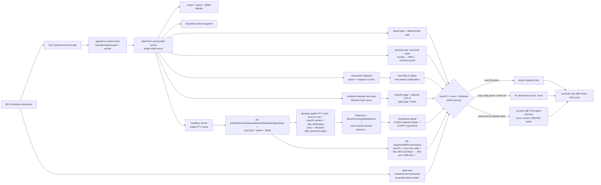
- [~] File/storage replacement is classified separately from qjswasm's basic
  filesystem calls. ACU now exposes `file-inspect PATH` / `file inspect PATH`:
  it never follows the final link, returns bounded type/size/time/readonly and
  platform metadata, brackets ordinary-entry metadata with two opened-object
  identities, and fails typed if the path was replaced. At exact source
  `286a0514`, the macOS qjswasm public journey passes 41 STEP / 42 evidence and
  cleanup. At exact source `aff6cc7b`, a real Linux x86_64 UTM court matched the
  host hashes for the ACU executable and ABI library, then proved ordinary-file
  opened-object identity, final-link no-follow/link-like identity and typed
  `file_inspect_failed` for a missing path before releasing the VM. This is a
  focused native ACU court, not yet the full Linux qjswasm journey. At exact
  source `867a6a64`, a real Windows x86_64 UTM court likewise matched the host
  hashes for `agenterm-cu.exe` and `agenterm.dll`, then proved ordinary-file
  opened-object identity, exact size and Windows attributes plus the same typed
  missing-path failure before release. Linux and Windows focused leaves are now
  green; promotion into both full qjswasm journeys remains open. Package tests,
  strict Clippy and the Windows x86_64 cross-check are green. `agenterm-platform` also owns
  no-overwrite publication and volume-capacity primitives. ACU now also exposes
  `file-copy SOURCE DEST [--replace --apply]` and `file-transaction
  status|rollback|recover|finalize ID`. Planning is mutation-free. Apply writes
  a private bounded receipt before its first file effect, binds every removable
  or renameable object to opened-object identity plus size/mtime/SHA-256,
  serializes the exact destination, retains an old destination until finalize,
  and refuses ambiguous recovery or changed post-state. The qjswasm public
  `cu.file-copy-transaction` journey proves plan/apply/status/rollback/finalize
  and refusal without disclosing contents on macOS; Linux and Windows native
  court evidence is still pending through the independent `utm-court` service.
  ACU now also exposes `file-attributes PATH [--include-values]` for one opened
  non-symlink regular file. The default receipt returns stable object identity,
  bounded attribute names, namespaces, byte lengths and SHA-256 digests without
  values; raw values appear only after the explicit disclosure flag and are
  encoded losslessly as hexadecimal. The public macOS qjswasm journey
  `cu.file-xattr-inspect.macos` proves a real native xattr, digest-only default,
  explicit disclosure and final-symlink refusal. Linux shares the native
  mechanism but still needs its public court; Windows returns typed unsupported
  because alternate data streams and ACLs are not equivalent to Unix xattrs.
  Mode and xattr mutation are separate identity-bound plan/apply leaves and are
  not implied by this observer. The mode leaf is now public as `file-mode
  PATH OCTAL [--apply]` / `file chmod`: default preview is zero-write, apply
  re-plans from the currently opened regular file, rechecks exact object
  identity and current mode, then verifies descriptor-level native readback.
  Same-mode apply is a verified no-op. `previous_mode` is an observed fact for
  a new identity-bound restoration call, not a durable rollback token; a
  post-effect readback failure is typed effect-unknown. The public macOS
  qjswasm journey `cu.file-mode.macos` is green. Linux runtime and Windows
  typed-not-applicable courts remain open; ACLs and DOS attributes never
  masquerade as Unix octal mode.
  The xattr mutation leaf is now public as `file-xattr-set PATH NAME
  --value-hex HEX [--apply]`, `file-xattr-remove PATH NAME [--apply]`, and the
  macOS-only `file-quarantine-clear PATH [--apply]`. Default calls are
  zero-write previews. Apply binds one opened regular object, rechecks the
  complete prior value, enforces the 4 MiB decoded ceiling before filesystem
  access, and independently reads back the result. An already-satisfied state
  is re-read and reported as a verified no-op without calling the setter.
  Replies and durable audit records retain presence, byte length and SHA-256
  only; this naturally idempotent command family creates no transaction
  receipt. Raw disclosure remains the separate explicit
  `file-attributes --include-values` observer. Readback failure after an effect
  is typed effect-unknown. This cut does not expose the private old value or
  promise durable rollback; reversal is a new identity-bound invocation. The
  public macOS qjswasm journey `cu.file-xattr-mutation.macos` is green. Linux
  native and Windows typed-not-applicable courts remain open; ADS and ACLs do
  not masquerade as xattrs.
  `file-move SOURCE DEST [--replace --apply]` now composes the same hardened
  copy publication with a recoverable source retirement. It atomically refuses
  occupied backup names, locks source and destination path namespaces in
  stable order, uses one copy-then-retire path across volumes, and retains the
  source plus any replaced destination until finalize. Recovery handles the
  crash window where a no-replace hard link exposes both names for one exact
  object; unknown or changed objects are preserved with a typed refusal. The
  public `cu.file-move-transaction` qjswasm journey is green on macOS and the
  MCU adapter routes the lossless move shapes; Linux and Windows native courts
  remain open. `file-watch PATH [--duration-ms N] [--max-events N]` / `file
  observe` watches one existing directory without recursion and reports
  bounded created/modified/removed entries; reaching the event ceiling before
  the deadline is truncated, not completed. Linux inotify is native-qualified
  through the public `cu.linux-file-watch` court. The macOS FSEvents provider
  uses at-least-once coalesced delivery resolved by entry existence. Its public
  `cu-macos-file-watch-smoke` court is green for direct-entry lifecycle,
  non-recursive scope, bounded truncation and typed failure. The Windows
  ReadDirectoryChangesW provider has landed with the same direct-entry contract
  and a registered public court, but the Windows cell remains pending until that
  court runs on real Windows guests.
  `storage-devices [--max N]` / `storage devices [--max N]` now
  provides the separate physical/block inventory. The platform facade invokes
  only fixed native system providers under one shared deadline and contained
  process-tree cleanup, with a 10,000-row scan ceiling and a 2 MiB aggregate
  provider-output ceiling; ACU adds a 1 MiB response ceiling. Capacities remain
  exact decimal strings across JSON, unavailable host fields stay explicit,
  and serial/WWN/Windows UniqueId are never requested or emitted. The public
  `cu.storage-devices` qjswasm journey is green on macOS. At exact source
  `76f85249`, the same journey passed on a native Linux aarch64 Lima/VZ court
  after source, bundle and guest artifact digests matched; unavailable UTM
  launch infrastructure is not product evidence. Exact source `00d22433` also
  passed on Windows aarch64 after a ten-file guest manifest match; the guest
  was reverted and stopped. Windows x86_64 and Linux x86_64 native runtime
  courts remain open. Therefore the
  ledger is `platform-limited`, not yet promoted to native or removed from the
  overall storage family. The exact inventory spelling already routes through
  ACU; mutation and volume sub-shapes remain dynamic compatibility fallbacks.
  `storage-volumes [--max N]` now closes the mounted-filesystem half without
  conflating it with physical devices. Its exact decimal reply keeps
  current-user available capacity distinct from filesystem free capacity,
  parses Linux mount information as escaped bytes, and emits no backing-device,
  serial or UUID identifiers. Linux skips and counts potentially automounting
  or blocking remote/FUSE sources instead of calling `statvfs`; Windows probes
  only fixed drive letters and RAM disks, skips removable/remote media, and
  marks its drive-letter-only coverage incomplete. The public
  `cu.storage-volumes` qjswasm court is
  green on macOS; native Linux and Windows execution remains explicit schema-2
  debt, so `resource.disk-volumes` stays `platform-limited`.
  The platform mechanism implements identity-bound Unix mode/xattr
  inspect-plan-apply-readback primitives, including macOS quarantine removal.
  It binds a no-follow opened directory entry to the caller's existing handle
  before any operation; Windows returns typed unsupported rather than
  pretending ACL/attribute equivalence. Mode is now public; xattr mutation is
  still internal-only. Neither mutation leaf has Linux/Windows runtime evidence.
  The MCU-shaped compatibility entry routes `acu file inspect PATH`, file copy,
  status, and explicit `--apply` rollback/recover/finalize to these typed ACU
  facades. Move uses the same native recoverable transaction; mode now has its
  public typed ACU command and macOS court, while xattr mutation remains open.
  The legacy transaction action without `--apply` is now
  rejected locally: observation uses status and mutation must be explicit; it
  no longer falls back to a second plan owner.
- [~] Network replacement is classified into interfaces, routes, active DNS,
  sockets and DNS+TCP probes. `network-interfaces` is now the bounded Observe
  facade for native address inventory: `getifaddrs` plus ifindex on Unix and
  `GetAdaptersAddresses` plus adapter LUID on Windows. Rows are stable-sorted;
  missing MAC/netmask/CIDR fields are explicit; the whole snapshot shares one
  10,000-record native scan budget and ACU adds a 1 MiB response ceiling.
  `--max` is rejected outside 1..=5000 before enumeration. The public macOS
  qjswasm journey `cu.network-interfaces` is green and both Windows ISAs
  compile under strict Clippy. Exact source `100ee73b` also passed its bounded
  schema and alias contract on the Linux arm64 Wayland UTM court, then released
  the VM; its compact runtime receipt is local and gitignored.
  Exact source `fcbfed9a` then passed the unchanged journey on the Windows
  arm64 UTM court after proving a nonce-bound interactive process outside the
  launcher Job; its compact runtime receipt is local and gitignored.
  With both Windows ISAs compiling and native runtime evidence on each OS,
  `network.interfaces` is now `native`. `network-routes` adds the matching shell-free route
  inventory through Linux NETLINK_ROUTE, macOS PF_ROUTE/NET_RT_DUMP2 and
  Windows GetIpForwardTable2. It preserves ifindex/LUID identities, normalizes
  destination prefixes, treats a null gateway as on-link, and refuses
  interrupted or malformed kernel snapshots. Native scanning is capped at
  10,000 records and the public response at 1 MiB. The public macOS qjswasm
  `network-routes` journey is green; exact source `884c1809` also passed on the
  Linux arm64 Wayland UTM court and released the VM. Its compact runtime
  receipt is local and gitignored.
  Exact source `e8ce266f` then passed the same public contract in the Windows
  arm64 UTM court; its compact runtime receipt is local and gitignored.
  Both Windows ISAs compile, so `network.routes` is now `native`.
  The reusable UTM caller now resolves the task entry from
  `agenterm.tasks.json` and the complete required evidence set from
  `scripts/qualification-gates.json` before it leases a VM. It rejects legacy
  caller-supplied evidence/PASS overrides and accepts a run only when exit zero
  carries exactly that machine-declared evidence multiset. Human-readable
  `PASS:` text remains in the compact receipt for diagnosis, but wording drift
  can no longer turn a successful journey into an expensive false failure or
  manufacture a pass.
  `network-dns` now owns the active
  resolver/search-domain observation shape. It exposes provider, native
  interface/service identity when available, resolver scope, port, coverage,
  completeness and independent scan/response bounds. macOS reads the scoped
  system-effective `scutil --dns` view through one contained fixed-path child;
  Windows reads adapter DNS rows directly with `GetAdaptersAddresses`; Linux
  reads the resolver file but detects systemd-resolved's `127.0.0.53` stub and
  switches to its upstream file. If that upstream source is unavailable, the
  reply is `coverage=stub-only, complete=false` rather than a fabricated full
  DNS configuration. No resolver is contacted. The public macOS qjswasm
  journey `cu.network-dns` is green and all six targets compile. The same
  journey ran from exact source `dbfed944` in native Linux arm64 and emulated
  x86_64 UTM courts with byte-manifest verification and typed exit receipts.
  Their compact runtime receipts are local and gitignored.
  Windows arm64 also passed at exact source `c6295175` after the court
  normalized PowerShell UTF-16LE/CRLF evidence into canonical UTF-8/LF; its
  compact runtime receipt is local and gitignored.
  `network.dns.services` now reuses those same typed `network-dns` rows rather
  than adding a second command or pretending one portable service vocabulary
  exists. On macOS the fixed, contained `networksetup -listallhardwareports`
  provider joins Device to Hardware Port without retaining hardware addresses;
  its failure preserves the scoped resolver rows but makes completeness false.
  Windows keeps the native adapter FriendlyName and Linux returns `null`.
  Exact source `7e28a89e` passed the macOS public qjswasm journey against an
  independent `networksetup` oracle. Linux and Windows service-identity courts
  remain pending and cannot borrow that macOS result.
  The schema-2 verdict still leaves Windows pending: its x86_64 interactive
  agent failed to claim a nonce at both 180 and 360 seconds, so the ARM64
  result cannot be borrowed as a platform-wide qualification. That is a
  court-image/agent blocker, not a DNS failure. This row therefore moves from
  `gap` only to `platform-limited`. The compatibility entry routes exactly
  `acu network interfaces|routes|dns [--max N]`. The identity-safe per-process
  socket slice is live through `process-sockets`; per-service DNS mutation and
  global/name-selected sockets remain MCU gaps.

- [~] `desktop-state` has a public screenshot-free qjswasm journey on macOS.
  It binds focused and explicit-handle reads across one bounded window
  inventory, one accessibility tree and absolute pointer coordinates, and
  asserts that no effect receipt is created. Linux and Windows desktop courts
  remain required before three-host promotion.
- [~] Display/space accounting has registered macOS host-native evidence
  `cu.macos-ax-stacking`: it binds display and space identities and joins the
  window stack without treating catalog presence as proof. Linux and Windows
  display courts remain; spaces are explicitly macOS-only.
- [~] Global pointer movement has a registered macOS owned-fixture court with
  independent position read-back and exact restoration. Exact-window pixel
  delivery is reclassified from `platform-limited` to `gap`: no host supplies
  it today, and `cu.macos-pointer-refusals` proves an honest refusal rather
  than parity.

  `network-probe` is implemented as an Observe
  facade: resolve once through the host resolver, deduplicate/freeze addresses,
  then report the exact bounded TCP attempts. The resolver lives in an
  invocation-owned internal child because Windows and glibc cancellation APIs
  failed the precommitted completed-cancellation gate; deadline expiry kills
  and reaps the exact helper instead of accumulating resolver threads. This is
  not yet promoted: six-cell compile plus invocation-owned loopback journeys on
  OSX/Lnx/Win are governed by
  [`plan/design-network-probe-resolver-experiment.md`](../plan/design-network-probe-resolver-experiment.md).
  The same public journey is green on macOS arm64, Linux arm64 + x86_64, and
  Windows x86_64. Windows arm64 was blocked before execution by its UTM/QGA
  transfer channel, so it contributes no product verdict. The current Windows
  release binary exceeds the existing 2 MiB `agenterm-cu` budget; the release
  size court remains open and the capability ledger stays `platform-limited`
  without raising that ceiling. Slow execute-only courts declare a bounded
  journey deadline and use Windows' synchronous `agenterm.com` front door;
  neither court latency nor a GUI-subsystem early return may become false green.
  The active qjswasm/tinyvm host surface still has no generic DNS/TCP API;
  `network-dns` is an AgenTerm-injected ACU operation, not a new tinyvm OS
  authority.
  Native system inventory remains platform-owned. Process-owned socket rows now
  bind matching process start identities; a future global inventory must join
  every row back to the same exact-process contract rather than a reusable PID.
  The MCU-shaped compatibility entry routes exactly `acu network probe HOST`
  to `network-probe`; per-service DNS mutation and global/name socket inventory
  remain explicit MCU fallbacks instead of being mislabeled as the same
  capability.

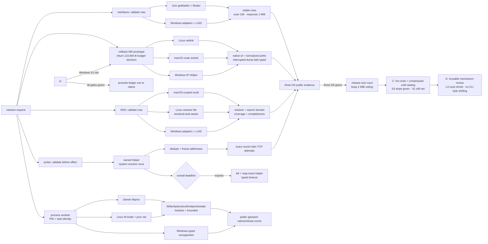
- [~] Device/audio replacement is classified across peripheral inventory and
  events, exclusive TTL claims, byte I/O, serial configuration and default
  output state. Device paths are locators rather than durable identity;
  mutations require a live lease or plan, target revalidation, bounded I/O and
  independently read-back post-state. Backend gaps remain platform-limited.
- [~] `audio status|plan|apply` now owns the default
  output slice instead of falling back through MCU. macOS uses the native
  CoreAudio adapter; Linux and Windows fail with typed `audio_unsupported`.
  The registered `cu.audio-plan` qjswasm court proves exact-device status,
  expiring approval-bound plan/reverse-plan shape and unchanged before/after
  state; it intentionally performs no mutation. Exact source `345696c2` passed
  the same public court on native Linux arm64 and Windows arm64, proving typed
  `audio_unsupported` without durable effect before both VMs were released.
  Their compact runtime receipts are local and gitignored. Apply reserves durably before
  effect, is at-most-once on replay, revalidates the same output device, reads
  back the result and permits rollback only against that device and expected
  state. A separate explicit audible apply/readback/rollback court remains
  pending, so the mutation leaf stays incompletely qualified and both leaves
  remain truthfully `platform-limited` at product level.
- [~] `device-list` / `device list` now owns the bounded native peripheral
  inventory leaf for USB, Bluetooth, audio, camera and GPU. It is not a raw
  system-profiler dump: native serials, addresses, provider instance ids and
  paths stay below `agenterm-platform`; the public row receives only an
  installation-scoped HMAC pseudonym and an explicit `provider-stable` or
  `topology` continuity label. `setup` apply is the sole explicit enrollment
  action for that private installation identity. Inventory observation only
  loads it and fails typed when it is absent; it never silently creates or
  rotates identity. The registered `cu.device-inventory` qjswasm court is green
  on macOS arm64 with all five provider statuses, repeated-id equality, a
  single-provider bound, private-field absence and invalid-selector refusal.
  Linux and Windows adapters compile and have fixture coverage, but their
  native public courts remain open, so the ledger row is `platform-limited`.
- [~] `device-watch` is the bounded observation slice. It is a bounded
  poll/diff observer over the same private inventory owner, not a second
  provider stack and not a TypeScript effect. A change is provable only across
  two consecutive complete, non-truncated snapshots for that device kind.
  Partial or unavailable provider samples suppress events and publish explicit
  incomplete coverage instead of inventing `added` or `removed` rows. The
  public result remains pseudonymous, bounded by duration, interval, row and
  event ceilings, and preserves an overall monotonic deadline. The registered
  `cu.device-watch` qjswasm court is green on macOS arm64; both Windows targets,
  both Linux targets and macOS x86_64 cross-build. Linux and Windows native
  runtime courts remain open, so this leaf stays `[~]`.
- [~] `device-claims`, `device-claim`, `device-status`, `device-read`,
  `device-write`, `device-renew` and `device-release` now form one candidate
  native ownership slice. A public opaque installation-HMAC device id is only
  a selector: the platform adapter re-enumerates and binds the exact private
  locator and native object at claim time. One resident owner retains that
  same fd/HANDLE through configuration, bounded byte I/O, renewal and release;
  the durable store never persists the locator or plaintext lease secret.
  Claim admission is tied to the caller's runtime session and target lock,
  exact request replay never opens a second native object, and `session-end`
  must close both managed jobs and device owners or report
  `runtime_session_cleanup_uncertain`.

  The registered `cu.device-lease` public qjswasm journey is green on macOS
  arm64. Its invocation-owned PTY fixture is admitted only through a private,
  owner-bound registry; the public caller sees an opaque token and device id,
  never a raw device path. The journey proves claim → write → read → renew →
  release, exact replay without a second open or repeated secret, wrong-secret/
  session/generation refusal, setup-refresh deferral, session-end cleanup and
  TTL expiry. It also proves that durable state and audit contain no locator,
  lease secret, byte payload or fixture token.

  At exact source `a21dfcff4227ca9dfcb6d55a13da9bbbf4e84187`, the same
  checked-in public journey also passed in `lnx-x86_64-desktop` and
  `lnx-aarch64-desktop`: each court verified the uploaded manifest before
  execution, emitted `cu.device-lease`, returned exit zero and was stopped by
  the invocation-owned lease. Windows still needs a native COM or controlled
  virtual-COM court because a Unix PTY is not Windows evidence.
  Partial-write failures now preserve three independent facts end to end:
  known-written lower bound, delivery uncertainty and retry safety. An effect
  may be certain yet unsafe to retry when native bytes were accepted before a
  later durable-state failure; an attempted native write failure is therefore
  conservatively non-retryable. Until the remaining courts pass, lifecycle,
  serial configuration and byte I/O remain `[~]`; only the lossless native
  argument shapes may leave the transitional MCU fallback.

```text
device.inventory
├─ [x] explicit setup apply → private installation identity
├─ [x] observe-only bounded snapshot → five provider statuses
├─ [x] native identifiers stay private → installation HMAC pseudonym
├─ [x] macOS arm64 public qjswasm court
├─ [ ] Linux native public qjswasm courts
└─ [ ] Windows native public qjswasm courts

device.watch
├─ [~] same platform inventory + installation pseudonym owner
├─ [~] complete→complete snapshots may emit added/removed/changed
├─ [~] partial/unavailable samples suppress inferred events
├─ [~] bounded duration/interval/rows/events + monotonic deadline
├─ [x] macOS arm64 public qjswasm black-box
├─ [x] six target cells compile
└─ [ ] Linux/Windows native runtime courts

device.claim + byte I/O
├─ [x] opaque public id → private re-enumeration → exact native object
├─ [x] resident fd/HANDLE owner + exclusive TTL lease + session/target lock
├─ [x] serial vocabulary validated and native configuration read back
├─ [x] read/write bounded to 64 KiB; timeout bounded to 300 s
├─ [x] durable crash states contain no locator, payload or plaintext lease
├─ [x] setup refresh defers around active/uncertain owners without disrupting them
├─ [x] session-end closes jobs and device owners or returns cleanup-uncertain
├─ [x] macOS public qjswasm fixture: replay/refusal/I/O/renew/release/TTL/session cleanup
├─ [x] durable state + audit exclude locator/secret/payload/fixture token
├─ [x] partial-write lower bound / delivery uncertainty / retry safety are independent
├─ [x] Linux aarch64 + x86_64 native public qjswasm courts
└─ [ ] Windows native COM/virtual-COM runtime court
```

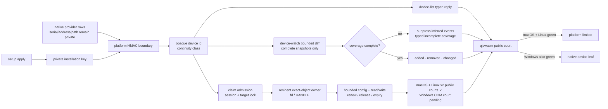
- [~] `device-screenshot` is now an integrated current-target leaf, with live
  promotion still waiting on a non-sensitive PNG capture court from the fixed
  installed identity. Its classifier must
  never infer a phone
  trust/lock fault from an empty host capture inventory. Preflight separates
  host Camera TCC, usbmux availability/pairing, DAL source publication and
  stream/frame delivery: zero sources with denied/unknown Camera permission is
  `host_tcc_denied|host_tcc_consent_required`; a healthy paired device
  with no published DAL row is `device_source_not_published`; only an enumerated
  target plus direct evidence may produce a device-specific failure. `--list`
  reports those host signals. The public three-host qjswasm inventory court
  accepts a bounded zero-device macOS result and exact
  `device_capture_unsupported` on Linux/Windows without filesystem effect; it
  closes the inventory evidence alert but does not claim PNG capture.
  Exact source `1a7cf00a` subsequently passed that public refusal contract in
  the native Linux arm64 Wayland court after exact-byte transfer and
  interactive-session nonce proof; its compact runtime receipt is local and
  gitignored.
  Accessibility is independent from pure DAL
  capture. The shared contract, macOS AVFoundation/CoreMediaIO adapter and
  public verb are now connected: observation never requests TCC consent; native
  and Rust boundaries cap PNG bytes at 64 MiB; timeout remains
  `device_frame_timeout`; publication is same-parent, atomic and no-clobber;
  image bytes never enter stdout. Fixture courts cover the exact field failure,
  successful empty inventory, TCC precedence, oversized native output, timeout,
  complete publication and a concurrent destination race without touching a
  real phone or permission prompt. This is `[~]`, not `[x]`, until a disposable
  non-sensitive device proves list + capture through the public CLI.
- [ ] daily device automation uses only a fixed-path, promoted, signed
  `AgentermCu.app` identity. Camera, Accessibility and Screen Recording are
  independent TCC services and are granted to that stable identity only;
  worktree binaries are development-court artifacts and must not become the
  operational entry. Changing path or bytes may create a new TCC identity, so
  deployment must publish one versioned artifact, verify its digest/signature,
  switch the fixed path atomically, and surface any required human consent as a
  host-side typed state. The release/signing/install court remains open.
- [~] External terminal adoption now has one exact-window ACU facade instead
  of an MCU-only effect. `term-read` and `term-wait` bind the native window,
  owner pid, process-start identity and one unambiguous showing accessibility
  buffer. Reads state whether the backend proves a complete buffer; waits on
  bounded UIA/AT-SPI prefixes return inconclusive rather than claiming absence.
  `term-send` does not pretend that global input is background delivery: the
  default path refuses before effect, while `--foreground` explicitly permits
  activate → target-node focus → input → previous-focus restore. It succeeds
  only when a previously false postcondition becomes true on the same buffer.
  Partial dispatch or failed read-back remains an uncertain reserved receipt;
  input, terminal content and patterns are represented by lengths and digests
  in failure evidence. The macOS public qjswasm journey proves exact read,
  immediate wait, redacted invalid-pattern failure, background refusal and the
  `AGENTERM_NO_ACTIVATE` refusal. Its separate explicit visible court also
  proves same-buffer token read-back and restoration of the prior foreground
  window. Windows ARM64 now proves the corresponding UIA document observation,
  safe refusals and explicit visible send in its public UTM court. Linux x86_64
  proves the same AT-SPI contract in a real XFCE desktop session, including the
  newly satisfied same-buffer token and foreground-focus restoration. The
  three-host gate is complete, the transitional MCU `term` marker is removed,
  and remaining ISA cells belong to the independent six-cell delivery gate.

  ```mermaid
  flowchart LR
    W["native window + pid + process generation"] --> B["one unambiguous a11y buffer"]
    B --> R["term-read"]
    B --> T["term-wait · bounded regex"]
    B --> S{"term-send mode"}
    S -->|default| X["typed refusal · no effect"]
    S -->|explicit foreground| F["activate · focus node · inject · restore"]
    F --> V{"new postcondition<br/>same buffer?"}
    V -->|yes| C["completed receipt"]
    V -->|no / unreadable| U["reserved · outcome unknown"]
    C --> MW["macOS + Windows ARM64<br/>observe + visible send green"]
    MW --> L["Linux x86_64 observe + visible send green"]
    L --> R["remove MCU term STAY"]
  ```
- [ ] the differentiator is direction, not parity. General computer-use tools
  drive a screen through screenshot + OCR + coordinate guessing. AgenTerm
  already publishes exact structured bounds through `ui-snapshot`, so AgenTerm
  can be the first computer-use **target** with a real control tree, not only a
  computer-use client. Both directions belong to this subtree, and the target
  direction must not be dropped in favor of the easier client direction.

### Login-session adoption frontier

- [~] retire the next reachable MCU fallback without broadening its platform
  promise. MCU implements `login-session` only on macOS, so ACU must provide
  the exact macOS console-session status/lock contract while Linux and Windows
  return a truthful typed unsupported result for this version.
  - [x] `agenterm-platform` owns a bounded neutral inventory contract and a
    macOS IOKit/CoreFoundation adapter. Missing or changed `IOConsoleUsers` /
    `IOConsoleLocked` shapes fail typed; product code does not run `ioreg`,
    `plutil`, AppleScript or private SecurityAgent/SkyLight APIs.
  - [x] ACU binds the console-session generation, current user, 120-second
    expiry and intended lock effect into separate contract/approval digests.
    Its durable request store reserves before input delivery, consumes even a
    pre-locked no-op, and never replays an uncertain post-effect outcome. A
    finalized or uncertain receipt is looked up before approval expiry and
    live-session revalidation, so replay remains explainable without touching
    the provider while the bounded retention record exists. `plan` exposes the
    canonical `approval_digest` plus an equal `approval` handoff alias, while
    the temporary adapter remains only an argv/stdin/stdout/exit forwarder; it
    does not recreate MCU's historical unwrapped JSON response shapes.
  - [~] the Rust provider seam proves tamper, drift, expiry, completed replay,
    uncertain replay and persistence-failure behavior without locking the
    developer's screen. The public qjswasm court proves native status and plan
    are bounded and mutation-free on macOS, plus typed unsupported behavior on
    Linux/Windows. Actual lock delivery remains a separate explicit visible
    court; there is no claim that the public read-only court exercised it.

  ```mermaid
  flowchart LR
    I["bounded console inventory"] --> P["exact-session lock plan"]
    P --> A{"approval + TTL + same user"}
    A -->|invalid| X["typed refusal · no effect"]
    A -->|valid| R["durable reserve"]
    R --> K["native Ctrl-Cmd-Q delivery"]
    K --> V{"same session reports locked?"}
    V -->|yes| C["completed · at most once"]
    V -->|unknown| U["outcome unknown · never replay"]
  ```

## Naming

- [x] `agenterm-cu` is the accepted product name. It supersedes the
  `agenterm-remote.exe` working name used in
  [`plan/archive/plan-v0.1.15.md`](../plan/archive/plan-v0.1.15.md) §5.6.1. Remote protocol
  support is a transport axis inside this product, not a separate product.
- [x] `agenterm-cu` is also the only executable name. ABI diagnostics,
  command mode, and the desktop host are modes of that executable; a second
  `agenterm-cu` binary is not a product or compatibility surface.

## Product boundary

### Owned here

- The abstract command set and its layering contract ([29](PRD_02_29_cu_command_surface.md)).
- The target family and transport selection ([30](PRD_02_30_cu_targets_transports.md)).
- The authorization, audit and refusal model ([31](PRD_02_31_cu_authorization_safety.md)).
- Named window-placement actions and their geometry contract ([32](PRD_02_32_cu_window_placement.md)).

### Not owned here — must be consumed, not forked

This is the primary risk. AgenTerm already has four surfaces that take
screenshots or inject input. `agenterm-cu` must not become the fifth
independent implementation.

| 已有面 | owning 模块 | cu 的关系 |
|--------|-------------|-----------|
| OS 级 screenshot / window / input / process 机制 | [20 Native platform](PRD_02_20_native_platform.md) `agenterm-platform` | **消费**。cu 不得直调 OS API，新机制先沉入 platform 并带 typed `Unsupported`/`Failed` |
| OS 级 accessibility-tree 机制（观察 + 节点动作） | `crates/agenterm-abi` libagenterm `agt_a11y_*`（里程碑 6）→ `agenterm-platform` 适配器 | **消费**。Linux `current` 的 `tree` / 结构化 `click` / `focus` / named `hover` / named `scroll-wheel` / named `send-text` / focused `send-text --window` / named `copy` / focused `copy --window` / named `paste` / focused `paste --window` / named `send-keys` / focused `send-keys --window` 经 ABI 机制层，不在 cu 内复刻 AT-SPI/UIA/AX。named wheel 以目标子节点的独立前后几何读回证明交付，错误路径仍必须释放 wheel button 并恢复真实指针；Linux native X11 court 未实跑前保持 platform-limited。macOS/Windows 对 named hover / scroll-wheel 没有等价节点指针路径，均 typed-refuse。ABI 1.31 另以 caller-sized `agt_screen_physical_v1` 查询显示器物理尺寸，不改变既有 `agt_screen_info[]` 数组步长。 |
| 工作台观察/控制、确定性等待、身份 | [07 Agent control plane](PRD_02_07_agent_control_plane.md) | **复用，不分叉**。cu 的 terminal facade 只能调用这条既有控制平面并验证同一 scope/epoch/@tab；不得提供第二个 tab/PTY owner |
| `agenterm-cc` 的 screenshot/snapshot 投影 | [21 Control Center](PRD_02_21_control_center.md) | **不重叠**。CC 是产品投影，不是通用机器控制面 |
| `agenterm-con cli` 的输入/截图/等待 | [26 con control CLI](https://github.com/partnernetsoftware/minicon/blob/main/prd/PRD_02_26_con_control_cli.md) | **不重叠**。con 是 GUI 生命期内的本进程终端控制 |
| 可选智能 / LLM 网关 | [12](PRD_02_12_specialized_intelligence.md) / [13](PRD_02_13_llm_gateway.md) | **独立**。cu 是工具面，不含模型、推理或提示策略 |

### Explicit non-goals

- [ ] no model, planner, prompt policy or agent loop. `agenterm-cu` provides
  capability, not judgment.
- [ ] no external computer-use framework, runtime or SDK is adopted into the
  product graph. Reference implementations may inform design; they are not
  dependencies. Provenance rules are owned by
  [14 Research provenance](PRD_02_14_research_provenance.md).
- [ ] no unrestricted-by-default authority. The unrestricted local runtime
  posture of [10 script engines](PRD_02_10_rhai_scripting.md) is explicitly
  **not** inherited; see [31](PRD_02_31_cu_authorization_safety.md).
- [ ] no silent capability substitution. An unavailable backend fails typed; it
  never degrades to coordinate guessing while reporting structured success.

## Power-action planning

```text
power.action-plan
├── behavior: sleep | restart | shutdown → canonical expiring request
├── identity: installation host + current native boot instance
├── evidence: public qjswasm court; macOS + Linux two-ISA + Windows ARM64 native
├── safe failure: unknown action, invalid TTL or unavailable identity → typed refusal
└── non-goal: consent, broker dispatch and any native power effect
```

- [~] `privilege plan system.power-action` now prepares one closed,
  mutation-free plan. Its contract digest binds the action, installation and
  current boot; its approval digest additionally binds issue and expiry time.
  The reply states `consent_requested=false` and
  `mutation_performed=false`. The same exact-source public court is green on
  macOS, Linux ARM64, Linux x86_64 and Windows ARM64. Windows x86_64 remains a
  known emulated-court infrastructure gap, not an untested power-plan API. The
  separate `power.action-apply` leaf remains
  unavailable until a provider can reserve a durable at-most-once receipt
  before a terminal effect and report disconnect-after-dispatch as
  `outcome_unknown` rather than inviting replay.

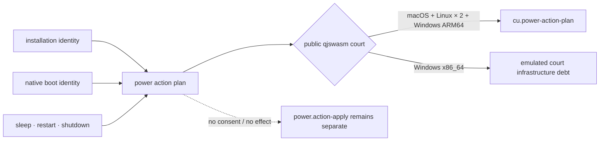

## Governing invariants

- [ ] one command set across targets. `current` is the local degenerate tier of
  the same family as `ssh`/`rdp`/`vnc`, not a temporary special case. Adding a
  transport must not change the command surface above it.
- [ ] structured identity outranks pixels. Where a target can expose a control
  tree, commands address controls by structured identity with exact bounds;
  coordinate-only addressing is a declared fallback with an observable marker,
  never an invisible default.
- [ ] observation and action describe the same instant. A screenshot, a control
  tree and a subsequent action must be causally identifiable, so an agent can
  detect that the screen moved under it instead of acting on stale truth.
- [ ] every action is authorized before execution and observable after it. No
  action path exists that bypasses the authorization model or leaves no audit
  record.
- [ ] deterministic waits, never sleeps. Every state change an agent must
  observe is waitable with a bounded typed timeout.
- [ ] failures are typed and local. One target, session or backend failing must
  not corrupt another or abort the host.

## Promotion gates

- [ ] this subtree stays entirely `[ ]` at the root until the `current` tier
  proves the command set end to end on one platform with public black-box
  evidence. Individual child leaves may record `[~]` / `[x]` when their own
  evidence arrives; a partial platform slice does not promote the subtree root.
- [~] Linux `current` has an exact-SHA 24-step public AT-SPI2 journey with
  structured observation, actuation and cleanup. Windows `current` has staged
  public UIA tree, stable window/node
  identity, name-addressed Value/GetText/Invoke actuation, desktop-host cleanup,
  and shared host `Command`/`Executor` dispatch evidence in
  `scripts/qjs/cu-windows-smoke.qjs`. macOS AX remains a separate placement slice;
  Candidate qualification is still required before root promotion.
- [ ] the subtree root still has no shipped version. Roadmap ownership is
  [18 Focused product roadmap](PRD_02_18_roadmap.md). Window placement
  ([32](PRD_02_32_cu_window_placement.md)) opened under the v0.1.19 draft and
  is partially landed on macOS (command + day-driver host);
  that assignment does not promote this root or any other child.
- [ ] no capability may be marked shipped on design documents, reference
  assets, or a passing unit test alone. The evidence standard is the same as the
  rest of the tree: a public black-box journey against the real executable.
- [ ] when a child module's requirements outgrow it, it splits into a further
  module rather than accumulating a monolithic entry. This subtree exists
  precisely so that `agenterm-cu` never lands as one oversized bullet inside an
  unrelated module.

## Execution projection

Design and sequencing live in
[`plan/archive/plan-v0.1.15.md`](../plan/archive/plan-v0.1.15.md) §5.6 (mainline L-CU) and the
current-tier gap input
[`plan/agent-human-parity-audit.md`](../plan/agent-human-parity-audit.md).
Those are execution projections; accepted scope and status belong to this
subtree. Window-placement sequencing lives in
[`plan/plan-v0.1.19.md`](../plan/plan-v0.1.19.md); v0.1.18 remains the
in-progress unique version plan until it closes.

## Browser window lifecycle closure

### Browser profile inventory boundary

```text
browser.profile
├─ [x] inventory · synthetic user-profile Local State · no browser launch
│  ├─ macOS public qjswasm court green
│  ├─ Linux native court pending
│  └─ Windows provider landed · native court pending
└─ [~] open · separate actuation/focus/live-window receipt court pending
```

Profile inventory and profile opening are separate ledger leaves. The
`cu-browser-profile-inventory-smoke` court creates an invocation-owned user
profile root (including `LOCALAPPDATA` on Windows),
proves profile order, last-used identity, unnamed-profile fallback, redacted
`~/...` display paths and typed malformed-state failure, and never starts a
browser or reads the real host profile. That evidence cannot qualify
`browser-open`:
opening owns actuation, focus accounting, a live profile/window postcondition,
receipt closure and cleanup.

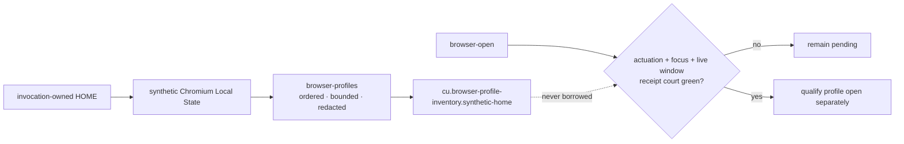

- [x] `browser.window-lifecycle` is a native ACU capability rather than an MCU
  fallback.
  - **User problem:** an agent must create and manage an isolated Chromium
    window by stable browser identity without guessing a desktop coordinate or
    confusing a native startup surface with an extension-visible tab.
  - **Behavior:** `browser-bridge-window-open` creates one normal window through
    one exact fixed-extension connection. Focus is explicit (`--focused`) and
    otherwise preserved. `browser-bridge-windows` inventories stable window and
    active-tab identities. `browser-bridge-window-state` changes only a
    background exact window through `normal|minimized|maximized`.
  - **Invariant:** the extension proves browser focus, state, tab count and
    active-tab identity. The native executor separately captures the exact
    desktop foreground handle, observes delayed focus drift for 500 ms and
    restores that handle before success. Browser postcondition failure rolls
    state back; uncertain rollback or foreground restoration fails typed.
  - **Evidence:** `scripts/qjs/cu-browser-session-smoke.qjs` emits
    `cu.browser-window-lifecycle.macos` after a real fixed-MV3 connection creates
    a focused and a background window, executes
    minimize→normal→maximize→normal, backgrounds the whole browser behind an
    owned AgenTerm window, repeats the state path, and reaps the browser plus
    Native Messaging host.
  - **Delivery:** Linux and Windows must run this same public court with native
    Chromium-family executables before cross-host qualification; that remaining
    evidence work does not turn the implemented capability back into a gap.
  - **Non-goal:** a browser's first-run `chrome://` window is not accepted as
    MV3 window evidence, and a unit/catalog row cannot replace the live court.

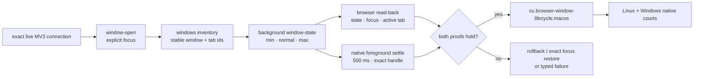
