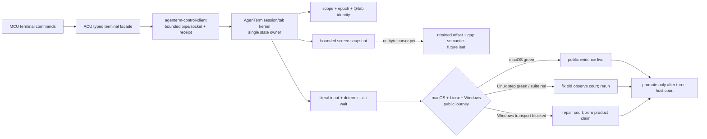
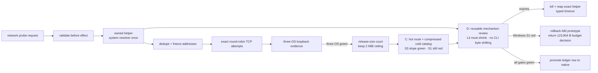

# Computer-use foundation (`agenterm-cu`)

Parent: [AgenTerm product tree](../PRD.md#product-tree)

This module is the root of the `agenterm-cu` product subtree. It owns the
product definition, the boundary against every existing observation/control
surface, the governing invariants, and the promotion gates. Its four child
modules own third-level requirements.

`agenterm-cu` is in active partial delivery. Its executable identity, command
shell, macOS host, runtime `libagenterm` boundary, Windows desktop-host ABI 1.7,
and Windows UIA backend have owning implementation evidence. The UIA claim is
backed by five pure tests, two real Win32 UIA fixture tests, and the passing
staged public `cu-windows-smoke` with all seven declared evidence receipts.
Candidate qualification and release are not claimed. This subtree root remains
partial, and each child marks only the capability supported by its own named
evidence.

Legend: `[x]` shipped, `[~]` partial, `[ ]` planned.

## Subtree map

`agenterm-cu` is organized as four child modules under this root, plus the
platform-accessibility backends that live under targets/transports. Platform
accessibility backends are an explicit branch under targets/transports — not a
footnote inside a table.

```text
agenterm-cu (28)
├── command surface (29)
├── targets / transports (30)
│   ├── current / ssh / rdp / vnc
│   └── platform a11y backends (agenterm-platform)
│       ├── Windows: native API + UIA
│       ├── macOS: AX (NSAccessibility)
│       └── Linux: AT-SPI2
├── authorization, safety and audit (31)
└── window placement (32)
```

Structured `tree` observation and `click` / `focus` by node identity are
provided by these native accessibility stacks (see
[30 § Platform accessibility backends](PRD_02_30_cu_targets_transports.md#platform-accessibility-backends)).
Screenshot and coordinate actuation are **degraded fallbacks** with typed
markers in the command result; they are never silent substitutes for a missing
control tree. `agenterm-cu` consumes `libagenterm` as its runtime mechanism
boundary; it does not open raw OS APIs or fork a fifth screenshot stack.

## Subtree index

| # | 子模块 | 一句话 |
|---|--------|--------|
| 29 | [Command surface and layering](PRD_02_29_cu_command_surface.md) | 抽象命令集、洋葱分层契约、结构化控件树与确定性等待 |
| 30 | [Targets and transports](PRD_02_30_cu_targets_transports.md) | `current`/`ssh`/`rdp`/`vnc` 目标族、transport 抽象、**platform a11y backends**（Win UIA / macOS AX / Linux AT-SPI2） |
| 31 | [Authorization, safety and audit](PRD_02_31_cu_authorization_safety.md) | 高危能力面的授权模型、审计、拒绝语义与证据 |
| 32 | [Window placement](PRD_02_32_cu_window_placement.md) | 命名摆放（Spectacle 目录）：几何核 + `agenterm-cu window-place` + 桌面常驻 `agenterm-cu host` 宿主 |

## Current delivery truth

- [x] `agenterm-cu` is the only product executable. CLI and desktop-host modes
  share that binary; an executable named `cu` is not a compatibility surface.
- [x] CU is the first runtime consumer of the `libagenterm` dynamic library.
  Product code owns command and action meaning while ABI/platform layers own
  native mechanisms.
- [~] On Windows, the product `Command`/`Executor` path consumes UIA tree,
  Value, Invoke and Focus through the runtime `agenterm.dll`; it neither opens
  COM/UIA directly nor caches native interfaces. The platform backend uses an
  MTA-capable per-operation session, bounded UIA and wall-clock timeouts,
  `SetAutoSetFocus(FALSE)`, and RuntimeId re-resolution for every node action.
  Structured UIA failure is typed and never silently becomes a coordinate
  click. Five pure and two real fixture tests own the adapter evidence; staged
  `cu-windows-smoke` owns the public DLL-backed journey.
- [~] The expanded Windows x86 UTM journey now reaches the public `.com`,
  qjswasm worker, process observation and UIA actuation through an interactive
  desktop worker. Its remaining red is explicit: the background court lets UIA
  perform a node-focus request but publishes no focused read-back, so evidence
  is withheld. Transient `UIA_E_TIMEOUT` / rejected-call results get bounded
  retries inside the existing action deadline; semantic mismatches do not.
- [~] Whole-window foreground activation is now a separate vertical slice:
  `activate --window H` flows through `agenterm-platform`, additive
  `libagenterm` ABI 1.26, the ACU command/receipt layer and exact focused-window
  inventory read-back. It is deliberately distinct from accessibility-node
  `focus` and application-local `raise`. A live macOS round trip activated a
  background text-editor window and restored the prior foreground window, both
  verified on the first poll; Windows x86_64 and Linux x86_64 cross-builds are
  green. The MCU adapter now rewrites its whole-window `focus H` to this verb,
  so that compatibility fallback inventory falls from 31 to 30. Windows and
  Linux native desktop journeys remain the promotion evidence; the source and
  local macOS result alone do not promote the leaf. The first updated Windows
  x86_64 attempt reached a ready QEMU Guest Agent twice but the interactive
  desktop task produced no registration nonce, so the product journey never
  started; that attempt is recorded as court infrastructure blocked, the VM
  was stopped, and zero product evidence is inferred from it.
- [x] Windows runtime window enumeration follows a two-stage
  required-size/fill ABI. If desktop churn makes the fill call report
  `required > capacity`, the caller retries with a fresh capacity under a hard
  attempt bound; it never truncates, writes beyond capacity or spins forever.
- [~] Windows desktop-host ABI 1.7 implements notification-area menu projection,
  `RegisterHotKey`, polling and cleanup for the CU host's 18 placement actions
  plus Quit. A native `target/abi-dev` `host --self-test --json` run reported
  `actions=19` and `cleaned_up=true`.
- [x] Local `dist` staging colocates `agenterm-cu.exe` and `agenterm.dll`; the
  staged `cu-windows-smoke` proves version, dynamic-library load, 19 desktop
  actions and deterministic cleanup. The old “both below 1 MiB” statement is
  archived: v0.1.16 Windows x86_64 shipped a 1,420,800-byte CU executable, and
  current capability growth has crossed the still-governing 2 MiB executable
  court. The no-raise decision experiment is
  [`plan/design-cu-single-entry-size-experiment.md`](../plan/design-cu-single-entry-size-experiment.md).
  Variant C now keeps only route identity and parser family hot and stores the
  complete validated help/catalog projection as an immutable compressed
  in-binary stream. Exact Windows x86_64 evidence is 2,221,056 bytes at zero
  synthetic rows; 16 and 32 rows grow at 96 and 64 bytes/row respectively, so
  the structural slope and rebuild-time gates pass. The executable remains
  123,904 bytes above 2 MiB. D tested neutral system-DNS resolution after a
  Darwin symbol profile suggested about 130.8 KiB. Exact Windows evidence
  recovered only 1,536 bytes and still exceeded 2 MiB by 122,368 bytes, so the
  ABI prototype was rolled back. The time-boxed no-raise court is complete: C
  stays for its bounded slope, the release gate remains red by 123,904 bytes,
  and that gap returns as an explicit product-budget decision rather than an
  excuse for moving CLI policy across the DLL seam.
- [x] Staged public `cu-windows-smoke` passes all seven declared evidence
  receipts: host self-test, DLL load cleanup, window identity, UIA tree,
  name-addressed actuation, Value/GetText wait and UIA fixture cleanup.
- [~] The six-cell artifact manifest and shared build path now include
  `agenterm-cu` plus the colocated `libagenterm` dynamic library on Linux and
  macOS as well as Windows. The macOS release signer signs and strictly verifies
  manifest libraries before executables. Static manifest/build/signing gates
  own this wiring; native Unix packaging, macOS signing/notarization and sealed
  Candidate artifact evidence remain open.
- [ ] Candidate and six-cell qualification and release evidence remain open.
  Passing local fixtures and staged public smoke does not promote this subtree
  root to shipped.
## Product outcome

- [~] `agenterm-cu` is AgenTerm's own computer-use foundation: one abstract
  command set for observing and controlling a machine — screenshot, window and
  control-tree enumeration, pointer, keyboard, clipboard, file transfer — that
  behaves identically whether the target is this machine or a remote one.
- [ ] it succeeds when an agent can drive a real desktop through one stable
  command surface, address controls by structured identity rather than guessed
  pixel coordinates, wait on observable state instead of sleeping, and have
  every action authorized and auditable.

## Why this product exists

- [ ] AgenTerm's north star is complete interface coverage: an agent must be
  able to control everything a human can and receive the same feedback. The
  terminal surface is largely covered; the machine outside the terminal is not.
  `agenterm-cu` closes that half.
- [~] The migration source is sibling-repo `moltbaby/skills/mcu` (`bin/mcu`).
  The accepted outcome is broader than the first desktop-bridge absorption:
  **`agenterm-cu` becomes the one machine-control entry and completely replaces
  MCU for production use.** Desktop discovery, accessibility trees, input,
  CDP, verification and window geometry land first; process, PTY, file,
  network, device, service, privilege and VM workflows must then become
  reachable through typed AgenTerm-owned facades. They need not be copied into
  the CU crate. Window placement
  ([32](PRD_02_32_cu_window_placement.md)) is one landed slice, not the product
  boundary. The executable goal, capability states and retirement gates are
  [`plan/goal-acu-replaces-mcu.md`](../plan/goal-acu-replaces-mcu.md).
  Provenance: [14](PRD_02_14_research_provenance.md) (lessons, not a TS copy).
- [x] R0 replacement accounting is exhaustive in
  `plan/acu-mcu-capability-ledger.json`: 11 families cover desktop, browser,
  process, PTY/job/terminal, file/storage, network, device/audio,
  service/runtime/session/audit, setup/doctor/permissions, privilege and
  CoreSimulator. `remaining_families` is empty. This closes only the discovery
  DAG; rows marked `gap` or `platform-limited` remain work and cannot be called
  shipped from catalog presence.
- [~] absorbed from that skill on 2026-08-30 (review and slices in
  [plan/design-mcu-absorption.md](../plan/design-mcu-absorption.md)): its
  default control loop `windows -> bounded query/tree -> invoke <selector>`,
  `verify --expect`, bounded tree acquisition (depth and node budget during
  traversal, truncation flagged), stable window handles with inventory
  filters, and its four invariants (background never steals the foreground,
  key focus or the real pointer; unsupported is fail-closed, never a silent
  global-input or sudo fallback; delivery is not success, every action says
  `verified` / `unverified`; destructive actions need an exact target, a
  prior snapshot and a checkable postcondition). Its shell / PTY / job /
  process mechanisms remain owned by AgenTerm and the `.qjs` tool door, while
  simulator, storage, device, network, power and privilege mechanisms remain
  owned by their platform/runtime modules. That ownership rule prevents kernel
  duplication; it no longer means those workflows may remain trapped behind
  MCU. ACU owns their stable public facade, typed result, deadline, cleanup and
  evidence contract. Each slice is proven by a `.qjs` journey
  (`scripts/qjs/cu-macos-smoke.qjs`, first) so the script engine is exercised
  by real computer-use scripts.
- [~] Desktop closure tranche: `snapshot`/`diff`, `hit`/`zoom`, `raise`, and
  gated `minimize`/`restore` are live in the macOS Cocoa/AX public journey.
  The same source state must still pass Linux AT-SPI2 and Windows UIA courts;
  `drag` stays in the separate explicit-global-pointer court because it may
  move the user's real cursor and must restore it even on failure.
- [~] Browser actuation closure now includes typed `page-hover`, `page-scroll`,
  `page-drag`, `page-dialog`, and `page-files` over a selected CDP target. All keep the page/window backgrounded, separate
  dispatch from verification, reserve receipts before effects, and use bounded
  viewport coordinates/deltas. Hover verifies the trusted DOM event target;
  scroll waits on the owned container's real scroll event and offset read-back.
  Files validates bounded regular non-symlink inputs, resolves one enabled file
  control, and verifies the exact FileList while omitting local paths from public
  evidence. Drag freezes two live viewport points, guarantees a release attempt
  after press, and verifies the trusted down/held-move/up sequence.
  Dialog handling first observes an opening event, then verifies the close event;
  prompt/message contents never enter public or persistent evidence.
  MCU-compatible `--match` now searches title + URL + description but tightens
  first-hit guessing into an exact-one contract: zero and ambiguity are typed
  before any page effect.
  MCU's viewport `page click X Y` is also native: the point is frozen before the
  receipt, trusted page down/up events are read back, and a failed release gets
  a cleanup attempt without converting the failed effect into success.
  MCU `page type TEXT` now freezes the existing editable focus and verifies
  same-element value growth; plaintext input and field values never enter its
  public reply or persistent receipt.
  MCU's `page --pid` endpoint discovery is no longer trapped behind the
  compatibility runtime: every ACU CDP verb accepts `--pid PID` as an exclusive
  alternative to `--port`. The native platform adapter reads only that exact
  live process, requires the same start identity before and after inspection,
  extracts an explicit valid `--remote-debugging-port`, and never scans guessed
  ports. The full command line is credential-bearing mechanism data and is
  never copied into replies, errors, receipts or documentation evidence.
  Native Windows ARM64 and x86_64 court evidence is green: on each ISA an owned
  Edge process launched with an explicit port was resolved from its PID through
  the Windows adapter, and `page-targets` returned the expected page. The
  x86_64 proof also repaired a court-only transport defect: QGA must invoke
  `schtasks.exe` directly, while a nested session-0 shell is not a portable
  registration boundary. The authoritative Windows `.qjs` browser journey now
  exercises that PID route; its integrated rerun is still required. Both Linux desktop courts currently report a typed
  prerequisite gap (`no Chromium-family browser`), not a fabricated pass.
  The 2026-09-04 headless Google Chrome court and scripted transport tests are green;
  real-profile and three-host journeys remain promotion evidence.
- [~] Browser download ownership is now a native `page-download` vertical
  slice rather than a successful `page-js` / `page-click` acknowledgement.
  The caller selects exactly one CDP page target and one download control,
  supplies an existing absolute `--download-dir`, and bounds the lifecycle
  with `--wait-ms 1..=300000`. ACU takes one cross-process lock per CDP
  endpoint because `Browser.setDownloadBehavior` is browser-global, installs
  `allowAndName` with events enabled, clicks without selecting the tab or
  raising its window, and correlates `downloadWillBegin` with
  `downloadProgress`. Success requires `state=completed` and a final regular
  non-symlink entry at the GUID path that is independently `stat`-verified;
  evidence returns the GUID, suggested filename, final path and decimal byte
  counts but never opens or emits file contents. Every exit attempts policy
  restoration. A held endpoint lock, policy refusal, cancellation, absent
  start event, deadline, or missing final file is a distinct typed failure,
  never a fabricated success. The non-sensitive Blob court owns the first
  public black-box evidence; real one-time credential downloads are excluded
  until that gate is green.
- [~] Native browser Save Panel handling is a separate P0 from direct CDP
  download. A real macOS incident proved that `windows` could observe a Brave
  `保存` panel by CGWindowID while `unlock`, targeted `send-keys`, and
  `activate` all reported no AX window; untargeted key injection then claimed
  success although the panel remained. The first platform correction resolves
  exact CG handles through the all-window owner inventory and recursively
  searches public `AXChildren` below every `AXWindows` root, so attached
  `AXSheet` descendants and off-Space windows are not rejected merely for
  missing the on-screen/root lists. An existing-but-unmatched handle is now
  typed `a11y_window_not_addressable`, distinct from a vanished window.
  Remaining product gate: one unified download reducer must interleave CDP
  progress with bounded native panel observation, expose
  `waiting_for_save_panel | downloading | completed | canceled | blocked |
  timeout`, and permit Save/Cancel only under explicit actuation with semantic
  read-back. A controlled non-sensitive panel fixture owns that evidence; a
  live credential panel is never the test fixture.
  Live evidence then closed the first read/action loop: the mapped sheet
  exposed 12 nodes, including identifier `save-panel`, a filename field, a
  location pop-up and unique Cancel/OK buttons; semantic Cancel removed the
  exact panel and created no file. That run also found and fixed an effect
  receipt false negative: a successful Press invalidated the sheet before the
  generic post-action tree read. Invoke now treats exact before-present /
  after-absent inventory evidence as verified only for a mechanism-successful
  Press/Cancel. It cannot excuse another action or a surviving/unreadable
  window. The controlled fixture remains required before this leaf becomes
  shipped.
  Untargeted `send-keys` was the inverse failure in the same incident: the OS
  injection API accepted Escape while the panel stayed open. That compatibility
  path now states `performed=true`, `verified=false`, `delivered=false`, with
  an unverified persistent receipt whose key evidence is length+digest rather
  than plaintext. Callers needing proof must use an exact window/node semantic
  action and its postcondition; JSON `ok` alone is not delivery evidence.
- [~] Non-desktop facade tranche has started: `ps` now exposes a bounded
  PID/parent/name inventory through `agenterm-platform::process::list`, shared
  with qjswasm `process.list`, and is reachable on current/ssh/vnc through the
  ordinary CU command schema. MCU's richer CPU/memory/argv/files/ports filters
  remain typed migration gaps; no flag is silently ignored.
- [~] `process-argv` is the first process-image detail facade. It reads native
  argument boundaries between two matching process start-identity observations,
  caps a page at 4,096 rows and omits plaintext by default; every hidden row
  still carries its index, byte length and SHA-256. `--values` is the explicit
  disclosure path. The MCU-shaped `process argv PID` adapter now routes to the
  same command. macOS public-CLI evidence is live and all three qjswasm native
  journeys declare platform receipts; integrated Linux/Windows reruns remain
  open, so this leaf is not yet three-host complete.
- [~] `process-cwd` / MCU-compatible `process cwd PID` is the next native
  process-context slice. It brackets the native read with equal process-start
  identities, publishes the explicitly requested UTF-8 path plus byte length
  and SHA-256, and never substitutes the ACU worker's directory. Linux reads
  `/proc/<pid>/cwd`; macOS reads `PROC_PIDVNODEPATHINFO` directly through
  libproc. Windows is deliberately `process_cwd_unsupported`: there is no
  stable public API for another process's current directory, and undocumented
  remote PEB / `RTL_USER_PROCESS_PARAMETERS` layouts (including WOW64) are not
  a product contract. Host unit tests and a macOS public-CLI read are green;
  the registered Linux/macOS journey evidence and Windows refusal court remain
  to be executed before promotion.
- [~] Permission discovery no longer requires agents to mine the broad
  capability document: `permissions` is a live observe-only public command
  that returns the host permission model, every gated verb and exact repair
  guidance. It reuses the identical declaration embedded in `capabilities`,
  performs no settings mutation and never claims a grant the host cannot
  inspect. Unit and local public-CLI evidence are green on macOS; required vs
  optional classification and native Linux/Windows journey evidence remain
  open, as does the separate consent-preserving `open-next` action.
- [~] `doctor` is now a first-class observe-only command. It performs bounded
  live window and display probes, embeds the exact canonical `permissions` and
  `capabilities` declarations, and reports `ready|degraded` without opening
  settings, installing helpers or claiming consent. Unit and local public-CLI
  evidence are green; Linux/Windows native-court parity plus runtime/service/
  ABI/target-binding checks remain open.
  The compatibility adapter now routes MCU-shaped `acu doctor` directly to
  this native command, reducing the MCU `STAY` inventory from 32 to 31; routing
  tests and a live macOS adapter invocation are green. Whole-window activation
  subsequently reduces it to 30 under the separate evidence above.
- [~] Process identity observation is live as `process-state --pid N` on
  current/ssh/vnc. It returns `live|dead|unknown`, preserves fail-closed unknown
  evidence, and publishes the platform start identity when available. MCU
  `process state N` routes to it. Future signal/kill work must bind the PID and
  this start identity, then verify post-state; naked PID mutation is excluded.
- [~] `process-usage --pid N` is live: cumulative CPU time,
  resident bytes and page faults are sampled between two equal start-identity
  observations and wide counters are decimal strings. `--watch-ms` returns an
  immediate sample plus a monotonic, identity-bound series under independent
  duration, interval and sample ceilings; `completed` and `truncated` remain
  distinct. MCU `process usage N --watch S --interval S --max-samples N` maps
  to this shape without a Bun-owned sampler; richer I/O remains an explicit
  gap. macOS has live evidence; Linux and Windows declare the same leaf and
  await their updated native-court runs.
- [~] `process-wait` is the first process capability that deliberately exceeds
  MCU's implementation: the caller supplies the `process-state` start identity,
  ACU opens and waits on a native stable process object, and PID reuse is a
  typed mismatch rather than a new target. Its timeout is monotonic and returns
  verified `timeout` instead of pretending the process exited. The three public
  journey scripts own the next evidence pass; macOS is live green while Linux
  and Windows await their next native-court rerun.
- [~] `process-kill` / MCU alias `kill` is the first identity-safe process
  mutation. The caller must provide PID + the prior `process-state` identity +
  explicit `--expect exited`; ACU then reserves a crash-persistent receipt,
  signals through a retained native process object, and waits on that same
  object for the postcondition. Linux uses `pidfd_send_signal` (graceful or
  forceful) and a real Linux x86_64 court has returned verified exit with no
  surviving child. Windows forceful mode uses a retained HANDLE; its x86_64
  court likewise returned verified exit in 114 ms with a closed receipt.
  macOS is deliberately typed `process_signal_unsupported`:
  kqueue proves which object exits but cannot atomically signal that object, so
  a PID fallback would retain a reuse race and is forbidden. Arbitrary signals,
  suspend/resume and bounded process-tree termination remain separate leaves.
- [~] `process-watch` replaces MCU's PID/name/parent/all lifecycle watch with a
  bounded identity-safe diff. It takes one baseline and emits `started` /
  `exited` rows keyed by PID plus native start identity, so PID reuse cannot
  retarget the stream. Duration, interval, event count and matched inventory
  have independent hard ceilings. Unknown identity for an exact PID and
  oversized inventory fail typed; broad watches omit unidentified rows only
  with `coverage_complete=false` and an explicit count. A real owned-child exit is green through the macOS public CLI;
  macOS/Linux/Windows qjswasm journey leaves are declared for native reruns.
- [x] Linux x86_64 exact-SHA native execution is green at 24 / 24 STEP and
  26 / 26 evidence ids in 48.123 s, including the atomic `--ready-path` edge,
  real owned-child exit, identity-bound `process-kill` through a retained
  pidfd, accessibility observation and owned cleanup. This
  proves the integrated journey but does not retroactively invent a cause for
  the previous mixed-time AT-SPI snapshot. The complete poll/error account now
  survives in every failure bundle; fixed sleeps and weakened assertions stay
  excluded.
- [~] The Windows x86_64 Scheduled Task court exposed a distinct public-entry
  defect before the journey's first STEP: `agenterm.com` started the GUI PE
  with handle inheritance but without `STARTF_USESTDHANDLES`, so a no-console
  parent could lose redirected stdin/stdout/stderr before the hidden CLI
  worker existed. The trampoline now explicitly passes all three standard
  handles. Cross-compilation and source-contract tests are local evidence only;
  the same no-console public `.com` court must turn green before this is called
  fixed. Direct `agenterm.exe __agenterm-internal-cli` runs are diagnostic and
  can never substitute for that public evidence.
  The latest bounded court attempt is infrastructure-blocked rather than red:
  UTM and QGA became ready, but the interactive job agent did not claim the
  nonce request, so neither the public version probe nor the 16-step journey
  started. Zero evidence is attributed to the product, and the VM was stopped.
- [~] The MCU PTY/job/terminal surface is exhaustively classified in
  `plan/acu-mcu-capability-ledger.json`. The first AgenTerm-owned terminal
  facade is now live as `terminal-list/read/send/wait`: the small
  `agenterm-control-client` crate speaks the same bounded socket/pipe protocol
  directly, preserves typed server errors and control receipts, and never
  parses human-formatted CLI output or starts a second CLI process. Stable
  tab identity is `(server_scope_id, server_epoch, @tab_id)`; title and index
  are not authority. `terminal-read` truthfully returns a bounded current-screen
  snapshot, not an invented incremental output cursor. The registered macOS
  qjswasm journey at exact source `986863c0` now passes 40 steps / 41 evidence
  ids in 28.504 s, including
  `cu.macos-terminal-control`: list → literal send → contains wait → bounded
  read → finalized wait → remain-on-exit → typed late-write refusal → owned
  cleanup. On Linux x86_64 the same new terminal step crossed every assertion,
  but the enclosing suite later failed its older AT-SPI observation step, so it
  emitted 0/27 evidence and remains unpromoted. The observation duration is now
  six seconds so cold-guest latency cannot consume the entire post-mutation
  window. Windows has a statically checked registered step, but the disposable
  court failed its interactive nonce handoff before product bytes were sent;
  zero Windows product evidence is claimed. A serial probe using the canonical
  VM identity kept QGA and the VM live but still produced no job, exit or worker
  log, ruling out duplicate VM names and narrowing the blocker to the
  interactive Scheduled Task/session handoff. Arbitrary headless
  PTYs and lease-owned jobs remain distinct platform/runtime gaps. They must
  not be simulated by a visible tab, by single-process metrics, or by silently
  forwarding MCU `exec <command...>` into ACU's unrelated `exec --json` verb.

  The same macOS journey's opt-in qjswasm attribution receipt reported
  135,426,214 steps, 519 host operations / 649,108 host bytes, and a 49,608 →
  7,217,696-byte heap waterline. `JSON.parse` / `JSON.stringify` account for
  2,187,300 / 2,712,916 gross bytes. These are performance evidence, not a
  claim that the bytes are safely reclaimable; the rejected region experiment
  remains governed by PRD 36.


- [~] File/storage replacement is classified separately from qjswasm's basic
  filesystem calls. ACU now exposes `file-inspect PATH` / `file inspect PATH`:
  it never follows the final link, returns bounded type/size/time/readonly and
  platform metadata, brackets ordinary-entry metadata with two opened-object
  identities, and fails typed if the path was replaced. At exact source
  `286a0514`, the macOS qjswasm public journey passes 41 STEP / 42 evidence and
  cleanup. At exact source `aff6cc7b`, a real Linux x86_64 UTM court matched the
  host hashes for the ACU executable and ABI library, then proved ordinary-file
  opened-object identity, final-link no-follow/link-like identity and typed
  `file_inspect_failed` for a missing path before releasing the VM. This is a
  focused native ACU court, not yet the full Linux qjswasm journey. At exact
  source `867a6a64`, a real Windows x86_64 UTM court likewise matched the host
  hashes for `agenterm-cu.exe` and `agenterm.dll`, then proved ordinary-file
  opened-object identity, exact size and Windows attributes plus the same typed
  missing-path failure before release. Linux and Windows focused leaves are now
  green; promotion into both full qjswasm journeys remains open. Package tests,
  strict Clippy and the Windows x86_64 cross-check are green. `agenterm-platform` also owns
  no-overwrite publication and volume-capacity primitives, but ACU does not yet
  expose MCU's physical-device inventory or recoverable copy/move transaction.
  Unix modes/xattrs and Windows ACLs/attributes remain typed platform-specific
  contracts rather than a false cross-platform spelling match.
- [~] Network replacement is classified into interfaces, routes, active DNS,
  sockets and DNS+TCP probes. `network-probe` is now implemented as an Observe
  facade: resolve once through the host resolver, deduplicate/freeze addresses,
  then report the exact bounded TCP attempts. The resolver lives in an
  invocation-owned internal child because Windows and glibc cancellation APIs
  failed the precommitted completed-cancellation gate; deadline expiry kills
  and reaps the exact helper instead of accumulating resolver threads. This is
  not yet promoted: six-cell compile plus invocation-owned loopback journeys on
  OSX/Lnx/Win are governed by
  [`plan/design-network-probe-resolver-experiment.md`](../plan/design-network-probe-resolver-experiment.md).
  The same public journey is green on macOS arm64, Linux arm64 + x86_64, and
  Windows x86_64. Windows arm64 was blocked before execution by its UTM/QGA
  transfer channel, so it contributes no product verdict. The current Windows
  release binary exceeds the existing 2 MiB `agenterm-cu` budget; the release
  size court remains open and the capability ledger stays `platform-limited`
  without raising that ceiling. Slow execute-only courts declare a bounded
  journey deadline and use Windows' synchronous `agenterm.com` front door;
  neither court latency nor a GUI-subsystem early return may become false green.
  The active qjswasm/tinyvm host surface still has no generic DNS/TCP API.
  Native system inventory remains platform-owned; socket rows must bind process
  start identity rather than a reusable PID.


- [~] Device/audio replacement is classified across peripheral inventory and
  events, exclusive TTL claims, byte I/O, serial configuration and default
  output state. Device paths are locators rather than durable identity;
  mutations require a live lease or plan, target revalidation, bounded I/O and
  independently read-back post-state. Backend gaps remain platform-limited.
- [ ] the differentiator is direction, not parity. General computer-use tools
  drive a screen through screenshot + OCR + coordinate guessing. AgenTerm
  already publishes exact structured bounds through `ui-snapshot`, so AgenTerm
  can be the first computer-use **target** with a real control tree, not only a
  computer-use client. Both directions belong to this subtree, and the target
  direction must not be dropped in favor of the easier client direction.

## Naming

- [x] `agenterm-cu` is the accepted product name. It supersedes the
  `agenterm-remote.exe` working name used in
  [`plan/archive/plan-v0.1.15.md`](../plan/archive/plan-v0.1.15.md) §5.6.1. Remote protocol
  support is a transport axis inside this product, not a separate product.
- [x] `agenterm-cu` is also the only executable name. ABI diagnostics,
  command mode, and the desktop host are modes of that executable; a second
  `agenterm-cu` binary is not a product or compatibility surface.

## Product boundary

### Owned here

- The abstract command set and its layering contract ([29](PRD_02_29_cu_command_surface.md)).
- The target family and transport selection ([30](PRD_02_30_cu_targets_transports.md)).
- The authorization, audit and refusal model ([31](PRD_02_31_cu_authorization_safety.md)).
- Named window-placement actions and their geometry contract ([32](PRD_02_32_cu_window_placement.md)).

### Not owned here — must be consumed, not forked

This is the primary risk. AgenTerm already has four surfaces that take
screenshots or inject input. `agenterm-cu` must not become the fifth
independent implementation.

| 已有面 | owning 模块 | cu 的关系 |
|--------|-------------|-----------|
| OS 级 screenshot / window / input / process 机制 | [20 Native platform](PRD_02_20_native_platform.md) `agenterm-platform` | **消费**。cu 不得直调 OS API，新机制先沉入 platform 并带 typed `Unsupported`/`Failed` |
| OS 级 accessibility-tree 机制（观察 + 节点动作） | `crates/agenterm-abi` libagenterm `agt_a11y_*`（里程碑 6）→ `agenterm-platform` 适配器 | **消费**。Linux `current` 的 `tree` / 结构化 `click` / `focus` / named `send-text` / focused `send-text --window` / named `copy` / focused `copy --window` / named `paste` / focused `paste --window` / named `send-keys` / focused `send-keys --window` 经 ABI 机制层，不在 cu 内复刻 AT-SPI/UIA/AX |
| 工作台观察/控制、确定性等待、身份 | [07 Agent control plane](PRD_02_07_agent_control_plane.md) | **不重叠**。cu 不为 agenterm 自己的 tab/PTY 提供第二条控制平面 |
| `agenterm-cc` 的 screenshot/snapshot 投影 | [21 Control Center](PRD_02_21_control_center.md) | **不重叠**。CC 是产品投影，不是通用机器控制面 |
| `agenterm-con cli` 的输入/截图/等待 | [26 con control CLI](https://github.com/partnernetsoftware/minicon/blob/main/prd/PRD_02_26_con_control_cli.md) | **不重叠**。con 是 GUI 生命期内的本进程终端控制 |
| 可选智能 / LLM 网关 | [12](PRD_02_12_specialized_intelligence.md) / [13](PRD_02_13_llm_gateway.md) | **独立**。cu 是工具面，不含模型、推理或提示策略 |

### Explicit non-goals

- [ ] no model, planner, prompt policy or agent loop. `agenterm-cu` provides
  capability, not judgment.
- [ ] no external computer-use framework, runtime or SDK is adopted into the
  product graph. Reference implementations may inform design; they are not
  dependencies. Provenance rules are owned by
  [14 Research provenance](PRD_02_14_research_provenance.md).
- [ ] no unrestricted-by-default authority. The unrestricted local runtime
  posture of [10 script engines](PRD_02_10_rhai_scripting.md) is explicitly
  **not** inherited; see [31](PRD_02_31_cu_authorization_safety.md).
- [ ] no silent capability substitution. An unavailable backend fails typed; it
  never degrades to coordinate guessing while reporting structured success.

## Governing invariants

- [ ] one command set across targets. `current` is the local degenerate tier of
  the same family as `ssh`/`rdp`/`vnc`, not a temporary special case. Adding a
  transport must not change the command surface above it.
- [ ] structured identity outranks pixels. Where a target can expose a control
  tree, commands address controls by structured identity with exact bounds;
  coordinate-only addressing is a declared fallback with an observable marker,
  never an invisible default.
- [ ] observation and action describe the same instant. A screenshot, a control
  tree and a subsequent action must be causally identifiable, so an agent can
  detect that the screen moved under it instead of acting on stale truth.
- [ ] every action is authorized before execution and observable after it. No
  action path exists that bypasses the authorization model or leaves no audit
  record.
- [ ] deterministic waits, never sleeps. Every state change an agent must
  observe is waitable with a bounded typed timeout.
- [ ] failures are typed and local. One target, session or backend failing must
  not corrupt another or abort the host.

## Promotion gates

- [ ] this subtree stays entirely `[ ]` at the root until the `current` tier
  proves the command set end to end on one platform with public black-box
  evidence. Individual child leaves may record `[~]` / `[x]` when their own
  evidence arrives; a partial platform slice does not promote the subtree root.
- [~] Linux `current` has an exact-SHA 24-step public AT-SPI2 journey with
  structured observation, actuation and cleanup. Windows `current` has staged
  public UIA tree, stable window/node
  identity, name-addressed Value/GetText/Invoke actuation, desktop-host cleanup,
  and shared host `Command`/`Executor` dispatch evidence in
  `scripts/qjs/cu-windows-smoke.qjs`. macOS AX remains a separate placement slice;
  Candidate qualification is still required before root promotion.
- [ ] the subtree root still has no shipped version. Roadmap ownership is
  [18 Focused product roadmap](PRD_02_18_roadmap.md). Window placement
  ([32](PRD_02_32_cu_window_placement.md)) opened under the v0.1.19 draft and
  is partially landed on macOS (command + day-driver host);
  that assignment does not promote this root or any other child.
- [ ] no capability may be marked shipped on design documents, reference
  assets, or a passing unit test alone. The evidence standard is the same as the
  rest of the tree: a public black-box journey against the real executable.
- [ ] when a child module's requirements outgrow it, it splits into a further
  module rather than accumulating a monolithic entry. This subtree exists
  precisely so that `agenterm-cu` never lands as one oversized bullet inside an
  unrelated module.

## Execution projection

Design and sequencing live in
[`plan/archive/plan-v0.1.15.md`](../plan/archive/plan-v0.1.15.md) §5.6 (mainline L-CU) and the
current-tier gap input
[`plan/agent-human-parity-audit.md`](../plan/agent-human-parity-audit.md).
Those are execution projections; accepted scope and status belong to this
subtree. Window-placement sequencing lives in
[`plan/plan-v0.1.19.md`](../plan/plan-v0.1.19.md); v0.1.18 remains the
in-progress unique version plan until it closes.
