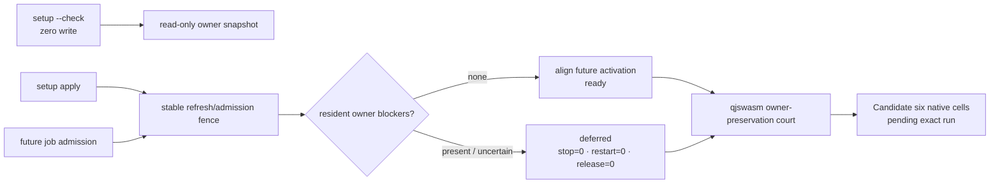
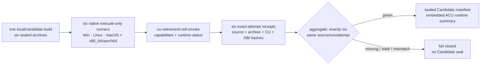
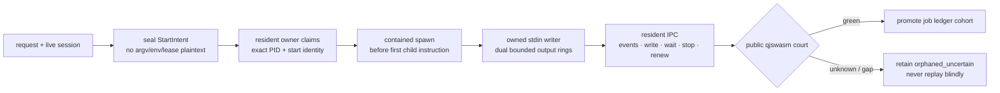
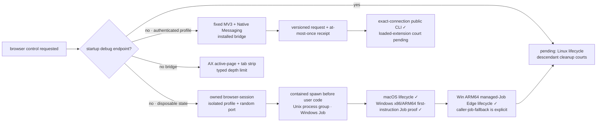
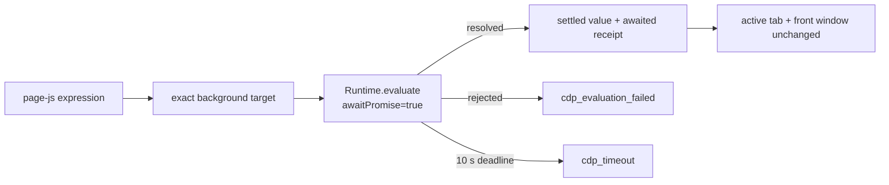
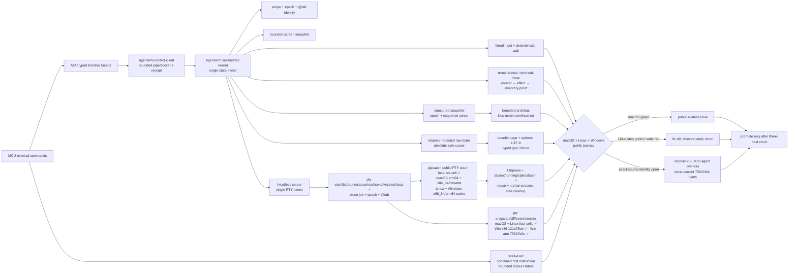
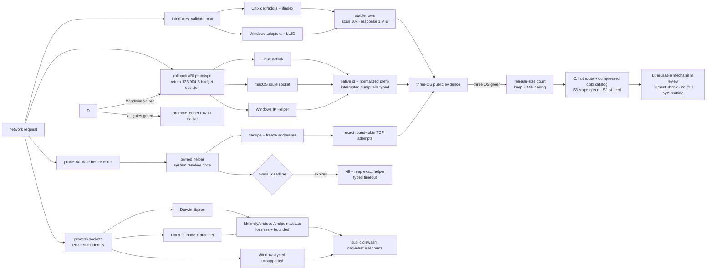

# Computer-use foundation (`agenterm-cu`)

Parent: [AgenTerm product tree](../PRD.md#product-tree)

This module is the root of the `agenterm-cu` product subtree. It owns the
product definition, the boundary against every existing observation/control
surface, the governing invariants, and the promotion gates. Its four child
modules own third-level requirements.

`agenterm-cu` is in active partial delivery. Its executable identity, command
shell, macOS host, runtime `libagenterm` boundary, Windows desktop-host ABI 1.7,
and Windows UIA backend have owning implementation evidence. The UIA claim is
backed by five pure tests, two real Win32 UIA fixture tests, and the passing
staged public `cu-windows-smoke` with all seven declared evidence receipts.
Candidate qualification and release are not claimed. This subtree root remains
partial, and each child marks only the capability supported by its own named
evidence.

Legend: `[x]` shipped, `[~]` partial, `[ ]` planned.

## Subtree map

`agenterm-cu` is organized as four child modules under this root, plus the
platform-accessibility backends that live under targets/transports. Platform
accessibility backends are an explicit branch under targets/transports — not a
footnote inside a table.

```text
agenterm-cu (28)
├── command surface (29)
├── targets / transports (30)
│   ├── current / ssh / rdp / vnc
│   └── platform a11y backends (agenterm-platform)
│       ├── Windows: native API + UIA
│       ├── macOS: AX (NSAccessibility)
│       └── Linux: AT-SPI2
├── authorization, safety and audit (31)
└── window placement (32)
```

Structured `tree` observation and `click` / `focus` by node identity are
provided by these native accessibility stacks (see
[30 § Platform accessibility backends](PRD_02_30_cu_targets_transports.md#platform-accessibility-backends)).
Screenshot and coordinate actuation are **degraded fallbacks** with typed
markers in the command result; they are never silent substitutes for a missing
control tree. `agenterm-cu` consumes `libagenterm` as its runtime mechanism
boundary; it does not open raw OS APIs or fork a fifth screenshot stack.

## Subtree index

| # | 子模块 | 一句话 |
|---|--------|--------|
| 29 | [Command surface and layering](PRD_02_29_cu_command_surface.md) | 抽象命令集、洋葱分层契约、结构化控件树与确定性等待 |
| 30 | [Targets and transports](PRD_02_30_cu_targets_transports.md) | `current`/`ssh`/`rdp`/`vnc` 目标族、transport 抽象、**platform a11y backends**（Win UIA / macOS AX / Linux AT-SPI2） |
| 31 | [Authorization, safety and audit](PRD_02_31_cu_authorization_safety.md) | 高危能力面的授权模型、审计、拒绝语义与证据 |
| 32 | [Window placement](PRD_02_32_cu_window_placement.md) | 命名摆放（Spectacle 目录）：几何核 + `agenterm-cu window-place` + 桌面常驻 `agenterm-cu host` 宿主 |

## Current delivery truth

- [x] `agenterm-cu` is the only product executable. CLI and desktop-host modes
  share that binary; an executable named `cu` is not a compatibility surface.
- [~] The temporary `skills/mcu/acu.ts` adapter owns only lossless legacy argv
  projection and ACU binary discovery. It must first shrink every useful MCU
  shape out of `STAY`, then be rewritten as `acu.qjs` so daily compatibility
  no longer requires Bun. That is an intermediate shell, not a second product
  implementation: no native mechanism, authority policy or postcondition may
  be copied from the Rust owner into qjswasm. The converged API is an
  embedder-provided `agenterm:acu` object (exposed to qjs as `acu`) whose qjs
  calls, CLI and MCP share one typed schema, `Executor`, deadline/cleanup
  behavior, failure vocabulary and receipt contract. Once callers no longer
  require legacy MCU syntax, `acu.qjs` itself may retire.

  ```text
  compatibility-shell lifecycle
  ├─ now: acu.ts = legacy argv projection + ACU binary discovery
  │  ├─ no product mechanism
  │  ├─ no independent authority or postcondition
  │  └─ every STAY is a measured retirement blocker
  ├─ after zero-STAY + MCU-absent courts: acu.qjs = Bun-free syntax adapter
  │  ├─ calls the public agenterm:acu object
  │  └─ contains mapping only; never a second Executor
  └─ convergence: agenterm:acu = stable typed library surface
     ├─ one schema / Executor / error vocabulary / receipt contract
     ├─ consumed by CLI, MCP and qjswasm
     └─ acu.qjs retires when legacy MCU syntax has no retained callers
  ```

  This boundary is enforceable, not aspirational:

  ```text
  compatibility implementation budget
  ├─ acu.ts may: discover the exact ACU binary; normalize legacy argv; forward stdio/exit
  ├─ acu.ts must not: implement filesystem/process/browser/device/privilege effects
  ├─ existing TypeScript-owned effects are migration debt, not accepted architecture
  ├─ acu.qjs may: preserve only the same legacy syntax projection without Bun
  ├─ acu.qjs must not: shell out around a missing typed command or duplicate verification
  └─ agenterm:acu owns: typed calls into the shared schema + Executor + receipts
  ```

  A compatibility route is complete only when the same public command succeeds
  with the MCU tree unavailable and its effect is proved by the owning native
  postcondition. Merely changing `acu.ts` from `STAY` to a private TypeScript
  implementation does not reduce the retirement gap. New product capability
  work therefore lands in `agenterm-cu`, an existing AgenTerm-owned facade, or
  the generic qjswasm/tinyvm layer; it never grows the transitional shell.

  ```mermaid
  flowchart LR
    TS["acu.ts today<br/>argv projection · binary discovery"]
    OWNER["typed native/delegated owner<br/>schema · Executor · postcondition"]
    GATE{"zero STAY<br/>MCU-absent parity"}
    QJS["acu.qjs transition<br/>Bun-free legacy mapping"]
    OBJ["agenterm:acu<br/>embedder object library"]
    USERS["one contract<br/>CLI · MCP · qjs"]
    DEBT["remaining TypeScript effect<br/>measured migration debt"]
    TS --> GATE
    OWNER --> GATE
    GATE -->|red| DEBT --> OWNER
    GATE -->|green| QJS --> OBJ --> USERS
  ```
- [~] Retirement now has one machine-enforced qjswasm court rather than a
  prose checklist. `acu-retirement-readiness` walks all 13 ledger families,
  rejects every `gap`, requires public evidence for available or
  platform-limited claims, verifies the three native host tasks and six-cell
  task registration, checks Candidate execution wiring, scans production
  automation for Bun/MCU dependencies, and consumes the temporary adapter's
  machine report. Report mode succeeds only as an audit and emits
  `cu.retirement-readiness`; its first baseline measures 131 capabilities,
  including 20 gaps and 50 platform-limited rows, plus 13 static adapter stays
  and an incomplete dynamic parity corpus. The owner-preserving setup refresh
  cut reduces the current ledger to 19 gaps without changing the 13 static
  top-level spellings. Only `enforce-absent` may emit
  `cu.retirement`, after zero blockers and after the configured MCU path is
  actually unavailable.
- [~] The setup family has left its implementation fallback. Native
  `setup --check` is a
  zero-write inspection; `setup` atomically publishes one owned launcher for
  the exact packaged `agenterm-cu` binary under a path lock, repairs only its
  own stale bytes, and refuses foreign files or links without changing them.
  `path-install` is only a compatibility alias. The macOS public qjswasm
  journey `cu.setup-cli-entrypoint` proves missing/check, install,
  idempotence, exact binary forwarding and collision preservation on native
  arm64 and a real x86_64 executable under Rosetta. Candidate runtime schema 2
  now requires the same journey before each cell may publish its receipt,
  binds its exact CU digest, and distinguishes cleaned owned-ephemeral effects
  from persistent machine mutation. Linux, Windows and one exact six-cell
  Candidate aggregate remain unproved until the workflow actually runs.
  Runtime refresh follows ACU's real on-demand architecture instead of
  recreating MCU's global daemon: setup apply and resident job admission share
  one stable fence; check remains zero-write; an idle refresh aligns future
  activation, while any start-intent, starting, running or owner-uncertain job
  makes the refresh `deferred`. It never stops, restarts or releases the
  resident owner. The public qjswasm journey
  `cu.setup-runtime-refresh-owned-job` is green on macOS: the exact job id,
  generation, process id and running state survive the refresh, and only the
  later explicit owner cleanup stops it. Candidate runtime schema 3 now binds
  this second receipt in every native cell. Device-lease refresh stays
  explicitly unavailable until ACU owns a native claim inventory; reporting
  zero active leases is not evidence that no external device owner exists.
  Linux, Windows and one exact six-cell Candidate aggregate remain unproved.
  Direct workflow
  script runs carry their explicit task-equivalent wall/operation/output
  budgets; relying on the generic run defaults made the slower x86_64 launch
  cancel even though the command itself was healthy.


- [x] Two MCU-only surfaces are reviewed retirements, not ACU gaps. `ghost X Y`
  drew a decorative cursor with no observation or effect authority; callers
  must use real pointer state, structured hit-testing or screenshots instead.
  `desktop-helper status|probe|start|restart|stop` managed the obsolete
  `cu-helper-mac` sidecar; ACU loads libagenterm in-process and exposes
  permission status/repair separately. Compatibility callers receive an
  explicit typed retirement instead of silently invoking MCU or recreating the
  sidecar architecture.
- [x] CU is the first runtime consumer of the `libagenterm` dynamic library.
  Product code owns command and action meaning while ABI/platform layers own
  native mechanisms.
- [~] On Windows, the product `Command`/`Executor` path consumes UIA tree,
  Value, Invoke and Focus through the runtime `agenterm.dll`; it neither opens
  COM/UIA directly nor caches native interfaces. The platform backend uses an
  MTA-capable per-operation session, bounded UIA and wall-clock timeouts,
  `SetAutoSetFocus(FALSE)`, and RuntimeId re-resolution for every node action.
  Structured UIA failure is typed and never silently becomes a coordinate
  click. Five pure and two real fixture tests own the adapter evidence; staged
  `cu-windows-smoke` owns the public DLL-backed journey.
- [~] The expanded Windows x86 UTM journey now reaches the public `.com`,
  qjswasm worker, process observation and UIA actuation through an interactive
  desktop worker. Its remaining red is explicit: the background court lets UIA
  perform a node-focus request but publishes no focused read-back, so evidence
  is withheld. Transient `UIA_E_TIMEOUT` / rejected-call results get bounded
  retries inside the existing action deadline; semantic mismatches do not.
- [~] Whole-window foreground activation is now a separate vertical slice:
  `activate --window H` flows through `agenterm-platform`, additive
  `libagenterm` ABI 1.26, the ACU command/receipt layer and exact focused-window
  inventory read-back. It is deliberately distinct from accessibility-node
  `focus` and application-local `raise`. A live macOS round trip activated a
  background text-editor window and restored the prior foreground window, both
  verified on the first poll; Windows x86_64 and Linux x86_64 cross-builds are
  green. The MCU adapter now rewrites its whole-window `focus H` to this verb,
  so that compatibility fallback inventory falls from 31 to 30. Windows and
  Linux native desktop journeys remain the promotion evidence; the source and
  local macOS result alone do not promote the leaf. The first updated Windows
  x86_64 attempt reached a ready QEMU Guest Agent twice but the interactive
  desktop task produced no registration nonce, so the product journey never
  started; that attempt is recorded as court infrastructure blocked, the VM
  was stopped, and zero product evidence is inferred from it.
- [x] Windows runtime window enumeration follows a two-stage
  required-size/fill ABI. If desktop churn makes the fill call report
  `required > capacity`, the caller retries with a fresh capacity under a hard
  attempt bound; it never truncates, writes beyond capacity or spins forever.
- [~] Windows desktop-host ABI 1.7 implements notification-area menu projection,
  `RegisterHotKey`, polling and cleanup for the CU host's 18 placement actions
  plus Quit. A native `target/abi-dev` `host --self-test --json` run reported
  `actions=19` and `cleaned_up=true`.
- [x] Local `dist` staging colocates `agenterm-cu.exe` and `agenterm.dll`; the
  staged `cu-windows-smoke` proves version, dynamic-library load, 19 desktop
  actions and deterministic cleanup. The old “both below 1 MiB” statement is
  archived: v0.1.16 Windows x86_64 shipped a 1,420,800-byte CU executable, and
  current capability growth has crossed the still-governing 2 MiB executable
  court. The no-raise decision experiment is
  [`plan/design-cu-single-entry-size-experiment.md`](../plan/design-cu-single-entry-size-experiment.md).
  Variant C now keeps only route identity and parser family hot and stores the
  complete validated help/catalog projection as an immutable compressed
  in-binary stream. Exact Windows x86_64 evidence is 2,221,056 bytes at zero
  synthetic rows; 16 and 32 rows grow at 96 and 64 bytes/row respectively, so
  the structural slope and rebuild-time gates pass. The executable remains
  123,904 bytes above 2 MiB. D tested neutral system-DNS resolution after a
  Darwin symbol profile suggested about 130.8 KiB. Exact Windows evidence
  recovered only 1,536 bytes and still exceeded 2 MiB by 122,368 bytes, so the
  ABI prototype was rolled back. The time-boxed no-raise court is complete: C
  stays for its bounded slope, the release gate remains red by 123,904 bytes,
  and that gap returns as an explicit product-budget decision rather than an
  excuse for moving CLI policy across the DLL seam.
- [x] Staged public `cu-windows-smoke` passes all seven declared evidence
  receipts: host self-test, DLL load cleanup, window identity, UIA tree,
  name-addressed actuation, Value/GetText wait and UIA fixture cleanup.
- [~] The six-cell artifact manifest and shared build path now include
  `agenterm-cu` plus the colocated `libagenterm` dynamic library on Linux and
  macOS as well as Windows. The macOS release signer signs and strictly verifies
  manifest libraries before executables. Static manifest/build/signing gates
  own this wiring. The local six-cell baseline now also requires an
  architecture-matched `agenterm-cu` and executes its public bounded
  `storage-devices` observation after the AgenTerm launcher check; macOS arm64
  and a digest-matched native Linux arm64 qjswasm court are green. This is
  stronger than archive membership but remains a minimum court: Linux x86_64
  and Windows x86_64 local courts are still open. The formal Candidate path is
  now wired (not yet remotely executed): every one of the six native runtime
  runners consumes only its already sealed archive, runs the packaged
  `agenterm-cu` + colocated `libagenterm` through the exact-source
  `cu-retirement-cell-smoke`, and uploads a run/attempt/archive/binary-bound
  receipt. The aggregate requires exactly six current-attempt cells with
  matching source identity and embeds their validated summary into the sealed
  Candidate manifest. No runtime cell checks out source, invokes Cargo, or
  mutates machine state; a first successful exact-SHA Candidate remains the
  evidence needed to turn this leaf `[x]`.
  Native Unix packaging, macOS signing/notarization and sealed Candidate
  artifact evidence remain open.


- [ ] Candidate and six-cell qualification and release evidence remain open.
  Passing local fixtures and staged public smoke does not promote this subtree
  root to shipped.
## Product outcome

- [~] `agenterm-cu` is AgenTerm's own computer-use foundation: one abstract
  command set for observing and controlling a machine — screenshot, window and
  control-tree enumeration, pointer, keyboard, clipboard, file transfer — that
  behaves identically whether the target is this machine or a remote one.
- [ ] it succeeds when an agent can drive a real desktop through one stable
  command surface, address controls by structured identity rather than guessed
  pixel coordinates, wait on observable state instead of sleeping, and have
  every action authorized and auditable.

## Why this product exists

- [ ] AgenTerm's north star is complete interface coverage: an agent must be
  able to control everything a human can and receive the same feedback. The
  terminal surface is largely covered; the machine outside the terminal is not.
  `agenterm-cu` closes that half.
- [~] The migration source is sibling-repo `moltbaby/skills/mcu` (`bin/mcu`).
  The accepted outcome is broader than the first desktop-bridge absorption:
  **`agenterm-cu` becomes the one machine-control entry and completely replaces
  MCU for production use.** Desktop discovery, accessibility trees, input,
  CDP, verification and window geometry land first; process, PTY, file,
  network, device, service, privilege and VM workflows must then become
  reachable through typed AgenTerm-owned facades. They need not be copied into
  the CU crate. Window placement
  ([32](PRD_02_32_cu_window_placement.md)) is one landed slice, not the product
  boundary. The executable goal, capability states and retirement gates are
  [`plan/goal-acu-replaces-mcu.md`](../plan/goal-acu-replaces-mcu.md).
  Provenance: [14](PRD_02_14_research_provenance.md) (lessons, not a TS copy).
- [x] R0 replacement accounting is exhaustive in
  `plan/acu-mcu-capability-ledger.json`: 13 families cover desktop, browser,
  process, PTY/job/terminal, file/storage, network, device/audio,
  service/runtime/session/audit, setup/doctor/permissions, host-resource,
  power, privilege and CoreSimulator. `remaining_families` is empty. This closes only the discovery
  DAG; rows marked `gap` or `platform-limited` remain work and cannot be called
  shipped from catalog presence.
- [~] MCU retirement is the current delivery cut, not a documentation-only
  migration. `desktop-state` (MCU alias `state`) is the first whole top-level
  fallback removed in this cut: one bounded window inventory selects an exact
  or uniquely resolved focused target, one bounded accessibility tree and the
  pointer are observed, then the complete window identity is revalidated.
  Ambiguity, disappearance, drift, inventory overflow and tree truncation are
  explicit rather than hidden. macOS public CLI evidence is green; Linux and
  Windows journey evidence remains open. The next dependency is the shared
  native runtime spine: on-demand coordinator → session lease → target lock → request identity
  → queryable audit. The middle three public leaves are now live: durable
  `session start|list|status|renew|end`, session-bound idempotent
  `lock acquire|list|release`, and newest-first `audit-query` with independent
  result/scan/byte budgets. Bounded `audit-compact` is plan-first; apply shares
  the append sidecar lock, drops malformed/expired/excess records explicitly,
  and atomically publishes a retained suffix under age/event/byte ceilings.
  Lease plaintext is returned once and never reaches
  durable state or audit. The transitional MCU-shaped entry now rewrites every
  session and lock operation plus `audit query|compact` onto these same ACU
  commands, removing the top-level `audit` fallback. The platform-neutral
  public qjswasm journey covers the full create/status/acquire/reacquire/
  release/end/query/retention loop on macOS, including expiry sweeping the
  session's target lock from public state. Job admission and session
  termination now share one stable per-session cross-process sidecar gate. A
  job rechecks the live lease inside that gate before reserving or spawning;
  `session-end` first makes the session terminal, then stops every nonterminal
  bound job and releases its locks. The same lease may retry an interrupted
  cleanup idempotently, while incomplete cleanup is a typed failure whose
  effect explicitly remains `session_ended`. The public qjswasm journey proves
  the running child and resident owner disappear, the lock is released, and a
  retry repeats no effect. Current-target
  mutations can now carry the all-or-none `--request-id`, `--session` and
  `--session-lease` envelope: admission verifies the active lease without
  renewing it, reserves a private crash-persistent request record before the
  effect, returns terminal metadata on exact retry, and refuses an uncertain
  retry rather than executing twice. A changed command or session under the
  same request id is a typed conflict; command and lease plaintext never enter
  the request store. SSH and VNC now project a versioned, 1 MiB-bounded worker
  envelope over stdin: the effect-owning worker re-authorizes, verifies its own
  session, reserves before effect, audits and finalizes. The bearer lease never
  enters argv/environment, and target-to-current rewriting retains an opaque
  effect-scope digest so another endpoint conflicts instead of receiving a
  false replay. Unit and process-boundary worker courts are green; public
  SSH/VNC mutation journeys, exact target-lock derivation, three-host evidence,
  remaining native courts stay open. `runtime-status` now truthfully reports
  that no global daemon is present or required: coordination is on demand and
  resident ownership belongs to the resource that needs it. Its snapshot reads
  effective session, lock and managed-job counts without sweeping, advancing
  the durable clock high-water mark or publishing state. The MCU compatibility
  shell maps `daemon status` to this result and `daemon caps` to the ACU
  capability catalog; `daemon start|restart|stop` remain explicit migration
  gaps rather than successful no-ops. The public qjswasm evidence is
  `cu.runtime-status`; exact source `00d22433` passes it on Windows aarch64
  after a ten-file guest manifest match and disposable-court rollback. Linux
  and Windows x86_64 reruns remain open.
  The spine must serve jobs, file transactions, browser bridge,
  privilege and Simulator instead of spawning parallel coordinators.
- [~] The compatibility spelling `acu caps` now returns the replacement ACU
  per-target capability matrix. It does not preserve MCU's private manifest as
  a second source of truth; declared, live, unavailable and unsupported states
  must instead become more precise in the ACU catalog and its native courts.
  Managed-job implementation has entered an internal, deliberately unshipped
  cohort: a private crash-safe registry seals start intent, generation, owner
  and exact child identity without accepting command, environment or lease
  plaintext; a resident owner claims that intent before contained spawn and
  drains stdout/stderr concurrently into loss-aware bounded rings. The shared
  platform child now yields one owned stdin writer whose drop is EOF, while
  containment ownership remains separate. The resident now derives a short
  opaque endpoint from its sealed generation, binds current-user native IPC
  before claiming `starting`, serves one bounded closed request per connection,
  and retains terminal output until its lease expires. No `job-*` verb is
  claimed yet: detached launch, request-bound public mutation and the
  platform-neutral qjswasm black-box journey remain required before any ledger
  row turns green.


- [~] absorbed from that skill on 2026-08-30 (review and slices in
  [plan/design-mcu-absorption.md](../plan/design-mcu-absorption.md)): its
  default control loop `windows -> bounded query/tree -> invoke <selector>`,
  `verify --expect`, bounded tree acquisition (depth and node budget during
  traversal, truncation flagged), stable window handles with inventory
  filters, and its four invariants (background never steals the foreground,
  key focus or the real pointer; unsupported is fail-closed, never a silent
  global-input or sudo fallback; delivery is not success, every action says
  `verified` / `unverified`; destructive actions need an exact target, a
  prior snapshot and a checkable postcondition). Its shell / PTY / job /
  process mechanisms remain owned by AgenTerm and the `.qjs` tool door, while
  simulator, storage, device, network, power and privilege mechanisms remain
  owned by their platform/runtime modules. That ownership rule prevents kernel
  duplication; it no longer means those workflows may remain trapped behind
  MCU. ACU owns their stable public facade, typed result, deadline, cleanup and
  evidence contract. Each slice is proven by a `.qjs` journey
  (`scripts/qjs/cu-macos-smoke.qjs`, first) so the script engine is exercised
  by real computer-use scripts.
- [~] Desktop closure tranche: `snapshot`/`diff`, `hit`/`zoom`, `raise`, and
  gated `minimize`/`restore` are live in the macOS Cocoa/AX public journey.
  The same source state must still pass Linux AT-SPI2 and Windows UIA courts;
  `drag` stays in the separate explicit-global-pointer court because it may
  move the user's real cursor and must restore it even on failure.
- [~] Browser actuation closure now includes typed `page-hover`, `page-scroll`,
  `page-drag`, `page-dialog`, and `page-files` over a selected CDP target. All keep the page/window backgrounded, separate
  dispatch from verification, reserve receipts before effects, and use bounded
  viewport coordinates/deltas. Hover verifies the trusted DOM event target;
  scroll waits on the owned container's real scroll event and offset read-back.
  Files validates bounded regular non-symlink inputs, resolves one enabled file
  control, and verifies the exact FileList while omitting local paths from public
  evidence. Drag freezes two live viewport points, guarantees a release attempt
  after press, and verifies the trusted down/held-move/up sequence.
  Dialog handling first observes an opening event, then verifies the close event;
  prompt/message contents never enter public or persistent evidence.
  MCU-compatible `--match` now searches title + URL + description but tightens
  first-hit guessing into an exact-one contract: zero and ambiguity are typed
  before any page effect.
  Public `page-js` now treats Promise settlement as part of the observation:
  `Runtime.evaluate` always uses `awaitPromise`, synchronous values remain
  immediate, and resolved values, rejection, or the 10-second CDP deadline are
  returned as explicit evidence (`awaited=true`, `cdp_evaluation_failed`, or
  `cdp_timeout`). A throwaway headless Brave court proved a background Promise
  settles without changing the active target or foreground window and that a
  rejected Promise cannot be reported as success.
  MCU's viewport `page click X Y` is also native: the point is frozen before the
  receipt, trusted page down/up events are read back, and a failed release gets
  a cleanup attempt without converting the failed effect into success.
  MCU `page type TEXT` now freezes the existing editable focus and verifies
  same-element value growth; plaintext input and field values never enter its
  public reply or persistent receipt.
  MCU's `page --pid` endpoint discovery is no longer trapped behind the
  compatibility runtime: every ACU CDP verb accepts `--pid PID` as an exclusive
  alternative to `--port`. The native platform adapter reads only that exact
  live process, requires the same start identity before and after inspection,
  extracts an explicit valid `--remote-debugging-port`, and never scans guessed
  ports. The full command line is credential-bearing mechanism data and is
  never copied into replies, errors, receipts or documentation evidence.
  Native Windows ARM64 and x86_64 court evidence is green: on each ISA an owned
  Edge process launched with an explicit port was resolved from its PID through
  the Windows adapter, and `page-targets` returned the expected page. The
  x86_64 proof also repaired a court-only transport defect: QGA must invoke
  `schtasks.exe` directly, while a nested session-0 shell is not a portable
  registration boundary. The authoritative Windows `.qjs` browser journey now
  exercises that PID route; its integrated rerun is still required. Both Linux desktop courts currently report a typed
  prerequisite gap (`no Chromium-family browser`), not a fabricated pass.
  The 2026-09-04 headless Google Chrome court and scripted transport tests are green;
  real-profile and three-host journeys remain promotion evidence.
- [~] “No pre-opened CDP port” is now split into two honest product routes.
  Chromium cannot acquire a DevTools TCP/pipe endpoint after its process has
  started, so ACU will not publish a fictitious attach verb or restart a user's
  authenticated browser. The near-term default is an owned `browser-session`:
  ACU starts a separate isolated profile with a random endpoint, records exact
  process identity, owns the complete process tree, and exposes typed
  start/list/status/stop/remove. Its pure foundation now validates one portable
  session-name component, emits `--remote-debugging-port=0` rather than scanning
  or reserving a guessed port, and strictly parses the bounded two-line
  `DevToolsActivePort` record into a loopback browser websocket. Its durable
  registry foundation now fixes one private per-user root, one closed
  per-session layout, bounded atomic JSON publication, generation + nonce +
  owner start-identity replacement checks, and explicit
  `starting/ready/stopping/stopped/failed/orphaned_uncertain` states. A ready or
  stopping record is invalid unless exact browser identity and endpoint travel
  together. The internal same-binary resident owner now waits for the launcher's
  post-spawn identity publication, holds the per-session lock, launches one
  process-group/Job-contained browser, publishes ready only after the strict
  port record, accepts only a stop request bound to generation + nonce + both
  process identities, and performs bounded cleanup on stop, TTL, failure and
  unwind. A prior endpoint file is removed before spawn, so a replacement
  generation cannot inherit stale readiness. Cleanup uncertainty—including an
  unexpectedly exited Unix tree root—is a durable state, never a claimed stop.
  The public lifecycle now reaches that owner. Start requires one absolute
  executable and bounded readiness/TTL. Stop requires the literal
  `--expect stopped` postcondition and verifies both identities absent; remove
  accepts the caller's exact terminal expectation (`stopped` or `failed`),
  repeats that proof, locks out the owner, checks the private profile object
  identity plus exact owner marker, refuses unknown entries, and only then
  removes owned state. A real macOS Chrome court passed ready → inventory →
  status → stopped → removed without opening a window. The platform crate now
  owns one reusable contained-headless spawn contract. Unix creates the process
  group in the pre-exec child; Windows creates the root suspended, assigns its
  exact process handle to a kill-on-close Job, and resumes only after assignment
  succeeds, with a fail-closed breakaway retry for an incompatible parent Job.
  Both Windows ISAs compile this path, and the refactored macOS lifecycle court
  remains green. The native `win-x86_64-desktop` and `win-aarch64-desktop`
  courts also executed the exact
  platform test whose first child instruction opens the expected named Job and
  proves its own exact process membership; both exited zero. The x86 court's attempted QGA
  batch-log pull produced no file, so exit status is the evidence and no text
  transcript is claimed. The ARM64 interactive court then exposed and closed two
  real lifecycle gaps: secure Windows relative opens had erased NTSTATUS
  `NotFound`, so readiness failed before `DevToolsActivePort` could appear; and
  a runner Job that denied breakaway left no usable lifetime mode. NTSTATUS is
  now translated to typed Win32 errors, creation/sharing races retry within the
  existing deadline, and the registry explicitly reports
  `caller-job-fallback` when the owner is bounded by the ambient Job. The same
  court passed Edge ready → status → stopped → removed, while a prior failed
  start was removed through `--expect failed` only after both recorded processes
  were proven absent. Linux lifecycle and descendant cleanup remain promotion
  evidence, not inferred passes.
  Executable discovery is intentionally caller-owned.
  Existing browsers with an explicit startup
  endpoint remain borrow-only through `--pid`; existing browsers without one
  retain AX/tab-strip control. The authenticated-profile route is a separately
  installed fixed-identity MV3 + Native Messaging bridge. Its protocol-v1 core
  now has bounded little-endian framing, split/combined-frame decoding, a
  closed `status|tabs|debug-read` catalog, bounded request ids and typed
  malformed/oversize refusal. A fixed new ACU extension identity, embedded MV3
  assets, same-binary native-host manifest plan and current-user/exact-process
  connection registry are present. The same `agenterm-cu` executable now
  intercepts only that fixed extension origin before any ordinary CLI output,
  so Native Messaging stdout contains frames only; a foreign or malformed
  host invocation fails without stdout. Public typed commands install the
  current-user bundle, list bounded exact-process connections, and route
  `status`, `tabs`, or `debug-read` only through an exact 256-bit connection
  id. Setup truthfully reports `extension_loaded=false` and
  `manual_activation_required=true`; it never claims Chromium loaded the
  unpacked extension. `debug-read` walks a
  bounded cross-frame AX tree without exporting form values, proves tab/window
  presentation did not change, and treats debugger detach failure as failure;
  tab inventory is independently bounded. Unit, CLI, both Windows-ISA compile,
  foreign-origin stdout, and empty exact-connection inventory evidence are
  green. A loaded-extension real-profile closed-shadow journey is still the
  promotion boundary; setup/catalog presence alone does not promote the route.


- [~] Browser download ownership is now a native `page-download` vertical
  slice rather than a successful `page-js` / `page-click` acknowledgement.
  The caller selects exactly one CDP page target and one download control,
  supplies an existing absolute `--download-dir`, and bounds the lifecycle
  with `--wait-ms 1..=300000`. ACU takes one cross-process lock per CDP
  endpoint because `Browser.setDownloadBehavior` is browser-global, installs
  `allowAndName` with events enabled, clicks without selecting the tab or
  raising its window, and correlates `downloadWillBegin` with
  `downloadProgress`. Success requires `state=completed` and a final regular
  non-symlink entry at the GUID path that is independently `stat`-verified;
  evidence returns the GUID, suggested filename, final path and decimal byte
  counts but never opens or emits file contents. Every exit attempts policy
  restoration. A held endpoint lock, policy refusal, cancellation, absent
  start event, deadline, or missing final file is a distinct typed failure,
  never a fabricated success. The non-sensitive Blob court owns the first
  public black-box evidence; real one-time credential downloads are excluded
  until that gate is green.
- [x] Native browser Save Panel handling is a separate P0 from direct CDP
  download. A real macOS incident proved that `windows` could observe a Brave
  `保存` panel by CGWindowID while `unlock`, targeted `send-keys`, and
  `activate` all reported no AX window; untargeted key injection then claimed
  success although the panel remained. The first platform correction resolves
  exact CG handles through the all-window owner inventory and recursively
  searches public `AXChildren` below every `AXWindows` root, so attached
  `AXSheet` descendants and off-Space windows are not rejected merely for
  missing the on-screen/root lists. An existing-but-unmatched handle is now
  typed `a11y_window_not_addressable`, distinct from a vanished window.
  The semantic panel leaf is now live. A separate planned unified download
  reducer must interleave CDP
  progress with bounded native panel observation, expose
  `waiting_for_save_panel | downloading | completed | canceled | blocked |
  timeout`, and permit Save/Cancel only under explicit actuation with semantic
  read-back. A controlled non-sensitive panel fixture owns that evidence; a
  live credential panel is never the test fixture.
  Live evidence then closed the first read/action loop: the mapped sheet
  exposed 12 nodes, including identifier `save-panel`, a filename field, a
  location pop-up and unique Cancel/OK buttons. The controlled
  `cu-macos-save-panel-smoke` court now proves both actions: semantic Cancel
  removes the exact panel and creates no file; semantic Save removes the exact
  panel and creates one bounded ordinary file. Both receipts require
  `performed=true`, `verified=true`, before-present/after-absent inventory, and
  orphan-free fixture cleanup. That court also found and fixed an effect
  receipt false negative: a successful Press invalidated the sheet before the
  generic post-action tree read. Invoke now treats exact before-present /
  after-absent inventory evidence as verified only for a mechanism-successful
  Press/Cancel. It cannot excuse another action or a surviving/unreadable
  window. The fixture reads no saved content and prints no path or secret.
  Untargeted `send-keys` was the inverse failure in the same incident: the OS
  injection API accepted Escape while the panel stayed open. That compatibility
  path now states `performed=true`, `verified=false`, `delivered=false`, with
  an unverified persistent receipt whose key evidence is length+digest rather
  than plaintext. Callers needing proof must use an exact window/node semantic
  action and its postcondition; JSON `ok` alone is not delivery evidence.


- [~] Non-desktop facade tranche has started: `ps` now exposes a bounded
  PID/parent/name inventory through `agenterm-platform::process::list`, shared
  with qjswasm `process.list`, and is reachable on current/ssh/vnc through the
  ordinary CU command schema. MCU's richer CPU/memory/argv/files/ports filters
  remain typed migration gaps; no flag is silently ignored.
- [~] `process-argv` is the first process-image detail facade. It reads native
  argument boundaries between two matching process start-identity observations,
  caps a page at 4,096 rows and omits plaintext by default; every hidden row
  still carries its index, byte length and SHA-256. `--values` is the explicit
  disclosure path. The MCU-shaped `process argv PID` adapter now routes to the
  same command. macOS public-CLI evidence is live and all three qjswasm native
  journeys declare platform receipts; integrated Linux/Windows reruns remain
  open, so this leaf is not yet three-host complete.
- [~] `process-cwd` / MCU-compatible `process cwd PID` is the next native
  process-context slice. It brackets the native read with equal process-start
  identities, publishes the explicitly requested UTF-8 path plus byte length
  and SHA-256, and never substitutes the ACU worker's directory. Linux reads
  `/proc/<pid>/cwd`; macOS reads `PROC_PIDVNODEPATHINFO` directly through
  libproc. Windows is deliberately `process_cwd_unsupported`: there is no
  stable public API for another process's current directory, and undocumented
  remote PEB / `RTL_USER_PROCESS_PARAMETERS` layouts (including WOW64) are not
  a product contract. Host unit tests and a macOS public-CLI read are green;
  the registered Linux/macOS journey evidence and Windows refusal court remain
  to be executed before promotion.
- [~] `process-environment` / MCU-compatible `process env PID` closes another
  process-context gap without turning environment secrets into ambient logs.
  Linux reads the 4 MiB-bounded `/proc/<pid>/environ` block and macOS parses
  `KERN_PROCARGS2`; both name the result `exec-initial`, because later
  `setenv`/`putenv` mutations are outside these native contracts. The read is
  bracketed by equal process-start identities, preserves duplicate, empty,
  malformed and non-UTF-8 raw entries, then raw-name sorts, prefix-filters and
  pages them. Default rows expose names plus byte lengths and SHA-256 only;
  `--values` is the explicit value-disclosure path. A macOS kernel omission is
  `process_environment_empty_or_omitted`, never a fabricated empty set.
  Windows is deliberately `process_environment_unsupported` rather than a
  remote PEB/WOW64 reader. Host tests and a macOS owned-process public CLI
  circuit are green; registered Linux/macOS journey evidence and the Windows
  refusal court remain to execute before promotion.
- [~] Permission discovery no longer requires agents to mine the broad
  capability document: `permissions status` is a live observe-only public command
  that returns the host permission model, every gated verb and exact repair
  guidance. It reuses the identical declaration embedded in `capabilities`,
  performs no settings mutation and never claims a grant the host cannot
  inspect. Unit and local public-CLI evidence are green on macOS; required vs
  optional classification and native Linux/Windows journey evidence remain
  open. `permissions open [accessibility|screen-capture]` is now the separate
  actuate shape: it reads native state first, returns a verified no-op when the
  selected grant is already held, or on macOS dispatches only that grant's
  exact System Settings pane. Omission selects Accessibility before Screen
  Capture; any unknown state fails typed rather than guessing. Linux answers
  `permission_open_not_applicable` and Windows answers the truthful
  provider-specific gap. Dispatcher acceptance never claims consent changed;
  the caller must re-run status after the user acts. The no-visible-UI public
  qjswasm court is green locally; a denied macOS exact-pane court plus native
  Linux/Windows execution remain open.
- [~] `doctor` is now a first-class observe-only command. It performs bounded
  live window and display probes, embeds the exact canonical `permissions` and
  `capabilities` declarations, and reports `ready|degraded` without opening
  settings, installing helpers or claiming consent. Unit and local public-CLI
  evidence are green; Linux/Windows native-court parity plus runtime/service/
  ABI/target-binding checks remain open.
  The compatibility adapter now routes MCU-shaped `acu doctor` directly to
  this native command, reducing the MCU `STAY` inventory from 32 to 31; routing
  tests and a live macOS adapter invocation are green. Whole-window activation
  subsequently reduces it to 30 under the separate evidence above.
- [~] Host application dispatch is now a first-class actuation:
  `host-open PATH_OR_URL [--app APPLICATION] [--background]` (alias `open`)
  crosses a typed `agenterm-platform` facade and never invokes a shell. macOS
  uses the system LaunchServices launcher, Linux uses a system `xdg-open`, and
  Windows uses `ShellExecuteW`; target/application values are bounded and
  option-like or NUL-containing values are rejected before native dispatch.
  The durable receipt stores byte lengths and SHA-256, not plaintext. A native
  acceptance is only `performed=true, accepted=true, verified=false`, never a
  fabricated claim that the handler rendered or consumed the target. The
  background no-window macOS qjswasm fixture is green as
  `cu.host-open.macos`; Linux/Windows native courts remain open. MCU `open` now
  routes here, reducing the top-level compatibility `STAY` set from 21 to 20.
- [~] Desktop notification dispatch now follows the same typed boundary as
  host-open: `host-notify TITLE [BODY] [--subtitle TEXT] [--sound]` (alias
  `notify`) sends bounded text as native argv data, never shell or generated
  AppleScript source. Receipts redact all content to byte length and SHA-256.
  macOS Notification Center is green through `cu.host-notify.macos`; the reply
  remains `verified=false` because acceptance cannot prove presentation or
  user attention. Linux `notify-send` and the Windows native notification-icon
  provider compile for both ISAs and remain native-court pending. Subtitle and
  sound are macOS-only until another provider can prove equivalent semantics.
  MCU `notify` now routes here, reducing top-level `STAY` from 20 to 19.
- [x] The compatibility boundary no longer lies about `permissions`: `acu
  permissions [status]` reaches the canonical observe-only ACU facade used by
  `doctor` and `capabilities`, and the old MCU entry advertises ACU as its
  replacement. This reduces the compatibility `STAY` inventory from 30 to 29;
  `acu permissions open` reaches the consent-preserving action above, while
  operating-system authorization itself remains user-controlled.
- [~] Process identity observation is live as `process-state --pid N` on
  current/ssh/vnc. It returns `live|dead|unknown`, preserves fail-closed unknown
  evidence, and publishes the platform start identity when available. MCU
  `process state N` routes to it. Future signal/kill work must bind the PID and
  this start identity, then verify post-state; naked PID mutation is excluded.
- [~] `process-usage --pid N` is live: cumulative CPU time,
  resident bytes and page faults are sampled between two equal start-identity
  observations and wide counters are decimal strings. `--watch-ms` returns an
  immediate sample plus a monotonic, identity-bound series under independent
  duration, interval and sample ceilings; `completed` and `truncated` remain
  distinct. MCU `process usage N --watch S --interval S --max-samples N` maps
  to this shape without a Bun-owned sampler; richer I/O remains an explicit
  gap. macOS has live evidence; Linux and Windows declare the same leaf and
  await their updated native-court runs.
- [~] One-shot `process-fds`, `process-maps`, and `process-threads` inventories
  are live through the shared platform boundary. Every snapshot is bounded
  independently from result pagination and bracketed by the same native start
  identity; native non-UTF-8 names and paths remain lossless in the typed JSON
  reply. macOS uses a build-linked `libproc` adapter and has public qjswasm
  evidence `cu.process-inspection`; Linux uses procfs and is cross-built for
  both ISAs. Windows refuses with `process_inspection_unsupported` instead of
  parsing undocumented remote-process structures. Linux native execution,
  Windows refusal courts and MCU-compatible watch/diff remain open.
- [~] One-shot `process-sockets` now joins each process-owned fd to a bounded
  native socket row between equal process start identities. The reply keeps
  family, protocol, local/remote/combined endpoint, normalized state and fd;
  Unix-domain endpoint bytes use the same lossless text-or-hex projection as
  other native paths. Native descriptor traversal and caller filtering/page
  limits are independent and both expose truncation. macOS uses build-linked
  `libproc`; Linux joins `/proc/PID/fd` socket inodes to the process network
  namespace without `lsof`; Windows returns typed unsupported instead of
  parsing private handle tables. Public qjswasm evidence `cu.process-sockets`
  is green on macOS against an invocation-owned loopback listener. Linux native
  execution, Windows refusal courts, global/name socket inventory and bounded
  watch/diff remain open.
- [~] `process-wait` is the first process capability that deliberately exceeds
  MCU's implementation: the caller supplies the `process-state` start identity,
  ACU opens and waits on a native stable process object, and PID reuse is a
  typed mismatch rather than a new target. Its timeout is monotonic and returns
  verified `timeout` instead of pretending the process exited. The three public
  journey scripts own the next evidence pass; macOS is live green while Linux
  and Windows await their next native-court rerun.
- [~] `process-kill` / MCU alias `kill` is the first identity-safe process
  mutation. The caller must provide PID + the prior `process-state` identity +
  explicit `--expect exited`; ACU then reserves a crash-persistent receipt,
  signals through a retained native process object, and waits on that same
  object for the postcondition. Linux uses `pidfd_send_signal` (graceful or
  forceful) and a real Linux x86_64 court has returned verified exit with no
  surviving child. Windows forceful mode uses a retained HANDLE; its x86_64
  court likewise returned verified exit in 114 ms with a closed receipt.
  macOS now retains `TASK_AUDIT_TOKEN` while opening the stronger termination
  reference, releases the task-name port, and calls
  `proc_signal_with_audittoken`; XNU validates the embedded pidversion, so a
  recycled PID cannot receive the effect. The macOS public qjswasm journey
  proved graceful exact exit, receipt completion and owned reaping. Arbitrary
  signals, suspend/resume and bounded process-tree termination remain separate
  leaves.
- [~] `process-set-state` closes the unprivileged MCU pause/resume shape with a
  stronger contract. The caller supplies the prior `process-state` identity;
  Linux signals through the retained pidfd and macOS through the retained audit
  token, then ACU reads the scheduler state back before returning verified.
  No-op state is verified without an effect receipt. Once the native signal is
  attempted, exit, PID reuse, observation failure and timeout all close the
  durable receipt as performed-but-unverified instead of leaving an ambiguous
  reservation. The public qjswasm journey `cu.process-set-state` is green on
  macOS. Windows answers `process_state_unsupported`, and MCU `--sudo/--broker`
  shapes remain with the privilege-provider leaf until a real consent boundary
  exists.
- [~] `process-signal --pid N SIGNAL` generalizes that exact-object authority
  without pretending every signal has a verifiable application effect. Linux
  delivers through the retained pidfd and macOS through the retained audit
  token; Windows supports only forceful KILL through its retained HANDLE and
  returns `process_signal_unsupported` for POSIX-only signals. TERM/KILL verify
  exact-object exit, STOP/CONT verify scheduler state, while HUP/INT/USR1/USR2
  truthfully return delivery accepted with `verified=false`. SIGKILL requires
  explicit `--force`; every post-effect observation failure closes the durable
  receipt rather than leaving a reusable reservation. The public qjswasm
  journey `cu.process-signal` is green on macOS: stale identity refusal,
  SIGUSR1 delivery, single-process STOP/CONT/KILL, then a real root plus two
  descendants through tree STOP/CONT/KILL all pass. Unix `--tree` freezes root
  and descendants until two bounded snapshots agree, retains each native
  object, delivers deepest-first, and resumes only members it found running;
  pre-stopped members remain stopped. Windows returns the same honest typed
  tree refusal as MCU because no containment object owns an arbitrary existing
  tree. MCU's unprivileged single-process and tree `signal` shapes now route
  here, reducing top-level compatibility `STAY` from 19 to 18; only privileged
  signal shapes remain behind the consent-provider gap. The operation reserves
  its public effect receipt and publishes a private recovery transaction before
  its first freeze. Every exact member is durably captured, then advances by
  write-ahead `freeze-intent → frozen-by-us` and, when it leaves the final
  stable tree, `release-intent → released`; delivery cannot start until the
  stable membership is sealed. Restart recovery observes the saved start
  identity before acting, never touches a replacement PID, preserves members
  that were already stopped, and separates `cleanup_verified` from an unknown
  signal effect. A crash between freeze intent and its completion is resumed
  with explicit `freeze_ownership_ambiguous=true`, not silently presented as a
  verified effect. The registered qjswasm court externally kills the exact ACU
  owner while the durable transaction is still `stabilizing`, then proves the
  next owner repairs the terminal receipt and leaves no frozen orphan. Unit
  courts cover first-intent, suspend-before-mark, mid-tree and
  resume-before-release-mark crash windows.
- [~] `process-watch` replaces MCU's PID/name/parent/all lifecycle watch with a
  bounded identity-safe diff. It takes one baseline and emits `started` /
  `exited` rows keyed by PID plus native start identity, so PID reuse cannot
  retarget the stream. Duration, interval, event count and matched inventory
  have independent hard ceilings. Unknown identity for an exact PID and
  oversized inventory fail typed; broad watches omit unidentified rows only
  with `coverage_complete=false` and an explicit count. A real owned-child exit is green through the macOS public CLI;
  macOS/Linux/Windows qjswasm journey leaves are declared for native reruns.
- [x] Linux x86_64 exact-SHA native execution is green at 24 / 24 STEP and
  26 / 26 evidence ids in 48.123 s, including the atomic `--ready-path` edge,
  real owned-child exit, identity-bound `process-kill` through a retained
  pidfd, accessibility observation and owned cleanup. This
  proves the integrated journey but does not retroactively invent a cause for
  the previous mixed-time AT-SPI snapshot. The complete poll/error account now
  survives in every failure bundle; fixed sleeps and weakened assertions stay
  excluded.
- [~] The Windows x86_64 Scheduled Task court exposed a distinct public-entry
  defect before the journey's first STEP: `agenterm.com` started the GUI PE
  with handle inheritance but without `STARTF_USESTDHANDLES`, so a no-console
  parent could lose redirected stdin/stdout/stderr before the hidden CLI
  worker existed. The trampoline now explicitly passes all three standard
  handles. Cross-compilation and source-contract tests are local evidence only;
  the same no-console public `.com` court must turn green before this is called
  fixed. Direct `agenterm.exe __agenterm-internal-cli` runs are diagnostic and
  can never substitute for that public evidence.
  The latest bounded court attempt is infrastructure-blocked rather than red:
  UTM and QGA became ready, but the interactive job agent did not claim the
  nonce request, so neither the public version probe nor the 16-step journey
  started. Zero evidence is attributed to the product, and the VM was stopped.
- [~] The MCU PTY/job/terminal surface is exhaustively classified in
  `plan/acu-mcu-capability-ledger.json`. The first AgenTerm-owned terminal
  facade is now live as `terminal-new/close/list/read/send/wait`: the small
  `agenterm-control-client` crate speaks the same bounded socket/pipe protocol
  directly, preserves typed server errors and control receipts, and never
  parses human-formatted CLI output or starts a second CLI process. Stable
  tab identity is `(server_scope_id, server_epoch, @tab_id)`; title and index
  are not authority. `terminal-read` truthfully returns a bounded current-screen
  snapshot, not an invented incremental output cursor. The registered macOS
  qjswasm journey now passes 44 steps / 45 evidence ids, including
  `cu.macos-terminal-control`: list → structured snapshot/cursor → literal send
  → contains wait → ordered delta continuation → bounded read → finalized wait
  → remain-on-exit → typed late-write refusal → owned cleanup. On Linux x86_64
  the earlier terminal step crossed every assertion,
  but the enclosing suite later failed its older AT-SPI observation step, so it
  emitted 0/27 evidence and remains unpromoted. The observation duration is now
  six seconds so cold-guest latency cannot consume the entire post-mutation
  window. Windows has a statically checked registered step, but the disposable
  court failed its interactive nonce handoff before product bytes were sent;
  zero Windows product evidence is claimed. A serial probe using the canonical
  VM identity kept QGA and the VM live but still produced no job, exit or worker
  log, ruling out duplicate VM names and narrowing the blocker to the
  interactive Scheduled Task/session handoff. Arbitrary headless
  PTYs and lease-owned jobs remain distinct platform/runtime gaps. They must
  not be simulated by a visible tab or by single-process metrics.

- [~] The arbitrary managed-job facade is now public as
  `job-spawn/list/status/resources/events/output/write/wait/renew/stop`. It is distinct from an
  AgenTerm tab and from the bounded synchronous `shell-exec`: an independent
  resident owner contains the exact child tree, retains separate bounded
  stdout/stderr cursor rings, exposes either a dual-stream long poll or one
  stream with its full byte budget, owns stdin EOF, and serves one request per
  current-user native socket/pipe connection. The durable registry never
  stores command arguments, environment values, session lease, stdin bytes or
  the private owner nonce in a public reply. Mutating spawn/write/renew/stop
  require request identity; replay of an exact successful spawn returns the
  same `{job_id,generation}` and does not create another process. Delivery
  uncertainty remains typed and is never retried automatically. A macOS
  public qjswasm court has proved exact replay, binary stdin plus EOF, both
  output streams with independently advancing cursors, the single-stream
  `job-output` byte-for-byte projection, exit verification,
  renewal, identity-bound stop and owner cleanup on macOS. The independent
  `utm-court` Linux x86_64 execute-only court then verified the complete
  delivery closure by SHA-256 and passed the same public journey at exact
  source `8c07b647`: replay, privacy-preserving list/status, renewal, stdin
  plus EOF, independent stdout/stderr cursors, wait, stop and session-owned
  cleanup all crossed. The VM was released after evidence. Linux aarch64 and
  Windows remain the promotion boundary, so this leaf stays partial. Windows
  currently fails before product delivery in the court's interactive-worker
  nonce recovery; that lifecycle mechanism belongs to the independent
  `utm-court` repository and must not be copied into AgenTerm.
  `job-resources JOB_ID GENERATION [--watch-ms N]` additionally exposes a
  point sample or an adaptively spaced, at-most-300-second bounded series for
  every current member of the resident owner's native containment group. Each
  stable-membership sweep brackets every member's start identity, requires the
  durable root identity to remain present, and refuses partial or drifting
  observations. Replies carry a membership digest, per-member facts, and
  lossless decimal aggregate `rss_bytes`, `cpu_ms`/`cpu_time_ns`, and page
  faults. Windows Job Objects prevent breakaway and therefore report
  `tree_complete=true`; POSIX process groups report complete current
  membership but deliberately do not claim genealogy after breakaway. The
  macOS public qjswasm court proves both point and bounded-watch projections;
  Linux and Windows native evidence and exact MCU flag alignment remain before
  routing. Stored job environment is a separate secret-bearing gap.

- [~] Privilege is now split at the real authority boundary. The public
  `privilege plan process.set-priority` command is read-only on macOS/Linux:
  it brackets the target with matching process-start identity and nice reads,
  freezes exact before/requested-after state, bounds expiry to 1..=600 seconds,
  and returns separate stable-contract and expiring-approval SHA-256 digests.
  `cu.privilege-plan` proves the public qjswasm path and `mutation_performed`
  remains false. Windows returns `privilege_operation_unsupported` because a
  priority-class contract is not Unix nice. The next provider boundary now has
  a bounded protocol-v1 request/reply codec: it rejects unknown fields,
  whitespace/unbounded identities, changed plan bytes, expired plans and
  non-current targets before any consent UI; it recomputes both digests and
  emits only a canonical request fingerprint for provider-side replay state.
  This is protocol infrastructure, not shipped elevation: `approval_digest`
  identifies an expiring intent and is never evidence of human consent.
  Authorization Services, polkit or UAC must authenticate the peer and consent
  out of band; the privileged provider must then revalidate, reserve before the
  effect, own postcondition read-back, and return completed or outcome-unknown.
  The provider-side replay ledger is now implemented as a path-injected store
  for the eventual protected helper: its opaque key binds fixed provider
  namespace, OS-principal digest and request id; it retains only canonical
  request/receipt digests and bounded outcome tokens. Exact completion replays
  without mutation, a changed request conflicts, and either a live reservation
  or a recorded uncertain outcome can never become fresh again.
  Provider installation, native consent and real apply remain explicit gaps;
  no shell, password capture or hidden elevation substitutes for them.

- [~] CoreSimulator now has a bounded macOS platform foundation rather than a
  shell-shaped MCU exception. It lists at most 200 devices by exact UDID,
  runtime, device type and state, and lists installed apps on one exact already
  booted device while discarding simulator container/data paths. Both real
  read-only inventories are green. Exact boot polls the same device identity
  to `Booted`; exact app launch/terminate require an installed bundle id and
  verify the device stayed identical and booted. The public `simctl` exit and
  launch PID are only provider acknowledgement, so app lifecycle receipts say
  `accepted=true, verified=false` until a stable public app-state oracle exists.
  Public `simulator devices|apps|boot|launch|terminate` routes now preserve
  those distinctions: inventory is observe-only, boot requires explicit
  `--expect booted` and exact state read-back, while app lifecycle requires
  `--expect accepted` and remains `verified=false`. The registered
  `cu.simulator-readonly` qjswasm court enumerates real devices and apps on an
  already-booted exact device without exposing container paths or performing a
  mutation. The transitional MCU adapter now routes its exact `simulator boot
  --device UDID` shape to that verified ACU boot contract; state filters,
  shutdown and lifecycle shapes without equivalent verification remain typed
  fallbacks rather than being silently weakened. The court still needs a
  controlled boot mutation before this row can be promoted.
  No existing court has yet booted a device or launched/terminated an app.
  Controlled mutation courts, shutdown, app deployment, guest foreground and
  guest screenshot remain open.

- [~] `resource status` now has a native platform-neutral ACU owner. Its closed
  snapshot includes host identity, uptime, CPU count/model, all three load
  averages, installed physical memory, strict native free memory, reclaimable
  available memory and the complete native process count. The reply explicitly
  says `atomicSnapshot=false`: these are bounded sequential observations, not a
  fabricated atomic system instant. Windows keeps its three compatibility zero
  values but marks `loadAverageSemantics=windows-not-available`; macOS/Linux
  mark native `getloadavg`. The registered `cu.resource-status` qjswasm court is
  green on macOS. Linux and Windows runtime courts remain before promotion;
  pressure/top/disk/volumes/priority/affinity/limits/scope are separate gaps.

- [~] `shell-exec` is the explicit synchronous host-shell facade for the MCU
  compatibility frontier; ACU's transport worker `exec --json` keeps its old
  meaning. Commands are UTF-8/no-NUL and bounded before spawn. The shell is
  contained before its first instruction, captures stdout/stderr concurrently
  under one aggregate budget, and returns exact code/signal facts. Timeout and
  output exhaustion terminate the owned tree or fail as
  `shell_exec_cleanup_uncertain`; nonzero command exit remains `ok=true` with
  `success=false`. Persistent audit records redact both streams and retain only
  byte counts, timing, exit and cleanup facts. Local macOS and Windows arm64
  UTM courts prove exact exit 37; the Windows court also proves both streams and
  output-limit cleanup. Linux and Windows x86_64 native promotion runs remain
  required, so the release leaf stays partial.

  `terminal-new` and `terminal-close` now close the owned-tab lifecycle gap
  without creating another PTY authority. Both reserve a crash-persistent
  receipt first, bind identity to the current server scope and epoch, and read
  the structured inventory back: creation must expose the returned `@N` (and
  the requested parent), while close requires `--expect closed` and proves the
  exact `@N` disappeared. Receipt metadata retains only title/argv byte counts,
  not their values. A local macOS black-box run proved detached child output,
  parent identity, exact close and that closing the final tab leaves the server
  alive with an empty inventory. After correcting the shared qjswasm `.` path
  normalization, the registered macOS journey passes 44 STEP / 45 declared
  evidence with these same assertions. Linux and Windows courts remain
  required before this leaf can claim three-host release qualification.
  Arbitrary background PTY/job ownership is deliberately still a different
  gap.

  `terminal-snapshot` and `terminal-events` close the structured terminal
  observation gap.
  Snapshot returns the product's bounded screen cell runs, styles, cursor,
  terminal modes and completeness flags with the exact
  `(server_scope_id, server_epoch, sequence, @tab_id)` identity. Events
  continues the bounded `ui-deltas` journal: it publishes only the requested
  tab's events and screen updates, while advancing its cursor over every
  scanned event so activity in another tab cannot cause infinite replay.
  Restart, overwritten history and future cursors fail typed; the product's
  64-event / 1 MiB delta limits remain authoritative. The macOS registered
  qjswasm journey proves snapshot → terminal output → delta continuation plus
  the existing lifecycle assertions. Linux and Windows courts remain pending.
  This is a loss-aware event cursor, not a raw retained-PTY byte offset.

  `terminal-output` closes that separate raw-output gap against the existing
  1 MiB redacted retention ring. A caller bootstraps at `earliest` or `current`,
  then continues from the exact absolute `next_cursor`; pages are capped at
  1 MiB. Bytes are always base64 and an `utf8` projection appears only when the
  complete page is valid UTF-8. An overwritten cursor fails typed as
  `terminal_output_gap` and names earliest/current; a future cursor fails as
  `terminal_output_future_cursor`. No lossy conversion, fixed sleep, second
  cache or second PTY owner is introduced. The registered macOS qjswasm journey
  proves current → literal send → incremental reply → empty tail. Linux and
  Windows courts remain pending.

  The bounded headless-owner court has also decided the next architecture
  branch: reuse the existing independent `agenterm server`, not a new CU
  daemon. Under one isolated logical instance, separate ACU processes proved
  initial-tab close → zero-tab survival → detached job creation → two exact raw
  cursor reads → finalized → exact close → zero-tab survival → explicit server
  shutdown. The discarded first run exposed and led to the separate CLI exit
  truth fix in `5446f2c7`; it contributes no server evidence. The first durable
  facade is now public as `pty-start/status/read/send/wait/wait-exit/stop`: a validated
  job name selects one private zero-tab server instance, then binds the owned
  process to its exact scope, epoch and stable `@tab`. Start/stop are serialized
  by a cross-process lock; read reuses the raw retention cursor; wait can
  require an exact exit status; stop requires `--expect stopped`. A macOS
  public-process court proved one winner under two concurrent starts, typed
  duplicate and exit-mismatch failures, output continuation, finalization and
  endpoint disappearance after shutdown. Both Windows targets pass
  `cargo-xwin` checks and both Linux targets pass `cargo-zigbuild`.
  The interactive slice now sends one exact literal UTF-8 argument with a
  committed control receipt and waits on the retained raw byte stream from an
  explicit cursor. Its bounded overlap preserves a match split across output
  pages; overwritten/future cursors, timeout, and finalized-without-match are
  separate typed failures. This is stronger than polling the current screen,
  but deliberately does not claim MCU regex-wait parity yet.
  A registered platform-neutral qjswasm task now owns the complete public
  interaction assertion. Its first macOS run passed in 728 ms with exact
  input, raw-output match, exit 7, typed finalized-without-match and verified
  shutdown. The same bytes and public commands are now green inside the native
  Linux x86_64 UTM desktop court. That court exposed a real environment
  assumption before turning green: QGA/system sessions need not publish
  `HOME`, so the journey now supplies an isolated `HOME`, `XDG_DATA_HOME` and
  `XDG_CONFIG_HOME` to every ACU child instead of inheriting a login session or
  writing guest user state. The Linux aarch64 UTM desktop court then passed
  the same exact public journey and cleanup contract. Windows x86_64 is also
  green through the logged-in UTM desktop job agent and the public
  `agenterm.com` trampoline: qjswasm drove the native ConPTY job through the
  same five stages and exited zero. Windows aarch64 then passed the identical
  public journey on its native UTM guest. The exact x86_64 macOS product,
  qjswasm worker, ACU executable and ABI library then passed the same journey
  under Rosetta. This closes the local six-cell user-space projection; Rosetta
  is recorded as translation evidence, not an Intel kernel claim.
  `pty-list` now bounds the private job-state inventory at 4096 entries and
  reconciles every valid name against its deterministic live authority as
  `running`, `stale` or `conflicted`. It refuses malformed names and symlinks,
  never starts or deletes a job, and the qjswasm journey proves the same unique
  job absent → running with matching epoch/tab → stale after verified shutdown.
  `pty-prune NAME --expect stale` shares a registry lock with `pty-start`, takes
  the job lock, re-proves that the authority is unreachable, reserves a durable
  receipt, permits only known workspace/settings/lock entries, and verifies the
  exact directory disappeared. Live/conflicted authorities and unknown entries
  fail without deletion. The qjswasm journey proves stale → pruned → absent.
  Exact source `a6a1c7b9` then passed that enlarged journey in all six local
  user-space cells: macOS arm64, macOS x86_64 under Rosetta, native Linux
  arm64/x86_64, and native Windows arm64/x86_64. UTM execution used one active
  lease at a time and returned every guest to `stopped`. The Windows court
  rejected an initially observed zero exit because it belonged to the prior
  readiness nonce; only a new per-job marker, the journey PASS line, and the
  matching exit receipt together count as execution evidence.
  Durable job event/screen projection has now started: `pty-snapshot NAME`
  resolves the same sole tab and returns its bounded structured screen with the
  exact job/scope/epoch/tab event cursor; `pty-events NAME --epoch ... --after
  ...` refuses epoch substitution and advances across every scanned journal
  event while publishing only the job tab's rows. `pty-resize NAME --rows ...
  --columns ...` reserves a durable receipt, obtains a temporary UI lease on
  that exact authority, performs the resize, detaches the lease and accepts
  success only after status independently reports the requested grid with the
  same epoch and tab. Every `pty-snapshot` also writes an atomic bounded
  baseline beside the audit store; `pty-diff NAME --base ... [--advance]`
  returns changed rows separately from terminal metadata changes. Its private
  store retains at most 128 records globally, caps each at 2 MiB and reaps stale
  temporary writes. The local macOS public qjswasm journey proved snapshot →
  verified resize/diff → literal output/diff → non-empty event continuation,
  then restarted the same name and proved the prior baseline is refused as a
  different authority. The enlarged artifact pair passes macOS arm64, macOS
  x86_64/Rosetta and native Linux arm64/x86_64. Windows x86_64 then exposed
  `ERROR_BROKEN_PIPE (233)` between the first empty startup inventory and the
  first mutation; `121b76ed` requires two consecutive independent empty reads
  before mutation, and that exact product passed the complete x86_64 UTM
  journey. Windows arm64 subsequently exposed a legal ConPTY right-margin
  wrap-pending cursor as `column == columns`; rejecting it invalidated the
  complete UI bootstrap and blocked both `pty-wait` and cleanup. `735b7e0c`
  normalizes that one cursor state to the last visible cell without weakening
  any other screen bound, and the rebuilt arm64 product passed all nine stages,
  exact status 7, restart refusal and cleanup. A current-source x86_64 rerun
  remains an evidence-identity leaf because its TCG guest had not recovered
  interactive-agent liveness; the two Windows passes are not combined into an
  exact-source six-cell claim. Reuse and orphan process-tree control remain open.
  The frozen court and kill criterion are
  [`plan/experiment-headless-pty-owner.md`](../plan/experiment-headless-pty-owner.md).

  The same macOS journey's opt-in qjswasm attribution receipt reported
  135,426,214 steps, 519 host operations / 649,108 host bytes, and a 49,608 →
  7,217,696-byte heap waterline. `JSON.parse` / `JSON.stringify` account for
  2,187,300 / 2,712,916 gross bytes. These are performance evidence, not a
  claim that the bytes are safely reclaimable; the rejected region experiment
  remains governed by PRD 36.


- [~] File/storage replacement is classified separately from qjswasm's basic
  filesystem calls. ACU now exposes `file-inspect PATH` / `file inspect PATH`:
  it never follows the final link, returns bounded type/size/time/readonly and
  platform metadata, brackets ordinary-entry metadata with two opened-object
  identities, and fails typed if the path was replaced. At exact source
  `286a0514`, the macOS qjswasm public journey passes 41 STEP / 42 evidence and
  cleanup. At exact source `aff6cc7b`, a real Linux x86_64 UTM court matched the
  host hashes for the ACU executable and ABI library, then proved ordinary-file
  opened-object identity, final-link no-follow/link-like identity and typed
  `file_inspect_failed` for a missing path before releasing the VM. This is a
  focused native ACU court, not yet the full Linux qjswasm journey. At exact
  source `867a6a64`, a real Windows x86_64 UTM court likewise matched the host
  hashes for `agenterm-cu.exe` and `agenterm.dll`, then proved ordinary-file
  opened-object identity, exact size and Windows attributes plus the same typed
  missing-path failure before release. Linux and Windows focused leaves are now
  green; promotion into both full qjswasm journeys remains open. Package tests,
  strict Clippy and the Windows x86_64 cross-check are green. `agenterm-platform` also owns
  no-overwrite publication and volume-capacity primitives. ACU now also exposes
  `file-copy SOURCE DEST [--replace --apply]` and `file-transaction
  status|rollback|recover|finalize ID`. Planning is mutation-free. Apply writes
  a private bounded receipt before its first file effect, binds every removable
  or renameable object to opened-object identity plus size/mtime/SHA-256,
  serializes the exact destination, retains an old destination until finalize,
  and refuses ambiguous recovery or changed post-state. The qjswasm public
  `cu.file-copy-transaction` journey proves plan/apply/status/rollback/finalize
  and refusal without disclosing contents on macOS; Linux and Windows native
  court evidence is still pending through the independent `utm-court` service.
  `file-move SOURCE DEST [--replace --apply]` now composes the same hardened
  copy publication with a recoverable source retirement. It atomically refuses
  occupied backup names, locks source and destination path namespaces in
  stable order, uses one copy-then-retire path across volumes, and retains the
  source plus any replaced destination until finalize. Recovery handles the
  crash window where a no-replace hard link exposes both names for one exact
  object; unknown or changed objects are preserved with a typed refusal. The
  public `cu.file-move-transaction` qjswasm journey is green on macOS and the
  MCU adapter routes the lossless move shapes; Linux and Windows native courts
  remain open. `storage-devices [--max N]` / `storage devices [--max N]` now
  provides the separate physical/block inventory. The platform facade invokes
  only fixed native system providers under one shared deadline and contained
  process-tree cleanup, with a 10,000-row scan ceiling and a 2 MiB aggregate
  provider-output ceiling; ACU adds a 1 MiB response ceiling. Capacities remain
  exact decimal strings across JSON, unavailable host fields stay explicit,
  and serial/WWN/Windows UniqueId are never requested or emitted. The public
  `cu.storage-devices` qjswasm journey is green on macOS. At exact source
  `76f85249`, the same journey passed on a native Linux aarch64 Lima/VZ court
  after source, bundle and guest artifact digests matched; unavailable UTM
  launch infrastructure is not product evidence. Exact source `00d22433` also
  passed on Windows aarch64 after a ten-file guest manifest match; the guest
  was reverted and stopped. Windows x86_64 and Linux x86_64 native runtime
  courts remain open. Therefore the
  ledger is `platform-limited`, not yet promoted to native or removed from the
  overall storage family. The exact inventory spelling already routes through
  ACU; mutation and volume sub-shapes remain dynamic compatibility fallbacks.
  Unix modes/xattrs and Windows ACLs/attributes remain typed platform-specific
  contracts rather than a false cross-platform spelling match.
  The MCU-shaped compatibility entry routes `acu file inspect PATH`, file copy,
  status, and explicit `--apply` rollback/recover/finalize to these typed ACU
  facades. Move uses the same native recoverable transaction; mode and xattr
  mutation remain explicit MCU fallbacks. The MCU
  plan-wrapper form of transaction actions without `--apply` also stays rather
  than accidentally performing the mutation.
- [~] Network replacement is classified into interfaces, routes, active DNS,
  sockets and DNS+TCP probes. `network-interfaces` is now the bounded Observe
  facade for native address inventory: `getifaddrs` plus ifindex on Unix and
  `GetAdaptersAddresses` plus adapter LUID on Windows. Rows are stable-sorted;
  missing MAC/netmask/CIDR fields are explicit; the whole snapshot shares one
  10,000-record native scan budget and ACU adds a 1 MiB response ceiling.
  `--max` is rejected outside 1..=5000 before enumeration. The public macOS
  command is green and both Windows ISAs compile under strict Clippy; Linux and
  Windows runtime courts remain, so the ledger truthfully stays
  `platform-limited`. `network-routes` now adds the matching shell-free route
  inventory through Linux NETLINK_ROUTE, macOS PF_ROUTE/NET_RT_DUMP2 and
  Windows GetIpForwardTable2. It preserves ifindex/LUID identities, normalizes
  destination prefixes, treats a null gateway as on-link, and refuses
  interrupted or malformed kernel snapshots. Native scanning is capped at
  10,000 records and the public response at 1 MiB. The public macOS qjswasm
  journey `cu.network-routes` is green; Linux and Windows native courts remain,
  so this leaf is also `platform-limited`. The compatibility entry routes
  exactly `acu network interfaces|routes [--max N]`. The identity-safe
  per-process socket slice is live through `process-sockets`; DNS and
  global/name-selected sockets remain MCU gaps.

  `network-probe` is implemented as an Observe
  facade: resolve once through the host resolver, deduplicate/freeze addresses,
  then report the exact bounded TCP attempts. The resolver lives in an
  invocation-owned internal child because Windows and glibc cancellation APIs
  failed the precommitted completed-cancellation gate; deadline expiry kills
  and reaps the exact helper instead of accumulating resolver threads. This is
  not yet promoted: six-cell compile plus invocation-owned loopback journeys on
  OSX/Lnx/Win are governed by
  [`plan/design-network-probe-resolver-experiment.md`](../plan/design-network-probe-resolver-experiment.md).
  The same public journey is green on macOS arm64, Linux arm64 + x86_64, and
  Windows x86_64. Windows arm64 was blocked before execution by its UTM/QGA
  transfer channel, so it contributes no product verdict. The current Windows
  release binary exceeds the existing 2 MiB `agenterm-cu` budget; the release
  size court remains open and the capability ledger stays `platform-limited`
  without raising that ceiling. Slow execute-only courts declare a bounded
  journey deadline and use Windows' synchronous `agenterm.com` front door;
  neither court latency nor a GUI-subsystem early return may become false green.
  The active qjswasm/tinyvm host surface still has no generic DNS/TCP API.
  Native system inventory remains platform-owned. Process-owned socket rows now
  bind matching process start identities; a future global inventory must join
  every row back to the same exact-process contract rather than a reusable PID.
  The MCU-shaped compatibility entry routes exactly `acu network probe HOST`
  to `network-probe`; DNS and global/name socket inventory remain explicit MCU fallbacks
  instead of being mislabeled as the same capability.


- [~] Device/audio replacement is classified across peripheral inventory and
  events, exclusive TTL claims, byte I/O, serial configuration and default
  output state. Device paths are locators rather than durable identity;
  mutations require a live lease or plan, target revalidation, bounded I/O and
  independently read-back post-state. Backend gaps remain platform-limited.
- [~] `device-screenshot` is now an integrated current-target leaf, with live
  promotion still waiting on a non-sensitive device court. Its classifier must
  never infer a phone
  trust/lock fault from an empty host capture inventory. Preflight separates
  host Camera TCC, usbmux availability/pairing, DAL source publication and
  stream/frame delivery: zero sources with denied/unknown Camera permission is
  `host_tcc_denied|host_tcc_consent_required`; a healthy paired device
  with no published DAL row is `device_source_not_published`; only an enumerated
  target plus direct evidence may produce a device-specific failure. `--list`
  reports those host signals. Accessibility is independent from pure DAL
  capture. The shared contract, macOS AVFoundation/CoreMediaIO adapter and
  public verb are now connected: observation never requests TCC consent; native
  and Rust boundaries cap PNG bytes at 64 MiB; timeout remains
  `device_frame_timeout`; publication is same-parent, atomic and no-clobber;
  image bytes never enter stdout. Fixture courts cover the exact field failure,
  successful empty inventory, TCC precedence, oversized native output, timeout,
  complete publication and a concurrent destination race without touching a
  real phone or permission prompt. This is `[~]`, not `[x]`, until a disposable
  non-sensitive device proves list + capture through the public CLI.
- [ ] daily device automation uses only a fixed-path, promoted, signed
  `AgentermCu.app` identity. Camera, Accessibility and Screen Recording are
  independent TCC services and are granted to that stable identity only;
  worktree binaries are development-court artifacts and must not become the
  operational entry. Changing path or bytes may create a new TCC identity, so
  deployment must publish one versioned artifact, verify its digest/signature,
  switch the fixed path atomically, and surface any required human consent as a
  host-side typed state. The release/signing/install court remains open.
- [ ] the differentiator is direction, not parity. General computer-use tools
  drive a screen through screenshot + OCR + coordinate guessing. AgenTerm
  already publishes exact structured bounds through `ui-snapshot`, so AgenTerm
  can be the first computer-use **target** with a real control tree, not only a
  computer-use client. Both directions belong to this subtree, and the target
  direction must not be dropped in favor of the easier client direction.

## Naming

- [x] `agenterm-cu` is the accepted product name. It supersedes the
  `agenterm-remote.exe` working name used in
  [`plan/archive/plan-v0.1.15.md`](../plan/archive/plan-v0.1.15.md) §5.6.1. Remote protocol
  support is a transport axis inside this product, not a separate product.
- [x] `agenterm-cu` is also the only executable name. ABI diagnostics,
  command mode, and the desktop host are modes of that executable; a second
  `agenterm-cu` binary is not a product or compatibility surface.

## Product boundary

### Owned here

- The abstract command set and its layering contract ([29](PRD_02_29_cu_command_surface.md)).
- The target family and transport selection ([30](PRD_02_30_cu_targets_transports.md)).
- The authorization, audit and refusal model ([31](PRD_02_31_cu_authorization_safety.md)).
- Named window-placement actions and their geometry contract ([32](PRD_02_32_cu_window_placement.md)).

### Not owned here — must be consumed, not forked

This is the primary risk. AgenTerm already has four surfaces that take
screenshots or inject input. `agenterm-cu` must not become the fifth
independent implementation.

| 已有面 | owning 模块 | cu 的关系 |
|--------|-------------|-----------|
| OS 级 screenshot / window / input / process 机制 | [20 Native platform](PRD_02_20_native_platform.md) `agenterm-platform` | **消费**。cu 不得直调 OS API，新机制先沉入 platform 并带 typed `Unsupported`/`Failed` |
| OS 级 accessibility-tree 机制（观察 + 节点动作） | `crates/agenterm-abi` libagenterm `agt_a11y_*`（里程碑 6）→ `agenterm-platform` 适配器 | **消费**。Linux `current` 的 `tree` / 结构化 `click` / `focus` / named `send-text` / focused `send-text --window` / named `copy` / focused `copy --window` / named `paste` / focused `paste --window` / named `send-keys` / focused `send-keys --window` 经 ABI 机制层，不在 cu 内复刻 AT-SPI/UIA/AX |
| 工作台观察/控制、确定性等待、身份 | [07 Agent control plane](PRD_02_07_agent_control_plane.md) | **不重叠**。cu 不为 agenterm 自己的 tab/PTY 提供第二条控制平面 |
| `agenterm-cc` 的 screenshot/snapshot 投影 | [21 Control Center](PRD_02_21_control_center.md) | **不重叠**。CC 是产品投影，不是通用机器控制面 |
| `agenterm-con cli` 的输入/截图/等待 | [26 con control CLI](https://github.com/partnernetsoftware/minicon/blob/main/prd/PRD_02_26_con_control_cli.md) | **不重叠**。con 是 GUI 生命期内的本进程终端控制 |
| 可选智能 / LLM 网关 | [12](PRD_02_12_specialized_intelligence.md) / [13](PRD_02_13_llm_gateway.md) | **独立**。cu 是工具面，不含模型、推理或提示策略 |

### Explicit non-goals

- [ ] no model, planner, prompt policy or agent loop. `agenterm-cu` provides
  capability, not judgment.
- [ ] no external computer-use framework, runtime or SDK is adopted into the
  product graph. Reference implementations may inform design; they are not
  dependencies. Provenance rules are owned by
  [14 Research provenance](PRD_02_14_research_provenance.md).
- [ ] no unrestricted-by-default authority. The unrestricted local runtime
  posture of [10 script engines](PRD_02_10_rhai_scripting.md) is explicitly
  **not** inherited; see [31](PRD_02_31_cu_authorization_safety.md).
- [ ] no silent capability substitution. An unavailable backend fails typed; it
  never degrades to coordinate guessing while reporting structured success.

## Governing invariants

- [ ] one command set across targets. `current` is the local degenerate tier of
  the same family as `ssh`/`rdp`/`vnc`, not a temporary special case. Adding a
  transport must not change the command surface above it.
- [ ] structured identity outranks pixels. Where a target can expose a control
  tree, commands address controls by structured identity with exact bounds;
  coordinate-only addressing is a declared fallback with an observable marker,
  never an invisible default.
- [ ] observation and action describe the same instant. A screenshot, a control
  tree and a subsequent action must be causally identifiable, so an agent can
  detect that the screen moved under it instead of acting on stale truth.
- [ ] every action is authorized before execution and observable after it. No
  action path exists that bypasses the authorization model or leaves no audit
  record.
- [ ] deterministic waits, never sleeps. Every state change an agent must
  observe is waitable with a bounded typed timeout.
- [ ] failures are typed and local. One target, session or backend failing must
  not corrupt another or abort the host.

## Promotion gates

- [ ] this subtree stays entirely `[ ]` at the root until the `current` tier
  proves the command set end to end on one platform with public black-box
  evidence. Individual child leaves may record `[~]` / `[x]` when their own
  evidence arrives; a partial platform slice does not promote the subtree root.
- [~] Linux `current` has an exact-SHA 24-step public AT-SPI2 journey with
  structured observation, actuation and cleanup. Windows `current` has staged
  public UIA tree, stable window/node
  identity, name-addressed Value/GetText/Invoke actuation, desktop-host cleanup,
  and shared host `Command`/`Executor` dispatch evidence in
  `scripts/qjs/cu-windows-smoke.qjs`. macOS AX remains a separate placement slice;
  Candidate qualification is still required before root promotion.
- [ ] the subtree root still has no shipped version. Roadmap ownership is
  [18 Focused product roadmap](PRD_02_18_roadmap.md). Window placement
  ([32](PRD_02_32_cu_window_placement.md)) opened under the v0.1.19 draft and
  is partially landed on macOS (command + day-driver host);
  that assignment does not promote this root or any other child.
- [ ] no capability may be marked shipped on design documents, reference
  assets, or a passing unit test alone. The evidence standard is the same as the
  rest of the tree: a public black-box journey against the real executable.
- [ ] when a child module's requirements outgrow it, it splits into a further
  module rather than accumulating a monolithic entry. This subtree exists
  precisely so that `agenterm-cu` never lands as one oversized bullet inside an
  unrelated module.

## Execution projection

Design and sequencing live in
[`plan/archive/plan-v0.1.15.md`](../plan/archive/plan-v0.1.15.md) §5.6 (mainline L-CU) and the
current-tier gap input
[`plan/agent-human-parity-audit.md`](../plan/agent-human-parity-audit.md).
Those are execution projections; accepted scope and status belong to this
subtree. Window-placement sequencing lives in
[`plan/plan-v0.1.19.md`](../plan/plan-v0.1.19.md); v0.1.18 remains the
in-progress unique version plan until it closes.
