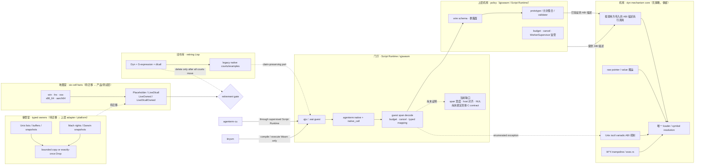

# PRD 02.34 — agenterm-dyn（极小 / 动态 / 底层）

Status: active product node — dyn is the **无策略底层机制层**（动态库/符号解析、按调用方 ABI
描述执行调用、raw value/pointer 搬运、variadic `ioctl` ABI、W^X trampoline、机制错误）
consumed by qjswasm; the small S-expression surface is being retired court by court into
`.wat`. **Typed owners and the six-cell catalog are 待迁移现状债**（2026-09-12 裁决：它们属上层
adapter/`agenterm-platform` 与产品/测试层，留在 dyn 只是**尚未搬走**，不是继续扩展目标）。
Owner: 政委定方向；主会话按独占文件域推进。

Parallel crate `crates/agenterm-dyn`, not a fourth engine, not libagenterm, not cu.

## 当前产品身份：无策略的底层动态能力转接（2026-09-12 裁决重写）

**dyn 不是产品层，也不是策略层。** 它是**无产品策略、无允许集合、无授权语义**的
底层动态能力转接：把“能不能用、允许用什么、暴露给谁”全部交给上层，自己只保证
**机制正确**。

**dyn 拥有（机制）**

1. **动态库打开与符号解析**——唯一的 loader/symbol resolution 路径（`libloading`）；
2. **按调用方提供的 ABI 描述执行调用**——调用方给出参数类/返回类（宽度、指针、
   可空性），dyn 负责布局与跳转，**不由 dyn 决定“哪些 ABI 允许”**；
3. **raw pointer / value 搬运**——整数、浮点、指针位的传参取回；
4. **必要 ABI 机制**——Unix variadic `ioctl` 特例；
5. **W^X trampoline 与机器码执行底座**（`src/exec.rs`，写态/执态互斥，永不 RWX）；
6. **机制错误传播**——加载失败、符号缺失、ABI 布局不一致、缓冲区错误等。

**上层拥有（策略）**

- **qjswasm / Script Runtime**：wire schema、`prototype`/catalog/validator、允许集合、
  暴露面、budget、cancel、`WorkerSupervisor` 监管；
- **typed OS contracts**（owner / snapshot：Mach right、接口地址表、domain/login name、
  realpath、statvfs、groups 等）：移交 **`agenterm-platform`** 或专门的上层 adapter；
  **最终模块落点仍需逐项迁移裁决**，本 PRD 不预先分配；
- **facts / catalog / evidence**：属**产品层与测试层**（六格状态、court/证据模型、
  发布资格），不属于 dyn。

**回答用户问题（已实现 vs 目标态）**

- **已实现**：今天的东西可以概括为 **libdl-like（打开库/解析符号）＋ 一部分
  libffi-like（一组枚举式固定 ABI 的调用执行）＋ 自有的 W^X/ABI 执行基础设施**。
- **尚未达到**：它还**不是 libffi 的完整超集**——参数类与 prototype 由 dyn 枚举、
  variadic 只覆盖 `ioctl` 一个特例、结构体/by-value 传递未做、host ABI 对齐与
  pointee 最小读写宽度不由 dyn 校验。
- **目标态**：把“**允许集合**”从 dyn 的枚举变成**调用方传入的 ABI 描述**，dyn 只执行；
  目标是**扩大或参数化 ABI 机制覆盖**（更多参数类/返回类、更多调用形状）。**“是不是 libffi 的
  完整超集”仍由 dyn 的实际 ABI 支持矩阵决定**，不能靠上层策略宣称，也不是上层的“能力”。

**机制正确性留在 dyn，权限语义不在 dyn**：unsafe 契约、错误传播、W^X、以及收到
**host 侧 ABI/value/pointer 描述后**的调用布局与执行错误，都是 dyn 的机制职责；
而“哪个 symbol 可用、允许哪种 pointer contract、给谁授权”是**上层策略**。
**guest-memory / schema 校验属 qjswasm door，不属 dyn**：guest span 解码（含
`offset + len` 不溢出且在 Wasm 线性内存内）、参数 kind、nullability 与 schema 判定
全部由 qjswasm 侧完成；dyn 只看到已经解码并验证过的 host 侧描述。
dyn **不**校验 host ABI 对齐、NUL 或具体 callee 的最小读写宽度；这些义务由上层与
受监管 guest 承担，不应被记成 dyn 的策略或授权。

### Markdown tree-DAG（当前功能树）

下面是 DAG，不是互斥目录树：qjswasm 同时依赖三个 invocation family。
**标注说明**：下面带 `[迁移]` 的条目是**历史现状 / 迁移债**（2026-09-12 前 dyn 曾拥有，现裁定迁出），
**不是继续扩展目标**；历史交付记录不抹除，但不得再被读成 dyn 的职责。

```text
agenterm-dyn
├── A. 可执行 native core                         [机制保留 · 策略迁移]
│   ├── abi
│   │   ├── AbiSignature / NativeCall              [调用方运行时描述]
│   │   ├── validate_abi / invoke_abi              [统一机制入口]
│   │   ├── pointer return: ptr() / ptr(u32) / ptr(u64) [机制支持]
│   │   └── Pointer 只表达 ABI 地址位；所有权、可空与 pointee 契约在上层
│   ├── exact_native
│   │   ├── 执行：按调用方 ABI 描述调用            [保留]
│   │   ├── 7 个同质标量族 × arity 0..=6 = 49 组合  [**策略 → 上层 qjswasm**]
│   │   ├── validate_exact_native_signature        [**策略 → 上层 qjswasm**]
│   │   └── invoke_exact                            [兼容薄封装 → invoke_abi]
│   ├── fixed_native
│   │   ├── 枚举式异构标量 prototype               [**策略 → 上层 qjswasm**]
│   │   ├── validate_fixed_native_signature        [**策略 → 上层 qjswasm**]
│   │   └── invoke_fixed                            [兼容薄封装 → invoke_abi]
│   ├── fixed_pointer
│   │   ├── 枚举式 caller-buffer / pointer prototype [**策略 → 上层 qjswasm**]
│   │   ├── validate_fixed_pointer_signature        [**策略 → 上层 qjswasm**]
│   │   └── invoke_fixed_pointer                    [兼容薄封装 → invoke_abi]
│   └── unix_ioctl
│       ├── variadic 调用机制 (i32, i32|u64, ptr) -> i32  [保留]
│       └── UnixIoctlRequest 的“允许签名”          [**策略 → 上层**]
│
├── B. typed native owners / snapshots            [**迁移：上层 adapter / agenterm-platform（逐项裁决）**]
│   ├── Unix
│   │   ├── InterfaceAddresses       getifaddrs/freeifaddrs 恰一次释放
│   │   ├── SupplementaryGroups      有界 gid 集合
│   │   ├── ResolvedPath             realpath owned bytes
│   │   ├── HostnameSnapshot         native bytes + 真 NUL
│   │   ├── ClockSnapshot            受控 clock id + pointer-free timespec
│   │   └── StatVfsSnapshot          pointer-free filesystem facts
│   └── Darwin
│       ├── MachHostPort             send-right RAII
│       ├── MachTimebaseSnapshot     numer/denom
│       ├── CpuCountSnapshot         hw.ncpu
│       ├── DlAddressSnapshot        copied image/symbol bytes
│       ├── DomainNameSnapshot       bounded native bytes
│       └── LoginNameSnapshot        1024-byte bound + true NUL + native bytes
│
├── C. OS×ISA facts                                 [**迁移：产品/测试层 facts**]
│   ├── hosts.rs: win/lnx/osx × x86_64/aarch64
│   ├── Placeholder | LiveDlcall | LiveOwned | LiveDlcallOwned
│   └── CU-adjacent facts（发现/兼容元数据，不是授权策略）
│
├── D. executable-code boundary                     [保留]
│   ├── CodeBuffer: W^X，永不 RWX
│   ├── NameTable: emitted / foreign name
│   └── ExecError: 独立 typed error
│
└── E. 小 S-expression 解释器                      [迁移后退役]
    ├── parse.rs + eval.rs + sym.rs + value.rs
    ├── Dyn / Value / Symbol / DynError
    └── native.rs 旧 dlcall 入口

共享边（DAG）
qjswasm ──uses──> A
qjswasm ──guest span──> A.fixed_pointer
qjswasm ──validated ioctl request──> A.unix_ioctl
Script Runtime / CU ──agenterm:native──> qjswasm ──> A
B ──describes the same native facts──> C.LiveOwned / C.LiveDlcallOwned
E ──courts are being ported to .wat──> qjswasm ──> A
```

### Mermaid flowchart memory-palace（调用与所有权记忆宫殿）

把系统记成五个房间：门厅只解码，机房只执行，保管室只管寿命，地图室只记事实，
旧书库等待搬完后关闭。任何新能力必须能指出它进入哪个房间；跨房间复制 loader、
资源释放纪律或 OS×ISA 真相都属于第二份真相。



这张图同时给出禁止项：不得增加第二个 native loader；不得让 guest 直接持有 OS
资源指针；不得把 `LiveOwned` 当成别的 target cell 的 runtime 证据；不得在 legacy
court 的用户主张尚未迁移时只按文件删除小 Lisp；**也不得让 dyn 决定允许集合、
授权语义、budget/cancel，或持有 typed OS owner 与六格 facts**（那些属上层与产品层）。

### 无策略边界：keep / move / delete 迁移表（2026-09-12 裁决）

| 模块（现 `crates/agenterm-dyn/src/`） | 判定 | 说明 |
|---|---|---|
| `hosts.rs`（six-cell facts / catalog / Placeholder-Live* 状态） | **move** | 属产品/测试层 facts；不属 dyn 机制 |
| `macos_resource.rs`（Mach right、domain/login/timebase、DlAddress…） | **move** | typed OS owner/snapshot ⇒ 上层 adapter 或 `agenterm-platform`（**逐项裁决**） |
| `unix_resource.rs`（getifaddrs / statvfs / clock） | **move** | 同上 |
| `unix_groups.rs` / `unix_path.rs` | **move** | 同上 |
| `exact_native.rs` / `fixed_native.rs` / `fixed_pointer.rs` | **split** | 执行机制留 dyn；“允许的 prototype 枚举 + validator”迁往上层的 catalog/策略 |
| `unix_ioctl.rs` | **split** | variadic 调用机制留；“允许签名”判据迁上层 |
| `exec.rs` + `exec_error.rs` | **keep** | W^X trampoline 与机器码执行底座（机制正确性，不是权限限制） |
| `error.rs` | **keep** | 机制错误传播 |
| `native.rs`（旧 `dlcall` 入口） | **split/retire** | 调用 ABI 机制与退役中的小 Lisp 语言层分开处置 |
| `parse.rs` / `eval.rs` / `sym.rs` / `value.rs` | **delete（退役）** | 语言层；其 court 主张须先迁到等价证据 |
| `lib.rs` 公开面 | **rewrite** | 现导出面即策略面（owner/facts/允许集合/budget 常量），需按上表收口 |

**兼容顺序（两步走，任一步可独立回退）**

1. **先加机制入口**：在 `exact_native`/`fixed_native`/`fixed_pointer` 上新增“**调用方传入
   ABI 描述**”的入口，现有 `invoke_*` 变为其薄封装——外部签名不变，qjswasm 无需同时改；
2. **再搬策略**：把 prototype 表与 validator 迁到 qjswasm 侧（成为上层 policy），随后从
   dyn 删除枚举；owner/facts 另开叶按“逐项裁决”迁往上层 adapter 或 `agenterm-platform`；
3. **最后退役语言层**：仅在每个 court 的用户主张都有等价 `.wat`/typed 证据后删除。

**不变量（验收必须同时证明）**

- **单 loader / 不新增第二 door**：`crates/agenterm-dyn/src` 内 `dlsym`/`libloading`
  **只有一处**；`crates/agenterm-qjswasm/src` 内仍为 **1（注释）**；新入口是“参数化调用”，
  不是新 loader；
- **策略在上层**：dyn 不得持有允许集合、授权语义、budget/cancel 或 typed owner 的事实；
- **机制正确性**：unsafe 契约、错误传播、W^X（永不 RWX）由 dyn 保持不变。

**验收证据（建议口径）**

- 两侧 owning tests（`cargo test -p agenterm-dyn`、`-p agenterm-qjswasm`）与现有 native-door
  门测试全绿；两侧 `clippy --all-targets -- -D warnings`、`cargo fmt -p <crate> -- --check`、
  `git diff --check` clean；
- **loader 计数**两侧分别为 1 / 1（且 qjswasm 那处是注释）；
- **一条可逆变异**：让 dyn 自行白名单（而不是接受调用方描述）⇒ 相应用例**必须变红**，
  证明策略确实在上层；原地还原并核哈希相等。

**非目标（本次裁决新增）**

- dyn 不拥有“**允许哪些 symbol / prototype**”的判据；
- dyn 不拥有 **typed OS owner / snapshot**；
- dyn 不拥有 **six-cell product facts / catalog / evidence / court** 策略；
- dyn 不拥有 **budget / cancel / 监管**；
- 不新增第二 loader、第二 door 或第二套 ABI 执行子系统。

## Exec base (dyn.1, 2026-08-16) — 身份补充

第一刀落地进程内活代码缓冲（`src/exec.rs`，unix-gated）。身份分界：**摆字节安全，
跳入 unsafe**。`CodeBuffer` 从第一天走 W^X（写态/执态互斥，永不 RWX）；`NameTable`
记缓冲内 offset（emitted）或一条外部/`dlsym` 地址（foreign，出向调用门）；`enter_i64`
是按 `extern "C" fn() -> i64` 声明签名的跳入门（unsafe，调用者担全部 ABI/字节义务）。
本刀只做执行底座：字节手写（对 nano golden），**不含编码器/汇编器、不含通用补丁/reloc
表、不删 S 式解释器与现有测试、不产 ELF/APE、不管 Windows 执行、不接 cu/chassis**。
`dlcall` 跳板原样保留；新路径是「名字表条目 + 发射的 call」，非删门。

## Current authorized scope

This section records the still-shipped legacy S-expression surface while its
native claims migrate. It is not the target architecture; the current target
and keep/retire boundary are the tree-DAG above.

First cut is the body: S-expr + intern + `if` / `set` / `do` + comparisons +
fixnum `+` `-` + bounded `repeat` + one hand (`dlcall`).

- `dlcall` is a Rust integer/pointer trampoline + `libloading`. No C, no libffi.
- `Dyn::eval` is pure and rejects any parsed `dlcall` with
  `DynError::NativeRequiresUnsafe` before execution; `unsafe Dyn::eval_native`
  is the only native-capable entrance. Its caller owns exact fixed ABI,
  pointer validity/alignment/lifetime/aliasing, library/thread requirements,
  resource cleanup and process side effects; Unix `ioctl` is the documented
  variadic compatibility exception.
- ioctl `TIOCGWINSZ` is the gate and is already in the crate (examples + smoke).
- Signature hardening on main: void, arity, empty/blank/overlong names,
  unknown types (`f32` / `struct` / `f64` / `u128` / `usize` / `isize` / `bool`).
- Linux live libc probes + paired S-expr examples (pid/uid/gid/pgid/sid/pgrp,
  `sched_yield` i32 status/alarm, descriptors, tty, access, sysconf pagesize, gethostid,
  getdtablesize, getpagesize, `times`, `getrusage`, `getrlimit`, …).
- 255-byte library/symbol names reach native processing; 256-byte names reject
  before loading or argument evaluation.
- Embedded NUL library and symbol names reject before loading or argument
  evaluation.
- Each `Dyn` retains at most 32 distinct `dlcall` library names. The cache never evicts or
  unloads entries, so an exact cached name remains usable at capacity; a new name rejects with
  `DynError::Library` before argument evaluation and before loading.
- Each `Dyn` retains at most 4,096 distinct bindings across Rust `bind` and S-expression `set`.
  Replacement of an existing name remains valid at capacity; a new `set` returns
  `DynError::StateLimit` before evaluating its right-hand side, so rejection has no nested
  assignment side effect. Binding and `set` targets, interned symbols, libraries, and native
  symbols are limited to 255 UTF-8 bytes and reject interior NUL. Each `Dyn` also retains at most 4,096 distinct
  interned symbols; `Dyn::intern` now returns `Result<Symbol, DynError>`, preserving reuse of
  existing names at capacity and reporting `NameContainsNul`, `NameTooLong`, or `StateLimit` for
  rejected new names. Script source NUL remains a parser rejection before execution.
- C spelling aliases outside the fixed-width ABI whitelist reject before
  loading or argument evaluation.
- The parser accepts exactly 256 nested lists; 257 nested lists return
  `DynError::Parse` before evaluation. This is a stack-resource bound, not a
  caller-policy boundary.
- Parser input is bounded before evaluation: exactly 65,536 UTF-8 bytes and
  4,096 AST nodes (every list and scalar expression counts) accept; the next
  byte or node returns `DynError::Parse`. These parser bounds do not add
  authority semantics or persistent environment quotas.
- Every top-level evaluation shares a 1,000,000-iteration repeat budget.
  `REPEAT_MAX` still permits a single 1,000,000-iteration loop, while nested
  loops reserve from `MAX_TOTAL_REPEAT_ITERATIONS` before their body executes.
  A rejected nested body reports `DynError::RepeatBudgetExceeded` without its
  body-side effects.
- Win six-cell extra probes stay placeholders. **macOS** has the shared
  fixed-ABI live libc rows plus `mach_absolute_time`, `getprogname`,
  `issetugid`, `_NSGetExecutablePath`, `proc_pidpath`, `arc4random`,
  `clock_gettime_nsec_np`, `sysctl`, `mach_timebase_info`, `pthread_main_np`,
  `getlogin_r`, `pthread_threadid_np`, `pthread_getname_np`, `proc_pidinfo`, `_NSGetArgc`,
  `_NSGetArgv`, `_NSGetEnviron`, `proc_pid_rusage`, `_dyld_image_count`, `getentropy`,
  `proc_name`, `pthread_get_stackaddr_np`, `pthread_get_stacksize_np`, `pthread_self`,
  `pthread_cpu_number_np`, `malloc_good_size`, `_NSGetProgname`, `proc_libversion`,
  `pthread_jit_write_protect_supported_np`, `sysctlnametomib`, `pthread_equal`,
  `gethostname`, `confstr`, `clock_getres`, `pthread_is_threaded_np`,
  `_NSGetMachExecuteHeader`, `_dyld_get_image_name`,
  `_dyld_get_image_vmaddr_slide`, `dladdr`, `gethostuuid`,
  `_dyld_get_image_header`, `arc4random_uniform`, `getdomainname`,
  `statvfs`, `gettimeofday`, `getgroups`, and `realpath`.
  `CpuCountSnapshot::acquire` owns only the bounded, pointer-free `hw.ncpu`
  fact rather than exposing general `sysctlbyname` caller buffers.
  `gethostname`, `getdomainname`, `getlogin_r`, `statvfs`, `getgroups`, and
  `realpath` are typed-only snapshot/owner rows; the remaining native-call rows resolve
  through `libSystem.B.dylib`.
  `mach_host_self` is **no longer a placeholder on Darwin**: `MachHostPort::acquire()`
  takes one owned send-right reference and its `Drop` calls `mach_port_deallocate`
  exactly once, with typed `MachHostPortError` and an observable
  `send_right_refs()` count. Every other cell stays a placeholder / typed
  `Unsupported`, and this evidence belongs only to the host ISA that actually ran.
  Both the retiring Lisp court and the current qjswasm native door delegate Unix
  `ioctl` to dyn's signature-gated variadic path for
  `(i32, u64|i32, ptr) -> i32`; neither owns a second variadic implementation,
  and this does not authorize general variadic FFI. CU-adjacent macOS notes name
  AX as a cu live hand.
- Last Linux Wave 8 evidence is `cargo test --locked -p agenterm-dyn` with Rust
  1.97: **150 passed** (25 unit + 40 errors + 11 hosts + 26 language + 48
  cfg-gated Linux smoke; 0 doctests). Wave 9 Darwin-native evidence is GitHub
  Actions `CI / agenterm` success run
  [31873334933](https://github.com/mgttt/agenterm/actions/runs/31873334933)
  at SHA `36e80aa9`, which contains Wave 9 commit `49d8c9af` as an ancestor.
  Native `aarch64-apple-darwin` and `x86_64-apple-darwin` jobs each reported
  **182 passed, 0 failed**: 25 unit + 3 catalog/docs + 40 errors + 11 hosts +
  26 language + 1 macos_ioctl + 45 macos_probes + 4 macos_resource + 27
  cfg-gated macOS smoke; 0 doctests.
  Wave 8 catalog rows (`dladdr`, `gethostuuid`, `_dyld_get_image_header`)
  are live `dlcall`s compared with later native calls.
  Wave 9 adds `arc4random_uniform`, `getdomainname`, and `statvfs` plus a
  portable catalog/documentation gate. On both Darwin architectures,
  the bounded-random, independent domain-name-buffer, and then-current legacy
  `statvfs` field-comparison courts each reported `ok`.
  Wave 9 is therefore host-evidenced and shipped; no Windows result is used as
  a substitute for that evidence.
  Wave 10 originally added `gettimeofday`, `getgroups`, and `realpath` to the Darwin live
  catalog (85 rows). Measured on this aarch64-apple-darwin host with Rust 1.97:
  **185 passed** (25 unit + 3 catalog/docs + 40 errors + 11 hosts + 26 language
  + 1 macos_ioctl + 48 macos_probes + 4 macos_resource + 27 cfg-gated macOS
  smoke; 0 doctests). Native CI remains the evidence gate for current source.
  Host-specific counts, not a cross-platform estimate.

- Current Unix ownership supersedes the legacy Lisp entrance for
  `gethostname`, `statvfs`, and `getgroups`: all four Unix cells expose only
  the bounded typed snapshot/owner APIs, while Windows remains a typed
  `Unsupported` placeholder. Their current courts retain independent direct
  native oracles and typed failure coverage; they no longer claim the removed
  caller-buffer `dlcall` path as product evidence.

## Completed branch accounting

### first cut

Implemented: intern/eval/list language, bounded repeat, and fixed-width
integer/pointer `dlcall` with no C or libffi dependency.

### harden

Implemented: signature/name rejection before load or argument evaluation,
including the pinned 255-byte accept / 256-byte reject name boundary and the
256-list accept / 257-list parse-reject boundary. The shipped ABI remains
deliberately small; this does not authorize a broader type system.

### probes

Integer/void/ptr libc rows are live on Linux (`libc.so.6`) and macOS
(`libSystem.B.dylib`); macOS additionally covers
`mach_absolute_time`, `getprogname`, `issetugid`, `_NSGetExecutablePath`,
`proc_pidpath`, `arc4random`, `clock_gettime_nsec_np`, `sysctl`,
`mach_timebase_info`, `pthread_main_np`, `getlogin_r`, `pthread_threadid_np`,
`pthread_getname_np`,
`proc_pidinfo`, `_NSGetArgc`, `_NSGetArgv`, `_NSGetEnviron`,
`proc_pid_rusage`, `_dyld_image_count`, `getentropy`, `proc_name`,
`pthread_get_stackaddr_np`, `pthread_get_stacksize_np`, `pthread_self`,
`pthread_cpu_number_np`, `malloc_good_size`, `_NSGetProgname`, `proc_libversion`,
`pthread_jit_write_protect_supported_np`, `sysctlnametomib`, `pthread_equal`,
`gethostname`, `confstr`, `clock_getres`, `pthread_is_threaded_np`,
`_NSGetMachExecuteHeader`, `_dyld_get_image_name`,
`_dyld_get_image_vmaddr_slide`, `dladdr`, `gethostuuid`,
`_dyld_get_image_header`, `arc4random_uniform`, `getdomainname`,
`statvfs`, `gettimeofday`, `getgroups`, and `realpath`.
`CpuCountSnapshot::acquire` is the typed-only owner of the fixed `hw.ncpu`
query, not a general `sysctlbyname` interface. The current
`gethostname`, `getdomainname`, `getlogin_r`, `statvfs`, `getgroups`, and
`realpath` rows are typed-only snapshot/owner facts rather than legacy Lisp calls.
`mach_host_self` is owned on Darwin through `MachHostPort` (`acquire()` plus a
`Drop` that deallocates exactly once, typed `MachHostPortError`); the other cells
stay placeholder / typed `Unsupported`, and the real-machine evidence is the host
ISA only. Windows extra probes stay placeholders. No
C shim.
Restore process-global side effects before the test ends. The `umask` claim has
moved to `qjswasm`'s `umask_restore.wat`: an isolated child compares the inherited
mask with direct libc calls before and after the guest, while the guest reads and
restores the mask itself. The duplicate Linux/macOS Lisp wrappers and child courts
are retired.
Unix `ioctl` (Linux and macOS) is owned by dyn's `invoke_unix_ioctl` only for the
validated `(i32, u64|i32, ptr) -> i32` signature. The legacy Lisp entrance and
the qjswasm native door both delegate there; the fixed trampoline remains for
every other call and this does not authorize general variadic FFI.
Linux caller-owned `ptr` coverage includes `getcwd`, `uname`, `times`,
`clock_gettime`, `getrusage`, and `getrlimit`.

### examples

Each shipped live probe has its paired S-expr documentation and README link.
The prose adds no cu or platform wiring.

## Later — not authorized or implemented

- Fold the intern tree to the host ISA in-process (endgame).
- Absorb wasmbin only as export/pack (intern tree → `.wat` / `.wasm`, `dlcall`
  as import), not as a VM layer.
- Consider libagenterm merge only after this crate is mature.

These are open product decisions, not scheduled branches and not evidence of
implemented functionality. Do not begin them without explicit 政委 direction.

### Active re-layering track (2026-09-12)

Dyn is an important bottom-layer module. **2026-09-12 裁决修正本节口径**：qjswasm 拥有
guest door、内存解码**与全部策略**（prototype/catalog/validator、budget、cancel、监管），
dyn **只拥有机制**——它执行**调用方传入的 ABI 描述**，不再拥有“允许的
exact/fixed/fixed-pointer 集合”。qjswasm 仍有真实的 Cargo 依赖；其 native dispatcher
保留 prototype/catalog 判定与 guest schema，五个 scalar/pointer 执行臂已经统一调用
dyn 的 `invoke_abi`。旧 `invoke_exact` / `invoke_fixed` / `invoke_fixed_pointer` 不再是
qjswasm 的执行入口；三者现均为统一入口的兼容薄封装，`invoke_abi` 直接选择
crate-private family mechanism，避免重入公开 wrapper。
The current
S-expression surface remains shipped product truth only until each non-language
court has claim-preserving `.wat` or typed-owner evidence.

- 统一 `abi` 迁移桥已落地：运行时构造的 `AbiSignature` / `NativeCall`
  会按**当前真实 trampoline 矩阵**分类；三个旧入口现均遵循
  `invoke_* → invoke_abi → crate-private family mechanism`。它没有新增 loader、
  door 或 ABI 形状，且已完成三族公开入口的依赖反转。qjswasm 已把 exact/fixed/
  fixed-pointer prototype 枚举、同质族判据和 canonical argument conversion
  本地化，不再导入 dyn 的旧策略枚举或 validator。raw `Pointer` 只有一个
  ABI 位，是否可空及
  pointee 宽度、对齐、NUL 契约仍属调用方与 qjswasm 上层 schema。
  统一入口随后新增 `ptr()` / `ptr(u32)` / `ptr(u64)` 三个真实单态
  pointer-return trampoline；返回值只保留机器地址位，不声明所有权或可解引用性。
  这三个形状的 Darwin direct-oracle court 已接管 `getprogname`、`_NSGetArgc`、
  `_NSGetArgv`、`_NSGetEnviron`、`_NSGetProgname`、`_NSGetMachExecuteHeader`、
  `_dyld_get_image_name(0)`、`_dyld_get_image_header(0)` 与
  `pthread_get_stackaddr_np(pthread_self())`，对应九个 Lisp court 已删除。
  既有 `i32(ptr,ptr)` 机制随后接管 `dladdr` 的状态、符号地址与 image-path
  direct oracle，删除第十个 Lisp court。统一入口又新增真实的
  `isize(u32)` 单态 trampoline，以 signed `isize` direct oracle 接管
  `_dyld_get_image_vmaddr_slide(0)`，不再沿用旧 Lisp court 将返回值伪装成
  pointer 的做法。真实的 `usize(i32,ptr,usize)` trampoline 又接管 `confstr`
  的完整 `size_t` 返回值、NUL 终止输出与 direct native bytes oracle，不再经
  Lisp 的 `u64`/language-integer 表示。`i32(i32,i32,ptr)` raw trampoline
  随后接管 `proc_pid_rusage`；结构体解释仍只存在于 direct-oracle court，dyn
  仅搬运其 opaque pointer。`i32(i32,i32,u64,ptr,i32)` 同样无损接管
  `proc_pidinfo` 的 byte count、PID/PPID 与 direct native fields oracle；
  最后的 `sysctl` court 由真实 `i32(ptr,u32,ptr,ptr,ptr,usize)` trampoline
  接管，保留状态、长度、正 CPU count 与 direct native oracle。由此
  `macos_probes.rs` 已删除，Darwin 专属的非语言 native claims 全部归入
  policy-free ABI court。
  统一机制也新增 result-only `Void` 与真实 `void(ptr)` trampoline；
  `free(NULL)` 的 C-defined no-op oracle 现直接返回 `AbiValue::Void`，不再依赖
  Lisp 的 `Nil` 表示。qjswasm 在自己的上层 catalog 中选择暴露
  `void(ptr?)`，并由 tinyvm WAT court 穿过既有 `native_call` 门验证整条链；
  `Void` 不是参数类型，未列形状仍明确拒绝。
  Unix `getpgrp` 的 Linux/macOS 重复 Lisp court 也已由一个 WAT guest 接管：
  qjswasm 仍拥有 `i32()` 的 catalog 决策，dyn 的统一 ABI 入口只执行，门测试
  与独立 `libc::getpgrp()` 精确比较；该迁移没有增加 loader、door 或允许规则。
  同形的 `getsid(0)` 与 `getpgid(0)` 随后迁入两个 WAT guest；正值断言及
  `libc` 精确 oracle 均保留，Linux/macOS 的三份重复 Lisp court 已删除。
  `getgid()` 与 `geteuid()` 的 `u32()` guest 也沿用同一分层，并以 direct libc
  值作 oracle；对应 Linux/macOS Lisp 断言已从退役表面移除。
  `sysconf(_SC_CLK_TCK)` 与 `sysconf(_SC_NPROCESSORS_ONLN)` 复用既有
  `isize(i32)` 机制；WAT court 保留正值和 direct libc 精确断言，并与已有
  page-size oracle 合并，三份 Linux/macOS Lisp 测试随之退役。
  `getpagesize()` 原先只返回布尔形状检查的 addition fixture 已提升为直接返回值
  的正式 WAT court，并与 `sysconf(_SC_PAGESIZE)` 精确比较；两份 Lisp court
  因而删除，而不是用较弱断言替代。
  `nice(0)` 与 `sched_yield()` 随后复用 exact `i32` 标量机制迁入动态生成的
  WAT guests；前者保留 direct 返回值比较，后者保留 direct status `0` 与精确
  比较，Linux/macOS Lisp courts 已删除。
  `getdtablesize()` 与 `gethostid()` 也改由 exact 无参数 WAT guests 覆盖；前者
  保留正值及 direct equality，后者保留完整 `i64` host-id equality，三份重复
  Lisp courts 已删除。
  `isatty(0..=2)` 也由一个参数化 WAT court 逐描述符调用，并保留 `{0,1}`
  状态约束与 direct libc equality；Linux/macOS 四份 Lisp courts 已删除。
  `access(missing,F_OK)` 现在由含 NUL 结尾合成路径的 WAT guest 覆盖，并与
  direct libc 的 `-1` 精确比较；两份 Lisp failure courts 已删除。
  `dup(0)`/`close(fd)` 由同一 WAT guest 串接：第一次 native 返回的描述符直接写入
  第二次调用记录，失败或关闭非零即 trap；宿主另跑 direct `dup/close` oracle。
  Linux/macOS 两份 Lisp 资源清理 court 已删除。
  `lseek(0,0,SEEK_CUR)` 复用已有 `i64(i32,i64,i32)` fixed trampoline，WAT
  guest 与 direct libc 精确比较（包括合法的 `-1` 非 seekable 结果）；两份 Lisp
  courts 已删除。
  统一机制新增真实 `i64(ptr)` trampoline；qjswasm 在上层 catalog 暴露
  `time(ptr?)`，WAT 以 NULL 调用并与随后 direct libc 时间保持一秒内相邻。
  Linux/macOS 两份 Lisp courts 已删除，nullability 仍不进入 dyn。
  `alarm(0)` 的 WAT court 在独立测试子进程中运行，调用前后均用 direct libc
  确认没有 pending alarm；Linux/macOS 的 wrapper 与 child Lisp courts 已删除。
  `getrlimit(RLIMIT_NOFILE)` 的既有 WAT court 现分别读取 `rlim_cur` 与
  `rlim_max`，并与一次 direct libc 结构体结果逐字段精确比较；补齐原先仅覆盖
  soft limit 的缺口后，Linux/macOS 两份 Lisp caller-buffer courts 已删除。

- [`plan/design-qjswasm-native-door-experiment.md`](../plan/design-qjswasm-native-door-experiment.md)
  owns the qualification ledger and remaining release/runtime evidence. Its bounded
  prototype is now implemented. It still forbids JIT, C/libffi, losing the Unix
  variadic `ioctl` exception, or deleting a shipped language court before equivalent
  current-tree evidence exists.
- Migrating and then deleting `eval.rs` / `parse.rs` / `sym.rs` / `value.rs` requires
  complete court and public-consumer migration. The legacy `Dyn`/`Value`/`Symbol`
  surface has no non-test Rust consumer outside this crate, but its native courts and
  examples still carry claims that must move rather than disappear. `hosts.rs` 目前仍是
  six-cell fact owner、`exec.rs` 仍是单独设界的 future JIT tool——**这两者是历史现状 /
  迁移债**（按 2026-09-12 裁决，facts 与 typed owner 将迁出 dyn；`exec.rs` 作为机制保留）。
- Current court migration has moved the scalar, clock-pointer, Darwin output-pointer,
  Mach-clock, and duplicate Darwin `ioctl` claims to qjswasm `.wat` or typed-owner
  evidence. The two-required-pointer `i32(ptr,ptr)` family now carries the
  `gethostuuid` UUID bytes and both `proc_libversion` integer outputs through the
  same dyn prototype, each compared with an independent direct native oracle.
  `getentropy` now uses the enumerated `i32(ptr,u64)` family; its replacement
  court deliberately preserves only the two successful status claims because
  independent entropy buffers have no exact content oracle.
  `sysctlnametomib` uses the enumerated three-required-pointer family; a
  selector-driven WAT fixture returns the output length and every MIB element
  separately so the direct-C array oracle remains exact rather than becoming a
  hash approximation.
  This is incremental retirement evidence, not permission to delete the remaining
  Lisp courts or language files as a batch.
- [`plan/design-guest-runtime-placement-experiment.md`](../plan/design-guest-runtime-placement-experiment.md)
  freezes the unresolved product choice between optional static CU linkage and a
  versioned provider ABI. No `guest-run` verb may land before one placement is both
  release-size qualified and reachable through a public black box, then approved by
  the human owner.

This track changes no shipped capability count until its public migration lands, but it
does authorize the bounded native-door prototype, measurements, and follow-on migration
work described by the linked plans.

### Boundary with the supervised qjswasm artifact route

Public `.wasm`/`.qjs` execution has an explicit artifact convention, bounded input,
and `WorkerSupervisor` containment for native-door crashes and hard timeouts.
The qjswasm native door now keeps declaration parsing, nullability, guest-span checks and
the exposed prototype catalog in qjswasm, then delegates all five exact/fixed/fixed-pointer
execution arms through dyn's policy-free `invoke_abi`. Unix `ioctl` continues through its
separate dyn mechanism entry. The public `native-acu-composition-smoke` proves one supervised guest can
compose `agenterm:native` with `agenterm:acu`. This establishes dyn as a real lower
layer; it does not establish that the legacy Lisp can be deleted before its remaining
courts move.

Qjswasm's native-door court no longer imports dyn's typed snapshots as test
oracles: Mach timebase, CPU count and monotonic clock assertions now compare
against independent direct platform calls. Typed owners therefore have no
consumer outside dyn; their remaining exports and self-tests are migration debt,
not a cross-crate compatibility contract.

In particular, the heterogeneous integer/pointer ABI mechanism, Unix variadic
`ioctl` exception and future-JIT boundary in `exec.rs` remain independently owned by
dyn. The six-cell `hosts.rs` facts and typed owners are migration debt, not dyn's
target ownership. `Dyn`/`Value`/`Symbol` are legacy language API and retire only with
the remaining language component after evidence migration.

`DomainNameSnapshot::acquire()` and `LoginNameSnapshot::acquire()` are the
typed Darwin boundaries for `getdomainname` and `getlogin_r`. Both publish
bounded, owned native bytes without requiring UTF-8 or leaking caller buffers,
require a real NUL terminator after success, preserve typed native failures,
and return `Unsupported` elsewhere. Their catalog rows are now `LiveOwned`:
the independent direct native oracles and synthetic failure courts supersede
the removed legacy Lisp calls, without turning Darwin runtime evidence into
evidence for Linux or Windows.

## Non-goals until 政委 orders otherwise

- No JIT / sljit / DynASM / copy-and-patch.
- No lambda / cons / strings / quote.
- No direct `agenterm-cu` or `agenterm-platform` import. CU consumes dyn only through
  the supervised Script Runtime/qjswasm path.
- No libffi, no C dependency, no fourth engine, no thickening libagenterm.
- **No product policy inside dyn**（2026-09-12）：不拥有允许集合/授权语义、不拥有
  typed OS owner/snapshot、不拥有 six-cell facts/catalog/evidence、不拥有 budget/cancel/监管。
- No second loader or second native door: the one loader stays in dyn, the policy moves up.

## Wave 11 (2026-09-12): Unix interface address lists as a typed owner (`8ae3b00a`)

**用户问题**：调用方需要"本地接口地址表"，但不能把 native 链表的裸指针带出 dyn——裸 `getifaddrs`
链表的所有权、上界与释放时机必须由一个类型负责，否则调用方要么泄漏，要么在别人 free 之后继续读。

**公开 owner**：`InterfaceAddresses::acquire() -> Result<Self, InterfaceAddressesError>`。
取得成功后由该值独占 native 链表；调用方只能读**已拷贝**的事实，拿不到指针。

**不变量**（实现见 `crates/agenterm-dyn/src/unix_resource.rs`）：
1. **私有 raw 链表**：链表头只存在于私有 `OwnedList<T, F: FreeList<T>> { head, freer }` 内，字段不对外公开；
2. **有界、pointer-free 快照**：对外只暴露 `InterfaceAddress { name: Vec<u8>（native 字节、去尾 NUL）, flags: u32, address_family: Option<u16> }`；进入快照后不再持有任何 native 指针；
3. **Drop 恰好 free 一次**：`OwnedList::drop` 只调用一次 `freer.free(head)`，`SystemFreer` 对应取得时的那**一次** `freeifaddrs`；注入式 `FreeList` seam 让"恰好一次"可在测试里判定（`#[cfg(any(unix, test))]`）。

**typed 失败**：`InterfaceAddressesError::{Os(..), TooManyEntries { limit }, Unsupported}`——不 panic、不返回部分真值。

**六格状态**（逐格陈述，不跨格外推）：
| 格 | 状态 |
|---|---|
| macOS aarch64 | **本机 runtime 通过**（`tests/unix_resource.rs`） |
| macOS x86_64 | **未测定**；不得沿用 aarch64 runtime |
| Linux x86_64 | **仅 `cargo zigbuild` 编译**；runtime 未取得 |
| Linux aarch64 | **未测定** |
| Windows x86_64 | **placeholder + typed `Unsupported`**；MSVC 仅编译，不声称 runtime 支持 |
| Windows aarch64 | **placeholder + typed `Unsupported`**；MSVC 仅编译，不声称 runtime 支持 |

**证据**：`8ae3b00a dyn: own Unix interface address lists`（`src/unix_resource.rs` +178、`tests/unix_resource.rs` +45、
`tests/catalog_docs.rs` +28、`tests/hosts.rs` +17、`examples/getifaddrs.md`、`README.md`）。

**明确非目标**：不解析地址 bytes（只搬运 native 事实）；该 owner 不经标量 native
door 暴露给 CU/qjswasm；不宣称任何网络能力或权限。

**不得外推**：catalog 该行的 `LiveOwned` 只表示"存在 owner 类型与释放路径"，**不等于 Linux runtime 已证**；
Linux/Windows 的运行资格仍按本 PRD 的六格纪律逐格取得。

## If a new authorized increment is opened

Use managed local agent sessions from the repository root, with `harden`,
`probes`, and `examples` as exclusive file domains. Do not use worktrees.
Push `[skip ci]` only when `origin/main...HEAD` is `0 1`.
