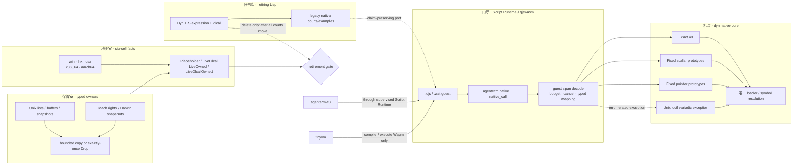

# PRD 02.34 — agenterm-dyn（极小 / 动态 / 底层）

Status: active product node — dyn is the native ABI/ownership core consumed by
qjswasm; the small S-expression surface is being retired court by court into
`.wat`. Typed owners and the six-cell catalog continue to grow with native evidence.
Owner: 政委定方向；主会话按独占文件域推进。

Parallel crate `crates/agenterm-dyn`, not a fourth engine, not libagenterm, not cu.

## 当前产品身份：受限的高级 FFI 内核，而不是通用 libffi

可以把 dyn 理解成一种**受限、类型化、可逐格证明的高级 FFI**，但不能把它描述成
“任意 C 函数都能调用”的通用 FFI。它把传统 FFI 经常混在一起的职责拆成三层：

1. **native invocation core** 只接受枚举过的 ABI 原型，先验证再加载；
2. **typed owner / snapshot** 封装有所有权、caller-buffer、链表或 borrowed-pointer
   风险的 OS 事实，不把裸指针交给消费者；
3. **host fact catalog** 分开记录六个 OS×ISA cell 的真实状态，不用一格的运行证据
   替代另一格。

qjswasm 是当前真实消费者：它拥有 guest-memory 解码、door、预算、取消与错误映射，
随后把已经验证的调用委托给 dyn 的 `invoke_exact`、`invoke_fixed` 或
`invoke_fixed_pointer`；Unix `ioctl` 特例也委托给 dyn 的 `invoke_unix_ioctl`，不在
qjswasm 内复制 variadic 调用实现。CU 通过 Script Runtime 的 `agenterm:native` 模块间接使用这条
链；CU 不直接依赖 dyn，也没有第二套 loader。tinyvm 仍负责 `.qjs`→Wasm 与 Wasm
执行，不拥有 native ABI。

### Markdown tree-DAG（当前功能树）

下面是 DAG，不是互斥目录树：qjswasm 同时依赖三个 invocation family；catalog 与
typed owners 也会共同描述同一个 native fact（`LiveDlcallOwned`）。

```text
agenterm-dyn
├── A. 可执行 native core                         [保留]
│   ├── exact_native
│   │   ├── 7 个同质标量族 × arity 0..=6 = 49 个可执行组合
│   │   ├── validate_exact_native_signature
│   │   └── invoke_exact
│   ├── fixed_native
│   │   ├── 枚举式异构标量 prototype
│   │   ├── validate_fixed_native_signature
│   │   └── invoke_fixed
│   ├── fixed_pointer
│   │   ├── 枚举式 caller-buffer / pointer prototype
│   │   ├── validate_fixed_pointer_signature
│   │   └── invoke_fixed_pointer
│   └── unix_ioctl
│       └── 仅 (i32, i32|u64, ptr) -> i32 的 variadic 特例
│
├── B. typed native owners / snapshots            [保留并继续扩展]
│   ├── Unix
│   │   ├── InterfaceAddresses       getifaddrs/freeifaddrs 恰一次释放
│   │   ├── SupplementaryGroups      有界 gid 集合
│   │   ├── ResolvedPath             realpath owned bytes
│   │   ├── HostnameSnapshot         native bytes + 真 NUL
│   │   ├── ClockSnapshot            受控 clock id + pointer-free timespec
│   │   └── StatVfsSnapshot          pointer-free filesystem facts
│   └── Darwin
│       ├── MachHostPort             send-right RAII
│       ├── MachTimebaseSnapshot     numer/denom
│       ├── CpuCountSnapshot         hw.ncpu
│       ├── DlAddressSnapshot        copied image/symbol bytes
│       ├── DomainNameSnapshot       bounded native bytes
│       └── LoginNameSnapshot        1024-byte bound + true NUL + native bytes
│
├── C. OS×ISA facts                                 [保留]
│   ├── hosts.rs: win/lnx/osx × x86_64/aarch64
│   ├── Placeholder | LiveDlcall | LiveOwned | LiveDlcallOwned
│   └── CU-adjacent facts（发现/兼容元数据，不是授权策略）
│
├── D. executable-code boundary                     [保留]
│   ├── CodeBuffer: W^X，永不 RWX
│   ├── NameTable: emitted / foreign name
│   └── ExecError: 独立 typed error
│
└── E. 小 S-expression 解释器                      [迁移后退役]
    ├── parse.rs + eval.rs + sym.rs + value.rs
    ├── Dyn / Value / Symbol / DynError
    └── native.rs 旧 dlcall 入口

共享边（DAG）
qjswasm ──uses──> A
qjswasm ──guest span──> A.fixed_pointer
qjswasm ──validated ioctl request──> A.unix_ioctl
Script Runtime / CU ──agenterm:native──> qjswasm ──> A
B ──describes the same native facts──> C.LiveOwned / C.LiveDlcallOwned
E ──courts are being ported to .wat──> qjswasm ──> A
```

### Mermaid flowchart memory-palace（调用与所有权记忆宫殿）

把系统记成五个房间：门厅只解码，机房只执行，保管室只管寿命，地图室只记事实，
旧书库等待搬完后关闭。任何新能力必须能指出它进入哪个房间；跨房间复制 loader、
资源释放纪律或 OS×ISA 真相都属于第二份真相。



这张图同时给出禁止项：不得增加第二个 native loader；不得让 guest 直接持有 OS
资源指针；不得把 `LiveOwned` 当成别的 target cell 的 runtime 证据；不得在 legacy
court 的用户主张尚未迁移时只按文件删除小 Lisp。

## Exec base (dyn.1, 2026-08-16) — 身份补充

第一刀落地进程内活代码缓冲（`src/exec.rs`，unix-gated）。身份分界：**摆字节安全，
跳入 unsafe**。`CodeBuffer` 从第一天走 W^X（写态/执态互斥，永不 RWX）；`NameTable`
记缓冲内 offset（emitted）或一条外部/`dlsym` 地址（foreign，出向调用门）；`enter_i64`
是按 `extern "C" fn() -> i64` 声明签名的跳入门（unsafe，调用者担全部 ABI/字节义务）。
本刀只做执行底座：字节手写（对 nano golden），**不含编码器/汇编器、不含通用补丁/reloc
表、不删 S 式解释器与现有测试、不产 ELF/APE、不管 Windows 执行、不接 cu/chassis**。
`dlcall` 跳板原样保留；新路径是「名字表条目 + 发射的 call」，非删门。

## Current authorized scope

This section records the still-shipped legacy S-expression surface while its
native claims migrate. It is not the target architecture; the current target
and keep/retire boundary are the tree-DAG above.

First cut is the body: S-expr + intern + `if` / `set` / `do` + comparisons +
fixnum `+` `-` + bounded `repeat` + one hand (`dlcall`).

- `dlcall` is a Rust integer/pointer trampoline + `libloading`. No C, no libffi.
- `Dyn::eval` is pure and rejects any parsed `dlcall` with
  `DynError::NativeRequiresUnsafe` before execution; `unsafe Dyn::eval_native`
  is the only native-capable entrance. Its caller owns exact fixed ABI,
  pointer validity/alignment/lifetime/aliasing, library/thread requirements,
  resource cleanup and process side effects; Unix `ioctl` is the documented
  variadic compatibility exception.
- ioctl `TIOCGWINSZ` is the gate and is already in the crate (examples + smoke).
- Signature hardening on main: void, arity, empty/blank/overlong names,
  unknown types (`f32` / `struct` / `f64` / `u128` / `usize` / `isize` / `bool`).
- Linux live libc probes + paired S-expr examples (pid/uid/gid/pgid/sid/pgrp,
  `sched_yield` i32 status/alarm, umask, descriptors, tty, access, sysconf pagesize, gethostid,
  getdtablesize, getpagesize, `times`, `getrusage`, `getrlimit`, …).
- 255-byte library/symbol names reach native processing; 256-byte names reject
  before loading or argument evaluation.
- Embedded NUL library and symbol names reject before loading or argument
  evaluation.
- Each `Dyn` retains at most 32 distinct `dlcall` library names. The cache never evicts or
  unloads entries, so an exact cached name remains usable at capacity; a new name rejects with
  `DynError::Library` before argument evaluation and before loading.
- Each `Dyn` retains at most 4,096 distinct bindings across Rust `bind` and S-expression `set`.
  Replacement of an existing name remains valid at capacity; a new `set` returns
  `DynError::StateLimit` before evaluating its right-hand side, so rejection has no nested
  assignment side effect. Binding and `set` targets, interned symbols, libraries, and native
  symbols are limited to 255 UTF-8 bytes and reject interior NUL. Each `Dyn` also retains at most 4,096 distinct
  interned symbols; `Dyn::intern` now returns `Result<Symbol, DynError>`, preserving reuse of
  existing names at capacity and reporting `NameContainsNul`, `NameTooLong`, or `StateLimit` for
  rejected new names. Script source NUL remains a parser rejection before execution.
- C spelling aliases outside the fixed-width ABI whitelist reject before
  loading or argument evaluation.
- The parser accepts exactly 256 nested lists; 257 nested lists return
  `DynError::Parse` before evaluation. This is a stack-resource bound, not a
  caller-policy boundary.
- Parser input is bounded before evaluation: exactly 65,536 UTF-8 bytes and
  4,096 AST nodes (every list and scalar expression counts) accept; the next
  byte or node returns `DynError::Parse`. These parser bounds do not add
  authority semantics or persistent environment quotas.
- Every top-level evaluation shares a 1,000,000-iteration repeat budget.
  `REPEAT_MAX` still permits a single 1,000,000-iteration loop, while nested
  loops reserve from `MAX_TOTAL_REPEAT_ITERATIONS` before their body executes.
  A rejected nested body reports `DynError::RepeatBudgetExceeded` without its
  body-side effects.
- Win six-cell extra probes stay placeholders. **macOS** has the shared
  fixed-ABI live libc rows plus `mach_absolute_time`, `getprogname`,
  `issetugid`, `_NSGetExecutablePath`, `proc_pidpath`, `arc4random`,
  `clock_gettime_nsec_np`, `sysctl`, `mach_timebase_info`, `pthread_main_np`,
  `getlogin_r`, `pthread_threadid_np`, `pthread_getname_np`, `proc_pidinfo`, `_NSGetArgc`,
  `_NSGetArgv`, `_NSGetEnviron`, `proc_pid_rusage`, `_dyld_image_count`, `getentropy`,
  `proc_name`, `pthread_get_stackaddr_np`, `pthread_get_stacksize_np`, `pthread_self`,
  `pthread_cpu_number_np`, `malloc_good_size`, `_NSGetProgname`, `proc_libversion`,
  `pthread_jit_write_protect_supported_np`, `sysctlnametomib`, `pthread_equal`,
  `gethostname`, `confstr`, `clock_getres`, `pthread_is_threaded_np`,
  `_NSGetMachExecuteHeader`, `_dyld_get_image_name`,
  `_dyld_get_image_vmaddr_slide`, `dladdr`, `gethostuuid`,
  `_dyld_get_image_header`, `arc4random_uniform`, `getdomainname`,
  `statvfs`, `gettimeofday`, `getgroups`, and `realpath`.
  `CpuCountSnapshot::acquire` owns only the bounded, pointer-free `hw.ncpu`
  fact rather than exposing general `sysctlbyname` caller buffers.
  `gethostname`, `getdomainname`, `getlogin_r`, `statvfs`, and `getgroups`
  are typed-only snapshot/owner rows; the remaining native-call rows resolve
  through `libSystem.B.dylib`.
  `mach_host_self` is **no longer a placeholder on Darwin**: `MachHostPort::acquire()`
  takes one owned send-right reference and its `Drop` calls `mach_port_deallocate`
  exactly once, with typed `MachHostPortError` and an observable
  `send_right_refs()` count. Every other cell stays a placeholder / typed
  `Unsupported`, and this evidence belongs only to the host ISA that actually ran.
  Both the retiring Lisp court and the current qjswasm native door delegate Unix
  `ioctl` to dyn's signature-gated variadic path for
  `(i32, u64|i32, ptr) -> i32`; neither owns a second variadic implementation,
  and this does not authorize general variadic FFI. CU-adjacent macOS notes name
  AX as a cu live hand.
- Last Linux Wave 8 evidence is `cargo test --locked -p agenterm-dyn` with Rust
  1.97: **150 passed** (25 unit + 40 errors + 11 hosts + 26 language + 48
  cfg-gated Linux smoke; 0 doctests). Wave 9 Darwin-native evidence is GitHub
  Actions `CI / agenterm` success run
  [31873334933](https://github.com/mgttt/agenterm/actions/runs/31873334933)
  at SHA `36e80aa9`, which contains Wave 9 commit `49d8c9af` as an ancestor.
  Native `aarch64-apple-darwin` and `x86_64-apple-darwin` jobs each reported
  **182 passed, 0 failed**: 25 unit + 3 catalog/docs + 40 errors + 11 hosts +
  26 language + 1 macos_ioctl + 45 macos_probes + 4 macos_resource + 27
  cfg-gated macOS smoke; 0 doctests.
  Wave 8 catalog rows (`dladdr`, `gethostuuid`, `_dyld_get_image_header`)
  are live `dlcall`s compared with later native calls.
  Wave 9 adds `arc4random_uniform`, `getdomainname`, and `statvfs` plus a
  portable catalog/documentation gate. On both Darwin architectures,
  the bounded-random, independent domain-name-buffer, and then-current legacy
  `statvfs` field-comparison courts each reported `ok`.
  Wave 9 is therefore host-evidenced and shipped; no Windows result is used as
  a substitute for that evidence.
  Wave 10 adds `gettimeofday`, `getgroups`, and `realpath` to the Darwin live
  catalog (85 rows). Measured on this aarch64-apple-darwin host with Rust 1.97:
  **185 passed** (25 unit + 3 catalog/docs + 40 errors + 11 hosts + 26 language
  + 1 macos_ioctl + 48 macos_probes + 4 macos_resource + 27 cfg-gated macOS
  smoke; 0 doctests). Native CI remains the evidence gate for current source.
  Host-specific counts, not a cross-platform estimate.

- Current Unix ownership supersedes the legacy Lisp entrance for
  `gethostname`, `statvfs`, and `getgroups`: all four Unix cells expose only
  the bounded typed snapshot/owner APIs, while Windows remains a typed
  `Unsupported` placeholder. Their current courts retain independent direct
  native oracles and typed failure coverage; they no longer claim the removed
  caller-buffer `dlcall` path as product evidence.

## Completed branch accounting

### first cut

Implemented: intern/eval/list language, bounded repeat, and fixed-width
integer/pointer `dlcall` with no C or libffi dependency.

### harden

Implemented: signature/name rejection before load or argument evaluation,
including the pinned 255-byte accept / 256-byte reject name boundary and the
256-list accept / 257-list parse-reject boundary. The shipped ABI remains
deliberately small; this does not authorize a broader type system.

### probes

Integer/void/ptr libc rows are live on Linux (`libc.so.6`) and macOS
(`libSystem.B.dylib`); macOS additionally covers
`mach_absolute_time`, `getprogname`, `issetugid`, `_NSGetExecutablePath`,
`proc_pidpath`, `arc4random`, `clock_gettime_nsec_np`, `sysctl`,
`mach_timebase_info`, `pthread_main_np`, `getlogin_r`, `pthread_threadid_np`,
`pthread_getname_np`,
`proc_pidinfo`, `_NSGetArgc`, `_NSGetArgv`, `_NSGetEnviron`,
`proc_pid_rusage`, `_dyld_image_count`, `getentropy`, `proc_name`,
`pthread_get_stackaddr_np`, `pthread_get_stacksize_np`, `pthread_self`,
`pthread_cpu_number_np`, `malloc_good_size`, `_NSGetProgname`, `proc_libversion`,
`pthread_jit_write_protect_supported_np`, `sysctlnametomib`, `pthread_equal`,
`gethostname`, `confstr`, `clock_getres`, `pthread_is_threaded_np`,
`_NSGetMachExecuteHeader`, `_dyld_get_image_name`,
`_dyld_get_image_vmaddr_slide`, `dladdr`, `gethostuuid`,
`_dyld_get_image_header`, `arc4random_uniform`, `getdomainname`,
`statvfs`, `gettimeofday`, `getgroups`, and `realpath`.
`CpuCountSnapshot::acquire` is the typed-only owner of the fixed `hw.ncpu`
query, not a general `sysctlbyname` interface. The current
`gethostname`, `getdomainname`, `getlogin_r`, `statvfs`, and `getgroups` rows
are typed-only snapshot/owner facts rather than legacy Lisp calls.
`mach_host_self` is owned on Darwin through `MachHostPort` (`acquire()` plus a
`Drop` that deallocates exactly once, typed `MachHostPortError`); the other cells
stay placeholder / typed `Unsupported`, and the real-machine evidence is the host
ISA only. Windows extra probes stay placeholders. No
C shim.
Restore process-global side effects before the test ends (`umask` pattern).
Unix `ioctl` (Linux and macOS) is owned by dyn's `invoke_unix_ioctl` only for the
validated `(i32, u64|i32, ptr) -> i32` signature. The legacy Lisp entrance and
the qjswasm native door both delegate there; the fixed trampoline remains for
every other call and this does not authorize general variadic FFI.
Linux caller-owned `ptr` coverage includes `getcwd`, `uname`, `times`,
`clock_gettime`, `getrusage`, and `getrlimit`.

### examples

Each shipped live probe has its paired S-expr documentation and README link.
The prose adds no cu or platform wiring.

## Later — not authorized or implemented

- Fold the intern tree to the host ISA in-process (endgame).
- Absorb wasmbin only as export/pack (intern tree → `.wat` / `.wasm`, `dlcall`
  as import), not as a VM layer.
- Consider libagenterm merge only after this crate is mature.

These are open product decisions, not scheduled branches and not evidence of
implemented functionality. Do not begin them without explicit 政委 direction.

### Active re-layering track (2026-09-12)

Dyn is an important bottom-layer module. The experiment has now produced the
shipping layering: qjswasm owns the guest door and memory decoding, while dyn owns
the validated exact/fixed/fixed-pointer invocation core. qjswasm has a real Cargo
dependency on dyn and its native dispatcher calls dyn's `invoke_*` APIs. The current
S-expression surface remains shipped product truth only until each non-language
court has claim-preserving `.wat` or typed-owner evidence.

- [`plan/design-qjswasm-native-door-experiment.md`](../plan/design-qjswasm-native-door-experiment.md)
  owns the qualification ledger and remaining release/runtime evidence. Its bounded
  prototype is now implemented. It still forbids JIT, C/libffi, losing the Unix
  variadic `ioctl` exception, or deleting a shipped language court before equivalent
  current-tree evidence exists.
- Migrating and then deleting `eval.rs` / `parse.rs` / `sym.rs` / `value.rs` requires
  complete court and public-consumer migration. The legacy `Dyn`/`Value`/`Symbol`
  surface has no non-test Rust consumer outside this crate, but its native courts and
  examples still carry claims that must move rather than disappear. `hosts.rs`
  remains the six-cell fact owner and `exec.rs` remains the separately bounded future
  JIT tool.
- Current court migration has moved the scalar, clock-pointer, Darwin output-pointer,
  Mach-clock, and duplicate Darwin `ioctl` claims to qjswasm `.wat` or typed-owner
  evidence. This is incremental retirement evidence, not permission to delete the
  remaining Lisp courts or language files as a batch.
- [`plan/design-guest-runtime-placement-experiment.md`](../plan/design-guest-runtime-placement-experiment.md)
  freezes the unresolved product choice between optional static CU linkage and a
  versioned provider ABI. No `guest-run` verb may land before one placement is both
  release-size qualified and reachable through a public black box, then approved by
  the human owner.

This track changes no shipped capability count until its public migration lands, but it
does authorize the bounded native-door prototype, measurements, and follow-on migration
work described by the linked plans.

### Boundary with the supervised qjswasm artifact route

Public `.wasm`/`.qjs` execution has an explicit artifact convention, bounded input,
and `WorkerSupervisor` containment for native-door crashes and hard timeouts.
The qjswasm native door now delegates validated exact/fixed/fixed-pointer and Unix
`ioctl` execution to dyn, and the public `native-acu-composition-smoke` proves one supervised guest can
compose `agenterm:native` with `agenterm:acu`. This establishes dyn as a real lower
layer; it does not establish that the legacy Lisp can be deleted before its remaining
courts move.

In particular, the heterogeneous integer/pointer ABI, Unix variadic `ioctl`
exception, six-cell `hosts.rs` facts, typed owners, and the future-JIT boundary in
`exec.rs` remain independently owned by dyn. `Dyn`/`Value`/`Symbol` are legacy
language API and retire only with the remaining language component after evidence
migration.

`DomainNameSnapshot::acquire()` and `LoginNameSnapshot::acquire()` are the
typed Darwin boundaries for `getdomainname` and `getlogin_r`. Both publish
bounded, owned native bytes without requiring UTF-8 or leaking caller buffers,
require a real NUL terminator after success, preserve typed native failures,
and return `Unsupported` elsewhere. Their catalog rows are now `LiveOwned`:
the independent direct native oracles and synthetic failure courts supersede
the removed legacy Lisp calls, without turning Darwin runtime evidence into
evidence for Linux or Windows.

## Non-goals until 政委 orders otherwise

- No JIT / sljit / DynASM / copy-and-patch.
- No lambda / cons / strings / quote.
- No direct `agenterm-cu` or `agenterm-platform` import. CU consumes dyn only through
  the supervised Script Runtime/qjswasm path.
- No libffi, no C dependency, no fourth engine, no thickening libagenterm.

## Wave 11 (2026-09-12): Unix interface address lists as a typed owner (`8ae3b00a`)

**用户问题**：调用方需要"本地接口地址表"，但不能把 native 链表的裸指针带出 dyn——裸 `getifaddrs`
链表的所有权、上界与释放时机必须由一个类型负责，否则调用方要么泄漏，要么在别人 free 之后继续读。

**公开 owner**：`InterfaceAddresses::acquire() -> Result<Self, InterfaceAddressesError>`。
取得成功后由该值独占 native 链表；调用方只能读**已拷贝**的事实，拿不到指针。

**不变量**（实现见 `crates/agenterm-dyn/src/unix_resource.rs`）：
1. **私有 raw 链表**：链表头只存在于私有 `OwnedList<T, F: FreeList<T>> { head, freer }` 内，字段不对外公开；
2. **有界、pointer-free 快照**：对外只暴露 `InterfaceAddress { name: Vec<u8>（native 字节、去尾 NUL）, flags: u32, address_family: Option<u16> }`；进入快照后不再持有任何 native 指针；
3. **Drop 恰好 free 一次**：`OwnedList::drop` 只调用一次 `freer.free(head)`，`SystemFreer` 对应取得时的那**一次** `freeifaddrs`；注入式 `FreeList` seam 让"恰好一次"可在测试里判定（`#[cfg(any(unix, test))]`）。

**typed 失败**：`InterfaceAddressesError::{Os(..), TooManyEntries { limit }, Unsupported}`——不 panic、不返回部分真值。

**六格状态**（逐格陈述，不跨格外推）：
| 格 | 状态 |
|---|---|
| macOS aarch64 | **本机 runtime 通过**（`tests/unix_resource.rs`） |
| macOS x86_64 | **未测定**；不得沿用 aarch64 runtime |
| Linux x86_64 | **仅 `cargo zigbuild` 编译**；runtime 未取得 |
| Linux aarch64 | **未测定** |
| Windows x86_64 | **placeholder + typed `Unsupported`**；MSVC 仅编译，不声称 runtime 支持 |
| Windows aarch64 | **placeholder + typed `Unsupported`**；MSVC 仅编译，不声称 runtime 支持 |

**证据**：`8ae3b00a dyn: own Unix interface address lists`（`src/unix_resource.rs` +178、`tests/unix_resource.rs` +45、
`tests/catalog_docs.rs` +28、`tests/hosts.rs` +17、`examples/getifaddrs.md`、`README.md`）。

**明确非目标**：不解析地址 bytes（只搬运 native 事实）；该 owner 不经标量 native
door 暴露给 CU/qjswasm；不宣称任何网络能力或权限。

**不得外推**：catalog 该行的 `LiveOwned` 只表示"存在 owner 类型与释放路径"，**不等于 Linux runtime 已证**；
Linux/Windows 的运行资格仍按本 PRD 的六格纪律逐格取得。

## If a new authorized increment is opened

Use managed local agent sessions from the repository root, with `harden`,
`probes`, and `examples` as exclusive file domains. Do not use worktrees.
Push `[skip ci]` only when `origin/main...HEAD` is `0 1`.
