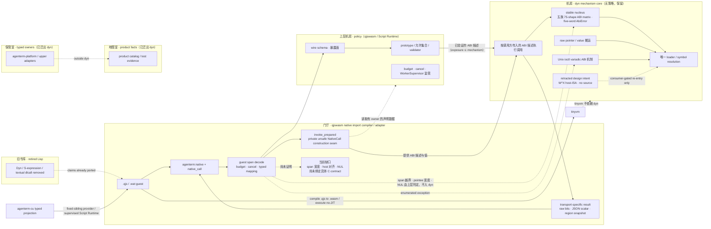

# PRD 02.34 — agenterm-dyn（极小 / Native Importer mechanisms / 底层）

Status: active product node — dyn is the **面向宿主硬件与操作系统的无策略 Native Importer 机制微核**；
当前成熟 family 是 ABI Importer mechanism，另有专用 `ioctl` sibling。它拥有动态链接与
符号解析、按调用方 ABI 描述执行调用、raw value/pointer 搬运、variadic `ioctl` ABI
与机制错误，并由 qjswasm 消费。零消费者的 W^X 实验底座已于 2026-09-15 撤回到设计态。
The former S-expression surface, typed-owner side APIs, and six-cell product catalog have
been removed from dyn after consumer and evidence migration.
Owner: 政委定方向；主会话按独占文件域推进。

Parallel crate `crates/agenterm-dyn`, not a fourth engine, not libagenterm, not cu.

术语只有两层：**Native Importer** 是完整产品概念；**ABI Importer mechanism** 是 dyn
当前最成熟的具体机制 family。这里的 native import 不是 JavaScript 文件导入，也不是权限或插件系统。它表示：
上层给出目标、调用形状与已经准备好的值，底层机制把这份声明连接到宿主进程、
操作系统和硬件能力。动态库 symbol + ABI 是当前最成熟的 family，`ioctl` 已是另一条
专用 family；未来有真实消费者时，syscall、direct host entry 或其他 native mechanism 也可以成为
并列后端，而不必伪装成普通动态库调用。dyn 是 import 的**机制端**；qjswasm 是把 guest
声明、storage 与结果规则降低成该机制调用的 **import compiler/adapter**；tinyvm 只执行
Wasm 与 host bridge；CU 再把有产品意义的 imported mechanism 投射成 typed command。
这四层的依赖方向与所有权不得倒置。

**微核不等于"只有 ABI"**：ABI 调用工具（`abi.rs` 的统一入口 + 五族单态 trampoline）是
当前**最成熟的子树**，不是 dyn 的全部，也不把 dyn 缩成 qjswasm 私有的 FFI helper：
dyn 仍是独立 crate，自带唯一 loader、独立错误词汇、独立执行底座边界与独立的
`ioctl` 机制路径。

## 当前产品身份：无策略的底层动态能力转接（2026-09-12 裁决重写）

**dyn 不是产品层，也不是策略层。** 它是**无产品策略、无允许集合、无授权语义**的
底层动态能力转接：把“能不能用、允许用什么、暴露给谁”全部交给上层，自己只保证
**机制正确**。

**dyn 拥有（机制）**

1. **动态库打开与符号解析**——唯一的 loader/symbol resolution 路径（`libloading`）；
2. **按调用方提供的 ABI 描述执行调用**——调用方给出参数类/返回类（宽度、指针），
   dyn 负责布局与跳转，**不由 dyn 决定“哪些 ABI 允许”**；
3. **raw pointer / value 搬运**——整数、浮点、指针位的传参取回；
4. **必要 ABI 机制**——Unix variadic `ioctl` 特例；
5. **机制错误传播**——真实词汇是 `AbiError::{SignatureUnsupported, LibraryLoad,
   SymbolLookup, ArgumentCount, ArgumentShape}` 与 `unix_ioctl` 的 `UnixIoctlError`。
   dyn **不**产生缓冲区/pointee/NUL/对齐错误：guest span
   宽度、pointee 的最小读写宽度、NUL 终止与 host ABI 对齐由调用方与 qjswasm 判定。

**上层拥有（策略）**

- **qjswasm / Script Runtime**：wire schema、`prototype`/catalog/validator、允许集合、
  暴露面、budget、cancel、`WorkerSupervisor` 监管；
- **typed OS contracts**（owner / snapshot：Mach right、接口地址表、domain/login name、
  realpath、statvfs、groups 等）：移交 **`agenterm-platform`** 或专门的上层 adapter；
  **最终模块落点仍需逐项迁移裁决**，本 PRD 不预先分配；
- **facts / catalog / evidence**：属**产品层与测试层**（六格状态、court/证据模型、
  发布资格），不属于 dyn。

**回答用户问题（已实现 vs 目标态）**

- **已完成**：① **caller-provided `AbiSignature` / `NativeCall` 已是唯一调用入口**——运行时由调用方
  构造描述，dyn 只执行；旧 `invoke_exact` / `invoke_fixed` / `invoke_fixed_pointer` 三入口与
  仅为其服务的 nullable 策略标签已删除（不再是"目标态"）。② 统一入口按**真实 trampoline 支持
  矩阵**分类，超出即 `AbiError::SignatureUnsupported`，从不近似：homogeneous exact 7 个标量族 ×
  arity 0..=6 = **49**、fixed **4**、fixed-pointer **8**、pointer-result **5**、direct-scalar **9**，
  合计 **75** 个单态形状。③ 今天可概括为 **libdl-like（打开库/解析符号）＋ 一部分 libffi-like
  （枚举式固定 ABI 的调用执行）＋ 自有的 ABI 执行基础设施**。
- **尚未达到**：它还**不是 libffi 的完整超集**——参数类由机制矩阵枚举、variadic 只覆盖 `ioctl`
  一个特例、结构体/by-value 传递未做、host ABI 对齐与 pointee 最小读写宽度不由 dyn 校验。
- **机制矩阵 ≠ 产品 exposure**：**机制矩阵**是 dyn 的答案（"这个形状有没有真实 trampoline"），
  **产品 exposure allowlist** 是 qjswasm 的答案（"哪些 symbol/契约暴露给 guest"）。二者关系是
  **exposure ⊆ mechanism**，不要求相等，更不由 dyn 决定；dyn 也不拥有任何 allowlist。
- **目标态**：继续**扩大或参数化 ABI 机制覆盖**（更多参数类/返回类/调用形状）；"是不是 libffi 的
  完整超集"只能由 dyn 的实际支持矩阵回答，不能靠上层策略宣称，也不是上层的"能力"。

**机制正确性留在 dyn，权限语义不在 dyn**：unsafe 契约、错误传播，以及收到
**host 侧 ABI/value/pointer 描述后**的调用布局与执行错误，都是 dyn 的机制职责；
而“哪个 symbol 可用、允许哪种 pointer contract、给谁授权”是**上层策略**。
**guest-memory / schema 校验属 qjswasm door，不属 dyn**：guest span 解码（含
`offset + len` 不溢出且在 Wasm 线性内存内）、参数 kind、nullability 与 schema 判定
全部由 qjswasm 侧完成；dyn 只看到已经解码并验证过的 host 侧描述。
dyn **不**校验 host ABI 对齐、NUL 或具体 callee 的最小读写宽度；这些义务由调用方与
上层 schema/contract 承担，不应被记成 dyn 的策略或授权。

### Markdown tree-DAG（当前功能树）

下面是 DAG，不是互斥目录树：qjswasm 同时依赖三个 invocation family。
**标注说明**：`[已迁出]` 条目是历史能力的去向，不是当前 dyn API；历史交付记录
不抹除，但不得再被读成 dyn 的职责。

```text
agenterm-dyn
├── A. 可执行 Native Importer mechanism core         [机制保留 · 策略迁移]
│   ├── abi                                        [唯一调用入口，调用方给描述]
│   │   ├── AbiSignature / NativeCall / AbiValue    [调用方运行时描述]
│   │   ├── validate_abi / invoke_abi               [一次性 load + 调用的兼容入口]
│   │   ├── validate_abi_signature                  [形状支持查询，不需要参数值]
│   │   ├── LibraryHandle / invoke_abi_with_handle  [可复用句柄：一次 load，多次调用]
│   │   │   └── RAII：Drop 即关闭；句柄属 caller；dyn 不持全局缓存
│   │   ├── validate_abi 只管 argument count / shape；形状支持由族分类回答
│   │   └── 五族单态 trampoline 矩阵 = 机制支持面（≠ 产品 exposure）
│   │       ├── exact: 7 同质标量族 × arity 0..=6                      = 49
│   │       ├── fixed: U64I32 / IsizeI32 / I32U64U64 / I64I32I64I32    = 4
│   │       ├── fixed_pointer: I32Pointer / I32PointerI32 /
│   │       │   I32PointerU64 / I32I32Pointer / I32I32PointerU32 /
│   │       │   I32U64PointerU64 / I32PointerPointer /
│   │       │   I32PointerPointerPointer                               = 8
│   │       ├── pointer-result: ptr() / ptr(u32) / ptr(u64) /
│   │       │   ptr(ptr) / ptr(ptr,usize)                             = 5
│   │       └── direct-scalar: void(ptr) / i64(ptr) / isize(u32) /
│   │           i32(i32,i32,ptr) / i32(i32,i32,u64,ptr,i32) /
│   │           i32(ptr,u32,ptr,ptr,ptr,usize) / usize(i32,ptr,usize) /
│   │           i32(u32,u32) / i32(i32,u32)                            = 9
│   ├── exact_native / fixed_native / fixed_pointer [crate-private family mechanism]
│   │   └── 只暂存 invoke_abi 选择的单态 trampoline；不再公开
│   ├── open_library                                [唯一 loader（libloading）]
│   ├── resolve_symbol<T>                           [分类后唯一 typed lookup/error projection]
│   │   └── 空库名在所有 trampoline family 的公开错误中统一为 <current-process>
│   └── unix_ioctl
│       ├── variadic 调用机制 (i32, i32|u64, ptr) -> i32  [保留]
│       └── UnixIoctlRequest 的“允许签名”          [**策略 → 上层**]
│
├── B. typed native owners / snapshots            [已迁出 dyn]
│   ├── Unix
│   │   ├── InterfaceAddresses       getifaddrs/freeifaddrs 恰一次释放
│   │   ├── SupplementaryGroups      有界 gid 集合
│   │   ├── ResolvedPath             realpath owned bytes
│   │   ├── HostnameSnapshot         native bytes + 真 NUL
│   │   ├── ClockSnapshot            受控 clock id + pointer-free timespec
│   │   └── StatVfsSnapshot          pointer-free filesystem facts
│   └── Darwin
│       ├── MachHostPort             send-right RAII
│       ├── MachTimebaseSnapshot     numer/denom
│       ├── CpuCountSnapshot         hw.ncpu
│       ├── DlAddressSnapshot        copied image/symbol bytes
│       ├── DomainNameSnapshot       bounded native bytes
│       └── LoginNameSnapshot        1024-byte bound + true NUL + native bytes
│
├── C. OS×ISA facts                                 [已迁出 dyn]
│   ├── hosts.rs: win/lnx/osx × x86_64/aarch64
│   ├── Placeholder | LiveDlcall | LiveOwned | LiveDlcallOwned
│   └── CU-adjacent facts（发现/兼容元数据，不是授权策略）
│
├── D. executable-code boundary                     [已撤回到设计态]
│   ├── 旧 exec.rs / exec_error.rs 与自测已删除
│   ├── 原因：零生产消费者、零下游依赖，且 emitted address 未绑定 allocation 生命周期
│   └── 重入门：真实消费者 + 生命周期设计 + 六目标边界 + public court
│
└── E. 小 S-expression 解释器                      [已退役]
    ├── parse.rs + eval.rs + sym.rs + value.rs
    ├── Dyn / Value / Symbol / DynError
    └── native.rs 旧 dlcall 入口

共享边（DAG）
qjswasm ──uses──> A（唯一调用入口 invoke_abi；dyn 不反向决定 exposure）
qjswasm ──Cargo dependency──> dyn ──mechanism dependency──> libc / libloading
dyn ──禁止反向依赖──> qjswasm 的 NativeType / exposure catalog / nullability
qjswasm ──自解码并校验 guest span / nullability / schema──> A
          （dyn 只收到已解码的 host 侧描述：span 越界、pointee 宽度、NUL 由 qjswasm 判定）
qjswasm ──validated ioctl request──> A.unix_ioctl
Script Runtime / CU ──agenterm:native──> qjswasm ──> A
qjswasm ──compile .qjs → .wasm / execute no-JIT──> tinyvm（tinyvm 不依赖 dyn）
B ──historical contracts now belong above dyn──> agenterm-platform / adapters
E ──claims moved to raw ABI or WAT courts──> qjswasm ──> A
D ──retracted; consumer-gated re-entry only──> future JIT / host-ISA folding

上层折叠边（已落地边界，不改变所有权）
qjswasm raw block ─┐
                    ├──> invoke_prepared ──> A.invoke_abi ──> transport-specific result
qjswasm JSON ──────┘          │                                │
                               └─ one NativeCall construction         └─ raw bits / JSON / region

dyn ──稳定的 AbiSignature / AbiValue / AbiError 代数──> 允许上层删除家族专用执行流程
qjswasm ──仍拥有 exposure / nullability / storage / budget──> 但把它们写成声明数据
tinyvm ──仍只提供 Wasm 执行与 host bridge──> 不直接依赖 dyn
CU ──仍经 fixed-sibling provider / typed Executor──> 不直接依赖 dyn
```

### Native import 分层目标与增强路线

产品目标不是把 dyn 扩成任意 FFI，也不是把 qjswasm 的所有代码搬到 dyn；目标是让
新增宿主能力越来越接近“增加一条有 owner 的声明”，而不是复制解析、dispatch、内存、
错误和证据流程。

1. **机制层（dyn）**：今天拥有 loader、symbol resolution、ABI 形状查询、单态 trampoline、
   handle 生命周期、专用 `ioctl` 与机制错误；未来可以容纳 syscall、direct host entry 或其他
   native mechanism family。开放的是 family 空间，不是无条件扩张：每个 family 都必须有
   真实消费者、独立错误边界和可证伪证据。callback、struct-by-value 与 future JIT 仍各需
   独立证据和授权。
2. **降低层（qjswasm）**：从 native declaration 派生 target、ABI values、call-scoped
   storage 与 transport-specific result plan；raw、JSON scalar 与 JSON region 已共用一次
   `NativeCall` construction/invoke seam，但它们有意不同的输入和结果语义不得伪合并。
3. **执行层（tinyvm）**：保持通用 no-JIT Wasm executor，只承载 host bridge，不认识 dyn、
   libc symbol、CU command 或 AgenTerm policy；native import 的收益通过 qjswasm 间接进入 guest。
4. **产品层（CU / Script Runtime）**：把值得稳定发布的 imported mechanism 提升成 typed
   command、身份、预算、取消与证据；不建立 `agenterm-cu -> agenterm-dyn` 静态依赖。
5. **经济门**：增强 dyn 必须带来真实新消费者或让上层删除一份平行机制；折叠 qjswasm
   必须净删控制流、表或 mapper，或用测量证明释放 guest steps/host bytes。只新增 wrapper、
   symbol 特例表或第二份 pointee 真相不是 native import 进展。

当前已知边界也属于设计：同一个 `i32(ptr,ptr)` 可以表示 UUID + timespec，也可以表示
两个 `i32` 出参，所以 prototype 只能描述顶层 ABI，不能凭 symbol 名猜 pointee layout。
具体宽度、对齐、NUL 与 readback 必须由上层有 owner 的 import declaration/schema 表达；
若没有这样的单一真相，安全结果是拒绝新增映射，而不是在 dyn 里建立 symbol allowlist。

### 原子稳定性宪章

“Native Importer 的 family 空间可以继续增长”不等于“dyn 核心可以无界增长”。把 dyn
看成一个原子时，它有稳定内核、可插接机制族与隔离实验槽三层；新能力只能沿已有接缝
增加一个有 owner 的机制族，不能穿透稳定内核另造 loader、错误系统或上层策略。

```text
dyn atom
├── stable nucleus
│   ├── caller-provided AbiSignature / NativeCall / AbiValue
│   ├── one loader + one symbol-resolution path
│   ├── five-family, 75-shape ABI mechanism matrix
│   ├── AbiError five-word mechanism vocabulary
│   ├── one private symbol-load constructor across all mechanism-error families [x]
│   │   └── exact, fixed-scalar and fixed-pointer missing-symbol courts each pin
│   │       the public library, symbol and non-empty loader message projection
│   └── LibraryHandle RAII + one-shot/borrowed-handle parity
├── mechanism-family shell
│   ├── ABI Importer                                      [x]
│   ├── Unix ioctl                                        [x]
│   └── syscall / direct host entry / future families     [ ] consumer-gated
└── retracted experimental slot
    └── W^X host-ISA substrate                            [撤回] no source / no production edge
```

原子性由四类可破坏条件定义，而不是靠“代码很少”的印象定义：

1. **身份漂移**：公开输入/输出代数或五词错误词汇静默变化；
2. **机制分裂**：出现第二 loader、第二 symbol resolver 或绕过统一入口的调用路径；
3. **职责渗漏**：symbol/pointee allowlist、budget、授权、typed OS owner 进入 dyn；
4. **证据失联**：矩阵、句柄复用或新 family 只能由实现自己的正向测试证明，不能被反向变异证伪。

扩展协议固定为：先给出真实非测试消费者与需要删除的上层平行流程；再命名 family
的最小输入/输出代数、独立错误边界和六格证据；最后接入 qjswasm 的同一
declaration → lowering → mechanism → typed-result 管线。若新增代码不能带来新消费者，
也不能净删一份上层机制，它只是候选研究，不进入 stable nucleus。旧 `exec.rs` 正因只有
公开 Rust 面与自测、没有生产边而被撤回；future-JIT / host-ISA 只有在真实消费者、allocation
生命周期绑定、六目标边界与 public court 同时落地后才可重新进入源码。

决定性实验 [`plan/design-dyn-typed-symbol-fold-experiment.md`](../plan/design-dyn-typed-symbol-fold-experiment.md)
已用两个真实 `libsystemd` adapter 作出裁决：通用 dyn typed-symbol seam 在 V0 即被
`Copy` 函数指针逃离 library 生命周期的反例否决；不能用 raw address、`'static` cast 或
第二张签名表修补。platform-private seam 则在第二消费者后净删 8 production NCLOC、把
两个 loader/lookup/rollback/Drop 实现收成一个，并保持 Linux release 整文件逐字节一致。
因此 dyn 原子核不扩张，符号与 product error 仍归两个 adapter，共享装载机制归 platform。

当前机器证据覆盖 75-shape 矩阵、exposure ⊆ mechanism、唯一 loader、句柄复用，
以及五词 `AbiError` 的无 wildcard 穷举兼容性 court。该 court 只冻结机制错误的身份，
不新增错误码或运行时代码；增加第六变体并同步生产 `Display` 后，integration target
会在穷举 match 处以 `E0004` 具名失败。

### dyn 之上的分层折叠路线（已收敛）

这条路线的目标不是把 qjswasm 的策略搬进 dyn，而是让 dyn 的小而
正交的机制代数成为上层删除平行流程的支点。最终形态是“策略在上层，
策略以数据表达；机制在 dyn，机制只实现一次”。

**工程经济目标**：折叠不是审美性重构。它要提高每一字节源码承载的
有效语义，用更少的平行实现同时服务更多 transport、ABI 家族和上层能力。
删除的空间必须转换为可观测的时间、算力、验证或新能力预算，而不是
被新增的间接层抵消。

1. **[x] 收敛共同执行缝**：qjswasm 的六个非 ioctl 生产调用点现在都经
   `invoke_prepared` 构造唯一 `NativeCall`，统一 handle reuse 与 dyn-error mapping；
   raw pointer rebasing、JSON scalar encoding 与 region readback 仍是各 transport 的
   有意后处理。该叶净删 69 LOC，没有新增 struct、trait、branch 或 public API。dyn 内部
   三个 trampoline family 不再各自维护一个随即被丢弃上下文的错误枚举：它们只产生
   同一个私有两词 `MechanismError`，ABI 边界再一次性补齐公开错误所需的 library、symbol
   与 signature 上下文，净删 94 LOC；三族从统一 `AbiValue` 到 family value 的转换与拒绝构造再共用
   一个单态化 helper，净删 10 LOC，同时保留三个具名 trampoline 调用和各自的 unsafe
   证据。五词 `AbiError`、75-shape 矩阵与唯一 loader 均未改变。
2. **[x] 拒绝空壳中间表示**：不引入 `PreparedAbiCall` 或 `NativeOutcome`。
   前者只会给现有的 borrowed spec/arguments 换名，后者会把有意不同的 raw bits、
   JSON scalar 与 region snapshot 伪装成同一种结果；两者都不删除平行真相。
3. **[x] 保持声明与机制的正确分工**：qjswasm 的 14 个 pointer exposure
   声明拥有 `ptr`/`ptr?`、JSON admission 与 UnixIoctl 路由；dyn 的 8 个 pointer
   mechanism 只回答 trampoline 是否存在。一次反向折叠审计确认：nullability 虽已在
   decode 阶段消费，仍不能用 dyn family 查询替代 qjswasm 的 exposure 目录——dyn
   当前有 75 个机制 shape，qjswasm 的 69 条声明只命名 66 个去重 shape，另有 9 个
   mechanism-only shape；直接派生会静默扩大产品面，维护负向排除表又只是把第二张
   真相换向。独立 `ioctl` 路由同样必须留在上层，故该候选判退。
4. **[x] 删除失去读者的派生 ABI 投影**：qjswasm 曾在每次 decode 后写入
   `NativeSignatureClasses`，并公开一个 381-pattern GP/F64 组合账，但生产路径从不读取；
   真正执行已经由 dyn 的 75-shape 查询回答。该投影及其自证测试现已删除，语言级
   `NativeType`、exposure catalog、nullability 与 UnixIoctl 路由保持在 qjswasm。
5. **[x] 用减法验收**：每个增量必须同时证明公开错误/输出不漂移，
   且删除一类家族专用 arm/helper/mapper 或手写清单；只换名不算折叠。
6. **[x] 记录四栏经济账**：每叶记录“删除的重复表达 / 保留的公开语义 /
   释放的 LOC、字节、步数、编译时间或维护触点 / 该预算投入的新能力”。
   无法得到至少一项净减法的候选是新抽象成本，不得冒充折叠。
7. **[-] 暂不扩张机制矩阵**：没有真实消费者的 callback、struct-by-value、
   新 variadic 或 JIT 不得为了“看起来完整”进入 dyn。

公开黑盒 owner 仍是 qjswasm `native_door` / `native_door_schema` / native+ACU
composition court；dyn 自身的 `abi` suite 只证明机制。安全失败是：任何无法
保持原错误词汇、check-before-loader、指针所有权或无 region 路径字节的
折叠候选都停止并保留现状。

### Mermaid flowchart memory-palace（调用与所有权记忆宫殿）

把系统记成五个房间：门厅只解码，机房只执行；保管室、地图室与旧书库已经从
dyn 搬出或关闭。任何新能力必须能指出它进入哪个房间；跨房间复制 loader、
资源释放纪律或 OS×ISA 真相都属于第二份真相。



这张图同时给出禁止项：不得增加第二个 native loader；不得让 guest 直接持有 OS
资源指针；不得把 `LiveOwned` 当成别的 target cell 的 runtime 证据；不得在 legacy
court 的用户主张尚未迁移时只按文件删除小 Lisp；**也不得让 dyn 决定允许集合、
授权语义、budget/cancel，或持有 typed OS owner 与六格 facts**（那些属上层与产品层）；
同样**不得把 dyn 缩成 qjswasm 私有的 FFI helper**，也不得把上层策略搬回机制层——
机制矩阵只回答"这个形状有没有真实 trampoline"，不回答"允不允许"。

### 无策略边界：keep / move / delete 迁移表（2026-09-12 裁决）

| 模块（现 `crates/agenterm-dyn/src/`） | 判定 | 说明 |
|---|---|---|
| `hosts.rs`（six-cell facts / catalog / Placeholder-Live* 状态） | **removed** | 无生产消费者；产品事实继续由实际 qjswasm catalog/courts 表达 |
| `macos_resource.rs`（Mach right、domain/login/timebase、DlAddress…） | **removed** | 无生产消费者；不得在 dyn 复制 typed OS contract |
| `unix_resource.rs`（getifaddrs / statvfs / clock） | **removed** | 等价平台能力由 `agenterm-platform` 的 owning feature 提供 |
| `unix_groups.rs` / `unix_path.rs` | **removed** | 无生产消费者；调用方使用 owning platform/filesystem contract |
| `exact_native.rs` / `fixed_native.rs` / `fixed_pointer.rs` | **internal** | 不再公开；只暂存 `invoke_abi` 按五族矩阵选择的单态 trampoline（49 + 4 + 8），未被选中的形状一律 `SignatureUnsupported`；后续可折叠进统一机制表 |
| `unix_ioctl.rs` | **split** | variadic 调用机制留；“允许签名”判据迁上层 |
| `exec.rs` + `exec_error.rs` | **retracted · 2026-09-15** | 零生产消费者、零下游依赖；`NameTable` 保存的 emitted 绝对地址也未与 `CodeBuffer` allocation 生命周期绑定。实现、公开导出与自测一并删除，future-JIT / host-ISA 保留为 consumer-gated design intent |
| `error.rs` | **removed** | 旧语言错误；当前 ABI/ioctl 机制保留各自 typed error |
| `native.rs`（旧 `dlcall` 入口） | **removed** | textual language entrance retired after court migration |
| `parse.rs` / `eval.rs` / `sym.rs` / `value.rs` | **removed** | language layer retired after equivalent evidence landed |
| `lib.rs` 公开面 | **rewritten** | owner/facts/language exports removed; mechanism exports remain |

**已完成的兼容迁移顺序**

1. **先加机制入口**：引入调用方传入 `AbiSignature` 的 `invoke_abi`；
2. **再搬策略**：qjswasm 本地持有 prototype/catalog/schema，并统一委托 `invoke_abi`；
3. **删除旧入口**：删除不再有调用方的 `invoke_exact`、`invoke_fixed`、
   `invoke_fixed_pointer`；dyn 内部只保留统一入口选择的单态机制；
4. **最后退役语言层与事实层**：在等价证据落地后删除旧 Lisp court、typed owner 与
   six-cell facts。

**不变量（验收必须同时证明）**

- **单 loader / 不新增第二 door**：`crates/agenterm-dyn/src` 内 `dlsym`/`libloading`
  **只有一处**；`crates/agenterm-qjswasm/src` 内仍为 **1（注释）**；新入口是“参数化调用”，
  不是新 loader；
- **策略在上层**：dyn 不得持有允许集合、授权语义、budget/cancel 或 typed owner 的事实；
- **机制正确性**：当前 ABI/ioctl 的 unsafe 契约与错误传播由 dyn 保持；未来 W^X 实现不得仅凭自测或公开类型重入。
- **机制支持可查询**：`validate_abi_signature(signature)` 只凭调用方的 ABI 描述回答
  “这个形状有没有真实 trampoline”，**不需要构造任何参数值**（`validate_abi(call)` 继续负责
  argument count/shape）。该查询不接受、也不拥有 symbol allowlist、nullability、guest span
  或产品 exposure —— 它只能回答机制问题；exposure ⊆ mechanism 由 qjswasm 侧附带 gate 保证
  （见 PRD 02.36）。
- **可复用句柄只做资源生命周期**：`LibraryHandle` 持有一次 load，`invoke_abi_with_handle`
  用同一机制执行（同一 open_library、同一五族矩阵、同一错误词汇）；`invoke_abi` 保持
  “一次性 load + 调用”的兼容语义。句柄**属 caller**，Drop 即关闭（RAII 资源生命周期，
  不是 permission/ownership policy）；dyn **不建全局缓存**，也不因句柄而持有 allowlist、
  schema、budget 或任何 qjswasm 策略。句柄只在 load 层复用：符号解析仍按调用进行，
  第二层缓存不在本能力内。
- **一次 load 服务多次调用是可变异证据，不是声明**：dyn 侧 `exact_native.rs` 的 `#[cfg(test)]`
  载入入口计数按**差值**证明两条路径的相对关系——N 次一次性 `invoke_abi` 使入口计数增长 N，
  一次 `LibraryHandle::open` 加 N 次 `invoke_abi_with_handle` 只增长 1。计数器、访问器与断言全部
  在 `cfg(test)` 内，无 public API、无 feature、发布字节 0。它证明的是**机制载入入口**被进入的
  次数，**不是** OS 级 `dlopen` / `LoadLibrary` 次数。后者依赖平台 loader 的映像保留与
  initializer replay 语义，不是本复用机制的跨平台产品不变量；PRD 02.36 明确将其排除出
  当前验收，除非出现要求该 OS 事实的具名消费者。同一
  integration court 还让 exact、fixed、fixed-pointer、direct-scalar 与 pointer-result 五族各取
  一个真实系统符号，逐值证明一次性入口与复用句柄入口回答一致，并对共享层产生的
  `SymbolLookup` 与 `SignatureUnsupported` 逐错误证明两入口一致；满表回退不再只靠共享实现推断。

**验收证据（建议口径）**

- 两侧 owning tests（`cargo test -p agenterm-dyn`、`-p agenterm-qjswasm`）与现有 native-door
  门测试全绿；两侧 `clippy --all-targets -- -D warnings`、`cargo fmt -p <crate> -- --check`、
  `git diff --check` clean；
- **loader 计数**两侧分别为 1 / 1（且 qjswasm 那处是注释）；
- **机制矩阵扫全**：dyn 侧 `tests/abi.rs` 逐一枚举矩阵（49+4+8+5+9=75）要求
  `validate_abi_signature` 接受，并对矩阵外的形状要求 `SignatureUnsupported`；
- **错误代数扫全**：dyn 侧 `tests/abi.rs` 用一个无 wildcard 的 match 穷举
  `SignatureUnsupported / LibraryLoad / SymbolLookup / ArgumentCount / ArgumentShape`；
  增删改变体必须先显式更新这条兼容性账，不能被零散的 `matches!(..)` 静默漏过；
- **错误身份跨 family 一致**：空库名是当前进程的机制输入；exact、fixed、fixed-pointer、
  pointer-result 与 direct-scalar 的公开 `SymbolLookup.library` 必须都规范化为
  `<current-process>`，不得因私有 trampoline 的错误路径不同而泄露两种身份拼法；
- **exposure ⊆ mechanism**：qjswasm 侧 `native::mechanism_compatibility` 用同一张 dispatch
  表枚举曝光形状（69）逐一问 dyn，并记录“机制有、曝光无”的形状与 `ioctl` 自成一径（u64 请求
  没有 ABI trampoline）；删一个机制形状或伪造一个曝光形状都会具名变红；
- **一条可逆变异**：让 dyn 自行白名单（而不是接受调用方描述）⇒ 相应用例**必须变红**，
  证明策略确实在上层；原地还原并核哈希相等。
- **复用路径可被否证（两条可逆变异各一）**：让 `invoke_abi_with_handle` 忽略句柄、每调用重新
  载入库 ⇒ 载入入口差值用例具名变红；把 qjswasm `invoke_with` 的 adopted-handle 臂改回一次性
  入口 ⇒ 每表命中计数用例具名变红（这条变异正是行为测试看不见的“解析出句柄却不使用”）。
  两条均原地还原并核 sha256 相等。

**非目标（本次裁决新增）**

- dyn 不拥有“**允许哪些 symbol / prototype**”的判据；
- dyn 不拥有 **typed OS owner / snapshot**；
- dyn 不拥有 **six-cell product facts / catalog / evidence / court** 策略；
- dyn 不拥有 **budget / cancel / 监管**；
- 不新增第二 loader、第二 door 或第二套 ABI 执行子系统。

## Exec base (dyn.1, 2026-08-16) — 身份补充 (historical record)

本节是第一刀交付时的历史记录，**不描述当前源码**。该实验于 2026-09-15 撤回：它没有
生产消费者或下游依赖，且 emitted 绝对地址未绑定 allocation 生命周期。`invoke_abi` 的五族
单态 trampoline 从未经过它；重新进入必须满足上面的 consumer-gated 门槛。

第一刀落地进程内活代码缓冲（`src/exec.rs`，unix-gated）。身份分界：**摆字节安全，
跳入 unsafe**。`CodeBuffer` 从第一天走 W^X（写态/执态互斥，永不 RWX）；`NameTable`
记缓冲内 offset（emitted）或一条外部/`dlsym` 地址（foreign，出向调用门）；`enter_i64`
是按 `extern "C" fn() -> i64` 声明签名的跳入门（unsafe，调用者担全部 ABI/字节义务）。
本刀只做执行底座：字节手写（对 nano golden），**不含编码器/汇编器、不含通用补丁/reloc
表、不删 S 式解释器与现有测试、不产 ELF/APE、不管 Windows 执行、不接 cu/chassis**。
`dlcall` 跳板原样保留；新路径是「名字表条目 + 发射的 call」，非删门。

## Historical S-expression scope (retired)

This section preserves the former shipped contract as migration history. The
surface and its implementation have now been removed; the current target and
keep/retire boundary are the tree-DAG above. Statements below describe that
historical surface, not callable current API.

First cut is the body: S-expr + intern + `if` / `set` / `do` + comparisons +
fixnum `+` `-` + bounded `repeat` + one hand (`dlcall`).

- `dlcall` is a Rust integer/pointer trampoline + `libloading`. No C, no libffi.
- `Dyn::eval` is pure and rejects any parsed `dlcall` with
  `DynError::NativeRequiresUnsafe` before execution; `unsafe Dyn::eval_native`
  is the only native-capable entrance. Its caller owns exact fixed ABI,
  pointer validity/alignment/lifetime/aliasing, library/thread requirements,
  resource cleanup and process side effects; Unix `ioctl` is the documented
  variadic compatibility exception.
- ioctl `TIOCGWINSZ` is the gate and is already in the crate (examples + smoke).
- Signature hardening on main: void, arity, empty/blank/overlong names,
  unknown types (`f32` / `struct` / `f64` / `u128` / `usize` / `isize` / `bool`).
- Linux live libc probes + paired S-expr examples (pid/uid/gid/pgid/sid/pgrp,
  `sched_yield` i32 status/alarm, descriptors, tty, access, sysconf pagesize, gethostid,
  getdtablesize, getpagesize, `times`, `getrusage`, `getrlimit`, …).
- 255-byte library/symbol names reach native processing; 256-byte names reject
  before loading or argument evaluation.
- Embedded NUL library and symbol names reject before loading or argument
  evaluation.
- Each `Dyn` retains at most 32 distinct `dlcall` library names. The cache never evicts or
  unloads entries, so an exact cached name remains usable at capacity; a new name rejects with
  `DynError::Library` before argument evaluation and before loading.
- Each `Dyn` retains at most 4,096 distinct bindings across Rust `bind` and S-expression `set`.
  Replacement of an existing name remains valid at capacity; a new `set` returns
  `DynError::StateLimit` before evaluating its right-hand side, so rejection has no nested
  assignment side effect. Binding and `set` targets, interned symbols, libraries, and native
  symbols are limited to 255 UTF-8 bytes and reject interior NUL. Each `Dyn` also retains at most 4,096 distinct
  interned symbols; `Dyn::intern` now returns `Result<Symbol, DynError>`, preserving reuse of
  existing names at capacity and reporting `NameContainsNul`, `NameTooLong`, or `StateLimit` for
  rejected new names. Script source NUL remains a parser rejection before execution.
- C spelling aliases outside the fixed-width ABI whitelist reject before
  loading or argument evaluation.
- The parser accepts exactly 256 nested lists; 257 nested lists return
  `DynError::Parse` before evaluation. This is a stack-resource bound, not a
  caller-policy boundary.
- Parser input is bounded before evaluation: exactly 65,536 UTF-8 bytes and
  4,096 AST nodes (every list and scalar expression counts) accept; the next
  byte or node returns `DynError::Parse`. These parser bounds do not add
  authority semantics or persistent environment quotas.
- Every top-level evaluation shares a 1,000,000-iteration repeat budget.
  `REPEAT_MAX` still permits a single 1,000,000-iteration loop, while nested
  loops reserve from `MAX_TOTAL_REPEAT_ITERATIONS` before their body executes.
  A rejected nested body reports `DynError::RepeatBudgetExceeded` without its
  body-side effects.
- Win six-cell extra probes stay placeholders. **macOS** has the shared
  fixed-ABI live libc rows plus `mach_absolute_time`, `getprogname`,
  `issetugid`, `_NSGetExecutablePath`, `proc_pidpath`, `arc4random`,
  `clock_gettime_nsec_np`, `sysctl`, `mach_timebase_info`, `pthread_main_np`,
  `getlogin_r`, `pthread_threadid_np`, `pthread_getname_np`, `proc_pidinfo`, `_NSGetArgc`,
  `_NSGetArgv`, `_NSGetEnviron`, `proc_pid_rusage`, `_dyld_image_count`, `getentropy`,
  `proc_name`, `pthread_get_stackaddr_np`, `pthread_get_stacksize_np`, `pthread_self`,
  `pthread_cpu_number_np`, `malloc_good_size`, `_NSGetProgname`, `proc_libversion`,
  `pthread_jit_write_protect_supported_np`, `sysctlnametomib`, `pthread_equal`,
  `gethostname`, `confstr`, `clock_getres`, `pthread_is_threaded_np`,
  `_NSGetMachExecuteHeader`, `_dyld_get_image_name`,
  `_dyld_get_image_vmaddr_slide`, `dladdr`, `gethostuuid`,
  `_dyld_get_image_header`, `arc4random_uniform`, `getdomainname`,
  `statvfs`, `gettimeofday`, `getgroups`, and `realpath`.
  `CpuCountSnapshot::acquire` owns only the bounded, pointer-free `hw.ncpu`
  fact rather than exposing general `sysctlbyname` caller buffers.
  `gethostname`, `getdomainname`, `getlogin_r`, `statvfs`, `getgroups`, and
  `realpath` are typed-only snapshot/owner rows; the remaining native-call rows resolve
  through `libSystem.B.dylib`.
  `mach_host_self` is **no longer a placeholder on Darwin**: `MachHostPort::acquire()`
  takes one owned send-right reference and its `Drop` calls `mach_port_deallocate`
  exactly once, with typed `MachHostPortError` and an observable
  `send_right_refs()` count. Every other cell stays a placeholder / typed
  `Unsupported`, and this evidence belongs only to the host ISA that actually ran.
  Both the retiring Lisp court and the current qjswasm native door delegate Unix
  `ioctl` to dyn's signature-gated variadic path for
  `(i32, u64|i32, ptr) -> i32`; neither owns a second variadic implementation,
  and this does not authorize general variadic FFI. CU-adjacent macOS notes name
  AX as a cu live hand.
- Last Linux Wave 8 evidence is `cargo test --locked -p agenterm-dyn` with Rust
  1.97: **150 passed** (25 unit + 40 errors + 11 hosts + 26 language + 48
  cfg-gated Linux smoke; 0 doctests). Wave 9 Darwin-native evidence is GitHub
  Actions `CI / agenterm` success run
  [31873334933](https://github.com/mgttt/agenterm/actions/runs/31873334933)
  at SHA `36e80aa9`, which contains Wave 9 commit `49d8c9af` as an ancestor.
  Native `aarch64-apple-darwin` and `x86_64-apple-darwin` jobs each reported
  **182 passed, 0 failed**: 25 unit + 3 catalog/docs + 40 errors + 11 hosts +
  26 language + 1 macos_ioctl + 45 macos_probes + 4 macos_resource + 27
  cfg-gated macOS smoke; 0 doctests.
  Wave 8 catalog rows (`dladdr`, `gethostuuid`, `_dyld_get_image_header`)
  are live `dlcall`s compared with later native calls.
  Wave 9 adds `arc4random_uniform`, `getdomainname`, and `statvfs` plus a
  portable catalog/documentation gate. On both Darwin architectures,
  the bounded-random, independent domain-name-buffer, and then-current legacy
  `statvfs` field-comparison courts each reported `ok`.
  Wave 9 is therefore host-evidenced and shipped; no Windows result is used as
  a substitute for that evidence.
  Wave 10 originally added `gettimeofday`, `getgroups`, and `realpath` to the Darwin live
  catalog (85 rows). Measured on this aarch64-apple-darwin host with Rust 1.97:
  **185 passed** (25 unit + 3 catalog/docs + 40 errors + 11 hosts + 26 language
  + 1 macos_ioctl + 48 macos_probes + 4 macos_resource + 27 cfg-gated macOS
  smoke; 0 doctests). Native CI remains the evidence gate for current source.
  Host-specific counts, not a cross-platform estimate.

- Current Unix ownership supersedes the legacy Lisp entrance for
  `gethostname`, `statvfs`, and `getgroups`: all four Unix cells expose only
  the bounded typed snapshot/owner APIs, while Windows remains a typed
  `Unsupported` placeholder. Their current courts retain independent direct
  native oracles and typed failure coverage; they no longer claim the removed
  caller-buffer `dlcall` path as product evidence.

## Completed branch accounting

### first cut

Implemented: intern/eval/list language, bounded repeat, and fixed-width
integer/pointer `dlcall` with no C or libffi dependency.

### harden

Implemented: signature/name rejection before load or argument evaluation,
including the pinned 255-byte accept / 256-byte reject name boundary and the
256-list accept / 257-list parse-reject boundary. The shipped ABI remains
deliberately small; this does not authorize a broader type system.

### probes

Integer/void/ptr libc rows are live on Linux (`libc.so.6`) and macOS
(`libSystem.B.dylib`); macOS additionally covers
`mach_absolute_time`, `getprogname`, `issetugid`, `_NSGetExecutablePath`,
`proc_pidpath`, `arc4random`, `clock_gettime_nsec_np`, `sysctl`,
`mach_timebase_info`, `pthread_main_np`, `getlogin_r`, `pthread_threadid_np`,
`pthread_getname_np`,
`proc_pidinfo`, `_NSGetArgc`, `_NSGetArgv`, `_NSGetEnviron`,
`proc_pid_rusage`, `_dyld_image_count`, `getentropy`, `proc_name`,
`pthread_get_stackaddr_np`, `pthread_get_stacksize_np`, `pthread_self`,
`pthread_cpu_number_np`, `malloc_good_size`, `_NSGetProgname`, `proc_libversion`,
`pthread_jit_write_protect_supported_np`, `sysctlnametomib`, `pthread_equal`,
`gethostname`, `confstr`, `clock_getres`, `pthread_is_threaded_np`,
`_NSGetMachExecuteHeader`, `_dyld_get_image_name`,
`_dyld_get_image_vmaddr_slide`, `dladdr`, `gethostuuid`,
`_dyld_get_image_header`, `arc4random_uniform`, `getdomainname`,
`statvfs`, `gettimeofday`, `getgroups`, and `realpath`.
`CpuCountSnapshot::acquire` is the typed-only owner of the fixed `hw.ncpu`
query, not a general `sysctlbyname` interface. The current
`gethostname`, `getdomainname`, `getlogin_r`, `statvfs`, `getgroups`, and
`realpath` rows are typed-only snapshot/owner facts rather than legacy Lisp calls.
`mach_host_self` is owned on Darwin through `MachHostPort` (`acquire()` plus a
`Drop` that deallocates exactly once, typed `MachHostPortError`); the other cells
stay placeholder / typed `Unsupported`, and the real-machine evidence is the host
ISA only. Windows extra probes stay placeholders. No
C shim.
Restore process-global side effects before the test ends. The `umask` claim has
moved to `qjswasm`'s `umask_restore.wat`: an isolated child compares the inherited
mask with direct libc calls before and after the guest, while the guest reads and
restores the mask itself. The duplicate Linux/macOS Lisp wrappers and child courts
are retired.
Windows process and thread identity now run through qjswasm fixtures for
`GetCurrentProcessId` and `GetCurrentThreadId`, with direct Win32 oracles on the
matching host; the duplicate Windows Lisp courts are retired.
The Unix `times` claim now uses one `i64(ptr)` WAT fixture with a field selector;
the matching-host court compares elapsed ticks and all four `tms` fields with
later direct libc baselines. The duplicate Linux/macOS Lisp courts are retired.
The Unix `getrusage` court likewise normalizes the guest-written user and system
`timeval` values to microseconds and compares each with a later direct libc
baseline; its duplicate Linux/macOS Lisp courts are retired.
Existing qjswasm courts also remain the sole executable claims for Unix
`getpid`/`getppid`/`getuid`/`getegid`, page-size `sysconf`, and Darwin
`clock_getres`; their residual scalar Lisp duplicates are retired. Cache and
language-composition courts that happen to call `getpid` remain until those
separate claims migrate.
Unix `getcwd` now exercises dyn's real `ptr(ptr,usize)` mechanism. qjswasm maps
the returned address back to a guest offset only when it lies inside a declared
guest span (null maps to zero); an external host address is a typed refusal. The
WAT court requires buffer identity and NUL termination, then compares the exact
current-directory bytes, replacing the Linux/macOS Lisp courts.
`getpriority(PRIO_PROCESS, 0)` now uses each host's truthful C ABI:
`i32(u32,u32)` on Linux and `i32(i32,u32)` on Darwin. Two monomorphic dyn
trampolines and one parameterized WAT court with a direct libc oracle replace
the two legacy Lisp courts instead of preserving their Darwin type lie.
The raw `ptr(ptr)` mechanism now has a direct `getenv("PATH")` oracle and keeps
the borrowed host address entirely with its unsafe Rust caller. qjswasm does not
publish that address into guest memory; its existing `env_get` tool surface owns
copying environment text. The Linux/macOS Lisp pointer courts are retired while
the Windows CRT loader-fallback court remains separate.
The platform smoke no longer repeats `getpid`, `do + dlcall`, or
missing-symbol/cache assertions. The language integration court still owns the
unsafe native entry and native-error boundary, while `native.rs` unit tests own
the retiring Lisp environment's bounded cache behavior until that layer is
deleted.
The duplicate platform Lisp `ioctl(TIOCGWINSZ)` smokes are also retired. The
direct dyn `invoke_unix_ioctl` court owns the variadic ABI and an owned PTY,
while the qjswasm WAT court owns the same request crossing the existing native
door; neither claim depends on the S-expression entrance.
The final legacy platform smoke file is removed. Its Windows CRT fallback now
tests raw `ptr(ptr)` directly; six-cell catalog invariants remain in the catalog
tests, while X11 and AT-SPI availability belong to the real Linux adapters in
`agenterm-platform`, not to dyn's ABI mechanism suite.
Unix `ioctl` (Linux and macOS) is owned by dyn's `invoke_unix_ioctl` only for the
validated `(i32, u64|i32, ptr) -> i32` signature. The legacy Lisp entrance and
the qjswasm native door both delegate there; the fixed trampoline remains for
every other call and this does not authorize general variadic FFI.
Linux caller-owned `ptr` coverage includes `getcwd`, `uname`, `times`,
`clock_gettime`, `getrusage`, and `getrlimit`. The shared ABI integration court
now selects `libc.so.6` on Linux and `libSystem.B.dylib` on macOS instead of
putting a macOS soname behind `cfg(unix)`: exact `getpid`, fixed `sysconf`,
fixed-pointer `uname`, missing-symbol classification and reusable-handle calls
therefore compile as real Linux tests rather than macOS-only evidence. The
macOS runtime suite is green and both Linux target suites compile. Linux ARM64
runtime is also green on exact source `be9c8dd1`: the ABI integration binary was
built for the glibc 2.28 floor, copied into an aarch64 Linux Lima guest, and ran
all 20 applicable courts with 20 passed / 0 failed. The binary digest was
`df736bde95e0d13402ef5d8d3bdcdd2d8614bd3bb99367590060e885c7f120af`;
the guest reported aarch64 and glibc 2.43. The matching x86_64 binary ran the
same 20 applicable courts with 20 passed / 0 failed in an x86_64 Linux guest
reporting glibc 2.41; its digest was
`1c0233be1e4836ed63bc9261dbf6772a8e7f2688a736f46af80c57a9a7036df0`.
These execute-only courts supersede the earlier UTM startup blocker without
changing that external runner: the missing VirtFS bridge was infrastructure,
not a dyn result.
Windows now has the matching `kernel32.dll` court: one reusable handle serves
three exact `GetCurrentProcessId` calls and one existing `i32(ptr)`
`QueryPerformanceCounter` call, with `std::process` and `windows-sys` as the
independent oracles. Its x86_64 and aarch64 test targets compile; Windows runtime
is green on the native ARM64 `win-aarch64-desktop` execute-only court for exact
source `c3a1e448`. The x86_64 ABI court also builds from current source
`b3897fb0`, but runtime remains unclaimed: `utm-court lease` refuses the declared
`win-x86_64-desktop` before execution because its QEMU Guest Agent did not become
ready within the fixed 600-second emulated-x86 budget. A compiled PE is not
substituted for that missing execution result.

### examples

Each shipped live probe has its paired S-expr documentation and README link.
The prose adds no cu or platform wiring.

## Later — not authorized or implemented

- Fold the intern tree to the host ISA in-process (endgame).
- Absorb wasmbin only as export/pack (intern tree → `.wat` / `.wasm`, `dlcall`
  as import), not as a VM layer.
- Consider libagenterm merge only after this crate is mature.

These are open product decisions, not scheduled branches and not evidence of
implemented functionality. Do not begin them without explicit 政委 direction.

### Re-layering record (2026-09-12, landed)

本节是记录，不是待办：这一波已落地（含叶 1 的 catalog cardinality 本地化）。

Dyn is an important bottom-layer module. **2026-09-12 裁决修正本节口径**：qjswasm 拥有
guest door、内存解码**与全部策略**（prototype/catalog/validator、budget、cancel、监管），
dyn **只拥有机制**——它执行**调用方传入的 ABI 描述**，不再拥有“允许的
exact/fixed/fixed-pointer 集合”。qjswasm 仍有真实的 Cargo 依赖；其 native dispatcher
保留 prototype/catalog 判定与 guest schema，五个 scalar/pointer 执行臂已经统一调用
dyn 的 `invoke_abi`。旧 `invoke_exact` / `invoke_fixed` / `invoke_fixed_pointer` 已删除；
`invoke_abi` 直接选择 crate-private family mechanism。
The former S-expression surface has now been removed: every non-language court
that remained authoritative first gained claim-preserving raw-ABI or qjswasm
WAT evidence, and no production consumer outside this crate used the language API.

- 统一 `abi` 入口已落地：运行时构造的 `AbiSignature` / `NativeCall`
  会按**当前真实 trampoline 矩阵**分类并直接进入 crate-private family mechanism。
  三个旧入口及仅为其服务的 nullable 策略标签已删除。该收口没有新增 loader、
  door 或 ABI 形状。qjswasm 已把 exact/fixed/
  fixed-pointer prototype 枚举、同质族判据和 canonical argument conversion
  本地化，不再导入 dyn 的旧策略枚举或 validator。raw `Pointer` 只有一个
  ABI 位，是否可空及
  pointee 宽度、对齐、NUL 契约仍属调用方与 qjswasm 上层 schema。
  统一入口随后新增 `ptr()` / `ptr(u32)` / `ptr(u64)` 三个真实单态
  pointer-return trampoline；返回值只保留机器地址位，不声明所有权或可解引用性。
  这三个形状的 Darwin direct-oracle court 已接管 `getprogname`、`_NSGetArgc`、
  `_NSGetArgv`、`_NSGetEnviron`、`_NSGetProgname`、`_NSGetMachExecuteHeader`、
  `_dyld_get_image_name(0)`、`_dyld_get_image_header(0)` 与
  `pthread_get_stackaddr_np(pthread_self())`，对应九个 Lisp court 已删除。
  既有 `i32(ptr,ptr)` 机制随后接管 `dladdr` 的状态、符号地址与 image-path
  direct oracle，删除第十个 Lisp court。统一入口又新增真实的
  `isize(u32)` 单态 trampoline，以 signed `isize` direct oracle 接管
  `_dyld_get_image_vmaddr_slide(0)`，不再沿用旧 Lisp court 将返回值伪装成
  pointer 的做法。真实的 `usize(i32,ptr,usize)` trampoline 又接管 `confstr`
  的完整 `size_t` 返回值、NUL 终止输出与 direct native bytes oracle，不再经
  Lisp 的 `u64`/language-integer 表示。`i32(i32,i32,ptr)` raw trampoline
  随后接管 `proc_pid_rusage`；结构体解释仍只存在于 direct-oracle court，dyn
  仅搬运其 opaque pointer。`i32(i32,i32,u64,ptr,i32)` 同样无损接管
  `proc_pidinfo` 的 byte count、PID/PPID 与 direct native fields oracle；
  最后的 `sysctl` court 由真实 `i32(ptr,u32,ptr,ptr,ptr,usize)` trampoline
  接管，保留状态、长度、正 CPU count 与 direct native oracle。由此
  `macos_probes.rs` 已删除，Darwin 专属的非语言 native claims 全部归入
  policy-free ABI court。
  统一机制也新增 result-only `Void` 与真实 `void(ptr)` trampoline；
  `free(NULL)` 的 C-defined no-op oracle 现直接返回 `AbiValue::Void`，不再依赖
  Lisp 的 `Nil` 表示。qjswasm 在自己的上层 catalog 中选择暴露
  `void(ptr?)`，并由 tinyvm WAT court 穿过既有 `native_call` 门验证整条链；
  `Void` 不是参数类型，未列形状仍明确拒绝。
  Unix `getpgrp` 的 Linux/macOS 重复 Lisp court 也已由一个 WAT guest 接管：
  qjswasm 仍拥有 `i32()` 的 catalog 决策，dyn 的统一 ABI 入口只执行，门测试
  与独立 `libc::getpgrp()` 精确比较；该迁移没有增加 loader、door 或允许规则。
  同形的 `getsid(0)` 与 `getpgid(0)` 随后迁入两个 WAT guest；正值断言及
  `libc` 精确 oracle 均保留，Linux/macOS 的三份重复 Lisp court 已删除。
  `getgid()` 与 `geteuid()` 的 `u32()` guest 也沿用同一分层，并以 direct libc
  值作 oracle；对应 Linux/macOS Lisp 断言已从退役表面移除。
  `sysconf(_SC_CLK_TCK)` 与 `sysconf(_SC_NPROCESSORS_ONLN)` 复用既有
  `isize(i32)` 机制；WAT court 保留正值和 direct libc 精确断言，并与已有
  page-size oracle 合并，三份 Linux/macOS Lisp 测试随之退役。
  `getpagesize()` 原先只返回布尔形状检查的 addition fixture 已提升为直接返回值
  的正式 WAT court，并与 `sysconf(_SC_PAGESIZE)` 精确比较；两份 Lisp court
  因而删除，而不是用较弱断言替代。
  `nice(0)` 与 `sched_yield()` 随后复用 exact `i32` 标量机制迁入动态生成的
  WAT guests；前者保留 direct 返回值比较，后者保留 direct status `0` 与精确
  比较，Linux/macOS Lisp courts 已删除。
  `getdtablesize()` 与 `gethostid()` 也改由 exact 无参数 WAT guests 覆盖；前者
  保留正值及 direct equality，后者保留完整 `i64` host-id equality，三份重复
  Lisp courts 已删除。
  `isatty(0..=2)` 也由一个参数化 WAT court 逐描述符调用，并保留 `{0,1}`
  状态约束与 direct libc equality；Linux/macOS 四份 Lisp courts 已删除。
  `access(missing,F_OK)` 现在由含 NUL 结尾合成路径的 WAT guest 覆盖，并与
  direct libc 的 `-1` 精确比较；两份 Lisp failure courts 已删除。
  `dup(0)`/`close(fd)` 由同一 WAT guest 串接：第一次 native 返回的描述符直接写入
  第二次调用记录，失败或关闭非零即 trap；宿主另跑 direct `dup/close` oracle。
  Linux/macOS 两份 Lisp 资源清理 court 已删除。
  `lseek(0,0,SEEK_CUR)` 复用已有 `i64(i32,i64,i32)` fixed trampoline，WAT
  guest 与 direct libc 精确比较（包括合法的 `-1` 非 seekable 结果）；两份 Lisp
  courts 已删除。
  统一机制新增真实 `i64(ptr)` trampoline；qjswasm 在上层 catalog 暴露
  `time(ptr?)`，WAT 以 NULL 调用并与随后 direct libc 时间保持一秒内相邻。
  Linux/macOS 两份 Lisp courts 已删除，nullability 仍不进入 dyn。
  `alarm(0)` 的 WAT court 在独立测试子进程中运行，调用前后均用 direct libc
  确认没有 pending alarm；Linux/macOS 的 wrapper 与 child Lisp courts 已删除。
  `getrlimit(RLIMIT_NOFILE)` 的既有 WAT court 现分别读取 `rlim_cur` 与
  `rlim_max`，并与一次 direct libc 结构体结果逐字段精确比较；补齐原先仅覆盖
  soft limit 的缺口后，Linux/macOS 两份 Lisp caller-buffer courts 已删除。

- [`plan/design-qjswasm-native-door-experiment.md`](../plan/design-qjswasm-native-door-experiment.md)
  owns the qualification ledger and remaining release/runtime evidence. Its bounded
  prototype is now implemented. It still forbids JIT, C/libffi, losing the Unix
  variadic `ioctl` exception, or deleting a shipped language court before equivalent
  current-tree evidence exists.
- `eval.rs` / `parse.rs` / `sym.rs` / `value.rs` and the legacy
  `Dyn` / `Value` / `Symbol` API were deleted after complete executable-court and
  public-consumer migration. The 86-page per-probe S-expression/owner example
  catalog was replaced by eight curated examples of the current raw ABI,
  pointer, cleanup, error, and Unix `ioctl` mechanisms. `hosts.rs` and the
  typed-owner modules were subsequently removed. The unused `exec.rs` experiment was
  later retracted to a consumer-gated design intent.
- Current court migration has moved the scalar, clock-pointer, Darwin output-pointer,
  Mach-clock, and duplicate Darwin `ioctl` claims to qjswasm `.wat` or typed-owner
  evidence. The two-required-pointer `i32(ptr,ptr)` family now carries the
  `gethostuuid` UUID bytes and both `proc_libversion` integer outputs through the
  same dyn prototype, each compared with an independent direct native oracle.
  `getentropy` now uses the enumerated `i32(ptr,u64)` family; its replacement
  court deliberately preserves only the two successful status claims because
  independent entropy buffers have no exact content oracle.
  `sysctlnametomib` uses the enumerated three-required-pointer family; a
  selector-driven WAT fixture returns the output length and every MIB element
  separately so the direct-C array oracle remains exact rather than becoming a
  hash approximation.
  This completed the executable evidence migration that allowed the Lisp courts
  and language files to be removed without deleting their native claims.
- [`plan/design-guest-runtime-placement-experiment.md`](../plan/design-guest-runtime-placement-experiment.md)
  freezes the unresolved product choice between optional static CU linkage and a
  versioned provider ABI. No `guest-run` verb may land before one placement is both
  release-size qualified and reachable through a public black box, then approved by
  the human owner.

This track changes no shipped capability count until its public migration lands, but it
does authorize the bounded native-door prototype, measurements, and follow-on migration
work described by the linked plans.

### Boundary with the supervised qjswasm artifact route

Public `.wasm`/`.qjs` execution has an explicit artifact convention, bounded input,
and `WorkerSupervisor` containment for native-door crashes and hard timeouts.
The qjswasm native door now keeps declaration parsing, nullability, guest-span checks and
the exposed prototype catalog in qjswasm, then delegates all five exact/fixed/fixed-pointer
execution arms through dyn's policy-free `invoke_abi`. Unix `ioctl` continues through its
separate dyn mechanism entry. The public `native-acu-composition-smoke` proves one supervised guest can
compose `agenterm:native` with `agenterm:acu`: that same guest takes one authorized typed
`capabilities` reply through the ACU Executor, its typed `refused` reply for the same verb when
the invocation carries no granted selector, and dyn-backed raw ABI calls before and after both.
This establishes dyn as a real lower layer. The legacy Lisp was deleted only after its
remaining courts moved.

Qjswasm's native-door court does not import typed snapshots from dyn as test
oracles: Mach timebase, CPU count and monotonic clock assertions compare
against independent direct platform calls. Repository-wide consumer checks
therefore allowed the unused dyn owner exports and self-tests to be removed.

In particular, the heterogeneous integer/pointer ABI mechanism and Unix variadic
`ioctl` exception remain independently owned by dyn. Future-JIT work is a re-entry
candidate, not a retained source boundary. The six-cell `hosts.rs` facts, typed owners, and the `Dyn` / `Value` /
`Symbol` language component were removed after their evidence migration completed.

## Non-goals until 政委 orders otherwise

- No JIT / sljit / DynASM / copy-and-patch.
- No lambda / cons / strings / quote.
- No direct `agenterm-cu` or `agenterm-platform` import. CU consumes dyn only through
  the supervised Script Runtime/qjswasm path.
- No libffi, no C dependency, no fourth engine, no thickening libagenterm.
- **No product policy inside dyn**（2026-09-12）：不拥有允许集合/授权语义、不拥有
  typed OS owner/snapshot、不拥有 six-cell facts/catalog/evidence、不拥有 budget/cancel/监管。
- No second loader or second native door: the one loader stays in dyn, the policy moves up.

## Historical owner waves

Earlier waves temporarily placed typed snapshots, resource ownership, and
six-cell product facts in dyn. Those commits remain useful history, but their
APIs, catalogs, tests, and examples have now been removed after repository-wide
consumer and evidence checks. They are not current dyn capabilities and must
not be extended here.
