# `agenterm-qjswasm` — AgenTerm's `.qjs` engine

Parent: [AgenTerm product tree](../PRD.md#product-tree)
Family contract: [PRD 10](PRD_02_10_rhai_scripting.md)

Status: **`[~]` active product engine**.

**`78442d9`**（当前 pin）applies to both `tinyvm` and `tinyvm-qjs`; the source of truth is
`crates/agenterm-qjswasm/Cargo.toml`, and tests must reject PRD/pin drift.

Detailed invention, rejected alternatives, historical pass counts and earlier
pins are preserved in
[`prd/archive/PRD_02_36_agenterm_qjswasm_history_through_v0.1.16.md`](archive/PRD_02_36_agenterm_qjswasm_history_through_v0.1.16.md)
and the earlier focused archive
[`prd/archive/PRD_02_36_agenterm_qjswasm_history_2026-08.md`](archive/PRD_02_36_agenterm_qjswasm_history_2026-08.md).

## Product sentence

`.qjs` is compiled by the pure-Rust `tinyvm-qjs` compiler into standard Wasm,
then validated and interpreted by tinyvm under explicit resource limits. No
QuickJS C library, rquickjs, wasmtime, JIT or executable-memory path is linked.
This crate owns AgenTerm business integration; generic language and VM work is
made in the tinyvm repository and consumed by one exact git revision.

## Markdown-tree DAG

```text
agenterm-qjswasm
├─ pipeline
│  ├─ [x] .qjs parse/lower/encode in upstream tinyvm-qjs
│  ├─ [x] standard .wasm validation + bounded interpretation in tinyvm
│  ├─ [x] persistent slot, named call, typed value and failure translation
│  └─ [x] direct .wasm load/call uses the same validation and Limits
├─ product doors
│  ├─ [x] print and engine-neutral Script host bridge
│  ├─ [x] Fleet facade and public CLI route
│  ├─ [x] qualify / pack / run / bounded check-many
│  ├─ [~] tool.* and release-task coverage grows by product need
│  └─ [ ] every v0.1.18 release-critical journey has live .qjs evidence
├─ robustness
│  ├─ [x] steps, pages, table, call-depth and activation-slot limits
│  ├─ [x] typed load, host, throw and budget failures; failed stdout retained
│  └─ [x] invocation-owned cleanup; no cross-run global backend state
├─ upstream performance frontier
│  ├─ [x] host-op and string/JSON cost measured before changing limits
│  ├─ [x] cached-length/all-ASCII experiment rejected: 166 > 160-step hard gate
│  ├─ [x] static-length dispatch experiment rejected: 160-step gate met, existing workloads regressed
│  ├─ [x] direct producer metadata experiment rejected: its frozen search court reported 10.5 steps/character against <10
│  ├─ [x] ruler audit: old 7.2 subtracted O(n) `.length`; 10.5 was absolute search cost, not a slower loop
│  ├─ [x] corrected attribution: compare/branch owned 6.5 of 10.5 steps/byte
│  ├─ [x] direct i32.xor: search 10.5 → 9.5 steps/byte; emitted modules −6 B
│  ├─ [x] harness journal: serialize once + fs.append; 33-row court 7.43M → 5.45M steps
│  ├─ [~] temporary-region lifetime court: opt-in compile + Engine/Script byte waterline landed; real-journey attribution before L0
│  └─ [-] never raise a product gate merely to hide engine cost
├─ long horizon: tinyvm as a Wasmtime-class alternative
│  ├─ [ ] WebAssembly core conformance + malformed-module differential court
│  ├─ [ ] interpreter cold-start/size/determinism court wins its chosen workloads
│  ├─ [ ] standard embedder API, diagnostics, fuzzing and multi-instance lifecycle
│  ├─ [ ] optional WASI/Component compatibility in tinyvm, never a hidden AgenTerm OS door
│  └─ [ ] replace Wasmtime only per workload after precommitted parity/security/performance gates
└─ non-goals
   ├─ no Node.js / browser-global compatibility promise
   ├─ no WASI as a second OS authority surface
   ├─ no vendored tinyvm source
   └─ no machine-code JIT in the current engine
```

## Mermaid flowchart memory palace

```mermaid
flowchart LR
  SRC[".qjs source"]
  COMP["tinyvm-qjs<br/>parse · lower · encode"]
  WASM["standard .wasm bytes"]
  LOAD{"tinyvm validate<br/>Limits accepted?"}
  SLOT["persistent bounded slot"]
  DOOR["versioned Script host door"]
  PRODUCT["AgenTerm operations<br/>Fleet · tools · process · fs · net"]
  RECEIPT["typed value / stdout / steps<br/>or named failure"]
  UP["tinyvm repository<br/>generic engine write knife"]
  REJECT["reject load/call<br/>host survives"]
  PERF["precommitted performance court"]
  ROLLBACK["gate miss → rollback<br/>retain evidence only"]
  STATIC["static length dispatch court<br/>160 steps · zero slope"]
  REJECT2["reject candidate<br/>join · JSON · object courts regress"]
  DIRECT["direct producer metadata court<br/>join/split pass · search 10.5 misses &lt;10"]
  REJECT3["reject + rollback<br/>preserve evidence, not engine diff"]
  RULER["ruler audit<br/>old 7.2 = absolute search − O(n) length"]
  NEXT["corrected attribution phase A<br/>10.50 absolute − 7.25 historical = 3.25 length"]
  LAYERS["attribution decided<br/>compare/branch owns 6.5 of 10.5 steps/byte"]
  XOR["direct i32.xor accepted<br/>9.5 steps/byte · module −6 B"]
  JOURNAL["harness journal append<br/>33 rows · steps −26.6%<br/>host bytes −84.4%"]
  REGION["temporary-region lifetime court<br/>opt-in waterline probe · attribute dead suffix"]
  REGION_GATE{"L0 >=25% proven-dead<br/>in >=2 real journeys?"}
  REGION_KILL["kill hypothesis<br/>no tracing-GC expansion"]
  PIN["AgenTerm exact pin<br/>tinyvm + tinyvm-qjs same rev"]
  NORTH["long horizon<br/>tinyvm replaces Wasmtime<br/>workload by workload"]
  CORE["Core Wasm conformance<br/>malformed + differential fuzz"]
  COURT{"size · cold start · throughput<br/>security · embedder parity"}
  STANDARD["WASI / Component compatibility<br/>in generic tinyvm layer"]

  SRC --> COMP --> WASM --> LOAD
  UP -. exact git rev .-> COMP & LOAD
  LOAD -->|yes| SLOT --> DOOR --> PRODUCT --> RECEIPT
  LOAD -->|no| REJECT
  SLOT -. budget / throw / host error .-> REJECT
  SLOT -. persistent heap high-water .-> REGION --> REGION_GATE
  REGION_GATE -->|no| REGION_KILL
  REGION_GATE -->|yes| PERF
  COMP -. measured candidate .-> PERF
  PERF -->|all frozen gates pass| UP
  PERF -->|166 > 160| ROLLBACK --> STATIC
  STATIC -->|C2 workload regression| REJECT2 --> DIRECT
  DIRECT -->|frozen D4 miss| REJECT3 --> RULER --> NEXT --> LAYERS --> XOR --> PIN
  PRODUCT --> JOURNAL --> RECEIPT
  UP -. accumulated generic runtime .-> CORE --> COURT
  STANDARD --> COURT
  COURT -->|selected workload wins| NORTH
  COURT -->|gate misses| UP
```



## Invariants

- The execution core receives Wasm bytes, not JavaScript source.
- All untrusted modules pass load-time validation before instantiation.
- tinyvm `Limits` own VM budgets; AgenTerm does not create a second inconsistent
  step/memory model.
- Host capability discovery describes compatibility, not permission.
- Generic compiler/VM fixes land upstream with upstream tests; AgenTerm changes
  only its pin and product integration.
- Both upstream crates use the same exact revision and are never vendored.
- A pin bump updates both Cargo dependencies, `Cargo.lock`, the PRD's first
  bold current-pin revision and `UPSTREAM_TINYVM_REV` in one coherent commit.
- Performance gates are precommitted. A near miss is recorded and rolled back,
  not converted into a pass by moving its threshold after measurement.
- A cost subtraction is part of the measuring instrument. When an experiment
  changes the subtracted operation, that historical ruler cannot compare the
  two implementations; preserve the old verdict, then use a build-only control
  and an independent closure equation in the next experiment.

## Long-horizon north star: replace Wasmtime, not merely coexist

The strategic ambition is for `tinyvm` to become a credible replacement for
Wasmtime, while `tinyvm-qjs` / qjswasm is its flagship language and automation
front end. This is a staged evidence claim, not a current compatibility claim.
The replacement unit is one declared workload at a time; no global claim is
allowed while its required WebAssembly features, host contract or security
court remains missing.

```text
Wasmtime-class replacement ladder
├─ H0 [x] AgenTerm-owned .qjs automation: bounded interpreter + typed host door
├─ H1 [ ] Core Wasm: proposal inventory, spec tests, malformed modules, differential fuzz
├─ H2 [ ] Runtime: stable embedder API, multi-instance lifecycle, cancellation, diagnostics
├─ H3 [ ] Performance: cold start, resident size, throughput and concurrency by workload
├─ H4 [ ] Compatibility: optional WASI/Component adapters in generic tinyvm
└─ H5 [ ] Adoption: replace an existing Wasmtime workload only after its frozen court passes
```

The first battleground deliberately favors the architecture we are building:
small cross-platform automation programs, no executable memory, deterministic
resource accounting, fast cold start, typed host calls and six-cell behavioral
parity. Later courts widen toward general Wasm. Wasmtime remains a reference
oracle and benchmark source during that climb; copying its dependency surface
into AgenTerm would not count as replacement.

WASI and the Component Model, if implemented, belong to the generic tinyvm
repository. AgenTerm still exposes operating-system authority through its
versioned typed Script door. A WASI adapter must not become an undocumented
second route around ACU/AgenTerm product contracts.

## Current acceptance

- [x] active qjswasm runtime executes `.qjs` check/run and expression eval.
- [x] `script api [MODULE] [--status shipped|planned|all] [--tree|--json]` renders one deterministic hierarchical object tree with reviewed Node.js/Bun analogues and returns the same filtered versioned catalog with explicit view and comparison metadata.
- [x] qjswasm computation budget fails closed with the public limit exit class.
- [x] qjswasm tool profile executes bounded child processes with typed failures.
- [x] privacy-bounded audit records contain identity without storing secret payloads.
- [x] qjswasm tool process returns bounded child stdout and stderr.
- [x] qjswasm tool process reports a missing child as a typed failure.
- `cargo test -p agenterm-qjswasm` owns crate behavior; do not pin a historical
  pass count because the suite grows.
- public Script CLI black boxes own `.qjs` route, diagnostics, receipts and
  product-host calls.
- v0.1.18 G4 owns the release-critical task/journey migration. Quick-only green
  cannot substitute for the complete Candidate gate.
- Performance changes require before/after step, wall-time, memory and output
  measurements on the same guest and pin; a larger limit is not an optimization.

Current execution plan: [`plan/plan-v0.1.18.md`](../plan/plan-v0.1.18.md).
