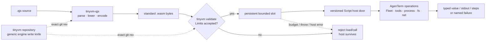

# `agenterm-qjswasm` — AgenTerm's `.qjs` engine

Parent: [AgenTerm product tree](../PRD.md#product-tree)
Family contract: [PRD 10](PRD_02_10_rhai_scripting.md)

Status: **`[~]` active product engine**.

**`028a914`**（当前 pin）applies to both `tinyvm` and `tinyvm-qjs`; the source of truth is
`crates/agenterm-qjswasm/Cargo.toml`, and tests must reject PRD/pin drift.

Detailed invention, rejected alternatives, historical pass counts and earlier
pins are preserved in
[`prd/archive/PRD_02_36_agenterm_qjswasm_history_through_v0.1.16.md`](archive/PRD_02_36_agenterm_qjswasm_history_through_v0.1.16.md)
and the earlier focused archive
[`prd/archive/PRD_02_36_agenterm_qjswasm_history_2026-08.md`](archive/PRD_02_36_agenterm_qjswasm_history_2026-08.md).

## Product sentence

`.qjs` is compiled by the pure-Rust `tinyvm-qjs` compiler into standard Wasm,
then validated and interpreted by tinyvm under explicit resource limits. No
QuickJS C library, rquickjs, wasmtime, JIT or executable-memory path is linked.
This crate owns AgenTerm business integration; generic language and VM work is
made in the tinyvm repository and consumed by one exact git revision.

## Markdown-tree DAG

```text
agenterm-qjswasm
├─ pipeline
│  ├─ [x] .qjs parse/lower/encode in upstream tinyvm-qjs
│  ├─ [x] standard .wasm validation + bounded interpretation in tinyvm
│  ├─ [x] persistent slot, named call, typed value and failure translation
│  └─ [x] direct .wasm load/call uses the same validation and Limits
├─ product doors
│  ├─ [x] print and engine-neutral Script host bridge
│  ├─ [x] Fleet facade and public CLI route
│  ├─ [x] qualify / pack / run / bounded check-many
│  ├─ [~] tool.* and release-task coverage grows by product need
│  └─ [ ] every v0.1.18 release-critical journey has live .qjs evidence
├─ robustness
│  ├─ [x] steps, pages, table, call-depth and activation-slot limits
│  ├─ [x] typed load, host, throw and budget failures; failed stdout retained
│  └─ [x] invocation-owned cleanup; no cross-run global backend state
├─ upstream performance frontier
│  ├─ [~] measure host-op and string/JSON cost before changing limits
│  ├─ [ ] cached code-unit length + all-ASCII bit if decisive evidence wins
│  └─ [-] never raise a product gate merely to hide engine cost
└─ non-goals
   ├─ no Node.js / browser-global compatibility promise
   ├─ no WASI as a second OS authority surface
   ├─ no vendored tinyvm source
   └─ no machine-code JIT in the current engine
```

## Mermaid flowchart memory palace



## Invariants

- The execution core receives Wasm bytes, not JavaScript source.
- All untrusted modules pass load-time validation before instantiation.
- tinyvm `Limits` own VM budgets; AgenTerm does not create a second inconsistent
  step/memory model.
- Host capability discovery describes compatibility, not permission.
- Generic compiler/VM fixes land upstream with upstream tests; AgenTerm changes
  only its pin and product integration.
- Both upstream crates use the same exact revision and are never vendored.
- A pin bump, PRD pin line and lockfile identity change in one coherent commit.

## Current acceptance

- [x] active qjswasm runtime executes `.qjs` check/run and expression eval.
- [x] `script api [MODULE] [--status shipped|planned|all] [--tree|--json]` renders one deterministic hierarchical object tree with reviewed Node.js/Bun analogues and returns the same filtered versioned catalog with explicit view and comparison metadata.
- [x] qjswasm computation budget fails closed with the public limit exit class.
- [x] qjswasm tool profile executes bounded child processes with typed failures.
- [x] privacy-bounded audit records contain identity without storing secret payloads.
- [x] qjswasm tool process returns bounded child stdout and stderr.
- [x] qjswasm tool process reports a missing child as a typed failure.
- `cargo test -p agenterm-qjswasm` owns crate behavior; do not pin a historical
  pass count because the suite grows.
- public Script CLI black boxes own `.qjs` route, diagnostics, receipts and
  product-host calls.
- v0.1.18 G4 owns the release-critical task/journey migration. Quick-only green
  cannot substitute for the complete Candidate gate.
- Performance changes require before/after step, wall-time, memory and output
  measurements on the same guest and pin; a larger limit is not an optimization.

Current execution plan: [`plan/plan-v0.1.18.md`](../plan/plan-v0.1.18.md).
