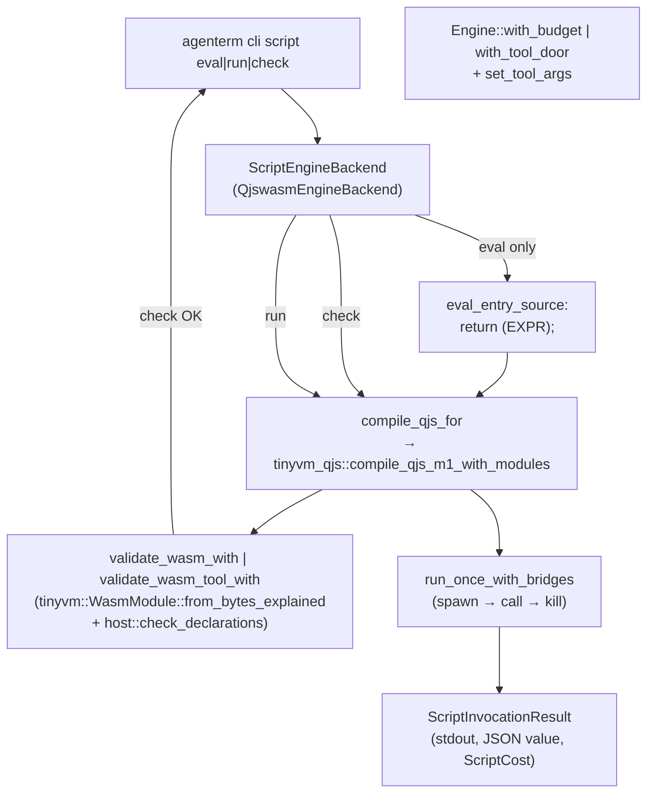
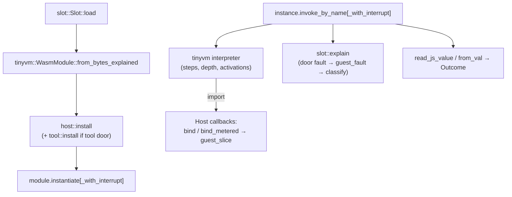

# Read-only review: qjswasm lightweight abstraction and reuse (2026-09-10)

Cloud read-only architecture review of the Script Runtime face (`agenterm-qjswasm`),
its tinyvm pins, and the product wiring in `src/script_engine.rs`. No code changes;
Mac Mini owns live write gates.

---

## Snapshot tip / SHA

| Item | Value |
|------|-------|
| **Repository tip** | `1e901ce2` (branch `main` at review time) |
| **Upstream pin** | `b4883be` — both `tinyvm` and `tinyvm-qjs` (`crates/agenterm-qjswasm/Cargo.toml`, `UPSTREAM_TINYVM_REV` in `lib.rs`) |
| **Crate version** | `agenterm-qjswasm 0.1.16` |
| **Product truth** | `prd/PRD_02_36_agenterm_qjswasm.md` |
| **Design / goal** | `plan/design-agenterm-qjswasm.md`, `plan/goal-agenterm-qjswasm.md` (historical M0 goal; compiler-upstream decision recorded there) |
| **Smoke courts** | `scripts/qjs/script-qjswasm-smoke.qjs` (public runtime/tool/budget/audit), `scripts/qjs/workbench-court.qjs` (isolated GUI phases via `process_command`) |
| **Line budget (owned Rust)** | `lib.rs` 1443 · `host.rs` 1626 · `tool.rs` 2622 · `slot.rs` 751 · `check_many.rs` 547 · `corpus_scan.rs` 115 |

---

## Call path map

### A. Product entry: `script eval` / `script run` / `script check`



**Wiring file:** `src/script_engine.rs` (`QjswasmEngineBackend`, `compile_qjs_for`, `qjs_budget`, `qjs_host_bridges`).

| Step | Owner | What happens |
|------|-------|----------------|
| 1 | CLI (`src/client/mod.rs`) | Resolves backend (`ScriptBackend::Qjswasm`), builds `ScriptInvocationOptions` (profile/tool door, budgets, cancel, env_allow, args). |
| 2 | `eval_entry_source` | Wraps expression as `return (expr);` — ECMA-262 completion value path. |
| 3 | Module resolve | `qjs_module_resolver` + `qjs_roots`: entry parent, `scripts/qjs`, project root; built-ins via product registry. |
| 4 | Compile | `compile_qjs_for` → `tinyvm_qjs::compile_qjs_m1_with_modules` with `Names::Declared(host::declarations())` or `both_doors()` (tool profile). Optional allocation-probe exports when `AGENTERM_QJS_ALLOCATION_PROBE` is set. |
| 5 | Check-only gate | `validate_wasm_*`: decode + limits + static import allowlist (`agenterm.*` / optional `tool.*`). No instantiation → no `start` side effects. |
| 6 | Budget map | `qjs_budget`: maps `operations` → `limits.max_steps`, `host_operations` → `max_host_ops`, `string_bytes` → `max_bridge_result_bytes`; default heap **1024 pages (64 MiB)** via `QJS_MAX_MEMORY_PAGES` (override `AGENTERM_QJS_MAX_MEMORY_PAGES`). |
| 7 | Engine | Sandbox: `Engine::with_budget`. Tool: `Engine::with_tool_door` + `set_tool_args` (CLI `-- ARGS` → `arg_count`/`arg(n)`). |
| 8 | Guest kind | Product path uses `Guest::CompiledQjs(&wasm)` so V1 calling convention survives compile-once/run-later. `Guest::Qjs` compiles inside `spawn`. |
| 9 | Bridges | `HostBridges { fleet, acu }` — fleet from `ScriptFleetBridgeFn`; ACU always wired (`qjs_host_bridges`). |

### B. Slot load → call → result (engine core)



| Step | Owner | What happens |
|------|-------|----------------|
| Load | `slot.rs` | `from_bytes_explained` applies `Budget.limits`; records `Convention::JsV1` or `Wasm`. |
| Door bind | `host.rs` / `tool.rs` | Per-import closures; shared `Meter`, `Pending` buffers, `Rc<RefCell<>>`. Tool door **only** if `Engine::with_tool_door`. |
| Start | tinyvm | `instantiate` runs data/globals/start; cancel/budget refusals surface as `Cancelled` / `Budget` / `Door`. |
| Call | `slot.rs` | `check_entry` (export arity/types **before** guest). Fresh `max_steps` per top-level call. |
| Host op | `host.rs` / `tool.rs` | `Meter::charge` (host_ops + bytes) before work; two-pass fetch for `*_result` (cannot re-enter guest from host callback). |
| Fault | `slot.rs` | Order: cancel → budget refusal → door fault → `tinyvm_qjs::guest_fault()` (heap/throw/capability/…) → `classify` trap/budget. |
| Return | `slot.rs` | JsV1: resolve `(tag, payload)` to owned `JsValue` (`Str` copied out of linear memory before slot death). |

### C. `tinyvm-qjs` compile path (upstream, pinned)

```text
.qjs text
  → lex / parse / AST / IR (tinyvm-qjs)
  → emit V1 runtime + user functions
  → encode standard .wasm (no wasm-encoder crate)
  → optional qjs.lines / fault words / probe exports
```

Public compile API used by agenterm: `compile_qjs_m1_with`, `compile_qjs_m1_with_modules`, `compile_qjs_m1_with_modules_and_allocation_probe`. The name `eval_qjs` in upstream is the expression/eval skin; the product path uses **`compile_qjs_m1_with*`** via `agenterm_qjswasm::compile_qjs*`.

### D. Smoke court touchpoints

| Court | Proves |
|-------|--------|
| `script-qjswasm-smoke.qjs` | API envelope, `script check`/`run` tool profile, `process_command`, `time_*`, step budget (`max_steps`), eval `40+2`, audit redaction |
| `workbench-court.qjs` | Isolated subprocess journeys with per-phase qjswasm budgets |
| Crate tests | `tests/qjs_guest.rs`, `qjs_door.rs`, `tool_door.rs`, `seam_attack.rs`, `allocation_probe.rs` |

---

## Shared vs separate (tinyvm / agenterm-script-common)

### Belongs upstream (tinyvm / tinyvm-qjs) — keep there

| Concern | Where | Why separate |
|---------|-------|--------------|
| Lex/parse/lower/encode | `tinyvm-qjs` | Zero agenterm vocabulary; ECMA-262 authority |
| V1 value representation, bump heap, guest runtime | `tinyvm-qjs` `repr` / `runtime` | Language semantics, not product policy |
| `guest_fault`, thrown-message readers, allocation probes | `tinyvm-qjs` | Guest-side convention; hand-written wasm must not be misread |
| `Limits`, decode/validate, interpreter, `invoke_by_name` | `tinyvm` | `no_std` core; sub-100 KiB discipline |
| `HostFn` / `HostParam` / `HostResult` declaration types | `tinyvm-qjs` `opts.rs` | Generic compiler ↔ embedder contract (`Options.names`) |

### Belongs in agenterm-qjswasm — must stay separate

| Concern | Where | Why not upstream |
|---------|-------|-------------------|
| `agenterm.*` + `tool.*` doors, status codes, two-pass parking | `host.rs`, `tool.rs` | Fleet/ACU/tool policy; receipt semantics |
| Slot isolation, `SlotId` engine tag, `Convention` | `slot.rs` | Product embedder lifecycle |
| `Budget` host-side caps (`max_stdout_bytes`, `max_bridge_result_bytes`, `max_result_string_bytes`, `max_host_ops`, cancel, fixed clock, env_allow) | `lib.rs` | Script worker / task contract |
| `QjswasmError` taxonomy (10+ classes) | `lib.rs`, `slot.rs` | CLI exit classes and operator legibility |
| `compile_qjs` / `check_qjs` door selection | `lib.rs` | Sandbox vs tool is an embedder choice |
| `validate_wasm` import allowlist | `host.rs` `check_declarations` | Security boundary: no WASI surprise imports |

### Already shared correctly (agenterm-script-common)

| Concern | Pattern |
|---------|---------|
| `check-many` manifest/report/deadlines | `agenterm_script_common::check_many` + thin `crates/agenterm-qjswasm/src/check_many.rs` resolver |
| `corpus_scan` walk | `agenterm_script_common::corpus_scan` + 115-line wrapper |
| `sha256_hex` for artifact hash | `agenterm_script_common::hex` |
| CLI flag parsing | `agenterm_script_common::cli` (used by qjs/sql lanes) |

### Duplication / drift risk (candidates to **share**, not merge blindly)

| Duplication | Location | Share target | Notes |
|-------------|----------|--------------|-------|
| `guest_slice`, `bind`, `bind_metered`, `Meter`, `Pending` two-pass | `host.rs`; `tool.rs` imports helpers | **tinyvm embedder kit** or `tinyvm::host` module | Same re-entrancy story documented in both files; 48 tool ops repeat the pattern |
| `SIGNATURES` ↔ `declarations()` parity tests | `host.rs`, `tool.rs` | Generated from one table | Manual dual tables (7 + 48 imports) |
| Fault classification tail | `slot.rs` `explain` + many `guest_*` readers | **Single `qjswasm_fault::classify(instance)`** in tinyvm-qjs | Grows with each new `GuestFault` variant |
| JSON spec/results in tool door | `tool.rs` (~160 `serde_json` touches) | **agenterm-platform typed structs** at boundary | Today: parse JSON in door, call platform, stringify again |
| Module resolver roots | `script_engine.rs`, `check_many.rs` | One `qjs_module_roots()` product helper | Same three roots repeated |
| Compile + validate | `check_qjs_with` and `execute` both full compile | Session-level wasm bytes cache | No cache between `check` and `run` in CLI |

### Must stay separate even if verbose

- **Door vs compiler declarations:** `Names::Declared(...)` is intentionally injected at compile time; tinyvm-qjs must not hardcode `agenterm` / `tool`.
- **Tool door opt-in:** separate `compile_qjs_tool*` and `with_tool_door` — grep-able security surface (PRD 36 A1.1).
- **JsV1 projection to owned `JsValue`:** seam ownership rule; upstream cannot return host `String` without an embedder policy for `max_result_string_bytes`.

---

## Lightweight findings (CPU / RSS / abstraction tax)

### Binary and dependency weight

1. **`tool.rs` (2622 LOC) always compiled in** — `agenterm-platform` features `clipboard`, `contained-process-spawn`, `filesystem-usage`, `process-window` are unconditional in `Cargo.toml`. Sandbox-only binaries still link window/process/clipboard adapters even when `Engine::new()` never calls `tool::install`.
2. **ACU bridge always constructed** — `qjs_host_bridges` sets `acu: Some(...)` for every invocation, including sandbox `eval` and pure compute scripts (`script_engine.rs`).
3. **Large default guest heap** — 1024 pages × 64 KiB = **64 MiB cap per slot** (`QJS_MAX_MEMORY_PAGES`). Persistent slots retain high-water linear memory until `kill`.

### Per-invocation CPU hot spots

4. **Double compile on check → run** — `check` and `execute` each call `compile_qjs_for` with no shared artifact cache in the script engine layer.
5. **Per-compile allocation of declaration vectors** — `host::declarations()`, `both_doors()`, `tool::declarations()` build `Vec<HostFn>` on every compile; `compile_qjs` always passes fresh vecs to upstream.
6. **Host callback overhead** — Every tool/fs/process op: `guest_slice` (UTF-8 validate) → often `serde_json::from_str` / `to_string` → platform call → park bytes in `Pending` → guest two-pass copy. JSON is used where wasm has no record type (documented) but dominates host time on file/process journeys.
7. **Meter on every host entry** — `bind_metered` + `RefCell` borrow on all 55+ bound imports; necessary for receipts, not free on tight loops (`fleet_call` polling, `time_sleep_ms` slices).
8. **Fault path string work** — `explain` may read multiple guest memory views for message extraction; failure paths also allocate `failed_stdout` / `Cost` clones.
9. **Allocation probe path** — `AGENTERM_QJS_ALLOCATION_PROBE` adds exports and extra `invoke_by_name` probes after each call (`heap_bytes`, `json_parse_bytes`, …) — diagnostic only but not zero-cost when enabled.

### Memory churn patterns

10. **String copies at the seam** — Guest `Str` → host `String` on return; host answers → `Vec<u8>` pending → guest bump alloc → `fleet_result`/`tool_result` copy. Intentional (lifetime safety) but 2–3 copies per bridge answer.
11. **`Outcome` vectors** — `tool_calls: Vec<String>` records fully qualified names per op (audit requirement); allocates per call.
12. **`env_allow: Vec<String>`** — Cloned into `Budget` per engine construction from options.

### Abstraction gaps (reuse without blurring boundaries)

13. **No shared “embedder host kit”** between agenterm-qjswasm and tinyvm iOS bridge — two-pass pattern reimplemented locally (`host.rs` comments cite iOS bridge parity).
14. **`check_many` resolver state** — 547-line wrapper duplicates deadline/byte accounting that could be a shared `ResolverBudget` type in `agenterm-script-common` for qjs/sql.
15. **Product registry vs compile** — Built-in modules resolved in `script_engine.rs` and again in `check_many.rs`; correct but two owners to update.

---

## Ranked cut tree

Impact × feasibility for **lightweight** wins and **abstraction/reuse** without opening a full JS engine or stealing Mac Mini write work. Rank 1 = highest priority to pursue in upstream/agenterm split.

```text
R1  Optional `tool-door` feature slice
    ├─ Move `tool.rs` + platform window/process features behind `agenterm-qjswasm/tool-door` (default on for agenterm binary)
    ├─ Evidence: smaller sandbox-only probes; `cargo bloat` on `agenterm` with feature off
    └─ Risk: feature-matrix testing; keep public API stable via type aliases

R2  Shared tinyvm embedder primitives crate/module
    ├─ Extract Meter, guest_slice, bind_metered, two-pass PendingResult from host.rs
    ├─ Consumers: agenterm-qjswasm doors, tinyvm mobile bridge, future embedders
    └─ Risk: API freeze in tinyvm; start as `tinyvm::embed` behind feature

R3  Compile-once between check and run (product layer)
    ├─ `ScriptEngine` caches `(source_label, profile, roots) → wasm` for check+execute pairs
    ├─ Evidence: halve compile CPU on `script run` after `check` in CI
    └─ Risk: cache invalidation on env/probe flags; bounded memory in worker

R4  Declaration table as `const` / include_bytes / codegen
    ├─ Replace per-compile `Vec<HostFn>` with `&'static [HostFn]` (+ `both_doors` static concat)
    ├─ Evidence: fewer allocations on hot `compile_qjs_for` path
    └─ Risk: low; mostly agenterm-qjswasm local

R5  Tool door JSON boundary → platform typed structs
    ├─ Parse `process.command` spec once into `ContainedHeadlessCommand`; serialize result envelope with dedicated writer
    ├─ Cuts serde churn in `tool.rs` hot paths (160 json touches)
    └─ Risk: medium; touch platform crate contracts — coordinate with Mac Mini

R6  Lazy ACU bridge installation
    ├─ Only wire `HostBridges.acu` when module imports `agenterm:acu` or script mentions ACU (static import scan)
    └─ Evidence: cheaper sandbox eval/run; aligns with “imports only if mentioned”

R7  Unified fault classifier in tinyvm-qjs
    ├─ `classify_guest_end_state(instance) -> GuestEndState` replaces growing `slot::explain` match tree
    └─ Risk: tinyvm write knife; agenterm keeps `QjswasmError` mapping only

R8  Consolidate qjs module roots helper
    ├─ Single `fn qjs_resolve_roots(options, entry_path) -> Vec<PathBuf>` used by execute, check, check_many
    └─ Low risk, small duplication cut

R9  Slot memory reuse policy
    ├─ Document/default lower heap for eval/one-shot; encourage `kill` after OOM; consider arena reset only if tinyvm gains safe guest heap rewind (upstream)
    └─ RSS win for worker pools; no local hack without upstream support

R10 check_many resolver budget struct in script-common
    ├─ Share deadline + aggregate byte counters between qjs and sql wrappers
    └─ Maintainability > raw CPU
```

### Suggested sequencing (read-only recommendation)

1. **R4 + R8** — agenterm-local, no upstream conflict.  
2. **R3 + R6** — product worker wins, docs in PRD 36 only.  
3. **R1** — needs feature design + CI matrix.  
4. **R2 + R7** — tinyvm repo cuts (Mac Mini / upstream owner).  
5. **R5** — cross-crate, after R1/R2 stabilize door surface.

---

## Explicit non-goals

- **No full JavaScript engine** — ECMA-262 subset stays in `tinyvm-qjs`; this review does not propose QuickJS, JIT, or wasmtime restoration.
- **No Mac Mini write steal** — upstream compiler/runtime edits, native-lowering, and gate changes remain on the machine that owns live write gates; this document is cloud analysis only.
- **No implementation in this pass** — no refactors, feature flags, or PRs with code; docs-only landing.
- **No permission policy in the runtime** — tool vs sandbox is caller-selected door policy, not a new sandbox inside script profiles (per AGENTS.md Script Runtime rules).
- **No WASI / second OS surface** — import allowlist discipline stays; expanding `tool.*` is product-scoped, not “run arbitrary WASI modules.”
- **No merging qjswasm with legacy qjs/rquickjs** — separate backends remain; extension routing is intentional (`script_backend.rs`).

---

## References (in-repo)

- `crates/agenterm-qjswasm/README.md` — capability table and door ABI  
- `plan/design-agenterm-qjswasm.md` §2–§7 — layering, doors, two-pass ABI  
- `prd/PRD_02_36_agenterm_qjswasm.md` — product tree, pins, performance frontier notes  
- `src/script_engine.rs` — `QjswasmEngineBackend`, budget mapping, compile/check/execute  
- `scripts/qjs/script-qjswasm-smoke.qjs` — shipped public black-box court  
