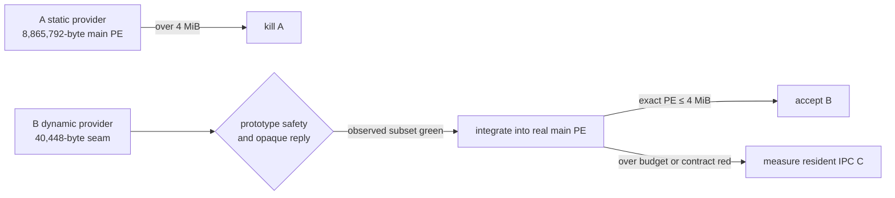

# ACU embedder delivery experiment — results

Status: **B survives; exact integrated main-PE court required.** This result
does not promote the prototype into product code and does not waive any hard
gate in `plan/design-acu-embedder-delivery-experiment.md`.

## Reproducible source identity

- Repository HEAD during the final measurement: `0c9fb2f6abdf7ffc342610cecb5bd50d80848aff`.
- Toolchain: `rustc 1.97.0`; `cargo-xwin 0.23.1`.
- Host/execution: macOS arm64. Windows artifacts were cross-built for
  `x86_64-pc-windows-msvc` and measured by filesystem byte length; they were
  not executed in this experiment.
- Prototype source SHA-256 values are intentionally recorded beside the files
  in the table below so the uncommitted experiment state is not confused with
  HEAD.

| file | SHA-256 |
|---|---|
| `provider/src/lib.rs` | `5f946303da9f230c16c044f46096b77adf23a503d8555df3bb4f083f0c041f47` |
| `loader-probe/src/main.rs` | `4e4d1512ce3b82592f8c45e22a784b118300bf60eb901b5f8c7cd4e22d326145` |
| `empty-probe/src/main.rs` | `536e506bb90914c243a12b397b9a998f85ae2cbd9ba02dfd03a9e155ca5ca0f4` |

## Measurements

Windows x86_64 release artifacts used `opt-level=z`, Thin LTO, one codegen
unit, unwind containment and stripping.

| level | artifact / calculation | bytes | verdict |
|---|---|---:|---|
| L1 | empty probe | 110,080 | intercept only |
| L1 | load-once probe | 150,528 | intercept plus loader seam |
| L1 | loader seam delta | 40,448 | small enough to integrate and measure |
| L2 | ACU provider DLL | 9,576,448 | reported, never hidden from delivery size |
| projection only | historical base `agenterm.exe` + seam delta | 3,772,416 | below 4 MiB, but **not H0 evidence** |

The macOS arm64 release artifacts were 323,120 bytes for the empty probe,
341,456 bytes for the loader probe, and 5,993,888 bytes for the provider.

One native provider load followed by 32 calls produced:

- load: 420,809,583 ns (cold filesystem/loader sample);
- first ACU call: 2,014,000 ns;
- steady-call median: 13,042 ns;
- steady-call p95: 49,458 ns.

The 32 calls ran through one loaded library and no child process. A legal
authorization refusal crossed status zero as an opaque `CuReply` with
`ok:false`; with `AGENTERM_CU_GRANT=observe`, the same command crossed as a
52,123-byte `ok:true` reply. A missing provider failed closed as
`provider_missing:load_failed` with exit code 1.

## Gate result and decision

- A remains killed by the already reproduced exact main-PE size court.
- B passes the measured load-once/no-spawn, opaque-success/opaque-refusal,
  bounded-buffer, native panic-containment and six-platform loader-primitive
  design checks. It therefore wins the right to an exact product integration
  court.
- B is **not accepted yet**: this experiment did not build the real integrated
  `agenterm.exe`, and did not execute Windows or all raw-failure fixtures.
- C remains unimplemented. It is only opened if integrated B fails a hard
  semantic/safety/size gate; latency or preference alone does not justify the
  extra resident-process protocol.

Next decisive action: integrate B behind the existing `AcuBridgeFn`, ship the
provider as a sibling artifact, and measure the same-SHA stripped Windows
`agenterm.exe`. Provider absence, ABI mismatch and call failure must stay typed
and must never fall back to static CU, CLI, shell, or MCU.
