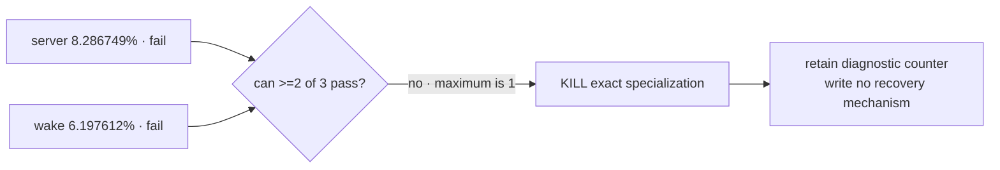

# D0 attribution result

Status: **D0 failed · exact specialization killed · attribution retained**.

The deciding diagnostic meter was exercised on exact AgenTerm revision
`b64a3454` with tinyvm revision `f303132`, Rust 1.97.0, on macOS aarch64. Both
trees were clean. No allocator rewind, restore, free, or reuse code exists.

```text
D0 court
├─ server-smoke [x] macOS aarch64 native execution
│  ├─ run allocation: 1,171,364 bytes
│  ├─ immediate stringify→host attribution: 97,068 bytes
│  └─ ratio: 8.286749% → fails frozen 10%
├─ wake-smoke [x] macOS aarch64 native execution
│  ├─ run allocation: 1,669,740 bytes
│  ├─ immediate stringify→host attribution: 103,484 bytes
│  └─ ratio: 6.197612% → fails frozen 10%
└─ workbench-smoke [-] not run: even a pass leaves only one of three rows passing
```

| workload | execution | run allocation B | eligible B | ratio | ≥64 KiB | ≥10% | D0 row |
|---|---|---:|---:|---:|---|---|---|
| server | native macOS aarch64 | 1,171,364 | 97,068 | 8.286749% | yes | no | fail |
| wake | native macOS aarch64 | 1,669,740 | 103,484 | 6.197612% | yes | no | fail |
| workbench | not run; result already forced | — | — | — | — | — | not needed |

The earlier Windows x86_64 row remains rehearsal history, not part of the
deciding table. The manifest still labels these task projections Windows-only,
so the deciding run invoked the same `server-smoke.qjs` and `wake-smoke.qjs`
entries directly with native binaries and their frozen 300-second / one-billion
step budgets. Both scripts are already host-shaped; no source, threshold,
workload, budget or diagnostic meter changed.

Both valid rows exceed the absolute 64 KiB threshold but fail the 10% ratio.
D0 requires at least two of three rows to pass. With two rows already failed,
the best possible final count is one, so the Boolean result is forced without
running workbench. Per the precommitted decision tree, Variant B is killed
before any safety or allocator-reuse implementation.

## Decision trace



S0/L0/B0/C0/Z0 are intentionally not run because D0 is the first Boolean gate.
No measurement was changed after observing the result. The result overturned
the optimistic reading of the 64 KiB absolute count: the exact region is real,
but it owns less than one tenth of allocation in both deciding journeys.

## Exact rerun commands

From repository root with the exact revisions above and clean trees:

```bash
AGENTERM_QJS_ALLOCATION_PROBE=1 target/debug/agenterm cli script run --profile tool --json --timeout-ms 300000 --max-operations 1000000000 scripts/qjs/server-smoke.qjs -- . target/debug/agenterm target/debug/agenterm
AGENTERM_QJS_ALLOCATION_PROBE=1 target/debug/agenterm cli script run --profile tool --json --timeout-ms 300000 --max-operations 1000000000 scripts/qjs/wake-smoke.qjs -- . target/debug/agenterm target/debug/agenterm
```

For each row, `run allocation = cost.heap_bytes - cost.heap_start_bytes` and
`eligible ratio = cost.immediate_stringify_host_argument_bytes / run allocation`.
