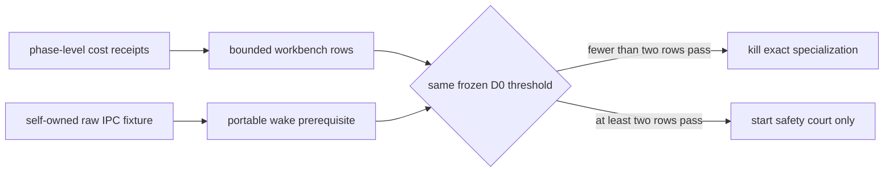

# D0 attribution result

Status: **measurement incomplete · Variant B forbidden**.

The diagnostic meter was exercised on exact AgenTerm revision `311ed139` with
tinyvm revision `f303132`. Both trees were clean. No allocator rewind, restore,
free, or reuse code exists.

```text
D0 court
├─ server-smoke [x] native execution and complete cost receipt
│  ├─ run allocation: 1,947,848 bytes
│  ├─ immediate stringify→host attribution: 97,516 bytes
│  └─ ratio: 5.006% → row fails the frozen 10% threshold
├─ wake-smoke [!] product run stopped at a missing guest Python prerequisite
└─ workbench-smoke [!] no atomic receipt before the bounded court deadline
```

The Windows x86_64 result is rehearsal evidence, not the experiment's accepted
D0 table. The frozen design named macOS aarch64, but the repository task
manifest declares all three chosen product journeys Windows-only and supplies
Windows `.exe` arguments. That contradiction was discovered by attempting the
named macOS route and must not be hidden by silently changing the target after
seeing a number.

The one valid row is already evidence against the optimization: although it
exceeds the 64 KiB absolute threshold, only 5.006% of run allocation belongs to
the exact immediate-consumer shape. It cannot decide D0 because the two missing
rows could still theoretically both pass. Therefore the only allowed result is
`d0_decided=false`; Variant B remains closed.

## Next measurement knife



The next run must preserve the three workload identities and thresholds. It may
repair evidence publication and replace the incidental external Python helper
with a repository-owned equivalent; it may not reduce the journeys, raise
budgets, or implement allocator reuse first.

